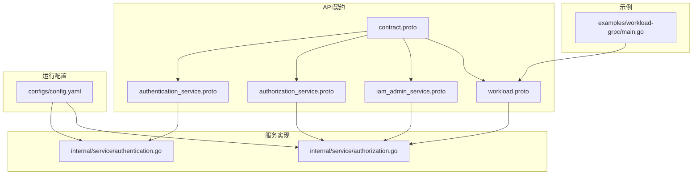
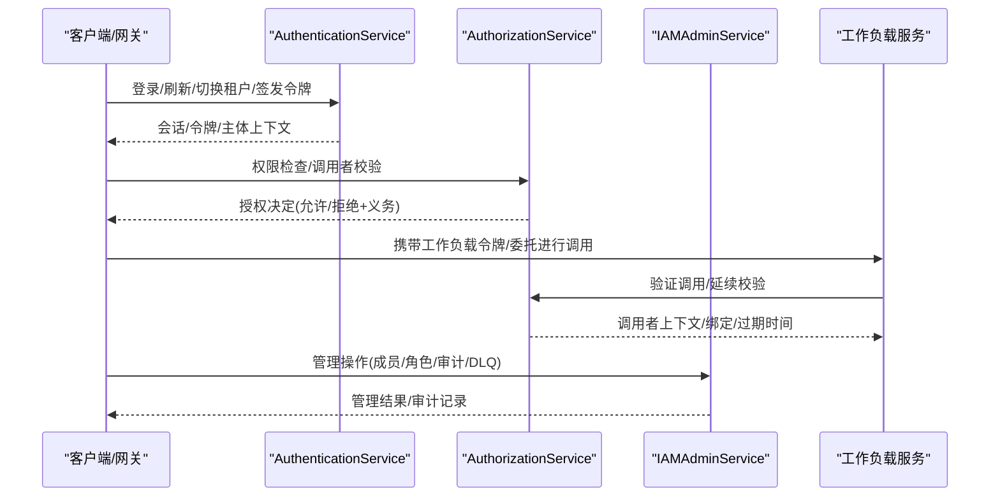
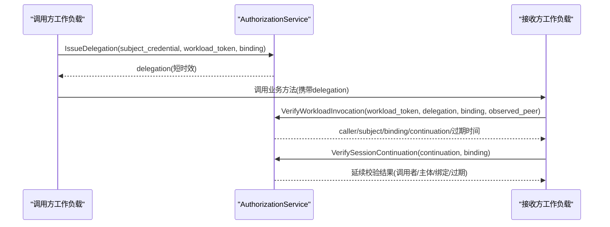
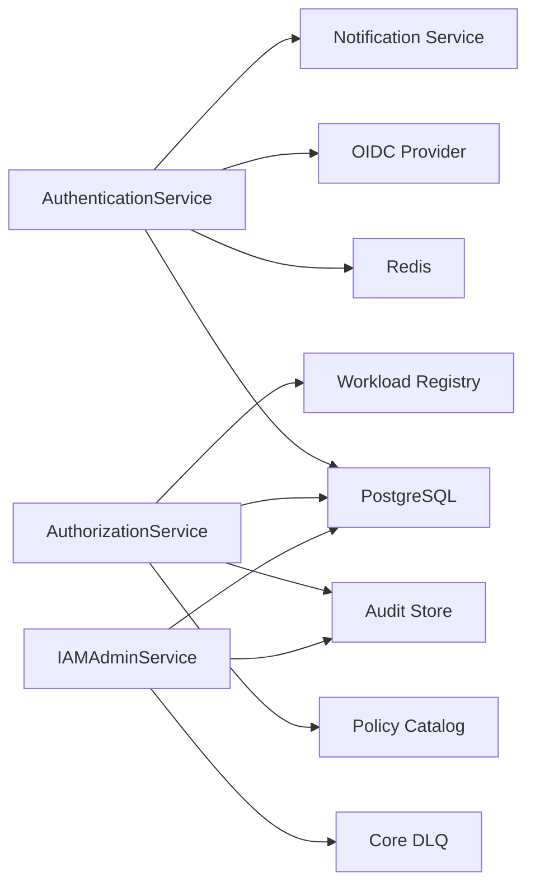

# API参考

<cite>
**本文引用的文件**
- [authentication_service.proto](file://api/iam/v1/authentication_service.proto)
- [authorization_service.proto](file://api/iam/v1/authorization_service.proto)
- [iam_admin_service.proto](file://api/iam/v1/iam_admin_service.proto)
- [workload.proto](file://api/iam/v1/workload.proto)
- [contract.proto](file://api/iam/v1/contract.proto)
- [authentication.go](file://internal/service/authentication.go)
- [authorization.go](file://internal/service/authorization.go)
- [config.yaml](file://configs/config.yaml)
- [main.go（示例）](file://examples/workload-grpc/main.go)
</cite>

## 目录
1. [简介](#简介)
2. [项目结构](#项目结构)
3. [核心组件](#核心组件)
4. [架构总览](#架构总览)
5. [详细组件分析](#详细组件分析)
6. [依赖关系分析](#依赖关系分析)
7. [性能与可用性](#性能与可用性)
8. [故障排查指南](#故障排查指南)
9. [结论](#结论)
10. [附录：版本、兼容性与迁移](#附录版本兼容性与迁移)

## 简介
本参考文档面向ANI IAM v1的gRPC服务接口，覆盖以下四类能力：
- 认证与会话：AuthenticationService
- 授权决策：AuthorizationService
- 管理面：IAMAdminService
- 工作负载（Workload）调用链验证：workload.proto 定义的消息与调用流程

文档提供每个端点的请求/响应消息、参数校验规则、错误码规范、返回值格式说明，以及客户端集成要点与调试建议。所有信息均基于仓库中的Proto定义与服务实现映射。

## 项目结构
- API契约位于 api/iam/v1，包含四个核心Proto文件，定义了服务、消息、枚举和错误类型。
- 服务实现位于 internal/service，将gRPC请求映射到领域用例并统一错误映射。
- 配置位于 configs/config.yaml，描述gRPC监听地址、TLS、OIDC、策略版本等运行时参数。
- 示例位于 examples/workload-grpc，演示工作负载侧如何发起鉴权并调用目标服务。

图表来源
- [authentication_service.proto:1-33](file://api/iam/v1/authentication_service.proto#L1-L33)
- [authorization_service.proto:1-16](file://api/iam/v1/authorization_service.proto#L1-L16)
- [iam_admin_service.proto:1-73](file://api/iam/v1/iam_admin_service.proto#L1-L73)
- [workload.proto:10-121](file://api/iam/v1/workload.proto#L10-L121)
- [contract.proto:13-212](file://api/iam/v1/contract.proto#L13-L212)
- [authentication.go:91-106](file://internal/service/authentication.go#L91-L106)
- [authorization.go:17-25](file://internal/service/authorization.go#L17-L25)
- [config.yaml:1-61](file://configs/config.yaml#L1-L61)
- [main.go（示例）:60-77](file://examples/workload-grpc/main.go#L60-L77)

章节来源
- [authentication_service.proto:1-33](file://api/iam/v1/authentication_service.proto#L1-L33)
- [authorization_service.proto:1-16](file://api/iam/v1/authorization_service.proto#L1-L16)
- [iam_admin_service.proto:1-73](file://api/iam/v1/iam_admin_service.proto#L1-L73)
- [workload.proto:10-121](file://api/iam/v1/workload.proto#L10-L121)
- [contract.proto:13-212](file://api/iam/v1/contract.proto#L13-L212)
- [authentication.go:91-106](file://internal/service/authentication.go#L91-L106)
- [authorization.go:17-25](file://internal/service/authorization.go#L17-L25)
- [config.yaml:1-61](file://configs/config.yaml#L1-L61)
- [main.go（示例）:60-77](file://examples/workload-grpc/main.go#L60-L77)

## 核心组件
- AuthenticationService：负责人类用户与工作负载的身份认证、会话生命周期、OIDC登录/身份绑定、密码操作、租户切换、会话列举/撤销、主体校验、工作负载令牌签发与委托。
- AuthorizationService：提供统一的“失败关闭”授权决策入口，支持工作负载调用者校验、会话延续校验、权限检查与工作负载调用验证。
- IAMAdminService：平台与租户的管理面能力，涵盖成员、角色、邀请、API Key、审计事件、租户引导、DLQ重放、恢复双控等。
- Workload相关消息：InvocationBinding、WorkloadPeer、DirectWorkloadCaller、IssueDelegation、VerifyWorkloadInvocation、VerifySessionContinuation、VerifyWorkloadCaller。

章节来源
- [authentication_service.proto:11-33](file://api/iam/v1/authentication_service.proto#L11-L33)
- [authorization_service.proto:10-16](file://api/iam/v1/authorization_service.proto#L10-L16)
- [iam_admin_service.proto:10-73](file://api/iam/v1/iam_admin_service.proto#L10-L73)
- [workload.proto:10-121](file://api/iam/v1/workload.proto#L10-L121)

## 架构总览
ANI IAM采用“认证-授权-管理-工作负载”分层协作模式：
- 认证层处理凭据校验与会话管理，产出可信上下文 PrincipalContext。
- 授权层基于策略与目标属性给出明确的允许/拒绝决定，并可附带义务（Obligation）。
- 管理面用于资源编排、成员与角色管理、审计与恢复。
- 工作负载链路通过短时效令牌与委托机制，确保跨进程调用的可验证性。

图表来源
- [authentication_service.proto:11-33](file://api/iam/v1/authentication_service.proto#L11-L33)
- [authorization_service.proto:10-16](file://api/iam/v1/authorization_service.proto#L10-L16)
- [iam_admin_service.proto:10-73](file://api/iam/v1/iam_admin_service.proto#L10-L73)
- [workload.proto:46-121](file://api/iam/v1/workload.proto#L46-L121)

## 详细组件分析

### AuthenticationService
职责：人类与工作负载的认证、会话、OIDC、密码操作、租户切换、主体校验、工作负载令牌与委托。

主要RPC与消息要点
- PasswordLogin：创建控制台或BOSS会话；需提供账户、密码、受众、边界、设备名、幂等键、可信源IP。返回访问令牌、刷新令牌、会话摘要、授权摘要与主体上下文。
- BeginOIDCLogin/CompleteOIDCLogin：两阶段OIDC登录；Begin返回授权URL与状态；Complete返回与PasswordLogin相同的会话结果。
- BeginOIDCIdentityLink/CompleteOIDCIdentityLink：已认证身份绑定；支持浏览器回调证明；完成返回绑定的身份与主体ID。
- RequestPasswordAction/CompletePasswordAction：非枚举的密码设置/重置流程；返回操作ID与过期时间，完成后返回变更结果。
- RefreshSession/LogoutSession：刷新会话与登出；需要刷新令牌、CSRF、来源；登出幂等且不泄露是否存在。
- SwitchTenant：在已认证基础上切换到指定租户边界，返回新令牌与刷新秘密。
- ListSessions/RevokeSession/RevokeAllSessions：列举与撤销会话；列表不含敏感凭据。
- ValidatePrincipal：校验原始Bearer凭据与策略版本，返回最小可信主体上下文、决策ID与策略版本。
- IssueWorkloadToken：为mTLS工作负载签发短期受众受限令牌（不可刷新，最长五分钟）。
- IssueDelegation：为一次具体业务调用重新授权实际主体，返回短时效委托。

参数校验与约束
- source_ip仅由可信网关提供，服务端会哈希后用于限流键构造。
- BOSS受众要求平台边界；其他受众需有效租户边界。
- OIDC流程使用一次性state/code与redirect_uri严格匹配。
- 幂等键用于防重放，冲突或过期会返回特定错误。

错误处理
- 统一通过google.rpc.ErrorInfo注入稳定reason与元数据；常见reason包括无效参数、凭据无效、权限拒绝、速率限制、IAM不可用/超时、租户未就绪、幂等冲突、版本冲突、会话撤销、授权策略不匹配等。

最佳实践
- 客户端应缓存策略版本并在必要时重试；对Rate Limit进行退避。
- 使用RefreshSession维持会话，避免频繁登录。
- 工作负载调用优先使用IssueWorkloadToken与IssueDelegation，缩短暴露面。

章节来源
- [authentication_service.proto:11-33](file://api/iam/v1/authentication_service.proto#L11-L33)
- [authentication_service.proto:35-290](file://api/iam/v1/authentication_service.proto#L35-L290)
- [authentication.go:108-194](file://internal/service/authentication.go#L108-L194)
- [authentication.go:476-761](file://internal/service/authentication.go#L476-L761)

### AuthorizationService
职责：单一“失败关闭”的授权决策入口，支持工作负载调用者校验、会话延续校验、权限检查与工作负载调用验证。

主要RPC与消息要点
- CheckPermission：传入原始凭据、操作ID、策略版本与目标属性，返回明确授权决定（允许/拒绝）、原因、决策ID、主体上下文、义务与策略版本。
- VerifyWorkloadCaller：接收方以自身mTLS身份与观测到的对端信息，校验工作负载调用者是否被允许调用该操作/方法/HTTP路径。
- VerifySessionContinuation：对之前已准入的请求进行在线延续校验，返回调用者、主体、绑定与过期时间。
- VerifyWorkloadInvocation：结合工作负载令牌、委托、绑定与观测对端，返回当前调用者、主体、绑定、过期时间与延续引用。

参数校验与约束
- 目标tenant_id必须为合法UUID；否则返回无效参数。
- 工作负载调用需同时满足操作注册、策略版本一致与目标修订一致性。

错误处理
- 策略不匹配、操作未注册、租户生命周期陈旧、IAM不可用/超时等均会返回稳定reason。

最佳实践
- 调用方应在每次关键步骤前携带policy_revision，遇到不匹配时拉取最新策略并重试。
- 对义务（如资源租户匹配）由拥有处理器执行最终校验。

章节来源
- [authorization_service.proto:10-40](file://api/iam/v1/authorization_service.proto#L10-L40)
- [authorization.go:27-67](file://internal/service/authorization.go#L27-L67)
- [contract.proto:193-206](file://api/iam/v1/contract.proto#L193-L206)

### IAMAdminService
职责：平台与租户的资源管理、成员与角色、邀请、API Key、审计、租户引导、DLQ重放、恢复双控等。

主要RPC分类与要点
- 成员与角色
  - 创建/更新/删除/绑定/解绑平台与租户角色；列出角色与权限目录。
  - 创建/更新/移除平台与租户成员；列出成员。
- 邀请
  - 创建/取消/重发平台与租户邀请；接受邀请；获取邀请详情。
- API Key
  - 创建/列出/撤销API Key；创建时返回一次性密钥。
- 审计
  - 列出/获取平台与租户审计事件；审计为追加型安全事实。
- 租户引导与作业
  - 获取租户引导操作、重发邀请、重试作业；返回作业状态与尝试次数。
- DLQ（死信队列）
  - 列出/获取Core DLQ条目；重放原始消息；返回尝试与审计关联信息。
- 恢复双控
  - 请求/批准/执行恢复引导与恢复租户管理员；需要指纹与二次认证证明。

参数校验与约束
- 多数写操作支持expected_version与idempotency_key，防止并发冲突与重复提交。
- 权限目录由所有者契约生成，不接受调用方自定义值。

错误处理
- 版本冲突、幂等冲突、邀请冲突、恢复冲突、角色使用中、租户生命周期陈旧等均有稳定reason。

最佳实践
- 管理操作务必携带幂等键与期望版本；对冲突进行重试与回退。
- 审计事件可用于合规与排障；DLQ重放需保证原始载荷与头不变。

章节来源
- [iam_admin_service.proto:10-73](file://api/iam/v1/iam_admin_service.proto#L10-L73)
- [iam_admin_service.proto:75-996](file://api/iam/v1/iam_admin_service.proto#L75-L996)

### Workload相关接口与消息
- InvocationBinding：规范化业务请求标识，包含受众、操作、方法、来源操作、租户、主体、资源、模式、请求摘要、策略版本与目标修订。
- WorkloadPeer：经mTLS验证后由接收方上报的对端环境、信任域、身份种类与值。
- DirectWorkloadCaller：单次跳的当前身份与权威，含主体版本、绑定版本、授权版本与对端信息。
- IssueDelegation：为本次调用重新授权实际主体，返回短时效委托。
- VerifyWorkloadInvocation：接收方以自身mTLS身份与Grant在线验证调用，返回调用者、主体、绑定、过期与延续引用。
- VerifySessionContinuation：对已准入请求的在线延续校验。
- VerifyWorkloadCaller：工作负载专用在线校验，支持rpc_method或http_method+http_path两种传输方式。

调用序列（工作负载调用）

图表来源
- [workload.proto:46-121](file://api/iam/v1/workload.proto#L46-L121)

章节来源
- [workload.proto:10-121](file://api/iam/v1/workload.proto#L10-L121)

## 依赖关系分析
- 服务间耦合
  - AuthenticationService依赖OIDC、通知、Redis限流、PostgreSQL持久化。
  - AuthorizationService依赖策略目录、工作负载注册表、审计与持久化。
  - IAMAdminService依赖成员/角色/邀请/审计/DLQ/恢复等子系统。
- 外部依赖
  - Postgres：会话、成员、角色、审计、DLQ等持久化。
  - Redis：登录限流、幂等窗口、API Key使用计数等。
  - OIDC提供者（如Dex）：人类登录与身份绑定。
  - 通知服务：密码操作与邀请邮件/链接投递。

图表来源
- [config.yaml:17-61](file://configs/config.yaml#L17-L61)
- [authentication.go:476-761](file://internal/service/authentication.go#L476-L761)
- [authorization.go:27-67](file://internal/service/authorization.go#L27-L67)

章节来源
- [config.yaml:17-61](file://configs/config.yaml#L17-L61)
- [authentication.go:476-761](file://internal/service/authentication.go#L476-L761)
- [authorization.go:27-67](file://internal/service/authorization.go#L27-L67)

## 性能与可用性
- 超时与限流
  - gRPC超时在配置中设定；登录限流通过Redis控制频率与窗口。
- 策略版本
  - 所有涉及授权的调用应携带policy_revision，减少误判与重试风暴。
- 幂等与并发
  - 写操作使用idempotency_key与expected_version，避免重复与竞态。
- 工作负载令牌
  - 工作负载令牌与委托均为短时效，降低泄露风险；调用链尽量就近校验。

[本节为通用指导，不直接分析具体文件]

## 故障排查指南
- 常见错误与定位
  - INVALID_ARGUMENT：检查字段合法性（如source_ip、tenant_id、boundary）。
  - CREDENTIAL_INVALID：确认凭据类型与格式（Bearer/API Key/工作负载令牌）。
  - PERMISSION_DENIED：核对operation_id、policy_revision、target属性与义务。
  - AUTH_RATE_LIMITED：降低频率或等待retry_after_seconds。
  - IAM_UNAVAILABLE/IAM_TIMEOUT：检查下游依赖（DB/Redis/OIDC/通知）。
  - TENANT_IAM_NOT_READY/TENANT_LIFECYCLE_STALE：等待租户就绪或刷新策略。
  - IDEMPOTENCY_CONFLICT/EXPIRED：更换幂等键或延长重试窗口。
  - VERSION_CONFLICT/GRANT_VERSION_MISMATCH：使用最新version重试。
  - SESSION_REVOKED：重新登录或刷新会话。
- 调试建议
  - 在gRPC metadata中携带x-request-id与x-correlation-id，便于审计追踪。
  - 使用示例程序验证工作负载调用链，观察continuation与binding一致性。
  - 对DLQ条目进行Get与Replay，核对raw_payload与attempt历史。

章节来源
- [authentication.go:476-761](file://internal/service/authentication.go#L476-L761)
- [main.go（示例）:84-100](file://examples/workload-grpc/main.go#L84-L100)

## 结论
ANI IAM v1通过清晰的认证、授权、管理与工作负载调用链设计，提供了强一致的安全基座。客户端应遵循策略版本、幂等键、短时效令牌与在线校验的最佳实践，以获得高可用与高安全的集成体验。

[本节为总结，不直接分析具体文件]

## 附录：版本、兼容性与迁移
- 版本管理
  - 包级版本为v1，主版本内保持向后兼容；新增字段应避免破坏现有客户端。
  - 策略版本（policy_revision）用于授权一致性，客户端需感知并适配。
- 向后兼容
  - 保留已废弃枚举值与字段编号；新增可选字段不影响旧客户端。
  - 错误reason保持稳定，客户端应按reason而非message做分支。
- 迁移指南
  - 从旧版接入时，逐步引入policy_revision与幂等键。
  - 工作负载迁移优先启用VerifyWorkloadCaller/VerifyWorkloadInvocation，确保调用链可验证。
  - 管理面迁移注意expected_version与idempotency_key的使用，避免并发冲突。

章节来源
- [contract.proto:3-11](file://api/iam/v1/contract.proto#L3-L11)
- [authorization_service.proto:18-39](file://api/iam/v1/authorization_service.proto#L18-L39)
- [iam_admin_service.proto:75-996](file://api/iam/v1/iam_admin_service.proto#L75-L996)