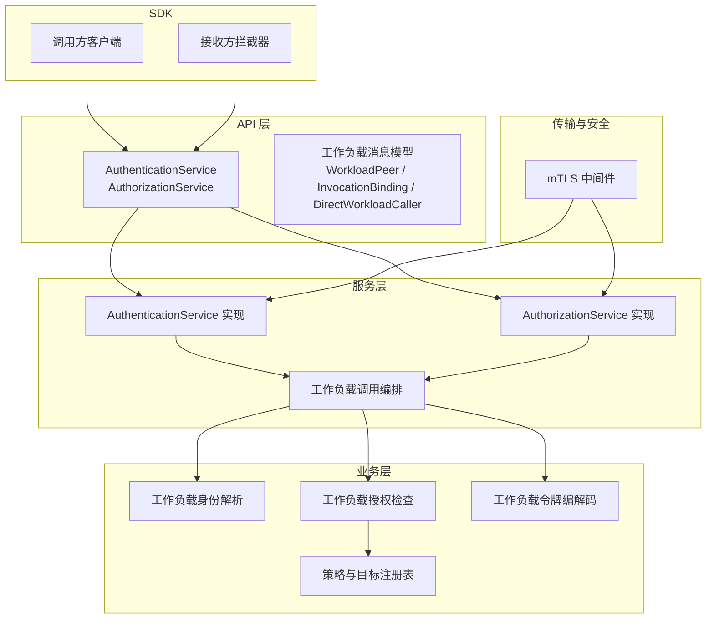
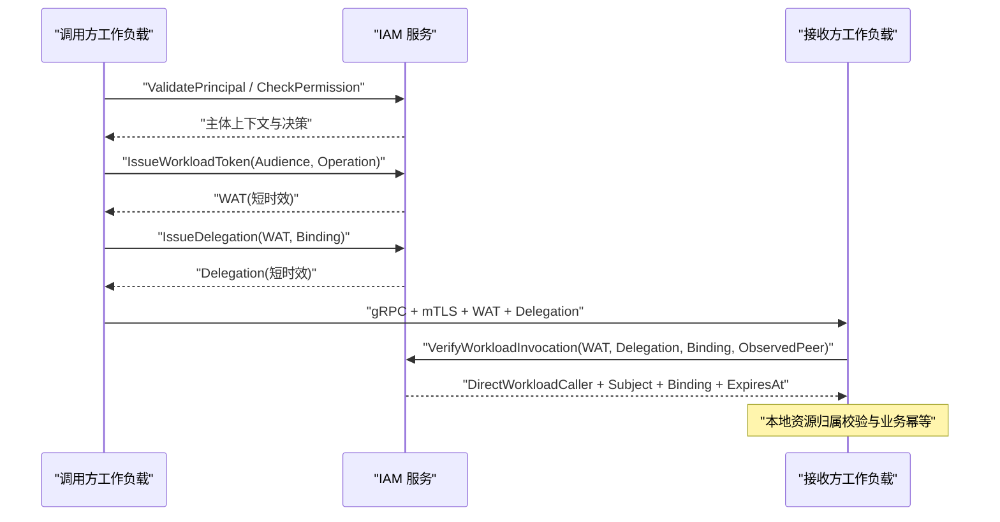
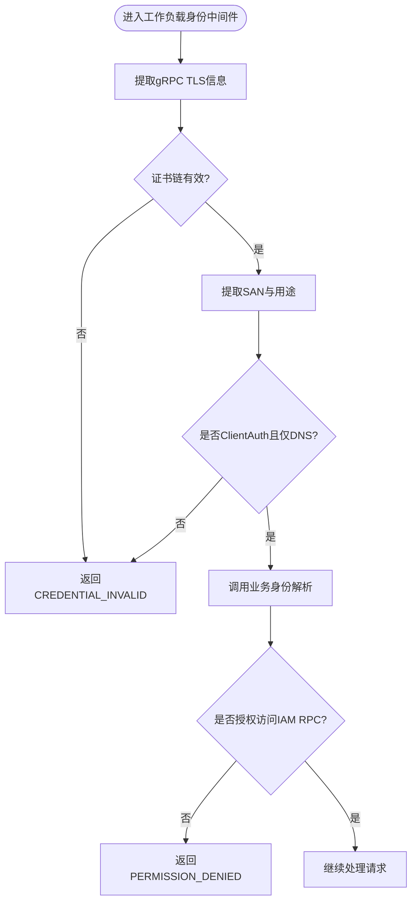
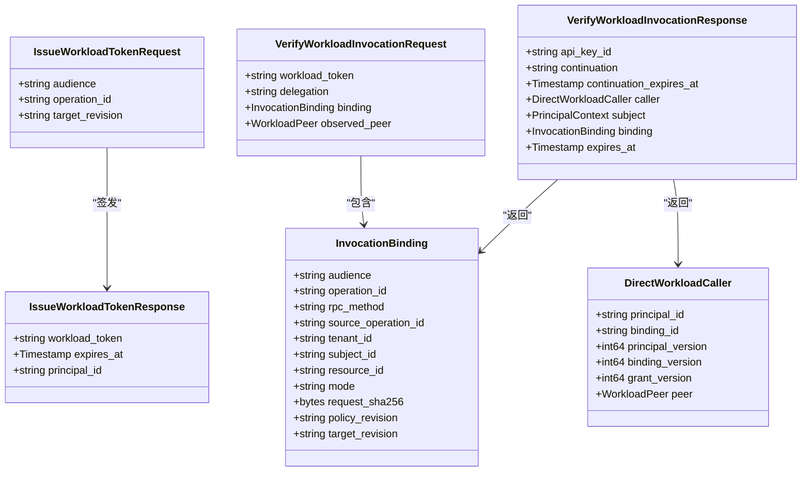
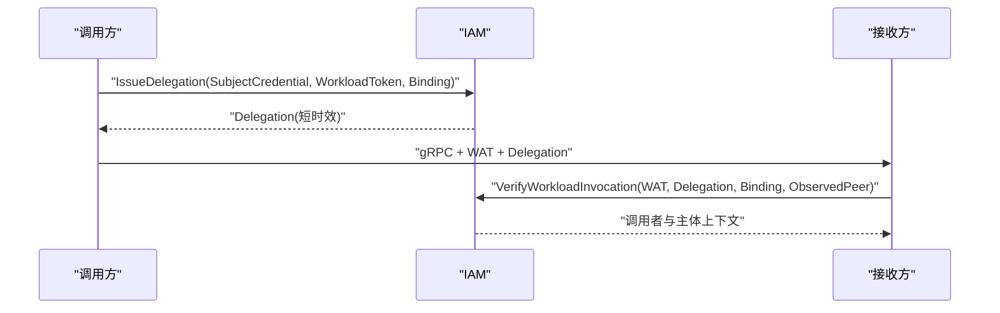
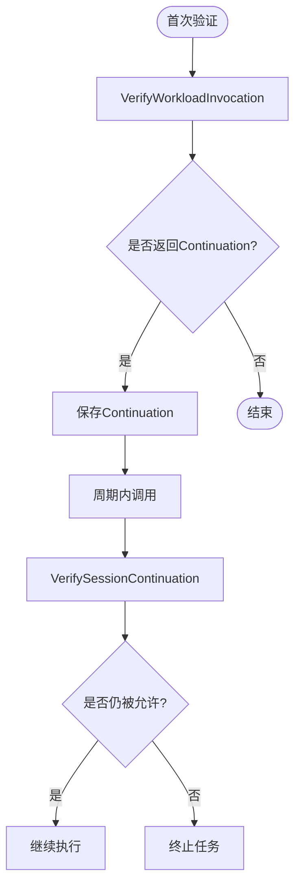
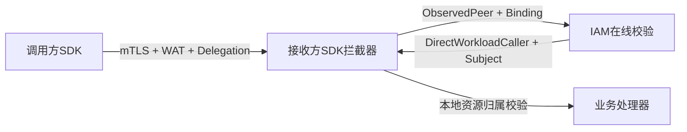
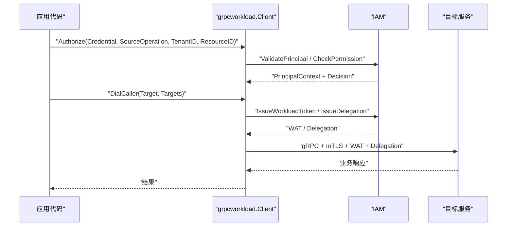
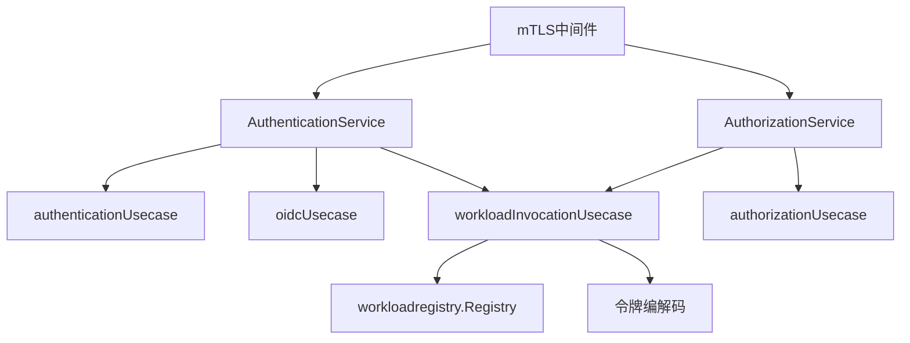

# 工作负载API

<cite>
**本文引用的文件**
- [workload.proto](file://api/iam/v1/workload.proto)
- [authentication_service.proto](file://api/iam/v1/authentication_service.proto)
- [authorization_service.proto](file://api/iam/v1/authorization_service.proto)
- [contract.proto](file://api/iam/v1/contract.proto)
- [workload_identity.go](file://internal/server/workload_identity.go)
- [workload.go](file://internal/biz/workload.go)
- [authentication.go](file://internal/service/authentication.go)
- [authorization.go](file://internal/service/authorization.go)
- [workload_invocation.go](file://internal/service/workload_invocation.go)
- [workload_caller.go](file://internal/biz/workload_caller.go)
- [client.go](file://sdk/grpcworkload/client.go)
- [caller.go](file://sdk/grpcworkload/caller.go)
- [main.go（示例）](file://examples/workload-grpc/main.go)
- [README.md（SDK）](file://sdk/README.md)
</cite>

## 目录
1. [简介](#简介)
2. [项目结构](#项目结构)
3. [核心组件](#核心组件)
4. [架构总览](#架构总览)
5. [详细组件分析](#详细组件分析)
6. [依赖关系分析](#依赖关系分析)
7. [性能与可用性](#性能与可用性)
8. [故障处理与排错](#故障处理与排错)
9. [结论](#结论)
10. [附录：API规范速查](#附录api规范速查)

## 简介
本文件为 ANI IAM 工作负载服务的完整 API 文档，聚焦于工作负载身份认证、短期令牌签发、权限委托、mTLS 安全通道、工作负载令牌生命周期与边界限制机制。文档覆盖以下能力：
- 工作负载注册与身份验证（基于 mTLS 的证书身份校验）
- 工作负载令牌（WAT）签发与校验
- 请求级委托（Delegation）签发与校验
- 会话延续（Continuation）在线复核
- 工作负载间通信的安全模式与调用链绑定
- 令牌轮换策略与失败重试建议
- SDK 使用方式与集成示例

## 项目结构
本项目采用分层设计：
- API 层：gRPC/Protobuf 定义，明确服务契约与消息结构
- 服务层：将 API 映射到领域用例，负责参数校验、错误映射、审计元数据注入
- 业务层：实现工作负载身份解析、授权检查、令牌编解码、边界与策略版本控制
- 传输与安全：mTLS 中间件对入站连接进行严格证书校验，提取可信工作负载身份
- SDK：提供调用方与接收方的 gRPC 适配器，自动完成鉴权、绑定、令牌与委托注入

图表来源
- [authentication_service.proto:11-33](file://api/iam/v1/authentication_service.proto#L11-L33)
- [authorization_service.proto:10-16](file://api/iam/v1/authorization_service.proto#L10-L16)
- [workload.proto:10-121](file://api/iam/v1/workload.proto#L10-L121)
- [workload_identity.go:22-49](file://internal/server/workload_identity.go#L22-L49)
- [workload.go:17-106](file://internal/biz/workload.go#L17-L106)
- [client.go:78-114](file://sdk/grpcworkload/client.go#L78-L114)
- [caller.go:19-45](file://sdk/grpcworkload/caller.go#L19-L45)

章节来源
- [workload.proto:10-121](file://api/iam/v1/workload.proto#L10-L121)
- [authentication_service.proto:11-33](file://api/iam/v1/authentication_service.proto#L11-L33)
- [authorization_service.proto:10-16](file://api/iam/v1/authorization_service.proto#L10-L16)
- [workload_identity.go:22-49](file://internal/server/workload_identity.go#L22-L49)
- [workload.go:17-106](file://internal/biz/workload.go#L17-L106)
- [client.go:78-114](file://sdk/grpcworkload/client.go#L78-L114)
- [caller.go:19-45](file://sdk/grpcworkload/caller.go#L19-L45)

## 核心组件
- 工作负载身份（VerifiedWorkloadPeer）：由 mTLS 握手后从证书中解析出的可信身份，包含环境、信任域、身份类型与值。仅传输层可产生，业务侧不可自证。
- 直接调用者（DirectCaller）：一次跨进程调用的“单跳”可信身份与授权上下文，携带主体ID、绑定ID、版本及目标修订号。
- 调用绑定（InvocationBinding）：对实际业务请求的规范化摘要，包含受众、操作ID、RPC方法、源操作、租户、主体、资源、模式、请求哈希、策略修订和目标修订。
- 工作负载令牌（WAT）：短生命周期、不可刷新、受受众和操作限制的凭证，用于工作负载间通信。
- 委托（Delegation）：针对单次请求的再授权凭证，绑定具体 InvocationBinding，有效期极短且不可刷新。
- 会话延续（Continuation）：对已准入请求的在线复核引用，不可用于签发新令牌或会话，不可续期。

章节来源
- [workload.proto:10-121](file://api/iam/v1/workload.proto#L10-L121)
- [workload.go:17-46](file://internal/biz/workload.go#L17-L46)
- [workload_invocation.go:32-98](file://internal/service/workload_invocation.go#L32-L98)

## 架构总览
工作负载间通信遵循“最小权限、逐跳验证、请求绑定”的原则：
- 调用方通过 SDK 发起授权检查，获取当前主体与租户边界
- SDK 向 IAM 申请工作负载令牌（WAT），并生成请求绑定的委托（Delegation）
- 调用方以 mTLS 连接目标服务，携带 WAT 与 Delegation
- 接收方通过 mTLS 验证对端身份，并将工作负载令牌与委托连同请求绑定提交 IAM 在线校验
- IAM 返回可直接使用的调用者与主体上下文，以及可选的延续引用

图表来源
- [authentication_service.proto:237-251](file://api/iam/v1/authentication_service.proto#L237-L251)
- [workload_invocation.go:32-98](file://internal/service/workload_invocation.go#L32-L98)
- [caller.go:47-108](file://sdk/grpcworkload/caller.go#L47-L108)
- [client.go:126-178](file://sdk/grpcworkload/client.go#L126-L178)

## 详细组件分析

### mTLS 工作负载身份认证流程
- 服务端中间件从 gRPC TLSInfo 中提取对端证书链，校验：
  - 仅允许一个 DNS SAN，无 IP/URI/Email
  - 必须包含 ClientAuth 扩展用途
  - 证书链有效且当前时间处于有效期内
- 将解析出的身份（环境、信任域、x509_dns、DNS值）交给业务层进行身份解析与授权检查
- 若证书无效或无权限访问 IAM RPC，返回明确的 Unauthenticated/PermissionDenied 状态

图表来源
- [workload_identity.go:52-91](file://internal/server/workload_identity.go#L52-L91)
- [workload_identity.go:93-108](file://internal/server/workload_identity.go#L93-L108)
- [workload.go:62-106](file://internal/biz/workload.go#L62-L106)

章节来源
- [workload_identity.go:22-146](file://internal/server/workload_identity.go#L22-L146)
- [workload.go:17-106](file://internal/biz/workload.go#L17-L106)

### 工作负载令牌（WAT）生命周期与边界限制
- 签发：
  - 通过 AuthenticationService.IssueWorkloadToken，传入 Audience、Operation、TargetRevision
  - 返回 WorkloadToken 与 ExpiresAt，以及 PrincipalId
  - 令牌不可刷新，最大有效期为分钟级（协议注释说明）
- 校验：
  - 接收方通过 AuthorizationService.VerifyWorkloadInvocation 在线校验
  - 需同时提供 WorkloadToken、Delegation、InvocationBinding 和 ObservedPeer（来自接收方自身 mTLS）
  - 校验通过后返回 DirectWorkloadCaller、Subject、Binding、ExpiresAt
- 边界限制：
  - 令牌受 Audience 与 Operation 限定
  - 请求绑定包含 TenantID、SubjectID、ResourceID、Mode、PolicyRevision、TargetRevision
  - 策略版本不匹配会拒绝

图表来源
- [workload.proto:10-121](file://api/iam/v1/workload.proto#L10-L121)
- [authentication_service.proto:237-251](file://api/iam/v1/authentication_service.proto#L237-L251)
- [workload_invocation.go:68-98](file://internal/service/workload_invocation.go#L68-L98)

章节来源
- [workload.proto:10-121](file://api/iam/v1/workload.proto#L10-L121)
- [authentication_service.proto:237-251](file://api/iam/v1/authentication_service.proto#L237-L251)
- [workload_invocation.go:68-98](file://internal/service/workload_invocation.go#L68-L98)

### 权限委托（Delegation）与请求绑定
- 目的：将原始凭据的再授权限制在单次请求范围内，避免将敏感凭据传递给业务接收方
- 流程：
  - 调用方持有原始 BearerCredential，结合 WAT 与 InvocationBinding 向 IAM 申请 Delegation
  - Delegation 有效期极短（秒级），不可刷新
  - 接收方将 Delegation 与 Binding、ObservedPeer 一起提交 IAM 校验
- 绑定要求：
  - 必须包含请求的 SHA256 摘要，确保请求内容未被篡改
  - 必须包含策略修订与目标修订，防止策略漂移

图表来源
- [authentication_service.proto:46-58](file://api/iam/v1/authentication_service.proto#L46-L58)
- [workload_invocation.go:46-66](file://internal/service/workload_invocation.go#L46-L66)
- [workload_invocation.go:68-98](file://internal/service/workload_invocation.go#L68-L98)

章节来源
- [authentication_service.proto:46-58](file://api/iam/v1/authentication_service.proto#L46-L58)
- [workload_invocation.go:46-98](file://internal/service/workload_invocation.go#L46-L98)

### 会话延续（Continuation）在线复核
- 场景：长时任务需要周期性复核之前已准入的请求
- 机制：
  - 首次 VerifyWorkloadInvocation 返回 Continuation 与 ContinuationExpiresAt
  - 后续使用 VerifySessionContinuation 携带 Continuation 与 Binding 进行在线复核
  - 该引用不可用于签发新的 WAT/Session/Delegation，不可续期
- 返回值：
  - 返回 DirectWorkloadCaller、Subject、Binding、ExpiresAt

图表来源
- [workload.proto:83-94](file://api/iam/v1/workload.proto#L83-L94)
- [workload_invocation.go:142-160](file://internal/service/workload_invocation.go#L142-L160)

章节来源
- [workload.proto:83-94](file://api/iam/v1/workload.proto#L83-L94)
- [workload_invocation.go:142-160](file://internal/service/workload_invocation.go#L142-L160)

### 工作负载间通信的安全模式
- 强制 mTLS：
  - 接收方必须启用 ServerCredentials，要求客户端证书
  - 调用方必须使用 ClientCredentials，指定 ServerName
- 工作负载身份约束：
  - 仅接受 x509_dns 单一 DNS SAN
  - 证书必须包含 ClientAuth 且链有效
- 请求绑定：
  - 每次调用都生成新的 WAT 与 Delegation
  - 绑定包含请求哈希，确保请求完整性
- 策略版本：
  - 调用方与服务端均需携带 PolicyRevision，不匹配将被拒绝

图表来源
- [client.go:21-76](file://sdk/grpcworkload/client.go#L21-L76)
- [caller.go:19-45](file://sdk/grpcworkload/caller.go#L19-L45)
- [workload_identity.go:52-91](file://internal/server/workload_identity.go#L52-L91)

章节来源
- [client.go:21-76](file://sdk/grpcworkload/client.go#L21-L76)
- [caller.go:19-45](file://sdk/grpcworkload/caller.go#L19-L45)
- [workload_identity.go:52-91](file://internal/server/workload_identity.go#L52-L91)

### 令牌轮换策略与最佳实践
- 工作负载令牌（WAT）：
  - 短时效、不可刷新
  - 每次调用前重新申请，避免缓存过期风险
- 委托（Delegation）：
  - 秒级时效，绑定具体请求
  - 不可复用，不可刷新
- 策略版本：
  - 调用方与服务端均需提供 PolicyRevision
  - 不匹配立即拒绝，避免策略漂移导致的越权
- 超时与重试：
  - SDK 默认子调用超时为 2 秒，继承父上下文超时
  - 不建议对写操作重试；读操作可按业务幂等性重试

章节来源
- [authentication_service.proto:237-251](file://api/iam/v1/authentication_service.proto#L237-L251)
- [workload_invocation.go:121-140](file://internal/service/workload_invocation.go#L121-L140)
- [client.go:92-114](file://sdk/grpcworkload/client.go#L92-L114)
- [caller.go:80-108](file://sdk/grpcworkload/caller.go#L80-L108)

### SDK 使用方法与集成示例
- 调用方：
  - 配置 TLSFiles（证书、私钥、CA）、IAM 地址、ServerName、Environment、TrustDomain、PolicyRevision
  - 使用 NewClient 创建客户端
  - 使用 Authorize 进行权限检查，必要时提供 CheckResource 回调
  - 使用 DialCaller 建立带拦截器的连接，WithSubject 注入已授权主体
  - 拦截器会自动申请 WAT 与 Delegation，并清理敏感头
- 接收方：
  - 使用 ServerCredentials 启动 gRPC 服务器
  - 使用 ReceiverInterceptor 注册目标方法与 Describe 回调
  - 处理器从上下文获取 Verified 对象，进行资源归属校验与业务逻辑
- 示例：
  - examples/workload-grpc 展示了调用方与接收方的完整流程

图表来源
- [client.go:126-178](file://sdk/grpcworkload/client.go#L126-L178)
- [caller.go:47-108](file://sdk/grpcworkload/caller.go#L47-L108)
- [main.go（示例）:60-100](file://examples/workload-grpc/main.go#L60-L100)
- [main.go（示例）:191-209](file://examples/workload-grpc/main.go#L191-L209)

章节来源
- [client.go:78-178](file://sdk/grpcworkload/client.go#L78-L178)
- [caller.go:19-108](file://sdk/grpcworkload/caller.go#L19-L108)
- [main.go（示例）:60-100](file://examples/workload-grpc/main.go#L60-L100)
- [main.go（示例）:191-209](file://examples/workload-grpc/main.go#L191-L209)
- [README.md（SDK）:1-33](file://sdk/README.md#L1-L33)

## 依赖关系分析
- 服务层依赖业务层接口：
  - AuthenticationService 依赖 authenticationUsecase、oidcUsecase、workloadInvocationUsecase
  - AuthorizationService 依赖 authorizationUsecase、workloadInvocationUsecase
- 业务层依赖：
  - 工作负载身份解析（ResolveWorkloadIdentity）
  - 工作负载授权检查（CheckWorkloadGrant）
  - 工作负载令牌编解码（codec）
  - 策略与目标注册表（Registry）
- 传输层依赖：
  - mTLS 中间件依赖 gRPC TLSInfo 与业务身份/授权模块

图表来源
- [authentication.go:91-106](file://internal/service/authentication.go#L91-L106)
- [authorization.go:17-25](file://internal/service/authorization.go#L17-L25)
- [workload_invocation.go:14-30](file://internal/service/workload_invocation.go#L14-L30)
- [workload.go:74-106](file://internal/biz/workload.go#L74-L106)

章节来源
- [authentication.go:91-106](file://internal/service/authentication.go#L91-L106)
- [authorization.go:17-25](file://internal/service/authorization.go#L17-L25)
- [workload_invocation.go:14-30](file://internal/service/workload_invocation.go#L14-L30)
- [workload.go:74-106](file://internal/biz/workload.go#L74-L106)

## 性能与可用性
- 超时控制：
  - SDK 子调用默认 2 秒，继承父上下文超时
  - 建议业务调用设置合理超时，避免级联阻塞
- 并发与重试：
  - 禁止对写操作重试；读操作按幂等性重试
  - 避免频繁刷新 WAT/Delegation，但需保证每次调用前重新申请
- 可用性降级：
  - IAM 不可用时返回 Unavailable，调用方可退避重试
  - 策略版本不匹配返回 FailedPrecondition，需更新本地策略缓存

章节来源
- [client.go:92-114](file://sdk/grpcworkload/client.go#L92-L114)
- [workload_invocation.go:121-140](file://internal/service/workload_invocation.go#L121-L140)
- [authentication.go:476-683](file://internal/service/authentication.go#L476-L683)

## 故障处理与排错
- 常见错误码与原因：
  - CREDENTIAL_INVALID：证书无效、工作负载身份非法、凭据缺失或格式错误
  - PERMISSION_DENIED：未授权访问 IAM RPC、策略版本不匹配、目标未注册
  - IAM_UNAVAILABLE：依赖不可用（OIDC、持久化、授权服务等）
  - IAM_TIMEOUT：超时（上下文 DeadlineExceeded）
  - INVALID_ARGUMENT：请求参数非法（如 Binding 字段缺失或长度不符）
- 排查步骤：
  - 确认 mTLS 证书链有效、SAN 唯一且为 DNS、包含 ClientAuth
  - 确认 PolicyRevision 与目标注册表一致
  - 确认 InvocationBinding 包含完整的请求哈希与必要字段
  - 检查 IAM 依赖服务健康状态与日志中的 decision_id、operation_id

章节来源
- [workload_identity.go:93-146](file://internal/server/workload_identity.go#L93-L146)
- [workload_invocation.go:121-140](file://internal/service/workload_invocation.go#L121-L140)
- [authentication.go:476-683](file://internal/service/authentication.go#L476-L683)

## 结论
ANI IAM 工作负载服务通过严格的 mTLS 身份校验、短生命周期令牌与请求绑定委托，实现了工作负载间通信的最小权限与可追溯性。其 API 设计强调在线校验、策略版本一致性与请求完整性，配合 SDK 提供的自动化拦截器，显著降低了集成复杂度与安全风险。建议在部署中严格管理证书与策略版本，合理设置超时与重试策略，并在接收方进行资源归属校验与业务幂等控制。

## 附录：API规范速查
- AuthenticationService
  - IssueWorkloadToken：签发工作负载令牌（Audience、Operation、TargetRevision）
  - IssueDelegation：签发请求级委托（SubjectCredential、WorkloadToken、Binding）
  - ValidatePrincipal：验证凭据并返回最小可信主体上下文
- AuthorizationService
  - VerifyWorkloadCaller：工作负载调用者在线校验（WorkloadOnly）
  - VerifySessionContinuation：会话延续在线复核（Continuation、Binding）
  - CheckPermission：权限检查（Credential、Operation、PolicyRevision、Target）
- 工作负载消息模型
  - InvocationBinding：规范化请求摘要（含哈希、策略/目标修订）
  - DirectWorkloadCaller：单跳调用者身份与授权版本
  - WorkloadPeer：经 mTLS 验证的对端身份（环境、信任域、类型、值）

章节来源
- [authentication_service.proto:11-33](file://api/iam/v1/authentication_service.proto#L11-L33)
- [authorization_service.proto:10-16](file://api/iam/v1/authorization_service.proto#L10-L16)
- [workload.proto:10-121](file://api/iam/v1/workload.proto#L10-L121)
- [contract.proto:13-198](file://api/iam/v1/contract.proto#L13-L198)