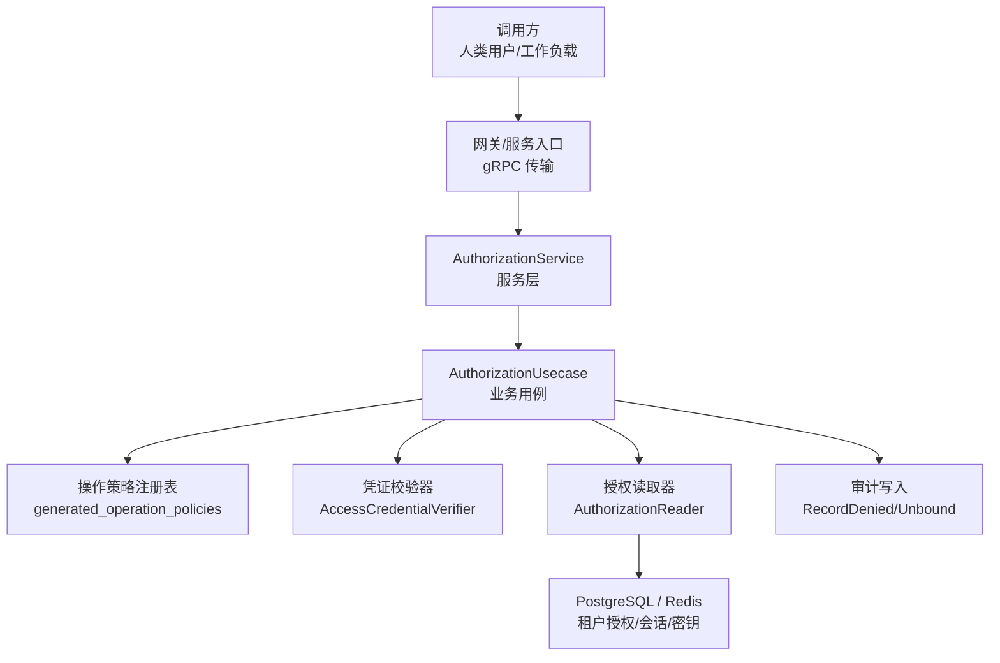
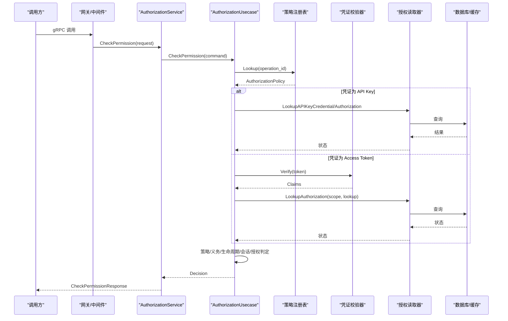
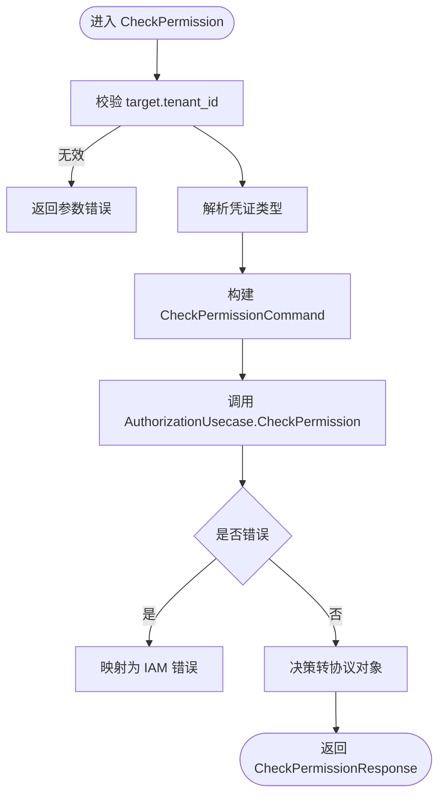
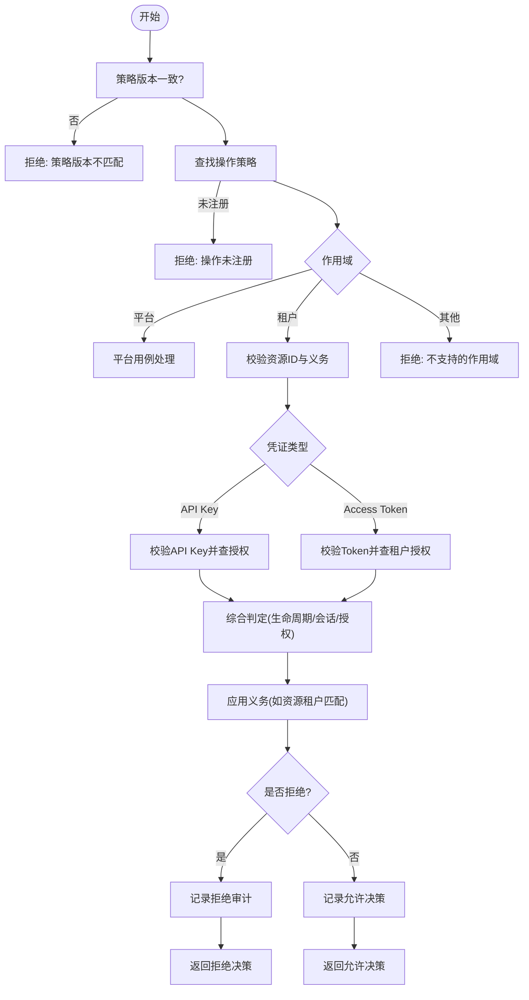
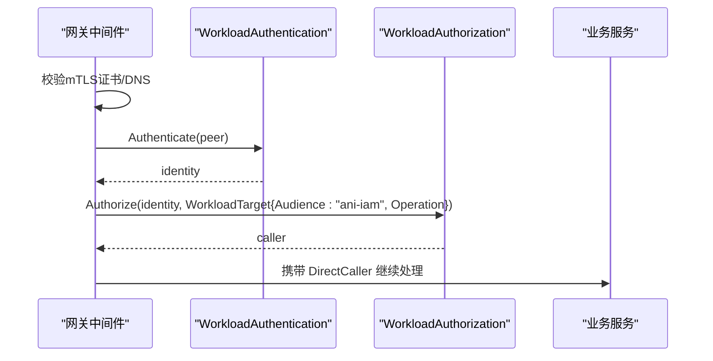
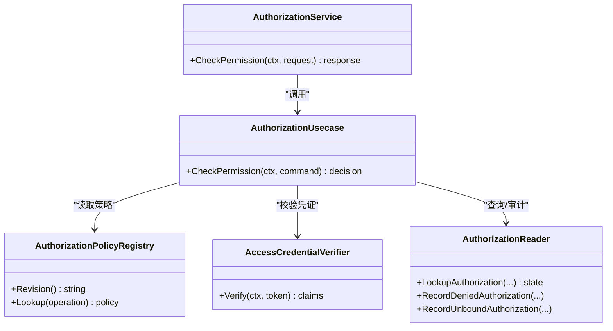

# 授权API

<cite>
**本文引用的文件**
- [authorization_service.proto](file://api/iam/v1/authorization_service.proto)
- [workload.proto](file://api/iam/v1/workload.proto)
- [authorization.go（服务层）](file://internal/service/authorization.go)
- [authorization.go（业务层）](file://internal/biz/authorization.go)
- [generated_operation_policies.go](file://internal/data/generated_operation_policies.go)
- [workload_identity.go（网关中间件）](file://internal/server/workload_identity.go)
- [workload_caller.go（工作负载调用者）](file://internal/biz/workload_caller.go)
- [tenant_authorization.go（租户授权数据访问）](file://internal/data/tenant_authorization.go)
</cite>

## 目录
1. [简介](#简介)
2. [项目结构](#项目结构)
3. [核心组件](#核心组件)
4. [架构总览](#架构总览)
5. [详细组件分析](#详细组件分析)
6. [依赖关系分析](#依赖关系分析)
7. [性能与缓存策略](#性能与缓存策略)
8. [故障排查指南](#故障排查指南)
9. [结论](#结论)
10. [附录：API定义、错误码与示例](#附录api定义错误码与示例)

## 简介
本文件为 ANI IAM 授权服务的完整 API 文档，聚焦 AuthorizationService 的权限检查接口，覆盖资源级权限验证、上下文感知授权、策略评估、角色绑定与资源访问控制机制。文档同时说明请求格式、响应结构与错误码，并提供常见授权场景示例（如租户级权限检查、工作负载授权），以及性能优化建议。

## 项目结构
- API 契约位于 api/iam/v1，使用 gRPC + Protobuf 定义授权相关服务与消息类型。
- 服务实现位于 internal/service，负责将外部请求转换为领域命令并调用业务用例。
- 业务逻辑位于 internal/biz，包含权限策略解析、凭证校验、授权状态查询、审计记录等。
- 数据访问位于 internal/data，提供租户授权、工作负载、操作策略注册表等持久化能力。
- 网关侧通过 internal/server 的工作负载身份中间件完成 mTLS 身份认证与调用方授权。

图表来源
- [authorization_service.proto:10-16](file://api/iam/v1/authorization_service.proto#L10-L16)
- [authorization.go（服务层）:27-67](file://internal/service/authorization.go#L27-L67)
- [authorization.go（业务层）:225-329](file://internal/biz/authorization.go#L225-L329)
- [generated_operation_policies.go:17-15](file://internal/data/generated_operation_policies.go#L17-L15)

章节来源
- [authorization_service.proto:10-16](file://api/iam/v1/authorization_service.proto#L10-L16)
- [authorization.go（服务层）:27-67](file://internal/service/authorization.go#L27-L67)

## 核心组件
- AuthorizationService（服务层）
  - 暴露 CheckPermission 等 RPC，负责参数校验、上下文提取、错误映射与协议转换。
- AuthorizationUsecase（业务层）
  - 执行策略匹配、凭证校验、租户/成员/会话/授权状态判定、义务约束处理、审计记录。
- 操作策略注册表
  - 由代码生成，维护 operation_id -> AuthorizationPolicy 的映射，包括资源、动作、作用域、允许凭证类型、主体类型、义务等。
- 工作负载身份与调用链
  - 通过 mTLS 与工作负载令牌进行工作负载身份认证与在线授权校验，支持委托与延续性检查。

章节来源
- [authorization.go（服务层）:17-25](file://internal/service/authorization.go#L17-L25)
- [authorization.go（业务层）:199-223](file://internal/biz/authorization.go#L199-L223)
- [generated_operation_policies.go:17-15](file://internal/data/generated_operation_policies.go#L17-L15)
- [workload_identity.go:22-50](file://internal/server/workload_identity.go#L22-L50)

## 架构总览
下图展示了从客户端到授权决策的端到端流程，涵盖人类用户与工作负载两种路径。

图表来源
- [authorization_service.proto:18-39](file://api/iam/v1/authorization_service.proto#L18-L39)
- [authorization.go（服务层）:27-67](file://internal/service/authorization.go#L27-L67)
- [authorization.go（业务层）:225-329](file://internal/biz/authorization.go#L225-L329)
- [generated_operation_policies.go:17-15](file://internal/data/generated_operation_policies.go#L17-L15)

## 详细组件分析

### 服务层：AuthorizationService.CheckPermission
- 职责
  - 校验目标资源与租户ID；识别凭证类型（Bearer/API Key）。
  - 构造领域命令并调用业务用例。
  - 将业务决策转换为协议响应，并统一错误映射。
- 关键点
  - 目标租户ID必须有效且可解析。
  - 凭证以字符串形式传递，前缀 ani_ 识别为 API Key。
  - 审计追踪通过 RequestID/CorrelationID 注入。

图表来源
- [authorization.go（服务层）:27-67](file://internal/service/authorization.go#L27-L67)

章节来源
- [authorization.go（服务层）:27-67](file://internal/service/authorization.go#L27-L67)

### 业务层：AuthorizationUsecase.CheckPermission
- 职责
  - 策略版本一致性校验。
  - 根据策略的作用域（平台/租户/自有）分流处理。
  - 凭证校验（Access Token 或 API Key）。
  - 基于租户范围查询授权状态（成员、租户访问、生命周期、会话、授权）。
  - 应用义务（如资源租户匹配）并生成决策ID。
  - 记录拒绝或未绑定的审计事件。
- 关键流程
  - 策略版本不匹配直接拒绝。
  - 未注册的操作或策略不完整拒绝。
  - 平台作用域走平台专用用例；租户作用域需满足资源ID与义务要求。
  - 人类用户路径校验 Access Token 并查租户授权；工作负载路径校验 API Key 并查 API Key 授权。
  - 所有拒绝均记录审计事件，并返回明确的拒绝原因。

图表来源
- [authorization.go（业务层）:225-329](file://internal/biz/authorization.go#L225-L329)
- [authorization.go（业务层）:331-420](file://internal/biz/authorization.go#L331-L420)
- [authorization.go（业务层）:491-514](file://internal/biz/authorization.go#L491-L514)
- [authorization.go（业务层）:516-576](file://internal/biz/authorization.go#L516-L576)

章节来源
- [authorization.go（业务层）:225-329](file://internal/biz/authorization.go#L225-L329)
- [authorization.go（业务层）:331-420](file://internal/biz/authorization.go#L331-L420)
- [authorization.go（业务层）:491-514](file://internal/biz/authorization.go#L491-L514)
- [authorization.go（业务层）:516-576](file://internal/biz/authorization.go#L516-L576)

### 工作负载身份与调用链
- 网关中间件
  - 对 mTLS 连接进行证书校验，提取可信 DNS 身份。
  - 调用工作负载认证与授权，将已认证的调用方注入上下文。
  - 将业务错误映射为带原因的 gRPC 状态。
- 工作负载调用者
  - 校验接收方的授权注册（audience、operation、方法/路径）。
  - 验证工作负载令牌的有效性与边界。
  - 必要时读取当前权威信息并计算权威修订号。

图表来源
- [workload_identity.go:22-50](file://internal/server/workload_identity.go#L22-L50)
- [workload_caller.go:43-113](file://internal/biz/workload_caller.go#L43-L113)

章节来源
- [workload_identity.go:22-50](file://internal/server/workload_identity.go#L22-L50)
- [workload_caller.go:43-113](file://internal/biz/workload_caller.go#L43-L113)

### 策略与义务
- 策略注册表
  - 每个 operation_id 对应一个 AuthorizationPolicy，包含资源、动作、作用域、允许的凭证类型、主体类型、义务列表。
  - 平台作用域仅允许人类用户与 Access Token；租户作用域支持人类与工作负载。
- 义务
  - 例如“资源租户匹配”义务，要求在授权时确保资源属于指定租户，并在响应中附带期望租户ID供调用方校验。

章节来源
- [generated_operation_policies.go:17-15](file://internal/data/generated_operation_policies.go#L17-L15)
- [authorization.go（业务层）:477-489](file://internal/biz/authorization.go#L477-L489)

## 依赖关系分析
- 服务层依赖业务用例接口，解耦协议与领域逻辑。
- 业务用例依赖：
  - 策略注册表（只读，提供操作策略与版本）。
  - 凭证校验器（Access Token 或 API Key 校验）。
  - 授权读取器（租户/成员/会话/授权状态查询与审计写入）。
  - ID 生成器与时钟（用于决策ID与时间判断）。
- 数据层提供 PostgreSQL 事务与 SQL 查询，保证租户授权的一致性。

图表来源
- [authorization.go（服务层）:17-25](file://internal/service/authorization.go#L17-L25)
- [authorization.go（业务层）:199-223](file://internal/biz/authorization.go#L199-L223)
- [authorization.go（业务层）:108-145](file://internal/biz/authorization.go#L108-L145)

章节来源
- [authorization.go（服务层）:17-25](file://internal/service/authorization.go#L17-L25)
- [authorization.go（业务层）:108-145](file://internal/biz/authorization.go#L108-L145)

## 性能与缓存策略
- 策略注册表
  - 策略版本在请求中强制校验，避免陈旧策略导致的误判；注册表应为内存常驻，减少 I/O。
- 凭证校验
  - Access Token 校验通常涉及签名验证与过期检查，应结合本地缓存（如短期 LRU）提升吞吐。
- 授权状态查询
  - 租户/成员/会话/授权状态查询集中在 AuthorizationReader，建议在数据层引入按租户与作用域的缓存（如 Redis），并对高频键设置合理 TTL。
  - 对于 API Key 授权，可在成功路径上观察使用次数（ObserveAPIKeyUse），用于后续热点分析与缓存预热。
- 审计写入
  - 拒绝与未绑定审计事件异步落库或批量写入，降低主路径延迟。
- 工作负载调用链
  - 工作负载令牌在线校验与权威修订计算应在高可用环境下进行，必要时对权威信息做短周期缓存。

[本节为通用性能建议，不直接引用具体文件]

## 故障排查指南
- 常见错误与定位
  - 策略版本不匹配：检查调用方传入的 policy_revision 与服务端注册表版本是否一致。
  - 操作未注册：确认 operation_id 已在策略注册表中登记且资源/动作完整。
  - 凭证无效：Access Token 过期或缺少必要字段；API Key 不存在或已过期。
  - 租户不匹配：请求目标租户与凭证所属租户不一致。
  - 生命周期/会话/授权状态异常：检查租户生命周期、成员状态、会话状态与授权状态。
- 审计与决策ID
  - 所有拒绝与未绑定事件均记录审计，可通过决策ID关联日志与数据库事件进行回溯。
- 工作负载身份问题
  - mTLS 证书校验失败、DNS 名称不合法、工作负载令牌过期或边界不符，都会导致调用被拒绝。

章节来源
- [authorization.go（业务层）:225-329](file://internal/biz/authorization.go#L225-L329)
- [authorization.go（业务层）:516-576](file://internal/biz/authorization.go#L516-L576)
- [workload_identity.go:93-146](file://internal/server/workload_identity.go#L93-L146)

## 结论
ANI IAM 授权服务通过清晰的协议定义、严格的策略版本控制、多凭证支持与细粒度义务约束，实现了资源级权限验证与上下文感知的授权决策。服务层与业务层解耦，便于扩展与测试；工作负载身份链路保障跨服务调用的安全与可追溯。配合合理的缓存与审计策略，可在保证安全性的前提下获得良好的性能表现。

[本节为总结，不直接引用具体文件]

## 附录：API定义、错误码与示例

### API 定义
- 服务与方法
  - AuthorizationService.VerifyWorkloadCaller
  - AuthorizationService.VerifySessionContinuation
  - AuthorizationService.CheckPermission
  - AuthorizationService.VerifyWorkloadInvocation
- 关键消息
  - CheckPermissionRequest：包含 BearerCredential、operation_id、policy_revision、AuthorizationTarget。
  - CheckPermissionResponse：包含 AuthorizationDecision。
  - AuthorizationDecision：allowed、reason、decision_id、principal、obligations、policy_revision。
  - WorkloadPeer、DirectWorkloadCaller、IssueDelegationRequest/Response、VerifyWorkloadInvocationRequest/Response、VerifySessionContinuationRequest/Response、VerifyWorkloadCallerRequest/Response。

章节来源
- [authorization_service.proto:10-39](file://api/iam/v1/authorization_service.proto#L10-L39)
- [workload.proto:10-121](file://api/iam/v1/workload.proto#L10-L121)

### 错误码与原因
- 策略与操作
  - 策略版本不匹配：Expected/Actual 差异。
  - 操作未注册：operation_id 未在注册表中登记或策略不完整。
- 凭证与主体
  - 凭证必需/无效：缺少凭证或字段缺失/过期。
  - 凭证类型不允许：策略限制允许的凭证类型或主体类型。
- 租户与会话
  - 租户不匹配：请求目标租户与凭证所属租户不一致。
  - 会话无效：会话状态非活跃。
- 授权与生命周期
  - 主体/成员/租户访问非活跃。
  - 生命周期阻塞或陈旧。
  - 授权版本不匹配或无权限。
- 工作负载身份
  - 工作负载身份无效、权限拒绝、超时或不可用。

章节来源
- [authorization.go（业务层）:13-23](file://internal/biz/authorization.go#L13-L23)
- [authorization.go（业务层）:32-45](file://internal/biz/authorization.go#L32-L45)
- [authorization.go（业务层）:491-514](file://internal/biz/authorization.go#L491-L514)
- [workload_identity.go:93-146](file://internal/server/workload_identity.go#L93-L146)

### 常见授权场景示例
- 租户级权限检查（人类用户）
  - 请求：CheckPermissionRequest 携带 Access Token、operation_id、policy_revision、target.tenant_id 与 resource_id。
  - 流程：策略版本校验 -> 策略查找 -> Access Token 校验 -> 租户范围授权查询 -> 义务校验（如资源租户匹配）-> 决策。
  - 结果：若允许，返回决策ID与主体上下文；若拒绝，返回明确原因。
- 租户级权限检查（API Key）
  - 请求：CheckPermissionRequest 携带以 ani_ 开头的 API Key。
  - 流程：策略版本校验 -> 策略查找 -> API Key 边界与有效性校验 -> API Key 授权查询 -> 义务校验 -> 决策。
  - 结果：同上。
- 工作负载授权
  - 网关中间件：mTLS 校验 -> 工作负载身份认证 -> 工作负载授权（Audience="ani-iam"，Operation=具体方法）。
  - 调用方：使用工作负载令牌与 InvocationBinding 在线验证，必要时进行延续性检查。
  - 结果：返回 DirectWorkloadCaller、Subject、Binding 与过期时间。

章节来源
- [authorization_service.proto:18-39](file://api/iam/v1/authorization_service.proto#L18-L39)
- [workload.proto:10-121](file://api/iam/v1/workload.proto#L10-L121)
- [workload_identity.go:22-50](file://internal/server/workload_identity.go#L22-L50)
- [workload_caller.go:43-113](file://internal/biz/workload_caller.go#L43-L113)