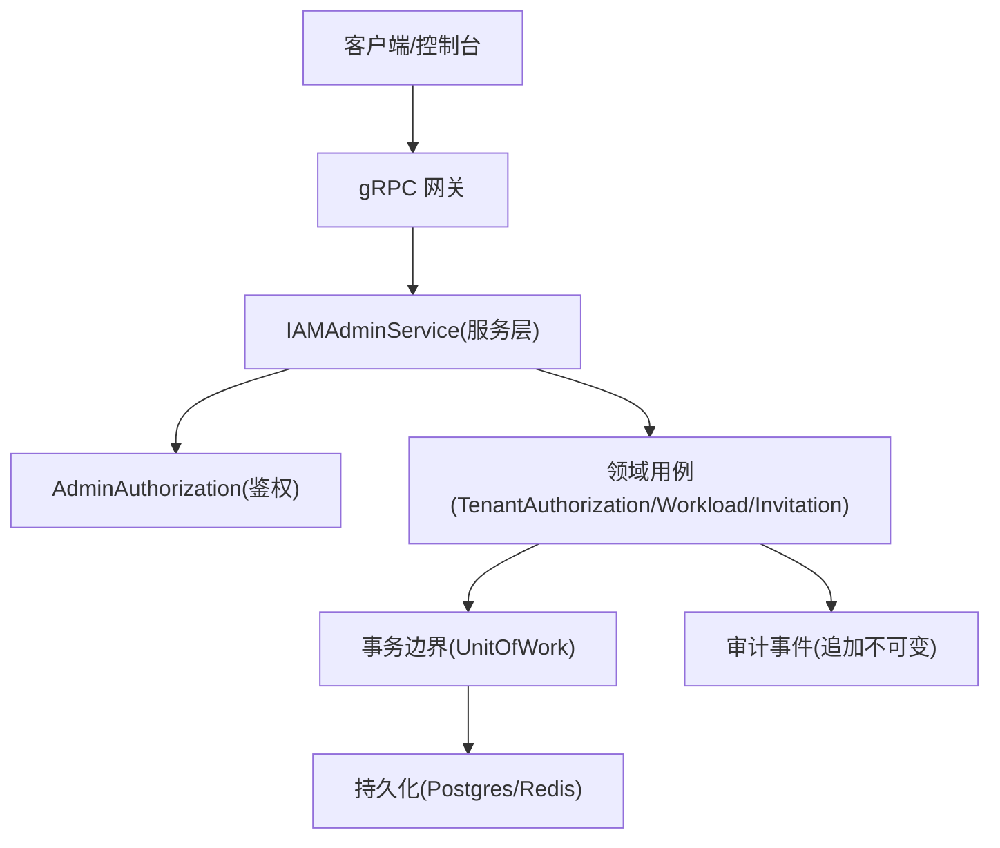
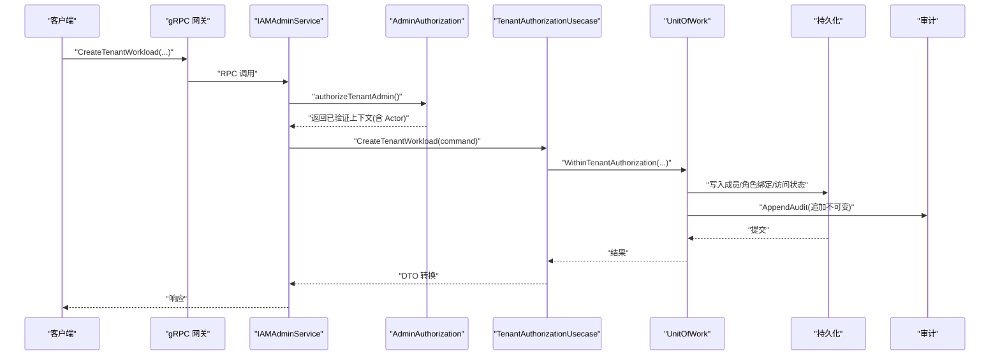
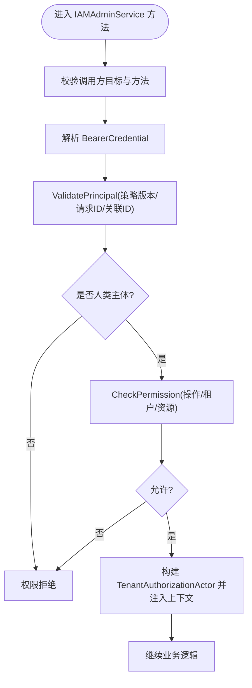
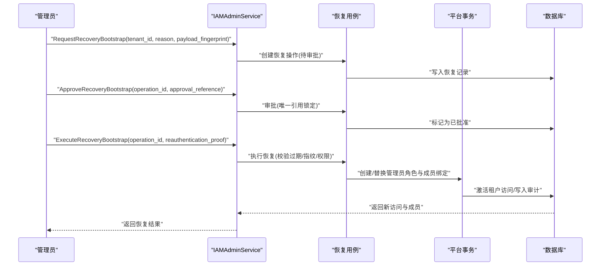
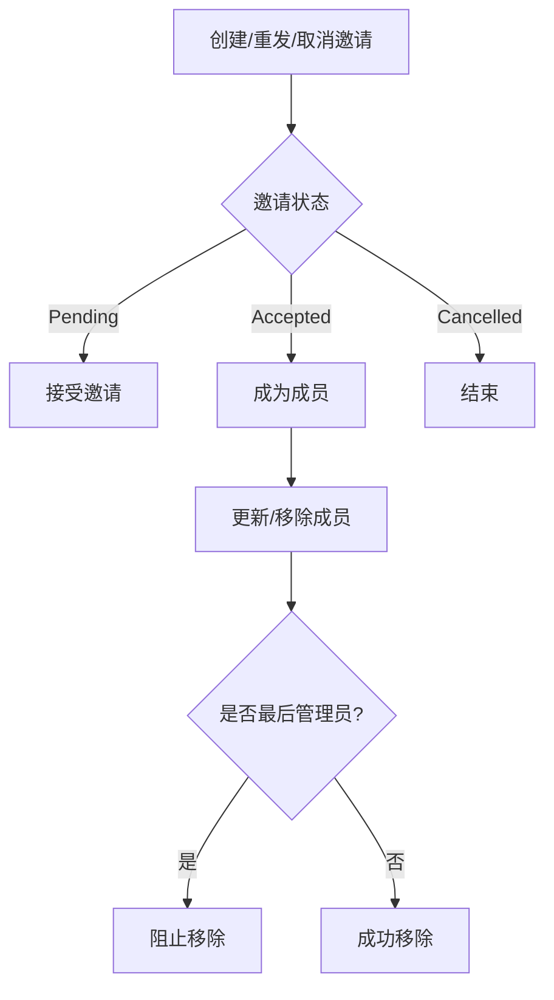
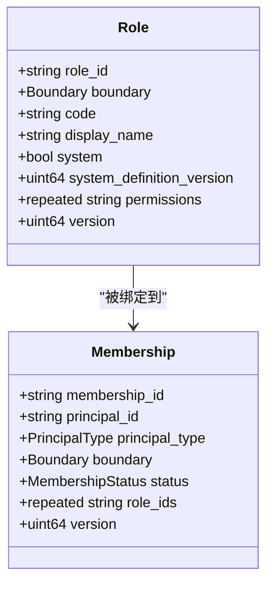
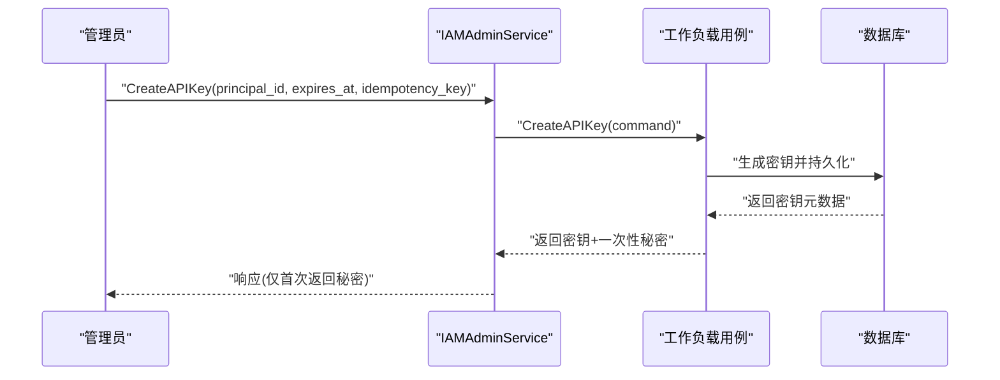
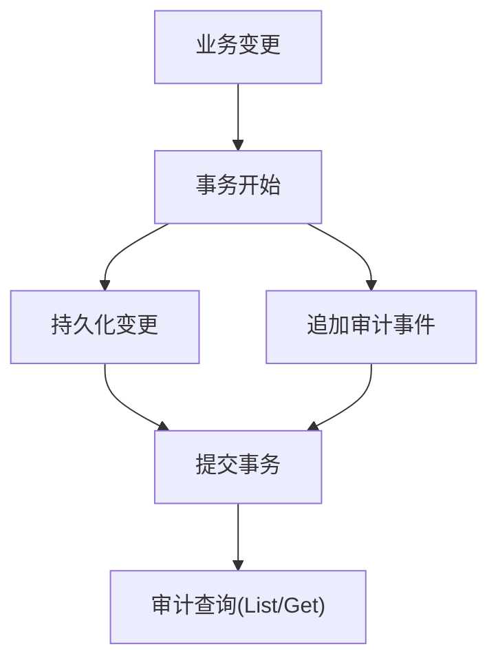
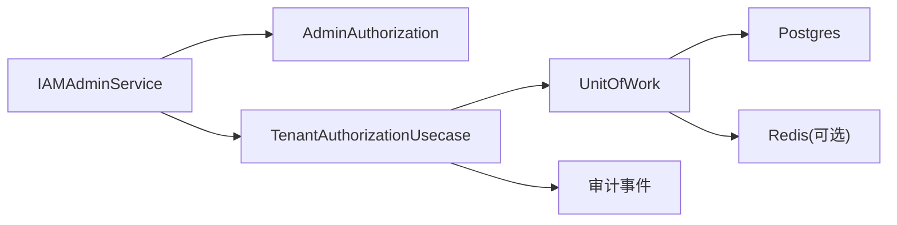

# 管理API

<cite>
**本文引用的文件**
- [iam_admin_service.proto](file://api/iam/v1/iam_admin_service.proto)
- [contract.proto](file://api/iam/v1/contract.proto)
- [iam_admin.go](file://internal/service/iam_admin.go)
- [admin_authorization.go](file://internal/service/admin_authorization.go)
- [membership.go](file://internal/biz/membership.go)
- [tenant_authorization.go](file://internal/biz/tenant_authorization.go)
- [tenant_bootstrap_recovery.go](file://internal/data/tenant_bootstrap_recovery.go)
- [invitation_bootstrap.go](file://internal/data/invitation_bootstrap.go)
- [grpc.pb.go](file://api/iam/v1/iam_admin_service_grpc.pb.go)
</cite>

## 目录
1. [简介](#简介)
2. [项目结构](#项目结构)
3. [核心组件](#核心组件)
4. [架构总览](#架构总览)
5. [详细组件分析](#详细组件分析)
6. [依赖关系分析](#依赖关系分析)
7. [性能与并发特性](#性能与并发特性)
8. [故障排查指南](#故障排查指南)
9. [结论](#结论)
10. [附录：管理员操作接口清单](#附录管理员操作接口清单)

## 简介
本文件为 ANI IAM 管理服务（IAMAdminService）的完整 API 文档，覆盖租户生命周期、成员管理、角色配置、系统设置、审计查询、平台级管理与恢复流程等。文档面向管理员与集成方，说明权限要求、安全控制机制、事务与幂等实践、错误恢复策略以及合规要求。

## 项目结构
- API 契约定义位于 api/iam/v1，使用 gRPC + Protobuf 描述服务、消息与枚举。
- 服务实现位于 internal/service，负责鉴权、参数校验、领域用例编排与 DTO 转换。
- 领域用例与数据访问位于 internal/biz 与 internal/data，提供事务边界、一致性约束、审计事件写入与持久化。
- 服务端点由 gRPC 生成代码暴露，内部通过中间件与鉴权链路进行安全控制。

图表来源
- [iam_admin_service.proto:11-73](file://api/iam/v1/iam_admin_service.proto#L11-L73)
- [iam_admin.go:36-64](file://internal/service/iam_admin.go#L36-L64)
- [admin_authorization.go:18-28](file://internal/service/admin_authorization.go#L18-L28)
- [tenant_authorization.go:129-150](file://internal/biz/tenant_authorization.go#L129-L150)

章节来源
- [iam_admin_service.proto:11-73](file://api/iam/v1/iam_admin_service.proto#L11-L73)
- [contract.proto:129-191](file://api/iam/v1/contract.proto#L129-L191)

## 核心组件
- IAMAdminService：对外暴露的管理员 RPC 集合，涵盖租户访问、成员、角色、工作负载、邀请、平台角色、审计、DLQ 与恢复流程。
- AdminAuthorization：复用现有认证与授权能力，对管理员请求进行身份验证、权限检查与上下文注入。
- TenantAuthorizationUsecase：租户侧变更的核心用例，包含成员状态更新、角色绑定/解绑、租户访问状态切换、工作负载与 API Key 管理等，并保证事务与审计。
- MembershipUsecase：成员创建与审计事件原子写入。
- 平台与恢复：Bootstrap 恢复、管理员恢复、邀请重发、重试作业、DLQ 回放等。

章节来源
- [iam_admin_service.proto:11-73](file://api/iam/v1/iam_admin_service.proto#L11-L73)
- [iam_admin.go:36-64](file://internal/service/iam_admin.go#L36-L64)
- [tenant_authorization.go:194-215](file://internal/biz/tenant_authorization.go#L194-L215)
- [membership.go:155-163](file://internal/biz/membership.go#L155-L163)

## 架构总览
管理员请求进入后，先经 AdminAuthorization 完成：
- 调用方校验（仅允许来自 ani-iam 的工作负载调用）
- 凭据解析与人类主体校验
- 基于策略的版本与资源范围校验
- 将决策 ID、请求 ID、关联 ID 注入上下文，构造 TenantAuthorizationActor

随后服务层方法执行参数校验、分页与游标处理、版本控制与幂等键校验，再调用领域用例在事务中完成变更，并追加审计事件。

图表来源
- [admin_authorization.go:37-107](file://internal/service/admin_authorization.go#L37-L107)
- [iam_admin.go:66-106](file://internal/service/iam_admin.go#L66-L106)
- [tenant_authorization.go:250-299](file://internal/biz/tenant_authorization.go#L250-L299)
- [membership.go:165-240](file://internal/biz/membership.go#L165-L240)

## 详细组件分析

### 管理员鉴权与安全控制
- 调用方限制：仅允许目标为 /iam.v1.IAMAdminService/* 且 Audience 为 ani-iam 的内部调用者。
- 凭据与主体：必须为人类主体；支持密码或 OIDC 作为审计标记的认证方式。
- 权限检查：按操作名、目标租户与资源进行细粒度授权，失败返回明确的权限拒绝。
- 上下文传播：将决策 ID、请求 ID、关联 ID 注入上下文，用于审计与追踪。

图表来源
- [admin_authorization.go:37-107](file://internal/service/admin_authorization.go#L37-L107)

章节来源
- [admin_authorization.go:18-125](file://internal/service/admin_authorization.go#L18-L125)
- [contract.proto:145-159](file://api/iam/v1/contract.proto#L145-L159)

### 租户生命周期管理
- 获取/更新租户访问：GetTenantAccess、UpdateTenantAccess，支持激活与挂起，需版本控制与幂等键。
- Bootstrap 相关：
  - GetTenantBootstrap：查看初始化操作与邀请状态。
  - ReissueTenantBootstrapInvitation：重新签发初始管理员邀请。
  - RetryTenantBootstrapJob：技术重试底层作业。
- 恢复流程（双控）：
  - RequestRecoveryBootstrap：发起恢复申请（记录指纹、原因）。
  - ApproveRecoveryBootstrap：审批恢复（唯一批准引用）。
  - ExecuteRecoveryBootstrap：执行恢复（需重认证证明），成功后返回新的租户访问与工作负载成员信息。

图表来源
- [iam_admin_service.proto:696-728](file://api/iam/v1/iam_admin_service.proto#L696-L728)
- [tenant_bootstrap_recovery.go:48-93](file://internal/data/tenant_bootstrap_recovery.go#L48-L93)
- [tenant_bootstrap_recovery.go:149-286](file://internal/data/tenant_bootstrap_recovery.go#L149-L286)

章节来源
- [iam_admin_service.proto:15-21](file://api/iam/v1/iam_admin_service.proto#L15-L21)
- [iam_admin_service.proto:696-728](file://api/iam/v1/iam_admin_service.proto#L696-L728)
- [tenant_bootstrap_recovery.go:48-93](file://internal/data/tenant_bootstrap_recovery.go#L48-L93)
- [tenant_bootstrap_recovery.go:149-286](file://internal/data/tenant_bootstrap_recovery.go#L149-L286)

### 成员管理（邀请与移除）
- 邀请：
  - CreatePlatformInvitation/CreateTenantInvitation：创建平台或租户邀请，携带角色与语言偏好。
  - ResendPlatformInvitation/ResendTenantInvitation：重发邀请。
  - CancelPlatformInvitation/CancelTenantInvitation：取消邀请。
  - AcceptPlatformInvitation/AcceptTenantInvitation：接受邀请并建立成员关系。
- 成员：
  - List/Get/TenantMembership：查询与读取成员。
  - UpdateTenantMembership/RemoveTenantMembership：更新状态或移除成员（移除需显式调用）。
  - 保护规则：禁止移除最后一名活跃的人类租户管理员。

图表来源
- [iam_admin_service.proto:222-243](file://api/iam/v1/iam_admin_service.proto#L222-L243)
- [iam_admin_service.proto:302-323](file://api/iam/v1/iam_admin_service.proto#L302-L323)
- [iam_admin_service.proto:638-660](file://api/iam/v1/iam_admin_service.proto#L638-L660)
- [tenant_authorization.go:501-515](file://internal/biz/tenant_authorization.go#L501-L515)

章节来源
- [iam_admin_service.proto:222-243](file://api/iam/v1/iam_admin_service.proto#L222-L243)
- [iam_admin_service.proto:302-323](file://api/iam/v1/iam_admin_service.proto#L302-L323)
- [iam_admin_service.proto:638-660](file://api/iam/v1/iam_admin_service.proto#L638-L660)
- [tenant_authorization.go:501-515](file://internal/biz/tenant_authorization.go#L501-L515)

### 角色配置与权限分配
- 平台角色：
  - CreatePlatformRole/DeletePlatformRole/UpdatePlatformRole/ListPlatformRoles/GetPlatformRole
  - BindPlatformRole/UnbindPlatformRole：绑定/解绑平台角色到平台成员。
- 租户角色：
  - CreateTenantRole/DeleteTenantRole/UpdateTenantRole/ListTenantRoles/GetTenantRole
  - BindTenantRole/UnbindTenantRole：绑定/解绑租户角色到成员。
- 权限目录：
  - ListPlatformPermissions/ListTenantPermissions：列出可被角色引用的权限目录（只读，受策略版本控制）。

图表来源
- [iam_admin_service.proto:121-131](file://api/iam/v1/iam_admin_service.proto#L121-L131)
- [iam_admin_service.proto:110-119](file://api/iam/v1/iam_admin_service.proto#L110-L119)

章节来源
- [iam_admin_service.proto:27-33](file://api/iam/v1/iam_admin_service.proto#L27-L33)
- [iam_admin_service.proto:277-300](file://api/iam/v1/iam_admin_service.proto#L277-L300)
- [iam_admin_service.proto:354-405](file://api/iam/v1/iam_admin_service.proto#L354-L405)
- [iam_admin_service.proto:407-428](file://api/iam/v1/iam_admin_service.proto#L407-L428)
- [iam_admin_service.proto:500-555](file://api/iam/v1/iam_admin_service.proto#L500-L555)
- [iam_admin_service.proto:616-671](file://api/iam/v1/iam_admin_service.proto#L616-L671)

### 工作负载与 API Key 管理
- 工作负载：
  - CreateTenantWorkload/UpdateTenantWorkload/ListTenantWorkloads/GetTenantWorkload
- API Key：
  - CreateAPIKey/ListAPIKeys/RevokeAPIKey
- 安全要点：
  - 创建时返回一次性密钥，后续不再回显。
  - 支持永不过期或指定过期时间。
  - 列表与撤销均需要管理员权限与资源范围校验。

图表来源
- [iam_admin_service.proto:325-338](file://api/iam/v1/iam_admin_service.proto#L325-L338)
- [iam_admin.go:108-148](file://internal/service/iam_admin.go#L108-L148)

章节来源
- [iam_admin_service.proto:26-31](file://api/iam/v1/iam_admin_service.proto#L26-L31)
- [iam_admin_service.proto:325-338](file://api/iam/v1/iam_admin_service.proto#L325-L338)
- [iam_admin_service.proto:557-566](file://api/iam/v1/iam_admin_service.proto#L557-L566)
- [iam_admin_service.proto:757-765](file://api/iam/v1/iam_admin_service.proto#L757-L765)
- [iam_admin.go:108-148](file://internal/service/iam_admin.go#L108-L148)

### 审计与合规
- 所有敏感变更均产生不可变的审计事件，包含：
  - 行为主体、认证方式、边界、动作、目标类型与 ID、结果、原因、请求/关联/决策 ID、目标版本、来源服务等。
- 审计事件与业务变更在同一事务内写入，确保一致性与可追溯性。
- 支持按租户或平台维度查询审计事件，支持过滤动作与结果。

图表来源
- [membership.go:87-107](file://internal/biz/membership.go#L87-L107)
- [membership.go:165-240](file://internal/biz/membership.go#L165-L240)
- [iam_admin_service.proto:170-205](file://api/iam/v1/iam_admin_service.proto#L170-L205)
- [iam_admin_service.proto:568-592](file://api/iam/v1/iam_admin_service.proto#L568-L592)

章节来源
- [iam_admin_service.proto:170-205](file://api/iam/v1/iam_admin_service.proto#L170-L205)
- [membership.go:87-107](file://internal/biz/membership.go#L87-L107)
- [membership.go:165-240](file://internal/biz/membership.go#L165-L240)
- [iam_admin_service.proto:568-592](file://api/iam/v1/iam_admin_service.proto#L568-L592)

### DLQ 与恢复
- 列出/获取 Core DLQ 条目，支持分页。
- ReplayCoreDLQEntry：以原始载荷与头信息重放，需预期哈希与尝试次数校验，返回执行结果与审计 ID。
- 适用于基础设施异常后的数据恢复与补偿。

章节来源
- [iam_admin_service.proto:920-996](file://api/iam/v1/iam_admin_service.proto#L920-L996)

## 依赖关系分析
- 服务层依赖：
  - 鉴权：AdminAuthorization 依赖认证与授权用例，强制人类主体与策略版本。
  - 领域用例：TenantAuthorizationUsecase 封装成员、角色、访问与工作负载变更。
  - 数据层：通过 UnitOfWork 保证事务边界，审计事件与业务数据同事务提交。
- 外部依赖：
  - Postgres：存储成员、角色、访问、审计、恢复操作等。
  - Redis：限流、幂等键存储等（在数据层实现中）。
- 耦合与内聚：
  - 服务层薄封装，职责清晰；领域用例集中业务规则；数据层专注持久化与一致性。

图表来源
- [iam_admin.go:36-64](file://internal/service/iam_admin.go#L36-L64)
- [tenant_authorization.go:129-150](file://internal/biz/tenant_authorization.go#L129-L150)

章节来源
- [iam_admin.go:36-64](file://internal/service/iam_admin.go#L36-L64)
- [tenant_authorization.go:129-150](file://internal/biz/tenant_authorization.go#L129-L150)

## 性能与并发特性
- 分页与游标：统一使用 CursorPageRequest，默认页大小与最大页大小在服务层限制，避免大表扫描。
- 版本控制：所有写操作要求 expected_version，防止并发覆盖冲突。
- 幂等键：所有写操作支持 idempotency_key，重复提交返回相同结果，避免重复副作用。
- 事务与锁：关键路径使用锁（如管理员守卫、恢复批准引用）保障强一致。
- 审计追加：审计事件独立追加，不影响主路径性能。

[本节为通用指导，不直接分析具体文件]

## 故障排查指南
- 权限拒绝：
  - 检查调用方目标是否为 iam.v1.IAMAdminService/*，且 Audience 为 ani-iam。
  - 确认凭据有效且主体为人类，策略版本匹配。
- 版本冲突：
  - 更新成员、角色、访问时需传入正确的 expected_version。
- 幂等冲突：
  - 若 idempotency_key 已存在但参数不一致，会返回冲突错误。
- 恢复失败：
  - 检查恢复操作的过期时间、批准引用唯一性、指纹一致性。
  - 确认目标租户处于 bootstrap_pending 或允许恢复的状态。
- 审计缺失：
  - 确认事务提交成功，审计事件与业务数据同事务写入。

章节来源
- [admin_authorization.go:37-107](file://internal/service/admin_authorization.go#L37-L107)
- [tenant_bootstrap_recovery.go:48-93](file://internal/data/tenant_bootstrap_recovery.go#L48-L93)
- [tenant_bootstrap_recovery.go:149-286](file://internal/data/tenant_bootstrap_recovery.go#L149-L286)

## 结论
ANI IAM 管理服务提供了完善的管理员 API，覆盖租户生命周期、成员与角色管理、工作负载与 API Key 管理、平台级操作、审计与恢复。其设计强调安全可控（人类主体、细粒度授权）、强一致（版本控制、事务与锁）、可追溯（审计事件）与高可用（DLQ 回放与恢复）。建议在生产环境中严格遵循幂等键、版本控制与最小权限原则，并结合审计与监控进行持续治理。

[本节为总结，不直接分析具体文件]

## 附录：管理员操作接口清单
以下为 IAMAdminService 的主要 RPC 分类与用途（按功能域分组）：

- 租户访问与生命周期
  - GetTenantAccess / UpdateTenantAccess
  - GetTenantBootstrap / ReissueTenantBootstrapInvitation / RetryTenantBootstrapJob
  - RequestRecoveryBootstrap / ApproveRecoveryBootstrap / ExecuteRecoveryBootstrap
  - RequestRestoreTenantAdmin / ApproveRestoreTenantAdmin / ExecuteRestoreTenantAdmin

- 成员与邀请
  - CreatePlatformInvitation / ResendPlatformInvitation / CancelPlatformInvitation / AcceptPlatformInvitation
  - CreateTenantInvitation / ResendTenantInvitation / CancelTenantInvitation / AcceptTenantInvitation
  - List/Get/Update/Remove 平台与租户成员

- 角色与权限
  - Create/Update/Delete/List/Get 平台与租户角色
  - Bind/Unbind 平台与租户角色
  - ListPlatformPermissions / ListTenantPermissions

- 工作负载与 API Key
  - Create/Update/List/Get 租户工作负载
  - Create/List/Revoke API Key

- 审计与 DLQ
  - List/Get 平台与租户审计事件
  - List/Get/Replay Core DLQ 条目

章节来源
- [iam_admin_service.proto:11-73](file://api/iam/v1/iam_admin_service.proto#L11-L73)
- [iam_admin_service.proto:870-996](file://api/iam/v1/iam_admin_service.proto#L870-L996)