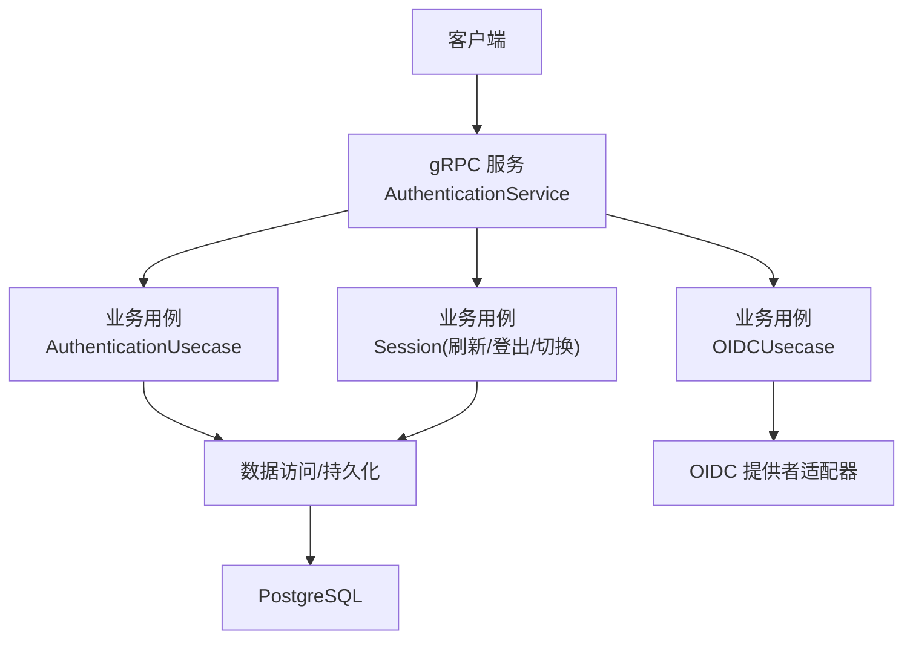
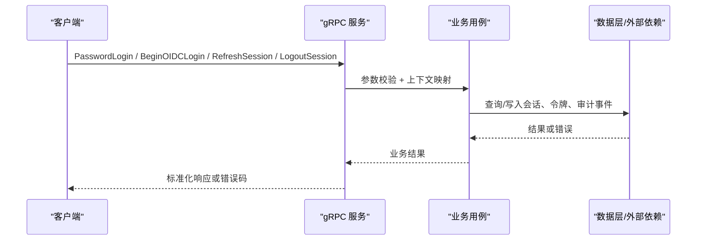
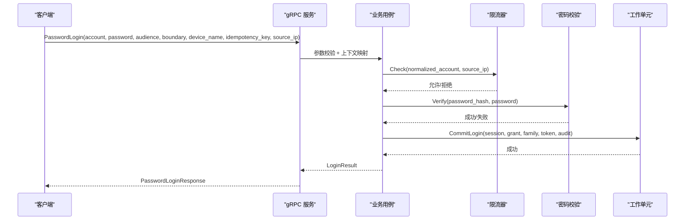
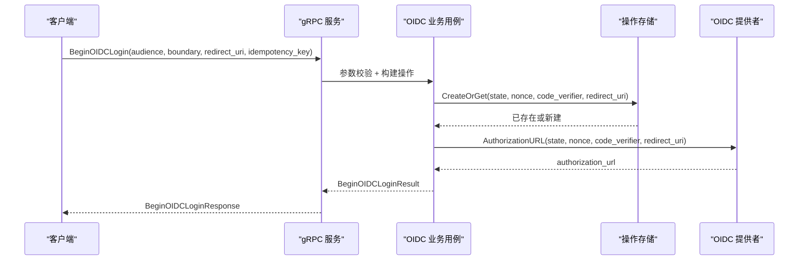
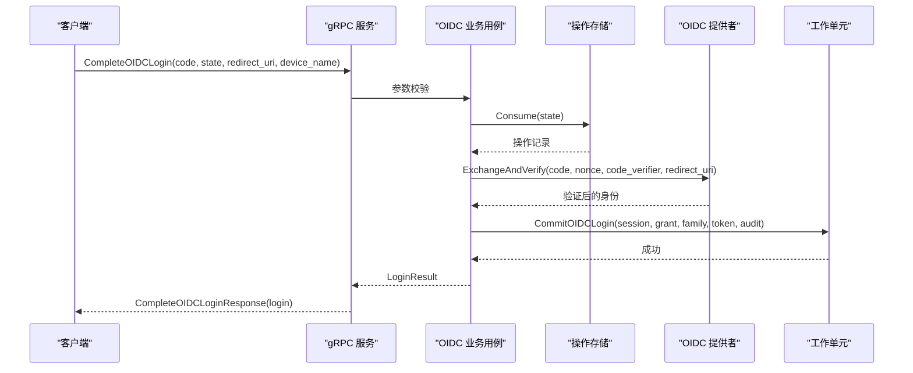
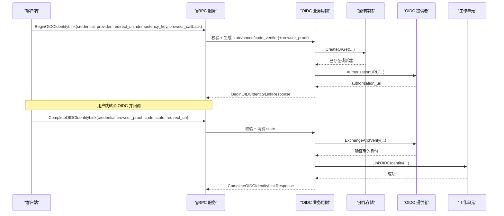
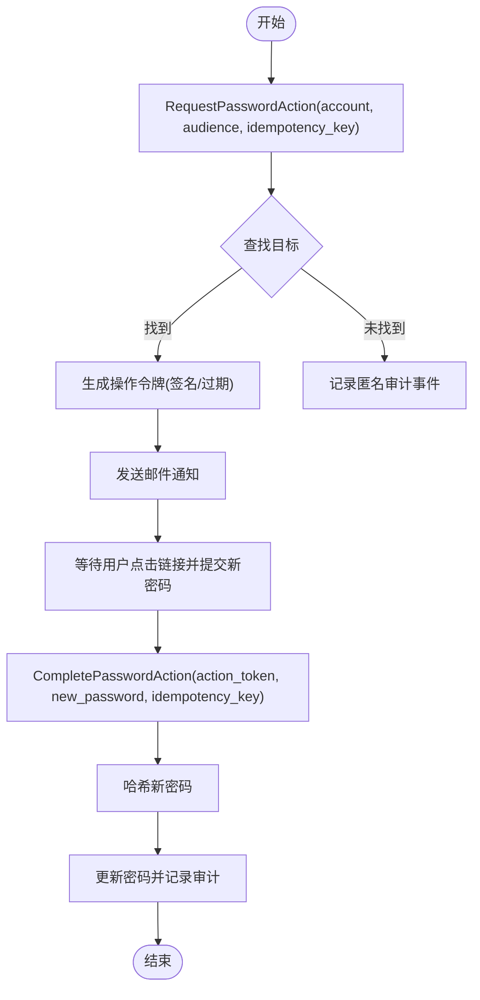
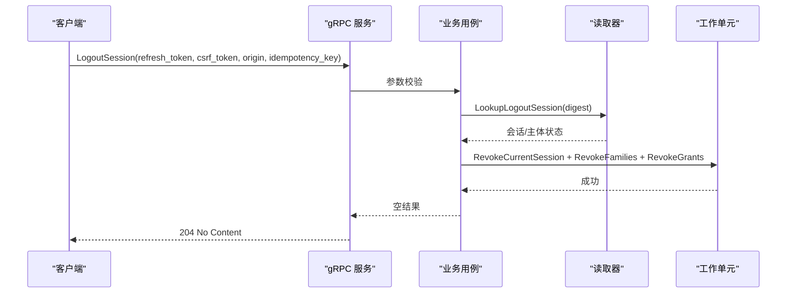
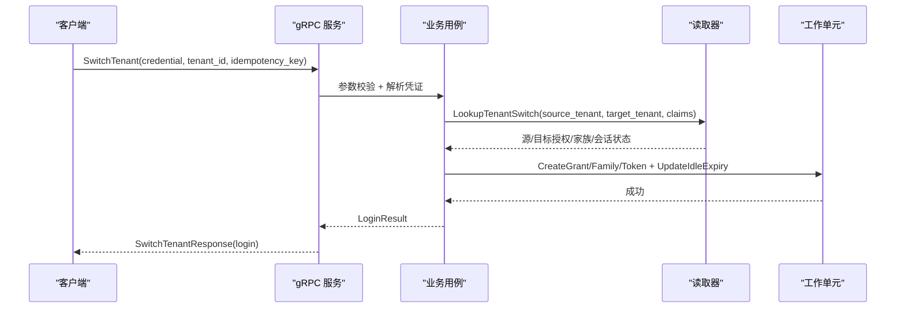
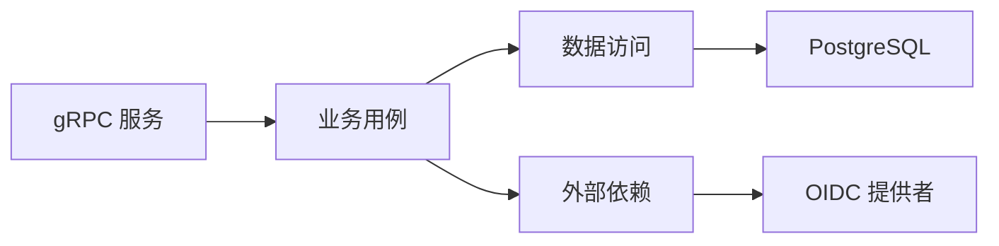

# 认证API

<cite>
**本文引用的文件**
- [api/iam/v1/authentication_service.proto](file://api/iam/v1/authentication_service.proto)
- [internal/service/authentication.go](file://internal/service/authentication.go)
- [internal/biz/authentication.go](file://internal/biz/authentication.go)
- [internal/biz/session.go](file://internal/biz/session.go)
- [internal/biz/oidc.go](file://internal/biz/oidc.go)
- [internal/data/oidc_provider.go](file://internal/data/oidc_provider.go)
- [internal/data/session_postgres.go](file://internal/data/session_postgres.go)
</cite>

## 目录
1. [简介](#简介)
2. [项目结构](#项目结构)
3. [核心组件](#核心组件)
4. [架构总览](#架构总览)
5. [详细端点文档](#详细端点文档)
6. [依赖关系分析](#依赖关系分析)
7. [性能与可用性](#性能与可用性)
8. [故障排查指南](#故障排查指南)
9. [结论](#结论)
10. [附录：客户端集成与安全最佳实践](#附录客户端集成与安全最佳实践)

## 简介
本文件为 ANI IAM 认证服务的完整 API 文档，聚焦 AuthenticationService 的所有端点，覆盖密码登录、OIDC 登录流程、会话管理（刷新、登出、切换租户）、密码操作（请求/完成）以及主体校验与会话列举等。每个端点均说明请求参数、响应格式、认证要求、错误处理，并提供常见场景的请求/响应示例路径与调用时序图。文末提供安全考虑、令牌管理与客户端集成指南及调试技巧。

## 项目结构
- API 契约定义在 protobuf 中，服务实现位于 service 层，业务逻辑在 biz 层，持久化与外部依赖在 data 层。
- 认证相关的主要文件：
  - API 定义：authentication_service.proto
  - gRPC 服务实现：service/authentication.go
  - 业务用例：biz/authentication.go、biz/session.go、biz/oidc.go
  - OIDC 提供者适配：data/oidc_provider.go
  - 会话持久化：data/session_postgres.go

**图表来源**
- [internal/service/authentication.go:91-106](file://internal/service/authentication.go#L91-L106)
- [internal/biz/authentication.go:286-339](file://internal/biz/authentication.go#L286-L339)
- [internal/biz/session.go:154-286](file://internal/biz/session.go#L154-L286)
- [internal/biz/oidc.go:216-251](file://internal/biz/oidc.go#L216-L251)
- [internal/data/oidc_provider.go:62-95](file://internal/data/oidc_provider.go#L62-L95)
- [internal/data/session_postgres.go:17-51](file://internal/data/session_postgres.go#L17-L51)

**章节来源**
- [api/iam/v1/authentication_service.proto:11-33](file://api/iam/v1/authentication_service.proto#L11-L33)
- [internal/service/authentication.go:91-106](file://internal/service/authentication.go#L91-L106)

## 核心组件
- AuthenticationService：gRPC 服务层，负责参数校验、上下文映射、错误码转换与审计元数据注入。
- AuthenticationUsecase：密码登录、刷新、登出、切换租户、密码动作等核心认证流程。
- OIDCUsecase：OIDC 登录与身份绑定流程，包含状态机、PKCE、重认证窗口校验。
- OIDCProvider 适配器：封装第三方 OIDC 提供者的授权 URL 生成与 ID Token 交换验证。
- Session 持久化：基于 PostgreSQL 的会话、刷新令牌族、授权授予的版本控制与并发安全。

**章节来源**
- [internal/service/authentication.go:108-138](file://internal/service/authentication.go#L108-L138)
- [internal/biz/authentication.go:341-530](file://internal/biz/authentication.go#L341-L530)
- [internal/biz/oidc.go:547-742](file://internal/biz/oidc.go#L547-L742)
- [internal/data/oidc_provider.go:101-154](file://internal/data/oidc_provider.go#L101-L154)
- [internal/data/session_postgres.go:75-165](file://internal/data/session_postgres.go#L75-L165)

## 架构总览
下图展示了从客户端到后端各层的调用链与关键决策点。

**图表来源**
- [internal/service/authentication.go:150-230](file://internal/service/authentication.go#L150-L230)
- [internal/biz/authentication.go:341-530](file://internal/biz/authentication.go#L341-L530)
- [internal/biz/session.go:154-286](file://internal/biz/session.go#L154-L286)

## 详细端点文档

### 通用约定
- 传输协议：gRPC
- 认证方式：
  - 登录类接口无需前置凭证（通过账号/密码或 OIDC）。
  - 会话管理类接口通常使用 BearerCredential（Access Token）或 RefreshToken+CSRF。
- 幂等键：多数写操作支持 idempotency_key，用于避免重复提交。
- 审计：所有成功/失败操作均记录审计事件，便于追踪。

**章节来源**
- [api/iam/v1/authentication_service.proto:35-33](file://api/iam/v1/authentication_service.proto#L35-L33)
- [internal/service/authentication.go:463-683](file://internal/service/authentication.go#L463-L683)

---

### 1) PasswordLogin（密码登录）
- 功能：以账号+密码创建 Console 或 BOSS 用户会话，返回 Access Token、Refresh Token、会话摘要与授权授予摘要。
- 请求字段：
  - account：账号（必填）
  - password：密码（必填）
  - audience：audience_console 或 audience_boss（必填）
  - boundary：当 audience=console 时需提供 tenant；当 audience=boss 时需提供 platform（必填）
  - device_name：设备名（可选）
  - idempotency_key：幂等键（必填）
  - source_ip：可信网关推导的源 IP（必填，服务端会哈希后用于限流）
- 响应字段：
  - access_token：短期访问令牌
  - expires_in_seconds：访问令牌剩余秒数
  - principal：主体上下文（含边界、会话ID、授权ID、认证方法）
  - session：会话摘要（状态、过期时间、设备名等）
  - grant：授权授予摘要（边界、版本、状态）
  - refresh_token：刷新令牌（内部存储摘要，客户端保存明文）
  - refresh_expires_at：刷新令牌绝对过期时间
- 认证要求：无前置凭证
- 错误处理：
  - INVALID_ARGUMENT：缺少必填字段、source_ip 非法、boundary 不匹配 audience
  - AUTH_RATE_LIMITED：登录频率限制
  - CREDENTIAL_INVALID：账号/密码无效或账户被锁定
  - PERMISSION_DENIED：主体/成员/租户访问状态异常
  - IAM_UNAVAILABLE：依赖不可用（如鉴权/持久化）
- 典型场景：
  - 控制台登录：audience=console，boundary=tenant
  - BOSS 平台登录：audience=boss，boundary=platform

**图表来源**
- [internal/service/authentication.go:150-194](file://internal/service/authentication.go#L150-L194)
- [internal/biz/authentication.go:341-530](file://internal/biz/authentication.go#L341-L530)

**章节来源**
- [api/iam/v1/authentication_service.proto:35-59](file://api/iam/v1/authentication_service.proto#L35-L59)
- [internal/service/authentication.go:150-194](file://internal/service/authentication.go#L150-L194)
- [internal/biz/authentication.go:341-530](file://internal/biz/authentication.go#L341-L530)

---

### 2) BeginOIDCLogin（开始 OIDC 登录）
- 功能：创建一次性 state/nonce/PKCE 操作，返回授权 URL、state 与过期时间。
- 请求字段：
  - audience：仅支持 console（BOSS 由平台侧处理）
  - boundary：tenant（必填）
  - redirect_uri：配置的回调地址（必填）
  - idempotency_key：幂等键（必填）
- 响应字段：
  - authorization_url：OIDC 授权服务器地址
  - state：一次性状态值
  - expires_at：操作过期时间
- 认证要求：无前置凭证
- 错误处理：
  - INVALID_ARGUMENT：audience/boundary/redirect_uri/idempotency_key 非法或缺失
  - IAM_UNAVAILABLE：OIDC 依赖不可用

**图表来源**
- [internal/service/authentication.go:280-316](file://internal/service/authentication.go#L280-L316)
- [internal/biz/oidc.go:547-605](file://internal/biz/oidc.go#L547-L605)
- [internal/data/oidc_provider.go:101-113](file://internal/data/oidc_provider.go#L101-L113)

**章节来源**
- [api/iam/v1/authentication_service.proto:61-74](file://api/iam/v1/authentication_service.proto#L61-L74)
- [internal/service/authentication.go:280-316](file://internal/service/authentication.go#L280-L316)
- [internal/biz/oidc.go:547-605](file://internal/biz/oidc.go#L547-L605)

---

### 3) CompleteOIDCLogin（完成 OIDC 登录）
- 功能：接收授权码与 state，完成 OIDC 登录并返回与密码登录一致的会话结果。
- 请求字段：
  - code：授权码
  - state：一次性状态值
  - redirect_uri：回调地址（必须与 Begin 一致）
  - device_name：设备名（可选）
- 响应字段：login（嵌套 PasswordLoginResponse）
- 认证要求：无前置凭证
- 错误处理：
  - INVALID_ARGUMENT：code/state/redirect_uri 缺失或不匹配
  - CREDENTIAL_INVALID：邮箱未验证或主体/成员/租户状态异常
  - IAM_UNAVAILABLE：OIDC 依赖不可用

**图表来源**
- [internal/service/authentication.go:256-278](file://internal/service/authentication.go#L256-L278)
- [internal/biz/oidc.go:607-742](file://internal/biz/oidc.go#L607-L742)
- [internal/data/oidc_provider.go:115-154](file://internal/data/oidc_provider.go#L115-L154)

**章节来源**
- [api/iam/v1/authentication_service.proto:76-87](file://api/iam/v1/authentication_service.proto#L76-L87)
- [internal/service/authentication.go:256-278](file://internal/service/authentication.go#L256-L278)
- [internal/biz/oidc.go:607-742](file://internal/biz/oidc.go#L607-L742)

---

### 4) BeginOIDCIdentityLink / CompleteOIDCIdentityLink（OIDC 身份绑定）
- 功能：在已认证会话下，将第三方 OIDC 身份与当前主体绑定；支持浏览器回调证明（browser_proof）。
- 请求字段（Begin）：
  - credential：BearerCredential（必填）
  - provider：提供商名称（必填）
  - redirect_uri：配置回调地址（必填）
  - idempotency_key：幂等键（必填）
  - browser_callback：是否启用浏览器回调证明（可选）
- 响应字段（Begin）：authorization_url、state、expires_at、browser_proof（首次且启用回调时）
- 请求字段（Complete）：
  - credential 或 browser_proof（二选一）
  - code、state、redirect_uri（必填）
- 响应字段（Complete）：identity_id、principal_id
- 认证要求：需要有效的 BearerCredential 或浏览器回调证明
- 错误处理：
  - INVALID_ARGUMENT：credential/browser_proof/redirect_uri/state/code 非法或缺失
  - PERMISSION_DENIED：最近重认证窗口不满足或身份冲突
  - IAM_UNAVAILABLE：OIDC 依赖不可用

**图表来源**
- [internal/service/authentication.go:39-89](file://internal/service/authentication.go#L39-L89)
- [internal/biz/oidc.go:268-451](file://internal/biz/oidc.go#L268-L451)
- [internal/data/oidc_provider.go:101-154](file://internal/data/oidc_provider.go#L101-L154)

**章节来源**
- [api/iam/v1/authentication_service.proto:89-123](file://api/iam/v1/authentication_service.proto#L89-L123)
- [internal/service/authentication.go:39-89](file://internal/service/authentication.go#L39-L89)
- [internal/biz/oidc.go:268-451](file://internal/biz/oidc.go#L268-L451)

---

### 5) RequestPasswordAction / CompletePasswordAction（密码设置/重置）
- 功能：非枚举式地发起密码设置或重置流程，发送一次性操作令牌至目标邮箱，完成后更新密码。
- 请求字段（Request）：
  - account：账号（必填）
  - audience：console 或 boss（boss 需平台能力）
  - idempotency_key：幂等键（必填）
- 响应字段（Request）：operation_id、expires_at
- 请求字段（Complete）：
  - action_token：一次性操作令牌（必填）
  - new_password：新密码（必填）
  - idempotency_key：幂等键（必填）
- 响应字段（Complete）：result（资源ID与版本）
- 认证要求：无前置凭证（Request），Complete 通过 action_token 验证
- 错误处理：
  - INVALID_ARGUMENT：account/audience/action_token/new_password/idempotency_key 非法或缺失
  - IDMEMPOTENCY_CONFLICT：幂等键冲突
  - IAM_UNAVAILABLE：依赖不可用

**图表来源**
- [internal/biz/password_action.go:141-222](file://internal/biz/password_action.go#L141-L222)
- [internal/biz/password_action.go:224-299](file://internal/biz/password_action.go#L224-L299)

**章节来源**
- [api/iam/v1/authentication_service.proto:125-148](file://api/iam/v1/authentication_service.proto#L125-L148)
- [internal/service/authentication.go:318-366](file://internal/service/authentication.go#L318-L366)
- [internal/biz/password_action.go:141-299](file://internal/biz/password_action.go#L141-L299)

---

### 6) RefreshSession（刷新会话）
- 功能：使用 RefreshToken 旋转新的 Access Token 与 RefreshToken，滑动会话空闲过期时间。
- 请求字段：
  - refresh_token：刷新令牌（必填）
  - csrf_token：CSRF 令牌（必填）
  - origin：来源（必填）
  - idempotency_key：幂等键（必填）
- 响应字段：login（嵌套 PasswordLoginResponse）
- 认证要求：无需前置 Bearer，但需有效 RefreshToken+CSRF
- 错误处理：
  - INVALID_ARGUMENT：refresh_token/csrf_token/origin/idempotency_key 非法或缺失
  - CREDENTIAL_INVALID：刷新令牌无效、已消费或会话/授权/家族状态异常
  - AUTH_RATE_LIMITED：刷新频率限制
  - IAM_UNAVAILABLE：依赖不可用

**图表来源**
- [internal/service/authentication.go:196-211](file://internal/service/authentication.go#L196-L211)
- [internal/biz/session.go:154-286](file://internal/biz/session.go#L154-L286)
- [internal/data/session_postgres.go:75-165](file://internal/data/session_postgres.go#L75-L165)

**章节来源**
- [api/iam/v1/authentication_service.proto:150-161](file://api/iam/v1/authentication_service.proto#L150-L161)
- [internal/service/authentication.go:196-211](file://internal/service/authentication.go#L196-L211)
- [internal/biz/session.go:154-286](file://internal/biz/session.go#L154-L286)

---

### 7) LogoutSession（登出会话）
- 功能：撤销当前会话及其刷新令牌族与授权授予，即使 Access Token 已过期也可执行。
- 请求字段：
  - refresh_token：刷新令牌（必填）
  - csrf_token：CSRF 令牌（必填）
  - origin：来源（必填）
  - idempotency_key：幂等键（必填）
- 响应字段：result（空 MutationResult，对外统一 204）
- 认证要求：无需前置 Bearer，但需有效 RefreshToken+CSRF
- 错误处理：
  - INVALID_ARGUMENT：refresh_token/csrf_token/origin/idempotency_key 非法或缺失
  - IAM_UNAVAILABLE：依赖不可用

**图表来源**
- [internal/service/authentication.go:213-230](file://internal/service/authentication.go#L213-L230)
- [internal/biz/session.go:288-348](file://internal/biz/session.go#L288-L348)
- [internal/data/session_postgres.go:268-350](file://internal/data/session_postgres.go#L268-L350)

**章节来源**
- [api/iam/v1/authentication_service.proto:163-174](file://api/iam/v1/authentication_service.proto#L163-L174)
- [internal/service/authentication.go:213-230](file://internal/service/authentication.go#L213-L230)
- [internal/biz/session.go:288-348](file://internal/biz/session.go#L288-L348)

---

### 8) SwitchTenant（切换租户）
- 功能：在当前会话下切换到目标租户，颁发新的 Access Token 与 RefreshToken，并更新会话空闲过期。
- 请求字段：
  - credential：BearerCredential（必填）
  - tenant_id：目标租户ID（必填）
  - idempotency_key：幂等键（必填）
- 响应字段：login（嵌套 PasswordLoginResponse）
- 认证要求：需要有效的 BearerCredential
- 错误处理：
  - INVALID_ARGUMENT：tenant_id 非法或缺失
  - CREDENTIAL_INVALID：凭证无效或会话/授权/租户状态异常
  - IAM_UNAVAILABLE：依赖不可用

**图表来源**
- [internal/service/authentication.go:232-254](file://internal/service/authentication.go#L232-L254)
- [internal/biz/session.go:350-478](file://internal/biz/session.go#L350-L478)
- [internal/data/session_postgres.go:352-498](file://internal/data/session_postgres.go#L352-L498)

**章节来源**
- [api/iam/v1/authentication_service.proto:176-186](file://api/iam/v1/authentication_service.proto#L176-L186)
- [internal/service/authentication.go:232-254](file://internal/service/authentication.go#L232-L254)
- [internal/biz/session.go:350-478](file://internal/biz/session.go#L350-L478)

---

### 9) ListSessions（列出会话）
- 功能：列出当前主体拥有的会话（不含敏感凭证）。
- 请求字段：
  - credential：BearerCredential（必填）
  - page：分页游标（可选）
- 响应字段：sessions（数组）、next_cursor（下一页游标）
- 认证要求：需要有效的 BearerCredential
- 错误处理：
  - INVALID_ARGUMENT：credential/page 非法或缺失
  - IAM_UNAVAILABLE：依赖不可用

**章节来源**
- [api/iam/v1/authentication_service.proto:188-198](file://api/iam/v1/authentication_service.proto#L188-L198)

---

### 10) RevokeSession / RevokeAllSessions（撤销会话）
- 功能：撤销单个会话或全部会话（需显式授权）。
- 请求字段：
  - RevokeSession：credential、session_id、idempotency_key
  - RevokeAllSessions：credential、idempotency_key
- 响应字段：result（MutationResult）
- 认证要求：需要有效的 BearerCredential
- 错误处理：
  - INVALID_ARGUMENT：字段非法或缺失
  - IAM_UNAVAILABLE：依赖不可用

**章节来源**
- [api/iam/v1/authentication_service.proto:200-221](file://api/iam/v1/authentication_service.proto#L200-L221)

---

### 11) ValidatePrincipal（主体校验）
- 功能：校验原始 Bearer 凭证与策略版本，返回最小可信主体上下文。
- 请求字段：
  - credential：BearerCredential（必填）
  - operation_id：操作ID（可选）
  - policy_revision：策略版本（可选）
- 响应字段：principal、decision_id、policy_revision
- 认证要求：需要有效的 BearerCredential
- 错误处理：
  - INVALID_ARGUMENT：credential 非法或缺失
  - IAM_UNAVAILABLE：依赖不可用

**章节来源**
- [api/iam/v1/authentication_service.proto:223-235](file://api/iam/v1/authentication_service.proto#L223-L235)
- [internal/service/authentication.go:108-138](file://internal/service/authentication.go#L108-L138)

---

### 12) IssueWorkloadToken / IssueDelegation（工作负载令牌/委派）
- 功能：为 mTLS 工作负载签发短生命周期令牌（最多五分钟），不包含刷新能力。
- 请求字段：
  - audience：受众（必填）
  - operation_id：操作ID（必填）
  - target_revision：目标版本（可选）
- 响应字段：workload_token、expires_at、principal_id
- 认证要求：需要有效的 BearerCredential（由上游鉴权）
- 错误处理：
  - INVALID_ARGUMENT：字段非法或缺失
  - IAM_UNAVAILABLE：依赖不可用

**章节来源**
- [api/iam/v1/authentication_service.proto:237-251](file://api/iam/v1/authentication_service.proto#L237-L251)

---

### 13) 邀请账户相关（AcceptInvitationWithPassword / RequestInvitedAccountVerification / CompleteInvitedAccount）
- 功能：独立于会话的邀请接受与验证流程，支持密码设置与验证码校验。
- 请求字段：
  - AcceptInvitationWithPassword：account、password、invitation_token、idempotency_key、source_ip
  - RequestInvitedAccountVerification：account、idempotency_key、source_ip
  - CompleteInvitedAccount：challenge_id、account、verification_code、new_password、idempotency_key、source_ip
- 响应字段：
  - AcceptInvitationWithPassword：boundary、tenant_id（可选）、invitation_id、membership_id、version、audit_event_id
  - RequestInvitedAccountVerification：challenge_id、expires_at
  - CompleteInvitedAccount：空
- 认证要求：无前置凭证
- 错误处理：
  - INVALID_ARGUMENT：字段非法或缺失
  - IAM_UNAVAILABLE：依赖不可用

**章节来源**
- [api/iam/v1/authentication_service.proto:253-290](file://api/iam/v1/authentication_service.proto#L253-L290)

## 依赖关系分析
- 服务层依赖业务用例，业务用例依赖数据访问与外部依赖（OIDC、限流器、密码校验器、令牌编解码器）。
- 会话持久化使用 PostgreSQL 事务与行锁保证刷新令牌旋转、登出与租户切换的并发安全。
- OIDC 提供者通过标准 OIDC 发现与 PKCE 流程进行授权码交换与 ID Token 验证。

**图表来源**
- [internal/service/authentication.go:91-106](file://internal/service/authentication.go#L91-L106)
- [internal/biz/authentication.go:286-339](file://internal/biz/authentication.go#L286-L339)
- [internal/data/session_postgres.go:75-165](file://internal/data/session_postgres.go#L75-L165)
- [internal/data/oidc_provider.go:62-95](file://internal/data/oidc_provider.go#L62-L95)

**章节来源**
- [internal/service/authentication.go:91-106](file://internal/service/authentication.go#L91-L106)
- [internal/biz/authentication.go:286-339](file://internal/biz/authentication.go#L286-L339)
- [internal/data/session_postgres.go:75-165](file://internal/data/session_postgres.go#L75-L165)
- [internal/data/oidc_provider.go:62-95](file://internal/data/oidc_provider.go#L62-L95)

## 性能与可用性
- 限流：登录与刷新均受速率限制，超限返回 AUTH_RATE_LIMITED，并附带 retry_after_seconds。
- 并发安全：刷新令牌旋转、登出与租户切换使用数据库行锁与版本号控制，避免竞态条件。
- 超时与降级：依赖不可用（OIDC、鉴权、持久化）返回 IAM_UNAVAILABLE，客户端应重试并退避。
- 审计：所有关键操作记录审计事件，便于问题定位与合规审计。

**章节来源**
- [internal/biz/authentication.go:341-530](file://internal/biz/authentication.go#L341-L530)
- [internal/biz/session.go:154-286](file://internal/biz/session.go#L154-L286)
- [internal/data/session_postgres.go:75-165](file://internal/data/session_postgres.go#L75-L165)
- [internal/service/authentication.go:463-683](file://internal/service/authentication.go#L463-L683)

## 故障排查指南
- 常见错误码与含义：
  - INVALID_ARGUMENT：请求参数缺失或非法（如 account/password/source_ip/refresh_token/csrf_token/origin/idempotency_key）
  - CREDENTIAL_INVALID：凭证无效（账号/密码、刷新令牌、OIDC 状态）
  - PERMISSION_DENIED：权限不足或主体/成员/租户状态异常
  - AUTH_RATE_LIMITED：频率限制，关注 limit_scope 与 retry_after_seconds
  - IAM_UNAVAILABLE：依赖不可用（OIDC、鉴权、持久化），检查依赖健康状态
  - NOT_FOUND：资源不存在（邀请、API Key、成员等）
  - VERSION_CONFLICT：版本冲突，重试或重新获取最新状态
- 调试建议：
  - 检查 x-request-id 与 x-correlation-id 元数据，便于跨层追踪
  - 关注审计事件中的 decision_id、operation_id、resource_id
  - 对于 OIDC 流程，确认 state、nonce、code_verifier、redirect_uri 的一致性
  - 对于刷新/登出，确保 CSRF 与 Origin 正确设置，避免跨站攻击

**章节来源**
- [internal/service/authentication.go:463-683](file://internal/service/authentication.go#L463-L683)
- [internal/biz/authentication.go:15-29](file://internal/biz/authentication.go#L15-L29)
- [internal/biz/session.go:14-30](file://internal/biz/session.go#L14-L30)
- [internal/biz/oidc.go:17-29](file://internal/biz/oidc.go#L17-L29)

## 结论
ANI IAM 认证服务提供了完整的密码与 OIDC 登录能力，结合严格的会话管理、刷新令牌族与授权授予版本控制，确保高安全性的令牌生命周期管理。通过统一的错误映射与审计机制，便于客户端集成与问题定位。建议在客户端实现合理的重试与退避策略，并严格遵循安全最佳实践。

## 附录：客户端集成与安全最佳实践
- 密码登录：
  - 始终传递可信 source_ip（由网关推导），避免公开输入
  - 使用幂等键防止重复提交
  - 妥善保存 RefreshToken，仅在 HTTPS 环境下传输
- OIDC 登录：
  - 使用 PKCE（code_verifier）与一次性 state/nonce
  - 严格校验 redirect_uri 与 state
  - 处理邮箱未验证与身份冲突错误
- 会话管理：
  - 定期刷新 Access Token，避免过期导致的服务中断
  - 登出时撤销刷新令牌族，确保安全退出
  - 切换租户时使用 BearerCredential，并确保目标租户授权有效
- 安全考虑：
  - 使用 HTTPS 与 HttpOnly Cookie（浏览器场景）
  - 实施 CSRF 保护（刷新/登出）
  - 限制刷新频率，避免暴力破解
  - 监控审计事件与错误码，及时告警
- 调试技巧：
  - 使用 x-request-id 与 x-correlation-id 追踪请求
  - 检查错误详情中的 field、limit_scope、retry_after_seconds
  - 对 OIDC 流程，打印 state、nonce、code_verifier、redirect_uri 的一致性

[无章节来源，因为本节为通用指导]