# 通用类型

<cite>
**本文引用的文件**
- [contract.proto](file://api/iam/v1/contract.proto)
- [workload.proto](file://api/iam/v1/workload.proto)
- [authentication_service.proto](file://api/iam/v1/authentication_service.proto)
- [authorization_service.proto](file://api/iam/v1/authorization_service.proto)
- [iam_admin_service.proto](file://api/iam/v1/iam_admin_service.proto)
- [README.md](file://api/README.md)
- [config.yaml](file://configs/config.yaml)
</cite>

## 目录
1. [简介](#简介)
2. [项目结构](#项目结构)
3. [核心组件](#核心组件)
4. [架构总览](#架构总览)
5. [详细组件分析](#详细组件分析)
6. [依赖关系分析](#依赖关系分析)
7. [性能考虑](#性能考虑)
8. [故障排查指南](#故障排查指南)
9. [结论](#结论)
10. [附录](#附录)

## 简介
本参考文档聚焦于 ANI IAM v1 公共 gRPC 契约中“服务共享的通用数据类型”，覆盖所有跨服务复用的消息与枚举，包括 PrincipalContext、BearerCredential、SessionSummary、MutationResult、Boundary、AuthorizationTarget、IAMErrorDetails 等。文档说明字段含义、数据类型、验证规则与约束条件，提供类型关系图与继承结构（oneof），列出枚举值定义、可选字段与默认值行为，并给出版本兼容性、向后兼容性与迁移注意事项，以及 JSON 序列化示例与客户端使用指南。

## 项目结构
ANI IAM 的公共契约位于 api/iam/v1，采用 Protobuf 定义，生成 Go 代码供服务端与客户端复用。核心契约集中在 contract.proto，工作负载相关在 workload.proto；认证、授权与管理服务分别定义在 authentication_service.proto、authorization_service.proto、iam_admin_service.proto。配置与运行时参数通过 configs/config.yaml 管理。

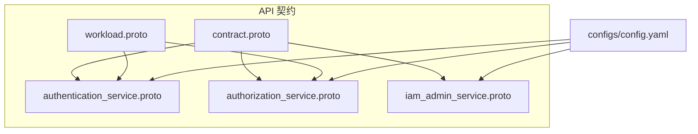

图表来源
- [contract.proto:1-212](file://api/iam/v1/contract.proto#L1-L212)
- [workload.proto:1-121](file://api/iam/v1/workload.proto#L1-L121)
- [authentication_service.proto:1-290](file://api/iam/v1/authentication_service.proto#L1-L290)
- [authorization_service.proto:1-40](file://api/iam/v1/authorization_service.proto#L1-L40)
- [iam_admin_service.proto:1-800](file://api/iam/v1/iam_admin_service.proto#L1-L800)
- [config.yaml:1-61](file://configs/config.yaml#L1-L61)

章节来源
- [README.md:1-8](file://api/README.md#L1-L8)
- [contract.proto:1-212](file://api/iam/v1/contract.proto#L1-L212)
- [workload.proto:1-121](file://api/iam/v1/workload.proto#L1-L121)
- [authentication_service.proto:1-290](file://api/iam/v1/authentication_service.proto#L1-L290)
- [authorization_service.proto:1-40](file://api/iam/v1/authorization_service.proto#L1-L40)
- [iam_admin_service.proto:1-800](file://api/iam/v1/iam_admin_service.proto#L1-L800)
- [config.yaml:1-61](file://configs/config.yaml#L1-L61)

## 核心组件
本节概述所有服务共享的核心消息与枚举，并说明其用途与约束。

- 边界与主体
  - Boundary：oneof，承载 TenantBoundary 或 PlatformBoundary，用于表示请求作用域。
  - TenantBoundary：包含 tenant_id。
  - PlatformBoundary：空消息，代表平台级边界。
  - PrincipalType：区分人类与工作负载主体。
  - PrincipalStatus：主体生命周期状态。
  - PrincipalContext：最小可信上下文，返回给调用方，包含主体标识、类型、状态、边界、会话与授权信息、认证方法列表。

- 凭证与会话
  - BearerCredential：原始凭据载体，严禁日志或持久化明文。
  - SessionSummary：人类会话摘要，不含敏感凭据，包含会话状态、授予项、认证方法、设备名与时间戳。
  - SessionGrantSummary：当前边界授予摘要，含 grant_id、boundary、version、status。
  - SessionStatus：会话状态枚举。
  - GrantStatus：授予状态枚举。

- 变更与授权
  - MutationResult：幂等变更结果，包含 resource_id 与 version。
  - AuthorizationTarget：请求属性集合，非权威资源所有权。
  - AuthorizationObligation：需要外部处理器加载权威状态的义务。
  - AuthorizationDecision：明确的授权决策，包含 allowed、reason、decision_id、principal、obligations、policy_revision。

- 错误与分页
  - IAMErrorReason：稳定错误原因枚举，用于 google.rpc.ErrorInfo.reason。
  - IAMErrorDetails：封装 google.rpc.ErrorInfo。
  - CursorPageRequest：游标分页请求，cursor 与 page_size。

- 工作负载相关（跨服务共享）
  - InvocationBinding：归一化的业务请求绑定，包含 audience、operation_id、rpc_method、source_operation_id、tenant_id、subject_id、resource_id、mode、request_sha256、policy_revision、target_revision。
  - WorkloadPeer：经 mTLS 验证后由接收方上报的对端身份。
  - DirectWorkloadCaller：单次调用的当前身份与权限。
  - VerifyWorkloadInvocationResponse / VerifySessionContinuationResponse / VerifyWorkloadCallerResponse：工作负载调用验证响应，包含 caller、subject、binding、过期时间等。

章节来源
- [contract.proto:13-212](file://api/iam/v1/contract.proto#L13-L212)
- [workload.proto:10-121](file://api/iam/v1/workload.proto#L10-L121)
- [authorization_service.proto:18-39](file://api/iam/v1/authorization_service.proto#L18-L39)

## 架构总览
下图展示通用类型在认证、授权与服务管理中的交互关系。PrincipalContext 作为最小可信上下文贯穿认证与授权流程；Boundary 限定作用域；BearerCredential 仅用于鉴权入口；MutationResult 统一表达幂等变更结果；IAMErrorDetails 统一错误语义。

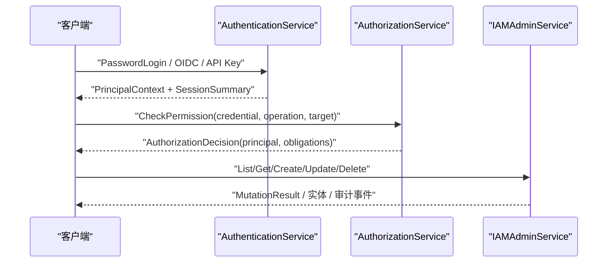

图表来源
- [authentication_service.proto:11-33](file://api/iam/v1/authentication_service.proto#L11-L33)
- [authorization_service.proto:10-16](file://api/iam/v1/authorization_service.proto#L10-L16)
- [iam_admin_service.proto:10-73](file://api/iam/v1/iam_admin_service.proto#L10-L73)
- [contract.proto:145-212](file://api/iam/v1/contract.proto#L145-L212)

## 详细组件分析

### 边界与作用域
- Boundary 为 oneof，只能选择 TenantBoundary 或 PlatformBoundary。
- TenantBoundary 必须包含非空的 tenant_id。
- PlatformBoundary 为空消息，用于平台级操作。

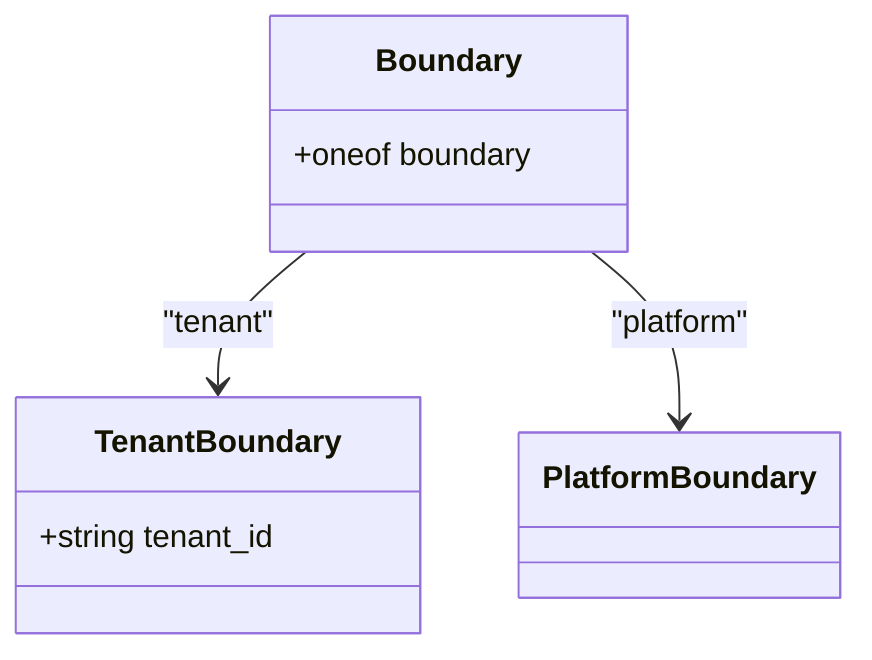

图表来源
- [contract.proto:129-143](file://api/iam/v1/contract.proto#L129-L143)

章节来源
- [contract.proto:129-143](file://api/iam/v1/contract.proto#L129-L143)

### 主体与上下文
- PrincipalType：PRINCIPAL_TYPE_UNSPECIFIED、PRINCIPAL_TYPE_HUMAN、PRINCIPAL_TYPE_WORKLOAD（保留 PRINCIPAL_TYPE_SERVICE）。
- PrincipalStatus：PRINCIPAL_STATUS_UNSPECIFIED、PRINCIPAL_STATUS_ACTIVE、PRINCIPAL_STATUS_DISABLED。
- PrincipalContext：包含 principal_id、principal_type、principal_status、boundary、session_id、grant_id、authn_methods。
- 约束：
  - principal_id 非空。
  - boundary 必须存在且有效。
  - authn_methods 为非空数组时，至少包含一种已认证的认证方式。

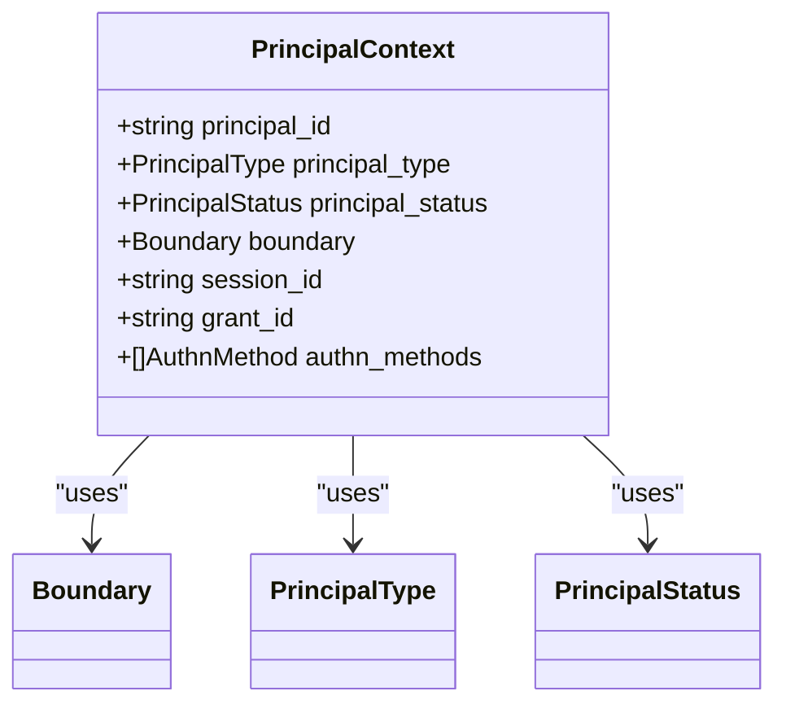

图表来源
- [contract.proto:150-159](file://api/iam/v1/contract.proto#L150-L159)

章节来源
- [contract.proto:21-35](file://api/iam/v1/contract.proto#L21-L35)
- [contract.proto:150-159](file://api/iam/v1/contract.proto#L150-L159)

### 凭证与会话
- BearerCredential：仅用于传输凭据，禁止日志或持久化明文。
- SessionSummary：包含 session_id、status、grants、authn_methods、device_name、created_at、idle_expires_at、absolute_expires_at。
- SessionGrantSummary：包含 grant_id、boundary、version、status。
- SessionStatus：ACTIVE、REVOKED、EXPIRED。
- GrantStatus：ACTIVE、REVOKED、EXPIRED。

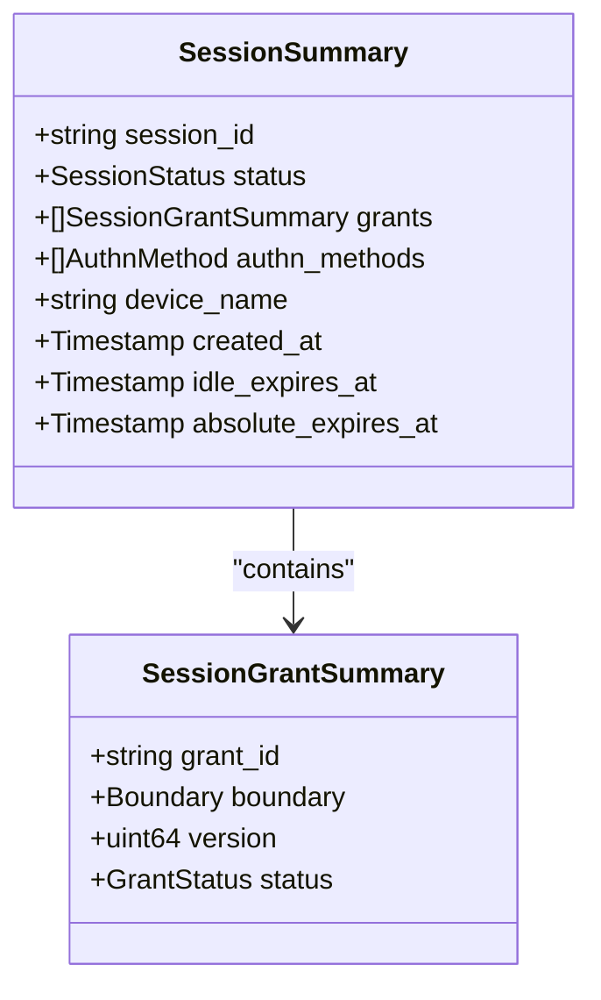

图表来源
- [contract.proto:161-179](file://api/iam/v1/contract.proto#L161-L179)

章节来源
- [contract.proto:145-179](file://api/iam/v1/contract.proto#L145-L179)

### 变更结果与授权目标
- MutationResult：幂等变更的结果标识，包含 resource_id 与 version。
- AuthorizationTarget：请求属性，包含 tenant_id、resource_id、attributes（map<string,string>）。
- AuthorizationObligation：type、handler、resource_id、expected_tenant_id。

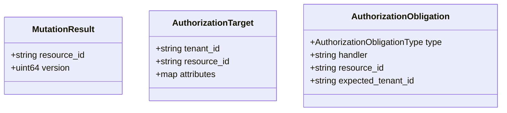

图表来源
- [contract.proto:187-206](file://api/iam/v1/contract.proto#L187-L206)

章节来源
- [contract.proto:187-206](file://api/iam/v1/contract.proto#L187-L206)

### 错误与分页
- IAMErrorReason：稳定的错误原因枚举，涵盖参数无效、未找到、凭据无效、权限拒绝、限流、策略不匹配、不可用、超时、租户未就绪、生命周期陈旧、幂等冲突、键过期、角色使用中、版本冲突、会话撤销、授予版本不匹配、引导指纹冲突、主版本不支持、邀请冲突、恢复冲突等。
- IAMErrorDetails：封装 google.rpc.ErrorInfo。
- CursorPageRequest：cursor 与 page_size，用于分页。

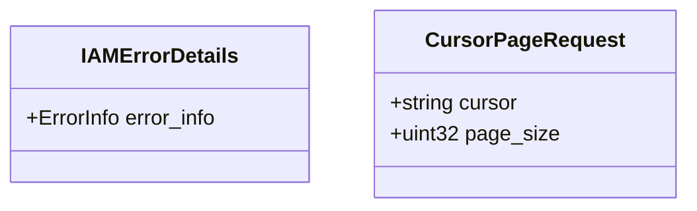

图表来源
- [contract.proto:103-127](file://api/iam/v1/contract.proto#L103-L127)
- [contract.proto:208-212](file://api/iam/v1/contract.proto#L208-L212)
- [contract.proto:181-185](file://api/iam/v1/contract.proto#L181-L185)

章节来源
- [contract.proto:103-127](file://api/iam/v1/contract.proto#L103-L127)
- [contract.proto:181-185](file://api/iam/v1/contract.proto#L181-L185)
- [contract.proto:208-212](file://api/iam/v1/contract.proto#L208-L212)

### 工作负载调用绑定与验证
- InvocationBinding：规范化业务请求绑定，包含 audience、operation_id、rpc_method、source_operation_id、tenant_id、subject_id、resource_id、mode、request_sha256、policy_revision、target_revision。
- WorkloadPeer：经 mTLS 验证后的对端身份，包含 environment、trust_domain、identity_kind、identity_value。
- DirectWorkloadCaller：当前调用者身份与权限，包含 principal_id、binding_id、principal_version、binding_version、grant_version、peer。
- VerifyWorkloadInvocationResponse：包含 api_key_id、continuation、continuation_expires_at、caller、subject、binding、expires_at。
- VerifySessionContinuationResponse：包含 caller、subject、binding、expires_at。
- VerifyWorkloadCallerResponse：包含 caller、expires_at、audience、operation_id、rpc_method、http_method、http_path、authority_revision。

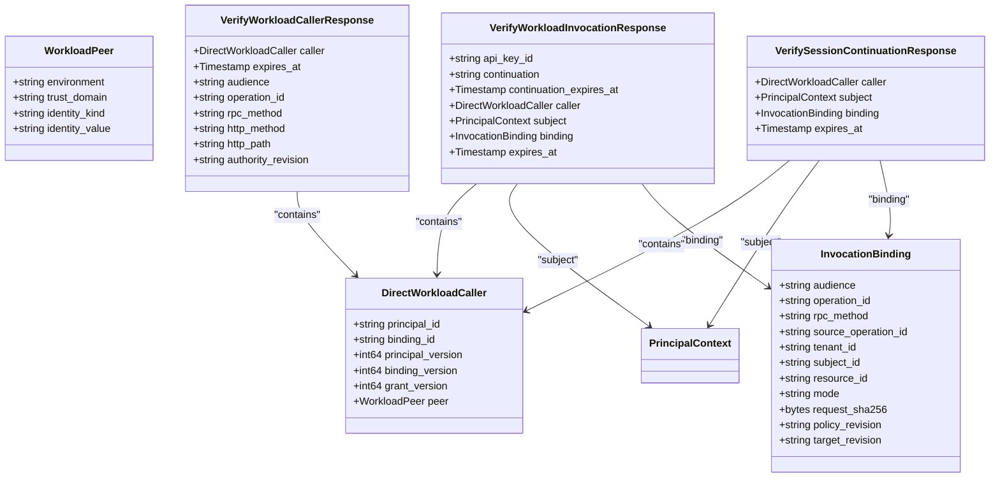

图表来源
- [workload.proto:10-121](file://api/iam/v1/workload.proto#L10-L121)
- [contract.proto:150-159](file://api/iam/v1/contract.proto#L150-L159)

章节来源
- [workload.proto:10-121](file://api/iam/v1/workload.proto#L10-L121)
- [contract.proto:150-159](file://api/iam/v1/contract.proto#L150-L159)

### 认证服务中的通用类型使用
- PasswordLoginResponse：返回 access_token、expires_in_seconds、principal（PrincipalContext）、session（SessionSummary）、grant（SessionGrantSummary）、refresh_token、refresh_expires_at。
- ListSessionsResponse：返回 sessions（SessionSummary 列表）与 next_cursor。
- ValidatePrincipalResponse：返回 principal（PrincipalContext）、decision_id、policy_revision。
- IssueWorkloadTokenResponse：返回 workload_token、expires_at、principal_id。

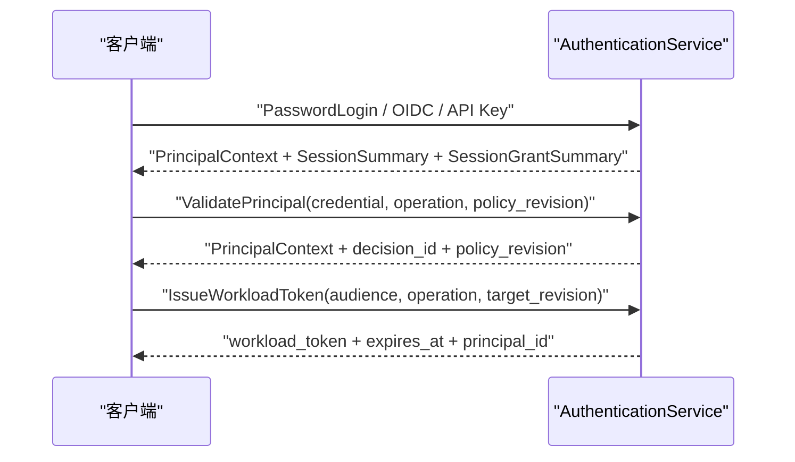

图表来源
- [authentication_service.proto:35-59](file://api/iam/v1/authentication_service.proto#L35-L59)
- [authentication_service.proto:188-198](file://api/iam/v1/authentication_service.proto#L188-L198)
- [authentication_service.proto:223-251](file://api/iam/v1/authentication_service.proto#L223-L251)

章节来源
- [authentication_service.proto:35-59](file://api/iam/v1/authentication_service.proto#L35-L59)
- [authentication_service.proto:188-198](file://api/iam/v1/authentication_service.proto#L188-L198)
- [authentication_service.proto:223-251](file://api/iam/v1/authentication_service.proto#L223-L251)

### 授权服务中的通用类型使用
- CheckPermissionRequest：携带 credential、operation_id、policy_revision、target（AuthorizationTarget）。
- CheckPermissionResponse：返回 decision（AuthorizationDecision）。
- AuthorizationDecision：allowed、reason、decision_id、principal（PrincipalContext）、obligations（AuthorizationObligation 列表）、policy_revision。

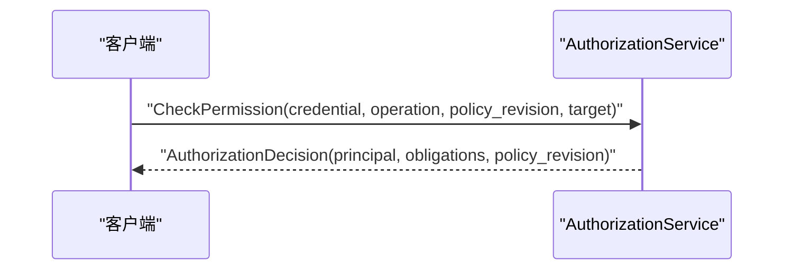

图表来源
- [authorization_service.proto:18-39](file://api/iam/v1/authorization_service.proto#L18-L39)

章节来源
- [authorization_service.proto:18-39](file://api/iam/v1/authorization_service.proto#L18-L39)

### 管理服务中的通用类型使用
- 管理接口广泛使用 BearerCredential、CursorPageRequest、Membership、Role、Invitation、TenantAccess、AuditEvent、RecoveryOperation、MutationResult 等。
- 典型场景：创建/更新/删除角色、成员、邀请、工作负载；查询审计事件；执行恢复引导；幂等变更返回 MutationResult。

章节来源
- [iam_admin_service.proto:10-800](file://api/iam/v1/iam_admin_service.proto#L10-L800)

## 依赖关系分析
- contract.proto 是所有服务的基线契约，被 authentication_service.proto、authorization_service.proto、iam_admin_service.proto 引用。
- workload.proto 引入 contract.proto，扩展工作负载调用绑定与验证。
- 配置 config.yaml 提供运行时参数（如 TLS、OIDC、Redis、PostgreSQL、策略修订等），影响认证与授权流程的行为。

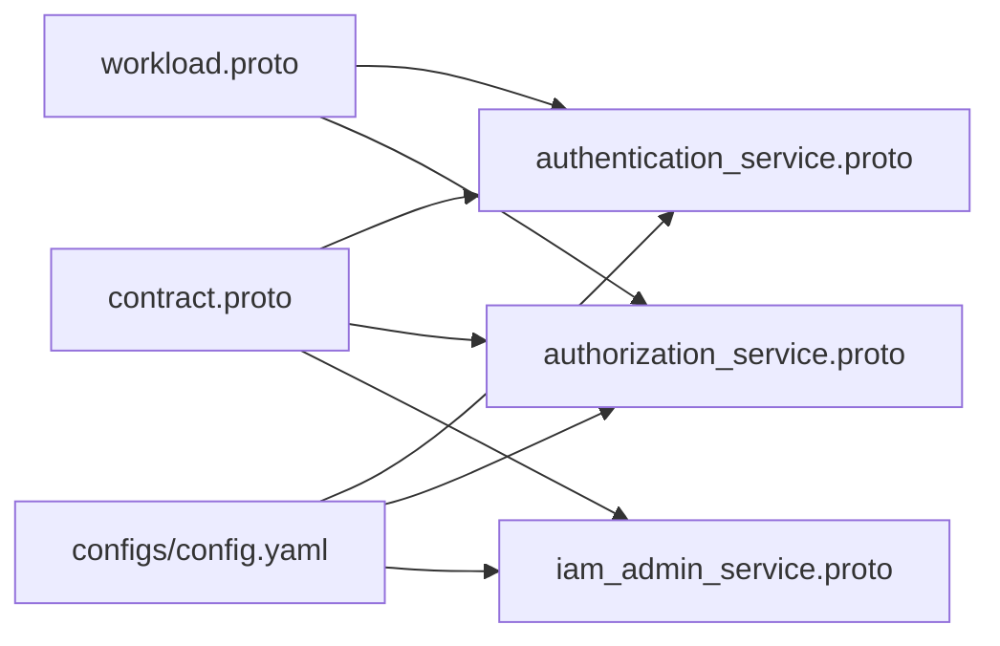

图表来源
- [contract.proto:1-212](file://api/iam/v1/contract.proto#L1-L212)
- [workload.proto:1-121](file://api/iam/v1/workload.proto#L1-L121)
- [authentication_service.proto:1-290](file://api/iam/v1/authentication_service.proto#L1-L290)
- [authorization_service.proto:1-40](file://api/iam/v1/authorization_service.proto#L1-L40)
- [iam_admin_service.proto:1-800](file://api/iam/v1/iam_admin_service.proto#L1-L800)
- [config.yaml:1-61](file://configs/config.yaml#L1-L61)

章节来源
- [contract.proto:1-212](file://api/iam/v1/contract.proto#L1-L212)
- [workload.proto:1-121](file://api/iam/v1/workload.proto#L1-L121)
- [authentication_service.proto:1-290](file://api/iam/v1/authentication_service.proto#L1-L290)
- [authorization_service.proto:1-40](file://api/iam/v1/authorization_service.proto#L1-L40)
- [iam_admin_service.proto:1-800](file://api/iam/v1/iam_admin_service.proto#L1-L800)
- [config.yaml:1-61](file://configs/config.yaml#L1-L61)

## 性能考虑
- 避免在日志或持久化中记录 BearerCredential 明文，减少敏感数据泄露风险与合规成本。
- 使用 CursorPageRequest 进行分页，限制 page_size，避免大结果集导致内存与网络压力。
- 利用 PolicyRevision 与 TargetRevision 进行策略与目标版本一致性校验，减少不必要的全量重算。
- 工作负载调用绑定中包含 request_sha256，确保请求体完整性与防篡改，降低重复计算开销。

[无需来源，因为本节提供一般性指导]

## 故障排查指南
- 遇到权限拒绝或凭据无效时，检查 IAMErrorReason 的具体原因码，定位是参数无效、凭据无效、权限不足还是系统不可用。
- 若出现版本冲突或授予版本不匹配，确认调用方是否使用了过期的 policy_revision 或 grant_version。
- 会话撤销或过期时，检查 SessionStatus 与 GrantStatus，必要时刷新会话或重新认证。
- 对于工作负载调用失败，核对 InvocationBinding 的 audience、operation_id、rpc_method、target_revision 是否与策略一致。

章节来源
- [contract.proto:103-127](file://api/iam/v1/contract.proto#L103-L127)
- [workload.proto:10-121](file://api/iam/v1/workload.proto#L10-L121)

## 结论
ANI IAM v1 的通用类型以 contract.proto 为核心，围绕边界、主体、凭证、会话、变更与授权构建了清晰、稳定、可演进的契约体系。通过 PrincipalContext 的最小可信上下文、Boundary 的作用域隔离、MutationResult 的幂等变更语义、IAMErrorDetails 的稳定错误模型，以及工作负载绑定的严格规范化，确保了跨服务的一致性与安全性。遵循本文档的类型定义、验证规则与最佳实践，可在保证向后兼容的前提下安全地演进与集成。

[无需来源，因为本节总结而不分析具体文件]

## 附录

### 枚举值定义
- Audience：AUDIENCE_UNSPECIFIED、AUDIENCE_CONSOLE、AUDIENCE_BOSS、AUDIENCE_INTERNAL。
- PrincipalType：PRINCIPAL_TYPE_UNSPECIFIED、PRINCIPAL_TYPE_HUMAN、PRINCIPAL_TYPE_WORKLOAD（保留 PRINCIPAL_TYPE_SERVICE）。
- PrincipalStatus：PRINCIPAL_STATUS_UNSPECIFIED、PRINCIPAL_STATUS_ACTIVE、PRINCIPAL_STATUS_DISABLED。
- AuthnMethod：AUTHN_METHOD_UNSPECIFIED、AUTHN_METHOD_PASSWORD、AUTHN_METHOD_OIDC、AUTHN_METHOD_API_KEY、AUTHN_METHOD_WORKLOAD_TOKEN（保留 AUTHN_METHOD_SERVICE_TOKEN）。
- SessionStatus：SESSION_STATUS_UNSPECIFIED、SESSION_STATUS_ACTIVE、SESSION_STATUS_REVOKED、SESSION_STATUS_EXPIRED。
- GrantStatus：GRANT_STATUS_UNSPECIFIED、GRANT_STATUS_ACTIVE、GRANT_STATUS_REVOKED、GRANT_STATUS_EXPIRED。
- TenantAccessStatus：TENANT_ACCESS_STATUS_UNSPECIFIED、TENANT_ACCESS_STATUS_BOOTSTRAP_PENDING、TENANT_ACCESS_STATUS_ACTIVE、TENANT_ACCESS_STATUS_SUSPENDED。
- MembershipStatus：MEMBERSHIP_STATUS_UNSPECIFIED、MEMBERSHIP_STATUS_ACTIVE、MEMBERSHIP_STATUS_SUSPENDED、MEMBERSHIP_STATUS_REMOVED。
- InvitationStatus：INVITATION_STATUS_UNSPECIFIED、INVITATION_STATUS_PENDING、INVITATION_STATUS_ACCEPTED、INVITATION_STATUS_CANCELLED、INVITATION_STATUS_EXPIRED。
- APIKeyStatus：API_KEY_STATUS_UNSPECIFIED、API_KEY_STATUS_ACTIVE、API_KEY_STATUS_REVOKED、API_KEY_STATUS_EXPIRED。
- AuthorizationObligationType：AUTHORIZATION_OBLIGATION_TYPE_UNSPECIFIED、AUTHORIZATION_OBLIGATION_TYPE_RESOURCE_TENANT_MATCH。
- IAMErrorReason：详见前文错误原因列表。

章节来源
- [contract.proto:13-127](file://api/iam/v1/contract.proto#L13-L127)

### 字段含义、数据类型与约束
- PrincipalContext
  - principal_id：字符串，必填。
  - principal_type：枚举，必填。
  - principal_status：枚举，必填。
  - boundary：oneof，必填。
  - session_id：字符串，必填。
  - grant_id：字符串，必填。
  - authn_methods：枚举数组，可选但建议非空以表明认证方式。
- BearerCredential
  - value：字符串，必填；严禁日志或持久化明文。
- SessionSummary
  - session_id：字符串，必填。
  - status：枚举，必填。
  - grants：SessionGrantSummary 数组，可选。
  - authn_methods：枚举数组，可选。
  - device_name：字符串，可选。
  - created_at、idle_expires_at、absolute_expires_at：时间戳，必填。
- MutationResult
  - resource_id：字符串，必填。
  - version：无符号整数，必填。
- AuthorizationTarget
  - tenant_id：字符串，可选。
  - resource_id：字符串，可选。
  - attributes：map<string,string>，可选。
- IAMErrorDetails
  - error_info：google.rpc.ErrorInfo，必填。

章节来源
- [contract.proto:145-212](file://api/iam/v1/contract.proto#L145-L212)

### 类型关系图与继承结构
- Boundary 为 oneof，承载 TenantBoundary 或 PlatformBoundary。
- PrincipalContext 依赖 Boundary、PrincipalType、PrincipalStatus、AuthnMethod。
- SessionSummary 依赖 SessionGrantSummary、Boundary、AuthnMethod、时间戳。
- 工作负载响应依赖 DirectWorkloadCaller、PrincipalContext、InvocationBinding。

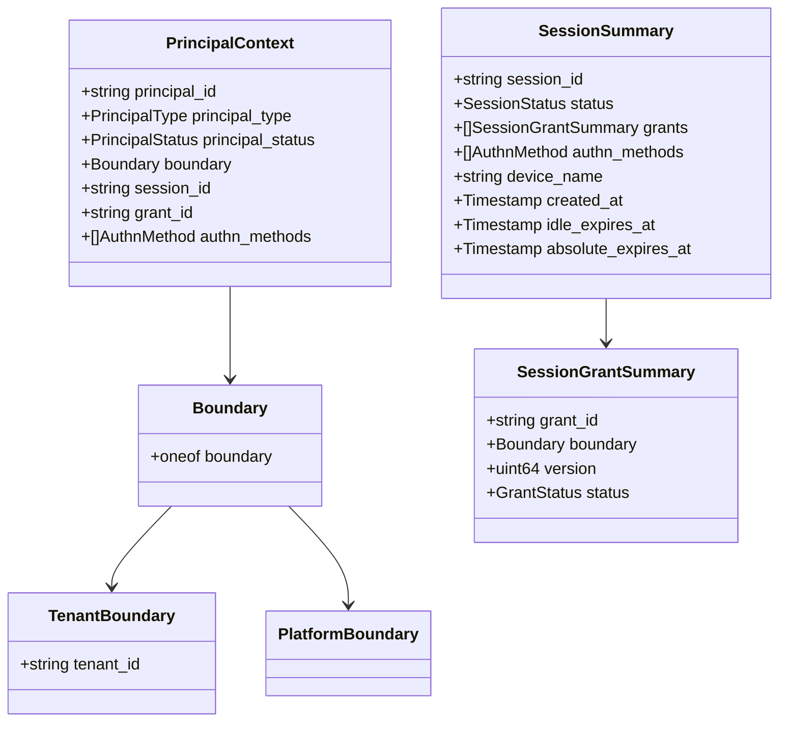

图表来源
- [contract.proto:129-179](file://api/iam/v1/contract.proto#L129-L179)

### 版本兼容性、向后兼容性与迁移注意事项
- 版本：v1 为不可变主版本契约，新增字段需保持向后兼容，废弃字段使用 reserved 标记。
- 向后兼容：
  - 新增可选字段不影响旧客户端解析。
  - 枚举新增值需避免破坏旧客户端判断逻辑。
  - 移除或重命名字段需通过 reserved 保留编号，防止重用。
- 迁移：
  - 客户端应忽略未知字段，避免解析失败。
  - 服务端应在过渡期同时支持新旧字段，逐步淘汰旧字段。
  - 策略修订（policy_revision）与目标修订（target_revision）用于确保策略与目标一致性，迁移时需同步更新。

章节来源
- [contract.proto:1-12](file://api/iam/v1/contract.proto#L1-L12)
- [workload.proto:1-8](file://api/iam/v1/workload.proto#L1-L8)

### JSON 序列化示例
以下为基于 Protobuf 的 JSON 序列化示意（字段名遵循 protobuf json_name）：

- PrincipalContext
  - 示例：{"principal_id":"p-123","principal_type":"PRINCIPAL_TYPE_HUMAN","principal_status":"PRINCIPAL_STATUS_ACTIVE","boundary":{"tenant":{"tenant_id":"t-abc"}},"session_id":"s-1","grant_id":"g-1","authn_methods":["AUTHN_METHOD_PASSWORD"]}
- BearerCredential
  - 示例：{"value":"<token>"}
- SessionSummary
  - 示例：{"session_id":"s-1","status":"SESSION_STATUS_ACTIVE","grants":[{"grant_id":"g-1","boundary":{"tenant":{"tenant_id":"t-abc"}},"version":1,"status":"GRANT_STATUS_ACTIVE"}],"authn_methods":["AUTHN_METHOD_PASSWORD"],"device_name":"Chrome","created_at":"2026-01-01T00:00:00Z","idle_expires_at":"2026-01-01T01:00:00Z","absolute_expires_at":"2026-01-01T02:00:00Z"}
- MutationResult
  - 示例：{"resource_id":"r-1","version":2}
- AuthorizationTarget
  - 示例：{"tenant_id":"t-abc","resource_id":"res-1","attributes":{"env":"prod"}}
- IAMErrorDetails
  - 示例：{"error_info":{"reason":"IAM_ERROR_REASON_PERMISSION_DENIED","domain":"iam.v1"}}

[无需来源，因为本节提供概念性示例]

### 客户端使用指南
- 认证流程：
  - 使用 AuthenticationService 的 PasswordLogin 或 OIDC 登录，获取 PrincipalContext 与 SessionSummary。
  - 使用 RefreshSession 刷新会话，注意 CSRF 与 Origin 校验。
  - 使用 LogoutSession 注销会话，返回 MutationResult。
- 授权流程：
  - 使用 AuthorizationService 的 CheckPermission，传入 BearerCredential、operation_id、policy_revision、AuthorizationTarget。
  - 处理 AuthorizationDecision，关注 obligations 与 policy_revision。
- 工作负载调用：
  - 使用 VerifyWorkloadInvocation 或 VerifySessionContinuation，传入 InvocationBinding 与 observed_peer。
  - 使用 VerifyWorkloadCaller 验证工作负载调用者，关注 authority_revision。
- 分页与查询：
  - 使用 CursorPageRequest 进行分页，合理设置 page_size。
  - 使用 IAMAdminService 的管理接口进行资源管理与审计查询。

章节来源
- [authentication_service.proto:35-251](file://api/iam/v1/authentication_service.proto#L35-L251)
- [authorization_service.proto:18-39](file://api/iam/v1/authorization_service.proto#L18-L39)
- [workload.proto:46-121](file://api/iam/v1/workload.proto#L46-L121)
- [iam_admin_service.proto:10-800](file://api/iam/v1/iam_admin_service.proto#L10-L800)