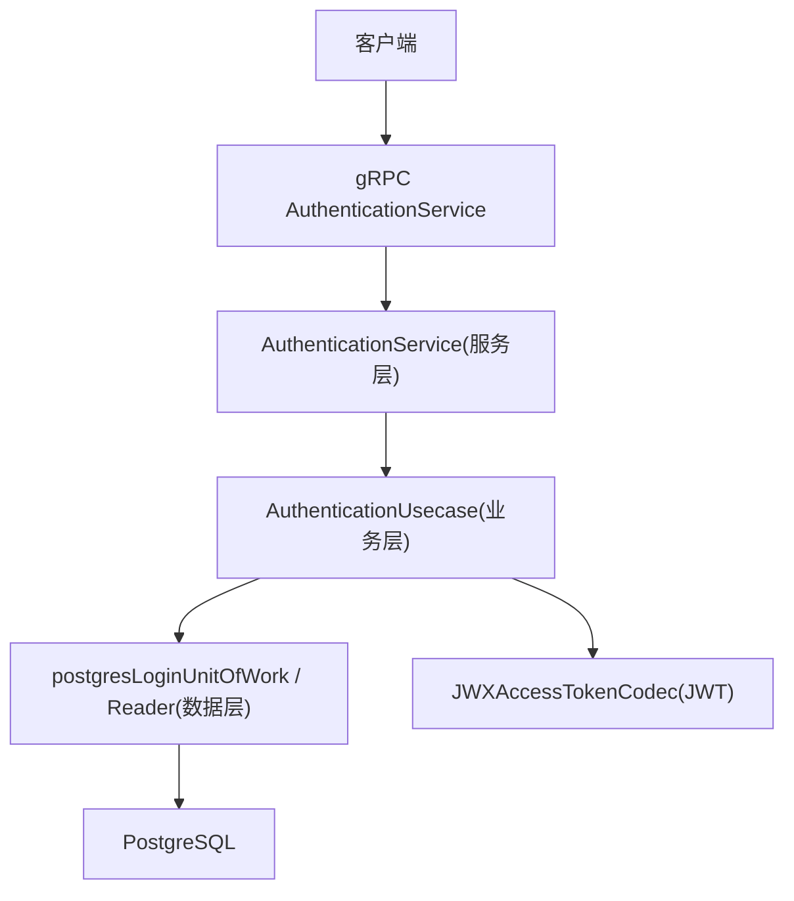
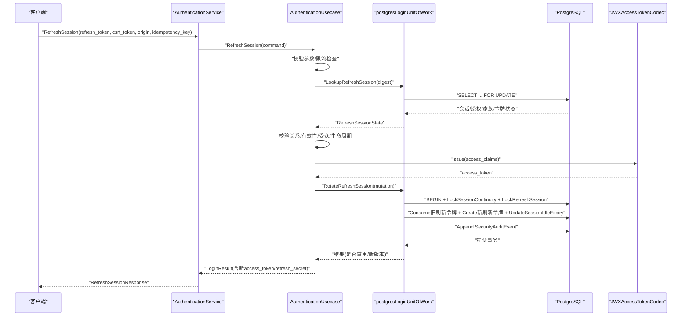
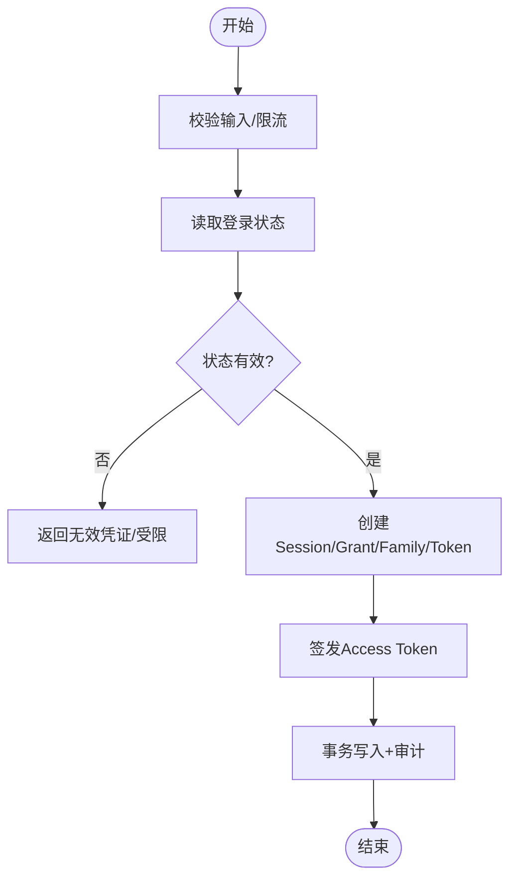
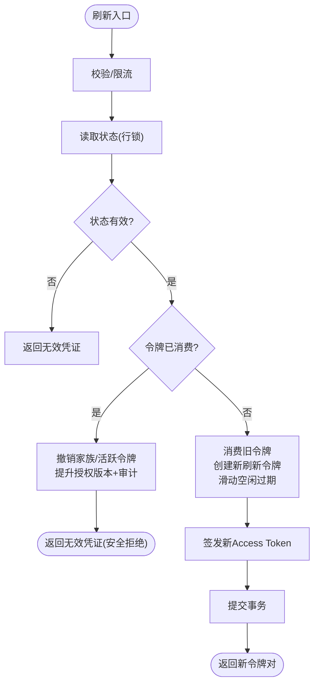
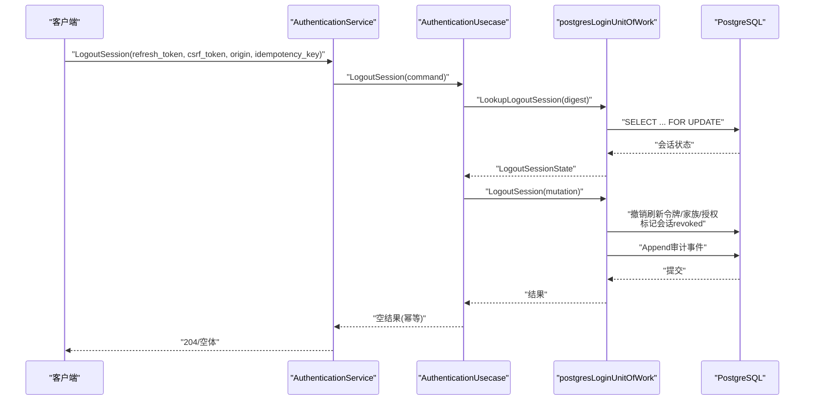
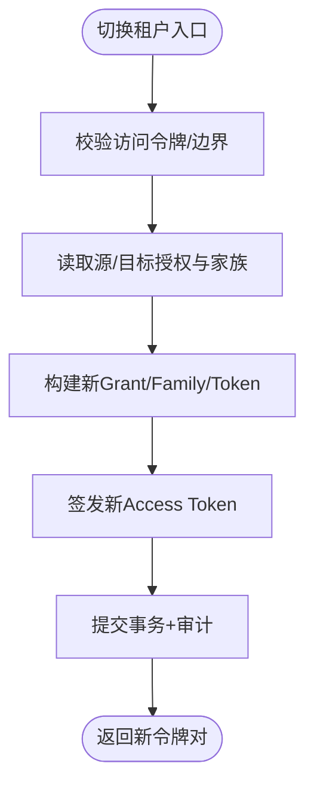
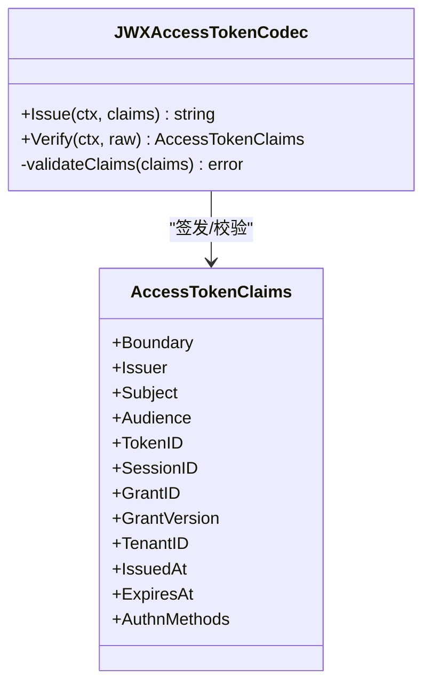
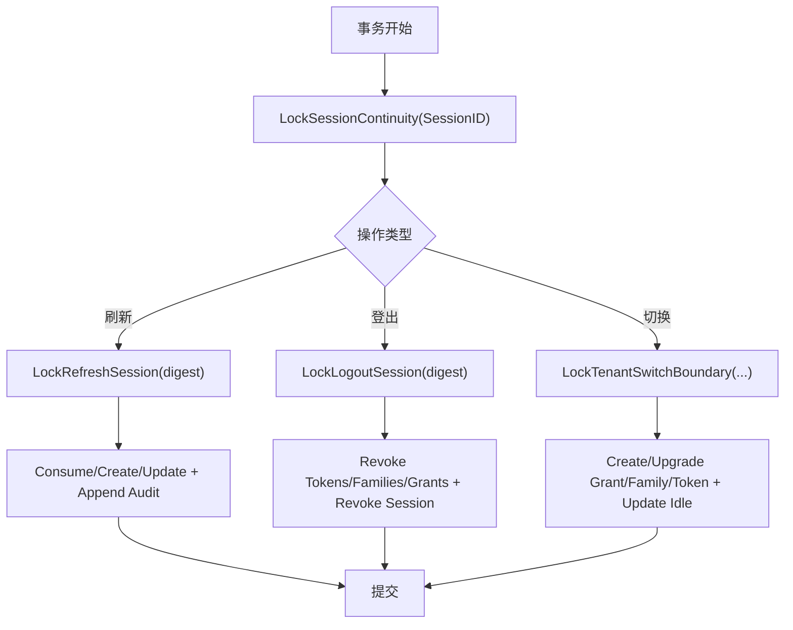
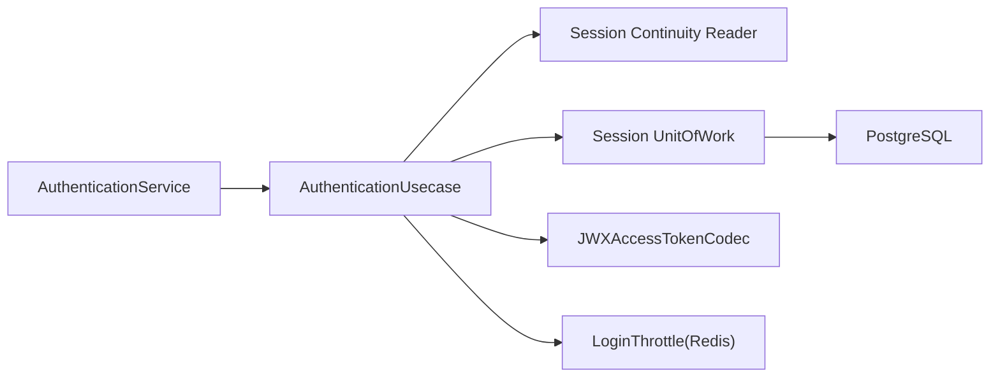

# 会话管理

<cite>
**本文引用的文件**
- [authentication_service.proto](file://api/iam/v1/authentication_service.proto)
- [authentication.go（服务层）](file://internal/service/authentication.go)
- [session.go（业务用例）](file://internal/biz/session.go)
- [authentication.go（业务用例）](file://internal/biz/authentication.go)
- [session_postgres.go（持久化）](file://internal/data/session_postgres.go)
- [access_token_jwx.go（JWT编解码）](file://internal/data/access_token_jwx.go)
- [session_query.go（查询）](file://internal/data/session_query.go)
- [202609070002_session_continuity.sql（迁移）](file://migrations/202609070002_session_continuity.sql)
</cite>

## 目录
1. [简介](#简介)
2. [项目结构](#项目结构)
3. [核心组件](#核心组件)
4. [架构总览](#架构总览)
5. [详细组件分析](#详细组件分析)
6. [依赖关系分析](#依赖关系分析)
7. [性能考虑](#性能考虑)
8. [故障排查指南](#故障排查指南)
9. [结论](#结论)
10. [附录：API参考与使用示例](#附录api参考与使用示例)

## 简介
本文件面向ANI IAM的会话管理系统，系统性阐述会话生命周期（创建、刷新、续期、撤销）、JWT访问令牌与刷新令牌的生成、验证与轮换策略，以及会话持久化、并发控制、状态同步机制。文档同时提供安全最佳实践、性能优化建议与故障恢复策略，并给出完整的API参考与典型业务场景的使用示例。

## 项目结构
会话相关能力横跨四层：
- API层：定义gRPC接口契约，包括登录、刷新、登出、切换租户等。
- 服务层：将请求参数映射为领域命令，调用业务用例，并将错误映射为gRPC状态。
- 业务层：实现会话生命周期核心逻辑，包含刷新、登出、租户切换、审计事件构造与校验。
- 数据层：通过PostgreSQL事务与行级锁保证并发安全；通过JWX实现JWT签发与校验；通过SQLC生成的查询完成读写。

图表来源
- [authentication_service.proto:12-33](file://api/iam/v1/authentication_service.proto#L12-L33)
- [authentication.go（服务层）:196-254](file://internal/service/authentication.go#L196-L254)
- [session.go（业务用例）:154-478](file://internal/biz/session.go#L154-L478)
- [session_postgres.go（持久化）:75-498](file://internal/data/session_postgres.go#L75-L498)
- [access_token_jwx.go（JWT编解码）:83-225](file://internal/data/access_token_jwx.go#L83-L225)

章节来源
- [authentication_service.proto:12-33](file://api/iam/v1/authentication_service.proto#L12-L33)
- [authentication.go（服务层）:196-254](file://internal/service/authentication.go#L196-L254)

## 核心组件
- 会话与会话授权
  - Session：会话实体，包含主体、受众、状态、版本、空闲与绝对过期时间、认证方法等。
  - SessionGrant：会话在特定租户或平台边界的授权，带版本用于乐观并发。
  - RefreshTokenFamily：刷新令牌族，限制每族仅一个活跃刷新令牌，支持替换链。
  - RefreshToken：刷新令牌，存储摘要而非明文，支持consumed/replaced_by记录替换关系。
- 令牌与鉴权
  - AccessTokenClaims：访问令牌声明，包含主体、会话、授权、租户、认证方法、有效期等。
  - JWXAccessTokenCodec：EdDSA签名的JWT签发与校验，强制最小声明集与受众/边界约束。
- 会话操作
  - 刷新会话：校验CSRF/Origin/幂等键，防重放限流，读取状态，生成新刷新令牌与访问令牌，原子更新。
  - 登出会话：基于刷新令牌摘要定位会话，撤销当前会话的所有刷新令牌、家族与授权，写入审计。
  - 切换租户：基于当前有效访问令牌，为目标租户建立新的授权与刷新令牌族，返回新令牌对。
- 持久化与并发
  - 使用ReadCommitted事务+显式行锁（LockSessionContinuity/LockRefreshSession/LockTenantSwitchBoundary等）串行化关键路径。
  - 通过版本字段与唯一索引确保一致性（如refresh_tokens_one_active_family_idx）。
- 审计与可观测性
  - 所有关键变更均产生SecurityAuditEvent，附带目标类型、版本、原因、请求ID等。

章节来源
- [authentication.go（业务用例）:114-188](file://internal/biz/authentication.go#L114-L188)
- [access_token_jwx.go（JWT编解码）:83-225](file://internal/data/access_token_jwx.go#L83-L225)
- [session.go（业务用例）:154-478](file://internal/biz/session.go#L154-L478)
- [session_postgres.go（持久化）:75-498](file://internal/data/session_postgres.go#L75-L498)

## 架构总览
下图展示一次“刷新会话”的端到端流程，涵盖限流、状态读取、并发锁定、令牌签发与持久化。

图表来源
- [authentication.go（服务层）:196-211](file://internal/service/authentication.go#L196-L211)
- [session.go（业务用例）:154-286](file://internal/biz/session.go#L154-L286)
- [session_postgres.go（持久化）:75-165](file://internal/data/session_postgres.go#L75-L165)
- [access_token_jwx.go（JWT编解码）:83-134](file://internal/data/access_token_jwx.go#L83-L134)

## 详细组件分析

### 会话创建（密码/OIDC登录）
- 输入校验与限流：账号、密码、受众、源IP、幂等键；失败计数与锁定。
- 状态读取与校验：主体、成员资格、租户访问、生命周期新鲜度与状态。
- 资源创建：Session、SessionGrant、RefreshTokenFamily、RefreshToken（仅存摘要）。
- 签发访问令牌：构造AccessTokenClaims，设置受众、边界、会话/授权ID、认证方法、最短有效期。
- 持久化与审计：事务内写入所有实体并追加审计事件；成功后重置限流桶。

图表来源
- [authentication.go（业务用例）:341-530](file://internal/biz/authentication.go#L341-L530)
- [session_postgres.go（持久化）:75-165](file://internal/data/session_postgres.go#L75-L165)

章节来源
- [authentication.go（业务用例）:341-530](file://internal/biz/authentication.go#L341-L530)

### 会话刷新（Refresh）
- 前置校验：必须携带refresh_token、csrf_token、origin、idempotency_key；按刷新摘要进行限流。
- 状态读取：根据digest查找会话、授权、家族与令牌关系，校验受众、生命周期、成员资格等。
- 并发与重用保护：
  - 若令牌已consumed，进入“重用处理”分支：撤销整个家族及活跃令牌，提升授权版本，记录审计。
  - 否则消费旧令牌，创建新刷新令牌，滑动会话空闲过期时间，签发新访问令牌。
- 并发控制：以会话维度LockSessionContinuity与LockRefreshSession串行化，避免竞态。
- 结果：返回新access_token与内部refresh_secret（供Gateway写HttpOnly Cookie）。

图表来源
- [session.go（业务用例）:154-286](file://internal/biz/session.go#L154-L286)
- [session_postgres.go（持久化）:75-165](file://internal/data/session_postgres.go#L75-L165)

章节来源
- [session.go（业务用例）:154-286](file://internal/biz/session.go#L154-L286)
- [session_postgres.go（持久化）:75-165](file://internal/data/session_postgres.go#L75-L165)

### 会话登出（Logout）
- 基于refresh_token摘要定位会话，确认会话仍为active。
- 撤销当前会话的所有刷新令牌、家族与授权，标记会话为revoked。
- 写入审计事件，幂等响应（不泄露是否存在）。

图表来源
- [session.go（业务用例）:288-348](file://internal/biz/session.go#L288-L348)
- [session_postgres.go（持久化）:268-350](file://internal/data/session_postgres.go#L268-L350)

章节来源
- [session.go（业务用例）:288-348](file://internal/biz/session.go#L288-L348)
- [session_postgres.go（持久化）:268-350](file://internal/data/session_postgres.go#L268-L350)

### 切换租户（Switch Tenant）
- 基于当前有效的访问令牌校验主体、会话、授权与租户边界。
- 为目标租户建立或升级授权与刷新令牌族，必要时消费目标侧活跃刷新令牌。
- 滑动会话空闲过期时间，签发新访问令牌与刷新令牌，记录审计。

图表来源
- [session.go（业务用例）:350-478](file://internal/biz/session.go#L350-L478)
- [session_postgres.go（持久化）:352-498](file://internal/data/session_postgres.go#L352-L498)

章节来源
- [session.go（业务用例）:350-478](file://internal/biz/session.go#L350-L478)
- [session_postgres.go（持久化）:352-498](file://internal/data/session_postgres.go#L352-L498)

### JWT访问令牌策略
- 算法与密钥：EdDSA签名，活动私钥签发，多公钥验证；key_id标注于头部。
- 声明约束：强制包含主体、受众、会话ID、授权ID、授权版本、认证方法、颁发者、时间戳；租户边界与受众严格匹配；最大有效期受受众限制（Console/Boss不同）。
- 校验流程：解析JWS、校验签名、校验必需声明、校验受众/边界/时间窗口。
- 轮换机制：通过配置活动key_id与验证密钥集合实现无感轮换；验证时支持历史公钥。

图表来源
- [access_token_jwx.go（JWT编解码）:83-225](file://internal/data/access_token_jwx.go#L83-L225)
- [access_token_jwx.go（JWT编解码）:332-378](file://internal/data/access_token_jwx.go#L332-L378)

章节来源
- [access_token_jwx.go（JWT编解码）:83-225](file://internal/data/access_token_jwx.go#L83-L225)
- [access_token_jwx.go（JWT编解码）:332-378](file://internal/data/access_token_jwx.go#L332-L378)

### 持久化与并发控制
- 行级锁与序列化：
  - LockSessionContinuity：以会话ID为粒度串行化刷新/登出/切换。
  - LockRefreshSession：锁定具体刷新令牌，防止重复消费与并发替换。
  - LockTenantSwitchBoundary：跨租户边界串行化切换。
- 版本控制：Session/Grant/Family均维护version，更新时校验期望版本，冲突则返回版本冲突错误。
- 唯一约束：refresh_tokens_one_active_family_idx保证每族仅一个活跃刷新令牌。
- 事务隔离：ReadCommitted，结合显式锁与版本检查，保证强一致。

图表来源
- [session_postgres.go（持久化）:75-165](file://internal/data/session_postgres.go#L75-L165)
- [session_postgres.go（持久化）:268-350](file://internal/data/session_postgres.go#L268-L350)
- [session_postgres.go（持久化）:352-498](file://internal/data/session_postgres.go#L352-L498)
- [202609070002_session_continuity.sql:1-19](file://migrations/202609070002_session_continuity.sql#L1-L19)

章节来源
- [session_postgres.go（持久化）:75-165](file://internal/data/session_postgres.go#L75-L165)
- [session_postgres.go（持久化）:268-350](file://internal/data/session_postgres.go#L268-L350)
- [session_postgres.go（持久化）:352-498](file://internal/data/session_postgres.go#L352-L498)
- [202609070002_session_continuity.sql:1-19](file://migrations/202609070002_session_continuity.sql#L1-L19)

## 依赖关系分析
- 服务层依赖业务用例接口，业务用例依赖数据层端口（Reader/UoW）与令牌编解码器。
- 数据层通过SQLC生成查询，直接操作PostgreSQL；通过Redis/其他适配器实现限流（由throttle抽象）。
- 外部依赖：OIDC（可选）、审计系统（通过安全审计表持久化）。

图表来源
- [authentication.go（服务层）:22-30](file://internal/service/authentication.go#L22-L30)
- [session.go（业务用例）:141-152](file://internal/biz/session.go#L141-L152)
- [access_token_jwx.go（JWT编解码）:42-81](file://internal/data/access_token_jwx.go#L42-L81)

章节来源
- [authentication.go（服务层）:22-30](file://internal/service/authentication.go#L22-L30)
- [session.go（业务用例）:141-152](file://internal/biz/session.go#L141-L152)

## 性能考虑
- 刷新路径最小化IO：仅在必要时读取聚合状态，使用行锁减少重试。
- 访问令牌短寿命：降低泄露风险与验证成本；刷新令牌负责长驻会话。
- 刷新令牌族限制：每族仅一个活跃令牌，避免大规模吊销开销。
- 审计事件追加：采用append-only设计，便于回放与审计。
- 限流与退避：基于摘要的刷新限流，避免热点攻击。

[本节为通用指导，无需引用具体文件]

## 故障排查指南
- 常见错误与含义
  - 无效凭证：刷新令牌不存在/已消费/关系不一致/受众或生命周期不满足。
  - 版本冲突：并发更新导致期望版本不匹配，需重试。
  - 依赖不可用：认证/授权/持久化依赖异常，通常伴随IAM_UNAVAILABLE。
  - 速率限制：刷新频率超限，需等待retry_after。
- 定位步骤
  - 核对请求参数：refresh_token、csrf_token、origin、idempotency_key是否齐全。
  - 检查数据库状态：刷新令牌是否consumed/replaced_by、家族是否被撤销、授权版本是否提升。
  - 查看审计事件：刷新/重用/登出/切换对应的SecurityAuditEvent。
  - 观察限流：确认是否命中刷新限流。

章节来源
- [authentication.go（服务层）:476-683](file://internal/service/authentication.go#L476-L683)
- [session.go（业务用例）:154-286](file://internal/biz/session.go#L154-L286)
- [session_postgres.go（持久化）:75-165](file://internal/data/session_postgres.go#L75-L165)

## 结论
ANI IAM的会话管理以“会话-授权-刷新令牌族-刷新令牌”为核心模型，通过严格的声明校验、行级锁与版本控制实现高可靠的生命周期管理。JWT访问令牌短命且强约束，刷新令牌仅存摘要并以族为单位轮换，兼顾安全性与性能。完善的审计与错误映射使问题定位与运维更加高效。

[本节为总结，无需引用具体文件]

## 附录：API参考与使用示例

### gRPC接口概览
- PasswordLogin：创建会话，返回access_token与内部refresh_secret。
- RefreshSession：刷新会话，返回新access_token与内部refresh_secret。
- LogoutSession：撤销当前会话，幂等。
- SwitchTenant：切换租户，返回新access_token与内部refresh_secret。
- ValidatePrincipal：验证访问令牌，返回最小可信上下文。

章节来源
- [authentication_service.proto:12-33](file://api/iam/v1/authentication_service.proto#L12-L33)
- [authentication_service.proto:150-186](file://api/iam/v1/authentication_service.proto#L150-L186)

### 典型场景与调用要点
- 浏览器登录
  - 调用PasswordLogin，服务端返回access_token与内部refresh_secret。
  - Gateway将refresh_secret写入HttpOnly Cookie，后续刷新请求携带csrf_token与origin。
- 刷新会话
  - 调用RefreshSession，携带refresh_token、csrf_token、origin、idempotency_key。
  - 成功返回新access_token与内部refresh_secret，客户端更新Cookie。
- 登出
  - 调用LogoutSession，携带相同参数；服务端幂等地撤销会话。
- 切换租户
  - 调用SwitchTenant，携带当前access_token与目标tenant_id；返回新令牌对。
- 验证访问令牌
  - 调用ValidatePrincipal，传入access_token与operation_id/policy_revision；返回principal上下文。

章节来源
- [authentication.go（服务层）:150-254](file://internal/service/authentication.go#L150-L254)
- [authentication_service.proto:150-186](file://api/iam/v1/authentication_service.proto#L150-L186)

### 安全最佳实践
- 刷新令牌仅存摘要，不在任何键/值中暴露明文。
- 刷新令牌族限制单活跃令牌，重用即触发全族撤销。
- 访问令牌短寿命且强声明校验，禁止越权边界/受众。
- 刷新请求强制csrf_token与origin，防止CSRF。
- 幂等键保障刷新/登出/切换的可重试性与去重。
- 审计事件完整记录关键动作，便于追溯与合规。

章节来源
- [session.go（业务用例）:154-286](file://internal/biz/session.go#L154-L286)
- [access_token_jwx.go（JWT编解码）:332-378](file://internal/data/access_token_jwx.go#L332-L378)
- [202609070002_session_continuity.sql:1-19](file://migrations/202609070002_session_continuity.sql#L1-L19)

### 性能优化技巧
- 刷新路径优先读聚合状态，减少多次查询。
- 使用行级锁串行化关键路径，避免竞争与回滚风暴。
- 访问令牌短命，减轻后端验证压力。
- 审计事件append-only，避免复杂更新。

[本节为通用指导，无需引用具体文件]

### 故障恢复策略
- 幂等键：对刷新/登出/切换使用幂等键，支持重试与回放。
- 版本冲突：遇到版本冲突应快速失败并重试。
- 依赖降级：当依赖不可用时，统一返回IAM_UNAVAILABLE，前端可退避重试。
- 审计回放：通过审计事件重建决策证据，辅助排障。

章节来源
- [authentication.go（服务层）:476-683](file://internal/service/authentication.go#L476-L683)
- [session.go（业务用例）:154-286](file://internal/biz/session.go#L154-L286)