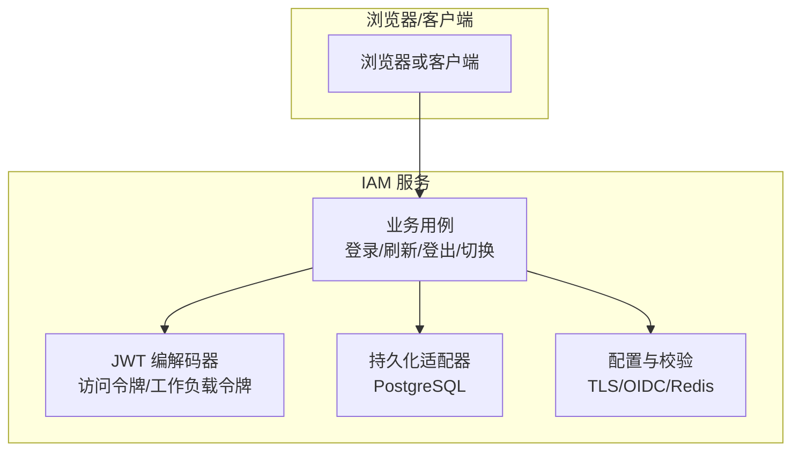
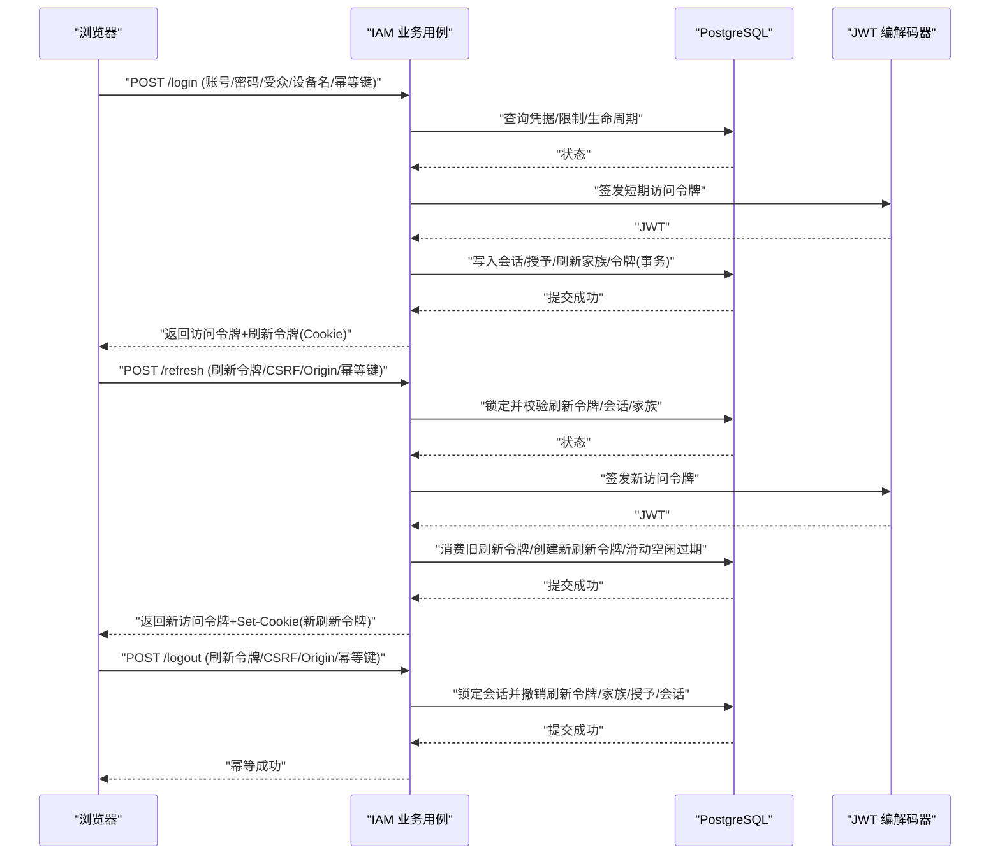
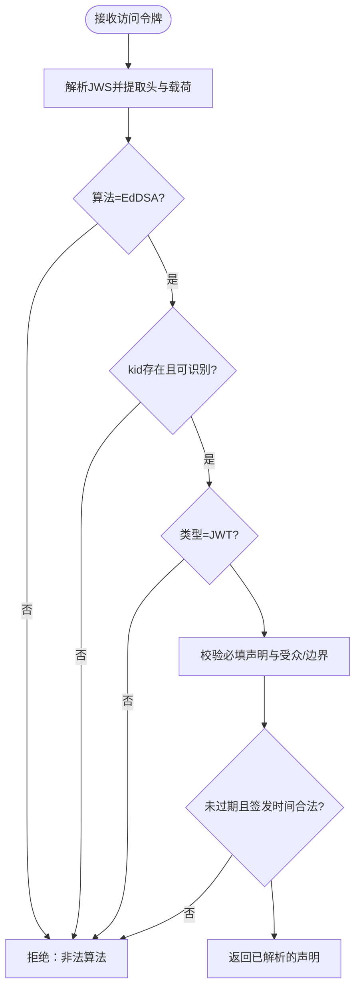
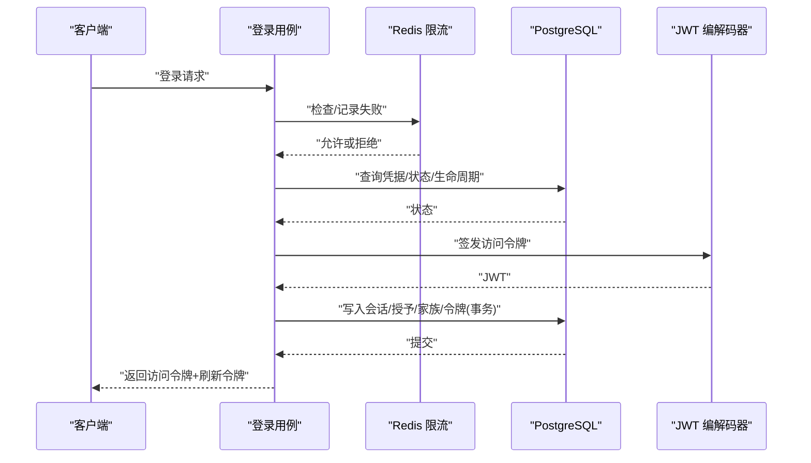
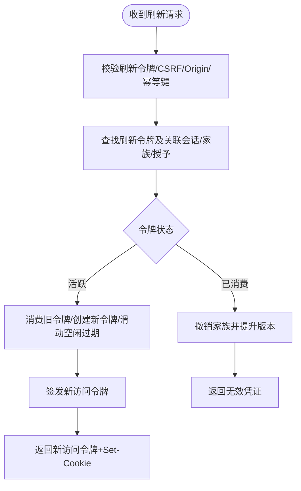
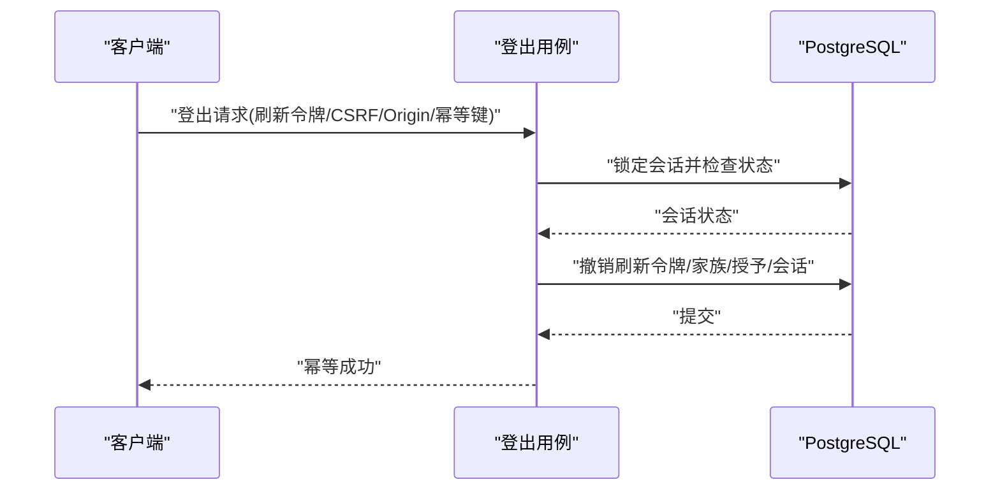
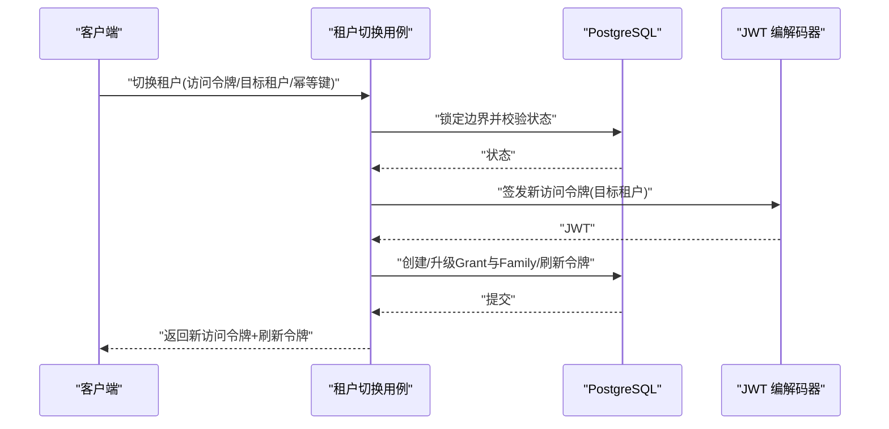
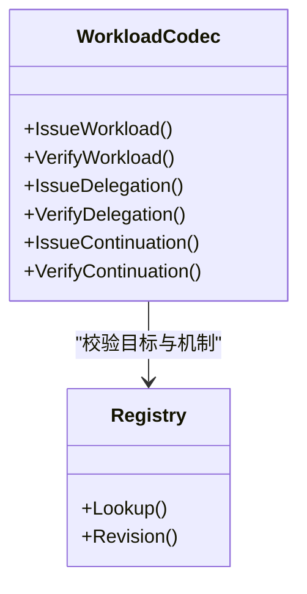
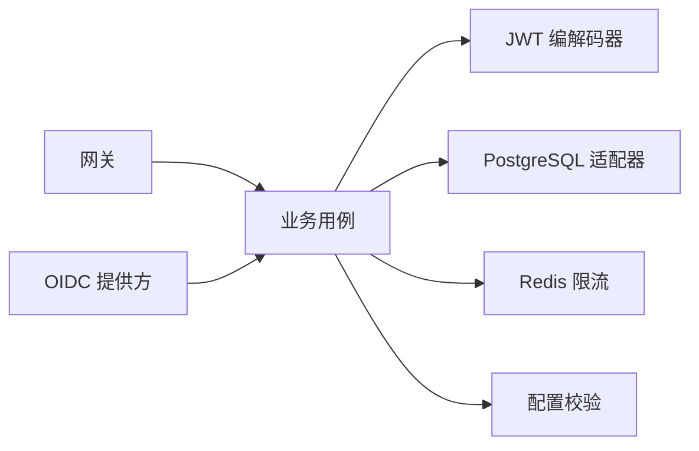

# 令牌与会话安全

<cite>
**本文引用的文件**
- [0012-use-short-boundary-tokens-and-rotating-refresh-families.md](file://docs/adr/0012-use-short-boundary-tokens-and-rotating-refresh-families.md)
- [0013-use-durable-session-grants-instead-of-a-jwt-blocklist.md](file://docs/adr/0013-use-durable-session-grants-instead-of-a-jwt-blocklist.md)
- [0015-keep-browser-refresh-tokens-in-http-only-cookies.md](file://docs/adr/0015-keep-browser-refresh-tokens-in-http-only-cookies.md)
- [authentication.go](file://internal/biz/authentication.go)
- [session.go](file://internal/biz/session.go)
- [access_token_jwx.go](file://internal/data/access_token_jwx.go)
- [workload_token_jwx.go](file://internal/data/workload_token_jwx.go)
- [session_postgres.go](file://internal/data/session_postgres.go)
- [config.yaml](file://configs/config.yaml)
- [validate.go](file://internal/conf/validate.go)
- [workload_identity.go](file://internal/server/workload_identity.go)
</cite>

## 目录
1. [简介](#简介)
2. [项目结构](#项目结构)
3. [核心组件](#核心组件)
4. [架构总览](#架构总览)
5. [详细组件分析](#详细组件分析)
6. [依赖关系分析](#依赖关系分析)
7. [性能与可用性](#性能与可用性)
8. [故障排查指南](#故障排查指南)
9. [结论](#结论)
10. [附录：最佳实践与检查清单](#附录最佳实践与检查清单)

## 简介
本文件系统性说明 ANI IAM 的令牌与会话安全设计，覆盖 JWT 访问令牌的生成、签名验证与过期管理；会话创建、维护与销毁的安全流程；短期访问令牌、刷新令牌与令牌轮换策略；令牌存储安全、Cookie 安全与跨域安全；以及会话劫持防护、并发会话控制、会话超时管理、令牌泄露检测与安全最佳实践。文档以代码级实现为依据，结合架构决策记录（ADR）进行解释。

## 项目结构
围绕令牌与会话安全的实现主要分布在以下层次：
- 业务用例层：登录、刷新、登出、租户切换等流程编排与状态校验
- 数据持久化层：PostgreSQL 中的会话、授权授予、刷新令牌族与令牌状态
- 令牌编解码层：JWT 签发与验证（EdDSA），工作负载令牌与委托令牌
- 配置与运行时约束：TLS、OIDC、Redis 限流、访问令牌密钥等
- 网关与中间件：mTLS 身份认证、CSRF/CORS 策略由网关侧配合（见 ADR）

图表来源
- [authentication.go:317-530](file://internal/biz/authentication.go#L317-L530)
- [session.go:154-478](file://internal/biz/session.go#L154-L478)
- [access_token_jwx.go:83-225](file://internal/data/access_token_jwx.go#L83-L225)
- [session_postgres.go:75-350](file://internal/data/session_postgres.go#L75-L350)
- [config.yaml:1-61](file://configs/config.yaml#L1-L61)

章节来源
- [authentication.go:317-530](file://internal/biz/authentication.go#L317-L530)
- [session.go:154-478](file://internal/biz/session.go#L154-L478)
- [access_token_jwx.go:83-225](file://internal/data/access_token_jwx.go#L83-L225)
- [session_postgres.go:75-350](file://internal/data/session_postgres.go#L75-L350)
- [config.yaml:1-61](file://configs/config.yaml#L1-L61)

## 核心组件
- 登录与会话创建：密码或 OIDC 登录后创建 Session、SessionGrant、RefreshTokenFamily 与 RefreshToken，并签发短期 Access Token
- 刷新与轮换：基于单用刷新令牌原子旋转，失败重用则撤销家族并提升版本，使旧 Access Token 失效
- 登出：按刷新令牌摘要定位会话，幂等撤销当前会话及其所有刷新令牌与家族
- 租户切换：在同一 Session 下为不同 Tenant 建立独立 Grant/Family，签发新的 Access Token 与 Refresh Token
- JWT 访问令牌：仅包含稳定上下文（发行者、主体、受众、时间、边界、会话/授权标识、认证方法），不包含角色/权限等动态信息
- 工作负载令牌：短生命周期、绑定调用方与目标操作，支持委托与延续令牌

章节来源
- [authentication.go:341-530](file://internal/biz/authentication.go#L341-L530)
- [session.go:154-478](file://internal/biz/session.go#L154-L478)
- [access_token_jwx.go:83-225](file://internal/data/access_token_jwx.go#L83-L225)
- [workload_token_jwx.go:36-102](file://internal/data/workload_token_jwx.go#L36-L102)

## 架构总览
下图展示从浏览器到 IAM 的登录、刷新、登出与租户切换的关键交互，以及 PostgreSQL 作为权威状态源的角色。

图表来源
- [authentication.go:341-530](file://internal/biz/authentication.go#L341-L530)
- [session.go:154-478](file://internal/biz/session.go#L154-L478)
- [session_postgres.go:75-350](file://internal/data/session_postgres.go#L75-L350)
- [access_token_jwx.go:83-225](file://internal/data/access_token_jwx.go#L83-L225)

## 详细组件分析

### 访问令牌签发与验证（JWT）
- 算法与密钥：使用 EdDSA，通过 active_key_id 标识活动密钥，验证时使用多公钥集合以支持密钥轮换
- 载荷最小化：仅包含必要上下文（发行者、主体、受众、时间、边界、会话/授权标识、认证方法），不包含角色/权限等动态信息
- 受众与边界：Console 与 BOSS 分别对应租户边界与平台边界，禁止越界
- 过期策略：Console 最长 15 分钟，BOSS 最长 10 分钟；签发时严格校验最大生命周期
- 验证流程：解析 JWS、校验算法/类型/kid、公钥匹配、必填声明、时间有效性、受众与边界一致性

图表来源
- [access_token_jwx.go:169-225](file://internal/data/access_token_jwx.go#L169-L225)
- [access_token_jwx.go:332-378](file://internal/data/access_token_jwx.go#L332-L378)

章节来源
- [access_token_jwx.go:83-225](file://internal/data/access_token_jwx.go#L83-L225)
- [access_token_jwx.go:332-378](file://internal/data/access_token_jwx.go#L332-L378)
- [0012-use-short-boundary-tokens-and-rotating-refresh-families.md:9-24](file://docs/adr/0012-use-short-boundary-tokens-and-rotating-refresh-families.md#L9-L24)

### 会话创建（登录）
- 输入校验：账号、密码、受众、源 IP、幂等键
- 限流与锁定：基于 Redis 的登录限流，失败累计触发账户级锁定
- 凭据校验：未知账号也执行 dummy 验证以避免枚举
- 会话与授权：创建 Session、SessionGrant、RefreshTokenFamily、RefreshToken，并签发短期 Access Token
- 审计：记录成功登录事件，包含认证方法与边界

图表来源
- [authentication.go:341-530](file://internal/biz/authentication.go#L341-L530)
- [session_postgres.go:75-165](file://internal/data/session_postgres.go#L75-L165)
- [config.yaml:22-32](file://configs/config.yaml#L22-L32)

章节来源
- [authentication.go:341-530](file://internal/biz/authentication.go#L341-L530)
- [config.yaml:22-32](file://configs/config.yaml#L22-L32)

### 刷新与令牌轮换
- 单用刷新令牌：每次刷新必须消费旧令牌并原子创建新令牌
- 并发安全：数据库行锁序列化刷新与重用处理，避免竞态
- 重用检测：若检测到重复使用，撤销刷新家族并提升授权版本，使该边界下的所有访问令牌失效
- 会话滑动：刷新时更新会话空闲过期时间，但不超过绝对过期时间
- 审计：记录刷新成功与重用事件

图表来源
- [session.go:154-286](file://internal/biz/session.go#L154-L286)
- [session_postgres.go:75-165](file://internal/data/session_postgres.go#L75-L165)
- [session_postgres.go:167-266](file://internal/data/session_postgres.go#L167-L266)

章节来源
- [session.go:154-286](file://internal/biz/session.go#L154-L286)
- [session_postgres.go:75-165](file://internal/data/session_postgres.go#L75-L165)
- [session_postgres.go:167-266](file://internal/data/session_postgres.go#L167-L266)

### 登出与会话销毁
- 幂等性：对已注销的会话再次登出仍视为成功且不暴露历史
- 撤销范围：撤销当前会话的所有刷新令牌、刷新家族、授予与会话本身
- 审计：记录登出事件，包含认证方法与版本变更

图表来源
- [session.go:288-348](file://internal/biz/session.go#L288-L348)
- [session_postgres.go:268-350](file://internal/data/session_postgres.go#L268-L350)

章节来源
- [session.go:288-348](file://internal/biz/session.go#L288-L348)
- [session_postgres.go:268-350](file://internal/data/session_postgres.go#L268-L350)

### 租户切换
- 重新授权：切换到目标租户后，为该边界建立独立的 SessionGrant 与 RefreshTokenFamily
- 令牌隔离：一个租户的刷新令牌不能用于另一个租户
- 版本控制：切换可能复用已有 Grant/Family 并提升版本，确保旧令牌失效
- 审计：记录租户切换事件

图表来源
- [session.go:350-478](file://internal/biz/session.go#L350-L478)
- [session_postgres.go:352-498](file://internal/data/session_postgres.go#L352-L498)

章节来源
- [session.go:350-478](file://internal/biz/session.go#L350-L478)
- [session_postgres.go:352-498](file://internal/data/session_postgres.go#L352-L498)

### 工作负载令牌与委托
- 工作负载令牌：短生命周期，绑定调用方身份与目标操作，使用专用类型与私有关联上下文
- 委托令牌：在注册的工作负载之间传递有限授权，受注册表与受众约束
- 延续令牌：跨调用链维持上下文，严格校验调用方与接收方能力
- 验证：强制类型、算法、kid、受众、TTL 与上下文完整性

图表来源
- [workload_token_jwx.go:36-102](file://internal/data/workload_token_jwx.go#L36-L102)
- [workload_token_jwx.go:182-250](file://internal/data/workload_token_jwx.go#L182-L250)

章节来源
- [workload_token_jwx.go:36-102](file://internal/data/workload_token_jwx.go#L36-L102)
- [workload_token_jwx.go:182-250](file://internal/data/workload_token_jwx.go#L182-L250)

### Cookie 安全与跨域安全
- 刷新令牌存放：浏览器端刷新令牌置于 HttpOnly、Secure、SameSite=Lax 的 host-scoped Cookie，JavaScript 不可读
- CSRF 保护：刷新、登出、租户切换需同时校验 Origin/Referer 白名单与独立 CSRF token
- 路由限制：仅显式注册的认证路由可消费刷新 Cookie；网关在转发普通业务请求前剥离刷新 Cookie
- 重定向 URI：OIDC 回调地址要求精确匹配，禁止通配与部分主机匹配
- 生产 CORS：生产环境 CORS 策略为上线就绪决策项

章节来源
- [0015-keep-browser-refresh-tokens-in-http-only-cookies.md:5-36](file://docs/adr/0015-keep-browser-refresh-tokens-in-http-only-cookies.md#L5-L36)

### 会话劫持防护与并发控制
- 刷新令牌重用即撤销：一旦检测到刷新令牌被重复使用，立即撤销家族并提升授权版本，使同边界下所有访问令牌失效
- 数据库行锁：刷新与登出均通过会话连续性锁串行化，防止并发竞争
- 会话列表与全局撤销：支持列出会话并显式撤销；密码重置会撤销该主体的所有会话、家族与访问令牌
- 审计追踪：所有关键状态转换均有审计事件，便于检测异常与回溯

章节来源
- [0013-use-durable-session-grants-instead-of-a-jwt-blocklist.md:9-24](file://docs/adr/0013-use-durable-session-grants-instead-of-a-jwt-blocklist.md#L9-L24)
- [session_postgres.go:75-165](file://internal/data/session_postgres.go#L75-L165)
- [session_postgres.go:167-266](file://internal/data/session_postgres.go#L167-L266)
- [session_postgres.go:268-350](file://internal/data/session_postgres.go#L268-L350)

### 会话超时管理
- 三种过期：访问令牌最短（Console 15 分钟，BOSS 10 分钟）、空闲过期（Console 7 天，BOSS 30 分钟）、绝对过期（Console 30 天，BOSS 8 小时）
- 刷新滑动：刷新时更新空闲过期时间，但不得超过绝对过期时间
- 会话状态：会话与授予均维护版本与状态，过期或撤销后无法继续使用

章节来源
- [authentication.go:634-645](file://internal/biz/authentication.go#L634-L645)
- [session.go:571-581](file://internal/biz/session.go#L571-L581)
- [0012-use-short-boundary-tokens-and-rotating-refresh-families.md:9-16](file://docs/adr/0012-use-short-boundary-tokens-and-rotating-refresh-families.md#L9-L16)

## 依赖关系分析
- 业务用例依赖：
  - 令牌编解码器：签发与验证访问令牌与工作负载令牌
  - 持久化适配器：PostgreSQL 事务与行锁保证刷新、登出、切换的一致性
  - 限流器：Redis 用于登录与刷新限流，不可用时返回 503，不降级
  - 配置校验：TLS、OIDC、访问令牌密钥、策略修订等启动时强校验
- 外部集成：
  - OIDC Provider：授权码流程、PKCE、回调地址严格校验
  - 网关：负责 Cookie/CSRF/CORS 与认证路由适配

图表来源
- [authentication.go:317-530](file://internal/biz/authentication.go#L317-L530)
- [session.go:154-478](file://internal/biz/session.go#L154-L478)
- [validate.go:47-168](file://internal/conf/validate.go#L47-L168)
- [config.yaml:1-61](file://configs/config.yaml#L1-L61)

章节来源
- [authentication.go:317-530](file://internal/biz/authentication.go#L317-L530)
- [session.go:154-478](file://internal/biz/session.go#L154-L478)
- [validate.go:47-168](file://internal/conf/validate.go#L47-L168)
- [config.yaml:1-61](file://configs/config.yaml#L1-L61)

## 性能与可用性
- 无 JWT 黑名单：以 PostgreSQL 为权威状态源，减少分布式缓存一致性与容量压力
- 行锁串行化：刷新与登出通过会话连续性锁串行，避免并发冲突
- 限流降级：Redis 不可用时返回 503，不削弱防重放与滥用防护
- 短令牌：访问令牌短生命周期降低泄露风险与验证成本

章节来源
- [0013-use-durable-session-grants-instead-of-a-jwt-blocklist.md:9-18](file://docs/adr/0013-use-durable-session-grants-instead-of-a-jwt-blocklist.md#L9-L18)
- [session_postgres.go:75-165](file://internal/data/session_postgres.go#L75-L165)

## 故障排查指南
- 刷新失败：
  - 检查刷新令牌是否已消费或被重用；查看家族与授予版本是否提升
  - 确认会话空闲/绝对过期未到达
  - 核对 CSRF、Origin、幂等键是否完整
- 登录失败：
  - 检查 Redis 限流是否触发；确认账户是否锁定
  - 核对凭据版本与生命周期状态
- 令牌验证失败：
  - 检查 kid 是否可识别、算法是否为 EdDSA、类型是否为 JWT
  - 核对受众、边界、时间有效性与声明完整性
- 登出不生效：
  - 确认刷新令牌摘要正确；检查会话状态是否已撤销
  - 幂等重试应返回成功且不暴露历史

章节来源
- [session.go:154-286](file://internal/biz/session.go#L154-L286)
- [session_postgres.go:75-350](file://internal/data/session_postgres.go#L75-L350)
- [access_token_jwx.go:169-225](file://internal/data/access_token_jwx.go#L169-L225)

## 结论
ANI IAM 采用“短期访问令牌 + 单用刷新令牌 + 持久化授权授予”的组合，将令牌与状态解耦并通过数据库权威化，确保高安全性与可审计性。通过严格的 JWT 验证、刷新轮换、会话滑动与并发控制，系统有效防范令牌泄露、会话劫持与重放攻击。配合网关的 Cookie/CSRF/CORS 策略与 mTLS 工作负载身份，形成端到端的安全闭环。

## 附录：最佳实践与检查清单
- 令牌策略
  - 访问令牌保持最短可用生命周期；刷新令牌单用且原子轮换
  - 不在令牌中携带角色/权限等动态信息，在线评估授权
- 存储与传输
  - 刷新令牌仅存于 HttpOnly、Secure、SameSite=Lax Cookie；JS 不可读
  - 所有内部通信启用 TLS；gRPC 使用 mTLS 与 DNS 身份校验
- 跨域与 CSRF
  - 刷新、登出、租户切换需 Origin/Referer 白名单与独立 CSRF token
  - OIDC 回调地址精确匹配，禁止通配
- 并发与会话
  - 刷新与登出通过数据库行锁串行化；重用刷新令牌立即撤销家族
  - 支持会话列表与显式撤销；密码重置全局撤销
- 监控与审计
  - 记录登录、刷新、登出、租户切换与重用事件
  - 定期审查审计日志，发现异常模式及时处置

章节来源
- [0012-use-short-boundary-tokens-and-rotating-refresh-families.md:9-24](file://docs/adr/0012-use-short-boundary-tokens-and-rotating-refresh-families.md#L9-L24)
- [0013-use-durable-session-grants-instead-of-a-jwt-blocklist.md:9-24](file://docs/adr/0013-use-durable-session-grants-instead-of-a-jwt-blocklist.md#L9-L24)
- [0015-keep-browser-refresh-tokens-in-http-only-cookies.md:5-36](file://docs/adr/0015-keep-browser-refresh-tokens-in-http-only-cookies.md#L5-L36)
- [workload_identity.go:22-50](file://internal/server/workload_identity.go#L22-L50)