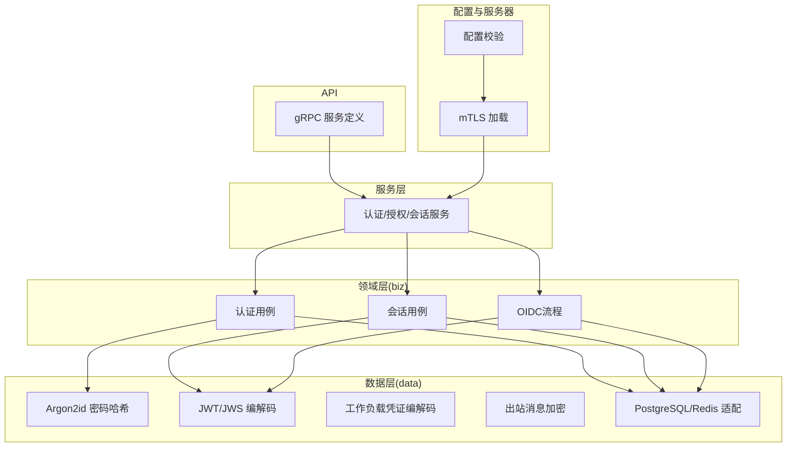
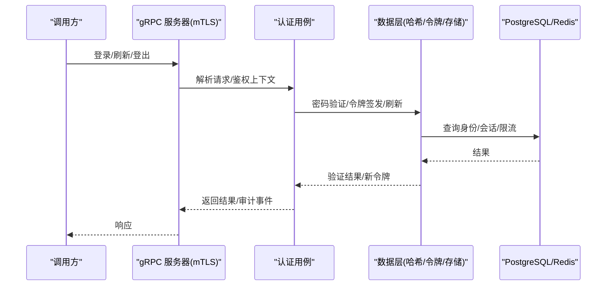
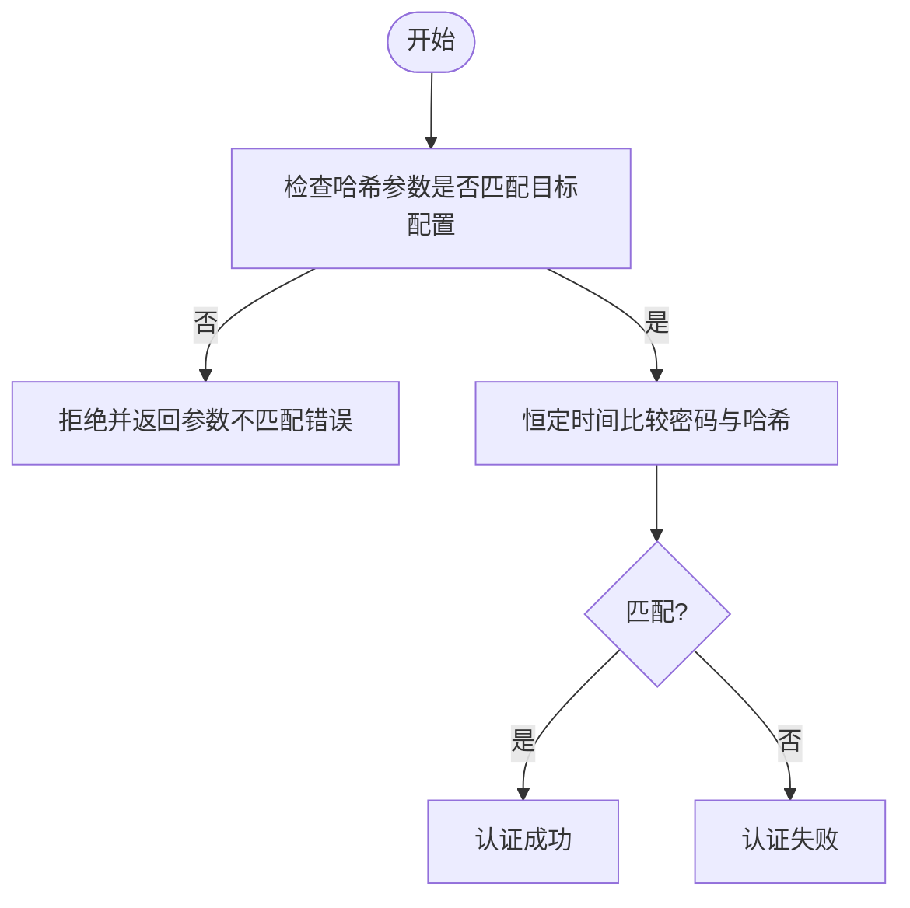
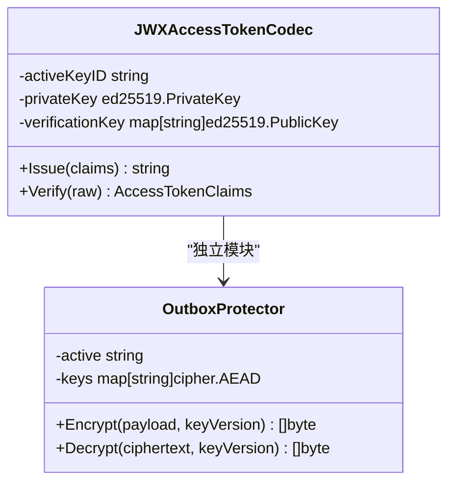
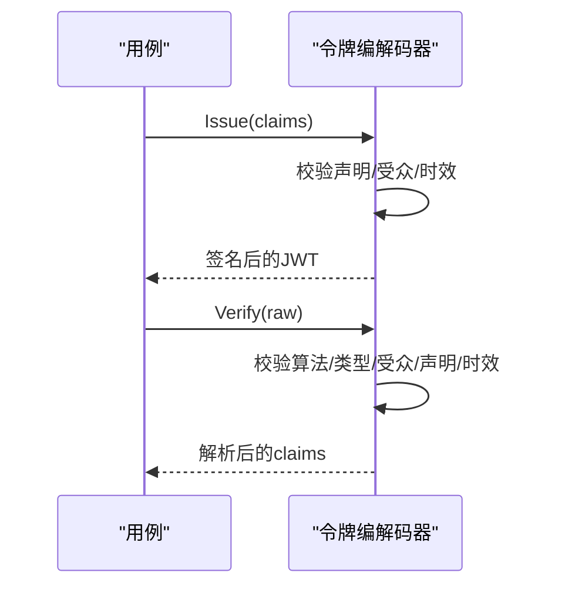
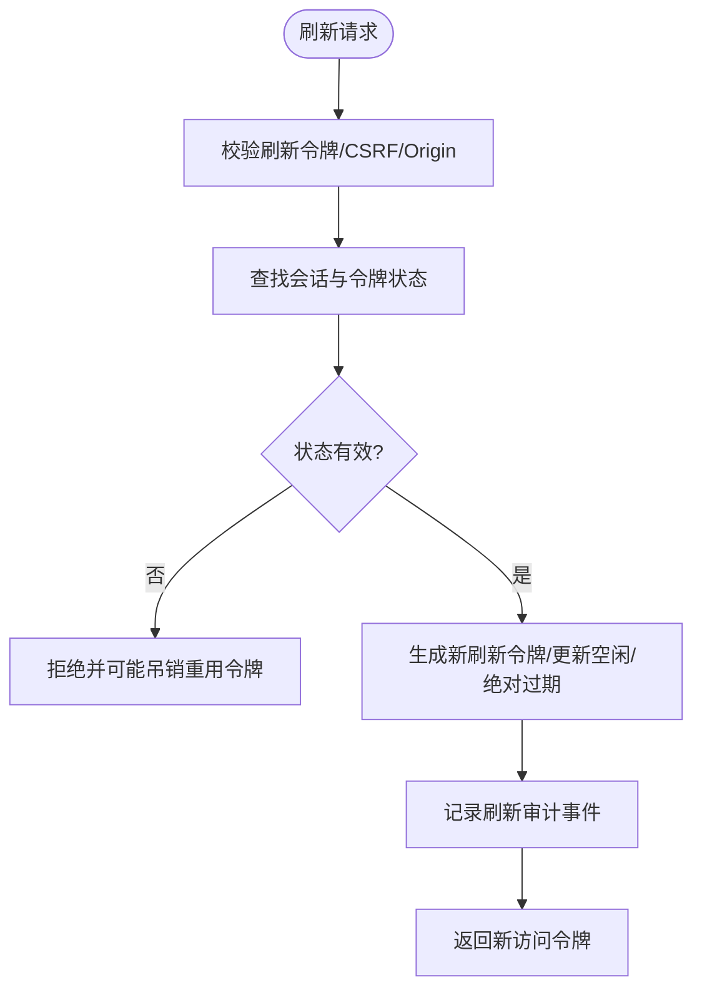
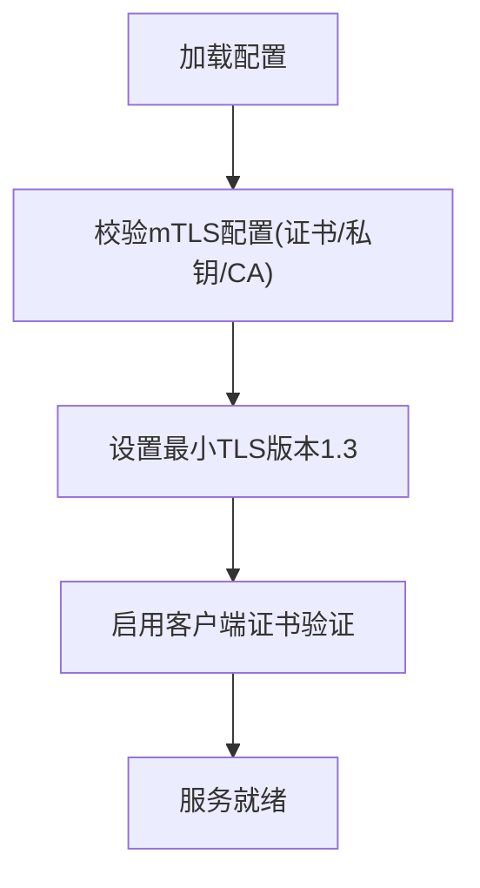
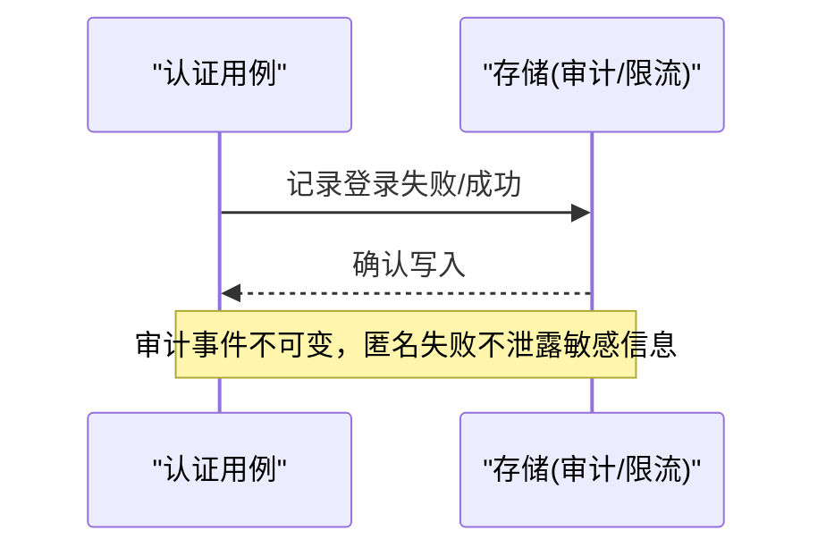
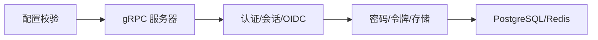

# 安全考虑

<cite>
**本文引用的文件**
- [internal/data/password_argon2id.go](file://internal/data/password_argon2id.go)
- [internal/server/tls.go](file://internal/server/tls.go)
- [internal/conf/validate.go](file://internal/conf/validate.go)
- [configs/config.yaml](file://configs/config.yaml)
- [internal/biz/authentication.go](file://internal/biz/authentication.go)
- [internal/biz/session.go](file://internal/biz/session.go)
- [internal/data/access_token_jwx.go](file://internal/data/access_token_jwx.go)
- [internal/data/workload_token_jwx.go](file://internal/data/workload_token_jwx.go)
- [internal/data/outbox_protector.go](file://internal/data/outbox_protector.go)
- [internal/biz/oidc.go](file://internal/biz/oidc.go)
- [tests/integration/password_action_test.go](file://tests/integration/password_action_test.go)
</cite>

## 目录
1. [简介](#简介)
2. [项目结构](#项目结构)
3. [核心组件](#核心组件)
4. [架构总览](#架构总览)
5. [详细组件分析](#详细组件分析)
6. [依赖关系分析](#依赖关系分析)
7. [性能与安全权衡](#性能与安全权衡)
8. [故障排查指南](#故障排查指南)
9. [结论](#结论)
10. [附录：合规与最佳实践](#附录：合规与最佳实践)

## 简介
本文件面向ANI IAM的安全设计与防护，覆盖密码存储、密钥管理、令牌与会话安全、传输层安全（TLS）、输入校验与防注入、跨站脚本（XSS）与跨站请求伪造（CSRF）防护、审计日志、入侵检测与威胁建模、安全事件响应流程与应急预案，以及安全最佳实践与合规要求。内容基于代码仓库中的实现进行说明，确保可追溯与可验证。

## 项目结构
ANI IAM采用分层架构：
- API层：gRPC服务定义与生成代码
- 服务层：业务编排与策略执行
- 领域层（biz）：认证、授权、会话、OIDC等核心安全逻辑
- 数据层（data）：密码哈希、JWK/JWT编解码、Redis/PostgreSQL适配器、出站消息保护
- 配置与服务器：配置校验、mTLS加载、监听器约束
- 迁移与测试：数据库迁移、集成测试保障安全行为

图表来源
- [internal/server/tls.go:15-37](file://internal/server/tls.go#L15-L37)
- [internal/conf/validate.go:19-45](file://internal/conf/validate.go#L19-L45)

章节来源
- [internal/server/tls.go:15-37](file://internal/server/tls.go#L15-L37)
- [internal/conf/validate.go:19-45](file://internal/conf/validate.go#L19-L45)

## 核心组件
- 密码存储：使用Argon2id参数化哈希，强制参数匹配，未知账户恒定时间比较，防止枚举与侧信道泄露。
- 密钥管理：访问令牌与工作负载凭证使用EdDSA签名；通知出站消息使用AES-GCM AEAD；所有密钥通过绝对路径的机密文件加载并严格校验。
- 令牌安全：短生命周期JWT，强类型与受众限制，严格的声明校验与版本控制；刷新令牌以摘要形式持久化，支持轮换与重用检测。
- 会话安全：会话状态机（活跃/撤销/过期），刷新令牌族与版本控制，租户切换与登出均记录审计事件。
- 传输安全：gRPC强制mTLS，最小TLS版本1.3，客户端证书必需且校验；非环回PostgreSQL连接要求verify-full与显式CA。
- 输入校验：配置级强校验（URL规范化、端口白名单、超时上限、命名规范）；登录限流与锁定；CSRF与Origin校验用于浏览器端刷新/登出。
- 审计与可观测性：关键操作（登录成功/失败、刷新、登出、租户切换、OIDC链接）写入不可变审计表，匿名失败不泄露敏感信息。
- 威胁缓解：速率限制、锁定、拒绝未知账户枚举、最小权限边界（平台/租户）、严格的工作负载注册表校验。

章节来源
- [internal/data/password_argon2id.go:14-63](file://internal/data/password_argon2id.go#L14-L63)
- [internal/data/access_token_jwx.go:83-134](file://internal/data/access_token_jwx.go#L83-L134)
- [internal/data/workload_token_jwx.go:36-50](file://internal/data/workload_token_jwx.go#L36-L50)
- [internal/biz/authentication.go:341-530](file://internal/biz/authentication.go#L341-L530)
- [internal/biz/session.go:154-286](file://internal/biz/session.go#L154-L286)
- [internal/server/tls.go:15-37](file://internal/server/tls.go#L15-L37)
- [internal/conf/validate.go:170-196](file://internal/conf/validate.go#L170-L196)

## 架构总览
ANI IAM在gRPC mTLS通道上提供服务，认证与授权由领域用例驱动，数据持久化到隔离的PostgreSQL与Redis。所有敏感数据（密码、令牌、出站消息）均以加密或哈希形式存储。配置启动时进行严格校验，确保运行环境满足安全基线。

图表来源
- [internal/server/tls.go:15-37](file://internal/server/tls.go#L15-L37)
- [internal/biz/authentication.go:341-530](file://internal/biz/authentication.go#L341-L530)
- [internal/data/access_token_jwx.go:169-225](file://internal/data/access_token_jwx.go#L169-L225)

## 详细组件分析

### 密码加密存储（Argon2id）
- 使用固定参数集（内存、迭代次数、并行度、盐长度、密钥长度）进行哈希与验证，拒绝参数不匹配的旧哈希，避免降级攻击。
- 对未知账户采用“未知账户哈希”进行恒定时间比较，防止用户名枚举。
- 接口抽象为密码验证器，便于替换实现但保持安全语义。

图表来源
- [internal/data/password_argon2id.go:14-63](file://internal/data/password_argon2id.go#L14-L63)

章节来源
- [internal/data/password_argon2id.go:14-63](file://internal/data/password_argon2id.go#L14-L63)

### 密钥管理与加密
- 访问令牌与工作负载凭证：EdDSA签名，Active Key ID与公钥集合校验，仅允许受信任算法与类型。
- 通知出站消息：AES-GCM AEAD加密，多版本密钥轮转，主动键必须存在且有效。
- 配置文件与机密文件：强制绝对路径、严格格式校验（如OIDC URL规范化、Redis命名空间、通知URL HTTPS）。

图表来源
- [internal/data/access_token_jwx.go:42-81](file://internal/data/access_token_jwx.go#L42-L81)
- [internal/data/outbox_protector.go:17-47](file://internal/data/outbox_protector.go#L17-L47)

章节来源
- [internal/data/access_token_jwx.go:42-81](file://internal/data/access_token_jwx.go#L42-L81)
- [internal/data/outbox_protector.go:17-47](file://internal/data/outbox_protector.go#L17-L47)
- [internal/conf/validate.go:224-235](file://internal/conf/validate.go#L224-L235)
- [internal/conf/validate.go:237-273](file://internal/conf/validate.go#L237-L273)

### 令牌安全（JWT/JWS）
- 访问令牌：短生命周期（Console/Boss分别限制最大时长），强类型与受众限制，强制包含主体、会话、授权版本、认证方法等必要声明。
- 工作负载凭证：专用JWT类型与工作负载注册表校验，严格TTL与字段白名单，禁止未知字段。
- 密码操作令牌：专用类型与受众，目的限定（setup/reset），最长有效期限制。

图表来源
- [internal/data/access_token_jwx.go:83-134](file://internal/data/access_token_jwx.go#L83-L134)
- [internal/data/access_token_jwx.go:169-225](file://internal/data/access_token_jwx.go#L169-L225)
- [internal/data/workload_token_jwx.go:36-50](file://internal/data/workload_token_jwx.go#L36-L50)

章节来源
- [internal/data/access_token_jwx.go:83-134](file://internal/data/access_token_jwx.go#L83-L134)
- [internal/data/access_token_jwx.go:169-225](file://internal/data/access_token_jwx.go#L169-L225)
- [internal/data/workload_token_jwx.go:36-50](file://internal/data/workload_token_jwx.go#L36-L50)

### 会话安全机制
- 刷新令牌：以SHA-256摘要持久化，支持轮换与重用检测；刷新需携带CSRF与Origin，防止跨站伪造。
- 会话状态机：活跃/撤销/过期，结合租户访问状态与生命周期投影，确保最小权限与及时失效。
- 登出：将刷新令牌标记为已注销，记录审计事件。

图表来源
- [internal/biz/session.go:154-286](file://internal/biz/session.go#L154-L286)

章节来源
- [internal/biz/session.go:154-286](file://internal/biz/session.go#L154-L286)

### TLS配置、HTTPS强制与安全头
- gRPC mTLS：强制客户端证书，最小TLS版本1.3，服务端证书与私钥、客户端CA文件必须为绝对路径。
- PostgreSQL：非环回连接要求sslmode=verify-full与显式CA文件；环回连接允许禁用SSL但仅限本地。
- OIDC/通知URL：强制HTTPS与规范化主机名，禁止用户信息与查询片段。

图表来源
- [internal/server/tls.go:15-37](file://internal/server/tls.go#L15-L37)
- [internal/conf/validate.go:170-196](file://internal/conf/validate.go#L170-L196)
- [internal/conf/validate.go:237-273](file://internal/conf/validate.go#L237-L273)

章节来源
- [internal/server/tls.go:15-37](file://internal/server/tls.go#L15-L37)
- [internal/conf/validate.go:170-196](file://internal/conf/validate.go#L170-L196)
- [internal/conf/validate.go:237-273](file://internal/conf/validate.go#L237-L273)

### 输入验证、SQL注入防护、XSS与CSRF防护
- 输入验证：配置级强校验（网络、地址、超时、URL规范化、命名规范）；登录请求限流与锁定。
- SQL注入防护：使用参数化查询与sqlc生成的类型安全访问层；集成测试验证禁止危险SQL。
- XSS防护：IAM为后端服务，前端渲染由控制台负责；IAM输出不包含HTML，减少XSS面。
- CSRF防护：刷新与登出要求CSRF Token与Origin，防止跨站伪造。

章节来源
- [internal/conf/validate.go:67-75](file://internal/conf/validate.go#L67-L75)
- [internal/conf/validate.go:275-329](file://internal/conf/validate.go#L275-L329)
- [tests/integration/workload_runtime_test.go:64-80](file://tests/integration/workload_runtime_test.go#L64-L80)
- [internal/biz/session.go:154-171](file://internal/biz/session.go#L154-L171)

### 安全审计日志、入侵检测与威胁建模
- 审计日志：登录成功/失败、刷新、登出、租户切换、OIDC身份链接等事件持久化，匿名失败不泄露账号材料。
- 入侵检测：登录失败计数与锁定窗口；刷新令牌重用检测；未知账户恒定时间比较。
- 威胁建模要点：
  - 密码暴力破解：通过限流与锁定缓解。
  - 令牌劫持：短生命周期+刷新轮换+严格受众/类型校验。
  - 跨站伪造：CSRF与Origin校验。
  - 数据泄露：出站消息AEAD加密，审计脱敏。

图表来源
- [internal/biz/authentication.go:485-514](file://internal/biz/authentication.go#L485-L514)
- [tests/integration/password_action_test.go:128-155](file://tests/integration/password_action_test.go#L128-L155)

章节来源
- [internal/biz/authentication.go:485-514](file://internal/biz/authentication.go#L485-L514)
- [tests/integration/password_action_test.go:128-155](file://tests/integration/password_action_test.go#L128-L155)

## 依赖关系分析
- 领域层依赖数据层提供密码哈希、令牌编解码、存储适配。
- 配置层在服务启动前完成安全基线校验，阻止不安全配置进入运行时。
- 服务层协调领域用例与数据层，保证事务性与审计一致性。

图表来源
- [internal/conf/validate.go:19-45](file://internal/conf/validate.go#L19-L45)
- [internal/server/tls.go:15-37](file://internal/server/tls.go#L15-L37)

章节来源
- [internal/conf/validate.go:19-45](file://internal/conf/validate.go#L19-L45)
- [internal/server/tls.go:15-37](file://internal/server/tls.go#L15-L37)

## 性能与安全权衡
- Argon2id参数：内存与迭代次数提升抗暴力破解能力，同时影响CPU与内存占用；当前参数在安全性与性能间取得平衡。
- JWT短生命周期：降低令牌泄露风险，但增加频繁刷新开销；刷新令牌族与轮换策略优化用户体验。
- mTLS与verify-full：增强传输安全，带来证书管理与握手开销；仅在必要时暴露于非环回网络。
- 审计写入：保证可追溯性，建议异步落盘或批处理以降低主路径延迟。

[本节为通用指导，无需特定文件来源]

## 故障排查指南
- 登录失败：检查限流与锁定状态；查看审计事件是否记录失败原因；确认密码哈希参数匹配。
- 刷新失败：检查刷新令牌是否被重用或过期；确认CSRF与Origin是否正确；查看会话状态与租户访问状态。
- mTLS错误：检查证书、私钥、客户端CA文件路径与内容；确认最小TLS版本与客户端证书验证。
- 配置错误：核对PostgreSQL DSN、Redis地址与命名空间、OIDC URL规范化与超时；确保机密文件为绝对路径。

章节来源
- [internal/biz/authentication.go:341-420](file://internal/biz/authentication.go#L341-L420)
- [internal/biz/session.go:154-215](file://internal/biz/session.go#L154-L215)
- [internal/server/tls.go:15-37](file://internal/server/tls.go#L15-L37)
- [internal/conf/validate.go:170-235](file://internal/conf/validate.go#L170-L235)

## 结论
ANI IAM在密码存储、密钥管理、令牌与会话安全、传输层安全、输入校验、审计日志等方面具备完善的安全设计。通过严格的配置校验、mTLS、短生命周期令牌、刷新轮换、CSRF与Origin校验、参数化查询与审计脱敏，系统有效抵御常见威胁。建议在生产环境中持续监控审计与限流指标，定期演练密钥轮换与事件响应流程，确保安全合规与韧性。

[本节为总结，无需特定文件来源]

## 附录：合规与最佳实践
- 密码策略：使用Argon2id并固定参数；定期评估强度；禁止明文存储。
- 密钥管理：使用绝对路径机密文件；定期轮换；最小权限访问；分离环境与角色。
- 令牌策略：短生命周期；严格受众与类型；刷新轮换；禁用共享长期密钥。
- 传输安全：强制mTLS与TLS1.3；非环回数据库连接启用verify-full与显式CA。
- 输入校验：配置级强校验；参数化查询；最小化错误信息。
- 审计与监控：完整记录关键事件；匿名失败脱敏；集中收集与分析。
- 事件响应：制定SOP；快速定位与处置；复盘与改进。
- 合规要求：遵循数据安全与隐私法规；定期审计与渗透测试；文档化安全决策。

[本节为通用指导，无需特定文件来源]