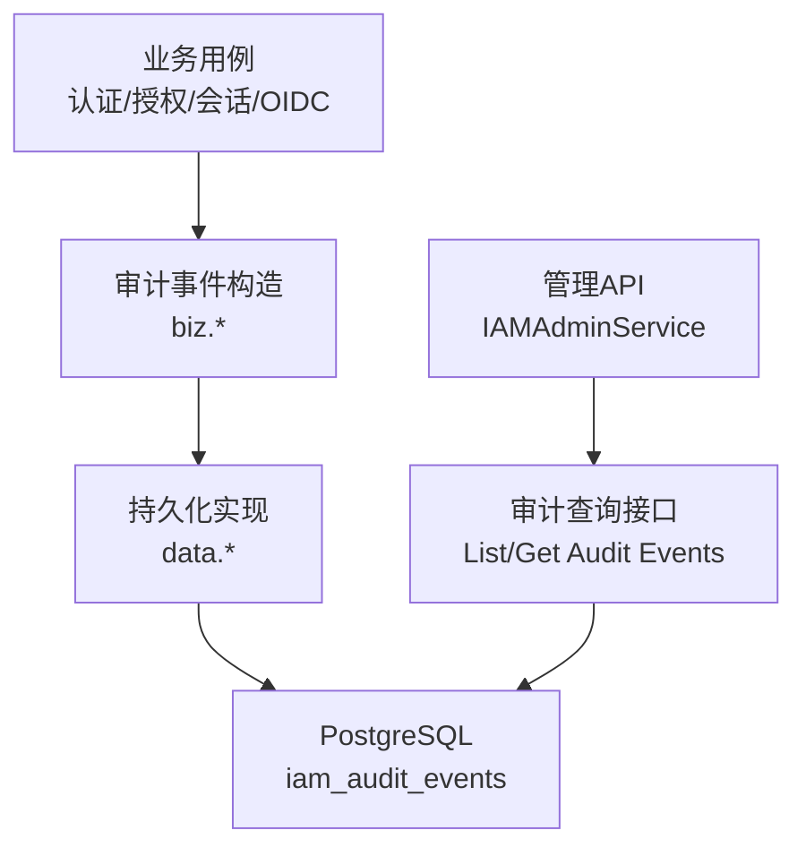
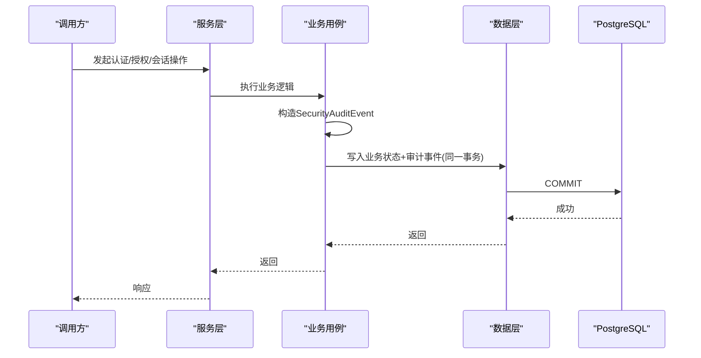
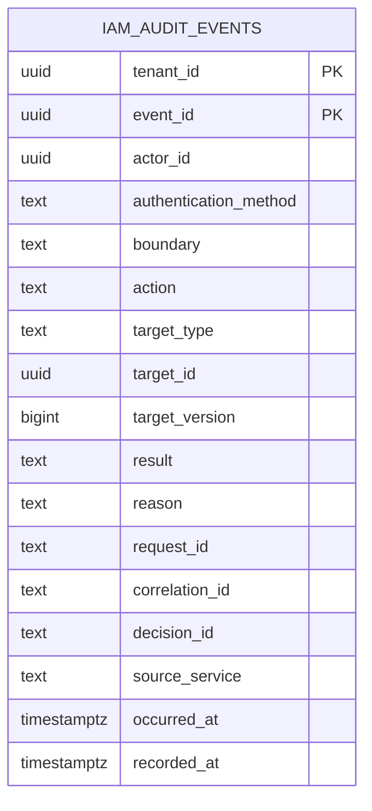
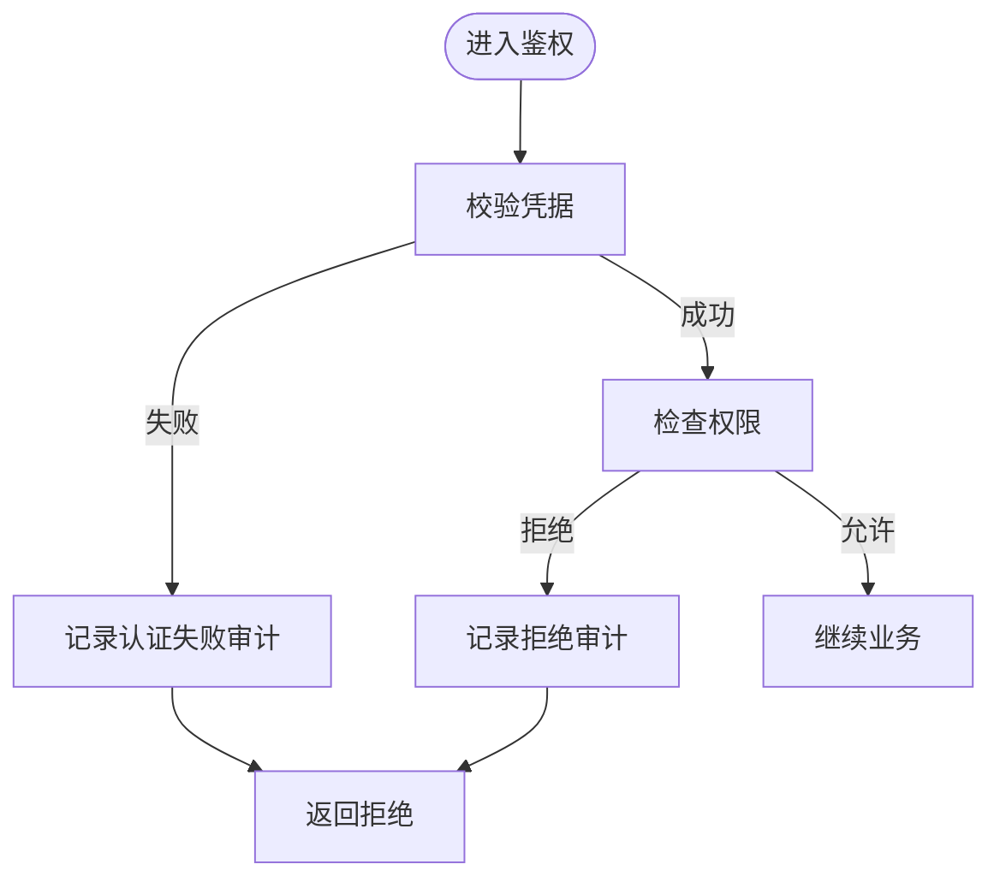
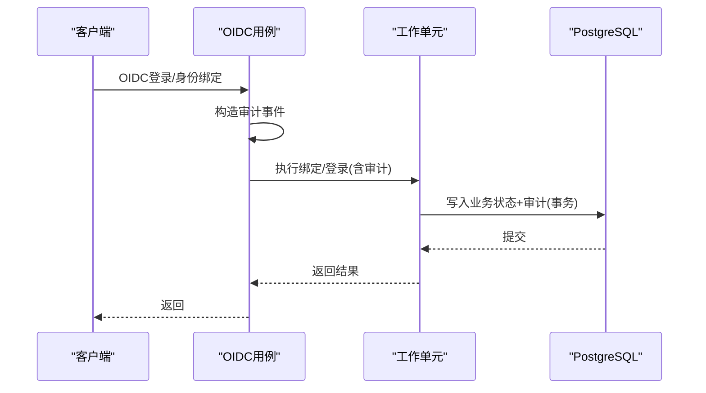
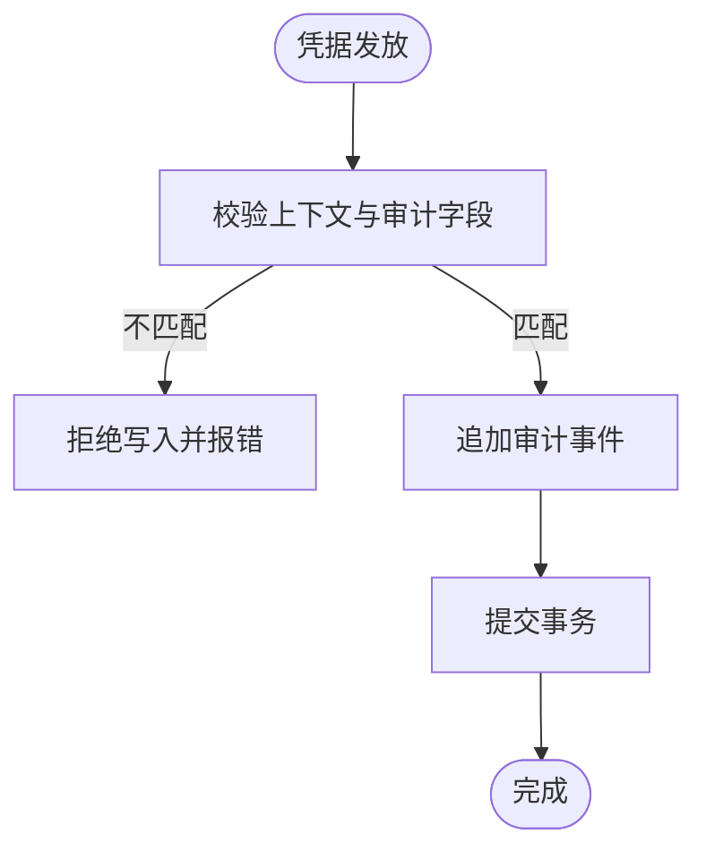
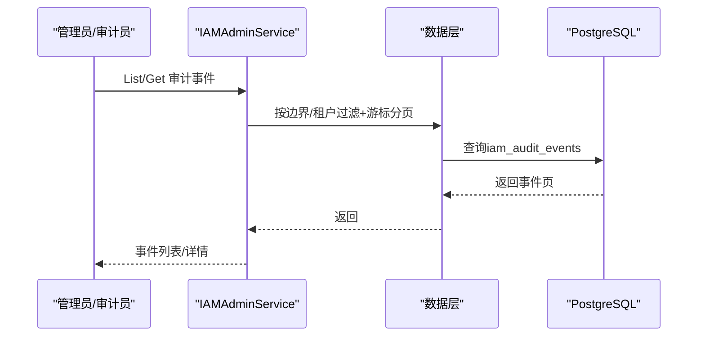
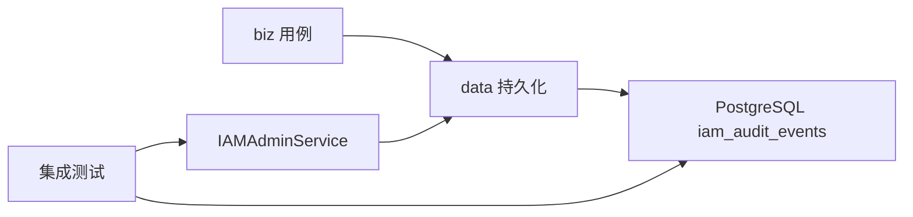

# 审计与合规

<cite>
**本文引用的文件**
- [0014-keep-iam-audit-transactional-and-append-only.md](file://docs/adr/0014-keep-iam-audit-transactional-and-append-only.md)
- [202609040001_persistence_foundation.sql](file://migrations/202609040001_persistence_foundation.sql)
- [oidc.go](file://internal/biz/oidc.go)
- [principal_validation.go](file://internal/biz/principal_validation.go)
- [session.go](file://internal/biz/session.go)
- [authorization.go](file://internal/biz/authorization.go)
- [platform_authorization.go](file://internal/biz/platform_authorization.go)
- [workload_invocation_audit.go](file://internal/data/workload_invocation_audit.go)
- [operation_registry.go](file://internal/data/operation_registry.go)
- [iam_admin_service_grpc.pb.go](file://api/iam/v1/iam_admin_service_grpc.pb.go)
- [wr22_platform_audit_test.go](file://tests/integration/wr22_platform_audit_test.go)
- [password_action_test.go](file://tests/integration/password_action_test.go)
</cite>

## 目录
1. [简介](#简介)
2. [项目结构](#项目结构)
3. [核心组件](#核心组件)
4. [架构总览](#架构总览)
5. [详细组件分析](#详细组件分析)
6. [依赖关系分析](#依赖关系分析)
7. [性能考量](#性能考量)
8. [故障排查指南](#故障排查指南)
9. [结论](#结论)
10. [附录](#附录)

## 简介
本文件面向ANI IAM的审计与合规能力，聚焦以下目标：
- 审计日志的记录格式、存储策略与查询接口
- 合规要求、数据保留策略与隐私保护
- 审计事件分类、关键操作追踪与异常行为检测
- 合规报告生成、审计数据分析与安全态势感知
- 适配GDPR、SOC2等框架的实施要点
- 审计日志的备份、恢复与归档管理

当前实现以“事务性+追加只写”的安全审计为核心，将业务状态变更与审计事件写入同一数据库事务；对高敏感或失败路径强制记录审计，未记录则整体回滚。审计字段遵循最小化与脱敏原则，不持久化密码、令牌、密钥、完整邮件正文或任意请求响应体。

**章节来源**
- [0014-keep-iam-audit-transactional-and-append-only.md:1-27](file://docs/adr/0014-keep-iam-audit-transactional-and-append-only.md#L1-L27)

## 项目结构
围绕审计与合规的关键位置如下：
- 领域层（biz）：定义审计事件模型、动作、边界、结果、原因常量，并在认证、授权、会话、OIDC、平台授权等流程中构造并落库审计事件
- 数据层（data）：提供审计事件的持久化实现（PostgreSQL），以及工作负载凭据发放的专用追加审计入口
- API层（api）：暴露租户与平台审计事件查询接口（List/Get）
- 迁移脚本（migrations）：定义审计表结构与约束
- 集成测试（tests）：验证审计事件边界、权限控制、不可变性与隐私保护

**图表来源**
- [oidc.go:203-214](file://internal/biz/oidc.go#L203-L214)
- [principal_validation.go:407-436](file://internal/biz/principal_validation.go#L407-L436)
- [workload_invocation_audit.go:17-31](file://internal/data/workload_invocation_audit.go#L17-L31)
- [202609040001_persistence_foundation.sql:100-138](file://migrations/202609040001_persistence_foundation.sql#L100-L138)
- [iam_admin_service_grpc.pb.go:115-127](file://api/iam/v1/iam_admin_service_grpc.pb.go#L115-L127)

**章节来源**
- [oidc.go:203-214](file://internal/biz/oidc.go#L203-L214)
- [principal_validation.go:407-436](file://internal/biz/principal_validation.go#L407-L436)
- [workload_invocation_audit.go:17-31](file://internal/data/workload_invocation_audit.go#L17-L31)
- [202609040001_persistence_foundation.sql:100-138](file://migrations/202609040001_persistence_foundation.sql#L100-L138)
- [iam_admin_service_grpc.pb.go:115-127](file://api/iam/v1/iam_admin_service_grpc.pb.go#L115-L127)

## 核心组件
- 审计事件模型与常量：在领域层集中定义动作、目标类型、边界、结果、原因、认证方式等，确保跨模块一致
- 审计持久化：通过PostgreSQL表iam_audit_events存储，采用严格约束与索引，保证可查询性与完整性
- 审计查询API：提供租户级与平台级审计事件列表与单条获取，支持游标分页
- 工作负载凭据审计：针对工作负载Token发放的专用追加审计入口，确保仅允许成功且上下文一致的审计写入
- 策略与注册：通过操作注册与权限目录校验，确保审计与授权策略一致性

**章节来源**
- [oidc.go:203-214](file://internal/biz/oidc.go#L203-L214)
- [202609040001_persistence_foundation.sql:100-138](file://migrations/202609040001_persistence_foundation.sql#L100-L138)
- [iam_admin_service_grpc.pb.go:115-127](file://api/iam/v1/iam_admin_service_grpc.pb.go#L115-L127)
- [workload_invocation_audit.go:17-31](file://internal/data/workload_invocation_audit.go#L17-L31)
- [operation_registry.go:41-98](file://internal/data/operation_registry.go#L41-L98)

## 架构总览
审计在多个关键路径被触发并与业务状态变更同事务提交，形成强一致的可审计事实：
- 认证与授权：登录成功/失败、凭据校验失败、拒绝决策均产生审计事件
- OIDC：登录成功、身份绑定成功/失败
- 会话：刷新、登出、租户切换、刷新令牌重用
- 工作负载：凭据发放（仅成功路径）
- 平台管理：管理员初始化、角色/成员管理等

**图表来源**
- [principal_validation.go:407-436](file://internal/biz/principal_validation.go#L407-L436)
- [oidc.go:429-451](file://internal/biz/oidc.go#L429-L451)
- [session.go:14-24](file://internal/biz/session.go#L14-L24)
- [workload_invocation_audit.go:17-31](file://internal/data/workload_invocation_audit.go#L17-L31)
- [202609040001_persistence_foundation.sql:100-138](file://migrations/202609040001_persistence_foundation.sql#L100-L138)

**章节来源**
- [principal_validation.go:407-436](file://internal/biz/principal_validation.go#L407-L436)
- [oidc.go:429-451](file://internal/biz/oidc.go#L429-L451)
- [session.go:14-24](file://internal/biz/session.go#L14-L24)
- [workload_invocation_audit.go:17-31](file://internal/data/workload_invocation_audit.go#L17-L31)
- [202609040001_persistence_foundation.sql:100-138](file://migrations/202609040001_persistence_foundation.sql#L100-L138)

## 详细组件分析

### 审计事件模型与字段
- 标识与时序：事件唯一ID、发生时间occurred_at、记录时间recorded_at
- 主体与边界：actor_id、boundary（tenant/platform/principal等）
- 动作与目标：action、target_type、target_id、target_version
- 结果与原因：result（succeeded/denied/failed）、reason（稳定枚举）
- 关联信息：request_id、correlation_id、decision_id、source_service
- 认证方式：authentication_method（password/oidc/api_key/workload_token/internal等）
- 约束：非空、取值范围、外键约束、版本约束

**图表来源**
- [202609040001_persistence_foundation.sql:100-138](file://migrations/202609040001_persistence_foundation.sql#L100-L138)

**章节来源**
- [202609040001_persistence_foundation.sql:100-138](file://migrations/202609040001_persistence_foundation.sql#L100-L138)

### 认证与授权审计
- 认证失败/拒绝：匿名或无效凭据会记录失败审计，避免泄露猜测到的主体
- 授权决策：拒绝或失败时记录审计；允许的成功决策通常以decision_id形式在网关/下游结构化访问日志中关联，不逐条插入审计行
- 平台授权：平台级失败路径同样记录审计，包含主体、方法、目标、版本、请求/关联/决策ID

**图表来源**
- [authorization.go:252-283](file://internal/biz/authorization.go#L252-L283)
- [platform_authorization.go:151-187](file://internal/biz/platform_authorization.go#L151-L187)

**章节来源**
- [authorization.go:252-283](file://internal/biz/authorization.go#L252-L283)
- [platform_authorization.go:151-187](file://internal/biz/platform_authorization.go#L151-L187)

### OIDC登录与身份绑定审计
- 登录成功：记录会话创建与授权授予，附带认证方法与决策ID
- 身份绑定：成功/失败均记录审计，失败分支统一走失败记录路径
- 审计字段包含主体、边界、目标、结果、原因、请求/关联/决策ID、时间戳与服务来源

**图表来源**
- [oidc.go:429-451](file://internal/biz/oidc.go#L429-L451)
- [oidc.go:713-742](file://internal/biz/oidc.go#L713-L742)

**章节来源**
- [oidc.go:429-451](file://internal/biz/oidc.go#L429-L451)
- [oidc.go:713-742](file://internal/biz/oidc.go#L713-L742)

### 会话生命周期审计
- 刷新、登出、租户切换、刷新令牌重用等关键会话事件均记录审计
- 审计包含目标类型（session_grant）、结果、原因、版本、请求/关联/决策ID

**章节来源**
- [session.go:14-24](file://internal/biz/session.go#L14-L24)

### 工作负载凭据发放审计
- 仅允许成功且上下文完全匹配的审计写入（调用者、主体、边界、动作、目标版本等）
- 该追加是唯一的状态变更，失败不会释放已发放的凭据

**图表来源**
- [workload_invocation_audit.go:17-31](file://internal/data/workload_invocation_audit.go#L17-L31)

**章节来源**
- [workload_invocation_audit.go:17-31](file://internal/data/workload_invocation_audit.go#L17-L31)

### 审计查询接口
- 租户级：ListAuditEvents、GetAuditEvent
- 平台级：ListPlatformAuditEvents、GetPlatformAuditEvent
- 支持稳定游标分页；平台审计需显式绑定Auditor角色与权限

**图表来源**
- [iam_admin_service_grpc.pb.go:115-127](file://api/iam/v1/iam_admin_service_grpc.pb.go#L115-L127)
- [iam_admin_service_grpc.pb.go:1683-1717](file://api/iam/v1/iam_admin_service_grpc.pb.go#L1683-L1717)

**章节来源**
- [iam_admin_service_grpc.pb.go:115-127](file://api/iam/v1/iam_admin_service_grpc.pb.go#L115-L127)
- [iam_admin_service_grpc.pb.go:1683-1717](file://api/iam/v1/iam_admin_service_grpc.pb.go#L1683-L1717)

### 策略与注册的一致性
- 通过操作注册生成权限目录与策略，确保审计与授权策略一致
- 策略修订使用SHA-256摘要，防止漂移

**章节来源**
- [operation_registry.go:41-98](file://internal/data/operation_registry.go#L41-L98)
- [operation_registry.go:139-169](file://internal/data/operation_registry.go#L139-L169)

## 依赖关系分析
- 领域层依赖：各用例（认证、授权、会话、OIDC）负责构造审计事件
- 数据层依赖：PostgreSQL iam_audit_events表承载审计事实；工作负载凭据审计有专用写入入口
- API层依赖：IAMAdminService暴露审计查询端点
- 测试依赖：集成测试覆盖权限控制、边界区分、不可变性、隐私保护

**图表来源**
- [oidc.go:203-214](file://internal/biz/oidc.go#L203-L214)
- [workload_invocation_audit.go:17-31](file://internal/data/workload_invocation_audit.go#L17-L31)
- [iam_admin_service_grpc.pb.go:115-127](file://api/iam/v1/iam_admin_service_grpc.pb.go#L115-L127)
- [202609040001_persistence_foundation.sql:100-138](file://migrations/202609040001_persistence_foundation.sql#L100-L138)

**章节来源**
- [oidc.go:203-214](file://internal/biz/oidc.go#L203-L214)
- [workload_invocation_audit.go:17-31](file://internal/data/workload_invocation_audit.go#L17-L31)
- [iam_admin_service_grpc.pb.go:115-127](file://api/iam/v1/iam_admin_service_grpc.pb.go#L115-L127)
- [202609040001_persistence_foundation.sql:100-138](file://migrations/202609040001_persistence_foundation.sql#L100-L138)

## 性能考量
- 审计写入与业务更新在同一事务内，避免异步丢失但增加事务长度；应关注热点写入与锁竞争
- 审计表具备按tenant_id与recorded_at的索引，利于按时间与租户分页查询
- 建议：
  - 合理设置数据库连接池与事务超时
  - 对高频场景评估批处理或分片策略（生产阶段）
  - 监控慢查询与锁等待

[本节为通用指导，不直接分析具体文件]

## 故障排查指南
- 审计写入失败导致业务回滚：当安全审计无法记录时，相关操作会fail closed（如503），需检查数据库可用性与权限
- 权限不足：普通管理员无隐式平台审计权限，需显式绑定Auditor角色与权限
- 隐私泄漏防护：未知账户的密码操作仅保存摘要，审计中不包含敏感信息；测试验证审计JSON不含邮箱或摘要泄露
- 不可变性：审计事件为追加只写，正常角色无法更新或删除；测试验证删除审计事件会被阻止

**章节来源**
- [0014-keep-iam-audit-transactional-and-append-only.md:11-21](file://docs/adr/0014-keep-iam-audit-transactional-and-append-only.md#L11-L21)
- [wr22_platform_audit_test.go:52-58](file://tests/integration/wr22_platform_audit_test.go#L52-L58)
- [wr22_platform_audit_test.go:138-141](file://tests/integration/wr22_platform_audit_test.go#L138-L141)
- [password_action_test.go:128-155](file://tests/integration/password_action_test.go#L128-L155)

## 结论
ANI IAM在当前阶段实现了强一致、追加只写的审计体系，覆盖认证、授权、会话、OIDC与工作负载凭据等关键路径。审计字段最小化并受约束，查询接口提供租户与平台双视角。P2环境保障至少180天可查性，生产阶段的保留、归档、外部WORM与签名等能力属于后续交付范围。

[本节为总结性内容，不直接分析具体文件]

## 附录

### 审计事件分类与关键操作追踪
- 认证：登录成功/失败、凭据校验失败
- 授权：拒绝/失败决策
- 会话：刷新、登出、租户切换、刷新令牌重用
- OIDC：登录成功、身份绑定成功/失败
- 工作负载：凭据发放（仅成功）
- 平台管理：管理员初始化、角色/成员管理

**章节来源**
- [oidc.go:203-214](file://internal/biz/oidc.go#L203-L214)
- [session.go:14-24](file://internal/biz/session.go#L14-L24)
- [platform_authorization.go:151-187](file://internal/biz/platform_authorization.go#L151-L187)
- [workload_invocation_audit.go:17-31](file://internal/data/workload_invocation_audit.go#L17-L31)

### 合规框架适配要点
- GDPR
  - 数据最小化：审计仅包含必要字段，敏感信息不落地
  - 可访问与可删除：租户/平台审计查询可用；删除/保留策略由生产阶段另行实现
  - 目的限制与透明度：审计用于安全与合规，不用于产品功能
- SOC2
  - 安全性：事务性审计、失败即关闭、最小权限（Auditor角色）
  - 可用性：幂等与重试友好（请求/关联/决策ID贯穿）
  - 保密性：审计字段脱敏，禁止敏感数据入审
  - 可追溯性：稳定事件ID、时间戳、主体、目标、版本、原因

[本节为概念性说明，不直接分析具体文件]

### 数据保留与归档
- P2环境：至少180天可查询；若无自动清理任务，可能长期保留
- 生产环境：保留、法律保留、导出与外部归档属于未来交付范围
- 建议：结合外部对象存储与WORM介质实现不可变归档，配合哈希链或签名增强抗抵赖

**章节来源**
- [0014-keep-iam-audit-transactional-and-append-only.md:19-21](file://docs/adr/0014-keep-iam-audit-transactional-and-append-only.md#L19-L21)

### 备份、恢复与归档管理
- 备份：基于PostgreSQL物理/逻辑备份策略，确保iam_audit_events与业务表一致
- 恢复：演练恢复流程，验证审计事件完整性与顺序
- 归档：将历史审计迁移至低成本存储，保持查询与检索能力（生产阶段）

[本节为通用实践，不直接分析具体文件]