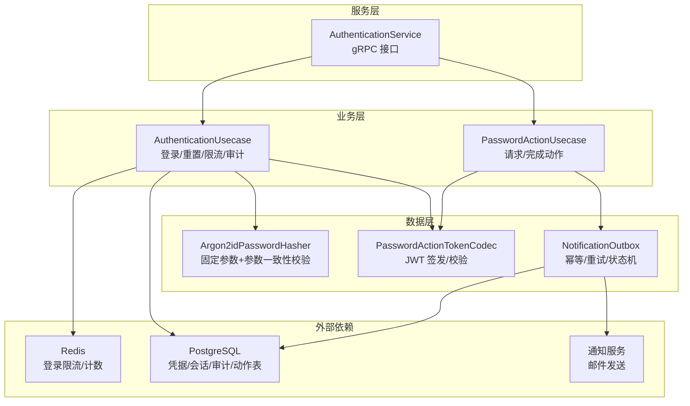
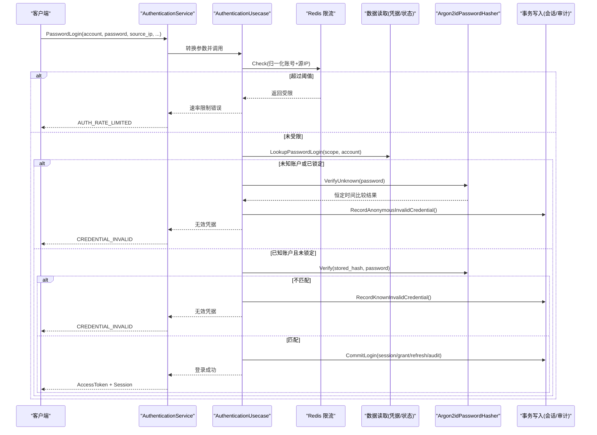
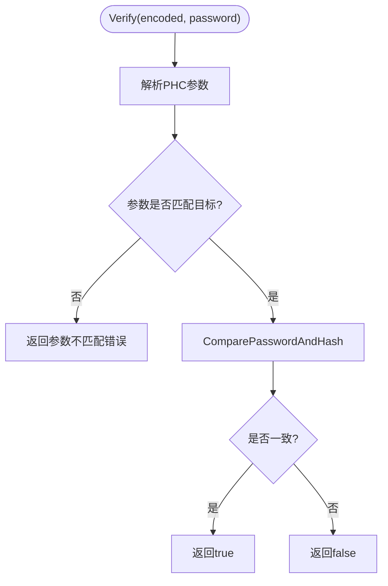
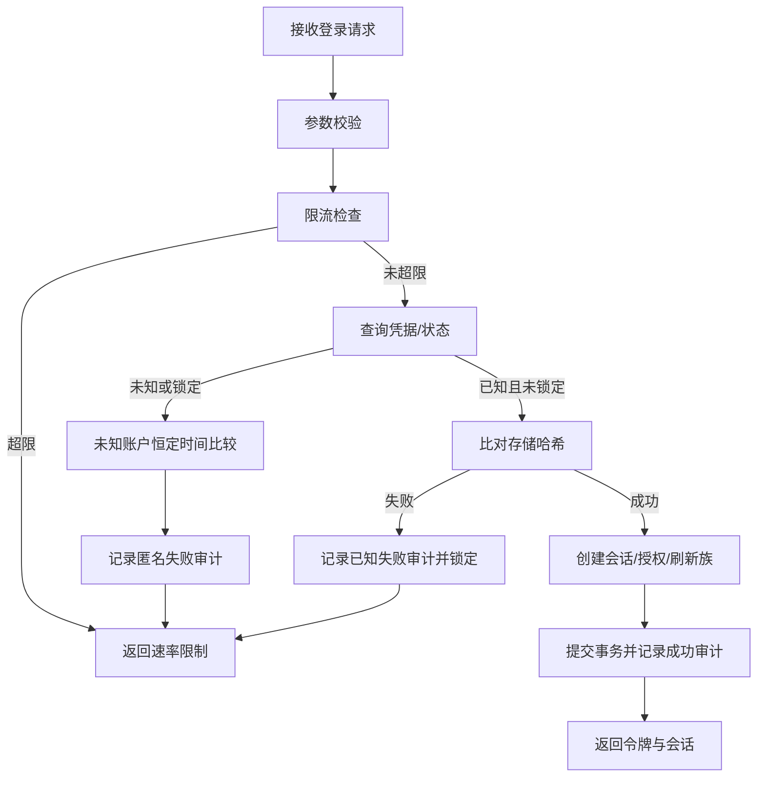
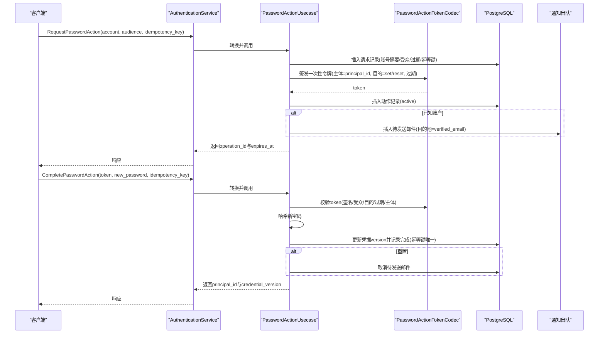
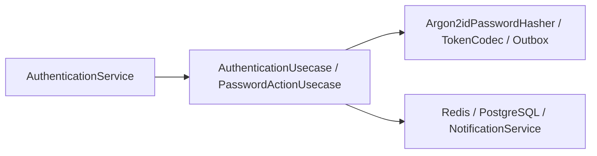

# 密码安全

<cite>
**本文引用的文件**
- [internal/data/password_argon2id.go](file://internal/data/password_argon2id.go)
- [internal/data/password_argon2id_test.go](file://internal/data/password_argon2id_test.go)
- [internal/biz/authentication.go](file://internal/biz/authentication.go)
- [internal/service/authentication.go](file://internal/service/authentication.go)
- [internal/biz/password_action.go](file://internal/biz/password_action.go)
- [internal/data/access_token_jwx.go](file://internal/data/access_token_jwx.go)
- [migrations/202609060001_password_authentication.sql](file://migrations/202609060001_password_authentication.sql)
- [configs/config.yaml](file://configs/config.yaml)
</cite>

## 目录
1. [简介](#简介)
2. [项目结构](#项目结构)
3. [核心组件](#核心组件)
4. [架构总览](#架构总览)
5. [详细组件分析](#详细组件分析)
6. [依赖关系分析](#依赖关系分析)
7. [性能与安全考量](#性能与安全考量)
8. [故障排查指南](#故障排查指南)
9. [结论](#结论)
10. [附录](#附录)

## 简介
本文件聚焦 ANI IAM 的密码安全实现，围绕 Argon2id 哈希算法的参数与验证、登录与重置流程、未知账户防护、时间攻击防护、速率限制与锁定策略、通知机制与审计追踪进行系统化说明。文档同时给出架构图、时序图与流程图，帮助读者快速理解端到端的安全控制点与最佳实践。

## 项目结构
与密码安全直接相关的代码分布在以下层次：
- 数据层：Argon2id 哈希实现与参数校验、令牌编解码、通知出队持久化
- 业务层：密码登录、密码动作（设置/重置）工作流、限流与失败记录、会话与凭据版本管理
- 服务层：gRPC 接口映射、错误映射与审计上下文注入
- 配置与迁移：Redis 登录限流窗口、通知服务地址与 URL 基址、密码动作相关表结构

**图表来源**
- [internal/service/authentication.go:150-194](file://internal/service/authentication.go#L150-L194)
- [internal/biz/authentication.go:341-529](file://internal/biz/authentication.go#L341-L529)
- [internal/biz/password_action.go:141-299](file://internal/biz/password_action.go#L141-L299)
- [internal/data/password_argon2id.go:14-59](file://internal/data/password_argon2id.go#L14-L59)
- [internal/data/access_token_jwx.go:254-288](file://internal/data/access_token_jwx.go#L254-L288)
- [migrations/202609060001_password_authentication.sql:29-135](file://migrations/202609060001_password_authentication.sql#L29-L135)
- [configs/config.yaml:22-49](file://configs/config.yaml#L22-L49)

**章节来源**
- [internal/service/authentication.go:150-194](file://internal/service/authentication.go#L150-L194)
- [internal/biz/authentication.go:341-529](file://internal/biz/authentication.go#L341-L529)
- [internal/biz/password_action.go:141-299](file://internal/biz/password_action.go#L141-L299)
- [internal/data/password_argon2id.go:14-59](file://internal/data/password_argon2id.go#L14-L59)
- [internal/data/access_token_jwx.go:254-288](file://internal/data/access_token_jwx.go#L254-L288)
- [migrations/202609060001_password_authentication.sql:29-135](file://migrations/202609060001_password_authentication.sql#L29-L135)
- [configs/config.yaml:22-49](file://configs/config.yaml#L22-L49)

## 核心组件
- Argon2id 密码哈希器：固定目标参数、拒绝非目标参数、提供“未知账户”占位哈希用于恒定时间比较
- 密码登录用例：输入校验、限流检查、凭据查找、未知账户保护、失败计数与临时锁定、成功会话创建与审计
- 密码动作（设置/重置）：请求阶段生成一次性操作令牌并持久化摘要；完成阶段校验令牌、哈希新密码、更新凭据版本、取消待发邮件
- 通知出队：基于数据库状态机的可靠投递，支持重排与已送达标记，URL 白名单校验
- gRPC 服务层：统一错误映射、审计上下文注入、租户/平台边界校验

**章节来源**
- [internal/data/password_argon2id.go:14-59](file://internal/data/password_argon2id.go#L14-L59)
- [internal/biz/authentication.go:341-529](file://internal/biz/authentication.go#L341-L529)
- [internal/biz/password_action.go:141-299](file://internal/biz/password_action.go#L141-L299)
- [internal/data/password_action_notification_outbox.go:84-132](file://internal/data/password_action_notification_outbox.go#L84-L132)
- [internal/service/authentication.go:318-366](file://internal/service/authentication.go#L318-L366)

## 架构总览
下图展示一次密码登录的关键调用链路与安全控制点：

**图表来源**
- [internal/service/authentication.go:150-194](file://internal/service/authentication.go#L150-L194)
- [internal/biz/authentication.go:341-529](file://internal/biz/authentication.go#L341-L529)
- [internal/data/password_argon2id.go:34-59](file://internal/data/password_argon2id.go#L34-L59)

## 详细组件分析

### Argon2id 密码哈希与参数治理
- 目标参数冻结：内存、迭代次数、并行度、盐长度、密钥长度在代码中固化，避免运行时漂移
- 参数一致性校验：验证时解析 PHC 字符串，若任一参数与目标不一致则拒绝
- 未知账户防护：使用预生成的“未知账户”哈希进行恒定时间比较，避免通过耗时差异泄露账户存在性
- 测试覆盖：包含独立向量验证、非法 PHC 拒绝、弱参数拒绝等场景

**图表来源**
- [internal/data/password_argon2id.go:34-55](file://internal/data/password_argon2id.go#L34-L55)
- [internal/data/password_argon2id_test.go:11-96](file://internal/data/password_argon2id_test.go#L11-L96)

**章节来源**
- [internal/data/password_argon2id.go:14-59](file://internal/data/password_argon2id.go#L14-L59)
- [internal/data/password_argon2id_test.go:11-96](file://internal/data/password_argon2id_test.go#L11-L96)

### 密码登录流程与未知账户防护
- 输入校验：账号、密码、受众、源 IP、幂等键均不可为空
- 限流：按“归一化账号+源IP”维度检查，超限返回速率限制
- 未知账户保护：当查不到用户或用户被锁定时，仍执行一次“未知账户”哈希比较，保持恒定时间行为，随后记录匿名失败审计
- 已知账户失败：记录失败次数并在短期内锁定，防止暴力破解
- 成功登录：创建会话、授权、刷新令牌族，签发访问令牌，记录成功审计，并重置限流桶

**图表来源**
- [internal/biz/authentication.go:341-529](file://internal/biz/authentication.go#L341-L529)
- [internal/service/authentication.go:150-194](file://internal/service/authentication.go#L150-L194)

**章节来源**
- [internal/biz/authentication.go:341-529](file://internal/biz/authentication.go#L341-L529)
- [internal/service/authentication.go:150-194](file://internal/service/authentication.go#L150-L194)

### 密码动作（设置/重置）流程
- 请求阶段：对账号进行归一化与摘要存储，生成一次性操作令牌（JWT），附带受众、目的、过期时间；若为已知账户，构造通知对象（含目的地邮箱）
- 完成阶段：校验令牌签名、受众、目的、主体与操作ID；哈希新密码；幂等键去重；更新凭据版本并记录审计；若为重置，取消待发送邮件
- 通知机制：通过 outbox 表驱动投递，支持重排与已送达标记；URL 必须来自配置的白名单基址

**图表来源**
- [internal/biz/password_action.go:141-299](file://internal/biz/password_action.go#L141-L299)
- [internal/data/access_token_jwx.go:254-288](file://internal/data/access_token_jwx.go#L254-L288)
- [migrations/202609060001_password_authentication.sql:29-135](file://migrations/202609060001_password_authentication.sql#L29-L135)

**章节来源**
- [internal/biz/password_action.go:141-299](file://internal/biz/password_action.go#L141-L299)
- [internal/data/access_token_jwx.go:254-288](file://internal/data/access_token_jwx.go#L254-L288)
- [migrations/202609060001_password_authentication.sql:29-135](file://migrations/202609060001_password_authentication.sql#L29-L135)

### 通知与出站消息可靠性
- 状态机：pending → claimed → delivered 或 cancelled/attention_required
- 幂等与重试：通过 available_at 与 version 字段保证并发安全与可重排
- URL 安全：仅允许配置的 console/platform 基址，禁止不安全协议、用户信息、预置参数与片段

**章节来源**
- [internal/data/password_action_notification_outbox.go:84-132](file://internal/data/password_action_notification_outbox.go#L84-L132)
- [configs/config.yaml:37-49](file://configs/config.yaml#L37-L49)

### 会话生命周期与审计
- 会话/授权/刷新族在成功登录后原子写入，审计事件携带决策ID、请求ID、关联ID
- 不同受众（控制台/平台）具有不同的访问令牌、空闲与绝对过期策略
- 失败路径同样记录审计，便于溯源与风控

**章节来源**
- [internal/biz/authentication.go:420-529](file://internal/biz/authentication.go#L420-L529)
- [internal/biz/authentication.go:539-617](file://internal/biz/authentication.go#L539-L617)
- [internal/biz/authentication.go:634-644](file://internal/biz/authentication.go#L634-L644)

## 依赖关系分析
- 数据层依赖：PostgreSQL（凭据、会话、审计、动作、通知出队）、Redis（登录限流）
- 服务层依赖：gRPC 框架、通知服务（TLS 双向认证）
- 业务层依赖：令牌签发/校验、随机数生成、时钟抽象、ID 生成器

**图表来源**
- [internal/service/authentication.go:91-106](file://internal/service/authentication.go#L91-L106)
- [internal/biz/authentication.go:286-339](file://internal/biz/authentication.go#L286-L339)
- [configs/config.yaml:22-49](file://configs/config.yaml#L22-L49)

**章节来源**
- [internal/service/authentication.go:91-106](file://internal/service/authentication.go#L91-L106)
- [internal/biz/authentication.go:286-339](file://internal/biz/authentication.go#L286-L339)
- [configs/config.yaml:22-49](file://configs/config.yaml#L22-L49)

## 性能与安全考量
- Argon2id 参数
  - 内存：64 MiB（m=65536），提高离线爆破成本
  - 迭代次数：3（t=3），平衡安全性与延迟
  - 并行度：4（p=4），利用多核提升吞吐
  - 盐长度：16 字节，密钥长度：32 字节
  - 所有参数在验证阶段强制与目标一致，拒绝历史弱参数
- 时间攻击防护
  - 未知账户路径始终执行一次恒定时间哈希比较，避免侧信道泄露账户是否存在
  - 锁定状态下同样执行未知账户比较，确保响应时间稳定
- 速率限制与锁定
  - 登录尝试按“账号+源IP”限流，超限返回资源耗尽并附带重试间隔
  - 已知账户连续失败将触发短期锁定（约15分钟），降低暴力破解效率
- 会话与令牌
  - 访问令牌、刷新令牌家族与授权记录在一次事务中写入，保证一致性
  - 不同受众具备差异化过期策略，最小化长期暴露面
- 通知安全
  - 仅允许配置的 HTTPS 域名基址，禁止不安全协议、用户信息、预置参数与片段
  - 通过 outbox 状态机保障可靠投递与幂等处理

[本节为通用指导，无需特定文件引用]

## 故障排查指南
- 速率限制
  - 现象：AUTH_RATE_LIMITED，附带 limit_scope 与 retry_after_seconds
  - 排查：确认客户端重试退避策略，检查 Redis 限流配置与窗口
- 凭据无效
  - 现象：CREDENTIAL_INVALID，可能由未知账户、锁定、哈希不匹配引起
  - 排查：查看审计事件中的 action 与 reason，确认是否命中未知账户路径或锁定
- 参数不匹配
  - 现象：argon2id 参数不匹配错误
  - 排查：确认历史哈希参数是否与当前目标一致，必要时触发渐进式重哈希策略
- 通知失败
  - 现象：outbox 状态停留在 pending/claimed
  - 排查：检查通知服务可达性与 TLS 证书，核对 URL 白名单与模板可用性

**章节来源**
- [internal/service/authentication.go:517-533](file://internal/service/authentication.go#L517-L533)
- [internal/service/authentication.go:545-556](file://internal/service/authentication.go#L545-L556)
- [internal/data/password_argon2id.go:34-55](file://internal/data/password_argon2id.go#L34-L55)
- [internal/data/password_action_notification_outbox.go:84-132](file://internal/data/password_action_notification_outbox.go#L84-L132)

## 结论
ANI IAM 的密码安全以“固定强参数 + 恒定时间比较 + 严格参数校验”为核心，结合登录限流、短期锁定、幂等与审计，构建了抵御暴力破解与时间攻击的有效防线。密码动作流程通过一次性 JWT 与 outbox 状态机实现了安全可靠的设置/重置链路。建议在生产环境中持续评估 Argon2id 参数以应对算力增长，并配合监控与告警及时响应异常。

[本节为总结性内容，无需特定文件引用]

## 附录

### Argon2id 参数与配置要点
- 目标参数：内存 64 MiB、迭代 3、并行 4、盐 16 字节、密钥 32 字节
- 验证阶段强制参数一致性，拒绝非目标参数
- 未知账户占位哈希用于恒定时间比较

**章节来源**
- [internal/data/password_argon2id.go:14-23](file://internal/data/password_argon2id.go#L14-L23)
- [internal/data/password_argon2id_test.go:11-96](file://internal/data/password_argon2id_test.go#L11-L96)

### 登录与重置关键约束
- 登录必填：account、password、audience、source_ip、idempotency_key
- 重置必填：action_token、new_password、idempotency_key
- 动作令牌：仅承载必要声明（主体、操作ID、目的、过期），不包含密码或收件人地址

**章节来源**
- [internal/biz/authentication.go:341-357](file://internal/biz/authentication.go#L341-L357)
- [internal/biz/password_action.go:224-240](file://internal/biz/password_action.go#L224-L240)
- [internal/data/access_token_jwx.go:254-288](file://internal/data/access_token_jwx.go#L254-L288)

### 数据库表结构与约束（摘要）
- 密码动作请求：存储账号摘要、受众、过期、幂等键
- 密码动作：状态机 active/replaced/consumed/expired，唯一活跃动作约束
- 通知出队：状态机 pending/claimed/delivered/cancelled/attention_required，带可用时间与版本控制
- 完成记录：幂等键为主键，绑定操作与主体，记录凭据版本

**章节来源**
- [migrations/202609060001_password_authentication.sql:29-135](file://migrations/202609060001_password_authentication.sql#L29-L135)

### 通知服务配置（摘要）
- 地址与 TLS：服务端 CA、客户端证书与私钥、DNS 名称校验
- 出站 URL 基址：控制台/平台邀请链接基址
- 本地化与时序：locale、分发间隔、提交超时

**章节来源**
- [configs/config.yaml:37-49](file://configs/config.yaml#L37-L49)