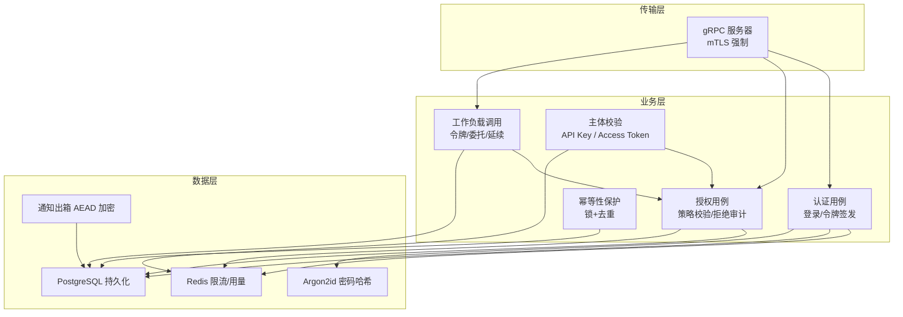
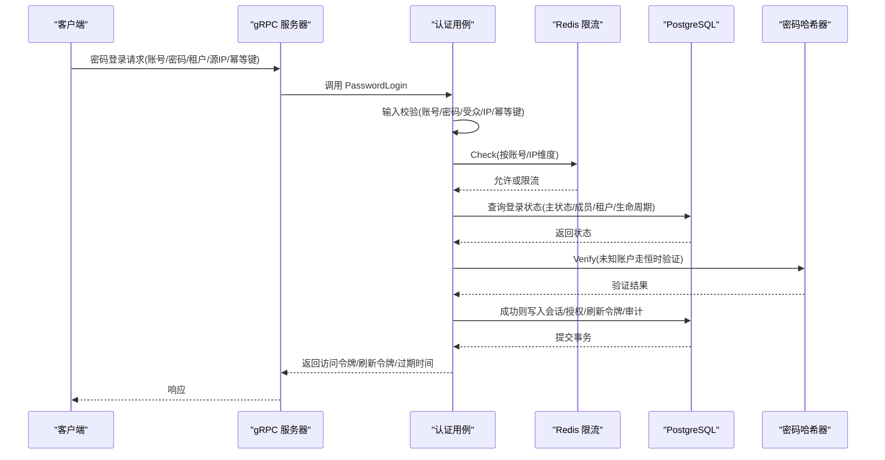
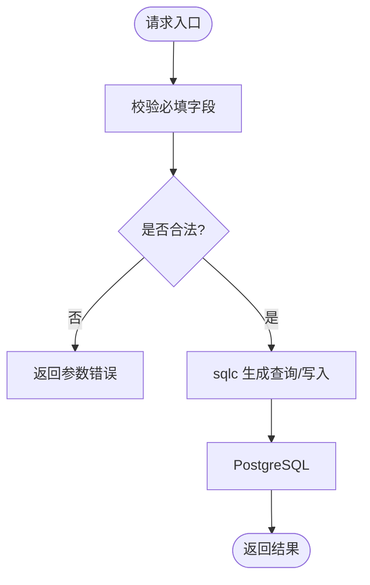
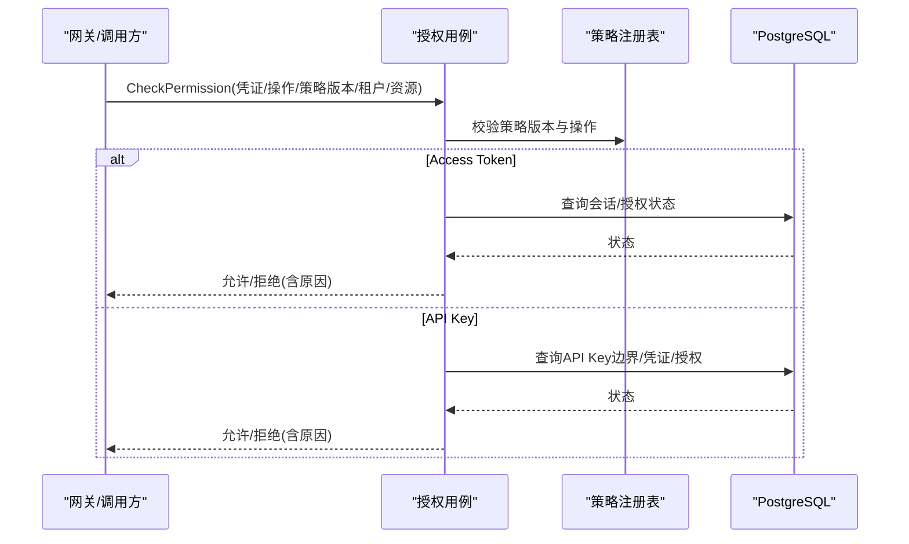
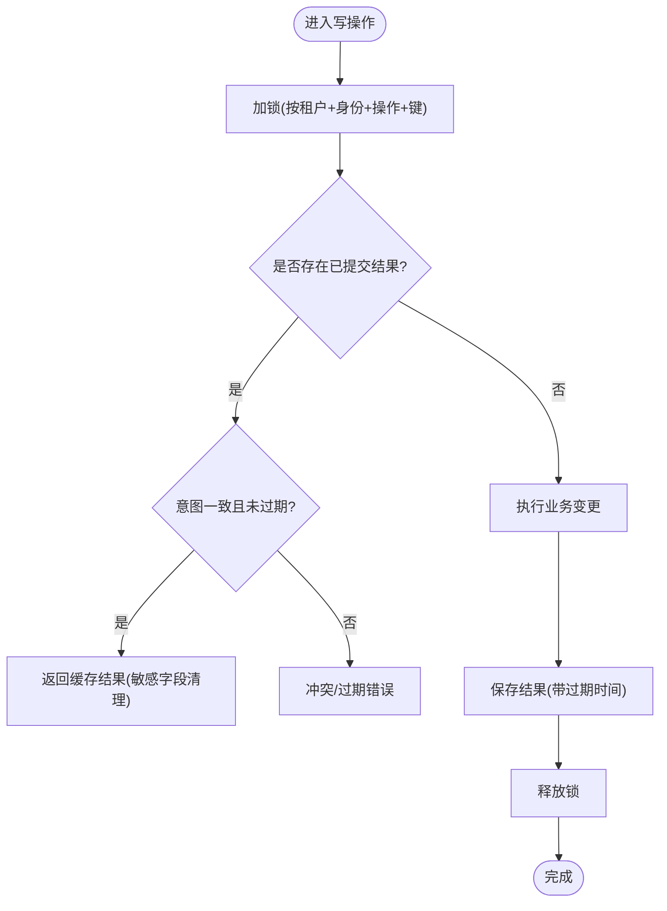
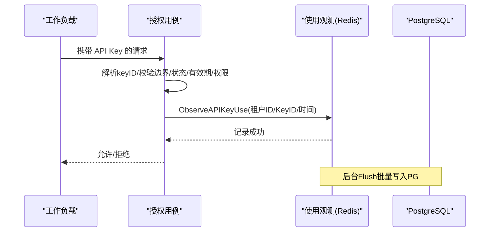
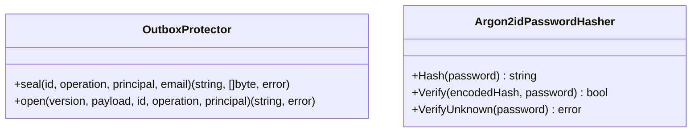
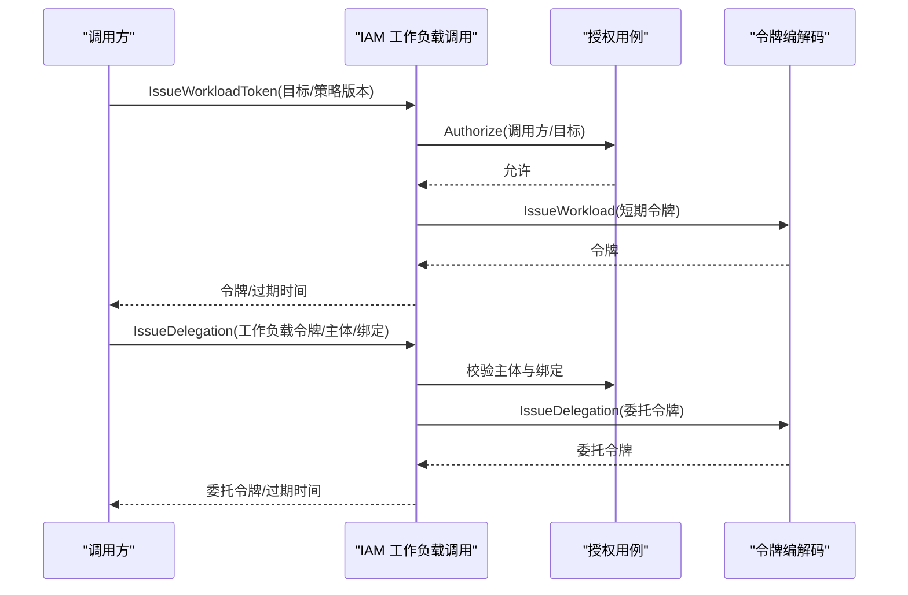
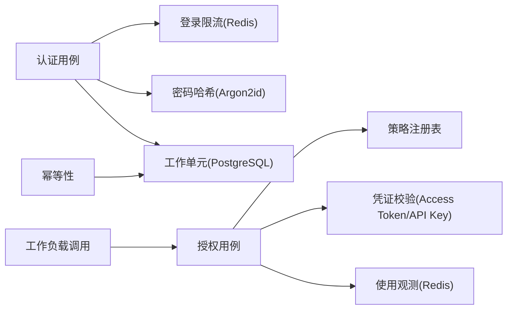

# 应用安全

<cite>
**本文引用的文件**
- [internal/biz/authentication.go](file://internal/biz/authentication.go)
- [internal/biz/authorization.go](file://internal/biz/authorization.go)
- [internal/biz/idempotency.go](file://internal/biz/idempotency.go)
- [internal/biz/principal_validation.go](file://internal/biz/principal_validation.go)
- [internal/biz/workload_invocation.go](file://internal/biz/workload_invocation.go)
- [internal/data/password_argon2id.go](file://internal/data/password_argon2id.go)
- [internal/data/login_throttle_redis.go](file://internal/data/login_throttle_redis.go)
- [internal/data/api_key_creation_limiter_redis.go](file://internal/data/api_key_creation_limiter_redis.go)
- [internal/data/api_key_usage_redis.go](file://internal/data/api_key_usage_redis.go)
- [internal/data/outbox_protector.go](file://internal/data/outbox_protector.go)
- [internal/server/grpc.go](file://internal/server/grpc.go)
- [configs/config.yaml](file://configs/config.yaml)
- [internal/conf/validate.go](file://internal/conf/validate.go)
- [tests/integration/password_action_test.go](file://tests/integration/password_action_test.go)
</cite>

## 目录
1. [简介](#简介)
2. [项目结构](#项目结构)
3. [核心组件](#核心组件)
4. [架构总览](#架构总览)
5. [详细组件分析](#详细组件分析)
6. [依赖关系分析](#依赖关系分析)
7. [性能与安全权衡](#性能与安全权衡)
8. [故障排查指南](#故障排查指南)
9. [结论](#结论)
10. [附录：安全开发生命周期与测试建议](#附录：安全开发生命周期与测试建议)

## 简介
本文件面向 ANI IAM 的安全设计与实现，覆盖输入验证、SQL注入防护、XSS/CSRF边界、API密钥管理、访问控制与权限校验、幂等性与重复请求防护、数据完整性、敏感数据加密、日志脱敏与错误处理、以及安全扫描与审计。文档以代码为依据，提供架构图、时序图与流程图，帮助读者理解并落地安全实践。

## 项目结构
ANI IAM 采用分层架构：
- API 层：gRPC 服务注册与 TLS 强制校验
- 业务层（biz）：认证、授权、工作负载调用、幂等性、主体校验
- 数据层（data）：Redis 限流、密码哈希、出箱加密、使用量聚合
- 配置与迁移：运行时配置、数据库迁移、策略版本校验

**图表来源**
- [internal/server/grpc.go:14-50](file://internal/server/grpc.go#L14-L50)
- [internal/biz/authentication.go:341-529](file://internal/biz/authentication.go#L341-L529)
- [internal/biz/authorization.go:225-420](file://internal/biz/authorization.go#L225-L420)
- [internal/biz/idempotency.go:62-99](file://internal/biz/idempotency.go#L62-L99)
- [internal/data/login_throttle_redis.go:122-147](file://internal/data/login_throttle_redis.go#L122-L147)
- [internal/data/outbox_protector.go:73-97](file://internal/data/outbox_protector.go#L73-L97)

**章节来源**
- [internal/server/grpc.go:14-50](file://internal/server/grpc.go#L14-L50)
- [configs/config.yaml:1-61](file://configs/config.yaml#L1-L61)

## 核心组件
- 认证与登录：账号密码登录、速率限制、失败锁定、会话与刷新令牌签发、审计事件记录
- 授权与策略：基于操作注册表的策略匹配、Access Token 与 API Key 双通道校验、租户边界与生命周期检查
- 工作负载调用：工作负载令牌、委托令牌与会话延续的签发与校验，严格绑定调用方与被调用方
- 幂等性：基于意图摘要与锁的写操作幂等，防止重复提交与竞态
- 输入与配置校验：策略版本 SHA256 校验、DSN 白名单、TLS 参数强制
- 敏感数据保护：Argon2id 密码哈希、通知出箱 AEAD 加密、审计脱敏
- 限流与防刷：登录次数限制、刷新令牌频率限制、API Key 创建限速

**章节来源**
- [internal/biz/authentication.go:341-529](file://internal/biz/authentication.go#L341-L529)
- [internal/biz/authorization.go:225-420](file://internal/biz/authorization.go#L225-L420)
- [internal/biz/workload_invocation.go:146-292](file://internal/biz/workload_invocation.go#L146-L292)
- [internal/biz/idempotency.go:62-99](file://internal/biz/idempotency.go#L62-L99)
- [internal/data/password_argon2id.go:30-60](file://internal/data/password_argon2id.go#L30-L60)
- [internal/data/outbox_protector.go:73-97](file://internal/data/outbox_protector.go#L73-L97)
- [internal/conf/validate.go:156-196](file://internal/conf/validate.go#L156-L196)

## 架构总览
下图展示一次“密码登录”的关键流程，包括输入校验、限流、密码验证、会话/令牌签发与审计落库。

**图表来源**
- [internal/biz/authentication.go:341-529](file://internal/biz/authentication.go#L341-L529)
- [internal/data/login_throttle_redis.go:122-147](file://internal/data/login_throttle_redis.go#L122-L147)
- [internal/data/password_argon2id.go:30-60](file://internal/data/password_argon2id.go#L30-L60)

## 详细组件分析

### 输入验证与 SQL 注入防护
- 输入校验集中在业务用例中，对账号、密码、受众、源 IP、幂等键进行非空与格式校验，避免无效参数进入下游。
- 所有数据库访问通过 sqlc 生成的只读/写方法，不拼接用户输入；迁移脚本集中管理，禁止动态 SQL。
- 配置校验强制 DSN 使用受限角色与隔离数据库，非回环地址需启用 verify-full 与显式 CA 证书。

**图表来源**
- [internal/biz/authentication.go:341-357](file://internal/biz/authentication.go#L341-L357)
- [internal/conf/validate.go:170-196](file://internal/conf/validate.go#L170-L196)

**章节来源**
- [internal/biz/authentication.go:341-357](file://internal/biz/authentication.go#L341-L357)
- [internal/conf/validate.go:170-196](file://internal/conf/validate.go#L170-L196)

### XSS 与 CSRF 防护
- 本项目为 gRPC 服务，无浏览器渲染与表单提交路径，因此不涉及传统意义上的 XSS/CSRF 攻击面。
- 若未来暴露 Web 控制台，应遵循同源策略、设置 HttpOnly Cookie、启用 CSRF Token，并对输出做 HTML 转义。当前代码未包含此类逻辑。

[本节为概念性说明，不直接分析具体文件]

### 认证与访问控制
- 支持两类凭证：Access Token（人类用户）与 API Key（工作负载）。
- 授权流程先校验策略版本与操作注册，再根据凭证类型选择分支：
  - Access Token：校验签名、有效期、租户与授权范围，读取会话/授权状态，拒绝原因可审计。
  - API Key：解析 keyID，校验边界、状态、有效期与权限，观察使用量。
- 所有拒绝均记录审计事件，便于追踪与告警。

**图表来源**
- [internal/biz/authorization.go:225-420](file://internal/biz/authorization.go#L225-L420)

**章节来源**
- [internal/biz/authorization.go:225-420](file://internal/biz/authorization.go#L225-L420)
- [internal/biz/principal_validation.go:80-220](file://internal/biz/principal_validation.go#L80-L220)

### 幂等性与重复请求防护
- 幂等键用于识别同一意图，结合锁与存储的结果快照，确保相同意图在窗口期内仅执行一次。
- 执行前加锁，查找历史结果；若存在且未过期且意图一致，则直接返回缓存结果；否则执行业务并保存结果。
- 对某些敏感结果（如 API Key 密钥），回放时会清空敏感字段，避免泄露。

**图表来源**
- [internal/biz/idempotency.go:43-99](file://internal/biz/idempotency.go#L43-L99)

**章节来源**
- [internal/biz/idempotency.go:43-99](file://internal/biz/idempotency.go#L43-L99)

### API 密钥管理与使用观测
- API Key 由工作负载或管理员创建，具备边界、状态、有效期与版本。
- 创建限速：基于 Redis 的滑动窗口计数，超限返回重试时间。
- 使用观测：每次鉴权成功后将使用事件写入 Redis 有序集合，后台批量落库到 PostgreSQL，失败保留以便重试。
- 鉴权时校验 keyID、边界、状态、有效期与权限，并记录审计。

**图表来源**
- [internal/data/api_key_creation_limiter_redis.go:59-90](file://internal/data/api_key_creation_limiter_redis.go#L59-L90)
- [internal/data/api_key_usage_redis.go:63-123](file://internal/data/api_key_usage_redis.go#L63-L123)
- [internal/biz/authorization.go:331-420](file://internal/biz/authorization.go#L331-L420)

**章节来源**
- [internal/data/api_key_creation_limiter_redis.go:59-90](file://internal/data/api_key_creation_limiter_redis.go#L59-L90)
- [internal/data/api_key_usage_redis.go:63-123](file://internal/data/api_key_usage_redis.go#L63-L123)
- [internal/biz/authorization.go:331-420](file://internal/biz/authorization.go#L331-L420)

### 敏感数据加密与日志脱敏
- 密码存储：使用 Argon2id 固定参数进行哈希，校验时强制参数一致性，未知账户走恒时验证以避免枚举。
- 通知出箱：使用 AES-GCM AEAD 对邮件等敏感信息进行密封，附带版本与上下文 AAD，支持多版本密钥轮换。
- 审计与日志：失败路径统一记录审计事件，不包含明文密码或完整敏感信息；未知账户场景下审计也做了脱敏。

**图表来源**
- [internal/data/outbox_protector.go:73-97](file://internal/data/outbox_protector.go#L73-L97)
- [internal/data/password_argon2id.go:30-60](file://internal/data/password_argon2id.go#L30-L60)

**章节来源**
- [internal/data/password_argon2id.go:30-60](file://internal/data/password_argon2id.go#L30-L60)
- [internal/data/outbox_protector.go:73-97](file://internal/data/outbox_protector.go#L73-L97)
- [tests/integration/password_action_test.go:128-155](file://tests/integration/password_action_test.go#L128-L155)

### 工作负载调用与令牌链
- 工作负载令牌：短期有效，绑定调用方目标与策略版本。
- 委托令牌：将人类或工作负载的授权临时委派给目标操作，严格校验绑定、主体与有效期。
- 会话延续：针对长链路场景，签发延续凭证，限制接收者与原始授权一致，防止越权转发。

**图表来源**
- [internal/biz/workload_invocation.go:146-236](file://internal/biz/workload_invocation.go#L146-L236)

**章节来源**
- [internal/biz/workload_invocation.go:146-292](file://internal/biz/workload_invocation.go#L146-L292)

### 传输安全与配置约束
- gRPC 强制 mTLS：要求 TLS1.3、双向证书校验、单一证书与客户端 CA。
- 配置校验：策略版本必须为 sha256 摘要；PostgreSQL DSN 必须使用受限角色与隔离数据库，非回环地址需 verify-full 与显式 CA。

**章节来源**
- [internal/server/grpc.go:14-27](file://internal/server/grpc.go#L14-L27)
- [internal/conf/validate.go:156-196](file://internal/conf/validate.go#L156-L196)
- [configs/config.yaml:1-61](file://configs/config.yaml#L1-L61)

## 依赖关系分析
- 认证用例依赖：密码哈希器、登录限流、工作单元、令牌编解码、ID 生成器、时钟、API Key 使用观测。
- 授权用例依赖：策略注册表、访问凭证校验器、授权读取器、API Key 使用观测、ID 生成器、时钟。
- 数据层依赖：Redis 脚本原子性保证限流与使用观测的一致性；PostgreSQL 作为权威状态源。
- 配置层依赖：策略版本与 DSN/TLS 强约束，降低误配风险。

**图表来源**
- [internal/biz/authentication.go:286-339](file://internal/biz/authentication.go#L286-L339)
- [internal/biz/authorization.go:199-223](file://internal/biz/authorization.go#L199-L223)
- [internal/biz/idempotency.go:37-41](file://internal/biz/idempotency.go#L37-L41)

**章节来源**
- [internal/biz/authentication.go:286-339](file://internal/biz/authentication.go#L286-L339)
- [internal/biz/authorization.go:199-223](file://internal/biz/authorization.go#L199-L223)
- [internal/biz/idempotency.go:37-41](file://internal/biz/idempotency.go#L37-L41)

## 性能与安全权衡
- 登录限流与失败锁定：通过 Redis 原子脚本实现，减少数据库压力，同时提供指数退避与窗口封锁，平衡可用性与安全性。
- API Key 使用观测：异步批处理写入 PG，避免高频鉴权阻塞；失败时保留 Redis 条目，下次重试。
- 幂等性：加锁与结果快照带来一定开销，但能防止重复提交与竞态，保障数据一致性。
- 策略版本校验：强制客户端与服务端策略版本一致，避免旧策略被利用。

[本节为通用指导，不直接分析具体文件]

## 故障排查指南
- 登录失败：检查账号/密码/受众/源 IP/幂等键是否齐全；查看 Redis 限流是否触发；确认审计事件中的失败原因。
- 授权拒绝：核对策略版本、操作注册、凭证类型与主体类型是否匹配；检查租户边界与生命周期状态。
- 幂等冲突：确认幂等键唯一性与意图一致性；检查窗口期是否过期。
- API Key 问题：校验 keyID 解析、边界、状态与有效期；关注使用观测是否成功落库。
- 配置错误：检查策略版本是否为 sha256 摘要；PostgreSQL DSN 是否使用受限角色与隔离数据库；mTLS 参数是否满足强制要求。

**章节来源**
- [internal/biz/authentication.go:341-529](file://internal/biz/authentication.go#L341-L529)
- [internal/biz/authorization.go:225-420](file://internal/biz/authorization.go#L225-L420)
- [internal/data/login_throttle_redis.go:122-147](file://internal/data/login_throttle_redis.go#L122-L147)
- [internal/conf/validate.go:156-196](file://internal/conf/validate.go#L156-L196)

## 结论
ANI IAM 在认证、授权、幂等、限流、加密与审计方面形成了闭环安全机制：
- 严格的输入与配置校验，杜绝 SQL 注入与误配风险
- 双通道凭证校验与策略版本一致性，确保最小权限与可追溯
- 幂等与限流保护，防止重复提交与滥用
- 敏感数据加密与审计脱敏，保障隐私与合规
- 传输层强制 mTLS，提升通信安全

建议在后续演进中持续完善安全扫描、代码审计与渗透测试，并将安全实践纳入开发流程。

[本节为总结性内容，不直接分析具体文件]

## 附录：安全开发生命周期与测试建议
- 安全扫描：对依赖库与源码进行漏洞扫描，重点关注加密算法、网络协议与第三方组件。
- 代码审计：定期审查认证、授权、幂等与加密相关模块，确保实现与策略一致。
- 安全测试：
  - 集成测试覆盖登录限流、API Key 创建限速、幂等性、策略版本不一致、审计脱敏等关键路径
  - 契约测试确保 API 行为稳定
  - 渗透测试模拟暴力破解、令牌伪造、越权访问等场景
- 发布门禁：策略版本与配置校验失败不得上线；生产环境启用最小权限与监控告警

**章节来源**
- [tests/integration/password_action_test.go:128-155](file://tests/integration/password_action_test.go#L128-L155)
- [configs/config.yaml:1-61](file://configs/config.yaml#L1-L61)
- [internal/conf/validate.go:156-196](file://internal/conf/validate.go#L156-L196)