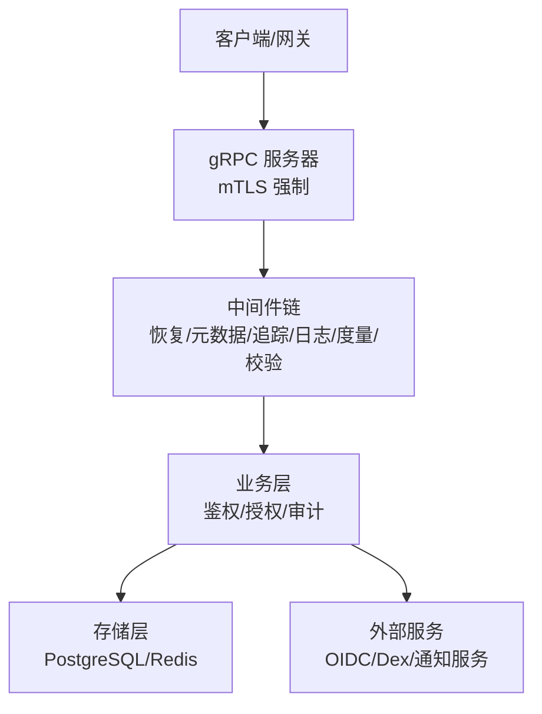
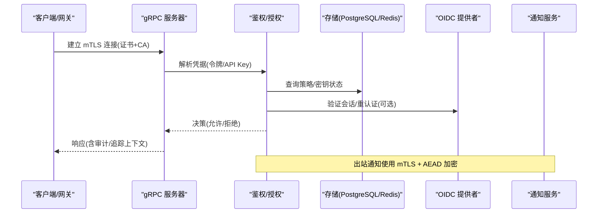
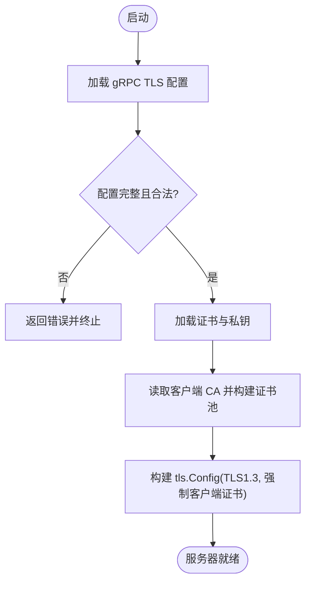
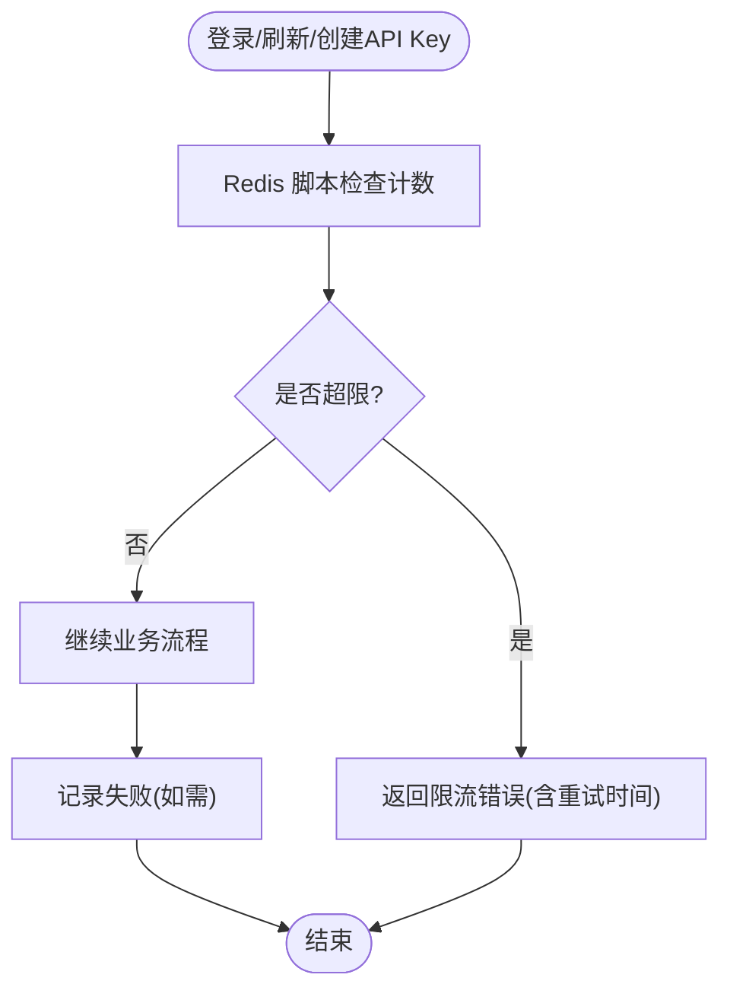
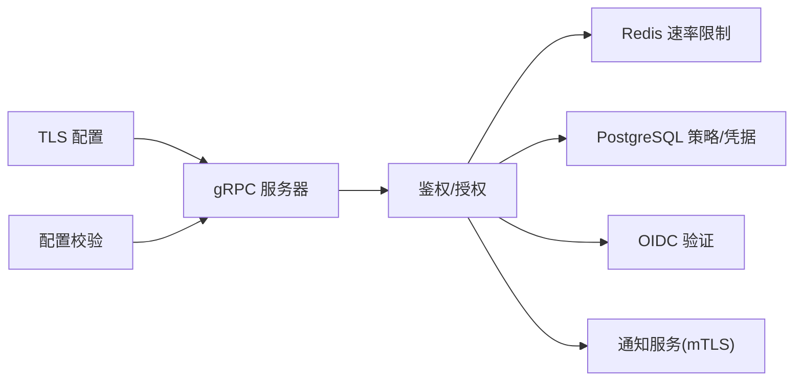

# 网络安全

<cite>
**本文引用的文件**
- [internal/server/tls.go](file://internal/server/tls.go)
- [internal/server/grpc.go](file://internal/server/grpc.go)
- [configs/config.yaml](file://configs/config.yaml)
- [internal/conf/validate.go](file://internal/conf/validate.go)
- [internal/data/login_throttle_redis.go](file://internal/data/login_throttle_redis.go)
- [internal/data/api_key_creation_limiter_redis.go](file://internal/data/api_key_creation_limiter_redis.go)
- [internal/biz/platform_password.go](file://internal/biz/platform_password.go)
- [internal/biz/authorization.go](file://internal/biz/authorization.go)
- [sdk/grpcworkload/http.go](file://sdk/grpcworkload/http.go)
- [internal/server/observability.go](file://internal/server/observability.go)
- [cmd/server/main.go](file://cmd/server/main.go)
- [internal/data/outbox_protector.go](file://internal/data/outbox_protector.go)
</cite>

## 目录
1. [简介](#简介)
2. [项目结构](#项目结构)
3. [核心组件](#核心组件)
4. [架构总览](#架构总览)
5. [详细组件分析](#详细组件分析)
6. [依赖关系分析](#依赖关系分析)
7. [性能与容量](#性能与容量)
8. [故障排查指南](#故障排查指南)
9. [结论](#结论)
10. [附录](#附录)

## 简介
本文件面向 ANI IAM 的网络安全设计与实现，覆盖以下主题：
- TLS/SSL 配置、证书管理与 HTTPS 强制
- 网络安全头设置、CORS 与请求来源验证
- 网络层防护：DDoS 防护、速率限制、IP 白名单
- 内网通信安全、服务间认证与加密传输
- 网络安全监控、入侵检测与流量分析
- 安全事件响应与漏洞修复流程

本项目采用 gRPC 作为主要传输协议，并通过 mTLS（双向 TLS）对服务端进行强身份校验；通过 Redis 实现登录与 API Key 创建等关键操作的速率限制；通过严格的配置校验确保最小暴露面与最小权限原则。

## 项目结构
与安全相关的代码主要集中在以下模块：
- 传输与安全：gRPC 服务器构建、mTLS 加载与校验
- 配置与校验：集中式配置结构与运行时参数校验
- 速率限制：基于 Redis 的登录节流与 API Key 创建限流
- 鉴权与授权：访问令牌与 API Key 校验、工作负载身份验证
- 可观测性：指标、追踪与日志脱敏
- 出站安全：通知服务的 mTLS 与消息体保护

图表来源
- [internal/server/grpc.go:14-26](file://internal/server/grpc.go#L14-L26)
- [internal/server/observability.go:160-171](file://internal/server/observability.go#L160-L171)
- [internal/biz/authorization.go:252-356](file://internal/biz/authorization.go#L252-L356)

章节来源
- [internal/server/grpc.go:14-50](file://internal/server/grpc.go#L14-L50)
- [internal/server/observability.go:41-171](file://internal/server/observability.go#L41-L171)

## 核心组件
- gRPC 服务器与 mTLS：强制 TLS1.3 与客户端证书校验，仅允许受信任网关连接。
- 配置校验：启动时严格校验监听地址、超时、TLS 文件路径、OIDC、Redis、PostgreSQL 等安全相关参数。
- 速率限制：登录失败与刷新令牌使用 Redis 脚本原子计数与退避；API Key 创建按租户+主体维度限流。
- 鉴权与授权：支持访问令牌与 API Key，拒绝未绑定凭据与不匹配策略的请求。
- 可观测性与日志：OpenTelemetry 指标与追踪，Prometheus 导出，敏感字段过滤。
- 出站安全：通知服务使用 mTLS 与 AEAD 加密外发内容。

章节来源
- [internal/server/tls.go:15-37](file://internal/server/tls.go#L15-L37)
- [internal/conf/validate.go:19-65](file://internal/conf/validate.go#L19-L65)
- [internal/data/login_throttle_redis.go:122-147](file://internal/data/login_throttle_redis.go#L122-L147)
- [internal/data/api_key_creation_limiter_redis.go:59-89](file://internal/data/api_key_creation_limiter_redis.go#L59-L89)
- [internal/biz/authorization.go:252-356](file://internal/biz/authorization.go#L252-L356)
- [internal/server/observability.go:160-171](file://internal/server/observability.go#L160-L171)
- [internal/data/outbox_protector.go:23-47](file://internal/data/outbox_protector.go#L23-L47)

## 架构总览
ANI IAM 以“零信任”为设计原则：所有入站连接必须经过 mTLS 认证，所有调用必须携带有效凭据并经过策略校验；内部服务间通信同样要求双向 TLS 与域名校验；对外部 OIDC 与通知服务均使用 HTTPS/mTLS。

图表来源
- [internal/server/tls.go:15-37](file://internal/server/tls.go#L15-L37)
- [internal/biz/authorization.go:252-356](file://internal/biz/authorization.go#L252-L356)
- [internal/data/outbox_protector.go:23-47](file://internal/data/outbox_protector.go#L23-L47)

## 详细组件分析

### TLS/SSL 配置与证书管理
- 强制 TLS1.3：gRPC 服务器在构造时校验最小版本为 TLS1.3。
- 双向 TLS（mTLS）：要求客户端证书，并使用 CA 池校验；仅允许配置的网关 DNS 名称作为可信身份。
- 证书与密钥文件：必须为绝对路径，启动时加载并校验；缺失或格式错误将导致启动失败。
- 配置项：证书、私钥、客户端 CA、网关客户端 DNS 名均在配置中声明，并在启动阶段校验。

图表来源
- [internal/server/tls.go:15-37](file://internal/server/tls.go#L15-L37)
- [internal/conf/validate.go:47-65](file://internal/conf/validate.go#L47-L65)

章节来源
- [internal/server/tls.go:15-37](file://internal/server/tls.go#L15-L37)
- [internal/server/grpc.go:14-26](file://internal/server/grpc.go#L14-L26)
- [configs/config.yaml:7-11](file://configs/config.yaml#L7-L11)
- [internal/conf/validate.go:47-65](file://internal/conf/validate.go#L47-L65)

### HTTPS 强制与外部集成
- OIDC 签发者与回调地址强制 HTTPS（或隔离环境的环回 HTTP），防止降级攻击。
- 通知服务回调 URL 必须为规范 HTTPS 基址，禁止用户信息、查询串与片段。
- 这些约束在配置校验阶段执行，避免误配导致的安全风险。

章节来源
- [internal/conf/validate.go:275-329](file://internal/conf/validate.go#L275-L329)
- [configs/config.yaml:51-58](file://configs/config.yaml#L51-L58)

### 网络安全头、CORS 与请求来源验证
- 当前 gRPC 服务未直接处理 HTTP 头与 CORS；HTTP 侧能力由 SDK 中的工作负载调用器负责清理与传递特定头部，用于跨进程/跨服务调用时的身份与权限传递。
- 建议：若未来暴露 HTTP 接口，应在网关层统一设置安全头（如 HSTS、X-Content-Type-Options、Referrer-Policy、Content-Security-Policy），并启用严格 CORS 白名单。

章节来源
- [sdk/grpcworkload/http.go:133-143](file://sdk/grpcworkload/http.go#L133-L143)

### 速率限制与防暴力破解
- 登录节流：基于 Redis Lua 脚本，按账号与 IP 维度统计失败次数，超过阈值后进入阻塞窗口，并指数退避；刷新令牌也有限制。
- API Key 创建限流：按租户+主体维度限制单位时间内的创建次数，防止滥用。
- 这些限制在业务层调用前检查，超限返回带重试时间的错误。

图表来源
- [internal/data/login_throttle_redis.go:34-104](file://internal/data/login_throttle_redis.go#L34-L104)
- [internal/data/login_throttle_redis.go:122-147](file://internal/data/login_throttle_redis.go#L122-L147)
- [internal/data/api_key_creation_limiter_redis.go:31-44](file://internal/data/api_key_creation_limiter_redis.go#L31-L44)
- [internal/data/api_key_creation_limiter_redis.go:59-89](file://internal/data/api_key_creation_limiter_redis.go#L59-L89)

章节来源
- [internal/data/login_throttle_redis.go:122-147](file://internal/data/login_throttle_redis.go#L122-L147)
- [internal/data/api_key_creation_limiter_redis.go:59-89](file://internal/data/api_key_creation_limiter_redis.go#L59-L89)
- [internal/biz/platform_password.go:70-87](file://internal/biz/platform_password.go#L70-L87)

### 内网通信安全与服务间认证
- 服务间通信（如通知服务）使用 mTLS，要求服务端 CA 与 DNS 名称校验，确保仅受信服务可达。
- 工作负载身份验证：SDK 在 HTTP 调用中清理并传递工作负载令牌与权威修订，确保调用方身份与权限一致。
- 策略与凭据校验：授权层区分访问令牌与 API Key，拒绝未绑定凭据与不匹配策略的请求。

章节来源
- [configs/config.yaml:37-44](file://configs/config.yaml#L37-L44)
- [internal/conf/validate.go:237-273](file://internal/conf/validate.go#L237-L273)
- [sdk/grpcworkload/http.go:133-143](file://sdk/grpcworkload/http.go#L133-L143)
- [internal/biz/authorization.go:252-356](file://internal/biz/authorization.go#L252-L356)

### 加密传输与数据保护
- 出站通知消息体使用 AEAD（AES-GCM）加密，密钥轮换通过 active key 与多版本键映射实现。
- 访问令牌私钥文件路径必须为绝对路径，防止误用相对路径导致密钥泄露。

章节来源
- [internal/data/outbox_protector.go:23-47](file://internal/data/outbox_protector.go#L23-L47)
- [internal/conf/validate.go:224-235](file://internal/conf/validate.go#L224-L235)

### 监控、入侵检测与流量分析
- 指标：请求计数、延迟直方图、运行就绪状态、异常 API Key 数量快照等，通过 Prometheus 导出。
- 追踪：OpenTelemetry TracerProvider 注入到 Kratos 中间件，便于端到端链路追踪。
- 日志：结构化 JSON 日志，自动过滤敏感字段（密码、令牌、DSN、Cookie 等）。

章节来源
- [internal/server/observability.go:41-171](file://internal/server/observability.go#L41-L171)
- [cmd/server/main.go:104-131](file://cmd/server/main.go#L104-L131)

## 依赖关系分析
- gRPC 服务器依赖 mTLS 配置与中间件链；中间件包含恢复、元数据、追踪、日志、度量与校验。
- 业务层依赖 Redis 实现速率限制，依赖 PostgreSQL 进行持久化与策略查询。
- 配置校验贯穿各子系统，确保网络、TLS、OIDC、存储等安全参数符合预期。

图表来源
- [internal/server/grpc.go:14-26](file://internal/server/grpc.go#L14-L26)
- [internal/conf/validate.go:19-65](file://internal/conf/validate.go#L19-L65)
- [internal/biz/authorization.go:252-356](file://internal/biz/authorization.go#L252-L356)

章节来源
- [internal/server/grpc.go:14-50](file://internal/server/grpc.go#L14-L50)
- [internal/conf/validate.go:19-65](file://internal/conf/validate.go#L19-L65)

## 性能与容量
- 速率限制使用 Redis Lua 脚本原子执行，减少竞争与一致性开销；窗口与基础延迟可调，避免雪崩。
- gRPC 超时与关闭超时在配置中限定上限，防止资源长时间占用。
- 指标与追踪开启采样与默认视图，降低额外开销。

[本节为通用指导，无需具体文件引用]

## 故障排查指南
- 启动失败（TLS 配置错误）：检查证书、私钥、客户端 CA 是否为绝对路径，网关客户端 DNS 名是否合法。
- 连接被拒（mTLS 失败）：确认客户端证书由受信任 CA 签发，且 DNS 名称匹配。
- 登录被限流：查看 Redis 中对应命名空间下的登录计数键，确认窗口与限制值；检查账号/IP 是否触发阻塞。
- API Key 创建受限：检查租户+主体维度的创建计数键，调整窗口与限制。
- 日志中出现敏感信息：确认日志过滤器生效，必要时调整过滤键列表。

章节来源
- [internal/conf/validate.go:47-65](file://internal/conf/validate.go#L47-L65)
- [internal/data/login_throttle_redis.go:122-147](file://internal/data/login_throttle_redis.go#L122-L147)
- [internal/data/api_key_creation_limiter_redis.go:59-89](file://internal/data/api_key_creation_limiter_redis.go#L59-L89)
- [cmd/server/main.go:104-131](file://cmd/server/main.go#L104-L131)

## 结论
ANI IAM 在网络与传输层采用强安全基线：强制 TLS1.3 与 mTLS、严格配置校验、细粒度速率限制、完善的鉴权与授权、以及全面的可观测性与日志脱敏。这些措施共同构成抵御暴力破解、降级攻击、越权访问与横向移动的基础能力。建议在网关层补充 HTTP 安全头与 CORS 策略，进一步加固边界。

[本节为总结性内容，无需具体文件引用]

## 附录

### 安全配置清单（建议）
- 传输层
  - 强制 TLS1.3 与 mTLS
  - 仅允许受信任网关 DNS 名称
  - 外部集成（OIDC/通知）使用 HTTPS/mTLS
- 应用层
  - 登录与关键操作启用速率限制
  - 凭据校验与策略匹配
  - 日志脱敏与审计
- 监控与告警
  - 暴露 Prometheus 指标
  - 启用 OpenTelemetry 追踪
  - 对限流、鉴权失败、TLS 错误设置告警

[本节为通用建议，无需具体文件引用]