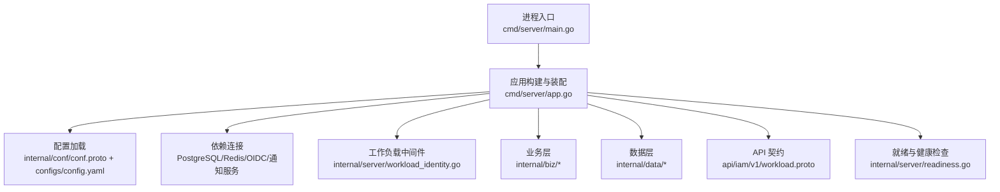
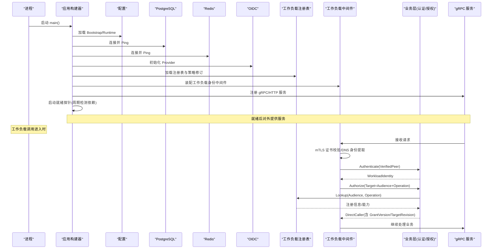
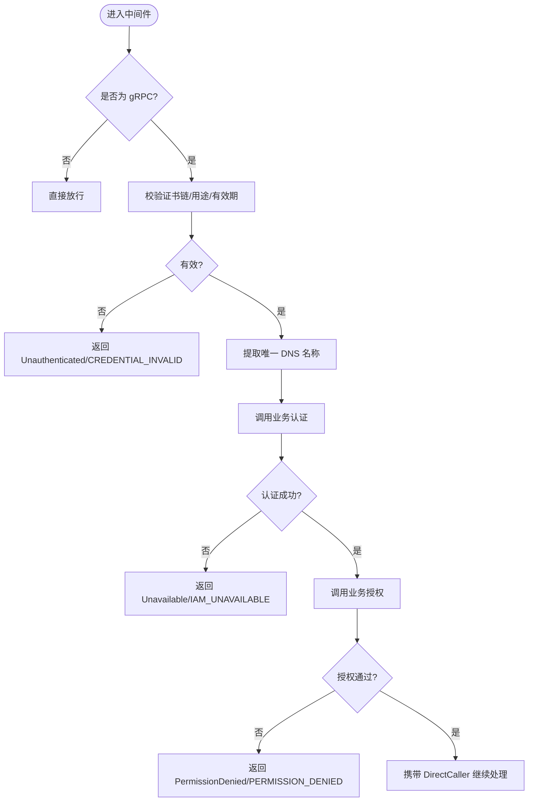
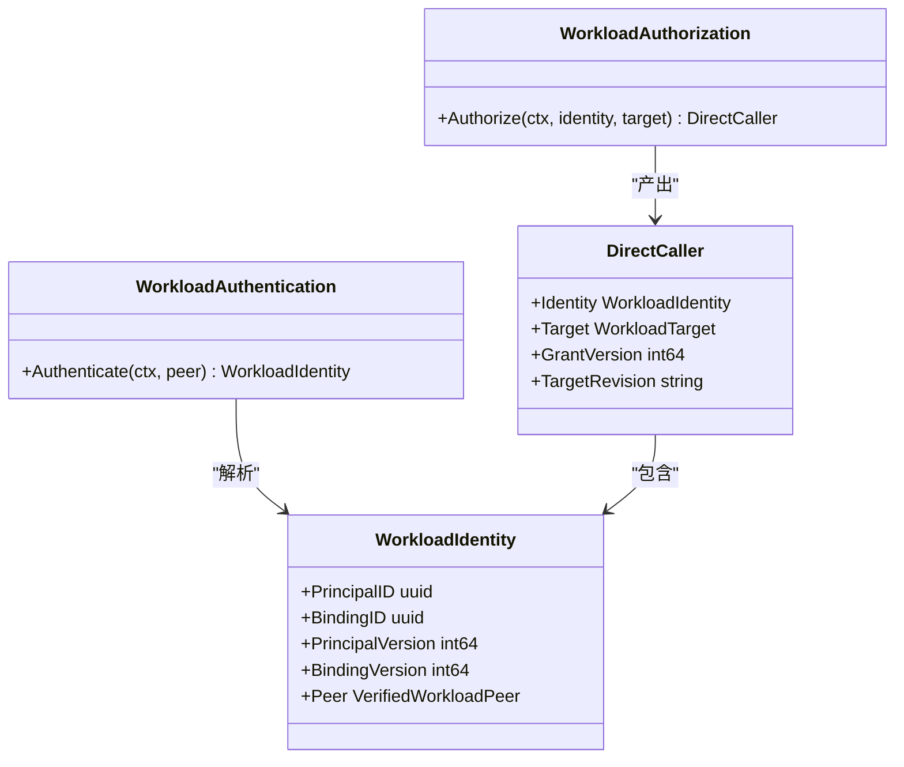
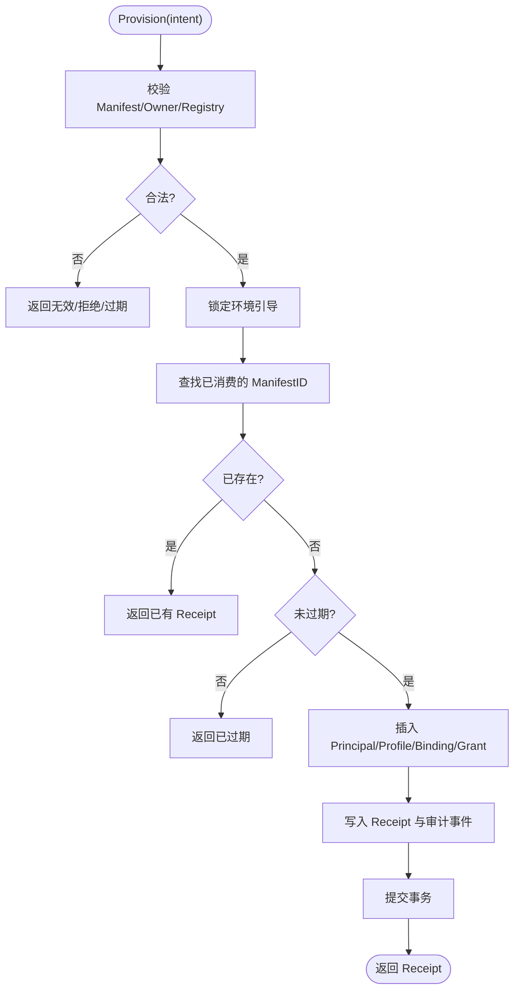
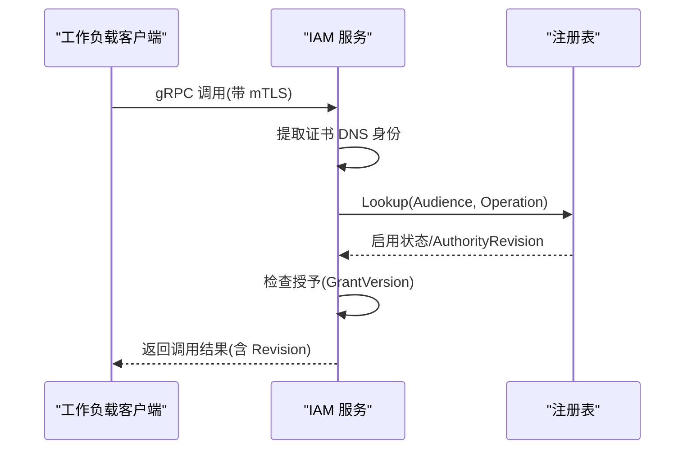
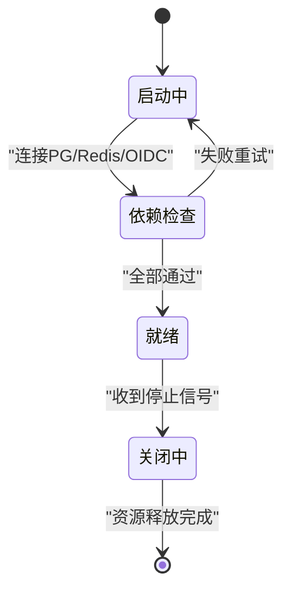
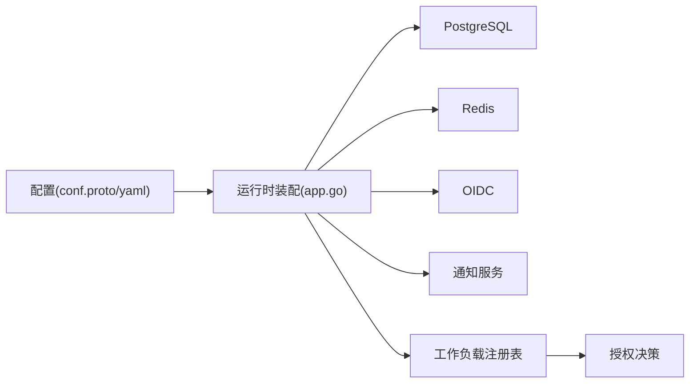

# 工作负载初始化

<cite>
**本文引用的文件**
- [cmd/server/main.go](file://cmd/server/main.go)
- [cmd/server/app.go](file://cmd/server/app.go)
- [internal/conf/conf.proto](file://internal/conf/conf.proto)
- [configs/config.yaml](file://configs/config.yaml)
- [internal/server/workload_identity.go](file://internal/server/workload_identity.go)
- [internal/biz/workload.go](file://internal/biz/workload.go)
- [internal/biz/workload_bootstrap.go](file://internal/biz/workload_bootstrap.go)
- [internal/data/workload_bootstrap.go](file://internal/data/workload_bootstrap.go)
- [api/iam/v1/workload.proto](file://api/iam/v1/workload.proto)
- [internal/server/readiness.go](file://internal/server/readiness.go)
</cite>

## 目录
1. [简介](#简介)
2. [项目结构](#项目结构)
3. [核心组件](#核心组件)
4. [架构总览](#架构总览)
5. [详细组件分析](#详细组件分析)
6. [依赖关系分析](#依赖关系分析)
7. [性能考虑](#性能考虑)
8. [故障排查指南](#故障排查指南)
9. [结论](#结论)
10. [附录](#附录)

## 简介
本文件面向“工作负载（Workload）”的启动与初始化，覆盖以下关键主题：
- 工作负载启动流程：从进程启动、配置加载、依赖连接、到服务就绪。
- 身份验证与权限获取：mTLS 握手、工作负载身份解析、授权检查。
- 依赖服务连接：PostgreSQL、Redis、OIDC、通知服务等。
- 状态管理：引导意图（Manifest）校验、幂等执行、健康检查与故障恢复。
- 与 IAM 服务的交互协议：工作负载调用链、能力协商（注册表）、配置同步（策略修订）。
- 初始化配置示例与调试技巧：日志、监控、常见问题定位。
- 生产环境部署最佳实践。

## 项目结构
本仓库采用分层组织：
- cmd/server：应用入口、构建与运行生命周期。
- internal/biz：领域逻辑（认证、授权、工作负载身份与授权、引导）。
- internal/data：数据访问层（PostgreSQL、Redis、OIDC、操作注册表、工作负载引导持久化）。
- internal/server：gRPC/HTTP 服务器、中间件、可观测性与就绪探针。
- api/iam/v1：对外 gRPC 契约（含工作负载相关消息）。
- configs：运行时配置。
- sdk/grpcworkload：工作负载 SDK（用于客户端侧发起调用与鉴权）。

**图表来源**
- [cmd/server/main.go:34-101](file://cmd/server/main.go#L34-L101)
- [cmd/server/app.go:369-744](file://cmd/server/app.go#L369-L744)
- [internal/conf/conf.proto:9-58](file://internal/conf/conf.proto#L9-L58)
- [configs/config.yaml:1-61](file://configs/config.yaml#L1-L61)

**章节来源**
- [cmd/server/main.go:34-101](file://cmd/server/main.go#L34-L101)
- [cmd/server/app.go:369-744](file://cmd/server/app.go#L369-L744)
- [internal/conf/conf.proto:9-58](file://internal/conf/conf.proto#L9-L58)
- [configs/config.yaml:1-61](file://configs/config.yaml#L1-L61)

## 核心组件
- 工作负载身份中间件：负责 mTLS 证书校验、提取 DNS 身份、调用认证与授权。
- 工作负载认证/授权：基于已验证的对端身份解析 Principal/Binding，并检查目标操作是否被授权。
- 工作负载引导（Bootstrap）：通过 Manifest 声明式创建 Principal、Binding、Grant，保证幂等与审计。
- 就绪与健康检查：周期性探测依赖可用性，控制服务是否对外暴露流量。
- 配置与注册表：加载工作负载目标注册表与策略修订，驱动能力协商与权限判定。

**章节来源**
- [internal/server/workload_identity.go:22-49](file://internal/server/workload_identity.go#L22-L49)
- [internal/biz/workload.go:56-106](file://internal/biz/workload.go#L56-L106)
- [internal/biz/workload_bootstrap.go:93-167](file://internal/biz/workload_bootstrap.go#L93-L167)
- [internal/data/workload_bootstrap.go:33-126](file://internal/data/workload_bootstrap.go#L33-L126)
- [internal/server/readiness.go:17-74](file://internal/server/readiness.go#L17-L74)

## 架构总览
下图展示工作负载初始化的端到端流程：进程启动、配置加载、依赖连接、中间件装配、健康检查，以及工作负载调用时的握手、认证、授权与能力协商。

**图表来源**
- [cmd/server/main.go:34-101](file://cmd/server/main.go#L34-L101)
- [cmd/server/app.go:369-744](file://cmd/server/app.go#L369-L744)
- [internal/server/workload_identity.go:22-49](file://internal/server/workload_identity.go#L22-L49)
- [internal/biz/workload.go:87-106](file://internal/biz/workload.go#L87-L106)
- [internal/server/readiness.go:27-74](file://internal/server/readiness.go#L27-L74)

## 详细组件分析

### 工作负载身份中间件（mTLS 握手与身份提取）
- 职责：在 gRPC 入站请求上，校验 TLS 对端证书链、用途与唯一 DNS 名称；将可信身份注入上下文，并委托业务层进行认证与授权。
- 关键点：
  - 仅接受单一 DNS 名称且无 IP/URI/Email 的叶子证书，且具备客户端认证用途。
  - 证书链必须当前有效。
  - 失败返回明确的 gRPC 错误码与原因（如 CREDENTIAL_INVALID、IAM_UNAVAILABLE）。

**图表来源**
- [internal/server/workload_identity.go:22-49](file://internal/server/workload_identity.go#L22-L49)
- [internal/server/workload_identity.go:52-91](file://internal/server/workload_identity.go#L52-L91)
- [internal/server/workload_identity.go:93-117](file://internal/server/workload_identity.go#L93-L117)

**章节来源**
- [internal/server/workload_identity.go:22-117](file://internal/server/workload_identity.go#L22-L117)

### 工作负载认证与授权（身份解析与权限判定）
- 认证：基于 VerifiedWorkloadPeer（环境、信任域、身份类型与值）解析出 WorkloadIdentity（PrincipalID、BindingID、版本）。
- 授权：检查目标 Audience+Operation 是否在注册表中启用，并查询授予版本；返回 DirectCaller（包含 GrantVersion、TargetRevision），供后续调用链使用。
- 上下文传播：DirectCaller 通过 context 传递，避免重复鉴权。

**图表来源**
- [internal/biz/workload.go:56-106](file://internal/biz/workload.go#L56-L106)

**章节来源**
- [internal/biz/workload.go:56-118](file://internal/biz/workload.go#L56-L118)

### 工作负载引导（Bootstrap）：状态管理与幂等性
- 输入：由受信任的 Provisioner 提交 Manifest（不含凭据），包含环境、信任域、CA 指纹、过期时间、工作负载列表及授予项。
- 校验：版本、ID 格式、环境/信任域匹配、CA 指纹、名称与 DNS 合法性、授予项必须在注册表中存在且唯一。
- 持久化：在事务中锁定环境级引导，检查是否已消费相同意图；若未消费则插入 Principal、Profile、Binding、Grant，并记录 Receipt 与审计事件。
- 幂等：同一 ManifestID 多次提交返回相同 Receipt；变更后的 Manifest 视为冲突。
- 安全：数据库角色限制（provisioner 最小权限），防止越权写入。

**图表来源**
- [internal/biz/workload_bootstrap.go:93-167](file://internal/biz/workload_bootstrap.go#L93-L167)
- [internal/data/workload_bootstrap.go:33-126](file://internal/data/workload_bootstrap.go#L33-L126)
- [internal/data/workload_bootstrap.go:143-164](file://internal/data/workload_bootstrap.go#L143-L164)

**章节来源**
- [internal/biz/workload_bootstrap.go:93-167](file://internal/biz/workload_bootstrap.go#L93-L167)
- [internal/data/workload_bootstrap.go:33-164](file://internal/data/workload_bootstrap.go#L33-L164)

### 与 IAM 服务的交互协议（握手、能力协商、配置同步）
- 握手：工作负载通过 mTLS 建立连接，服务端提取证书中的 DNS 作为身份标识。
- 能力协商：每次授权前，业务层根据 Target（Audience+Operation）查询工作负载目标注册表，确认该操作是否启用，并返回 AuthorityRevision（能力集版本）。
- 配置同步：策略修订（policy_revision）与目标注册表共同决定可用操作与权限范围；客户端需感知并适配版本变化。
- 协议消息：工作负载调用相关的请求/响应定义见 API 契约，包括 InvocationBinding、VerifyWorkloadCaller、VerifyWorkloadInvocation 等。

**图表来源**
- [api/iam/v1/workload.proto:10-121](file://api/iam/v1/workload.proto#L10-L121)
- [internal/biz/workload.go:87-106](file://internal/biz/workload.go#L87-L106)

**章节来源**
- [api/iam/v1/workload.proto:10-121](file://api/iam/v1/workload.proto#L10-L121)
- [internal/biz/workload.go:87-106](file://internal/biz/workload.go#L87-L106)

### 启动流程与就绪状态管理
- 启动阶段：
  - 加载配置（profile、server、runtime）。
  - 连接 PostgreSQL、Redis，Ping 成功。
  - 初始化 OIDC Provider、令牌编解码器、操作注册表与工作负载目标注册表。
  - 装配工作负载身份中间件、gRPC/HTTP 服务、可观测性与后台任务。
- 就绪探针：
  - 周期性检查数据库基础结构、Redis 连通性、可选核心运行时健康。
  - 全部通过后标记 Ready=true，对外暴露服务。
- 关闭阶段：
  - 设置 Ready=false，依次停止通知、运行时、可观测性等资源。

**图表来源**
- [cmd/server/app.go:369-744](file://cmd/server/app.go#L369-L744)
- [internal/server/readiness.go:17-74](file://internal/server/readiness.go#L17-L74)

**章节来源**
- [cmd/server/app.go:369-744](file://cmd/server/app.go#L369-L744)
- [internal/server/readiness.go:17-74](file://internal/server/readiness.go#L17-L74)

## 依赖关系分析
- 配置依赖：Bootstrap 与 Runtime 字段定义了网络、TLS、数据库、缓存、OIDC、通知、策略修订等。
- 运行时依赖：
  - PostgreSQL：存储 Principal/Binding/Grant、会话、审计、通知外箱等。
  - Redis：登录限流、OIDC 操作存储、API Key 用量聚合等。
  - OIDC：用户登录与身份链接。
  - 通知服务：密码动作通知投递。
- 能力与策略：
  - 工作负载目标注册表：声明可用 Audience+Operation 及其能力。
  - 策略修订：确保调用方与服务端对可用能力达成一致。

**图表来源**
- [internal/conf/conf.proto:9-113](file://internal/conf/conf.proto#L9-L113)
- [configs/config.yaml:1-61](file://configs/config.yaml#L1-L61)
- [cmd/server/app.go:369-744](file://cmd/server/app.go#L369-L744)

**章节来源**
- [internal/conf/conf.proto:9-113](file://internal/conf/conf.proto#L9-L113)
- [configs/config.yaml:1-61](file://configs/config.yaml#L1-L61)
- [cmd/server/app.go:369-744](file://cmd/server/app.go#L369-L744)

## 性能考虑
- 启动超时：依赖连接设置超时，避免启动阻塞。
- 健康检查间隔：就绪探针以固定周期探测，降低频繁 IO 压力。
- 批量与限流：API Key 用量聚合使用批处理；登录限流使用 Redis 窗口计数。
- 并发安全：引导过程使用行锁与环境锁，避免重复消费与竞争条件。
- 日志过滤：敏感字段自动过滤，减少日志体积与泄露风险。

[本节为通用指导，不直接分析具体文件]

## 故障排查指南
- 常见错误与定位：
  - CREDENTIAL_INVALID：mTLS 证书链/用途/有效期或 DNS 名称不符合要求。
  - IAM_UNAVAILABLE：认证/授权过程中依赖不可用或超时。
  - PERMISSION_DENIED：目标操作未授权或未启用。
  - 引导冲突/过期：Manifest 已消费或已过期；检查 ManifestID、ExpiresAt 与 Owner 环境/信任域。
- 建议步骤：
  - 检查证书链与 DNS 名称是否与信任域一致。
  - 查看工作负载目标注册表是否启用了对应 Audience+Operation。
  - 核对策略修订与客户端期望是否一致。
  - 检查数据库/Redis 连通性与权限（provisioner 角色限制）。
  - 关注就绪探针失败原因（PG/Redis/核心运行时）。

**章节来源**
- [internal/server/workload_identity.go:93-117](file://internal/server/workload_identity.go#L93-L117)
- [internal/biz/workload.go:12-15](file://internal/biz/workload.go#L12-L15)
- [internal/biz/workload_bootstrap.go:18-23](file://internal/biz/workload_bootstrap.go#L18-L23)
- [internal/data/workload_bootstrap.go:128-141](file://internal/data/workload_bootstrap.go#L128-L141)

## 结论
工作负载初始化以“强约束的身份模型 + 显式授权 + 能力注册表”为核心，结合健壮的健康检查与幂等的引导机制，确保在生产环境中稳定、可控地启动与运行。通过 mTLS 握手、严格的证书校验、细粒度的授权检查与版本化的能力协商，系统能够在复杂多租户与多环境场景下提供一致的安全边界与可观测性。

[本节为总结性内容，不直接分析具体文件]

## 附录

### 初始化配置示例（路径参考）
- 配置文件位置：[configs/config.yaml](file://configs/config.yaml)
- 配置结构定义：[internal/conf/conf.proto](file://internal/conf/conf.proto)
- 关键字段说明（节选）：
  - server.grpc.tls：证书、私钥、客户端 CA、网关客户端 DNS 名。
  - runtime.workload_registry_file/sha256：工作负载目标注册表文件与校验和。
  - runtime.environment/trust_domain：环境与信任域，用于身份绑定。
  - runtime.postgresql.dsn：数据库连接串。
  - runtime.redis.*：缓存连接与限流参数。
  - runtime.access_token.*：访问令牌签发密钥与发行者。
  - runtime.notification.*：通知服务地址、证书与投递参数。
  - runtime.oidc.*：OIDC 提供者、客户端凭据与回调地址。
  - runtime.policy_revision：策略修订标识，用于能力协商一致性。

**章节来源**
- [configs/config.yaml:1-61](file://configs/config.yaml#L1-L61)
- [internal/conf/conf.proto:9-113](file://internal/conf/conf.proto#L9-L113)

### 调试技巧
- 日志：
  - 使用结构化 JSON 日志，自动过滤敏感键（如 token、password、dsn 等）。
  - 通过 trace 属性关联请求链路。
- 监控：
  - 利用就绪探针观察依赖健康状态。
  - 关注 API Key 用量快照与通知投递成功率。
- 常见问题诊断：
  - 证书问题：检查证书链、用途、有效期与 DNS 名称。
  - 授权失败：核对注册表启用状态与授予版本。
  - 引导失败：检查 Manifest 合法性、Owner 匹配、数据库权限与锁冲突。

**章节来源**
- [cmd/server/main.go:104-131](file://cmd/server/main.go#L104-L131)
- [internal/server/readiness.go:27-74](file://internal/server/readiness.go#L27-L74)

### 生产环境部署最佳实践
- 安全：
  - 严格限定 provisioner 数据库角色权限，遵循最小权限原则。
  - 使用独立证书颁发机构与轮换策略，定期更新 CA 与证书。
  - 所有敏感配置通过挂载密钥文件（如 private_key_file、client_secret_file）引入。
- 高可用：
  - 多副本部署，配合负载均衡与优雅停机。
  - 健康检查与就绪探针集成到编排平台，确保滚动升级安全。
- 可观测性：
  - 开启分布式追踪与指标采集，集中收集日志。
  - 对关键路径（认证、授权、引导、通知）设置告警阈值。
- 容量与性能：
  - 合理设置连接池大小与超时，避免资源耗尽。
  - 使用批处理与限流保护后端依赖。
- 合规与审计：
  - 保留引导与授权审计事件，支持事后追溯。
  - 定期审查策略修订与注册表变更，确保与业务需求一致。

[本节为通用指导，不直接分析具体文件]