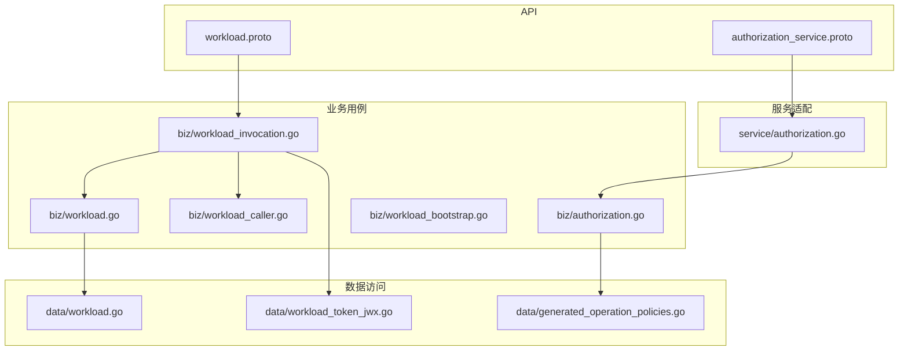
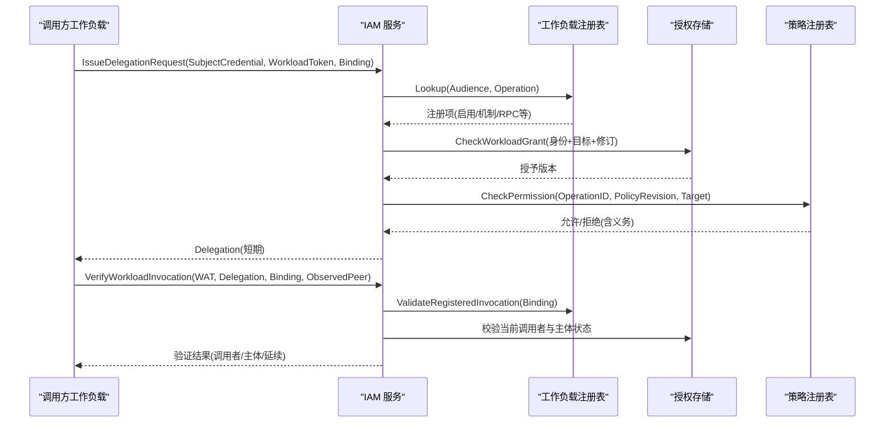
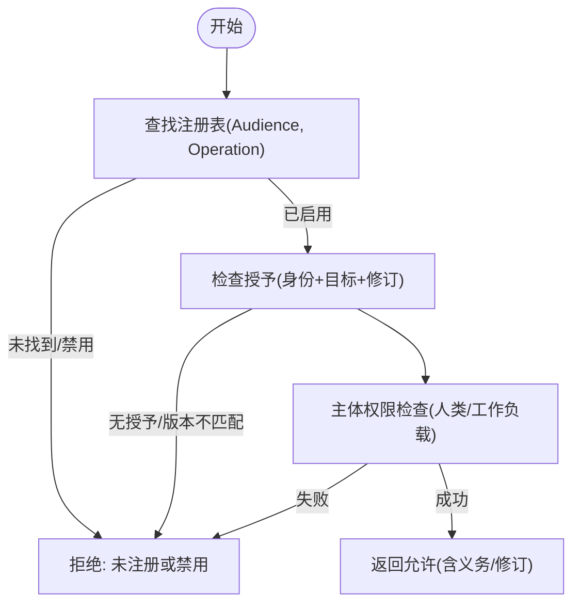
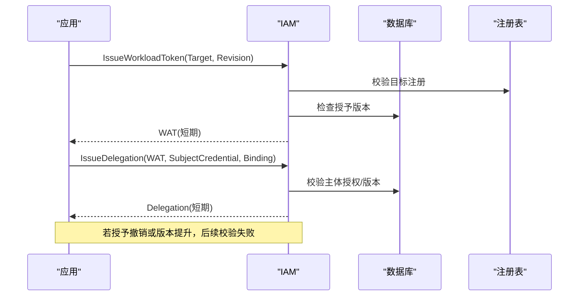
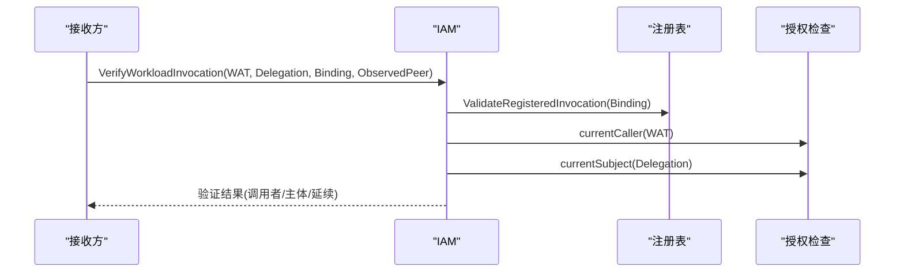
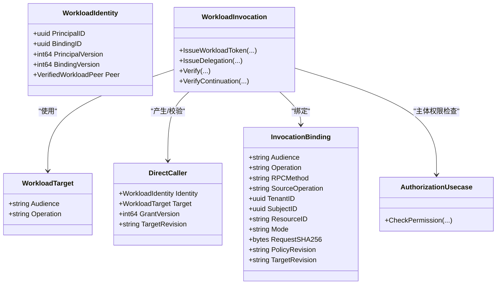
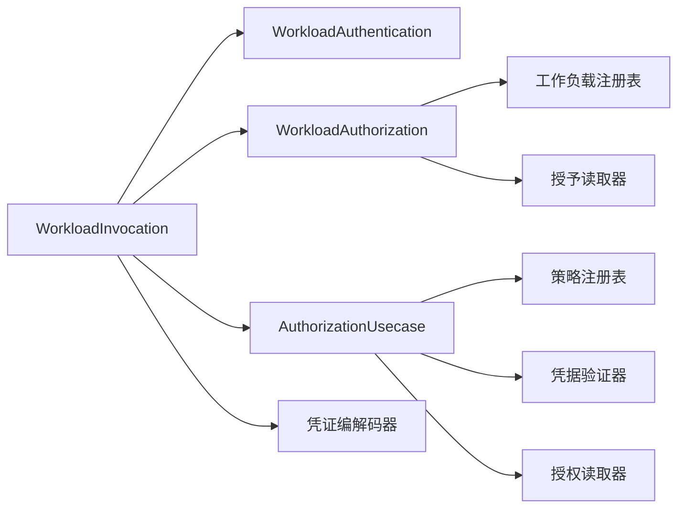

# 工作负载权限委托

<cite>
**本文引用的文件**
- [workload.proto](file://api/iam/v1/workload.proto)
- [authorization_service.proto](file://api/iam/v1/authorization_service.proto)
- [authorization.go](file://internal/biz/authorization.go)
- [workload.go](file://internal/biz/workload.go)
- [workload_caller.go](file://internal/biz/workload_caller.go)
- [workload_invocation.go](file://internal/biz/workload_invocation.go)
- [workload_bootstrap.go](file://internal/biz/workload_bootstrap.go)
- [workload.go](file://internal/data/workload.go)
- [generated_operation_policies.go](file://internal/data/generated_operation_policies.go)
- [authorization.go](file://internal/service/authorization.go)
- [workload_token_jwx.go](file://internal/data/workload_token_jwx.go)
</cite>

## 目录
1. [简介](#简介)
2. [项目结构](#项目结构)
3. [核心组件](#核心组件)
4. [架构总览](#架构总览)
5. [详细组件分析](#详细组件分析)
6. [依赖关系分析](#依赖关系分析)
7. [性能考虑](#性能考虑)
8. [故障排查指南](#故障排查指南)
9. [结论](#结论)
10. [附录：配置与最佳实践](#附录：配置与最佳实践)

## 简介
本文件系统性阐述工作负载（Workload）权限委托机制，覆盖以下主题：
- WorkloadTarget 的定义与作用域（受众、操作、版本控制）
- 权限检查流程（注册表查找、授权检查、修订版本验证）
- 权限委托生命周期（授权创建、版本管理、撤销机制）
- 评估流程（调用方身份认证、目标授权、主体权限校验、会话延续）
- 配置示例与安全边界（最小权限原则、安全边界设置）
- 审计与排障（决策记录、常见错误定位）

该机制通过“工作负载令牌 + 委派令牌 + 会话延续”的三段式凭证体系，结合“工作负载注册表 + 策略注册表 + 数据库授权状态”，实现细粒度、可审计、可撤销的工作负载间访问控制。

## 项目结构
围绕工作负载权限委托的关键代码分布在如下层次：
- API 层：定义工作负载相关的请求/响应消息与服务接口
- 业务层：实现身份认证、授权判定、令牌签发与校验、委托与延续
- 数据层：持久化工作负载身份绑定、授予、策略与审计事件
- 服务层：将 API 映射到业务用例

图表来源
- [workload.proto:10-121](file://api/iam/v1/workload.proto#L10-L121)
- [authorization_service.proto:10-40](file://api/iam/v1/authorization_service.proto#L10-L40)
- [workload_invocation.go:131-144](file://internal/biz/workload_invocation.go#L131-L144)
- [workload.go:26-54](file://internal/biz/workload.go#L26-L54)
- [workload_caller.go:18-22](file://internal/biz/workload_caller.go#L18-L22)
- [authorization.go:199-223](file://internal/biz/authorization.go#L199-L223)
- [workload.go:15-30](file://internal/data/workload.go#L15-L30)
- [workload_token_jwx.go:194-213](file://internal/data/workload_token_jwx.go#L194-L213)
- [generated_operation_policies.go:17-15](file://internal/data/generated_operation_policies.go#L17-L15)
- [authorization.go:17-25](file://internal/service/authorization.go#L17-L25)

章节来源
- [workload.proto:10-121](file://api/iam/v1/workload.proto#L10-L121)
- [authorization_service.proto:10-40](file://api/iam/v1/authorization_service.proto#L10-L40)
- [workload_invocation.go:131-144](file://internal/biz/workload_invocation.go#L131-L144)
- [workload.go:26-54](file://internal/biz/workload.go#L26-L54)
- [workload_caller.go:18-22](file://internal/biz/workload_caller.go#L18-L22)
- [authorization.go:199-223](file://internal/biz/authorization.go#L199-L223)
- [workload.go:15-30](file://internal/data/workload.go#L15-L30)
- [workload_token_jwx.go:194-213](file://internal/data/workload_token_jwx.go#L194-L213)
- [generated_operation_policies.go:17-15](file://internal/data/generated_operation_policies.go#L17-L15)
- [authorization.go:17-25](file://internal/service/authorization.go#L17-L25)

## 核心组件
- 工作负载目标与工作负载身份
  - WorkloadTarget：由受众（Audience）和操作（Operation）组成，用于声明被调用的服务与具体能力。
  - WorkloadIdentity：包含主体ID、绑定ID及版本号，表示经 mTLS 验证后的可信工作负载身份。
  - DirectCaller：一次跨进程调用中的“直接调用者”上下文，携带身份、目标、授予版本和目标修订。
- 工作负载授权与认证
  - WorkloadAuthentication：基于 mTLS 对调用方进行身份认证，解析为 WorkloadIdentity。
  - WorkloadAuthorization：依据注册表和工作负载授予（grants）判断是否允许访问目标。
- 工作负载调用与委托
  - WorkloadInvocation：负责签发工作负载令牌、委派令牌、会话延续；校验调用者与主体权限。
  - VerifiedWorkloadCaller：在线校验返回的可信调用者信息、有效期与权威修订。
- 通用权限检查
  - AuthorizationUsecase：统一的人类与工作负载权限判定入口，支持策略注册表、凭据校验、租户范围与义务约束。
- 启动引导与注册表
  - WorkloadBootstrap：校验并下发工作负载初始身份与授予清单，确保仅允许已注册的受众/操作。
  - 操作策略生成器：集中维护所有受管操作的策略元数据（资源、动作、作用域、凭据类型、主体类型）。

章节来源
- [workload.go:26-54](file://internal/biz/workload.go#L26-L54)
- [workload_invocation.go:131-144](file://internal/biz/workload_invocation.go#L131-L144)
- [workload_caller.go:18-22](file://internal/biz/workload_caller.go#L18-L22)
- [authorization.go:199-223](file://internal/biz/authorization.go#L199-L223)
- [workload_bootstrap.go:25-88](file://internal/biz/workload_bootstrap.go#L25-L88)
- [generated_operation_policies.go:17-15](file://internal/data/generated_operation_policies.go#L17-L15)

## 架构总览
下图展示工作负载权限委托的整体交互：调用方通过 mTLS 建立信任，IAM 完成身份认证、目标授权、主体权限检查，并签发短期令牌或委派令牌；接收方在业务侧使用 IAM 提供的 VerifyWorkloadCaller/VerifyWorkloadInvocation/VerifySessionContinuation 进行在线校验。

图表来源
- [workload.proto:46-94](file://api/iam/v1/workload.proto#L46-L94)
- [workload_invocation.go:175-236](file://internal/biz/workload_invocation.go#L175-L236)
- [workload_invocation.go:238-292](file://internal/biz/workload_invocation.go#L238-L292)
- [workload.go:87-106](file://internal/biz/workload.go#L87-L106)
- [workload.go:46-65](file://internal/data/workload.go#L46-L65)
- [authorization.go:225-329](file://internal/biz/authorization.go#L225-L329)

## 详细组件分析

### 工作负载目标与受众、操作、版本控制
- 受众（Audience）：限定目标服务的命名空间，避免跨服务误用。
- 操作（Operation）：精确到具体能力，如 RPC 方法或 HTTP 端点。
- 版本控制：
  - 目标修订（Target Revision）：来自注册表的当前权威版本，用于防止旧配置被重用。
  - 策略修订（Policy Revision）：来自策略注册表的当前版本，用于保证策略一致性。
  - 授予版本（Grant Version）：数据库中的授予版本，用于检测撤销或变更。

章节来源
- [workload.proto:10-25](file://api/iam/v1/workload.proto#L10-L25)
- [workload_invocation.go:146-173](file://internal/biz/workload_invocation.go#L146-L173)
- [workload.go:87-106](file://internal/biz/workload.go#L87-L106)
- [workload.go:46-65](file://internal/data/workload.go#L46-L65)
- [authorization.go:225-249](file://internal/biz/authorization.go#L225-L249)

### 权限检查机制：注册表查找、授权检查、修订版本验证
- 注册表查找：根据 Audience 与 Operation 查找注册项，确认启用状态、机制（WorkloadOnly/Delegated）、RPC/HTTP 匹配。
- 授权检查：
  - 工作负载授予：查询数据库中的授予记录，校验环境、信任域、主体/绑定版本与目标修订。
  - 主体权限：人类用户走 Access Token 校验与工作负载/租户授权；工作负载主体走 API Key 校验与授权。
- 修订版本验证：
  - 策略修订必须与注册表一致，否则拒绝。
  - 目标修订必须与注册表一致，防止使用过期目标配置。
  - 授予版本必须有效且未被撤销。

图表来源
- [workload.go:87-106](file://internal/biz/workload.go#L87-L106)
- [workload.go:46-65](file://internal/data/workload.go#L46-L65)
- [authorization.go:225-329](file://internal/biz/authorization.go#L225-L329)
- [authorization.go:331-420](file://internal/biz/authorization.go#L331-L420)

章节来源
- [workload.go:87-106](file://internal/biz/workload.go#L87-L106)
- [workload.go:46-65](file://internal/data/workload.go#L46-L65)
- [authorization.go:225-329](file://internal/biz/authorization.go#L225-L329)
- [authorization.go:331-420](file://internal/biz/authorization.go#L331-L420)

### 权限委托生命周期：创建、版本管理、撤销
- 创建：
  - 调用方先获取工作负载令牌（WAT），再向 IAM 申请委派令牌（Delegation），绑定具体 InvocationBinding。
  - 委派令牌有效期短（最多一分钟），不可刷新，降低泄露风险。
- 版本管理：
  - WAT 与 Delegation 均携带调用者与主体的版本信息，IAM 在线校验时比对当前授予版本与目标修订。
  - 策略修订必须与注册表一致，确保策略一致性。
- 撤销：
  - 授予状态改为撤销或版本提升后，后续在线校验会失败。
  - 身份绑定撤销后，身份认证失败，阻止继续访问。

图表来源
- [workload_invocation.go:146-173](file://internal/biz/workload_invocation.go#L146-L173)
- [workload_invocation.go:175-236](file://internal/biz/workload_invocation.go#L175-L236)
- [workload.go:87-106](file://internal/biz/workload.go#L87-L106)
- [workload.go:46-65](file://internal/data/workload.go#L46-L65)

章节来源
- [workload_invocation.go:146-173](file://internal/biz/workload_invocation.go#L146-L173)
- [workload_invocation.go:175-236](file://internal/biz/workload_invocation.go#L175-L236)
- [workload.go:87-106](file://internal/biz/workload.go#L87-L106)
- [workload.go:46-65](file://internal/data/workload.go#L46-L65)

### 权限评估流程：注册表查找、授权检查、修订版本验证
- 注册表查找：ValidateRegisteredInvocation 校验 Binding 的 Audience/Operation/RPC/HTTP 匹配，以及机制（WorkloadOnly/Delegated）。
- 授权检查：
  - 调用者授权：currentCaller 校验 WAT 中的调用者身份与授予版本。
  - 主体授权：currentSubject 校验人类用户或工作负载主体的授权状态与版本。
- 修订版本验证：
  - 策略修订：必须与策略注册表一致。
  - 目标修订：必须与注册表一致。
  - 授予版本：必须有效且未被撤销。

图表来源
- [workload_invocation.go:238-292](file://internal/biz/workload_invocation.go#L238-L292)
- [workload_invocation.go:294-394](file://internal/biz/workload_invocation.go#L294-L394)
- [workload_caller.go:43-113](file://internal/biz/workload_caller.go#L43-L113)

章节来源
- [workload_invocation.go:238-292](file://internal/biz/workload_invocation.go#L238-L292)
- [workload_invocation.go:294-394](file://internal/biz/workload_invocation.go#L294-L394)
- [workload_caller.go:43-113](file://internal/biz/workload_caller.go#L43-L113)

### 对象模型与关系图

图表来源
- [workload.go:26-54](file://internal/biz/workload.go#L26-L54)
- [workload_invocation.go:131-144](file://internal/biz/workload_invocation.go#L131-L144)
- [workload_invocation.go:36-63](file://internal/biz/workload_invocation.go#L36-L63)
- [authorization.go:199-223](file://internal/biz/authorization.go#L199-L223)

章节来源
- [workload.go:26-54](file://internal/biz/workload.go#L26-L54)
- [workload_invocation.go:131-144](file://internal/biz/workload_invocation.go#L131-L144)
- [workload_invocation.go:36-63](file://internal/biz/workload_invocation.go#L36-L63)
- [authorization.go:199-223](file://internal/biz/authorization.go#L199-L223)

## 依赖关系分析
- 组件耦合
  - WorkloadInvocation 依赖 WorkloadAuthentication、WorkloadAuthorization、AuthorizationUsecase、凭证编解码器与审计接口。
  - WorkloadAuthorization 依赖工作负载注册表与授予读取器。
  - AuthorizationUsecase 依赖策略注册表、凭据验证器与授权读取器。
- 外部依赖
  - 工作负载注册表：提供目标注册信息与权威修订。
  - 数据库：存储身份绑定、授予、策略与审计事件。
  - 策略注册表：集中管理操作策略（资源、动作、作用域、凭据类型、主体类型）。
- 潜在循环依赖
  - 通过接口抽象（Reader/Registry/Codec）解耦，避免直接循环依赖。

图表来源
- [workload_invocation.go:131-144](file://internal/biz/workload_invocation.go#L131-L144)
- [workload.go:74-85](file://internal/biz/workload.go#L74-L85)
- [authorization.go:199-223](file://internal/biz/authorization.go#L199-L223)

章节来源
- [workload_invocation.go:131-144](file://internal/biz/workload_invocation.go#L131-L144)
- [workload.go:74-85](file://internal/biz/workload.go#L74-L85)
- [authorization.go:199-223](file://internal/biz/authorization.go#L199-L223)

## 性能考虑
- 在线校验优先：关键路径（VerifyWorkloadCaller/VerifyWorkloadInvocation/VerifySessionContinuation）均为在线校验，减少本地缓存不一致风险。
- 短期令牌：WAT 与 Delegation 有效期短，降低泄露窗口与重放攻击面。
- 注册表与策略缓存：注册表与策略注册表应高效读取，避免频繁网络往返。
- 数据库查询优化：授予与授权状态查询需索引合理，避免全表扫描。
- 审计写入异步化：审计事件建议异步落盘，避免阻塞主路径。

[本节为一般性指导，无需特定文件引用]

## 故障排查指南
- 常见问题与原因
  - 未注册或禁用：注册表中未找到目标或已禁用，导致拒绝。
  - 授予撤销或版本不匹配：授予状态变为撤销或版本提升，在线校验失败。
  - 策略修订不匹配：策略修订与注册表不一致，拒绝。
  - 身份绑定撤销：mTLS 身份绑定撤销，认证失败。
  - 主体权限不足：人类用户或工作负载主体在当前策略下无权限。
- 定位步骤
  - 检查 Binding 的 Audience/Operation/RPC/HTTP 是否与注册表一致。
  - 检查授予状态与版本，确认未被撤销或升级。
  - 检查策略修订是否最新。
  - 检查主体凭据（Access Token 或 API Key）是否有效且未过期。
  - 查看审计事件，定位拒绝原因与决策 ID。

章节来源
- [workload.go:87-106](file://internal/biz/workload.go#L87-L106)
- [workload.go:46-65](file://internal/data/workload.go#L46-L65)
- [authorization.go:225-329](file://internal/biz/authorization.go#L225-L329)
- [authorization.go:331-420](file://internal/biz/authorization.go#L331-L420)
- [workload_invocation.go:238-292](file://internal/biz/workload_invocation.go#L238-L292)

## 结论
工作负载权限委托通过“注册表 + 授予 + 策略 + 短期令牌 + 在线校验”的组合，实现了细粒度、可审计、可撤销的安全访问控制。遵循最小权限原则、严格版本控制与短期凭证策略，可有效降低安全风险并提高系统可维护性。

[本节为总结性内容，无需特定文件引用]

## 附录：配置与最佳实践
- 最小权限原则
  - 仅授予必要的 Audience/Operation，避免宽泛权限。
  - 限制凭据类型与主体类型，例如工作负载主体仅允许 API Key。
  - 使用租户范围（Tenant Scope）与义务（Obligations）约束资源访问。
- 安全边界设置
  - 明确区分平台级与租户级权限，避免越权。
  - 使用工作负载注册表锁定 RPC/HTTP 端点，防止未登记接口被调用。
  - 强制策略修订与目标修订一致，避免配置漂移。
- 配置示例（概念性）
  - 工作负载目标：Audience="ani-notification-service", Operation="notification.submit"
  - 策略：Resource="notifications", Actions=["submit"], Scope="tenant", CredentialKinds=["workload_token"], PrincipalKinds=["workload"]
  - 授予：PrincipalID=工作负载主体, Environment/TrustDomain=运行环境, Audience/Operation=目标, Status=active, Version=递增
- 审计与监控
  - 记录每次鉴权决策（允许/拒绝）与原因，便于事后审计。
  - 监控授予撤销与版本提升事件，及时告警。

章节来源
- [generated_operation_policies.go:17-15](file://internal/data/generated_operation_policies.go#L17-L15)
- [workload_bootstrap.go:93-173](file://internal/biz/workload_bootstrap.go#L93-L173)
- [authorization.go:225-329](file://internal/biz/authorization.go#L225-L329)
- [workload_invocation.go:175-236](file://internal/biz/workload_invocation.go#L175-L236)