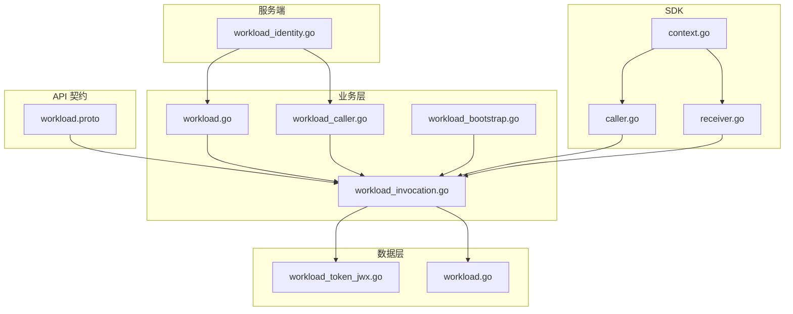
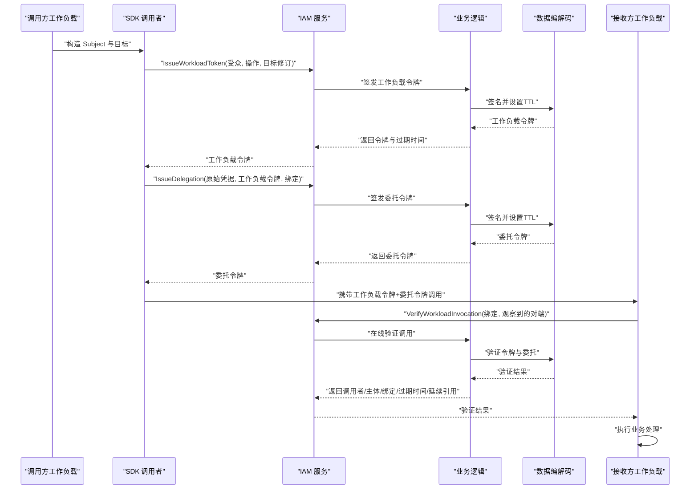
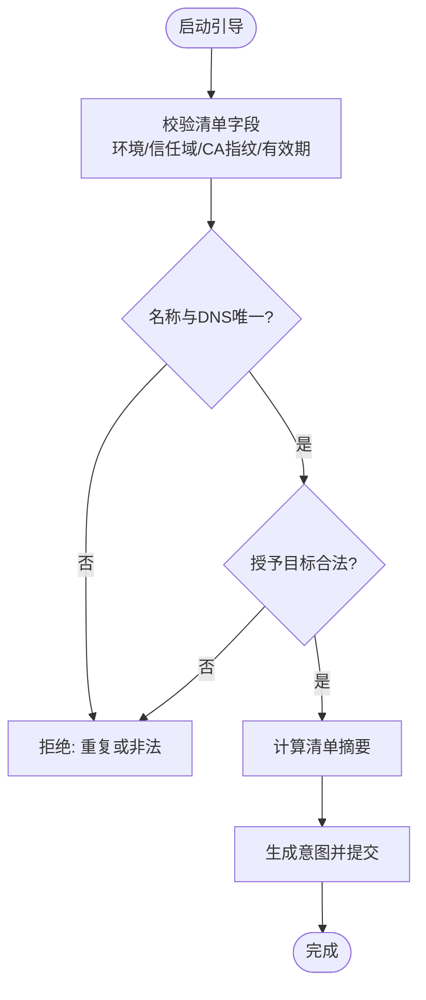
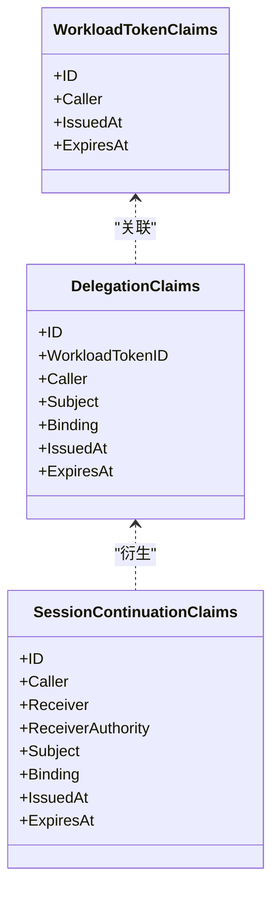
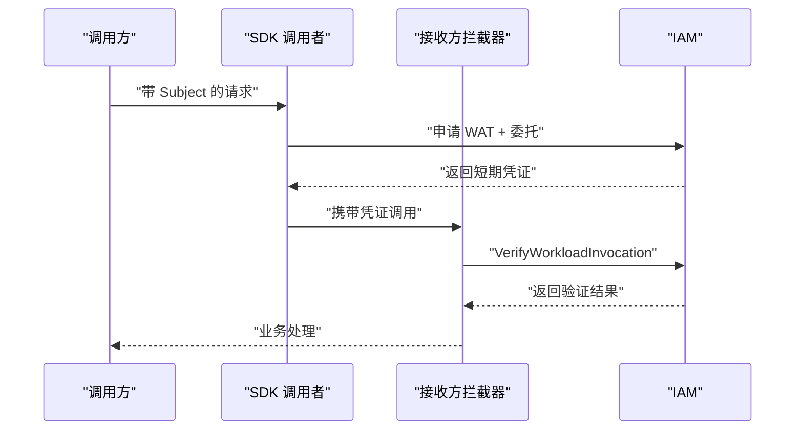
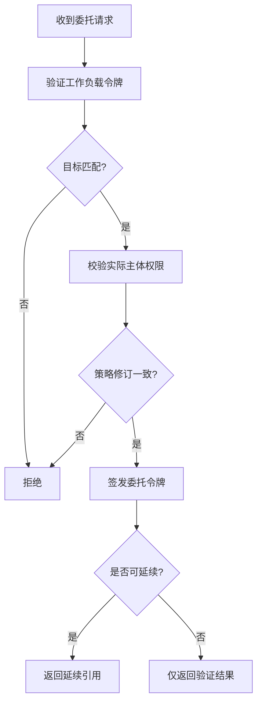
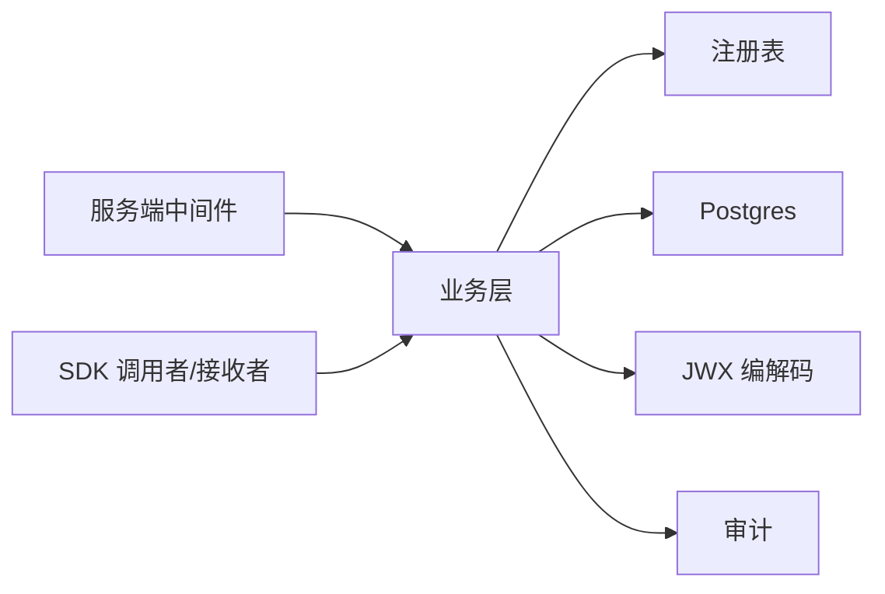

# 工作负载管理

<cite>
**本文引用的文件**
- [workload.proto](file://api/iam/v1/workload.proto)
- [workload.go](file://internal/biz/workload.go)
- [workload_caller.go](file://internal/biz/workload_caller.go)
- [workload_bootstrap.go](file://internal/biz/workload_bootstrap.go)
- [workload_invocation.go](file://internal/biz/workload_invocation.go)
- [caller.go](file://sdk/grpcworkload/caller.go)
- [receiver.go](file://sdk/grpcworkload/receiver.go)
- [context.go](file://sdk/grpcworkload/context.go)
- [main.go](file://examples/workload-grpc/main.go)
- [workload_identity.go](file://internal/server/workload_identity.go)
- [workload_token_jwx.go](file://internal/data/workload_token_jwx.go)
- [workload.go](file://internal/data/workload.go)
- [config.yaml](file://configs/config.yaml)
</cite>

## 目录
1. [简介](#简介)
2. [项目结构](#项目结构)
3. [核心组件](#核心组件)
4. [架构总览](#架构总览)
5. [详细组件分析](#详细组件分析)
6. [依赖关系分析](#依赖关系分析)
7. [性能考虑](#性能考虑)
8. [故障排查指南](#故障排查指南)
9. [结论](#结论)
10. [附录](#附录)

## 简介
本文件面向 ANI IAM 的工作负载（Workload）身份与调用体系，系统性说明：
- 工作负载身份的概念、生命周期与注册流程
- 短期令牌机制：工作负载令牌、委托令牌与会话延续引用
- 工作负载间通信模式：调用者模式、接收者模式、上下文传递
- 权限委托、审计追踪与故障恢复策略
- 工作负载初始化流程、SDK 使用示例与最佳实践
- 性能调优建议、监控指标与故障排查指南

## 项目结构
ANI IAM 的工作负载能力由 API 契约、业务逻辑、数据编解码、服务端中间件与 SDK 共同构成：
- API 契约定义工作负载相关的请求/响应结构与 RPC 方法
- 业务层实现身份认证、授权、令牌签发与验证、委托与延续
- 数据层负责 JWT 编解码与持久化查询
- 服务端中间件完成 mTLS 身份提取与 IAM 入站授权
- SDK 提供 gRPC 调用者与拦截器，封装短凭证的获取与注入

**图示来源**
- [workload.proto:10-121](file://api/iam/v1/workload.proto#L10-L121)
- [workload.go:26-118](file://internal/biz/workload.go#L26-L118)
- [workload_caller.go:18-114](file://internal/biz/workload_caller.go#L18-L114)
- [workload_bootstrap.go:25-173](file://internal/biz/workload_bootstrap.go#L25-L173)
- [workload_invocation.go:131-452](file://internal/biz/workload_invocation.go#L131-L452)
- [workload_token_jwx.go:18-66](file://internal/data/workload_token_jwx.go#L18-L66)
- [workload.go:15-65](file://internal/data/workload.go#L15-L65)
- [workload_identity.go:22-146](file://internal/server/workload_identity.go#L22-L146)
- [caller.go:19-110](file://sdk/grpcworkload/caller.go#L19-L110)
- [receiver.go:15-89](file://sdk/grpcworkload/receiver.go#L15-L89)
- [context.go:12-88](file://sdk/grpcworkload/context.go#L12-L88)

**章节来源**
- [workload.proto:10-121](file://api/iam/v1/workload.proto#L10-L121)
- [workload.go:26-118](file://internal/biz/workload.go#L26-L118)
- [workload_caller.go:18-114](file://internal/biz/workload_caller.go#L18-L114)
- [workload_bootstrap.go:25-173](file://internal/biz/workload_bootstrap.go#L25-L173)
- [workload_invocation.go:131-452](file://internal/biz/workload_invocation.go#L131-L452)
- [workload_token_jwx.go:18-66](file://internal/data/workload_token_jwx.go#L18-L66)
- [workload.go:15-65](file://internal/data/workload.go#L15-L65)
- [workload_identity.go:22-146](file://internal/server/workload_identity.go#L22-L146)
- [caller.go:19-110](file://sdk/grpcworkload/caller.go#L19-L110)
- [receiver.go:15-89](file://sdk/grpcworkload/receiver.go#L15-L89)
- [context.go:12-88](file://sdk/grpcworkload/context.go#L12-L88)

## 核心组件
- 工作负载身份与目标
  - VerifiedWorkloadPeer：仅由传输层在 mTLS 后报告，不包含权限
  - WorkloadIdentity：包含主体 ID、绑定 ID 及版本，用于后续授权
  - WorkloadTarget：以受众与操作标识目标
- 直接调用者 DirectCaller
  - 承载已认证的调用方身份、目标、授权版本与目标修订号
- 工作负载授权与认证
  - WorkloadAuthentication：校验环境、信任域、DNS 身份等
  - WorkloadAuthorization：基于注册表与数据库检查授权版本
- 工作负载调用链
  - IssueWorkloadToken：签发短期工作负载令牌
  - IssueDelegation：基于当前权威签发委托令牌
  - Verify：在线验证工作负载调用，返回可延续引用
  - VerifyContinuation：仅对已准入请求进行接收者在线重检
- 工作负载启动引导
  - WorkloadBootstrapManifest：声明式清单，不含凭据
  - ValidateWorkloadBootstrap：严格校验清单并生成意图摘要
- 数据编解码
  - JWXWorkloadCredentialCodec：签发/验证工作负载令牌、委托令牌、延续引用
- 服务端中间件
  - NewWorkloadIdentityMiddleware：从 mTLS 证书提取 DNS 身份，注入 DirectCaller
- SDK 调用者与接收者
  - Caller：为每次调用申请短期凭证并注入元数据
  - ReceiverInterceptor：在线验证并清理敏感元数据，注入 Verified 上下文
  - Context：Subject/Verified 在上下文中安全传递

**章节来源**
- [workload.go:17-118](file://internal/biz/workload.go#L17-L118)
- [workload_caller.go:18-114](file://internal/biz/workload_caller.go#L18-L114)
- [workload_bootstrap.go:25-173](file://internal/biz/workload_bootstrap.go#L25-L173)
- [workload_invocation.go:131-452](file://internal/biz/workload_invocation.go#L131-L452)
- [workload_token_jwx.go:18-66](file://internal/data/workload_token_jwx.go#L18-L66)
- [workload_identity.go:22-146](file://internal/server/workload_identity.go#L22-L146)
- [caller.go:19-110](file://sdk/grpcworkload/caller.go#L19-L110)
- [receiver.go:15-89](file://sdk/grpcworkload/receiver.go#L15-L89)
- [context.go:12-88](file://sdk/grpcworkload/context.go#L12-L88)

## 架构总览
ANI IAM 通过“注册表 + 数据库 + 短期令牌”的组合，实现工作负载间的零信任通信。调用方不持有长期凭据，而是按请求在线签发短期证据；接收方在线验证并可选择生成延续引用以支持长链路。

**图示来源**
- [caller.go:47-110](file://sdk/grpcworkload/caller.go#L47-L110)
- [workload_invocation.go:146-236](file://internal/biz/workload_invocation.go#L146-L236)
- [workload_token_jwx.go:36-66](file://internal/data/workload_token_jwx.go#L36-L66)
- [receiver.go:38-89](file://sdk/grpcworkload/receiver.go#L38-L89)

## 详细组件分析

### 工作负载身份与注册
- 身份来源：mTLS 证书中的 DNS 名称，经中间件提取并标准化
- 身份解析：根据环境、信任域、身份类型与值查询绑定与版本
- 授权检查：结合注册表与数据库确认该身份对目标有有效授权版本
- 启动引导：通过 Manifest 批量声明工作负载身份与授予目标，严格校验唯一性、域名后缀、CA 指纹与有效期

**图示来源**
- [workload_bootstrap.go:93-173](file://internal/biz/workload_bootstrap.go#L93-L173)

**章节来源**
- [workload_identity.go:22-91](file://internal/server/workload_identity.go#L22-L91)
- [workload.go:32-65](file://internal/data/workload.go#L32-L65)
- [workload_bootstrap.go:93-173](file://internal/biz/workload_bootstrap.go#L93-L173)

### 短期令牌机制
- 工作负载令牌（WAT）：绑定调用方身份与目标，TTL 较短，不可刷新
- 委托令牌（Delegation）：将实际主体（人或工作负载）与资源边界绑定到本次调用，TTL 更短
- 会话延续引用（Continuation）：仅在标记为“可延续”的目标上返回，供接收方后续在线重检，不可作为新凭据

**图示来源**
- [workload_invocation.go:65-100](file://internal/biz/workload_invocation.go#L65-L100)
- [workload_token_jwx.go:18-66](file://internal/data/workload_token_jwx.go#L18-L66)

**章节来源**
- [workload_invocation.go:146-292](file://internal/biz/workload_invocation.go#L146-L292)
- [workload_token_jwx.go:36-66](file://internal/data/workload_token_jwx.go#L36-L66)

### 工作负载间通信模式
- 调用者模式（Caller）
  - 为每个受保护调用申请新的工作负载令牌与委托令牌
  - 自动删除上游敏感头，避免泄露
  - 禁止重试业务请求，保证幂等与安全
- 接收者模式（Receiver）
  - 仅允许已注册的方法进入
  - 在线验证工作负载令牌与委托令牌，校验绑定与对端身份
  - 清理敏感元数据，注入 Verified 上下文供业务使用
- 上下文传递
  - Subject：来自 IAM 授权响应的主体信息，含决策 ID
  - Verified：请求级已验证的调用方、主体、绑定与延续引用

**图示来源**
- [caller.go:47-110](file://sdk/grpcworkload/caller.go#L47-L110)
- [receiver.go:38-89](file://sdk/grpcworkload/receiver.go#L38-L89)
- [workload_invocation.go:238-292](file://internal/biz/workload_invocation.go#L238-L292)

**章节来源**
- [caller.go:47-110](file://sdk/grpcworkload/caller.go#L47-L110)
- [receiver.go:38-89](file://sdk/grpcworkload/receiver.go#L38-L89)
- [context.go:12-88](file://sdk/grpcworkload/context.go#L12-L88)

### 权限委托与在线重检
- 委托签发前会校验：
  - 工作负载令牌有效性、目标匹配、对端身份一致
  - 实际主体的权限决策与策略修订一致
  - 主体类型与凭据（人/工作负载 API Key）合法性
- 延续引用：
  - 仅对标记为可延续的目标返回
  - 接收方可用 VerifySessionContinuation 在线重检，不可续期或再签发

**图示来源**
- [workload_invocation.go:175-292](file://internal/biz/workload_invocation.go#L175-L292)

**章节来源**
- [workload_invocation.go:175-292](file://internal/biz/workload_invocation.go#L175-L292)

### 审计追踪
- 所有关键事件（签发工作负载令牌、委托、延续）均记录审计事件
- 审计包含：行为者、直接调用者、认证方式、目标类型与版本、结果、时间戳、请求/决策 ID
- 审计写入失败时视为持久化不可用，回滚上层操作

**章节来源**
- [workload_invocation.go:396-409](file://internal/biz/workload_invocation.go#L396-L409)

### 故障恢复策略
- 短期凭证：WAT 与委托 TTL 极短，降低泄露面
- 在线验证：每次调用都在线校验，避免缓存陈旧状态
- 延续引用：仅用于同一接收者的在线重检，不可复用或续期
- 错误映射：将业务错误映射为明确的 gRPC 状态码与原因，便于网关与客户端处理

**章节来源**
- [workload_identity.go:93-146](file://internal/server/workload_identity.go#L93-L146)
- [workload_invocation.go:238-452](file://internal/biz/workload_invocation.go#L238-L452)

## 依赖关系分析
- 业务层依赖：
  - 身份解析与授权读取接口
  - 注册表（目标、机制、修订）
  - 主题授权与策略修订
  - 令牌编解码与审计
- 数据层依赖：
  - Postgres 查询（身份解析、授权检查）
  - JWK 签名与验证
- 服务端依赖：
  - gRPC 传输与 TLS 信息
- SDK 依赖：
  - gRPC 客户端拦截器与元数据

**图示来源**
- [workload.go:48-118](file://internal/biz/workload.go#L48-L118)
- [workload_caller.go:60-114](file://internal/biz/workload_caller.go#L60-L114)
- [workload_invocation.go:131-144](file://internal/biz/workload_invocation.go#L131-L144)
- [workload_token_jwx.go:23-66](file://internal/data/workload_token_jwx.go#L23-L66)
- [workload.go:15-65](file://internal/data/workload.go#L15-L65)
- [workload_identity.go:22-91](file://internal/server/workload_identity.go#L22-L91)
- [caller.go:47-110](file://sdk/grpcworkload/caller.go#L47-L110)
- [receiver.go:38-89](file://sdk/grpcworkload/receiver.go#L38-L89)

**章节来源**
- [workload.go:48-118](file://internal/biz/workload.go#L48-L118)
- [workload_caller.go:60-114](file://internal/biz/workload_caller.go#L60-L114)
- [workload_invocation.go:131-144](file://internal/biz/workload_invocation.go#L131-L144)
- [workload_token_jwx.go:23-66](file://internal/data/workload_token_jwx.go#L23-L66)
- [workload.go:15-65](file://internal/data/workload.go#L15-L65)
- [workload_identity.go:22-91](file://internal/server/workload_identity.go#L22-L91)
- [caller.go:47-110](file://sdk/grpcworkload/caller.go#L47-L110)
- [receiver.go:38-89](file://sdk/grpcworkload/receiver.go#L38-L89)

## 性能考虑
- 减少网络往返
  - 合理设置超时与并发，避免串行多次 IAM 调用
  - 复用 gRPC 连接，禁用不必要的重试
- 缩短凭证生命周期
  - WAT 与委托 TTL 很短，确保快速失效与最小暴露面
- 在线验证优先
  - 避免本地缓存导致的状态不一致
- 注册表与策略修订
  - 使用目标修订号与策略修订号，防止旧配置生效
- 日志与指标
  - 记录 IAM 调用耗时、错误率、凭证签发/验证次数
  - 监控数据库与 Redis 延迟

[本节为通用指导，不直接分析具体文件]

## 故障排查指南
- 常见错误与定位
  - 身份无效：检查 mTLS 证书 DNS、环境、信任域与绑定是否存在
  - 权限拒绝：核对注册表目标是否启用、授权版本是否有效、策略修订是否匹配
  - 凭证无效：检查 WAT/委托是否过期、目标是否匹配、对端身份是否一致
  - 延续引用错误：确认目标是否标记为可延续，且仅用于在线重检
- 服务端错误映射
  - Unauthenticated/PermissionDenied/Unavailable/DeadlineExceeded 等明确原因
- 审计与追踪
  - 通过审计事件中的 DecisionID/RequestID 关联一次调用全链路
- 配置问题
  - 检查配置文件中的工作负载注册表路径与哈希、TLS 证书、数据库与 Redis 连接

**章节来源**
- [workload_identity.go:93-146](file://internal/server/workload_identity.go#L93-L146)
- [workload_invocation.go:238-452](file://internal/biz/workload_invocation.go#L238-L452)
- [config.yaml:1-61](file://configs/config.yaml#L1-L61)

## 结论
ANI IAM 的工作负载体系以“注册表 + 数据库 + 短期令牌 + 在线验证”为核心，实现了细粒度、可审计、可恢复的内部服务间零信任通信。通过 SDK 封装与严格的绑定校验，调用方无需持有长期凭据即可安全访问目标服务；接收方可按需生成延续引用以支持长链路。配合完善的错误映射与审计追踪，系统具备高可观测性与易排障能力。

[本节为总结，不直接分析具体文件]

## 附录

### 工作负载初始化完整流程
- 准备清单：填写环境、信任域、CA 指纹、有效期与工作负载列表
- 校验清单：唯一性、域名后缀、授予目标合法性
- 提交意图：生成摘要并提交，完成注册
- 运行时加载：配置工作负载注册表与哈希，启动服务

**章节来源**
- [workload_bootstrap.go:93-173](file://internal/biz/workload_bootstrap.go#L93-L173)
- [config.yaml:17-21](file://configs/config.yaml#L17-L21)

### SDK 使用示例与最佳实践
- 调用方
  - 使用 DialCaller 创建连接，为每个调用申请 WAT 与委托
  - 不要重试业务请求，避免重复执行
  - 不要传播上游敏感头
- 接收方
  - 使用 ReceiverInterceptor 保护受保护方法
  - 从上下文获取 Verified，进行资源归属检查
  - 如需长链路，使用延续引用进行在线重检
- 示例参考
  - 示例程序展示了调用者与接收者的完整流程

**章节来源**
- [caller.go:25-110](file://sdk/grpcworkload/caller.go#L25-L110)
- [receiver.go:15-89](file://sdk/grpcworkload/receiver.go#L15-L89)
- [main.go:60-100](file://examples/workload-grpc/main.go#L60-L100)
- [main.go:144-210](file://examples/workload-grpc/main.go#L144-L210)

### 监控指标建议
- IAM 调用指标
  - IssueWorkloadToken 次数与耗时
  - IssueDelegation 次数与耗时
  - VerifyWorkloadInvocation 次数与耗时
  - VerifySessionContinuation 次数与耗时
- 错误指标
  - 身份无效、权限拒绝、凭证无效、持久化不可用
- 资源指标
  - 数据库连接池、Redis 命中率、JWT 签名密钥轮换状态

[本节为通用指导，不直接分析具体文件]