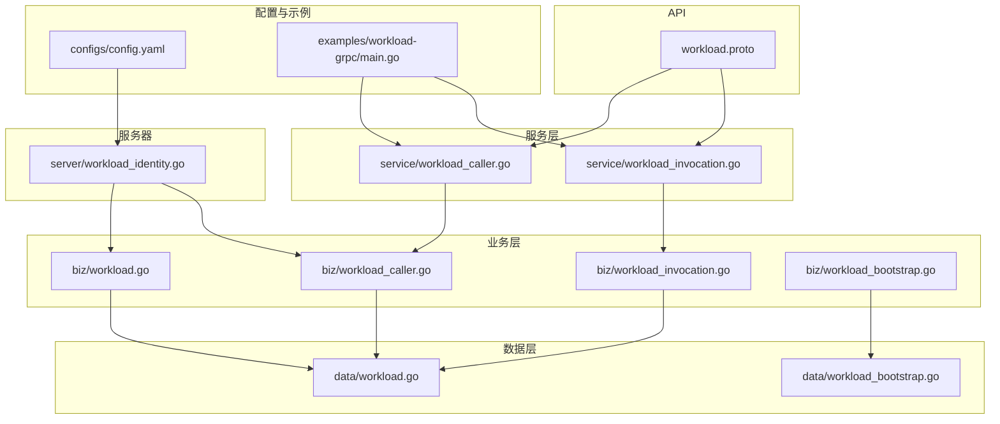
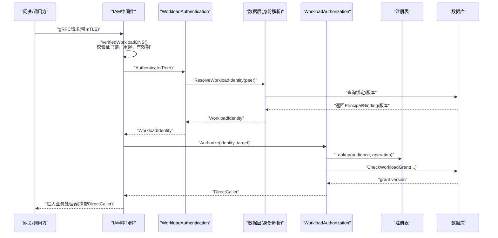
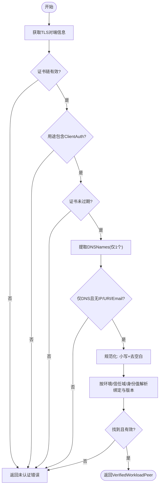
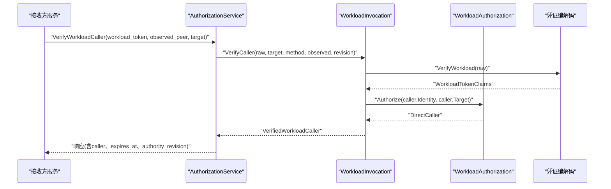
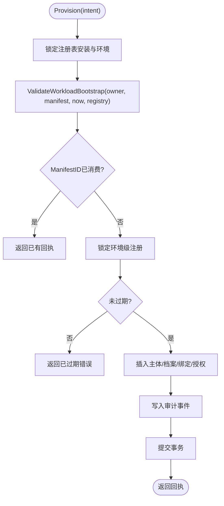
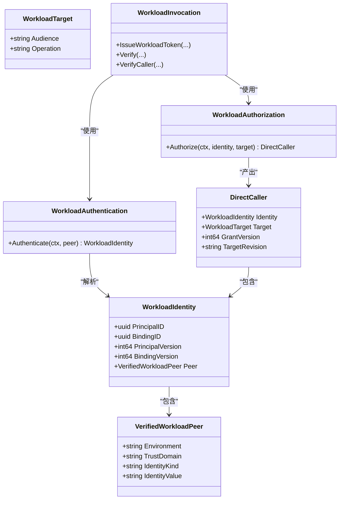
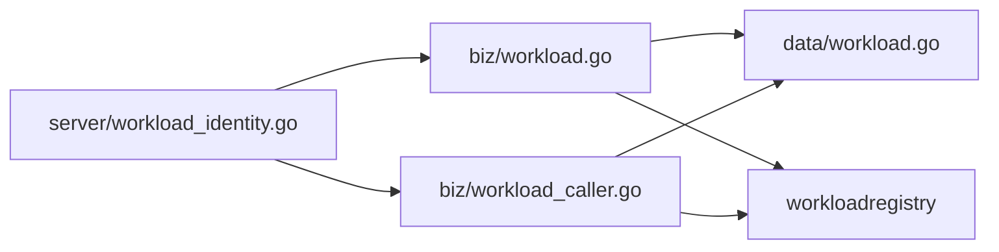

# 工作负载身份管理

<cite>
**本文引用的文件**
- [workload.proto](file://api/iam/v1/workload.proto)
- [workload.go](file://internal/biz/workload.go)
- [workload_identity.go](file://internal/server/workload_identity.go)
- [workload_caller.go](file://internal/biz/workload_caller.go)
- [workload_invocation.go](file://internal/biz/workload_invocation.go)
- [workload.go](file://internal/data/workload.go)
- [workload_bootstrap.go](file://internal/biz/workload_bootstrap.go)
- [workload_bootstrap.go](file://internal/data/workload_bootstrap.go)
- [config.yaml](file://configs/config.yaml)
- [main.go](file://examples/workload-grpc/main.go)
</cite>

## 目录
1. [简介](#简介)
2. [项目结构](#项目结构)
3. [核心组件](#核心组件)
4. [架构总览](#架构总览)
5. [详细组件分析](#详细组件分析)
6. [依赖关系分析](#依赖关系分析)
7. [性能考虑](#性能考虑)
8. [故障排查指南](#故障排查指南)
9. [结论](#结论)
10. [附录：配置与示例](#附录：配置与示例)

## 简介
本文件面向工作负载身份管理的实现与使用，聚焦 VerifiedWorkloadPeer 与 WorkloadIdentity 的结构设计、验证规则、解析流程（X.509 证书校验、DNS 身份提取、身份有效性检查）、注册机制（身份绑定、版本管理与生命周期控制），以及最佳实践（安全配置、错误处理与故障恢复）。文档同时提供可追溯的代码片段路径与图示，帮助读者快速理解并正确集成。

## 项目结构
围绕工作负载身份的核心代码分布在以下层次：
- API 契约层：定义 WorkloadPeer、DirectWorkloadCaller、VerifyWorkloadCaller/VerifyWorkloadInvocation 等消息类型。
- 业务逻辑层：封装身份认证、授权、调用链验证、令牌签发与续期、主体委派等。
- 服务层：将 gRPC/HTTP 请求映射到业务用例，进行参数校验与结果转换。
- 数据访问层：负责身份解析、授权检查、注册表校验与持久化操作。
- 服务器中间件：在传输层完成 mTLS 证书校验、DNS 身份提取，并将可信的 VerifiedWorkloadPeer 注入上下文。
- 配置与示例：环境、信任域、目标注册表、证书路径等运行配置；示例展示调用方与接收方的端到端用法。

图表来源
- [workload.proto:10-121](file://api/iam/v1/workload.proto#L10-L121)
- [workload_identity.go:22-49](file://internal/server/workload_identity.go#L22-L49)
- [workload_caller.go:18-58](file://internal/biz/workload_caller.go#L18-L58)
- [workload_invocation.go:131-173](file://internal/biz/workload_invocation.go#L131-L173)
- [workload.go:17-46](file://internal/biz/workload.go#L17-L46)
- [workload.go:32-65](file://internal/data/workload.go#L32-L65)
- [workload_bootstrap.go:25-74](file://internal/biz/workload_bootstrap.go#L25-L74)
- [workload_bootstrap.go:33-126](file://internal/data/workload_bootstrap.go#L33-L126)
- [config.yaml:17-21](file://configs/config.yaml#L17-L21)
- [main.go:60-77](file://examples/workload-grpc/main.go#L60-L77)

章节来源
- [workload.proto:10-121](file://api/iam/v1/workload.proto#L10-L121)
- [workload_identity.go:22-49](file://internal/server/workload_identity.go#L22-L49)
- [workload.go:17-46](file://internal/biz/workload.go#L17-L46)
- [workload.go:32-65](file://internal/data/workload.go#L32-L65)
- [workload_bootstrap.go:25-74](file://internal/biz/workload_bootstrap.go#L25-L74)
- [workload_bootstrap.go:33-126](file://internal/data/workload_bootstrap.go#L33-L126)
- [config.yaml:17-21](file://configs/config.yaml#L17-L21)
- [main.go:60-77](file://examples/workload-grpc/main.go#L60-L77)

## 核心组件
- VerifiedWorkloadPeer：仅在传输层通过 mTLS 验证后产生，包含 environment、trust_domain、identity_kind、identity_value。它不携带任何权限，仅表示“已验证的对端身份”。
- WorkloadIdentity：由 VerifiedWorkloadPeer 解析得到，包含 principal_id、binding_id、principal_version、binding_version 以及 Peer 引用。用于后续授权判断。
- DirectCaller：一次跳转的直接调用者信息，包含 Identity、Target、GrantVersion、TargetRevision。
- WorkloadTarget：目标受众与操作（audience、operation）。
- WorkloadAuthentication：对 VerifiedWorkloadPeer 做基础格式与值校验，再交由数据层解析为 WorkloadIdentity。
- WorkloadAuthorization：基于注册表与数据库中的授权记录，判定是否允许访问指定目标。
- WorkloadInvocation：工作负载调用链验证、令牌签发、委派、会话续期等核心流程。
- WorkloadBootstrap：离线批量注册工作负载身份与授权，含清单校验、幂等与审计。

章节来源
- [workload.go:17-46](file://internal/biz/workload.go#L17-L46)
- [workload_caller.go:18-58](file://internal/biz/workload_caller.go#L18-L58)
- [workload_invocation.go:131-173](file://internal/biz/workload_invocation.go#L131-L173)
- [workload_bootstrap.go:25-74](file://internal/biz/workload_bootstrap.go#L25-L74)

## 架构总览
下图展示了从网关到 IAM 的工作负载身份认证与授权链路，包括 mTLS 证书校验、DNS 身份提取、身份解析、授权检查与上下文传递。

图表来源
- [workload_identity.go:22-49](file://internal/server/workload_identity.go#L22-L49)
- [workload_identity.go:52-91](file://internal/server/workload_identity.go#L52-L91)
- [workload.go:62-72](file://internal/biz/workload.go#L62-L72)
- [workload.go:87-106](file://internal/biz/workload.go#L87-L106)
- [workload.go:32-65](file://internal/data/workload.go#L32-L65)

## 详细组件分析

### 1) VerifiedWorkloadPeer 与 WorkloadIdentity 的设计与验证规则
- VerifiedWorkloadPeer
  - environment：工作负载所属环境标识，需与服务端配置一致。
  - trust_domain：信任域，限制跨域通信。
  - identity_kind：当前固定为 x509_dns，表示通过 X.509 证书的 DNSNames 字段提取身份。
  - identity_value：规范化后的 DNS 名称（小写、去空白、不含非法字符）。
- WorkloadIdentity
  - principal_id、binding_id：工作负载主体与其身份绑定的唯一标识。
  - principal_version、binding_version：用于版本化与撤销检测。
  - peer：回传 VerifiedWorkloadPeer，供后续一致性校验。

验证要点
- 身份值必须为小写、无空白与换行符，且非空。
- 身份类型必须为 x509_dns。
- 环境、信任域必须与服务端配置匹配。
- 解析成功后，还需确保 principal/binding 状态有效且版本最新。

章节来源
- [workload.go:17-32](file://internal/biz/workload.go#L17-L32)
- [workload.go:62-72](file://internal/biz/workload.go#L62-L72)
- [workload.go:32-44](file://internal/data/workload.go#L32-L44)

### 2) 工作负载身份解析流程（X.509 证书验证、DNS 身份提取、身份有效性检查）
- 证书链校验：仅接受客户端证书用途为 clientAuth，且证书链完整。
- 证书有效期：当前时间必须在 NotBefore 与 NotAfter 之间。
- DNS 身份提取：仅允许单个 DNSName，且不得包含 IP、URI、Email。
- 身份规范化：提取的 DNS 名称需小写、去除空白，并拒绝包含非法字符。
- 身份解析：根据 environment、trust_domain、identity_kind、identity_value 查询绑定与版本。
- 有效性检查：若未找到或版本不一致，视为无效身份。

图表来源
- [workload_identity.go:52-91](file://internal/server/workload_identity.go#L52-L91)
- [workload.go:62-72](file://internal/biz/workload.go#L62-L72)
- [workload.go:32-44](file://internal/data/workload.go#L32-L44)

章节来源
- [workload_identity.go:52-91](file://internal/server/workload_identity.go#L52-L91)
- [workload.go:62-72](file://internal/biz/workload.go#L62-L72)
- [workload.go:32-44](file://internal/data/workload.go#L32-L44)

### 3) 授权与调用链验证
- 入口授权：IAM 内部 RPC（如 IssueWorkloadToken、VerifyWorkloadInvocation）需要工作负载具备相应操作授权。
- 目标授权：调用方需对目标 audience/operation 拥有授权，且注册表启用该目标。
- 调用链验证：
  - VerifyWorkloadCaller：验证工作负载令牌与观测到的对端身份，返回可直接使用的 DirectCaller。
  - VerifyWorkloadInvocation：结合工作负载令牌与委派令牌，验证调用者与主体，必要时生成会话续期引用。
  - VerifySessionContinuation：仅用于接收方在线复核先前已准入的请求，不可作为新凭证。

图表来源
- [workload_caller.go:44-113](file://internal/biz/workload_caller.go#L44-L113)
- [workload_invocation.go:146-173](file://internal/biz/workload_invocation.go#L146-L173)
- [workload_invocation.go:238-292](file://internal/biz/workload_invocation.go#L238-L292)
- [workload.go:87-106](file://internal/biz/workload.go#L87-L106)

章节来源
- [workload_caller.go:44-113](file://internal/biz/workload_caller.go#L44-L113)
- [workload_invocation.go:146-173](file://internal/biz/workload_invocation.go#L146-L173)
- [workload_invocation.go:238-292](file://internal/biz/workload_invocation.go#L238-L292)
- [workload.go:87-106](file://internal/biz/workload.go#L87-L106)

### 4) 工作负载注册机制（身份绑定、版本管理、生命周期控制）
- 离线批量注册：通过 WorkloadBootstrapManifest 声明环境、信任域、CA 指纹、工作负载列表及其授权。
- 清单校验：
  - 版本号、UUID 规范、环境名与信任域名正则校验。
  - CA 指纹长度与大小写规范。
  - 每个工作负载的 PrincipalID、BindingID、DNSIdentity 唯一性、后缀归属信任域。
  - 授权目标必须在注册表中存在且启用。
- 幂等与冲突：同一 ManifestID 重复提交会返回已有回执；同一环境仅允许一次成功注册。
- 生命周期：
  - 绑定与授权均带版本，变更时旧版本失效。
  - 支持撤销（revoked）与激活（active）状态切换。
  - 运行时通过版本比对拒绝旧绑定/授权。

图表来源
- [workload_bootstrap.go:93-102](file://internal/biz/workload_bootstrap.go#L93-L102)
- [workload_bootstrap.go:106-167](file://internal/biz/workload_bootstrap.go#L106-L167)
- [workload_bootstrap.go:33-126](file://internal/data/workload_bootstrap.go#L33-L126)

章节来源
- [workload_bootstrap.go:93-102](file://internal/biz/workload_bootstrap.go#L93-L102)
- [workload_bootstrap.go:106-167](file://internal/biz/workload_bootstrap.go#L106-L167)
- [workload_bootstrap.go:33-126](file://internal/data/workload_bootstrap.go#L33-L126)

### 5) 类图：关键对象与关系

图表来源
- [workload.go:17-46](file://internal/biz/workload.go#L17-L46)
- [workload_caller.go:18-22](file://internal/biz/workload_caller.go#L18-L22)
- [workload_invocation.go:131-173](file://internal/biz/workload_invocation.go#L131-L173)

## 依赖关系分析
- 中间件依赖业务层的认证与授权，依赖数据层进行身份解析与授权检查。
- 业务层依赖注册表以确认目标启用与修订版本，依赖数据库以读取/校验授权与绑定。
- 服务层仅做协议适配与参数校验，核心逻辑下沉至业务层。
- 配置项 environment、trust_domain 贯穿认证与授权，确保跨域隔离。

图表来源
- [workload_identity.go:22-49](file://internal/server/workload_identity.go#L22-L49)
- [workload.go:87-106](file://internal/biz/workload.go#L87-L106)
- [workload_caller.go:44-113](file://internal/biz/workload_caller.go#L44-L113)
- [workload.go:32-65](file://internal/data/workload.go#L32-L65)

章节来源
- [workload_identity.go:22-49](file://internal/server/workload_identity.go#L22-L49)
- [workload.go:87-106](file://internal/biz/workload.go#L87-L106)
- [workload_caller.go:44-113](file://internal/biz/workload_caller.go#L44-L113)
- [workload.go:32-65](file://internal/data/workload.go#L32-L65)

## 性能考虑
- 证书校验与 DNS 提取在中间件内完成，避免进入业务逻辑，减少开销。
- 授权检查先查注册表（内存），再查数据库，降低不必要 IO。
- 版本化绑定与授权使撤销与更新即时生效，无需全局刷新。
- 会话续期引用短 TTL，降低长尾风险。

[本节为通用指导，不直接分析具体文件]

## 故障排查指南
常见错误与定位建议：
- 证书问题
  - 现象：Unauthenticated/CREDENTIAL_INVALID
  - 排查：检查证书链、用途是否为 ClientAuth、有效期、DNSNames 数量与内容。
  - 参考路径：[workload_identity.go:52-91](file://internal/server/workload_identity.go#L52-L91)
- 身份值不规范
  - 现象：Identity invalid
  - 排查：确保 identity_value 小写、无空白与非法字符；environment/trust_domain 与配置一致。
  - 参考路径：[workload.go:62-72](file://internal/biz/workload.go#L62-L72)
- 授权失败
  - 现象：PermissionDenied
  - 排查：目标是否在注册表中启用；绑定/授权是否 active；版本是否最新。
  - 参考路径：[workload.go:87-106](file://internal/biz/workload.go#L87-L106)、[workload.go:32-65](file://internal/data/workload.go#L32-L65)
- 注册冲突/过期
  - 现象：Bootstrap conflict/expired
  - 排查：ManifestID 是否重复；环境是否已注册；清单是否过期。
  - 参考路径：[workload_bootstrap.go:106-167](file://internal/biz/workload_bootstrap.go#L106-L167)、[workload_bootstrap.go:33-126](file://internal/data/workload_bootstrap.go#L33-L126)
- 调用链不匹配
  - 现象：Credential invalid / Permission denied
  - 排查：工作负载令牌的目标与方法/路径是否与注册表一致；observed_peer 与 ingress 的环境/信任域是否一致。
  - 参考路径：[workload_caller.go:60-113](file://internal/biz/workload_caller.go#L60-L113)、[workload_invocation.go:238-292](file://internal/biz/workload_invocation.go#L238-L292)

章节来源
- [workload_identity.go:52-91](file://internal/server/workload_identity.go#L52-L91)
- [workload.go:62-72](file://internal/biz/workload.go#L62-L72)
- [workload.go:87-106](file://internal/biz/workload.go#L87-L106)
- [workload.go:32-65](file://internal/data/workload.go#L32-L65)
- [workload_bootstrap.go:106-167](file://internal/biz/workload_bootstrap.go#L106-L167)
- [workload_bootstrap.go:33-126](file://internal/data/workload_bootstrap.go#L33-L126)
- [workload_caller.go:60-113](file://internal/biz/workload_caller.go#L60-L113)
- [workload_invocation.go:238-292](file://internal/biz/workload_invocation.go#L238-L292)

## 结论
本系统通过严格的 mTLS 证书校验与 DNS 身份提取，结合环境/信任域隔离、版本化绑定与授权、以及细粒度的注册表控制，实现了高安全性的工作负载身份管理与调用链验证。配合离线批量注册与审计，既满足大规模部署的可运维性，又保证运行时的一致性与可追溯性。

[本节为总结性内容，不直接分析具体文件]

## 附录：配置与示例
- 运行配置关键点
  - environment、trust_domain：决定身份解析与授权范围。
  - workload_registry_file、workload_registry_sha256：目标注册表文件与哈希校验。
  - TLS 证书与 CA：服务端证书、私钥、客户端 CA 与网关 DNS 白名单。
  - 参考路径：[config.yaml:17-21](file://configs/config.yaml#L17-L21)
- 示例用法
  - 调用方：加载注册表，构造目标描述，发起鉴权与调用。
  - 接收方：启动本地监听，注入拦截器，从上下文获取已验证的身份与绑定。
  - 参考路径：[main.go:60-77](file://examples/workload-grpc/main.go#L60-L77)、[main.go:120-167](file://examples/workload-grpc/main.go#L120-L167)

章节来源
- [config.yaml:17-21](file://configs/config.yaml#L17-L21)
- [main.go:60-77](file://examples/workload-grpc/main.go#L60-L77)
- [main.go:120-167](file://examples/workload-grpc/main.go#L120-L167)