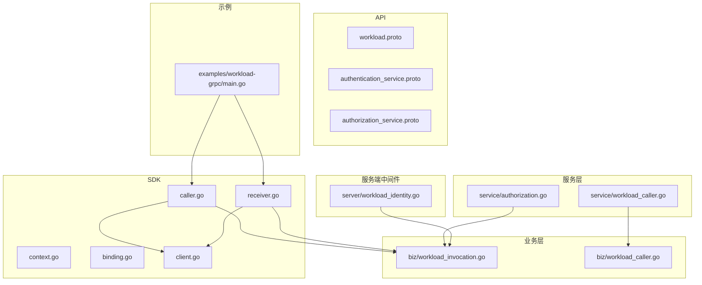
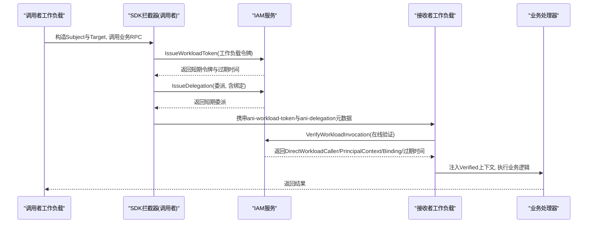
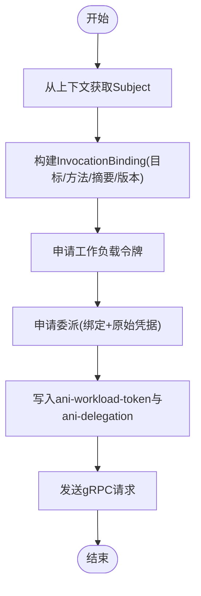
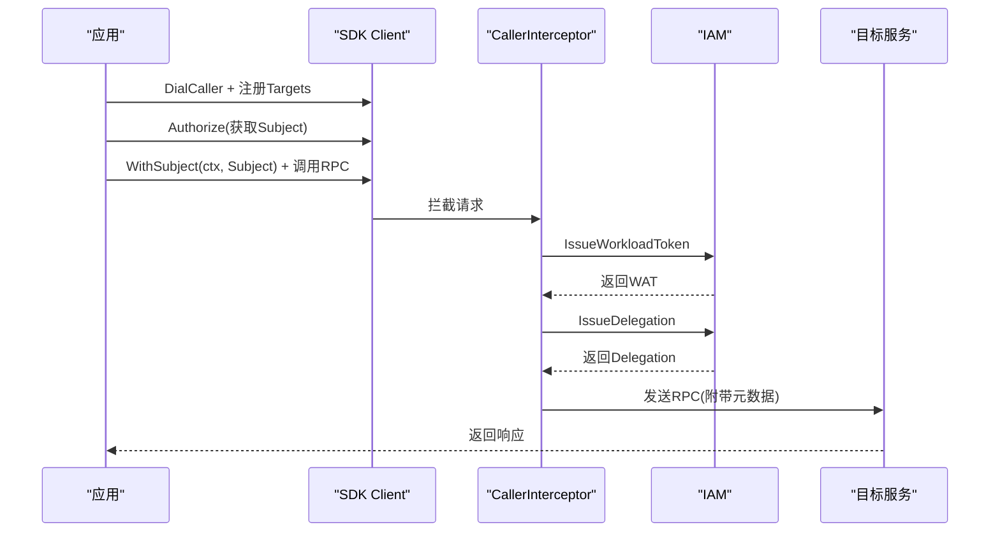
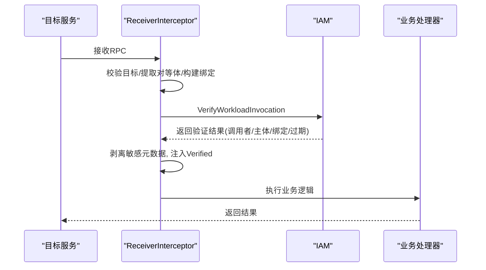
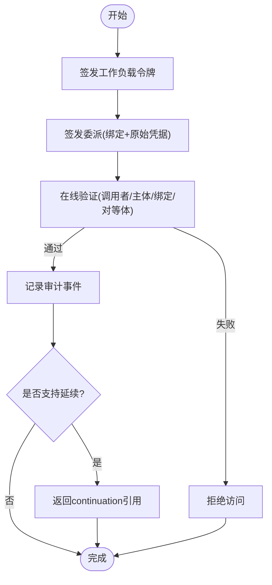
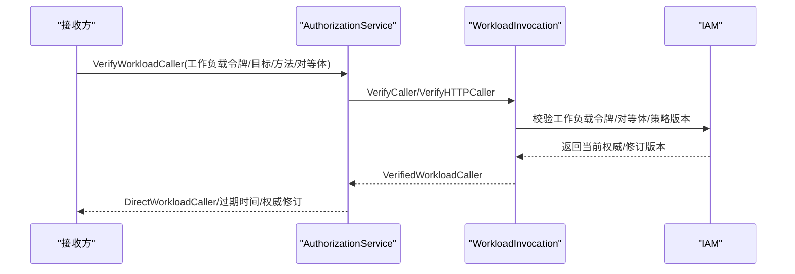
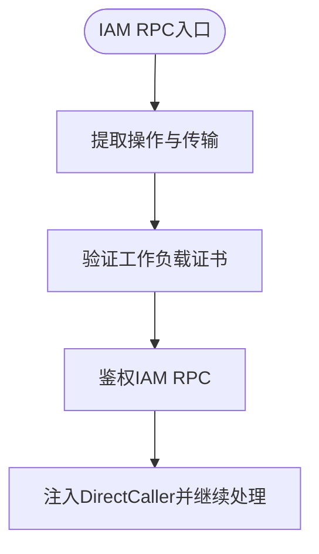
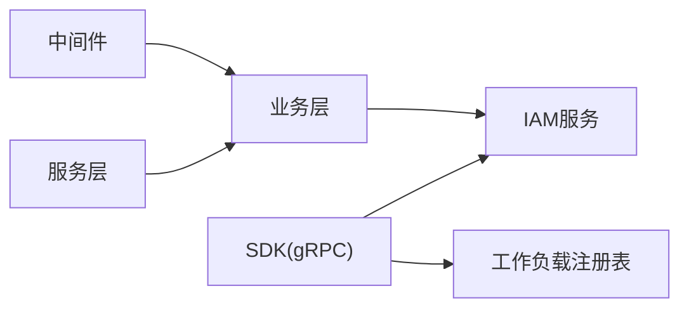

# 工作负载通信机制

<cite>
**本文引用的文件**
- [workload.proto](file://api/iam/v1/workload.proto)
- [authentication_service.proto](file://api/iam/v1/authentication_service.proto)
- [authorization_service.proto](file://api/iam/v1/authorization_service.proto)
- [caller.go](file://sdk/grpcworkload/caller.go)
- [receiver.go](file://sdk/grpcworkload/receiver.go)
- [context.go](file://sdk/grpcworkload/context.go)
- [binding.go](file://sdk/grpcworkload/binding.go)
- [client.go](file://sdk/grpcworkload/client.go)
- [workload_caller.go](file://internal/service/workload_caller.go)
- [workload_caller.go](file://internal/biz/workload_caller.go)
- [workload_invocation.go](file://internal/biz/workload_invocation.go)
- [workload_identity.go](file://internal/server/workload_identity.go)
- [main.go](file://examples/workload-grpc/main.go)
</cite>

## 目录
1. [简介](#简介)
2. [项目结构](#项目结构)
3. [核心组件](#核心组件)
4. [架构总览](#架构总览)
5. [详细组件分析](#详细组件分析)
6. [依赖关系分析](#依赖关系分析)
7. [性能考虑](#性能考虑)
8. [故障排查指南](#故障排查指南)
9. [结论](#结论)
10. [附录：SDK使用示例与最佳实践](#附录sdk使用示例与最佳实践)

## 简介
本文件系统性阐述工作负载（Workload）之间的通信机制，重点包括：
- DirectCaller模式与上下文传递：调用者身份、目标信息与授权版本如何在调用链上传播。
- gRPC客户端与服务端实现：连接建立、请求发送、响应处理与拦截器职责。
- 认证与授权流程：短期令牌（Workload Token、Delegation、Continuation）的生成、校验与审计记录。
- SDK使用示例：调用者模式、接收者模式、错误处理与资源所有权检查。
- 性能优化建议与监控指标收集。

## 项目结构
该仓库围绕“工作负载通信”的关键路径由以下部分组成：
- API定义：gRPC服务与消息类型，定义工作负载调用的绑定、调用者、授权与验证协议。
- SDK（grpcworkload）：封装mTLS连接、IAM交互、请求绑定、拦截器（调用者与接收者）。
- 业务层（biz）：工作负载令牌签发、委派、在线校验、会话延续、权限判定与审计。
- 服务层（service）：对外暴露的gRPC服务实现，将请求映射到业务用例。
- 服务端中间件（server）：对IAM内部RPC进行工作负载身份校验与鉴权。
- 示例（examples/workload-grpc）：演示调用者与接收者的完整流程。

图表来源
- [workload.proto:1-121](file://api/iam/v1/workload.proto#L1-L121)
- [authentication_service.proto:1-200](file://api/iam/v1/authentication_service.proto#L1-L200)
- [authorization_service.proto:1-40](file://api/iam/v1/authorization_service.proto#L1-L40)
- [caller.go:1-110](file://sdk/grpcworkload/caller.go#L1-L110)
- [receiver.go:1-89](file://sdk/grpcworkload/receiver.go#L1-L89)
- [context.go:1-88](file://sdk/grpcworkload/context.go#L1-L88)
- [binding.go:1-99](file://sdk/grpcworkload/binding.go#L1-L99)
- [client.go:1-233](file://sdk/grpcworkload/client.go#L1-L233)
- [workload_caller.go:1-50](file://internal/service/workload_caller.go#L1-L50)
- [workload_caller.go:1-114](file://internal/biz/workload_caller.go#L1-L114)
- [workload_invocation.go:1-452](file://internal/biz/workload_invocation.go#L1-L452)
- [workload_identity.go:1-146](file://internal/server/workload_identity.go#L1-L146)
- [main.go:1-222](file://examples/workload-grpc/main.go#L1-L222)

章节来源
- [workload.proto:1-121](file://api/iam/v1/workload.proto#L1-L121)
- [authentication_service.proto:1-200](file://api/iam/v1/authentication_service.proto#L1-L200)
- [authorization_service.proto:1-40](file://api/iam/v1/authorization_service.proto#L1-L40)
- [caller.go:1-110](file://sdk/grpcworkload/caller.go#L1-L110)
- [receiver.go:1-89](file://sdk/grpcworkload/receiver.go#L1-L89)
- [context.go:1-88](file://sdk/grpcworkload/context.go#L1-L88)
- [binding.go:1-99](file://sdk/grpcworkload/binding.go#L1-L99)
- [client.go:1-233](file://sdk/grpcworkload/client.go#L1-L233)
- [workload_caller.go:1-50](file://internal/service/workload_caller.go#L1-L50)
- [workload_caller.go:1-114](file://internal/biz/workload_caller.go#L1-L114)
- [workload_invocation.go:1-452](file://internal/biz/workload_invocation.go#L1-L452)
- [workload_identity.go:1-146](file://internal/server/workload_identity.go#L1-L146)
- [main.go:1-222](file://examples/workload-grpc/main.go#L1-L222)

## 核心组件
- 工作负载绑定（InvocationBinding）：描述一次调用的受众、操作、RPC方法、源操作、租户、主体、资源、模式、请求摘要、策略版本与目标版本，确保调用方与接收方对“被审查的目标记录”达成一致。
- 工作负载对等体（WorkloadPeer）：经mTLS验证后上报的对端身份与环境信息，仅由已认证的接收者在入站时报告。
- DirectWorkloadCaller：单次跳的当前身份与权威，包含主体ID、绑定ID、版本及对等体信息。
- 短期令牌与委派：
  - Workload Token：工作负载自身身份的短期凭证，用于证明调用者有权访问目标。
  - Delegation：基于原始凭据与绑定，重新授权实际主体的一次性委派，有效期极短且不可刷新。
  - Continuation：针对支持延续的工作负载，提供接收方可在线重检的引用，不可用于创建新凭证或扩大范围。
- SDK拦截器：
  - CallerInterceptor：为每个受保护调用签发新的短期证据，附加工作负载令牌与委派元数据，禁止重试业务RPC。
  - ReceiverInterceptor：仅允许已注册方法通过，在线验证IAM返回的调用者、主体与绑定一致性，剥离敏感元数据并注入Verified上下文。
- IAM服务：
  - AuthenticationService：签发工作负载令牌与委派。
  - AuthorizationService：验证工作负载调用、会话延续与通用权限检查。
- 服务端中间件：对IAM内部RPC进行工作负载身份校验与鉴权，确保只有可信网关/工作负载可调用。

章节来源
- [workload.proto:10-121](file://api/iam/v1/workload.proto#L10-L121)
- [caller.go:16-109](file://sdk/grpcworkload/caller.go#L16-L109)
- [receiver.go:15-87](file://sdk/grpcworkload/receiver.go#L15-L87)
- [context.go:12-87](file://sdk/grpcworkload/context.go#L12-L87)
- [authentication_service.proto:11-33](file://api/iam/v1/authentication_service.proto#L11-L33)
- [authorization_service.proto:10-16](file://api/iam/v1/authorization_service.proto#L10-L16)
- [workload_identity.go:22-49](file://internal/server/workload_identity.go#L22-L49)

## 架构总览
下图展示了工作负载间通信的整体流程：调用者通过SDK发起gRPC调用，拦截器在出站侧签发短期凭证并附加到元数据；接收方拦截器在线向IAM验证调用者与主体，通过后进入业务处理器；必要时可进行会话延续重检。

图表来源
- [caller.go:27-109](file://sdk/grpcworkload/caller.go#L27-L109)
- [receiver.go:18-87](file://sdk/grpcworkload/receiver.go#L18-L87)
- [workload_invocation.go:175-292](file://internal/biz/workload_invocation.go#L175-L292)
- [workload_caller.go:18-49](file://internal/service/workload_caller.go#L18-L49)

## 详细组件分析

### DirectCaller模式与上下文传播
- DirectCaller在一次调用中代表“当前跳”的调用者身份与权威，包含主体ID、绑定ID、版本及对等体信息。它不是长期凭证，而是本次调用的上下文快照。
- 上下文传播：
  - 调用者侧：通过SubjectFromContext获取已授权的主体，结合Target绑定生成InvocationBinding，并向IAM申请工作负载令牌与委派。
  - 接收者侧：ReceiverInterceptor从元数据提取工作负载令牌与委派，调用IAM在线验证，成功后将Verified对象注入上下文，供业务处理器读取调用者、主体与绑定。
- 关键约束：
  - 绑定必须匹配注册的目标与方法，且请求摘要一致。
  - 对等体环境、信任域与证书必须与IAM期望一致。
  - 策略版本与目标版本必须匹配，防止旧策略绕过。

图表来源
- [caller.go:47-109](file://sdk/grpcworkload/caller.go#L47-L109)
- [binding.go:29-56](file://sdk/grpcworkload/binding.go#L29-L56)
- [context.go:12-44](file://sdk/grpcworkload/context.go#L12-L44)

章节来源
- [caller.go:47-109](file://sdk/grpcworkload/caller.go#L47-L109)
- [binding.go:29-56](file://sdk/grpcworkload/binding.go#L29-L56)
- [context.go:12-44](file://sdk/grpcworkload/context.go#L12-L44)

### gRPC客户端实现（调用者模式）
- 连接建立：
  - 使用TLS配置（最小TLS1.3），加载CA与客户端证书，禁用重试以确保幂等性与安全。
  - 通过DialCaller为目标注册的方法集创建带拦截器的连接。
- 请求发送：
  - 拦截器校验目标是否注册、Subject是否存在且匹配、请求是否为protobuf、绑定是否有效。
  - 向IAM申请工作负载令牌与委派，清理敏感元数据（如authorization、cookie），附加ani-workload-token与ani-delegation。
- 响应处理：
  - 透传业务响应；错误由IAM或服务端返回，SDK不重试业务RPC。

图表来源
- [client.go:92-118](file://sdk/grpcworkload/client.go#L92-L118)
- [caller.go:27-109](file://sdk/grpcworkload/caller.go#L27-L109)

章节来源
- [client.go:21-118](file://sdk/grpcworkload/client.go#L21-L118)
- [caller.go:27-109](file://sdk/grpcworkload/caller.go#L27-L109)

### gRPC服务端实现（接收者模式）
- 连接建立：
  - 启用mTLS服务器证书，要求客户端证书验证。
  - 注册ReceiverInterceptor以保护所有受保护方法。
- 请求处理：
  - 校验目标是否注册，提取对等体信息（环境、信任域、证书DNS）。
  - 解析请求为protobuf，构建绑定，提取元数据中的工作负载令牌与委派。
  - 调用IAM VerifyWorkloadInvocation在线验证，比对返回的调用者、主体、绑定与过期时间。
  - 剥离敏感元数据，注入Verified上下文，执行业务处理器。
- 响应处理：
  - 返回业务结果；若验证失败则返回未认证或权限拒绝。

图表来源
- [receiver.go:18-87](file://sdk/grpcworkload/receiver.go#L18-L87)
- [client.go:180-232](file://sdk/grpcworkload/client.go#L180-L232)
- [workload_invocation.go:238-292](file://internal/biz/workload_invocation.go#L238-L292)

章节来源
- [receiver.go:18-87](file://sdk/grpcworkload/receiver.go#L18-L87)
- [client.go:180-232](file://sdk/grpcworkload/client.go#L180-L232)
- [workload_invocation.go:238-292](file://internal/biz/workload_invocation.go#L238-L292)

### 认证与授权流程（短期令牌、权限检查、审计）
- 短期令牌生成：
  - 工作负载令牌：由IAM根据当前直接调用者与目标注册颁发，具有固定TTL，用于证明调用者有权访问目标。
  - 委派：基于原始凭据与绑定，重新授权实际主体的一次性委派，有效期更短且不可刷新。
  - 会话延续：对于支持延续的工作负载，返回continuation引用，供接收方在线重检，不可用于创建新凭证。
- 权限检查：
  - 调用者侧：校验Subject与Target匹配，策略版本与目标版本一致，主体允许访问目标。
  - 接收者侧：在线验证调用者、主体、绑定与对等体一致性，确保持续性字段符合注册。
- 审计记录：
  - 签发工作负载令牌与委派时记录审计事件，包含动作、目标、边界、结果与时间戳。

图表来源
- [workload_invocation.go:146-236](file://internal/biz/workload_invocation.go#L146-L236)
- [workload_invocation.go:238-292](file://internal/biz/workload_invocation.go#L238-L292)
- [workload_invocation.go:396-409](file://internal/biz/workload_invocation.go#L396-L409)

章节来源
- [workload_invocation.go:146-236](file://internal/biz/workload_invocation.go#L146-L236)
- [workload_invocation.go:238-292](file://internal/biz/workload_invocation.go#L238-L292)
- [workload_invocation.go:396-409](file://internal/biz/workload_invocation.go#L396-L409)

### 工作负载间认证与授权流程（VerifyWorkloadCaller）
- 工作负载调用者验证：
  - 接收方通过VerifyWorkloadCaller在线验证工作负载令牌，确认目标、方法、HTTP端点与对等体一致。
  - 若注册了权威操作，需读取当前权威并计算修订版本，确保策略一致性。
- 服务层映射：
  - service层将请求转换为业务参数，调用biz层的VerifyCaller或VerifyHTTPCaller，返回DirectWorkloadCaller与过期时间。

图表来源
- [workload_caller.go:18-49](file://internal/service/workload_caller.go#L18-L49)
- [workload_caller.go:43-114](file://internal/biz/workload_caller.go#L43-L114)

章节来源
- [workload_caller.go:18-49](file://internal/service/workload_caller.go#L18-L49)
- [workload_caller.go:43-114](file://internal/biz/workload_caller.go#L43-L114)

### 服务端中间件（IAM内部RPC保护）
- 目的：确保只有经过mTLS验证的工作负载可以调用IAM内部RPC。
- 实现：
  - 从gRPC上下文中提取操作名与传输类型。
  - 验证工作负载证书（DNS唯一、客户端用途、链有效）。
  - 使用WorkloadAuthentication与WorkloadAuthorization对IAM RPC进行鉴权，注入DirectCaller上下文。

图表来源
- [workload_identity.go:22-49](file://internal/server/workload_identity.go#L22-L49)
- [workload_identity.go:52-91](file://internal/server/workload_identity.go#L52-L91)

章节来源
- [workload_identity.go:22-91](file://internal/server/workload_identity.go#L22-L91)

## 依赖关系分析
- SDK与IAM：
  - SDK通过gRPC调用IAM的AuthenticationService与AuthorizationService，获取工作负载令牌、委派与在线验证结果。
  - 依赖工作负载注册表（Registry）确保目标与方法已注册且策略版本正确。
- 业务层与服务层：
  - service层将外部请求映射到biz层用例，biz层负责核心逻辑（令牌签发、委派、验证、审计）。
- 中间件与业务层：
  - 中间件确保IAM内部RPC的安全访问，注入DirectCaller供业务层使用。

图表来源
- [client.go:92-118](file://sdk/grpcworkload/client.go#L92-L118)
- [workload_caller.go:18-49](file://internal/service/workload_caller.go#L18-L49)
- [workload_caller.go:43-114](file://internal/biz/workload_caller.go#L43-L114)
- [workload_identity.go:22-49](file://internal/server/workload_identity.go#L22-L49)

章节来源
- [client.go:92-118](file://sdk/grpcworkload/client.go#L92-L118)
- [workload_caller.go:18-49](file://internal/service/workload_caller.go#L18-L49)
- [workload_caller.go:43-114](file://internal/biz/workload_caller.go#L43-L114)
- [workload_identity.go:22-49](file://internal/server/workload_identity.go#L22-L49)

## 性能考虑
- 连接与会话：
  - 复用gRPC连接，避免频繁握手开销；SDK默认禁用重试以减少重复请求。
  - 设置合理的超时（默认2秒），避免阻塞调用链。
- 令牌与委派：
  - 工作负载令牌与委派均为短期凭证，减少泄露风险；建议在调用前即时签发，避免缓存过期。
  - 对于高并发场景，考虑批量签发与连接池管理。
- 在线验证：
  - 接收方在线验证可能成为瓶颈，建议缓存验证结果（在安全范围内）或使用本地预校验减少IAM调用。
- 监控指标：
  - 记录IAM调用耗时、成功率、错误码分布。
  - 统计工作负载令牌与委派的签发量、过期率。
  - 跟踪绑定构建失败与元数据缺失次数。

[本节为通用指导，无需特定文件来源]

## 故障排查指南
- 常见错误：
  - 未认证：缺少工作负载令牌或委派，或对等体验证失败。
  - 权限拒绝：目标未注册、策略版本不匹配、主体不允许访问目标。
  - 绑定无效：请求非protobuf、未知字段、摘要不一致。
  - 配置错误：TLS文件缺失、ServerName为空、超时设置不当。
- 排查步骤：
  - 检查SDK配置（地址、ServerName、TLS、策略版本）。
  - 确认目标已注册且方法匹配。
  - 查看IAM返回的错误详情（原因、操作ID、决策ID）。
  - 验证工作负载证书有效性（DNS、用途、链）。
  - 检查审计日志，定位签发与验证失败点。

章节来源
- [caller.go:47-109](file://sdk/grpcworkload/caller.go#L47-L109)
- [receiver.go:18-87](file://sdk/grpcworkload/receiver.go#L18-L87)
- [workload_identity.go:93-145](file://internal/server/workload_identity.go#L93-L145)

## 结论
本机制通过DirectCaller模式与严格的上下文传递，确保工作负载间通信的身份、目标与授权版本一致。SDK拦截器简化了短期令牌的签发与元数据的附加，IAM在线验证保证安全性与时效性。结合审计记录与监控指标，可实现可观测、可追溯的工作负载通信体系。

[本节为总结，无需特定文件来源]

## 附录：SDK使用示例与最佳实践
- 调用者模式：
  - 使用Authorize获取Subject，WithSubject注入上下文，DialCaller创建连接并调用目标RPC。
  - 示例参考：[main.go:120-211](file://examples/workload-grpc/main.go#L120-L211)
- 接收者模式：
  - 使用ReceiverInterceptor保护服务，从上下文获取Verified并执行业务逻辑。
  - 示例参考：[main.go:144-167](file://examples/workload-grpc/main.go#L144-L167)
- 错误处理：
  - 捕获Unauthenticated与PermissionDenied错误，检查IAM返回的原因与操作ID。
  - 示例参考：[main.go:213-221](file://examples/workload-grpc/main.go#L213-L221)
- 最佳实践：
  - 始终使用mTLS与严格证书验证。
  - 避免缓存工作负载令牌与委派，每次调用前即时签发。
  - 记录审计与监控指标，便于问题定位与性能优化。

章节来源
- [main.go:120-221](file://examples/workload-grpc/main.go#L120-L221)