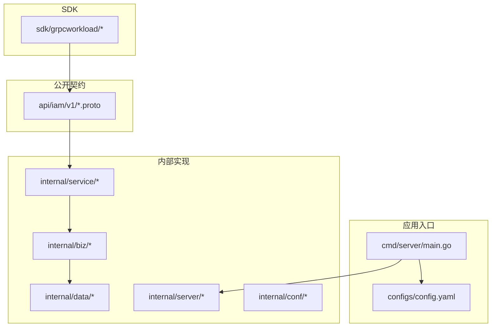
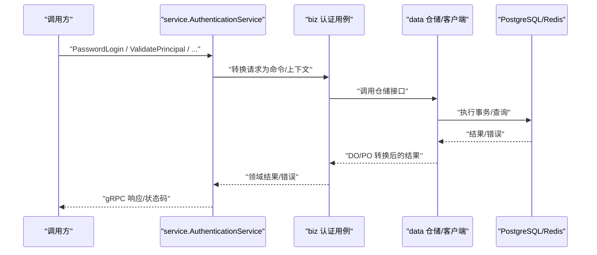
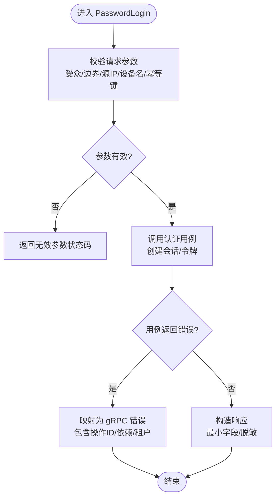
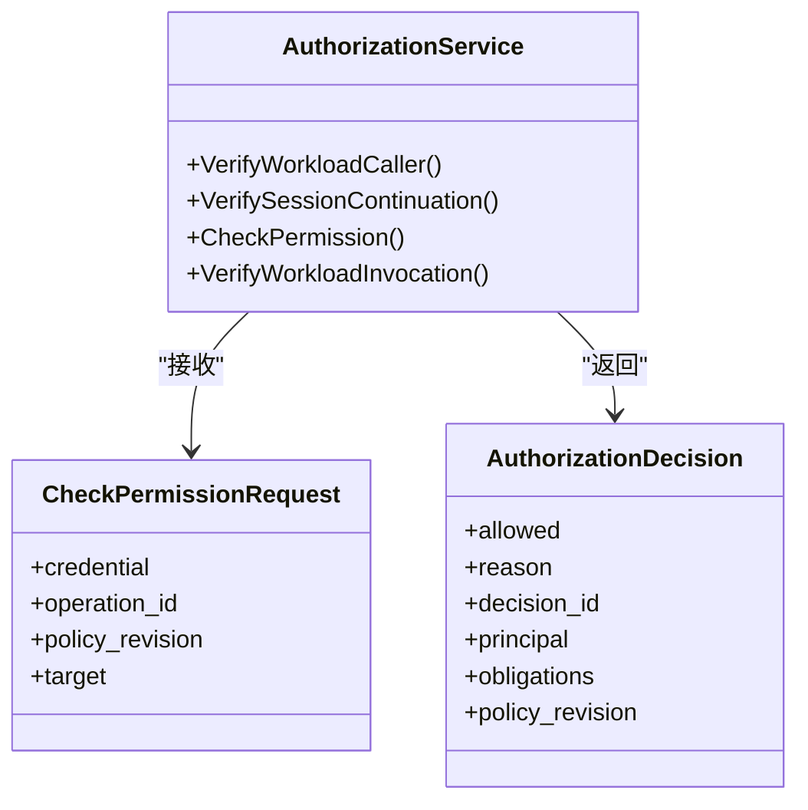
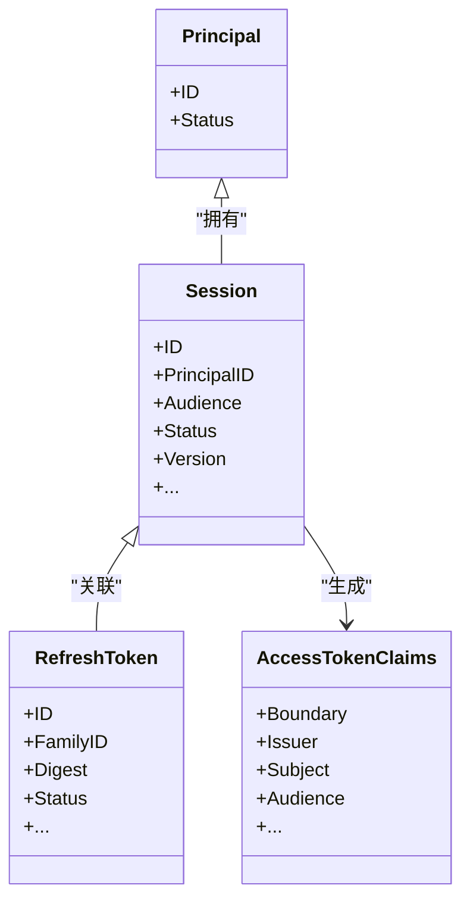
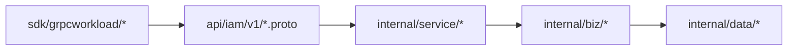

# 代码规范

<cite>
**本文引用的文件**
- [README.md](file://README.md)
- [api/README.md](file://api/README.md)
- [sdk/README.md](file://sdk/README.md)
- [AGENTS.md](file://AGENTS.md)
- [CLAUDE.md](file://CLAUDE.md)
- [api/iam/v1/authentication_service.proto](file://api/iam/v1/authentication_service.proto)
- [api/iam/v1/authorization_service.proto](file://api/iam/v1/authorization_service.proto)
- [internal/biz/biz.go](file://internal/biz/biz.go)
- [internal/service/service.go](file://internal/service/service.go)
- [internal/data/data.go](file://internal/data/data.go)
- [internal/biz/authentication.go](file://internal/biz/authentication.go)
- [internal/service/authentication.go](file://internal/service/authentication.go)
- [cmd/server/main.go](file://cmd/server/main.go)
- [configs/config.yaml](file://configs/config.yaml)
</cite>

## 目录
1. [简介](#简介)
2. [项目结构](#项目结构)
3. [核心组件](#核心组件)
4. [架构总览](#架构总览)
5. [详细组件分析](#详细组件分析)
6. [依赖关系分析](#依赖关系分析)
7. [性能与可观测性](#性能与可观测性)
8. [故障排查指南](#故障排查指南)
9. [结论](#结论)
10. [附录：检查清单与工具配置](#附录：检查清单与工具配置)

## 简介
本规范面向 ANI IAM 项目的 Go 语言工程实践，覆盖编码风格、命名约定、文件组织、gRPC API 设计、Protobuf 消息定义、分层架构（业务层/服务层/数据层）、错误处理、日志记录、配置管理、代码审查清单与自动化质量检查。目标是确保团队在跨模块协作中保持一致的代码风格、清晰的边界和可维护的实现。

## 项目结构
仓库采用清晰的分层与职责分离：
- api：对外公开的 gRPC 契约与 DTO，不包含服务端实现或存储依赖。
- cmd/server：应用入口与运行时装配，负责配置加载、日志初始化、服务启动。
- internal/conf：配置模型与校验。
- internal/server：gRPC/HTTP 服务器装配、中间件注册、健康检查等。
- internal/service：传输适配层，将 DTO 转换为领域对象并调用用例。
- internal/biz：领域模型、用例、仓储接口与领域错误。
- internal/data：仓储实现、持久化客户端、外部系统适配器。
- configs：运行期配置（不含密钥）。
- sdk：工作负载与 IAM 的 gRPC 适配器 SDK。
- migrations/sqlc：数据库迁移与查询生成。

图表来源
- [api/iam/v1/authentication_service.proto:1-33](file://api/iam/v1/authentication_service.proto#L1-L33)
- [api/iam/v1/authorization_service.proto:1-16](file://api/iam/v1/authorization_service.proto#L1-L16)
- [cmd/server/main.go:34-101](file://cmd/server/main.go#L34-L101)
- [configs/config.yaml:1-61](file://configs/config.yaml#L1-L61)
- [internal/service/authentication.go:1-30](file://internal/service/authentication.go#L1-L30)
- [internal/biz/authentication.go:1-30](file://internal/biz/authentication.go#L1-L30)
- [internal/data/data.go:1-29](file://internal/data/data.go#L1-L29)

章节来源
- [AGENTS.md:28-68](file://AGENTS.md#L28-L68)
- [CLAUDE.md:66-109](file://CLAUDE.md#L66-L109)
- [api/README.md:1-8](file://api/README.md#L1-L8)
- [sdk/README.md:1-15](file://sdk/README.md#L1-L15)

## 核心组件
- 认证与会话：提供密码登录、OIDC 登录/身份绑定、会话刷新/登出、租户切换、凭据验证与工作负载令牌签发等能力。
- 授权决策：统一的权限判定入口，返回明确允许/拒绝及义务信息。
- 领域模型与用例：封装认证、会话、成员关系、工作负载、OIDC、幂等性等核心流程。
- 数据访问：PostgreSQL、Redis、通知系统等基础设施适配，统一通过仓储接口暴露。
- 服务装配：gRPC 服务注册、TLS、可观测性、就绪探针等。

章节来源
- [api/iam/v1/authentication_service.proto:11-33](file://api/iam/v1/authentication_service.proto#L11-L33)
- [api/iam/v1/authorization_service.proto:10-16](file://api/iam/v1/authorization_service.proto#L10-L16)
- [internal/biz/authentication.go:15-29](file://internal/biz/authentication.go#L15-L29)
- [internal/service/authentication.go:22-30](file://internal/service/authentication.go#L22-L30)
- [internal/data/data.go:6-20](file://internal/data/data.go#L6-L20)

## 架构总览
IAM 遵循“服务层→业务层→数据层”的严格分层与依赖方向，DTO 仅存在于服务层边界，领域层不感知传输与存储细节。

图表来源
- [internal/service/authentication.go:108-194](file://internal/service/authentication.go#L108-L194)
- [internal/biz/authentication.go:95-188](file://internal/biz/authentication.go#L95-L188)
- [internal/data/data.go:6-20](file://internal/data/data.go#L6-L20)

章节来源
- [CLAUDE.md:79-109](file://CLAUDE.md#L79-L109)
- [AGENTS.md:41-68](file://AGENTS.md#L41-L68)

## 详细组件分析

### 认证与会话服务（Authentication）
- 职责：解析 DTO、参数校验、调用认证用例、映射领域错误到 gRPC 状态码与详细信息、构造响应。
- 关键流程：
  - 密码登录：校验受众、边界、源 IP；调用用例创建会话与令牌；返回最小必要字段。
  - OIDC 流程：开始/完成登录与身份绑定，支持浏览器证明与一次性状态。
  - 会话管理：刷新、注销、列出、撤销单条/全部会话。
  - 凭据验证与工作负载令牌：基于策略版本与操作 ID 进行在线验证。
- 错误处理：使用统一的错误映射函数，携带操作 ID、凭据类型、依赖、租户等信息，便于审计与排障。

图表来源
- [internal/service/authentication.go:150-194](file://internal/service/authentication.go#L150-L194)
- [internal/biz/authentication.go:15-29](file://internal/biz/authentication.go#L15-L29)

章节来源
- [api/iam/v1/authentication_service.proto:35-251](file://api/iam/v1/authentication_service.proto#L35-L251)
- [internal/service/authentication.go:39-106](file://internal/service/authentication.go#L39-L106)
- [internal/service/authentication.go:108-194](file://internal/service/authentication.go#L108-L194)

### 授权决策服务（Authorization）
- 职责：对一次具体操作进行 fail-closed 的权限判定，返回明确的允许/拒绝、原因、决策 ID、主体上下文与义务列表。
- 输入：原始凭据、操作 ID、策略版本、目标资源。
- 输出：单一授权决策，零值不允许。

图表来源
- [api/iam/v1/authorization_service.proto:10-39](file://api/iam/v1/authorization_service.proto#L10-L39)

章节来源
- [api/iam/v1/authorization_service.proto:10-39](file://api/iam/v1/authorization_service.proto#L10-L39)

### 领域模型与用例（biz）
- 领域对象：主体、会话、授权授予、刷新令牌族、访问边界、访问令牌声明、密码操作目的等。
- 错误体系：以领域错误为主，如账户/密码/受众/源 IP/幂等键缺失、凭据无效、主体/成员/租户状态异常、速率限制、依赖不可用等。
- 用例边界：不包含 Proto、框架、存储驱动细节；通过仓储接口与数据层交互。

图表来源
- [internal/biz/authentication.go:95-188](file://internal/biz/authentication.go#L95-L188)

章节来源
- [internal/biz/authentication.go:15-29](file://internal/biz/authentication.go#L15-L29)
- [internal/biz/authentication.go:95-188](file://internal/biz/authentication.go#L95-L188)

### 数据层（data）
- 共享客户端：连接池、出站箱保护器等长生命周期资源集中管理。
- 仓储实现：实现 biz 定义的仓储接口，负责 DO↔PO 转换、查询翻译、驱动错误映射。
- 事务边界：显式事务控制，安全审计与状态变更同事务。

章节来源
- [internal/data/data.go:6-29](file://internal/data/data.go#L6-L29)
- [CLAUDE.md:138-153](file://CLAUDE.md#L138-L153)

### 服务装配与启动（cmd/server）
- 启动流程：解析命令行参数、加载配置（文件与环境变量）、初始化日志（JSON 格式、过滤敏感字段）、设置 CPU 配额、构建应用并运行。
- 子命令：快照、代理器、安装器、首管理员与工作负载预置等运维命令。

章节来源
- [cmd/server/main.go:22-101](file://cmd/server/main.go#L22-L101)
- [cmd/server/main.go:104-131](file://cmd/server/main.go#L104-L131)

## 依赖关系分析
- 依赖方向：service → biz → data；service 可引用 api DTO；biz 仅引用错误枚举；data 实现 biz 接口。
- 生成文件：*.pb.go、*_grpc.pb.go 由 buf/protoc 生成，禁止手工编辑。
- SDK 与 API：SDK 依赖公开 API，不导入 IAM internal 包；调用方通过 SDK 建立 mTLS 与拦截器，保证每次调用的精确绑定与在线验证。

图表来源
- [api/README.md:1-8](file://api/README.md#L1-L8)
- [sdk/README.md:1-15](file://sdk/README.md#L1-L15)
- [CLAUDE.md:79-109](file://CLAUDE.md#L79-L109)

章节来源
- [AGENTS.md:41-68](file://AGENTS.md#L41-L68)
- [CLAUDE.md:79-109](file://CLAUDE.md#L79-L109)

## 性能与可观测性
- 日志：JSON 格式，过滤敏感字段（凭证、DSN、私钥、令牌等），附加服务标识与追踪属性。
- 超时与重试：工作负载子调用默认短超时并继承父截止时间；避免对写操作的自动重试。
- 指标与追踪：通过 OpenTelemetry 集成，日志提取追踪属性，便于端到端追踪。
- 配置：运行时配置集中管理，密钥通过挂载文件或环境变量注入，不在配置文件中硬编码。

章节来源
- [cmd/server/main.go:72-101](file://cmd/server/main.go#L72-L101)
- [cmd/server/main.go:104-131](file://cmd/server/main.go#L104-L131)
- [configs/config.yaml:1-61](file://configs/config.yaml#L1-L61)
- [sdk/README.md:17-33](file://sdk/README.md#L17-L33)

## 故障排查指南
- 常见错误分类：
  - 参数校验失败：返回无效参数状态码，附带字段与原因。
  - 依赖不可用：返回未可用状态码，附带依赖名称。
  - 领域错误：如凭据无效、主体/成员/租户状态异常、速率限制等，映射为稳定 gRPC 状态码与错误信息。
- 排障要点：
  - 检查操作 ID、相关 ID、租户 ID、策略版本是否传入。
  - 核对源 IP、受众、边界是否正确。
  - 查看日志中的敏感字段过滤是否影响定位。
  - 确认依赖（OIDC、PostgreSQL、Redis、通知系统）可用性。

章节来源
- [internal/service/authentication.go:39-84](file://internal/service/authentication.go#L39-L84)
- [internal/service/authentication.go:108-194](file://internal/service/authentication.go#L108-L194)
- [internal/biz/authentication.go:15-29](file://internal/biz/authentication.go#L15-L29)

## 结论
本规范通过严格的分层、清晰的 DTO/DO/PO 边界、稳定的 gRPC 契约与 SDK 适配，确保 IAM 的可维护性与一致性。配合统一的错误处理、日志与配置管理，以及自动化生成与质量检查，可有效提升团队协作效率与交付质量。

## 附录：检查清单与工具配置

### 代码规范与命名约定
- 资源命名：资源名使用名词复数用于集合 RPC（例如 ListResources）。
- 类型命名：仓储接口命名为 ResourceRepo，用例命名为 ResourceUsecase，服务命名为 ResourceService。
- 错误命名：在 api 中定义错误原因枚举，在 biz 中以 Err<Resource><Cause> 形式暴露。
- 生成文件：*.pb.go、*_grpc.pb.go、wire_gen.go 由工具生成，禁止手工编辑。

章节来源
- [AGENTS.md:148-157](file://AGENTS.md#L148-L157)
- [CLAUDE.md:186-195](file://CLAUDE.md#L186-L195)

### gRPC API 设计规范
- 契约优先：所有对外接口在 api/<domain>/<version> 中定义，生成客户端与 DTO。
- 失败关闭：授权决策零值不允许，必须显式允许。
- 最小字段：响应仅包含必要字段，避免泄露敏感信息。
- 幂等性：写操作支持幂等键，重复提交不产生副作用。

章节来源
- [api/README.md:1-8](file://api/README.md#L1-L8)
- [api/iam/v1/authorization_service.proto:18-39](file://api/iam/v1/authorization_service.proto#L18-L39)
- [api/iam/v1/authentication_service.proto:35-251](file://api/iam/v1/authentication_service.proto#L35-L251)

### Protobuf 消息定义标准
- 包与选项：指定 go_package，保持导入路径稳定。
- 时间类型：使用 google.protobuf.Timestamp。
- 审计与上下文：包含 operation_id、policy_revision、principal 上下文等。
- 约束与保留：对废弃字段使用 reserved，避免向后兼容问题。

章节来源
- [api/iam/v1/authentication_service.proto:1-10](file://api/iam/v1/authentication_service.proto#L1-L10)
- [api/iam/v1/authentication_service.proto:237-251](file://api/iam/v1/authentication_service.proto#L237-L251)

### 分层与接口设计模式
- service：仅做 DTO↔DO 转换与输入校验，不执行业务规则与存储访问。
- biz：拥有 DO、用例与仓储接口，定义领域错误与查询选项。
- data：实现仓储接口，负责 DO↔PO 转换、查询翻译与驱动错误映射。
- server：只负责服务器装配、中间件与服务注册。

章节来源
- [AGENTS.md:73-120](file://AGENTS.md#L73-L120)
- [CLAUDE.md:111-158](file://CLAUDE.md#L111-L158)

### 错误处理规范
- 统一映射：service 层将 biz 错误映射为 gRPC status/ErrorInfo，携带操作 ID、依赖、租户等上下文。
- 领域错误：biz 层定义明确的错误常量与自定义错误类型（如速率限制）。
- 审计：关键操作记录审计事件与决策 ID。

章节来源
- [internal/service/authentication.go:108-194](file://internal/service/authentication.go#L108-L194)
- [internal/biz/authentication.go:15-42](file://internal/biz/authentication.go#L15-L42)

### 日志记录规范
- JSON 格式：结构化日志便于采集与分析。
- 敏感字段过滤：凭证、DSN、私钥、令牌等关键字段被过滤。
- 追踪集成：日志提取追踪属性，便于链路追踪。

章节来源
- [cmd/server/main.go:104-131](file://cmd/server/main.go#L104-L131)

### 配置管理规范
- 配置文件：configs/config.yaml 存放非敏感配置。
- 密钥注入：证书、私钥、客户端密钥等通过挂载文件或环境变量注入。
- 运行时参数：网络地址、超时、命名空间、策略版本等集中管理。

章节来源
- [configs/config.yaml:1-61](file://configs/config.yaml#L1-L61)
- [cmd/server/main.go:82-95](file://cmd/server/main.go#L82-L95)

### 代码审查检查清单
- 分层合规：service 不直接访问 data；biz 不依赖传输与存储；data 不引入 DTO。
- 契约稳定：新增/修改接口需更新 proto 并重新生成，保持向后兼容。
- 错误处理：所有错误均映射为稳定状态码与错误信息，包含必要上下文。
- 日志与审计：关键路径记录审计事件与决策 ID，敏感字段已过滤。
- 测试覆盖：单元测试隔离各层，集成测试覆盖关键业务流程。
- 生成文件：*.pb.go 等生成文件与源文件同提交，未手工编辑。

章节来源
- [AGENTS.md:121-146](file://AGENTS.md#L121-L146)
- [CLAUDE.md:175-184](file://CLAUDE.md#L175-L184)

### 自动化代码质量检查工具配置建议
- 生成工具：使用固定版本的 buf/protoc-gen-go/protoc-gen-go-grpc 生成 API 与 gRPC 存根。
- 代码格式化与静态检查：启用 gofmt、go vet、静态分析工具（如 staticcheck）。
- 依赖锁定：通过 go.mod/go.sum 锁定依赖版本，避免动态跟随主分支。
- CI 流水线：在 PR 阶段执行生成、格式化、静态检查、单元测试与集成测试。

章节来源
- [api/README.md:5-8](file://api/README.md#L5-L8)
- [sdk/README.md:1-15](file://sdk/README.md#L1-L15)
- [AGENTS.md:143-146](file://AGENTS.md#L143-L146)