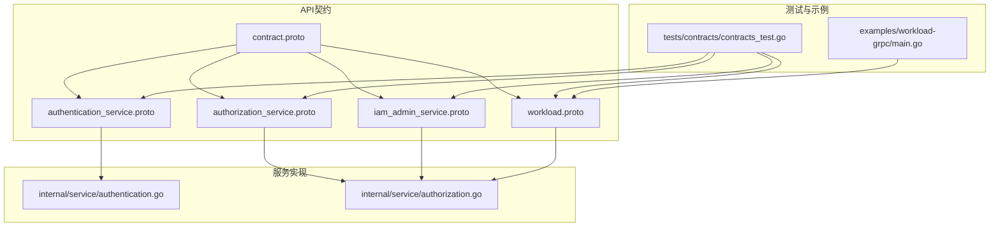
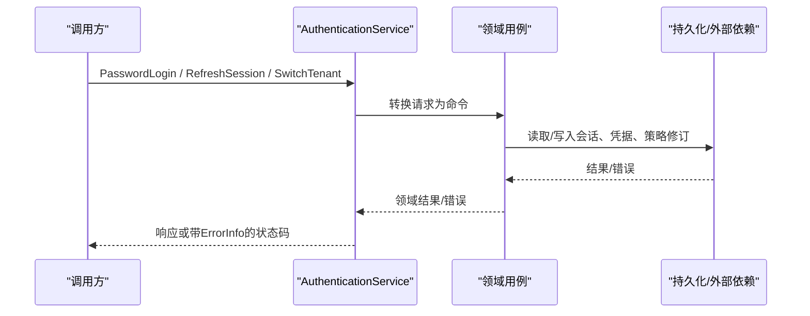
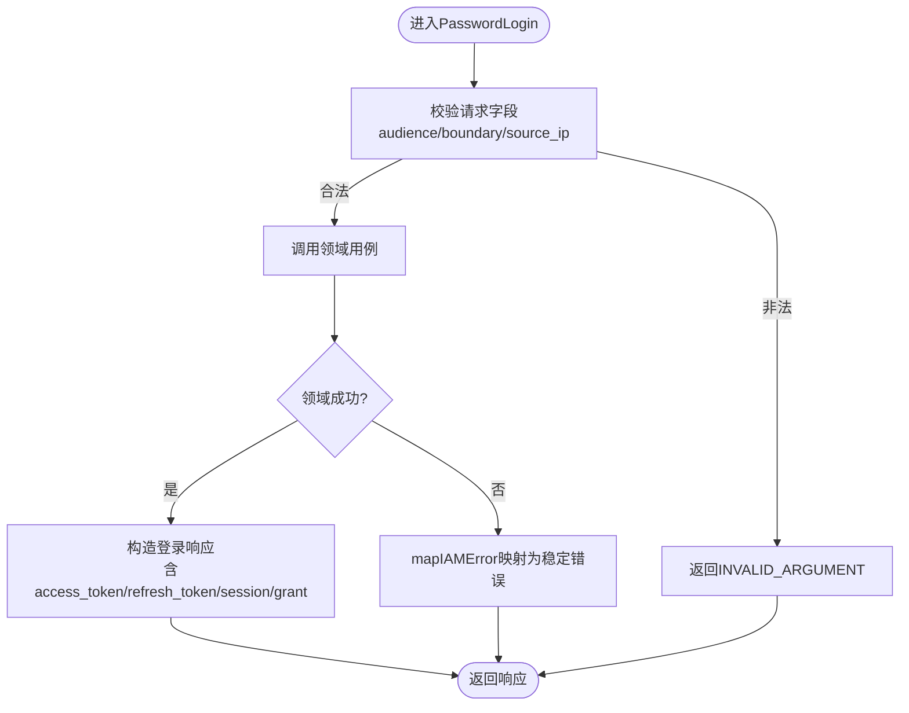
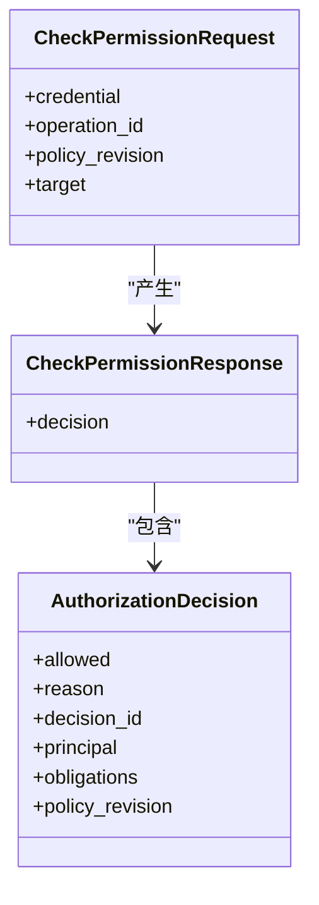
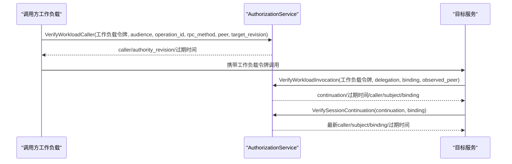
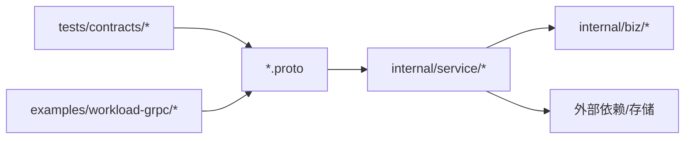

# API设计规范

<cite>
**本文引用的文件**
- [api/iam/v1/authentication_service.proto](file://api/iam/v1/authentication_service.proto)
- [api/iam/v1/authorization_service.proto](file://api/iam/v1/authorization_service.proto)
- [api/iam/v1/iam_admin_service.proto](file://api/iam/v1/iam_admin_service.proto)
- [api/iam/v1/workload.proto](file://api/iam/v1/workload.proto)
- [api/iam/v1/contract.proto](file://api/iam/v1/contract.proto)
- [api/README.md](file://api/README.md)
- [api/iam/v1/buf.yaml](file://api/iam/v1/buf.yaml)
- [tests/contracts/contracts_test.go](file://tests/contracts/contracts_test.go)
- [examples/workload-grpc/main.go](file://examples/workload-grpc/main.go)
- [internal/service/authentication.go](file://internal/service/authentication.go)
- [internal/service/authorization.go](file://internal/service/authorization.go)
</cite>

## 目录
1. [简介](#简介)
2. [项目结构](#项目结构)
3. [核心组件](#核心组件)
4. [架构总览](#架构总览)
5. [详细组件分析](#详细组件分析)
6. [依赖关系分析](#依赖关系分析)
7. [性能与可观测性](#性能与可观测性)
8. [故障排查指南](#故障排查指南)
9. [结论](#结论)
10. [附录：模板与示例路径](#附录模板与示例路径)

## 简介
本规范面向IAM系统的gRPC接口设计，覆盖服务契约、消息定义、版本管理、错误处理、向后兼容策略、Protobuf组织与命名约定、文档生成、测试与契约测试实践。目标是确保API的一致性与可维护性，并指导团队在v1主版本下安全演进。

## 项目结构
- API契约位于 api/iam/v1，使用Buf进行lint与breaking检查，仅包含DTO与生成的客户端，不包含服务端实现或存储依赖。
- 服务实现位于 internal/service，将proto请求映射到领域用例，统一错误映射为带ErrorInfo的gRPC状态。
- 工作负载调用契约通过workload.proto定义，区分直接调用者与委托主体，强调按请求绑定的在线校验。
- 契约测试位于 tests/contracts，锁定描述符、错误枚举、JSON夹具与工具链版本，保证跨模块契约稳定。

图表来源
- [api/iam/v1/authentication_service.proto:1-33](file://api/iam/v1/authentication_service.proto#L1-L33)
- [api/iam/v1/authorization_service.proto:1-16](file://api/iam/v1/authorization_service.proto#L1-L16)
- [api/iam/v1/iam_admin_service.proto:1-73](file://api/iam/v1/iam_admin_service.proto#L1-L73)
- [api/iam/v1/workload.proto:1-121](file://api/iam/v1/workload.proto#L1-L121)
- [api/iam/v1/contract.proto:1-212](file://api/iam/v1/contract.proto#L1-L212)
- [internal/service/authentication.go:1-200](file://internal/service/authentication.go#L1-L200)
- [internal/service/authorization.go:1-141](file://internal/service/authorization.go#L1-L141)
- [tests/contracts/contracts_test.go:163-203](file://tests/contracts/contracts_test.go#L163-L203)
- [examples/workload-grpc/main.go:60-100](file://examples/workload-grpc/main.go#L60-L100)

章节来源
- [api/README.md:1-8](file://api/README.md#L1-L8)
- [api/iam/v1/buf.yaml:1-17](file://api/iam/v1/buf.yaml#L1-L17)

## 核心组件
- AuthenticationService：负责人类与会话生命周期（密码登录、OIDC、刷新、登出、会话列表与撤销、租户切换、验证主体、发放工作负载令牌与委托）。
- AuthorizationService：单一失败关闭的授权决策入口，提供权限检查与工作负载调用/会话延续校验。
- IAMAdminService：平台与租户管理面操作（成员、角色、邀请、审计事件、恢复流程等），不变更核心租户生命周期。
- Workload契约：InvocationBinding、DirectWorkloadCaller、VerifyWorkloadCaller/Invocation/SessionContinuation、IssueDelegation等，用于工作负载间的安全调用链。
- Contract共享类型：Audience、PrincipalType/Status、AuthnMethod、Boundary、BearerCredential、PrincipalContext、CursorPageRequest、MutationResult、AuthorizationTarget/Obligation、IAMErrorDetails等。

章节来源
- [api/iam/v1/authentication_service.proto:11-33](file://api/iam/v1/authentication_service.proto#L11-L33)
- [api/iam/v1/authorization_service.proto:10-16](file://api/iam/v1/authorization_service.proto#L10-L16)
- [api/iam/v1/iam_admin_service.proto:10-73](file://api/iam/v1/iam_admin_service.proto#L10-L73)
- [api/iam/v1/workload.proto:10-121](file://api/iam/v1/workload.proto#L10-L121)
- [api/iam/v1/contract.proto:13-212](file://api/iam/v1/contract.proto#L13-L212)

## 架构总览
- 所有对外gRPC服务均基于proto3定义，包名 iam.v1，Go导入路径固定。
- 认证与服务鉴权分离：AuthenticationService专注身份与会话；AuthorizationService集中做权限判定。
- 工作负载调用采用“按请求绑定”的在线校验模式，接收方上报TLS对端与业务请求摘要，由IAM返回短期continuation供后续续期检查。
- 错误统一通过google.rpc.ErrorInfo承载稳定reason与domain，配合IAMErrorReason枚举。

图表来源
- [internal/service/authentication.go:150-194](file://internal/service/authentication.go#L150-L194)
- [internal/service/authentication.go:108-138](file://internal/service/authentication.go#L108-L138)
- [api/iam/v1/authentication_service.proto:35-186](file://api/iam/v1/authentication_service.proto#L35-L186)

## 详细组件分析

### 认证服务（AuthenticationService）
- 职责：人类与会话全生命周期、OIDC流程、密码动作、工作负载令牌与委托发放、主体验证。
- 关键消息：PasswordLogin*、Begin/CompleteOIDC*、Request/CompletePasswordAction、Refresh/Logout/Switch/List/Revoke*、ValidatePrincipal、IssueWorkloadToken/IssueDelegation。
- 错误处理：参数校验失败返回INVALID_ARGUMENT；依赖不可用返回UNAVAILABLE并附带ErrorInfo；业务错误通过mapIAMError映射为稳定reason。
- 幂等性：多数写操作携带idempotency_key，避免重复提交。

图表来源
- [internal/service/authentication.go:150-194](file://internal/service/authentication.go#L150-L194)
- [api/iam/v1/authentication_service.proto:35-59](file://api/iam/v1/authentication_service.proto#L35-L59)

章节来源
- [api/iam/v1/authentication_service.proto:11-33](file://api/iam/v1/authentication_service.proto#L11-L33)
- [internal/service/authentication.go:1-200](file://internal/service/authentication.go#L1-L200)

### 授权服务（AuthorizationService）
- 职责：统一的权限决策点，支持CheckPermission、VerifyWorkloadCaller、VerifyWorkloadInvocation、VerifySessionContinuation。
- 关键消息：CheckPermissionRequest/Response、AuthorizationDecision、工作负载调用相关消息。
- 决策输出：明确允许/拒绝，附带decision_id、obligations、policy_revision与principal上下文。

图表来源
- [api/iam/v1/authorization_service.proto:18-39](file://api/iam/v1/authorization_service.proto#L18-L39)

章节来源
- [api/iam/v1/authorization_service.proto:10-39](file://api/iam/v1/authorization_service.proto#L10-L39)
- [internal/service/authorization.go:27-67](file://internal/service/authorization.go#L27-L67)

### 管理面服务（IAMAdminService）
- 职责：平台与租户成员、角色、邀请、审计事件、恢复流程等管理操作。
- 关键模型：Membership、Role、Invitation、TenantWorkload、APIKey、AuditEvent、RecoveryOperation等。
- 分页与游标：广泛使用CursorPageRequest与next_cursor。

章节来源
- [api/iam/v1/iam_admin_service.proto:10-73](file://api/iam/v1/iam_admin_service.proto#L10-L73)
- [api/iam/v1/iam_admin_service.proto:75-800](file://api/iam/v1/iam_admin_service.proto#L75-L800)

### 工作负载调用契约（workload.proto）
- InvocationBinding：规范化业务请求绑定，包含audience、operation_id、rpc_method、source_operation_id、tenant_id、subject_id、resource_id、mode、request_sha256、policy_revision、target_revision。
- DirectWorkloadCaller：当前一跳的调用者身份与权威版本。
- VerifyWorkloadCaller/Invocation/SessionContinuation：分别用于调用者校验、完整调用校验与会话延续校验。
- IssueDelegation：为本次请求重新授权真实主体，返回短期不可续期的委托。

图表来源
- [api/iam/v1/workload.proto:10-121](file://api/iam/v1/workload.proto#L10-L121)
- [examples/workload-grpc/main.go:60-100](file://examples/workload-grpc/main.go#L60-L100)

章节来源
- [api/iam/v1/workload.proto:10-121](file://api/iam/v1/workload.proto#L10-L121)
- [examples/workload-grpc/main.go:60-100](file://examples/workload-grpc/main.go#L60-L100)

### 共享契约与错误模型（contract.proto）
- 枚举：Audience、PrincipalType/Status、AuthnMethod、SessionStatus、GrantStatus、TenantAccessStatus、MembershipStatus、InvitationStatus、APIKeyStatus、AuthorizationObligationType、IAMErrorReason。
- 边界与凭据：TenantBoundary、PlatformBoundary、Boundary、BearerCredential。
- 上下文与分页：PrincipalContext、SessionSummary、SessionGrantSummary、CursorPageRequest。
- 授权目标与义务：AuthorizationTarget、AuthorizationObligation。
- 错误详情：IAMErrorDetails封装google.rpc.ErrorInfo。

章节来源
- [api/iam/v1/contract.proto:13-212](file://api/iam/v1/contract.proto#L13-L212)

## 依赖关系分析
- API层仅依赖googleapis与自身contract.proto，不含业务实现与存储依赖。
- 服务实现依赖领域用例与外部依赖（如OIDC、数据库），并通过统一错误映射暴露稳定错误。
- 测试层通过descriptor与fixtures严格约束服务清单、消息字段、错误枚举与工具链版本。

图表来源
- [api/iam/v1/buf.yaml:1-17](file://api/iam/v1/buf.yaml#L1-L17)
- [tests/contracts/contracts_test.go:163-203](file://tests/contracts/contracts_test.go#L163-L203)
- [examples/workload-grpc/main.go:1-28](file://examples/workload-grpc/main.go#L1-L28)

章节来源
- [tests/contracts/contracts_test.go:163-203](file://tests/contracts/contracts_test.go#L163-L203)
- [api/README.md:1-8](file://api/README.md#L1-L8)

## 性能与可观测性
- 短生命周期的令牌与委托：工作负载令牌最长五分钟，委托最多六十秒，减少长期凭证风险。
- 游标分页：List系列接口使用CursorPageRequest与next_cursor，避免大页传输。
- 审计与追踪：PrincipalContext、AuditEvent、决策ID、请求/关联ID贯穿认证与授权链路，便于排障与审计。
- 速率限制与限流：登录与敏感操作通过源IP与idempotency_key控制滥用。

[本节为通用指导，不直接分析具体文件]

## 故障排查指南
- 常见错误映射：
  - INVALID_ARGUMENT：请求字段缺失或格式错误（如source_ip、boundary）。
  - UNAUTHENTICATED/PERMISSION_DENIED：凭据无效或权限不足。
  - UNAVAILABLE/IAM_TIMEOUT：依赖不可用或超时。
  - IDEMPOTENCY_*：幂等键冲突或过期。
  - VERSION_CONFLICT/GRANT_VERSION_MISMATCH：并发更新或授权版本不一致。
- 定位要点：
  - 检查ErrorInfo中的reason、domain与metadata是否匹配契约。
  - 核对policy_revision是否与调用方一致，避免策略漂移。
  - 检查工作负载调用binding中request_sha256与target_revision是否一致。
- 参考实现：
  - 服务层统一通过newIAMStatus/mapIAMError构造错误，并在测试中校验错误契约。

章节来源
- [internal/service/authentication.go:108-138](file://internal/service/authentication.go#L108-L138)
- [internal/service/authorization.go:27-67](file://internal/service/authorization.go#L27-L67)
- [tests/contracts/contracts_test.go:284-357](file://tests/contracts/contracts_test.go#L284-L357)

## 结论
本规范以v1为主版本契约，通过严格的proto组织、稳定的错误模型、按请求绑定的工作负载调用机制与完善的契约测试，确保API的可维护性与一致性。建议在新增字段时遵循向后兼容策略，优先使用可选字段与保留编号，避免破坏现有消费者。

[本节为总结性内容，不直接分析具体文件]

## 附录：模板与示例路径
- Protobuf组织与命名
  - 包名：iam.v1
  - 服务命名：名词+Service（如AuthenticationService、AuthorizationService、IAMAdminService）
  - 方法命名：动词+资源（如PasswordLogin、CheckPermission、CreateTenantRole）
  - 消息命名：语义清晰的名词（如PasswordLoginRequest、AuthorizationDecision）
  - 共享类型集中在contract.proto，避免重复定义
- 请求/响应模板
  - 认证类：PasswordLoginRequest/Response、Begin/CompleteOIDCLogin*、Request/CompletePasswordAction*、Refresh/Logout/Switch/List/Revoke*、ValidatePrincipal、IssueWorkloadToken/IssueDelegation
  - 授权类：CheckPermissionRequest/Response、AuthorizationDecision
  - 管理面：各CRUD与列表接口，统一使用CursorPageRequest与next_cursor
  - 工作负载：InvocationBinding、DirectWorkloadCaller、VerifyWorkloadCaller/Invocation/SessionContinuation、IssueDelegation
- 枚举与嵌套结构
  - 枚举：Audience、PrincipalType/Status、AuthnMethod、SessionStatus、GrantStatus、TenantAccessStatus、MembershipStatus、InvitationStatus、APIKeyStatus、AuthorizationObligationType、IAMErrorReason
  - 嵌套：Boundary(oneof)、AuditBoundary(oneof)、SessionSummary.grants、AuthorizationDecision.obligations
- 错误处理模式
  - 使用google.rpc.ErrorInfo与IAMErrorReason
  - 服务层统一映射错误，保持reason与domain稳定
- 文档生成与代码生成
  - 使用Buf进行lint与breaking检查，protoc-gen-go与protoc-gen-go-grpc生成Go客户端与服务桩
  - 不要手动编辑生成的Go文件
- 测试与契约测试
  - 使用tests/contracts下的描述符与fixtures校验服务清单、消息字段、错误枚举与工具链版本
  - 示例工作负载调用见examples/workload-grpc/main.go

章节来源
- [api/iam/v1/authentication_service.proto:11-33](file://api/iam/v1/authentication_service.proto#L11-L33)
- [api/iam/v1/authorization_service.proto:10-39](file://api/iam/v1/authorization_service.proto#L10-L39)
- [api/iam/v1/iam_admin_service.proto:10-73](file://api/iam/v1/iam_admin_service.proto#L10-L73)
- [api/iam/v1/workload.proto:10-121](file://api/iam/v1/workload.proto#L10-L121)
- [api/iam/v1/contract.proto:13-212](file://api/iam/v1/contract.proto#L13-L212)
- [api/iam/v1/buf.yaml:1-17](file://api/iam/v1/buf.yaml#L1-L17)
- [tests/contracts/contracts_test.go:163-203](file://tests/contracts/contracts_test.go#L163-L203)
- [examples/workload-grpc/main.go:60-100](file://examples/workload-grpc/main.go#L60-L100)