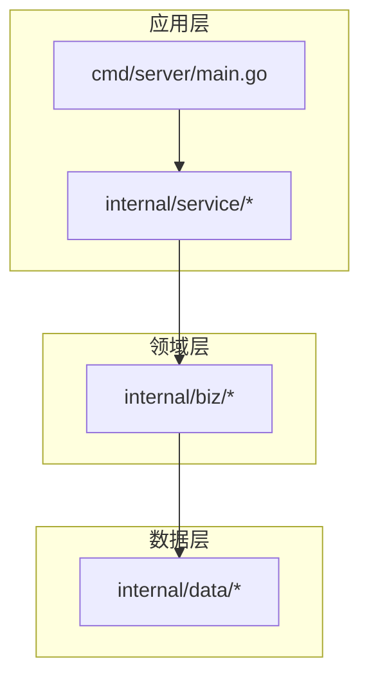
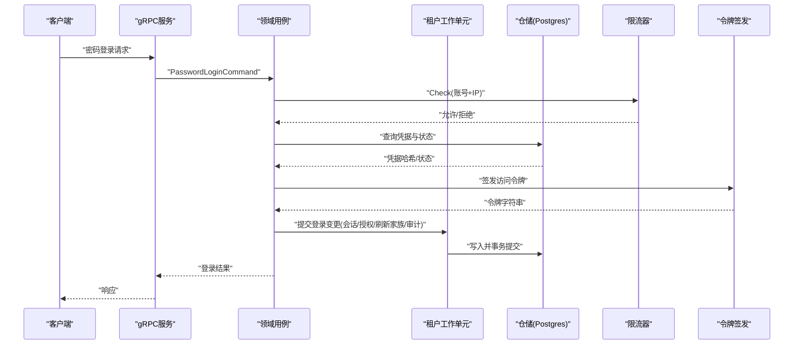
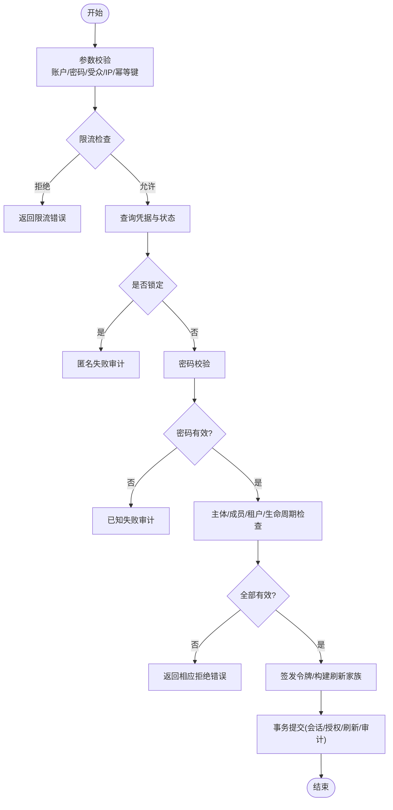
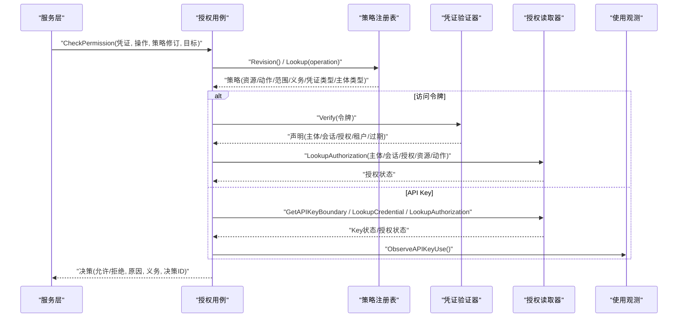
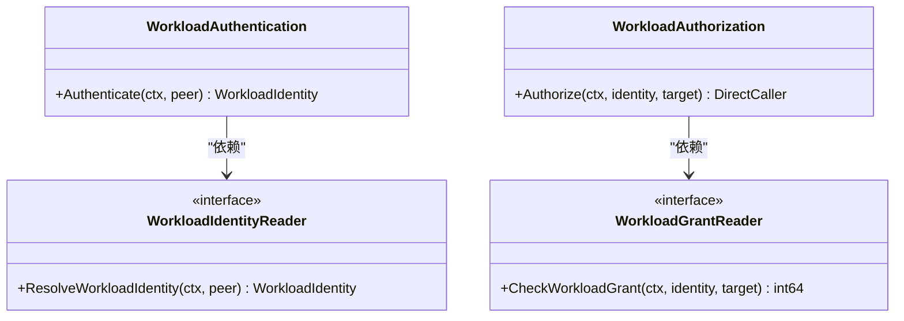
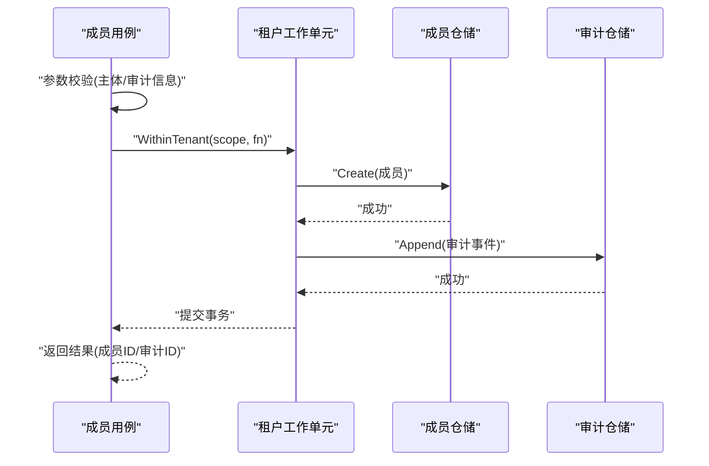
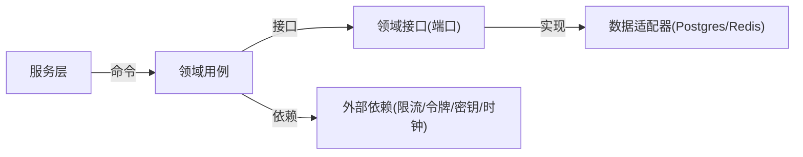

# 业务逻辑实现

<cite>
**本文引用的文件**
- [internal/biz/biz.go](file://internal/biz/biz.go)
- [internal/biz/authentication.go](file://internal/biz/authentication.go)
- [internal/biz/authorization.go](file://internal/biz/authorization.go)
- [internal/biz/workload.go](file://internal/biz/workload.go)
- [internal/biz/session.go](file://internal/biz/session.go)
- [internal/biz/membership.go](file://internal/biz/membership.go)
- [internal/biz/tenant_scope.go](file://internal/biz/tenant_scope.go)
- [internal/data/data.go](file://internal/data/data.go)
- [internal/data/postgres.go](file://internal/data/postgres.go)
- [internal/service/authentication.go](file://internal/service/authentication.go)
- [cmd/server/main.go](file://cmd/server/main.go)
</cite>

## 目录
1. [简介](#简介)
2. [项目结构](#项目结构)
3. [核心组件](#核心组件)
4. [架构总览](#架构总览)
5. [详细组件分析](#详细组件分析)
6. [依赖关系分析](#依赖关系分析)
7. [性能考虑](#性能考虑)
8. [故障排查指南](#故障排查指南)
9. [结论](#结论)
10. [附录](#附录)

## 简介
本指南面向IAM系统的业务层实现，聚焦领域驱动设计（DDD）在认证、授权、会话与租户边界中的落地方式。内容涵盖聚合根、值对象、领域服务的使用模式；健壮的业务用例编写方法（事务管理、错误处理、并发控制）；测试策略与模拟对象使用；业务规则验证、状态管理与事件处理；以及业务层与数据层的解耦设计与依赖注入模式，确保可测试性与可维护性。

## 项目结构
系统采用分层与领域驱动相结合的组织方式：
- cmd/server：应用启动与配置装配入口
- internal/service：传输适配层（gRPC），将请求映射为领域用例命令
- internal/biz：领域层，包含用例、聚合、值对象、领域接口（端口）
- internal/data：基础设施适配层，实现领域接口（如PostgreSQL、Redis等）
- api：协议定义（gRPC/Protobuf）
- tests：集成与单元测试



**图示来源**
- [cmd/server/main.go:34-101](file://cmd/server/main.go#L34-L101)
- [internal/service/authentication.go:91-106](file://internal/service/authentication.go#L91-L106)
- [internal/biz/biz.go:1-4](file://internal/biz/biz.go#L1-L4)
- [internal/data/data.go:1-29](file://internal/data/data.go#L1-L29)

**章节来源**
- [cmd/server/main.go:34-101](file://cmd/server/main.go#L34-L101)
- [internal/biz/biz.go:1-4](file://internal/biz/biz.go#L1-L4)

## 核心组件
- 领域用例
  - 认证用例：密码登录、刷新会话、登出、切换租户、密码操作
  - 授权用例：基于访问令牌或API Key的权限检查
  - 工作负载用例：工作负载身份解析与直连调用授权
  - 成员关系用例：租户成员创建与审计
- 值对象与聚合
  - TenantScope：强制的租户边界值对象，所有租户级操作必须携带
  - Principal、Session、Grant、RefreshTokenFamily、RefreshToken、AccessTokenClaims 等值对象
  - SecurityAuditEvent：不可变的安全审计事件，作为领域事件持久化
- 领域接口（端口）
  - AuthenticationReader、LoginThrottle、AuthenticationUnitOfWork、AccessTokenIssuer、SecretGenerator、IDGenerator、Clock 等
  - AuthorizationPolicyRegistry、AccessCredentialVerifier、AuthorizationReader、APIKeyUsageObserver
  - WorkloadIdentityReader、WorkloadGrantReader
- 数据适配器
  - postgresUnitOfWork：封装租户级事务，提供TenantTransaction以访问Membership与Audit仓储
  - Data：基础设施客户端容器（连接池、Outbox保护器等）

**章节来源**
- [internal/biz/authentication.go:257-339](file://internal/biz/authentication.go#L257-L339)
- [internal/biz/authorization.go:92-223](file://internal/biz/authorization.go#L92-L223)
- [internal/biz/workload.go:48-106](file://internal/biz/workload.go#L48-L106)
- [internal/biz/membership.go:75-130](file://internal/biz/membership.go#L75-L130)
- [internal/biz/tenant_scope.go:9-39](file://internal/biz/tenant_scope.go#L9-L39)
- [internal/data/postgres.go:18-73](file://internal/data/postgres.go#L18-L73)
- [internal/data/data.go:6-29](file://internal/data/data.go#L6-L29)

## 架构总览
分层职责清晰：service负责协议映射与错误转换，biz承载领域规则与用例编排，data实现存储与外部依赖。通过接口隔离，业务层不感知具体数据库或缓存实现，便于替换与测试。



**图示来源**
- [internal/service/authentication.go:150-194](file://internal/service/authentication.go#L150-L194)
- [internal/biz/authentication.go:341-529](file://internal/biz/authentication.go#L341-L529)
- [internal/data/postgres.go:27-59](file://internal/data/postgres.go#L27-L59)

## 详细组件分析

### 认证用例（密码登录与会话生命周期）
- 输入校验与防重放
  - 账户、密码、受众、源IP、幂等键必填；空值直接返回领域错误
  - 使用幂等键避免重复提交导致多会话
- 限流与失败记录
  - 登录前进行速率限制检查；失败时记录失败次数并可能锁定
  - 未知账户也进行“未知密码”验证，防止枚举攻击
- 状态与生命周期检查
  - 主体、成员、租户访问、生命周期状态均须有效且新鲜
- 会话与授权建立
  - 生成会话、授权、刷新令牌家族与令牌；计算访问/空闲/绝对过期时间
  - 统一审计事件随事务原子持久化
- 刷新与会话续期
  - 支持刷新令牌轮换、重用检测、会话登出、租户切换
  - 严格校验刷新令牌关系、会话状态、租户边界与审计



**图示来源**
- [internal/biz/authentication.go:341-529](file://internal/biz/authentication.go#L341-L529)
- [internal/biz/session.go:154-286](file://internal/biz/session.go#L154-L286)

**章节来源**
- [internal/biz/authentication.go:341-529](file://internal/biz/authentication.go#L341-L529)
- [internal/biz/session.go:154-286](file://internal/biz/session.go#L154-L286)

### 授权用例（访问令牌与API Key）
- 策略注册与版本一致性
  - 要求策略修订号一致，否则拒绝
  - 根据操作ID查找策略，未注册则拒绝
- 凭证类型与主体类型约束
  - 按策略允许的凭证类型（访问令牌/API Key/工作负载令牌）与主体类型（人类/工作负载）进行过滤
- 访问令牌路径
  - 解析令牌声明，校验主体、会话、授权、过期时间
  - 构造可信主体上下文，校验租户匹配
  - 查询授权状态，依据状态决定允许或拒绝，并记录审计
- API Key路径
  - 解析Key ID，获取边界与凭据，校验状态与有效期
  - 查询授权状态，统计使用观测，输出决策与义务
- 拒绝与审计
  - 所有拒绝路径均产生审计事件，区分已绑定与未绑定场景



**图示来源**
- [internal/biz/authorization.go:225-329](file://internal/biz/authorization.go#L225-L329)
- [internal/biz/authorization.go:331-420](file://internal/biz/authorization.go#L331-L420)
- [internal/service/authentication.go:108-138](file://internal/service/authentication.go#L108-L138)

**章节来源**
- [internal/biz/authorization.go:225-329](file://internal/biz/authorization.go#L225-L329)
- [internal/biz/authorization.go:331-420](file://internal/biz/authorization.go#L331-L420)
- [internal/service/authentication.go:108-138](file://internal/service/authentication.go#L108-L138)

### 工作负载身份与直连调用
- 身份解析
  - 校验环境、信任域、身份类型与值，解析为工作负载身份
- 授权检查
  - 检查工作负载注册与启用，校验授予版本
  - 产出DirectCaller用于后续鉴权与审计



**图示来源**
- [internal/biz/workload.go:56-106](file://internal/biz/workload.go#L56-L106)

**章节来源**
- [internal/biz/workload.go:56-106](file://internal/biz/workload.go#L56-L106)

### 成员关系与审计事件
- 成员创建
  - 在租户事务内创建成员并追加安全审计事件，保证原子性
- 审计事件模型
  - 固定字段集合，不包含敏感载荷，附带请求/关联/决策ID与时间戳



**图示来源**
- [internal/biz/membership.go:165-240](file://internal/biz/membership.go#L165-L240)
- [internal/data/postgres.go:27-73](file://internal/data/postgres.go#L27-L73)

**章节来源**
- [internal/biz/membership.go:165-240](file://internal/biz/membership.go#L165-L240)
- [internal/data/postgres.go:27-73](file://internal/data/postgres.go#L27-L73)

### 值对象与聚合根
- 值对象
  - TenantScope：强制租户边界，禁止提升为聚合根，仅用于传递可信租户标识
  - Principal、Session、Grant、RefreshTokenFamily、RefreshToken、AccessTokenClaims：描述领域概念的值对象
- 聚合根
  - 会话与授权构成用户会话聚合，刷新令牌家族与其子项共同维护会话生命周期
  - 成员关系聚合由成员实体与审计事件组成，通过事务保障一致性

```mermaid
classDiagram
class TenantScope {
+TenantID() uuid.UUID
}
class Session {
+ID uuid.UUID
+PrincipalID uuid.UUID
+Audience Audience
+Status SessionStatus
+Version int64
+AuthnMethods []AuditAuthenticationMethod
+DeviceName string
+IdleExpiresAt time.Time
+AbsoluteExpiry time.Time
}
class SessionGrant {
+ID uuid.UUID
+SessionID uuid.UUID
+MembershipID uuid.UUID
+Status GrantStatus
+Version int64
}
class RefreshTokenFamily {
+ID uuid.UUID
+GrantID uuid.UUID
+Status GrantStatus
+Version int64
}
class RefreshToken {
+ID uuid.UUID
+FamilyID uuid.UUID
+Digest [sha256]byte
+Status RefreshTokenStatus
+IssuedAt time.Time
+ExpiresAt time.Time
}
TenantScope <.. Session : "跨边界使用"
Session ||--o{ SessionGrant : "拥有"
SessionGrant ||--o{ RefreshTokenFamily : "拥有"
RefreshTokenFamily ||--o{ RefreshToken : "拥有"
```

**图示来源**
- [internal/biz/tenant_scope.go:16-39](file://internal/biz/tenant_scope.go#L16-L39)
- [internal/biz/authentication.go:114-166](file://internal/biz/authentication.go#L114-L166)

**章节来源**
- [internal/biz/tenant_scope.go:16-39](file://internal/biz/tenant_scope.go#L16-L39)
- [internal/biz/authentication.go:114-166](file://internal/biz/authentication.go#L114-L166)

## 依赖关系分析
- 依赖注入
  - 用例通过构造函数或WithXxx方法注入依赖（平台用例、策略注册表、凭证验证器、仓储、限流器、令牌签发器、密钥生成器、ID生成器、时钟）
  - 服务层将gRPC请求转换为用例命令，并将领域错误映射为gRPC状态码与详情
- 数据层解耦
  - 业务层只依赖领域接口；PostgreSQL实现通过postgresUnitOfWork提供租户事务与仓储
  - Data容器持有连接池与Outbox保护器，无事务状态，适合长生命周期共享



**图示来源**
- [internal/service/authentication.go:91-106](file://internal/service/authentication.go#L91-L106)
- [internal/biz/authentication.go:286-339](file://internal/biz/authentication.go#L286-L339)
- [internal/data/postgres.go:18-73](file://internal/data/postgres.go#L18-L73)
- [internal/data/data.go:6-29](file://internal/data/data.go#L6-L29)

**章节来源**
- [internal/service/authentication.go:91-106](file://internal/service/authentication.go#L91-L106)
- [internal/biz/authentication.go:286-339](file://internal/biz/authentication.go#L286-L339)
- [internal/data/postgres.go:18-73](file://internal/data/postgres.go#L18-L73)
- [internal/data/data.go:6-29](file://internal/data/data.go#L6-L29)

## 性能考虑
- 事务粒度
  - 使用租户工作单元限定事务边界，减少锁竞争；审计与成员写入在同一事务中，保证一致性
- 限流与重试
  - 登录与刷新路径前置限流检查，降低后端压力；服务层对限流错误返回明确的重试时间
- 令牌与刷新
  - 刷新令牌轮换避免重用冲突；会话空闲与绝对过期分离，提高用户体验与安全性
- 观察与可观测性
  - 审计事件与决策ID贯穿全链路，便于追踪与排障

[本节为通用指导，无需特定文件引用]

## 故障排查指南
- 常见错误分类与处理
  - 参数缺失：账户、密码、受众、源IP、CSRF、Origin、幂等键等，服务层映射为InvalidArgument
  - 凭证无效：访问令牌或API Key无效，映射为Unauthenticated
  - 权限不足：主体/成员/租户访问/生命周期/会话/授权状态不满足，映射为PermissionDenied
  - 依赖不可用：认证/授权/持久化依赖不可用，映射为Unavailable
  - 策略不匹配：策略修订号不一致，返回Unavailable并附带期望与实际修订
- 事务与并发
  - 版本冲突：乐观锁冲突返回Aborted，提示客户端重试
  - 唯一冲突：审计或成员唯一约束冲突，返回AlreadyExists
- 日志与追踪
  - 审计事件包含RequestID、CorrelationID、DecisionID，结合服务层日志定位问题

**章节来源**
- [internal/service/authentication.go:476-683](file://internal/service/authentication.go#L476-L683)
- [internal/data/postgres.go:195-232](file://internal/data/postgres.go#L195-L232)

## 结论
该IAM系统通过清晰的DDD分层与接口抽象，实现了高内聚、低耦合的业务逻辑。认证与授权用例在严格的业务规则下运行，配合租户边界、审计事件与事务管理，确保了安全性与可追溯性。依赖注入与数据层解耦使系统具备良好的可测试性与可维护性，便于扩展与演进。

[本节为总结，无需特定文件引用]

## 附录
- 最佳实践
  - 始终通过NewTenantScope建立可信租户边界，避免在聚合中直接接受租户ID
  - 所有写操作尽量在租户工作单元内完成，保证事务一致性
  - 使用领域错误表达业务语义，服务层统一映射为gRPC状态码
  - 测试时使用固定ID生成器、固定时钟与模拟仓储，确保确定性
- 参考实现路径
  - 密码登录用例：[internal/biz/authentication.go:341-529](file://internal/biz/authentication.go#L341-L529)
  - 刷新与会话管理：[internal/biz/session.go:154-286](file://internal/biz/session.go#L154-L286)
  - 授权检查：[internal/biz/authorization.go:225-329](file://internal/biz/authorization.go#L225-L329)
  - 工作负载授权：[internal/biz/workload.go:87-106](file://internal/biz/workload.go#L87-L106)
  - 成员创建与审计：[internal/biz/membership.go:165-240](file://internal/biz/membership.go#L165-L240)
  - 事务与仓储：[internal/data/postgres.go:27-73](file://internal/data/postgres.go#L27-L73)
  - 服务层错误映射：[internal/service/authentication.go:476-683](file://internal/service/authentication.go#L476-L683)