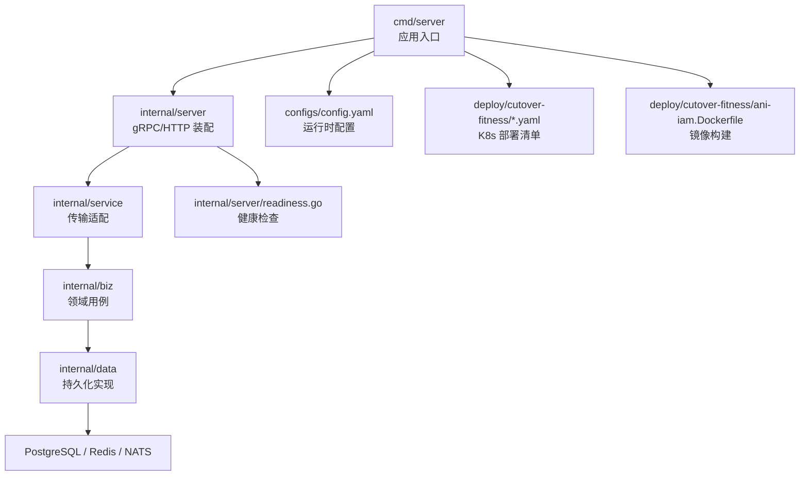
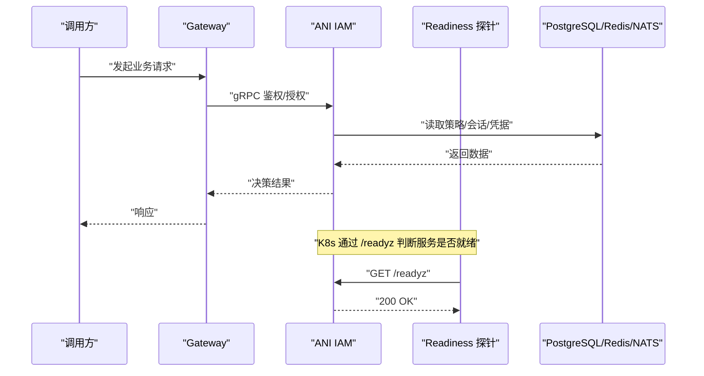
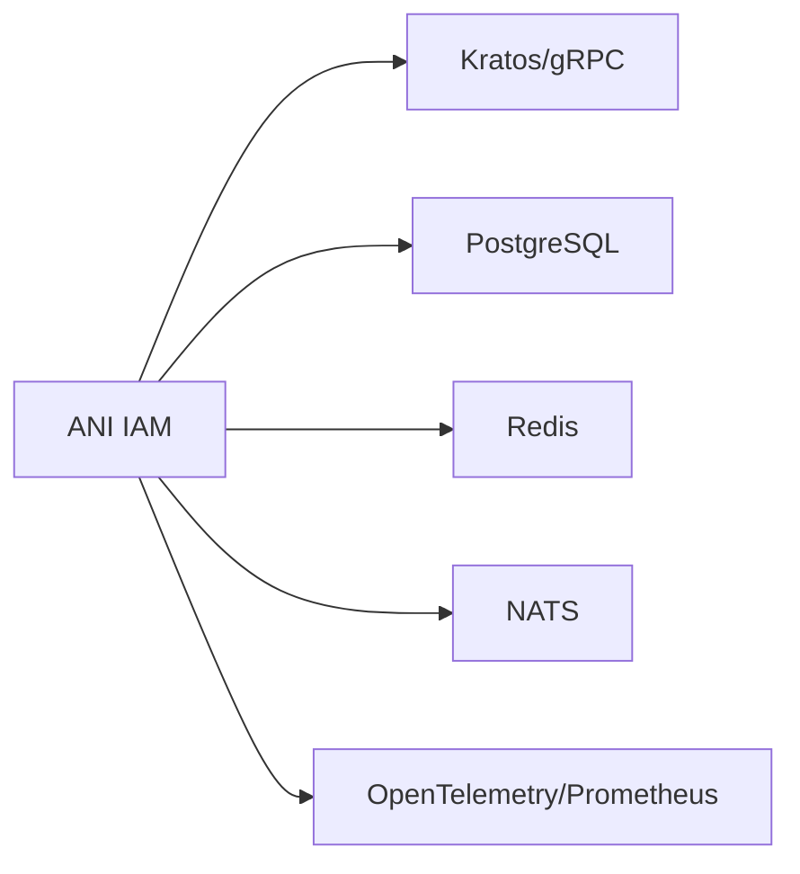

# 代码审查与发布

<cite>
**本文引用的文件**
- [README.md](file://README.md)
- [CLAUDE.md](file://CLAUDE.md)
- [AGENTS.md](file://AGENTS.md)
- [go.mod](file://go.mod)
- [configs/config.yaml](file://configs/config.yaml)
- [deploy/cutover-fitness/ani-iam.Dockerfile](file://deploy/cutover-fitness/ani-iam.Dockerfile)
- [deploy/cutover-fitness/30-runtime.yaml](file://deploy/cutover-fitness/30-runtime.yaml)
- [tools/wr20/stage-a.sh](file://tools/wr20/stage-a.sh)
- [tools/wr20/stage-b.sh](file://tools/wr20/stage-b.sh)
- [tools/wr20/stage-c.sh](file://tools/wr20/stage-c.sh)
- [internal/server/server.go](file://internal/server/server.go)
- [internal/server/readiness.go](file://internal/server/readiness.go)
- [internal/biz/authorization_test.go](file://internal/biz/authorization_test.go)
- [internal/biz/oidc.go](file://internal/biz/oidc.go)
- [tests/integration/workload_bootstrap_test.go](file://tests/integration/workload_bootstrap_test.go)
</cite>

## 目录
1. [简介](#简介)
2. [项目结构](#项目结构)
3. [核心组件](#核心组件)
4. [架构总览](#架构总览)
5. [详细组件分析](#详细组件分析)
6. [依赖分析](#依赖分析)
7. [性能考虑](#性能考虑)
8. [故障排查指南](#故障排查指南)
9. [结论](#结论)
10. [附录](#附录)

## 简介
本指南面向 ANI IAM 项目的代码审查与发布流程，覆盖分支策略、合并标准、代码质量与安全审计、版本发布、容器化构建与部署、灰度发布、监控回滚与故障恢复。内容基于仓库现有工程实践：分层架构（service/biz/data）、固定契约与生成文件、可重复的集成测试套件、Docker 多阶段构建与 Kubernetes 部署清单、以及以 WR 编号为阶段的验证流水线。

## 项目结构
仓库采用 Kratos 风格的分层组织：
- api：公开协议与生成的 DTO
- cmd/server：唯一组合入口
- internal/service：传输适配层
- internal/biz：领域用例与错误模型
- internal/data：持久化实现与客户端
- internal/server：gRPC/HTTP 服务装配与健康检查
- configs：运行时配置（不含密钥）
- deploy：容器镜像与 K8s 资源模板
- tests：单元与集成测试
- tools：各 WR 阶段的构建、校验与发布脚本

图表来源
- [internal/server/server.go:1-200](file://internal/server/server.go#L1-L200)
- [internal/server/readiness.go:1-200](file://internal/server/readiness.go#L1-L200)
- [configs/config.yaml:1-61](file://configs/config.yaml#L1-L61)
- [deploy/cutover-fitness/30-runtime.yaml:1-332](file://deploy/cutover-fitness/30-runtime.yaml#L1-L332)
- [deploy/cutover-fitness/ani-iam.Dockerfile:1-15](file://deploy/cutover-fitness/ani-iam.Dockerfile#L1-L15)

章节来源
- [CLAUDE.md:28-109](file://CLAUDE.md#L28-L109)
- [AGENTS.md:28-116](file://AGENTS.md#L28-L116)
- [README.md:1-13](file://README.md#L1-L13)

## 核心组件
- 服务装配与健康检查：通过 server 层注册 gRPC/HTTP 端点，readiness 探针暴露 /readyz，供 K8s 探测。
- 领域用例：biz 层封装认证、授权、会话、工作负载等用例，返回框架无关的错误类型。
- 数据访问：data 层使用 sqlc/pgx 进行持久化，集中管理连接与事务边界。
- 配置与密钥：config.yaml 提供运行时参数；密钥通过 K8s Secret 挂载到 /run/secrets。
- 构建与部署：Dockerfile 多阶段构建二进制；30-runtime.yaml 定义当前/目标双环境 Pod，含 Postgres、Redis、NATS、IAM、Gateway、Probe 等容器。

章节来源
- [internal/server/server.go:1-200](file://internal/server/server.go#L1-L200)
- [internal/server/readiness.go:1-200](file://internal/server/readiness.go#L1-L200)
- [configs/config.yaml:1-61](file://configs/config.yaml#L1-L61)
- [deploy/cutover-fitness/ani-iam.Dockerfile:1-15](file://deploy/cutover-fitness/ani-iam.Dockerfile#L1-L15)
- [deploy/cutover-fitness/30-runtime.yaml:1-332](file://deploy/cutover-fitness/30-runtime.yaml#L1-L332)

## 架构总览
下图展示从请求进入网关到 IAM 鉴权、再到数据层的调用链，以及就绪探针的作用。

图表来源
- [internal/server/server.go:1-200](file://internal/server/server.go#L1-L200)
- [internal/server/readiness.go:1-200](file://internal/server/readiness.go#L1-L200)
- [deploy/cutover-fitness/30-runtime.yaml:238-249](file://deploy/cutover-fitness/30-runtime.yaml#L238-L249)

## 详细组件分析

### 分支管理与合并标准
- 分支命名建议
  - feature/*：新功能开发
  - fix/*：缺陷修复
  - refactor/*：重构
  - chore(deps)/*：依赖更新
  - release/*：发布候选
  - hotfix/*：紧急修复
- 合并标准
  - 必须通过所有单元测试与相关集成测试（参考 tools/wr20/stage-*.sh 中的测试命令）。
  - 变更需保持分层边界：service 不直接访问 data，biz 不依赖框架/驱动。
  - 生成文件（proto/sqlc）需与源文件同提交，确保可重现。
  - 不得在 configs/config.yaml 中提交真实密钥。
  - 涉及安全或权限的变更需附加安全审计说明与回归测试。
- 代码审查要点
  - 正确性：用例逻辑、错误映射、幂等键与事务边界。
  - 安全性：凭据处理、OIDC 链接、审计事件记录。
  - 性能：数据库查询、缓存命中、超时与重试策略。
  - 可观测性：日志、指标、追踪上下文传递。

章节来源
- [CLAUDE.md:197-203](file://CLAUDE.md#L197-L203)
- [AGENTS.md:159-165](file://AGENTS.md#L159-L165)
- [tools/wr20/stage-a.sh:1-34](file://tools/wr20/stage-a.sh#L1-L34)
- [tools/wr20/stage-b.sh:1-34](file://tools/wr20/stage-b.sh#L1-L34)
- [tools/wr20/stage-c.sh:1-68](file://tools/wr20/stage-c.sh#L1-L68)

### 代码质量检查
- 格式化与生成
  - 使用 gofmt 对指定文件进行格式化，并归档 SHA256 用于可追溯。
  - 使用 sqlc/atlas 生成查询与迁移校验，确保 schema 一致性。
- 测试执行
  - 单元与集成测试按 WR 阶段脚本执行，输出 JSONL 结果并汇总。
  - 针对受影响范围选择测试集，避免全量耗时。
- 代码规范
  - 遵循 CLAUDE/AGENTS 的分层规则与命名约定。
  - 禁止跨层非法导入，违反视为分层 Bug。

章节来源
- [tools/wr20/stage-a.sh:5-15](file://tools/wr20/stage-a.sh#L5-L15)
- [tools/wr20/stage-b.sh:5-15](file://tools/wr20/stage-b.sh#L5-L15)
- [tools/wr20/stage-c.sh:12-40](file://tools/wr20/stage-c.sh#L12-L40)
- [CLAUDE.md:79-109](file://CLAUDE.md#L79-L109)
- [AGENTS.md:41-71](file://AGENTS.md#L41-L71)

### 安全审计
- OIDC 身份绑定与审计
  - 成功或失败均记录审计事件，包含主体、方法、目标、结果、原因、关联 ID、时间戳等。
  - 失败路径会记录失败原因并返回合适的错误。
- 平台授权审计
  - 平台级授权决策统一记录，匿名或未识别主体时降级为匿名审计。
- 密码操作审计
  - 密码重置完成等操作记录审计事件，支持冲突检测与回滚保护。
- 凭据与密钥
  - 密钥通过 K8s Secret 挂载，不在配置文件中明文提交。

章节来源
- [internal/biz/oidc.go:429-451](file://internal/biz/oidc.go#L429-L451)
- [internal/biz/platform_authorization.go:151-187](file://internal/biz/platform_authorization.go#L151-L187)
- [tests/integration/password_action_test.go:302-326](file://tests/integration/password_action_test.go#L302-L326)
- [configs/config.yaml:33-61](file://configs/config.yaml#L33-L61)
- [deploy/cutover-fitness/30-runtime.yaml:246-249](file://deploy/cutover-fitness/30-runtime.yaml#L246-L249)

### 性能评估
- 数据库与缓存
  - 使用 pgx 连接池与显式事务；Redis 用于限流与会话状态。
  - 合理设置读写超时与连接超时，避免阻塞。
- 网络与服务
  - gRPC 超时与 TLS 配置需在 config.yaml 中明确。
  - 网关与 IAM 间通信应启用 TLS 与证书校验。
- 可观测性
  - 通过 OpenTelemetry/Prometheus 暴露指标，结合 K8s 探针观察就绪与存活。

章节来源
- [configs/config.yaml:2-16](file://configs/config.yaml#L2-L16)
- [configs/config.yaml:22-32](file://configs/config.yaml#L22-L32)
- [deploy/cutover-fitness/30-runtime.yaml:41-64](file://deploy/cutover-fitness/30-runtime.yaml#L41-L64)
- [deploy/cutover-fitness/30-runtime.yaml:202-225](file://deploy/cutover-fitness/30-runtime.yaml#L202-L225)

### 版本发布流程
- 版本号管理
  - 使用 go.mod 锁定依赖版本；内部模块使用 wrXX 后缀标识交付阶段。
  - 生成文件与源码同提交，保证可重现构建。
- 变更日志维护
  - 使用 Conventional Commits 规范；每次变更对应清晰标题与影响范围。
  - 发布前整理变更摘要，标注破坏性变更与迁移步骤。
- 发布清单
  - 镜像标签与 SHA256 固定；K8s 清单引用固定镜像。
  - 迁移脚本与校验结果归档；配置项变更需文档化。
- 构建与打包
  - Dockerfile 多阶段构建，裁剪二进制体积；非 root 用户运行。
  - 集成测试产物与格式化工具链版本固化。

章节来源
- [go.mod:1-37](file://go.mod#L1-L37)
- [deploy/cutover-fitness/ani-iam.Dockerfile:1-15](file://deploy/cutover-fitness/ani-iam.Dockerfile#L1-L15)
- [CLAUDE.md:197-203](file://CLAUDE.md#L197-L203)
- [AGENTS.md:159-165](file://AGENTS.md#L159-L165)

### 容器化部署与灰度发布
- 容器化
  - 使用 Alpine 基础镜像，最小化攻击面；暴露必要端口。
  - 通过 Secret 注入证书与密钥，避免硬编码。
- 部署清单
  - 30-runtime.yaml 定义当前/目标双环境，便于灰度切换。
  - 每个容器具备就绪探针，确保滚动更新安全。
- 灰度策略
  - 先部署目标环境，验证通过后逐步切流。
  - 保留旧环境以便快速回滚；监控关键指标与错误率。

章节来源
- [deploy/cutover-fitness/ani-iam.Dockerfile:9-15](file://deploy/cutover-fitness/ani-iam.Dockerfile#L9-L15)
- [deploy/cutover-fitness/30-runtime.yaml:162-332](file://deploy/cutover-fitness/30-runtime.yaml#L162-L332)

### 监控、回滚与故障恢复
- 监控
  - 通过 readiness 探针与 HTTP 健康端点观察服务状态。
  - 指标与日志接入 Prometheus/OpenTelemetry，设置告警阈值。
- 回滚
  - 若新版本异常，立即回退至上一稳定镜像与配置。
  - 数据库迁移需具备回滚脚本或兼容策略。
- 故障恢复
  - 利用 WAL/快照与消息队列重放机制恢复数据一致性。
  - 对幂等操作使用 Idempotency-Key 防止重复执行。

章节来源
- [deploy/cutover-fitness/30-runtime.yaml:238-249](file://deploy/cutover-fitness/30-runtime.yaml#L238-L249)
- [tests/integration/workload_bootstrap_test.go:219-248](file://tests/integration/workload_bootstrap_test.go#L219-L248)

## 依赖分析
项目依赖包括 Go 标准库、Kratos 框架、gRPC、PostgreSQL、Redis、NATS、OpenTelemetry 等。依赖版本固定，确保构建可重现。

图表来源
- [go.mod:1-37](file://go.mod#L1-L37)

章节来源
- [go.mod:1-119](file://go.mod#L1-L119)

## 性能考虑
- 连接池与超时：合理配置数据库与缓存连接池大小与超时时间。
- 查询优化：使用索引与分页，避免全表扫描。
- 缓存策略：热点数据缓存，注意失效与一致性。
- 并发控制：限制并发请求数，避免过载。
- 资源限制：为容器设置 CPU/内存限制，防止资源争用。

[本节为通用指导，无需特定文件来源]

## 故障排查指南
- 常见问题
  - 服务未就绪：检查 /readyz 与健康探针配置。
  - 鉴权失败：核对 OIDC 配置、证书与域名。
  - 数据库连接失败：检查 DSN、网络与权限。
  - 缓存不可用：检查 Redis 地址与密码。
- 诊断步骤
  - 查看容器日志与 K8s 事件。
  - 使用集成测试复现问题。
  - 检查审计事件与错误码。
- 恢复措施
  - 回滚到上一稳定版本。
  - 重启服务或重建 Pod。
  - 修复配置后重新部署。

章节来源
- [internal/server/readiness.go:1-200](file://internal/server/readiness.go#L1-L200)
- [deploy/cutover-fitness/30-runtime.yaml:238-249](file://deploy/cutover-fitness/30-runtime.yaml#L238-L249)
- [internal/biz/authorization_test.go:241-382](file://internal/biz/authorization_test.go#L241-L382)

## 结论
本指南基于仓库现有工程实践，提供了从代码审查到发布的完整流程。通过严格的分支策略、自动化测试、安全审计与容器化部署，确保 IAM 服务的质量与可控性。建议在每次发布前执行完整的 WR 阶段验证，并保留回滚能力以应对突发问题。

[本节为总结，无需特定文件来源]

## 附录
- 常用命令
  - 构建镜像：docker build -f deploy/cutover-fitness/ani-iam.Dockerfile .
  - 运行测试：go test -tags=integration ./tests/integration
  - 生成代码：sqlc generate && atlas migrate hash
- 参考文档
  - README.md：项目概述与接入指引
  - CLAUDE.md/AGENTS.md：贡献规则与架构约束
  - docs/adr：已接受的设计决策

章节来源
- [README.md:1-13](file://README.md#L1-L13)
- [CLAUDE.md:1-46](file://CLAUDE.md#L1-L46)
- [AGENTS.md:1-22](file://AGENTS.md#L1-L22)