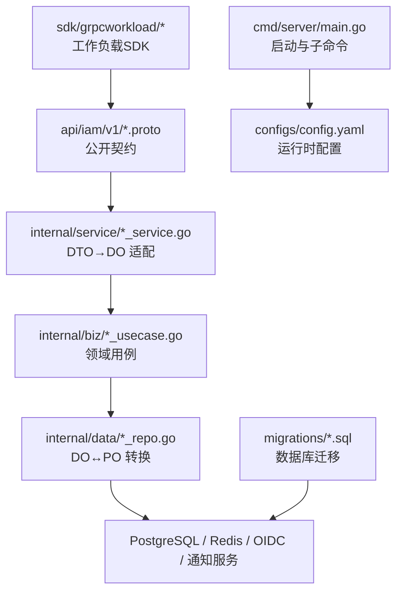
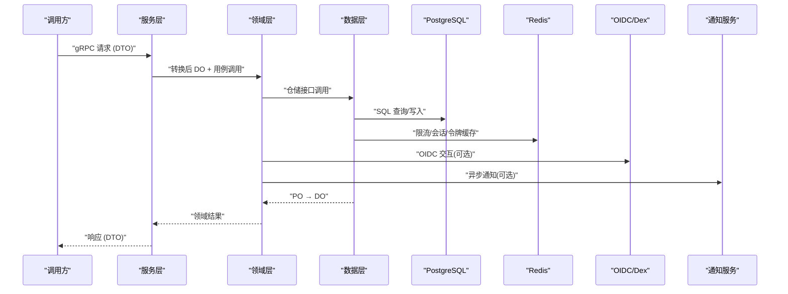
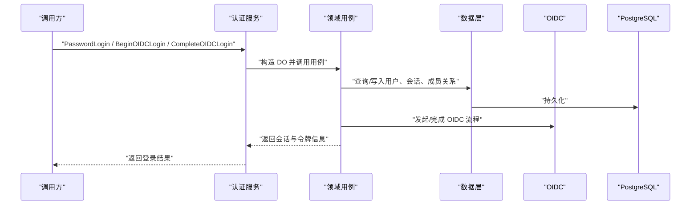
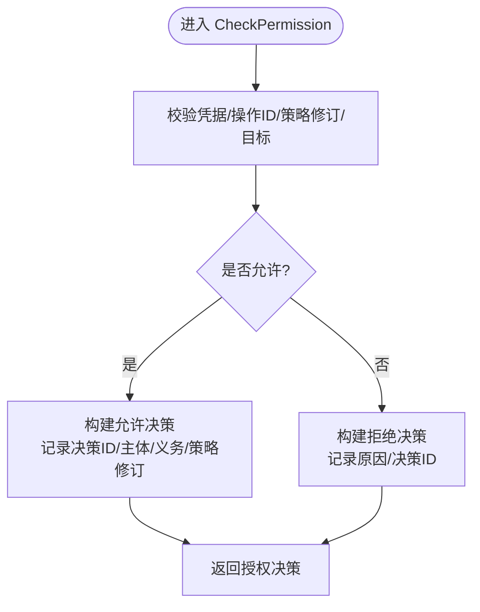
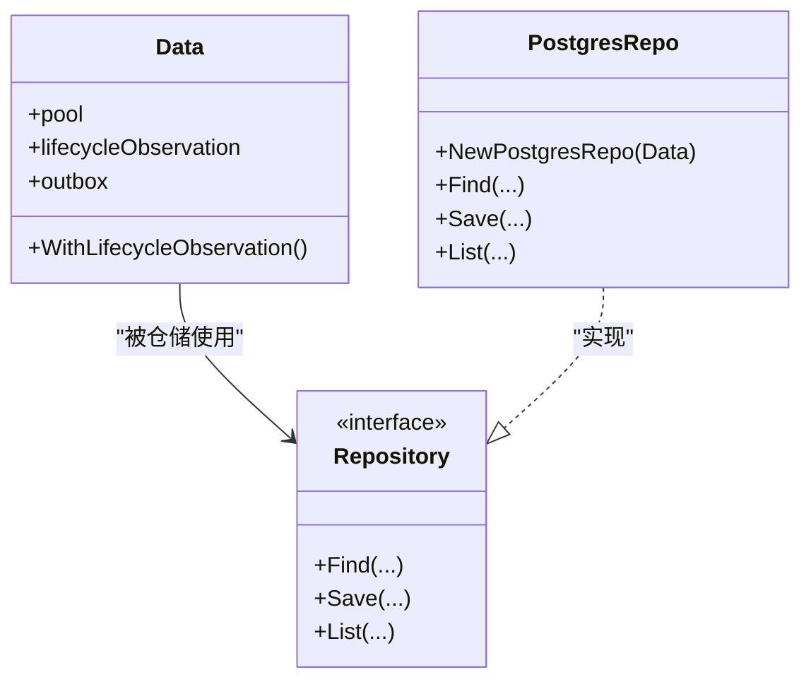
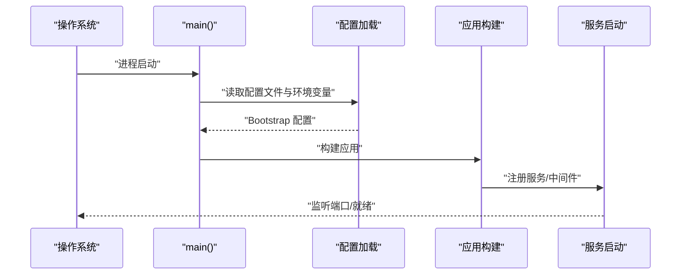
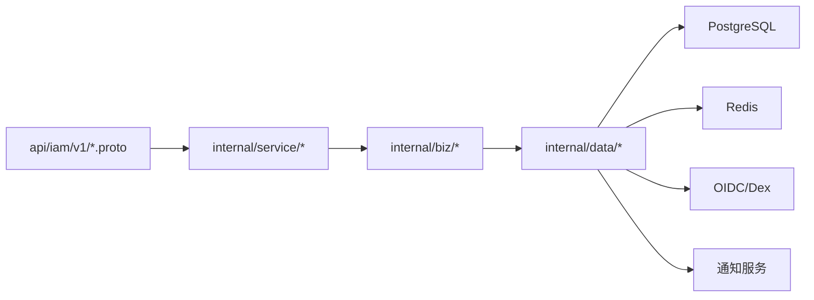

# 功能开发流程

<cite>
**本文引用的文件**
- [README.md](file://README.md)
- [AGENTS.md](file://AGENTS.md)
- [CLAUDE.md](file://CLAUDE.md)
- [api/README.md](file://api/README.md)
- [sdk/README.md](file://sdk/README.md)
- [internal/biz/biz.go](file://internal/biz/biz.go)
- [internal/service/service.go](file://internal/service/service.go)
- [internal/data/data.go](file://internal/data/data.go)
- [cmd/server/main.go](file://cmd/server/main.go)
- [configs/config.yaml](file://configs/config.yaml)
- [api/iam/v1/authentication_service.proto](file://api/iam/v1/authentication_service.proto)
- [api/iam/v1/authorization_service.proto](file://api/iam/v1/authorization_service.proto)
- [migrations/202609040001_persistence_foundation.sql](file://migrations/202609040001_persistence_foundation.sql)
- [tests/integration/tenant_authorization_test.go](file://tests/integration/tenant_authorization_test.go)
</cite>

## 目录
1. [引言](#引言)
2. [项目结构](#项目结构)
3. [核心组件](#核心组件)
4. [架构总览](#架构总览)
5. [详细组件分析](#详细组件分析)
6. [依赖关系分析](#依赖关系分析)
7. [性能考虑](#性能考虑)
8. [故障排查指南](#故障排查指南)
9. [结论](#结论)
10. [附录：新功能开发模板与示例路径](#附录：新功能开发模板与示例路径)

## 引言
本文件面向在本仓库中新增或改造功能的工程师，提供从需求分析、API设计、数据库变更、业务实现到测试验证、代码审查、版本发布与上线的完整流程与最佳实践。本项目为独立的身份与访问控制服务（IAM），采用分层架构与严格边界约束，强调向后兼容、可观测性、幂等与安全审计。所有流程均以仓库内既定规范为依据，确保质量与效率。

## 项目结构
仓库采用清晰的层次化组织：
- api：公开 gRPC 契约与生成产物，定义认证、授权等接口。
- cmd/server：应用入口与运行时装配，负责配置加载、日志、子命令与启动。
- internal/biz：领域模型、用例与仓储接口，不含框架与存储细节。
- internal/service：传输适配层，将 DTO 转换为领域对象并调用用例。
- internal/data：持久化实现与基础设施客户端封装。
- migrations：数据库迁移脚本，按时间戳命名，由迁移工具执行。
- configs：运行期配置（不包含敏感信息）。
- sdk：工作负载 gRPC 适配器，供资源服务调用 IAM。
- tests：单元测试与集成测试，覆盖关键路径与边界条件。

图表来源
- [cmd/server/main.go:34-101](file://cmd/server/main.go#L34-L101)
- [configs/config.yaml:1-61](file://configs/config.yaml#L1-L61)
- [api/iam/v1/authentication_service.proto:11-33](file://api/iam/v1/authentication_service.proto#L11-L33)
- [api/iam/v1/authorization_service.proto:10-16](file://api/iam/v1/authorization_service.proto#L10-L16)
- [migrations/202609040001_persistence_foundation.sql:17-148](file://migrations/202609040001_persistence_foundation.sql#L17-L148)

章节来源
- [README.md:1-13](file://README.md#L1-L13)
- [AGENTS.md:28-68](file://AGENTS.md#L28-L68)
- [CLAUDE.md:66-109](file://CLAUDE.md#L66-L109)

## 核心组件
- 公开 API：认证服务与授权服务通过 Proto 定义，作为稳定契约对外暴露。
- 服务层：负责请求校验、DTO 与领域对象转换，不持有业务规则与存储访问。
- 领域层：拥有领域对象、用例与仓储接口，保持无框架依赖。
- 数据层：实现仓储接口，管理 PO 与转换函数，封装连接池与外部客户端。
- 启动器：统一加载配置、初始化日志、注册子命令并启动服务。
- 配置：集中管理网络、TLS、数据库、Redis、OIDC、通知、策略修订等参数。
- 迁移：以原子脚本维护数据库演进，运行时实例不直接执行迁移。

章节来源
- [api/iam/v1/authentication_service.proto:11-33](file://api/iam/v1/authentication_service.proto#L11-L33)
- [api/iam/v1/authorization_service.proto:10-16](file://api/iam/v1/authorization_service.proto#L10-L16)
- [internal/biz/biz.go:1-4](file://internal/biz/biz.go#L1-L4)
- [internal/service/service.go:1-4](file://internal/service/service.go#L1-L4)
- [internal/data/data.go:1-29](file://internal/data/data.go#L1-L29)
- [cmd/server/main.go:34-101](file://cmd/server/main.go#L34-L101)
- [configs/config.yaml:1-61](file://configs/config.yaml#L1-L61)

## 架构总览
系统遵循“传输适配 → 领域用例 → 持久化实现”的分层模型，并通过明确的依赖方向保证解耦与可测试性。

图表来源
- [api/iam/v1/authentication_service.proto:11-33](file://api/iam/v1/authentication_service.proto#L11-L33)
- [api/iam/v1/authorization_service.proto:10-16](file://api/iam/v1/authorization_service.proto#L10-L16)
- [internal/data/data.go:6-20](file://internal/data/data.go#L6-L20)
- [configs/config.yaml:22-61](file://configs/config.yaml#L22-L61)

## 详细组件分析

### 认证服务（AuthenticationService）
- 职责：处理密码登录、OIDC 登录/绑定、邀请接受、会话刷新/登出、租户切换、凭据校验与工作负载令牌签发等。
- 关键点：
  - 请求包含受众、边界、设备名、幂等键与可信来源 IP（仅由网关注入）。
  - 响应包含访问令牌、会话摘要、授权摘要与刷新令牌等。
  - 工作负载令牌具有短生命周期与精确受众限制。

图表来源
- [api/iam/v1/authentication_service.proto:11-33](file://api/iam/v1/authentication_service.proto#L11-L33)
- [api/iam/v1/authentication_service.proto:35-59](file://api/iam/v1/authentication_service.proto#L35-L59)
- [api/iam/v1/authentication_service.proto:61-87](file://api/iam/v1/authentication_service.proto#L61-L87)
- [configs/config.yaml:51-59](file://configs/config.yaml#L51-L59)

章节来源
- [api/iam/v1/authentication_service.proto:11-33](file://api/iam/v1/authentication_service.proto#L11-L33)
- [api/iam/v1/authentication_service.proto:35-59](file://api/iam/v1/authentication_service.proto#L35-L59)
- [api/iam/v1/authentication_service.proto:61-87](file://api/iam/v1/authentication_service.proto#L61-L87)
- [api/iam/v1/authentication_service.proto:150-186](file://api/iam/v1/authentication_service.proto#L150-L186)
- [api/iam/v1/authentication_service.proto:223-251](file://api/iam/v1/authentication_service.proto#L223-L251)

### 授权服务（AuthorizationService）
- 职责：对操作进行单一失败关闭的权限判定，支持工作负载调用者校验、会话延续校验、权限检查与工作负载调用验证。
- 关键点：
  - 决策对象明确允许/拒绝原因、决策 ID、主体上下文、义务与策略修订。
  - 调用方需提供原始凭据、操作 ID、策略修订与目标。

图表来源
- [api/iam/v1/authorization_service.proto:10-16](file://api/iam/v1/authorization_service.proto#L10-L16)
- [api/iam/v1/authorization_service.proto:18-39](file://api/iam/v1/authorization_service.proto#L18-L39)

章节来源
- [api/iam/v1/authorization_service.proto:10-16](file://api/iam/v1/authorization_service.proto#L10-L16)
- [api/iam/v1/authorization_service.proto:18-39](file://api/iam/v1/authorization_service.proto#L18-L39)

### 数据层与持久化
- 数据层封装连接池、出站保护器与共享客户端，避免在仓储中重复创建。
- 迁移脚本建立主实体表（主体、租户访问、成员、角色、绑定）、审计事件表及权限授予，使用强约束与索引保障一致性与性能。

图表来源
- [internal/data/data.go:6-29](file://internal/data/data.go#L6-L29)
- [migrations/202609040001_persistence_foundation.sql:17-148](file://migrations/202609040001_persistence_foundation.sql#L17-L148)

章节来源
- [internal/data/data.go:6-29](file://internal/data/data.go#L6-L29)
- [migrations/202609040001_persistence_foundation.sql:17-148](file://migrations/202609040001_persistence_foundation.sql#L17-L148)

### 启动器与配置
- 启动器解析命令行参数、加载配置文件、设置日志与运行时 CPU 配额，并启动服务；同时支持多种子命令用于预置与安装。
- 配置涵盖服务器网络/TLS、工作负载注册表、环境/信任域、PostgreSQL/Redis、访问令牌、通知、OIDC 与策略修订等。

图表来源
- [cmd/server/main.go:34-101](file://cmd/server/main.go#L34-L101)
- [configs/config.yaml:1-61](file://configs/config.yaml#L1-L61)

章节来源
- [cmd/server/main.go:34-101](file://cmd/server/main.go#L34-L101)
- [configs/config.yaml:1-61](file://configs/config.yaml#L1-L61)

## 依赖关系分析
- 服务层依赖 API 契约与领域层，不直接访问存储。
- 领域层仅依赖领域对象与错误枚举，不引入传输或存储细节。
- 数据层实现领域仓储接口，封装驱动与客户端。
- 启动器组合各层并提供运行期能力。

图表来源
- [AGENTS.md:41-68](file://AGENTS.md#L41-L68)
- [CLAUDE.md:79-109](file://CLAUDE.md#L79-L109)
- [configs/config.yaml:22-61](file://configs/config.yaml#L22-L61)

章节来源
- [AGENTS.md:41-68](file://AGENTS.md#L41-L68)
- [CLAUDE.md:79-109](file://CLAUDE.md#L79-L109)

## 性能考虑
- 使用连接池与超时配置，避免连接泄漏与阻塞。
- 对高频读路径增加缓存（如会话、令牌、限流计数），注意失效策略与一致性。
- 数据库侧通过合理索引与约束提升查询性能与数据完整性。
- 日志过滤敏感字段，减少 I/O 开销与泄露风险。
- 长耗时操作采用异步通知与出站保护器，降低同步路径压力。

[本节为通用指导，不直接分析具体文件]

## 故障排查指南
- 配置问题：检查配置文件中的网络地址、TLS 证书路径、数据库 DSN、Redis 地址与命名空间、OIDC 回调地址与策略修订。
- 启动失败：确认命令行参数、环境变量前缀、日志级别与源信息输出。
- 鉴权失败：核对凭据、受众、边界、策略修订与目标匹配；关注失败关闭策略与决策 ID。
- 数据库异常：检查迁移状态、权限授予、外键约束与唯一索引冲突。
- 集成测试：参考集成测试中对缺失/过期生命周期投影的处理，定位可用性问题。

章节来源
- [configs/config.yaml:1-61](file://configs/config.yaml#L1-L61)
- [cmd/server/main.go:104-131](file://cmd/server/main.go#L104-L131)
- [tests/integration/tenant_authorization_test.go:20-39](file://tests/integration/tenant_authorization_test.go#L20-L39)

## 结论
本流程基于仓库既定的分层架构与严格边界，结合公开的 gRPC 契约、迁移脚本与配置管理，形成从需求到上线的闭环。通过明确的 API 设计、领域用例、数据实现与测试验证，确保新功能的质量、安全与可维护性。建议在每次变更时遵循提交规范、分支策略与发布流程，并在生产变更前完成充分的回归与恢复演练。

[本节为总结，不直接分析具体文件]

## 附录：新功能开发模板与示例路径

### 新增资源/能力的标准步骤
- 定义 DTO：在 api/<domain>/<version>/ 下新增 Create/Get/List/Update/Delete 等 RPC 与消息类型，然后重新生成。
- 定义 DO 与仓储接口：在 internal/biz 中声明领域对象与仓储接口，围绕接口实现用例。
- 实现仓储：在 internal/data 中实现仓储接口，必要时定义 PO 与转换函数。
- 装配与注册：在服务层注册服务，在启动器中组装依赖。
- 重新生成：更新生成的代码与模块依赖。

章节来源
- [AGENTS.md:122-135](file://AGENTS.md#L122-L135)
- [CLAUDE.md:160-173](file://CLAUDE.md#L160-L173)

### API 设计要点
- 使用稳定的包与版本命名，避免破坏性变更；如需破坏性变更需有明确计划与回滚策略。
- 明确受众、边界、幂等键与策略修订，确保调用方可正确绑定与重试。
- 授权决策必须显式，禁止隐式允许；失败关闭优先。

章节来源
- [api/README.md:1-8](file://api/README.md#L1-L8)
- [api/iam/v1/authorization_service.proto:18-39](file://api/iam/v1/authorization_service.proto#L18-L39)

### 数据库变更与迁移
- 每个变更对应一个带时间戳的 SQL 迁移脚本，确保幂等与可回滚。
- 使用强约束（检查约束、外键、唯一索引）保障数据一致性。
- 审计事件与业务状态变更应在同一事务中记录，便于追踪与回溯。

章节来源
- [migrations/202609040001_persistence_foundation.sql:17-148](file://migrations/202609040001_persistence_foundation.sql#L17-L148)

### 业务逻辑实现
- 用例只关注领域规则与聚合边界，不感知传输与存储细节。
- 错误类型化，向上层暴露稳定的错误原因，便于客户端处理。
- 对跨服务调用设置超时与重试策略，避免级联故障。

章节来源
- [internal/biz/biz.go:1-4](file://internal/biz/biz.go#L1-L4)
- [internal/service/service.go:1-4](file://internal/service/service.go#L1-L4)

### 代码提交与分支管理
- 使用约定式提交：feat/fix/refactor/chore/docs/test。
- 生成文件与源文件同提交，保持可追溯。
- 分支策略建议：特性分支 → 合并至主干前完成评审与测试 → 打标签发布。

章节来源
- [AGENTS.md:159-165](file://AGENTS.md#L159-L165)
- [CLAUDE.md:197-203](file://CLAUDE.md#L197-L203)

### 版本发布与向后兼容
- 公共 API 与 SDK 独立版本管理，消费者通过固定版本引用。
- 破坏性变更需配套迁移与回滚方案，确保旧客户端仍可运行。
- 发布前完成兼容性矩阵核对与回归测试。

章节来源
- [api/README.md:1-8](file://api/README.md#L1-L8)
- [sdk/README.md:1-33](file://sdk/README.md#L1-L33)

### 代码审查与测试验证
- 服务层测试伪造用例，领域层测试伪造仓储，数据层测试存储边界。
- 集成测试覆盖真实数据库、缓存与外部服务交互。
- 验收标准：通过 pass/fail/not_verified 三态评估，文档通过不等于生产就绪。

章节来源
- [AGENTS.md:137-141](file://AGENTS.md#L137-L141)
- [CLAUDE.md:175-179](file://CLAUDE.md#L175-L179)

### 部署上线与监控
- 启动器加载配置并启动服务，确保 TLS、网络与依赖就绪。
- 日志包含服务标识、版本与追踪属性，过滤敏感字段。
- 健康检查与就绪探针应基于授权与依赖可用性。

章节来源
- [cmd/server/main.go:34-101](file://cmd/server/main.go#L34-L101)
- [cmd/server/main.go:104-131](file://cmd/server/main.go#L104-L131)
- [configs/config.yaml:1-61](file://configs/config.yaml#L1-L61)