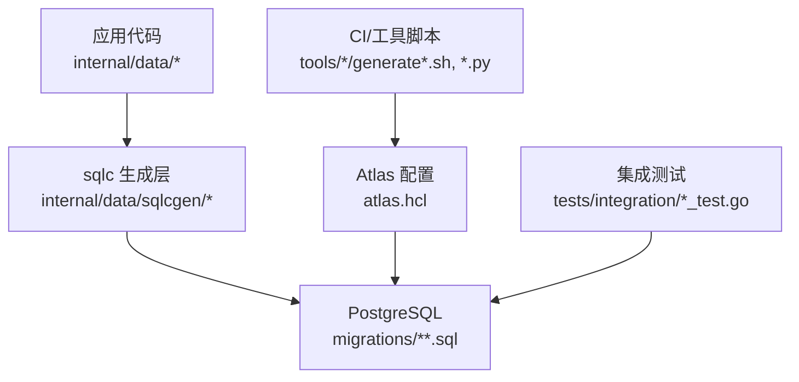
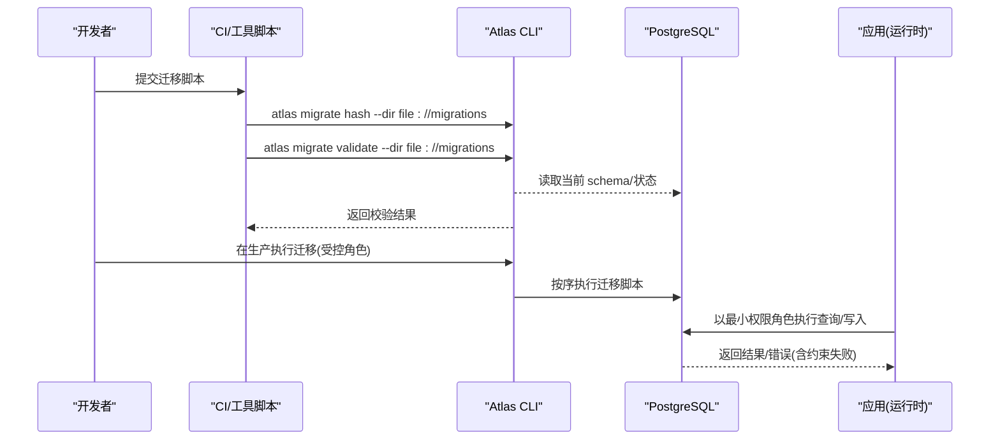
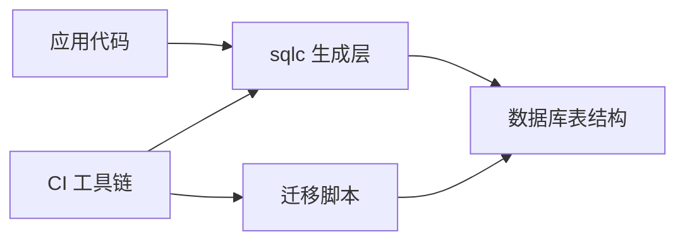

# 数据库迁移管理

<cite>
**本文引用的文件**
- [atlas.hcl](file://atlas.hcl)
- [202609040001_persistence_foundation.sql](file://migrations/202609040001_persistence_foundation.sql)
- [202609080001_tenant_authorization.sql](file://migrations/202609080001_tenant_authorization.sql)
- [202609100001_workload_runtime_foundation.sql](file://migrations/202609100001_workload_runtime_foundation.sql)
- [202609130001_first_administrator_intent.sql](file://migrations/202609130001_first_administrator_intent.sql)
- [postgres.go](file://internal/data/postgres.go)
- [conf.pb.go](file://internal/conf/conf.pb.go)
- [generate-roles.sh](file://tools/wr22/generate-roles.sh)
- [generation.py](file://tools/wr23-resume/generation.py)
- [workload_runtime_test.go](file://tests/integration/workload_runtime_test.go)
- [tenant_authorization_test.go](file://tests/integration/tenant_authorization_test.go)
</cite>

## 目录
1. [简介](#简介)
2. [项目结构](#项目结构)
3. [核心组件](#核心组件)
4. [架构总览](#架构总览)
5. [详细组件分析](#详细组件分析)
6. [依赖关系分析](#依赖关系分析)
7. [性能与一致性考虑](#性能与一致性考虑)
8. [故障排查指南](#故障排查指南)
9. [结论](#结论)
10. [附录：模板与示例路径](#附录模板与示例路径)

## 简介
本指南面向需要安全、可追溯地演进数据库结构的团队，基于仓库中现有的 Atlas 迁移实践与 PostgreSQL 权限模型，提供从脚本编写规范、版本控制策略到执行流程、回滚与冲突处理、并行执行与数据一致性保证的完整方法论。同时给出 Atlas 工具使用要点与配置选项说明，帮助在复杂数据转换、索引优化和约束调整场景下保持变更可控、可审计、可回滚。

## 项目结构
仓库采用“按功能域组织”的迁移文件命名与存放方式，所有迁移脚本集中于 migrations 目录，以时间戳前缀确保严格顺序；Atlas 通过配置文件声明迁移目录与环境变量来源的数据库连接；运行时通过最小权限角色访问数据库，业务代码通过 sqlc 生成的查询层访问表结构。

图表来源
- [atlas.hcl:1-8](file://atlas.hcl#L1-L8)
- [postgres.go:1-279](file://internal/data/postgres.go#L1-L279)
- [workload_runtime_test.go:143-190](file://tests/integration/workload_runtime_test.go#L143-L190)

章节来源
- [atlas.hcl:1-8](file://atlas.hcl#L1-L8)
- [postgres.go:1-279](file://internal/data/postgres.go#L1-L279)

## 核心组件
- 迁移目录与版本化：migrations 下的每个 .sql 文件代表一次不可变变更，文件名以日期+序号前缀，保证全局有序且可哈希校验（atlas.sum）。
- Atlas 配置：atlas.hcl 定义环境、数据库 URL 来源以及迁移目录映射。
- 权限模型：迁移脚本创建并维护最小权限角色（如 ani_iam_runtime），并通过 GRANT/REVOKE 精确授权；业务运行期仅持有必要读写权限。
- 运行时校验：通过触发器、检查约束、外键等数据库级规则保障数据完整性与访问边界。
- 工具链：CI 中使用 atlas migrate hash 与 validate 保证迁移一致性与正确性；sqlc 生成类型安全的查询代码。

章节来源
- [atlas.hcl:1-8](file://atlas.hcl#L1-L8)
- [202609040001_persistence_foundation.sql:1-148](file://migrations/202609040001_persistence_foundation.sql#L1-L148)
- [202609100001_workload_runtime_foundation.sql:1-89](file://migrations/202609100001_workload_runtime_foundation.sql#L1-L89)
- [generate-roles.sh:1-32](file://tools/wr22/generate-roles.sh#L1-L32)
- [generation.py:23-36](file://tools/wr23-resume/generation.py#L23-L36)

## 架构总览
下图展示了从配置到执行的端到端流程：环境变量驱动 Atlas 定位数据库与迁移目录；CI 或本地执行迁移哈希与验证；生产环境由受控角色执行迁移；运行时以最小权限访问数据库，并通过触发器与约束保证一致性。

图表来源
- [generate-roles.sh:19-21](file://tools/wr22/generate-roles.sh#L19-L21)
- [generation.py:25-26](file://tools/wr23-resume/generation.py#L25-L26)
- [atlas.hcl:1-8](file://atlas.hcl#L1-L8)
- [202609040001_persistence_foundation.sql:14-16](file://migrations/202609040001_persistence_foundation.sql#L14-L16)

## 详细组件分析

### 迁移脚本编写规范
- 命名与顺序：使用 YYYYMMDDNNNN_描述.sql 格式，确保全局唯一与严格顺序。
- 幂等与可重放：避免对已存在对象重复创建；必要时使用条件语句或先删后建（谨慎评估风险）。
- 最小权限：只授予运行时所需的最小集合；禁止将写权限授予运行时角色，除非确有必要。
- 约束优先：用 CHECK、UNIQUE、FOREIGN KEY 表达业务规则；用触发器实现跨表一致性。
- 审计与追踪：为关键实体添加审计字段与事件表；记录操作人、时间、关联上下文。
- 版本标记：在合适位置更新 schema 版本标记（如 iam_schema_revision），便于运行时自检。

章节来源
- [202609040001_persistence_foundation.sql:17-148](file://migrations/202609040001_persistence_foundation.sql#L17-L148)
- [202609100001_workload_runtime_foundation.sql:82-89](file://migrations/202609100001_workload_runtime_foundation.sql#L82-L89)

### 版本控制策略
- 不可变迁移：每个 SQL 文件对应一次变更，不得修改历史文件；新增变更以新文件追加。
- 哈希校验：通过 atlas.sum 锁定迁移集，防止未预期变更进入流水线。
- 分支合并策略：主分支仅接受通过 validate 的迁移；特性分支包含相关迁移与测试。
- 发布门禁：CI 必须执行 atlas migrate hash 与 validate，否则阻断合并。

章节来源
- [generate-roles.sh:19-21](file://tools/wr22/generate-roles.sh#L19-L21)
- [generation.py:25-26](file://tools/wr23-resume/generation.py#L25-L26)

### 执行流程
- 开发阶段：本地使用 atlas migrate hash 生成/更新哈希；使用 atlas migrate validate 校验迁移合法性。
- 预发/生产：由具备迁移权限的受控角色执行迁移；应用运行时以最小权限角色访问数据库。
- 运行时自检：应用启动时读取 schema 版本标记，确保与期望版本一致后再提供服务。

章节来源
- [atlas.hcl:1-8](file://atlas.hcl#L1-L8)
- [202609100001_workload_runtime_foundation.sql:82-89](file://migrations/202609100001_workload_runtime_foundation.sql#L82-L89)

### 安全设计：数据迁移、索引优化与约束调整
- 数据迁移：
  - 在事务内完成多表变更，保证原子性。
  - 对大表变更分批次进行，避免长事务锁竞争。
  - 使用并发安全的 DDL（如 CONCURRENTLY）减少停机窗口（视数据库能力而定）。
- 索引优化：
  - 针对高频查询模式建立复合索引；删除冗余索引。
  - 使用部分索引（WHERE 条件）提升选择性。
- 约束调整：
  - 通过 CHECK 限制枚举值范围；通过 FOREIGN KEY 维护引用完整性。
  - 使用 DEFERRABLE INITIALLY DEFERRED 的外键延迟约束，支持批量导入时的循环依赖。

章节来源
- [202609040001_persistence_foundation.sql:53-98](file://migrations/202609040001_persistence_foundation.sql#L53-L98)
- [202609100001_workload_runtime_foundation.sql:3-35](file://migrations/202609100001_workload_runtime_foundation.sql#L3-L35)

### Atlas 工具使用方法与配置选项
- 环境配置：
  - 通过 DATABASE_URL 指定目标数据库。
  - 通过 migration.dir 指向 migrations 目录。
- 常用命令：
  - atlas migrate hash --dir file://migrations：计算并更新迁移哈希。
  - atlas migrate validate --dir file://migrations：校验迁移合法性。
- 注意事项：
  - 设置 ATLAS_NO_UPDATE_NOTIFIER 以避免通知干扰自动化流程。
  - 在生产执行迁移需使用具备迁移权限的专用角色。

章节来源
- [atlas.hcl:1-8](file://atlas.hcl#L1-L8)
- [generate-roles.sh:19-21](file://tools/wr22/generate-roles.sh#L19-L21)
- [generation.py:25-26](file://tools/wr23-resume/generation.py#L25-L26)

### 复杂数据转换与回滚策略
- 复杂转换：
  - 将复杂逻辑拆分为多个小步骤，每步独立可验证。
  - 使用中间表暂存过渡数据，逐步迁移至目标结构。
- 回滚策略：
  - 尽量设计可逆变更；对于不可逆变更准备反向迁移脚本。
  - 在回滚前备份关键数据；回滚后验证数据一致性与业务可用性。
- 并发与一致性：
  - 使用行级锁或版本号字段避免并发冲突。
  - 通过外键与触发器保证跨表一致性。

章节来源
- [202609130001_first_administrator_intent.sql:35-68](file://migrations/202609130001_first_administrator_intent.sql#L35-L68)

### 迁移冲突解决、并行执行与数据一致性保证
- 冲突解决：
  - 若出现迁移顺序冲突，拆分或重组迁移步骤，确保无环依赖。
  - 使用 DEFERRABLE 外键延迟约束，允许批量插入时的循环依赖。
- 并行执行：
  - 对非互斥的 DDL 可考虑并行执行（如 CREATE INDEX CONCURRENTLY）。
  - 对 DML 使用分区或分批处理，降低锁竞争。
- 一致性保证：
  - 通过事务包裹多步变更；失败则整体回滚。
  - 利用数据库约束（CHECK、FK、UNIQUE）作为最终一致性保障。

章节来源
- [202609040001_persistence_foundation.sql:89-95](file://migrations/202609040001_persistence_foundation.sql#L89-L95)
- [202609100001_workload_runtime_foundation.sql:63-80](file://migrations/202609100001_workload_runtime_foundation.sql#L63-L80)

### 权限与隔离：迁移角色与运行时角色分离
- 迁移角色：拥有 DDL 权限，负责执行迁移脚本。
- 运行时角色：仅拥有必要的 DML 权限，无法执行 DDL。
- 最小权限原则：通过 GRANT/REVOKE 精确控制表级与列级访问。

章节来源
- [202609040001_persistence_foundation.sql:14-16](file://migrations/202609040001_persistence_foundation.sql#L14-L16)
- [202609080001_tenant_authorization.sql:1-7](file://migrations/202609080001_tenant_authorization.sql#L1-L7)

## 依赖关系分析
- 应用代码依赖 sqlc 生成的查询层，查询层依赖数据库表结构。
- 迁移脚本定义表结构与权限，运行时通过最小权限角色访问。
- CI 工具链依赖 Atlas 与 sqlc，确保迁移与代码生成的一致性。

图表来源
- [postgres.go:1-279](file://internal/data/postgres.go#L1-L279)
- [generate-roles.sh:19-21](file://tools/wr22/generate-roles.sh#L19-L21)

章节来源
- [postgres.go:1-279](file://internal/data/postgres.go#L1-L279)
- [generate-roles.sh:19-21](file://tools/wr22/generate-roles.sh#L19-L21)

## 性能与一致性考虑
- 大表变更：使用在线 DDL（如 CONCURRENTLY）减少锁等待。
- 索引策略：根据查询模式设计复合索引；定期清理无用索引。
- 事务粒度：尽量缩小事务范围，避免长事务导致锁竞争。
- 监控与告警：监控慢查询与锁等待，及时优化。

[本节为通用指导，不直接分析具体文件]

## 故障排查指南
- 权限错误（42501）：检查运行时角色是否被误授予写权限；确认迁移脚本中的 GRANT/REVOKE 是否正确。
- 约束冲突（23514/23505）：检查 CHECK、UNIQUE、FOREIGN KEY 约束；确认数据是否符合业务规则。
- 版本冲突（40001/40P01）：检查乐观锁版本号；确保并发更新时使用正确的版本字段。
- 迁移校验失败：使用 atlas migrate validate 检查迁移合法性；核对 atlas.sum 与实际迁移文件一致性。

章节来源
- [workload_runtime_test.go:143-190](file://tests/integration/workload_runtime_test.go#L143-L190)
- [tenant_authorization_test.go:64-95](file://tests/integration/tenant_authorization_test.go#L64-L95)
- [postgres.go:195-232](file://internal/data/postgres.go#L195-L232)

## 结论
本指南基于仓库现有实践，总结了数据库迁移管理的核心原则与操作流程。通过严格的版本控制、最小权限模型、数据库级约束与 CI 门禁，确保变更安全、可追溯、可回滚。建议团队遵循本指南，结合业务需求持续优化迁移策略与工具链。

[本节为总结性内容，不直接分析具体文件]

## 附录：模板与示例路径
- 基础表与权限模板：参考持久化基础迁移脚本。
- 工作负载运行时基础：参考工作负载运行时基础迁移脚本。
- 管理员意图与审计：参考首次管理员意图迁移脚本。
- 权限细化：参考租户授权权限迁移脚本。
- 配置与环境：参考 Atlas 配置文件。
- 工具链集成：参考生成角色脚本与 Python 生成脚本。

章节来源
- [202609040001_persistence_foundation.sql:1-148](file://migrations/202609040001_persistence_foundation.sql#L1-L148)
- [202609100001_workload_runtime_foundation.sql:1-89](file://migrations/202609100001_workload_runtime_foundation.sql#L1-L89)
- [202609130001_first_administrator_intent.sql:1-90](file://migrations/202609130001_first_administrator_intent.sql#L1-L90)
- [202609080001_tenant_authorization.sql:1-7](file://migrations/202609080001_tenant_authorization.sql#L1-L7)
- [atlas.hcl:1-8](file://atlas.hcl#L1-L8)
- [generate-roles.sh:1-32](file://tools/wr22/generate-roles.sh#L1-L32)
- [generation.py:23-36](file://tools/wr23-resume/generation.py#L23-L36)