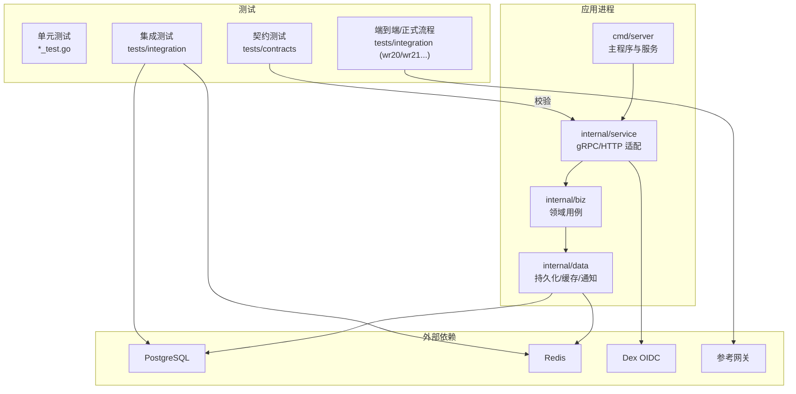
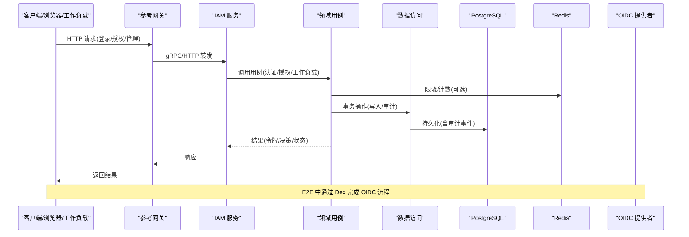
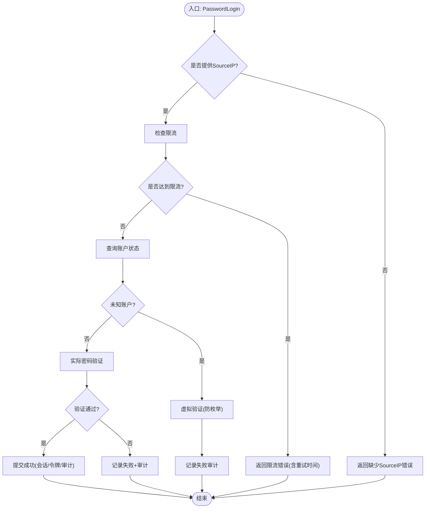
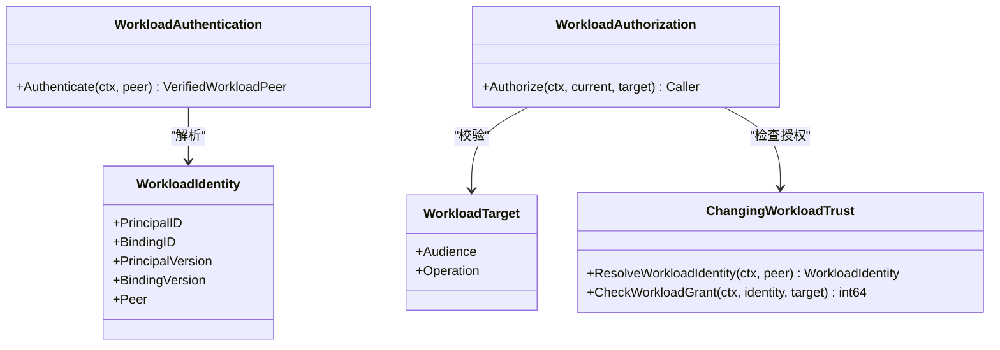
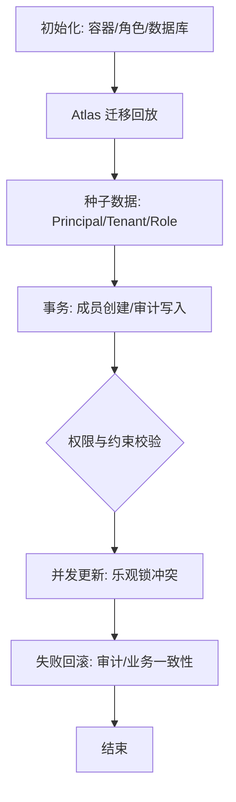
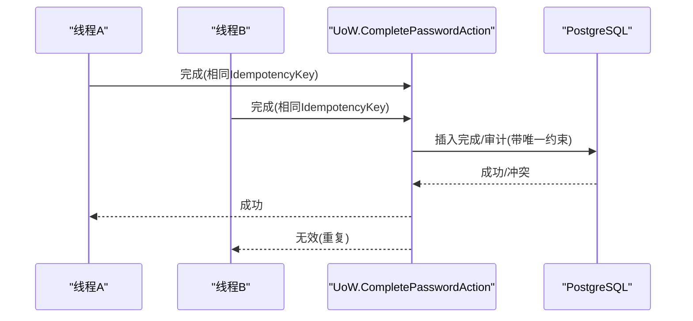
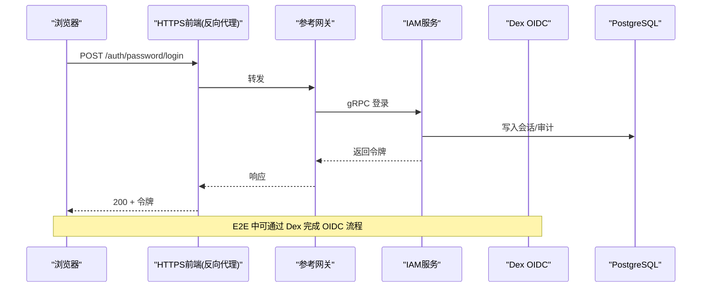
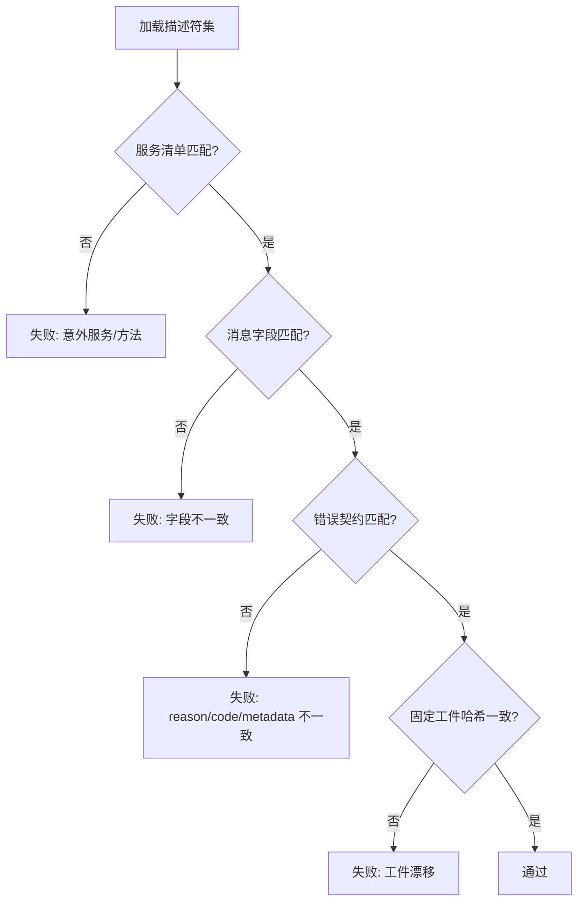
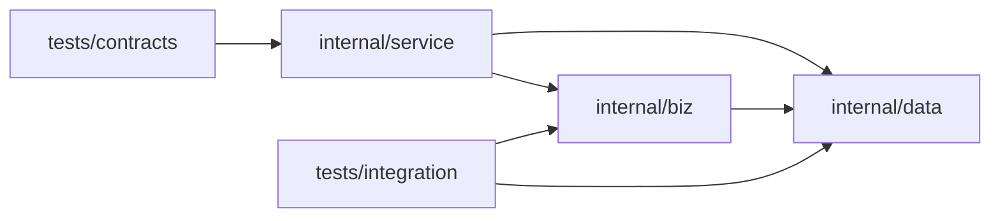

# 测试验证策略

<cite>
**本文引用的文件**
- [cmd/server/app_test.go](file://cmd/server/app_test.go)
- [cmd/server/main_test.go](file://cmd/server/main_test.go)
- [internal/biz/authentication_test.go](file://internal/biz/authentication_test.go)
- [internal/biz/workload_test.go](file://internal/biz/workload_test.go)
- [tests/contracts/contracts_test.go](file://tests/contracts/contracts_test.go)
- [tests/integration/persistence_test.go](file://tests/integration/persistence_test.go)
- [tests/integration/wr20_fixture_test.go](file://tests/integration/wr20_fixture_test.go)
- [tests/integration/password_action_test.go](file://tests/integration/password_action_test.go)
- [tests/integration/workload_bootstrap_test.go](file://tests/integration/workload_bootstrap_test.go)
- [configs/config.yaml](file://configs/config.yaml)
</cite>

## 目录
1. [简介](#简介)
2. [项目结构](#项目结构)
3. [核心组件](#核心组件)
4. [架构总览](#架构总览)
5. [详细组件分析](#详细组件分析)
6. [依赖分析](#依赖分析)
7. [性能考虑](#性能考虑)
8. [故障排查指南](#故障排查指南)
9. [结论](#结论)
10. [附录](#附录)

## 简介
本文件为 IAM 项目的“测试验证策略”文档，覆盖单元测试、集成测试与端到端（E2E）测试的层次结构与实施方法；说明如何编写高质量用例（数据准备、断言、环境搭建），并给出覆盖率要求、性能测试策略、契约测试、Mock 对象使用、并发测试最佳实践，以及 CI/CD 流水线中的自动化执行与质量门禁建议。目标是确保软件质量与回归测试的有效性。

## 项目结构
仓库采用分层组织：API 定义在 api，业务逻辑在 internal/biz，数据访问在 internal/data，服务层在 internal/service，可执行程序在 cmd/server；测试按层次分布在对应包内及 tests 目录：
- 单元测试：位于 internal/*_test.go，聚焦领域用例与边界条件，广泛使用 Mock/Stub/Fixture。
- 集成测试：位于 tests/integration，使用真实 PostgreSQL/Redis/Dex 等外部依赖，通过 testcontainers 启动隔离容器，结合 Atlas 迁移回放。
- 契约测试：位于 tests/contracts，校验 gRPC 描述符、错误契约、消息往返与固定工件哈希。
- E2E/正式流程：基于真实二进制与网关，模拟浏览器/工作负载调用链，验证 TLS、OIDC、授权与审计。

**图表来源**
- [cmd/server/app_test.go:1-120](file://cmd/server/app_test.go#L1-L120)
- [tests/integration/persistence_test.go:562-730](file://tests/integration/persistence_test.go#L562-L730)
- [tests/integration/wr20_fixture_test.go:140-248](file://tests/integration/wr20_fixture_test.go#L140-L248)
- [tests/contracts/contracts_test.go:163-245](file://tests/contracts/contracts_test.go#L163-L245)

**章节来源**
- [cmd/server/app_test.go:1-120](file://cmd/server/app_test.go#L1-L120)
- [tests/integration/persistence_test.go:562-730](file://tests/integration/persistence_test.go#L562-L730)
- [tests/integration/wr20_fixture_test.go:140-248](file://tests/integration/wr20_fixture_test.go#L140-L248)
- [tests/contracts/contracts_test.go:163-245](file://tests/contracts/contracts_test.go#L163-L245)

## 核心组件
- 认证与授权用例：密码登录、会话管理、工作负载身份与授权、租户授权读取器等，具备完善的失败分类、限流、审计与幂等性保障。
- 数据访问层：PostgreSQL 事务与审计事件、乐观锁版本控制、Redis 限流与 API Key 使用统计、通知 Outbox。
- 服务层：gRPC/HTTP 适配、TLS、可观测性、健康检查。
- 测试基础设施：
  - 单元测试：大量 Mock/Stub（如记录器、固定时钟、固定 ID 生成器、允许/拒绝验证器）。
  - 集成测试：testcontainers 启动隔离 PostgreSQL/Redis/Dex，Atlas 迁移回放，真实权限模型与约束。
  - 契约测试：严格校验 gRPC 描述符、错误枚举、消息往返与固定工件哈希。
  - E2E：构建真实二进制，启动参考网关与浏览器代理，完成 OIDC 登录、授权、审计与回滚场景。

**章节来源**
- [internal/biz/authentication_test.go:19-113](file://internal/biz/authentication_test.go#L19-L113)
- [internal/biz/workload_test.go:44-87](file://internal/biz/workload_test.go#L44-L87)
- [tests/integration/persistence_test.go:330-560](file://tests/integration/persistence_test.go#L330-L560)
- [tests/contracts/contracts_test.go:205-245](file://tests/contracts/contracts_test.go#L205-L245)

## 架构总览
下图展示从请求到持久化的关键路径，以及测试在各层的介入点。

**图表来源**
- [tests/integration/wr20_fixture_test.go:140-248](file://tests/integration/wr20_fixture_test.go#L140-L248)
- [tests/integration/persistence_test.go:330-560](file://tests/integration/persistence_test.go#L330-L560)
- [internal/biz/authentication_test.go:19-113](file://internal/biz/authentication_test.go#L19-L113)

## 详细组件分析

### 单元测试：认证用例（密码登录）
- 目标：验证密码登录成功/失败分支、限流、审计、幂等键、依赖不可用时的错误分类、锁定与冷却行为。
- 数据准备：使用静态读取器、固定时钟、固定 ID 生成器、允许/拒绝验证器、记录型 UoW。
- 断言要点：
  - 成功时返回访问令牌与刷新令牌，创建活跃会话与授权授予，审计动作正确。
  - 缺少 SourceIP 时提前失败，不触发限流。
  - 未知账号与已知账号错误均返回统一无效凭据错误，避免信息泄露。
  - Redis 不可用或提交失败时，错误被分类为依赖不可用，且不会误报成功。
  - 锁定状态下使用虚拟验证，防止枚举攻击。
- 并发与幂等：通过 UoW 与限流接口实现幂等与并发安全，测试覆盖提交失败与重置失败的不同路径。

**图表来源**
- [internal/biz/authentication_test.go:19-113](file://internal/biz/authentication_test.go#L19-L113)
- [internal/biz/authentication_test.go:115-167](file://internal/biz/authentication_test.go#L115-L167)
- [internal/biz/authentication_test.go:169-205](file://internal/biz/authentication_test.go#L169-L205)
- [internal/biz/authentication_test.go:207-256](file://internal/biz/authentication_test.go#L207-L256)
- [internal/biz/authentication_test.go:258-314](file://internal/biz/authentication_test.go#L258-L314)
- [internal/biz/authentication_test.go:316-407](file://internal/biz/authentication_test.go#L316-L407)
- [internal/biz/authentication_test.go:409-508](file://internal/biz/authentication_test.go#L409-L508)

**章节来源**
- [internal/biz/authentication_test.go:19-508](file://internal/biz/authentication_test.go#L19-L508)

### 单元测试：工作负载身份与授权
- 目标：验证直接调用者身份解析、授权判定、绑定撤销、依赖失败传播。
- 数据准备：可变信任源（changingWorkloadTrust），注入不同 grant/target/receiver。
- 断言要点：
  - 当前身份必须有效且 grant 匹配目标。
  - 撤销绑定后拒绝授权。
  - 依赖不可用时错误不被掩盖，直接上抛。

**图表来源**
- [internal/biz/workload_test.go:11-42](file://internal/biz/workload_test.go#L11-L42)
- [internal/biz/workload_test.go:44-87](file://internal/biz/workload_test.go#L44-L87)

**章节来源**
- [internal/biz/workload_test.go:44-109](file://internal/biz/workload_test.go#L44-L109)

### 集成测试：数据库与权限模型
- 目标：验证迁移回放、角色权限分离、无 RLS 的表设计、审计必填字段、跨租户隔离、外键约束、乐观锁并发、事务回滚。
- 环境搭建：testcontainers 启动 PostgreSQL，Atlas 运行历史与当前迁移，创建独立角色与数据库，安装工作负载注册表。
- 断言要点：
  - 运行时角色无超管/临时库权限，不能创建表或修改审计表。
  - 审计事件必需字段完整，约束齐全。
  - 跨租户关系被外键阻止，并发更新仅一成功其余冲突。
  - 事务失败不留半写状态，审计与业务数据一致。

**图表来源**
- [tests/integration/persistence_test.go:562-730](file://tests/integration/persistence_test.go#L562-L730)
- [tests/integration/persistence_test.go:330-560](file://tests/integration/persistence_test.go#L330-L560)

**章节来源**
- [tests/integration/persistence_test.go:330-560](file://tests/integration/persistence_test.go#L330-L560)
- [tests/integration/persistence_test.go:562-730](file://tests/integration/persistence_test.go#L562-L730)

### 集成测试：密码动作并发与幂等
- 目标：验证并发完成密码动作的幂等性与审计一致性。
- 数据准备：构造多个并发完成请求，共享 OperationID 与 IdempotencyKey。
- 断言要点：
  - 并发下仅一次成功，其余返回无效动作。
  - 数据库仅产生一条完成记录与审计事件。

**图表来源**
- [tests/integration/password_action_test.go:559-665](file://tests/integration/password_action_test.go#L559-L665)

**章节来源**
- [tests/integration/password_action_test.go:559-665](file://tests/integration/password_action_test.go#L559-L665)

### 端到端测试：WR20 正式流程
- 目标：以真实二进制与参考网关，模拟浏览器登录、OIDC 回调、TLS 终止、授权与审计。
- 环境搭建：
  - 启动隔离 PostgreSQL/Redis。
  - 启动 Dex（固定 Issuer，内存存储，静态用户）。
  - 构建 IAM 二进制，配置 OIDC、Redis、TLS、工作负载注册表。
  - 启动参考网关，设置 TLS 根证书与域名映射。
- 断言要点：
  - 登录流程返回 access_token，后续管理 API 鉴权通过。
  - 审计响应禁止缓存。
  - 全链路 TLS 与域名校验生效。

**图表来源**
- [tests/integration/wr20_fixture_test.go:140-248](file://tests/integration/wr20_fixture_test.go#L140-L248)
- [tests/integration/wr20_fixture_test.go:250-319](file://tests/integration/wr20_fixture_test.go#L250-L319)

**章节来源**
- [tests/integration/wr20_fixture_test.go:140-319](file://tests/integration/wr20_fixture_test.go#L140-L319)

### 契约测试：描述符与错误契约
- 目标：确保 gRPC 服务清单、消息字段、错误枚举与 JSON 契约严格一致，防止漂移。
- 断言要点：
  - IAM/Core 描述符仅包含目标服务与方法。
  - 消息字段集合精确匹配。
  - 错误契约的 domain、reason、grpc_code、required_metadata 与枚举一致。
  - 固定工件与 fixtures 的 SHA256 不变。

**图表来源**
- [tests/contracts/contracts_test.go:163-245](file://tests/contracts/contracts_test.go#L163-L245)
- [tests/contracts/contracts_test.go:284-357](file://tests/contracts/contracts_test.go#L284-L357)
- [tests/contracts/contracts_test.go:359-463](file://tests/contracts/contracts_test.go#L359-L463)

**章节来源**
- [tests/contracts/contracts_test.go:163-463](file://tests/contracts/contracts_test.go#L163-L463)

### 日志与敏感信息保护
- 目标：确保运行时日志对敏感字段进行脱敏，避免泄漏密钥、DSN、密码等。
- 断言要点：
  - 输出中不包含原始敏感值，替换为掩码。
  - 产品标识未遗留历史配置文件名。

**章节来源**
- [cmd/server/main_test.go:9-39](file://cmd/server/main_test.go#L9-L39)

## 依赖分析
- 耦合与内聚：
  - biz 层保持高内聚，依赖 data 抽象接口，便于单元测试中使用 Mock。
  - service 层作为适配层，依赖 biz 与 data，对外暴露 gRPC/HTTP。
  - 集成测试通过 testcontainers 与 Atlas 将外部依赖纳入可控范围。
- 外部依赖：
  - PostgreSQL：用于持久化与审计，集成测试验证权限模型与约束。
  - Redis：用于限流与 API Key 使用统计，集成测试验证异步 flush 与限制。
  - Dex：OIDC 提供者，E2E 中通过反向代理固定 Issuer。
- 潜在循环依赖：未发现明显循环；biz 不直接依赖 service/data 的具体实现。

**图表来源**
- [internal/biz/authentication_test.go:19-113](file://internal/biz/authentication_test.go#L19-L113)
- [tests/integration/persistence_test.go:562-730](file://tests/integration/persistence_test.go#L562-L730)
- [tests/contracts/contracts_test.go:163-245](file://tests/contracts/contracts_test.go#L163-L245)

**章节来源**
- [internal/biz/authentication_test.go:19-113](file://internal/biz/authentication_test.go#L19-L113)
- [tests/integration/persistence_test.go:562-730](file://tests/integration/persistence_test.go#L562-L730)
- [tests/contracts/contracts_test.go:163-245](file://tests/contracts/contracts_test.go#L163-L245)

## 性能考虑
- 并发测试：
  - 使用 goroutine 与 WaitGroup 模拟并发，验证乐观锁冲突与幂等性。
  - 针对密码动作完成、工作负载授权、租户授权读取等场景进行并发断言。
- 资源隔离：
  - 集成测试使用 testcontainers 启动隔离容器，避免共享状态影响。
  - Redis 命名空间隔离，避免跨测试干扰。
- 超时与限流：
  - 配置合理的超时与限流参数，确保测试稳定性与可重现性。
- 基准与压测：
  - 建议在 CI 中加入轻量级基准测试，关注热点路径（登录、授权、审计写入）的延迟与吞吐。
  - 使用 Go benchmark 与自定义压测脚本，结合 Prometheus/Grafana 收集指标。

[本节为通用指导，无需具体文件引用]

## 故障排查指南
- 常见问题：
  - 依赖不可用：Redis/PostgreSQL/Dex 连接失败，应检查容器启动、端口映射、网络与凭据。
  - 迁移失败：Atlas 二进制版本与迁移脚本需匹配，检查环境变量 DP2_ATLAS_BIN。
  - 权限不足：运行时角色不应拥有超管或 DDL 权限，检查角色与表所有权。
  - 日志泄漏：确认运行时日志脱敏规则生效，避免敏感信息输出。
- 定位步骤：
  - 启用详细日志与追踪，记录请求 ID、审计事件。
  - 复现最小用例，逐步缩小范围。
  - 检查数据库约束与索引，确认外键与唯一约束。
  - 使用契约测试快速发现接口漂移。

**章节来源**
- [tests/integration/persistence_test.go:330-560](file://tests/integration/persistence_test.go#L330-L560)
- [cmd/server/main_test.go:9-39](file://cmd/server/main_test.go#L9-L39)

## 结论
本项目建立了多层次的测试体系：单元测试覆盖领域逻辑与边界条件，集成测试验证真实依赖下的权限、事务与并发，契约测试确保接口稳定，端到端测试覆盖完整业务流程。通过严格的 Mock、Fixture 与环境隔离，配合 CI/CD 自动化执行与质量门禁，能够有效保障软件质量与回归测试的有效性。

[本节为总结，无需具体文件引用]

## 附录

### 测试层次与实施方法
- 单元测试：
  - 使用 Mock/Stub/Fixture，固定时钟与 ID 生成器，验证业务规则与错误分类。
  - 推荐覆盖率：语句覆盖率 ≥ 80%，分支覆盖率 ≥ 70%（可根据风险调整）。
- 集成测试：
  - 使用 testcontainers 启动 PostgreSQL/Redis/Dex，Atlas 迁移回放。
  - 验证权限模型、约束、事务原子性、并发冲突与回滚。
- 端到端测试：
  - 构建真实二进制，启动参考网关与浏览器代理，完成 OIDC/TLS/授权/审计。
  - 验证全链路行为与用户体验。

### 高质量测试用例编写要点
- 数据准备：
  - 使用 Fixture 与种子数据，保证可重现性。
  - 隔离命名空间与数据库，避免交叉污染。
- 断言验证：
  - 不仅断言返回值，还断言副作用（审计、缓存、数据库状态）。
  - 使用类型化错误断言，确保错误分类正确。
- 环境搭建：
  - 使用 testcontainers 与 Atlas，确保依赖版本固定。
  - 配置超时与重试，提升稳定性。

### 契约测试与 Mock 使用
- 契约测试：
  - 校验 gRPC 描述符、错误枚举、消息往返与固定工件哈希。
  - 防止接口漂移与破坏性变更。
- Mock 使用：
  - 在单元测试中隔离外部依赖，专注于业务逻辑。
  - 使用记录型 Mock 验证调用次数与参数。

### 并发测试最佳实践
- 使用 goroutine 与 WaitGroup 模拟并发。
- 验证乐观锁冲突、幂等性与事务回滚。
- 避免共享状态，使用隔离命名空间。

### CI/CD 流水线与质量门禁
- 建议阶段：
  - 代码检查：go vet、格式化、模块完整性。
  - 单元测试：快速反馈，覆盖率门禁。
  - 集成测试：真实依赖，并发与权限验证。
  - 契约测试：接口稳定性。
  - 端到端测试：关键业务流程。
  - 安全扫描：govulncheck、SBOM、秘密扫描。
- 门禁规则：
  - 所有阶段必须通过才能合并。
  - 覆盖率低于阈值则失败。
  - 契约测试失败视为破坏性变更。

[本节为通用指导，无需具体文件引用]