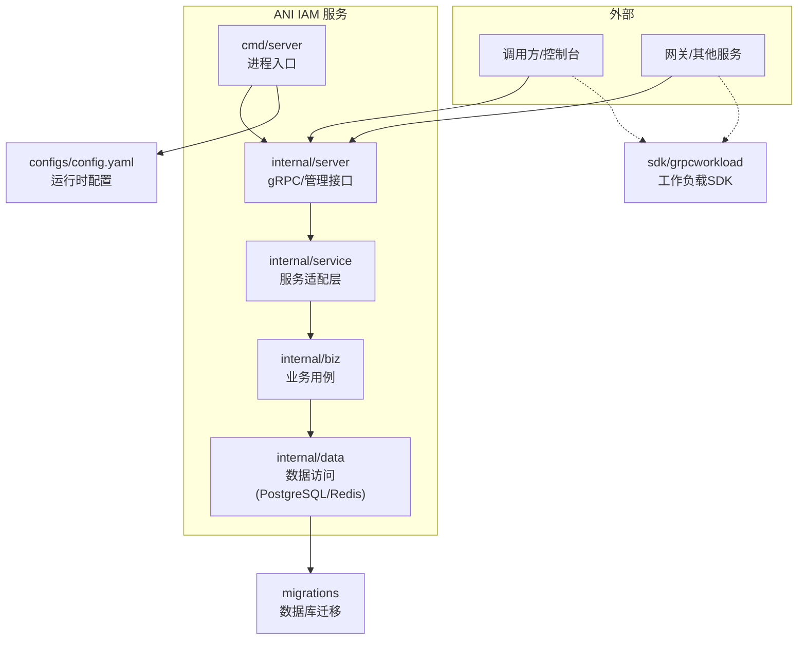
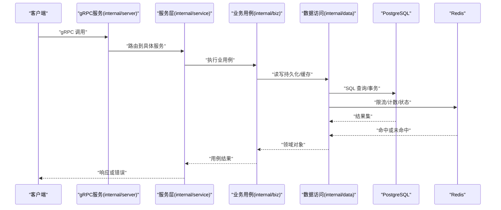
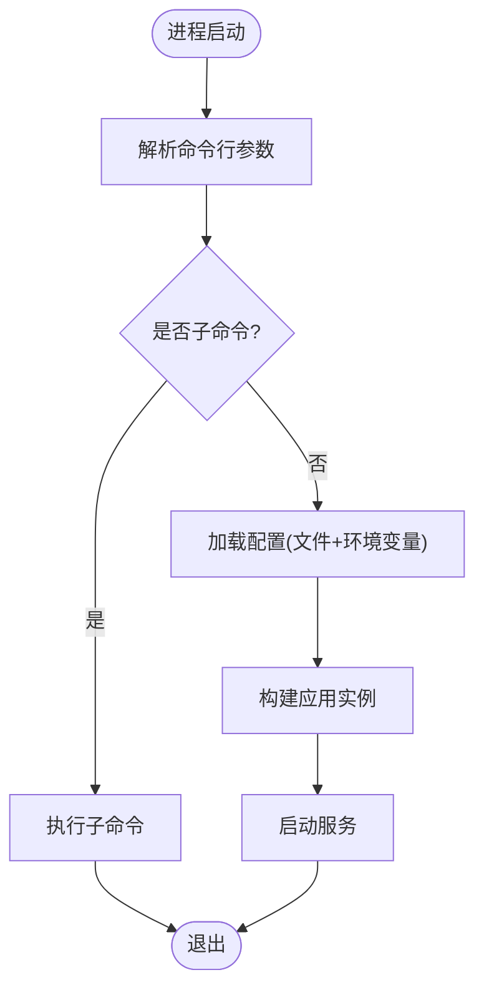
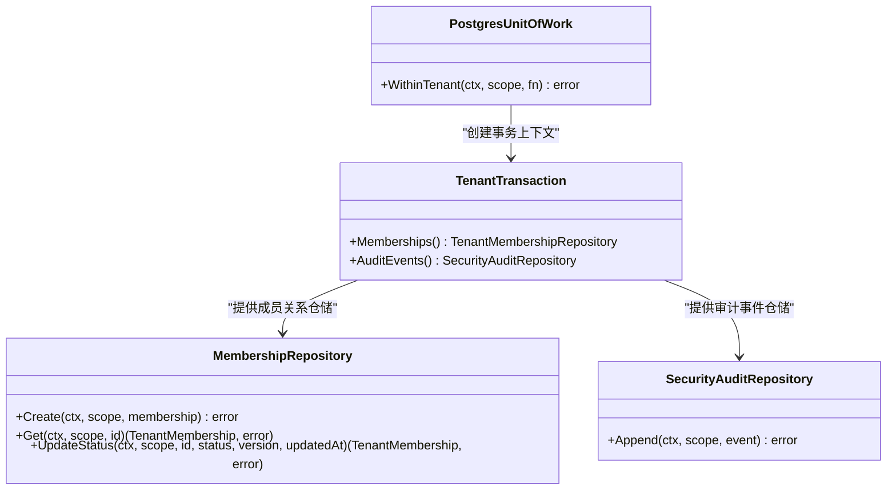
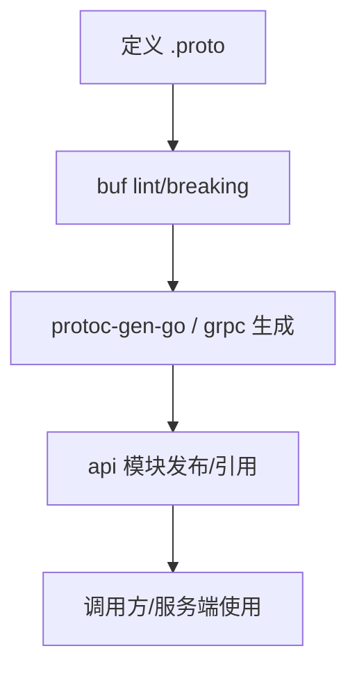
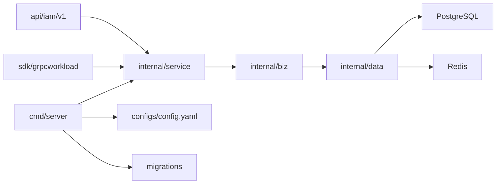

# 开发指南

<cite>
**本文引用的文件**
- [go.mod](file://go.mod)
- [cmd/server/main.go](file://cmd/server/main.go)
- [configs/config.yaml](file://configs/config.yaml)
- [api/README.md](file://api/README.md)
- [sdk/README.md](file://sdk/README.md)
- [internal/conf/conf.proto](file://internal/conf/conf.proto)
- [sqlc.yaml](file://sqlc.yaml)
- [atlas.hcl](file://atlas.hcl)
- [api/iam/v1/buf.yaml](file://api/iam/v1/buf.yaml)
- [tests/integration/vertical_slice_test.go](file://tests/integration/vertical_slice_test.go)
- [tests/integration/api_key_redis_control_test.go](file://tests/integration/api_key_redis_control_test.go)
- [tests/integration/workload_bootstrap_test.go](file://tests/integration/workload_bootstrap_test.go)
- [internal/data/postgres.go](file://internal/data/postgres.go)
</cite>

## 目录
1. [简介](#简介)
2. [项目结构](#项目结构)
3. [核心组件](#核心组件)
4. [架构总览](#架构总览)
5. [详细组件分析](#详细组件分析)
6. [依赖分析](#依赖分析)
7. [性能考虑](#性能考虑)
8. [故障排查指南](#故障排查指南)
9. [结论](#结论)
10. [附录](#附录)

## 简介
本指南面向新贡献者，帮助快速理解 ANI IAM 的项目结构、开发环境与流程。内容涵盖：
- 环境搭建：依赖安装、代码生成、数据库与缓存初始化、测试环境配置
- 代码规范：命名约定、提交规范建议
- 测试策略：单元测试、集成测试、契约测试的编写方法
- 调试与质量：调试技巧、性能分析与代码质量检查工具
- 新功能开发：从需求到交付的完整流程与最佳实践

## 项目结构
仓库采用分层与模块化组织：
- api：对外 gRPC 契约（proto）与生成的 Go 客户端/DTO，独立模块发布
- internal：服务内部实现，按 biz（业务用例）、data（数据访问）、server（gRPC/HTTP 服务）、service（服务层适配）划分
- cmd/server：可执行程序入口，负责启动服务与子命令
- tests：单元测试与集成测试，包含契约测试与端到端场景
- configs：运行时配置示例
- migrations：数据库迁移脚本
- sdk：工作负载 gRPC 适配器 SDK，供调用方与服务端使用
- tools：版本化构建与验证脚本

图表来源
- [cmd/server/main.go:34-101](file://cmd/server/main.go#L34-L101)
- [configs/config.yaml:1-61](file://configs/config.yaml#L1-L61)
- [internal/conf/conf.proto:9-58](file://internal/conf/conf.proto#L9-L58)

章节来源
- [cmd/server/main.go:34-101](file://cmd/server/main.go#L34-L101)
- [configs/config.yaml:1-61](file://configs/config.yaml#L1-L61)
- [internal/conf/conf.proto:9-58](file://internal/conf/conf.proto#L9-L58)

## 核心组件
- 服务入口与生命周期
  - 主程序解析命令行参数与环境变量，加载配置文件，初始化日志与运行时限制，构建并运行应用。
  - 提供多个子命令用于租户快照、工作负载预配等运维任务。
- 配置模型
  - 通过 protobuf 定义 Bootstrap/Server/Runtime 等配置结构，支持 PostgreSQL、Redis、OIDC、通知、访问令牌等运行时参数。
- 数据访问
  - 使用 sqlc 将 SQL 查询生成类型安全的 Go 代码；PostgreSQL 事务封装为 Unit of Work，错误映射为稳定的领域错误。
- 服务层与业务用例
  - service 层将 gRPC 请求转换为 biz 用例调用；biz 层实现认证、授权、会话、工作负载等核心能力。
- 契约与 SDK
  - api 模块维护 gRPC 契约与 DTO；sdk 模块提供工作负载间调用的安全适配器。

章节来源
- [cmd/server/main.go:34-101](file://cmd/server/main.go#L34-L101)
- [internal/conf/conf.proto:9-58](file://internal/conf/conf.proto#L9-L58)
- [internal/data/postgres.go:22-59](file://internal/data/postgres.go#L22-L59)
- [api/README.md:1-8](file://api/README.md#L1-L8)
- [sdk/README.md:1-33](file://sdk/README.md#L1-L33)

## 架构总览
下图展示了请求从入口到数据层的典型路径，以及配置与迁移的作用点。

图表来源
- [cmd/server/main.go:82-101](file://cmd/server/main.go#L82-L101)
- [internal/data/postgres.go:27-59](file://internal/data/postgres.go#L27-L59)
- [configs/config.yaml:22-32](file://configs/config.yaml#L22-L32)

## 详细组件分析

### 服务启动与配置加载
- 入口 main 解析命令行参数，支持多种子命令；默认模式加载配置文件与环境变量，设置日志处理器与 CPU 配额，构建并运行应用。
- 配置通过 protobuf 描述，支持多段配置（服务器、运行时、OIDC、通知、访问令牌等）。

图表来源
- [cmd/server/main.go:34-101](file://cmd/server/main.go#L34-L101)
- [internal/conf/conf.proto:9-58](file://internal/conf/conf.proto#L9-L58)

章节来源
- [cmd/server/main.go:34-101](file://cmd/server/main.go#L34-L101)
- [internal/conf/conf.proto:9-58](file://internal/conf/conf.proto#L9-L58)

### 数据访问与事务边界
- 使用 Unit of Work 封装 PostgreSQL 事务，确保在租户范围内进行一致性操作。
- 错误映射将底层 PG 错误转换为稳定的领域错误，便于上层统一处理。
- sqlc 根据 SQL 与 schema 生成类型安全的查询代码，提升可维护性与安全性。

图表来源
- [internal/data/postgres.go:22-72](file://internal/data/postgres.go#L22-L72)
- [internal/data/postgres.go:74-182](file://internal/data/postgres.go#L74-L182)

章节来源
- [internal/data/postgres.go:22-182](file://internal/data/postgres.go#L22-L182)

### API 契约与代码生成
- 公共 gRPC 契约位于 api/iam/v1，使用 buf 管理依赖、lint 与 breaking 检测。
- 生成 protoc 代码需固定版本，禁止直接编辑生成文件；独立模块版本与发布由 go.mod 管理。

图表来源
- [api/README.md:1-8](file://api/README.md#L1-L8)
- [api/iam/v1/buf.yaml:1-17](file://api/iam/v1/buf.yaml#L1-L17)

章节来源
- [api/README.md:1-8](file://api/README.md#L1-L8)
- [api/iam/v1/buf.yaml:1-17](file://api/iam/v1/buf.yaml#L1-L17)

### 工作负载 SDK 与安全调用
- SDK 提供 mTLS、请求绑定、在线鉴权与短时效凭证，避免离线旁路。
- 接收端校验 TLS 对端、哈希 DTO、在线验证 IAM，未知方法或缺失证据一律拒绝。
- 长时操作可使用 Continuation 保持已准入状态，定期重检。

章节来源
- [sdk/README.md:1-33](file://sdk/README.md#L1-L33)

## 依赖分析
- 运行时依赖
  - gRPC/protobuf：服务通信与序列化
  - PostgreSQL：持久化存储
  - Redis：限流、计数、状态缓存
  - OIDC/Dex：身份提供方集成
  - OpenTelemetry/Prometheus：可观测性
- 构建与生成
  - buf：API 契约管理与变更检测
  - sqlc：SQL 到 Go 的类型安全生成
  - testcontainers：集成测试中拉起真实依赖

图表来源
- [go.mod:5-37](file://go.mod#L5-L37)
- [configs/config.yaml:22-32](file://configs/config.yaml#L22-L32)
- [sqlc.yaml:1-23](file://sqlc.yaml#L1-L23)

章节来源
- [go.mod:5-37](file://go.mod#L5-L37)
- [sqlc.yaml:1-23](file://sqlc.yaml#L1-L23)

## 性能考虑
- 连接与超时
  - 合理设置 PostgreSQL 连接池与超时；Redis 连接与读写超时需匹配业务 SLA。
- 限流与退避
  - 登录限流基于 Redis，注意窗口与阈值配置；失败重试应带指数退避与熔断。
- 令牌与鉴权
  - 访问令牌签发与验证开销可控；避免在热点路径做昂贵计算。
- 可观测性
  - 启用指标与追踪，关注慢查询、连接池饱和与外部依赖延迟。

[本节为通用指导，不直接分析具体文件]

## 故障排查指南
- 常见错误映射
  - 数据库不可用、权限不足、唯一约束冲突、并发版本冲突等会映射为稳定领域错误，便于上层统一处理。
- 集成测试中的健壮性断言
  - 验证 PostgreSQL 不可用时返回稳定的“不可用”状态码与原因信息。
  - 验证 Redis 不可用时限流与用量聚合失败，且未污染本地状态。
- 调试建议
  - 使用结构化日志与追踪键；开启敏感字段过滤。
  - 通过子命令与最小化配置复现问题；结合数据库与缓存快照定位。

章节来源
- [internal/data/postgres.go:195-232](file://internal/data/postgres.go#L195-L232)
- [tests/integration/vertical_slice_test.go:54-86](file://tests/integration/vertical_slice_test.go#L54-L86)
- [tests/integration/api_key_redis_control_test.go:154-184](file://tests/integration/api_key_redis_control_test.go#L154-L184)

## 结论
ANI IAM 以清晰的层次结构与强类型数据访问为基础，配合严格的 API 契约与工作负载 SDK，实现了高内聚、低耦合的可扩展认证与授权平台。遵循本指南的环境搭建、代码生成、测试策略与质量实践，有助于新贡献者高效参与开发与交付。

## 附录

### 开发环境搭建
- 前置条件
  - Go 工具链（版本见 go.mod）
  - Docker（用于集成测试拉起依赖）
  - PostgreSQL、Redis（本地或容器）
- 依赖安装
  - 在项目根目录执行依赖拉取与校验。
- 代码生成
  - API 契约：使用 buf 进行 lint 与 breaking 检查，再生成 Go 代码。
  - 数据访问：使用 sqlc 根据 migrations 与 queries 生成类型安全代码。
- 数据库与缓存
  - 使用 Atlas 或迁移工具执行 migrations。
  - 准备 Redis 实例并配置命名空间与超时。
- 测试环境
  - 单元测试：无需外部依赖。
  - 集成测试：使用 testcontainers 拉起 PostgreSQL/Redis，或通过本地服务运行。

章节来源
- [go.mod:1-37](file://go.mod#L1-L37)
- [api/README.md:1-8](file://api/README.md#L1-L8)
- [sqlc.yaml:1-23](file://sqlc.yaml#L1-L23)
- [atlas.hcl:1-8](file://atlas.hcl#L1-L8)

### 代码规范与提交规范建议
- 命名约定
  - 包名小写、简洁；函数与变量遵循 Go 惯例；配置项使用下划线分隔。
- 代码风格
  - 使用 gofmt/gofmt 风格；避免魔法数字；错误处理显式且一致。
- 提交规范
  - 提交信息包含变更范围与简要说明；涉及 API 变更需同步更新契约与生成代码。
- 变更控制
  - 修改 proto 后需重新生成代码并通过 buf lint/breaking。
  - 修改 SQL 需新增迁移并在测试中验证。

[本节为通用建议，不直接分析具体文件]

### 测试策略
- 单元测试
  - 覆盖业务用例与数据访问关键路径；使用桩与固定时钟简化时间相关逻辑。
- 集成测试
  - 使用真实 PostgreSQL/Redis；验证错误映射、限流、幂等与事务边界。
- 契约测试
  - 基于 fixtures 与 descriptors 验证 API 行为与兼容性。
- 端到端测试
  - 模拟网关→IAM→工作负载的完整调用链路，验证 mTLS、在线鉴权与策略版本。

章节来源
- [tests/integration/vertical_slice_test.go:26-86](file://tests/integration/vertical_slice_test.go#L26-L86)
- [tests/integration/api_key_redis_control_test.go:20-184](file://tests/integration/api_key_redis_control_test.go#L20-L184)
- [tests/integration/workload_bootstrap_test.go:194-248](file://tests/integration/workload_bootstrap_test.go#L194-L248)

### 调试技巧与质量工具
- 调试
  - 使用结构化日志与追踪键；在关键路径打印必要上下文。
  - 通过子命令隔离问题域；最小化配置复现场景。
- 性能分析
  - 使用 pprof 采集 CPU/内存；观察连接池与锁竞争。
  - 监控 Prometheus 指标，关注延迟与错误率。
- 代码质量
  - 静态检查：vet、staticcheck。
  - 格式化：gofmt。
  - 契约检查：buf lint/breaking。
  - 生成代码：sqlc 与 protoc 生成后需通过测试。

[本节为通用指导，不直接分析具体文件]

### 新功能开发流程与最佳实践
- 需求与设计
  - 明确输入输出、边界与错误；评估对 API 与数据模型的影响。
- 实现
  - 先写契约与用例，再实现服务层与数据访问；保证错误映射与幂等。
- 测试
  - 单元覆盖核心逻辑；集成测试覆盖外部依赖；契约测试保障兼容。
- 文档与发布
  - 更新 README/ADR；记录配置项与部署要点；按模块版本管理。

[本节为通用指导，不直接分析具体文件]