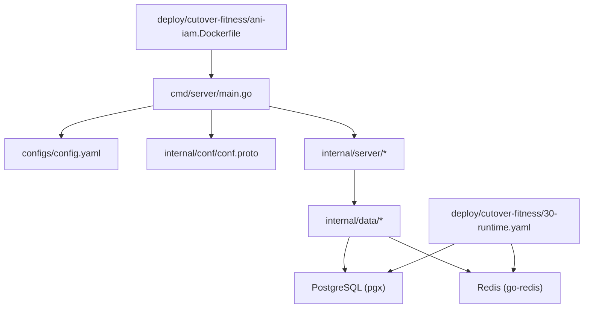
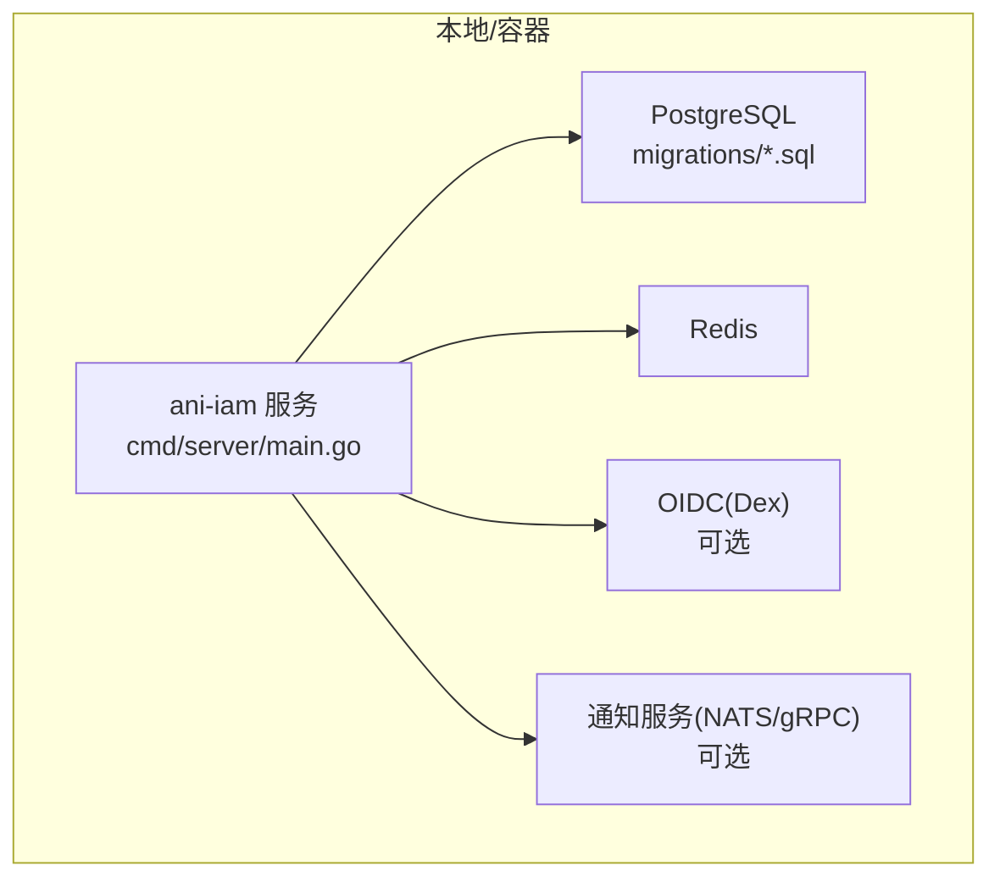
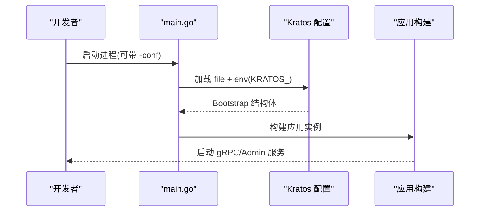
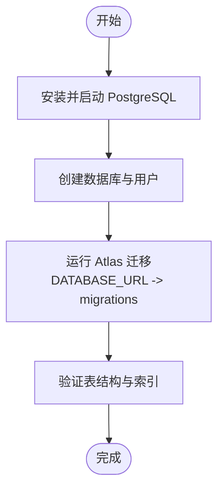
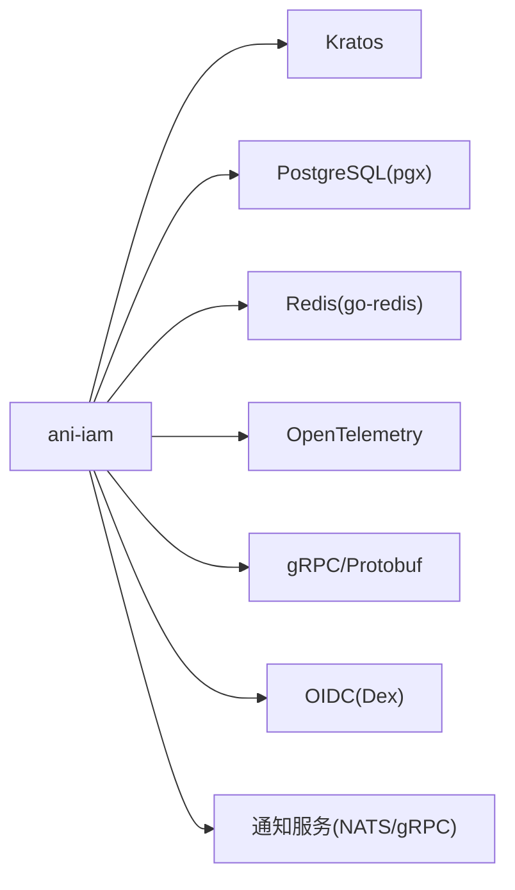

# 开发环境搭建

<cite>
**本文引用的文件**
- [go.mod](file://go.mod)
- [configs/config.yaml](file://configs/config.yaml)
- [cmd/server/main.go](file://cmd/server/main.go)
- [internal/conf/conf.proto](file://internal/conf/conf.proto)
- [sqlc.yaml](file://sqlc.yaml)
- [atlas.hcl](file://atlas.hcl)
- [migrations/202609040001_persistence_foundation.sql](file://migrations/202609040001_persistence_foundation.sql)
- [deploy/cutover-fitness/ani-iam.Dockerfile](file://deploy/cutover-fitness/ani-iam.Dockerfile)
- [deploy/cutover-fitness/30-runtime.yaml](file://deploy/cutover-fitness/30-runtime.yaml)
- [api/README.md](file://api/README.md)
- [internal/data/postgres.go](file://internal/data/postgres.go)
</cite>

## 目录
1. [简介](#简介)
2. [项目结构](#项目结构)
3. [核心组件](#核心组件)
4. [架构总览](#架构总览)
5. [详细组件分析](#详细组件分析)
6. [依赖关系分析](#依赖关系分析)
7. [性能与可观测性](#性能与可观测性)
8. [故障排查指南](#故障排查指南)
9. [结论](#结论)
10. [附录：本地快速启动清单](#附录本地快速启动清单)

## 简介
本指南面向新加入的开发者，目标是帮助你在本地快速搭建完整的 IAM（身份与访问管理）服务开发环境。内容涵盖：
- Go 语言环境与依赖管理
- Kratos 框架配置与启动流程
- PostgreSQL 与 Redis 的安装与连接
- Docker 镜像构建与服务编排（含 Kubernetes 示例）
- 配置文件与环境变量说明
- 常见问题定位与解决

## 项目结构
仓库采用分层组织方式：
- api：gRPC 接口定义与生成代码
- cmd/server：应用入口、命令行子命令、配置加载与启动
- internal：业务逻辑、数据访问、服务层、服务器实现
- configs：默认配置文件
- migrations：数据库迁移脚本
- deploy：Dockerfile 与 Kubernetes 部署示例
- tools：辅助工具与测试脚本

图表来源
- [cmd/server/main.go:34-101](file://cmd/server/main.go#L34-L101)
- [configs/config.yaml:1-61](file://configs/config.yaml#L1-L61)
- [internal/conf/conf.proto:9-58](file://internal/conf/conf.proto#L9-L58)
- [deploy/cutover-fitness/ani-iam.Dockerfile:1-15](file://deploy/cutover-fitness/ani-iam.Dockerfile#L1-L15)
- [deploy/cutover-fitness/30-runtime.yaml:26-64](file://deploy/cutover-fitness/30-runtime.yaml#L26-L64)

章节来源
- [cmd/server/main.go:34-101](file://cmd/server/main.go#L34-L101)
- [configs/config.yaml:1-61](file://configs/config.yaml#L1-L61)
- [internal/conf/conf.proto:9-58](file://internal/conf/conf.proto#L9-L58)

## 核心组件
- 运行时入口与配置加载
  - 通过命令行参数指定配置文件路径，并支持环境变量覆盖（前缀 KRATOS_）。
  - 使用 Kratos 配置源组合 file + env，加载后映射到 Bootstrap 结构体。
- 服务器与端口
  - gRPC 监听地址与 TLS 证书路径在配置中声明。
  - Admin 健康检查端点用于就绪探测。
- 数据层
  - PostgreSQL：通过 pgx 连接池访问，事务与错误映射封装。
  - Redis：用于限流、令牌缓存、API Key 用量聚合等。
- 外部依赖
  - OIDC（如 Dex）、通知服务（NATS/gRPC）、工作负载注册表等。

章节来源
- [cmd/server/main.go:34-101](file://cmd/server/main.go#L34-L101)
- [configs/config.yaml:1-61](file://configs/config.yaml#L1-L61)
- [internal/data/postgres.go:27-59](file://internal/data/postgres.go#L27-L59)

## 架构总览
下图展示了本地开发时各组件的交互关系：应用从配置文件读取运行参数，连接 PostgreSQL 与 Redis，并通过 gRPC 对外提供服务；Kubernetes 示例中，PostgreSQL、Redis、IAM、Gateway 等容器在同一 Pod 或命名空间内协作。

图表来源
- [cmd/server/main.go:34-101](file://cmd/server/main.go#L34-L101)
- [configs/config.yaml:22-61](file://configs/config.yaml#L22-L61)
- [deploy/cutover-fitness/30-runtime.yaml:26-64](file://deploy/cutover-fitness/30-runtime.yaml#L26-L64)

## 详细组件分析

### Go 环境与依赖管理
- 版本要求
  - Go 版本由 go.mod 指定，请使用对应版本以保持一致性。
- 依赖安装
  - 在项目根目录执行依赖拉取与校验。
- API 契约
  - gRPC 接口位于 api/iam/v1，使用 buf 进行管理与生成，遵循其 README 中的版本与生成约束。

章节来源
- [go.mod:1-37](file://go.mod#L1-L37)
- [api/README.md:1-8](file://api/README.md#L1-L8)

### Kratos 框架与启动流程
- 启动入口
  - main 函数解析命令行参数，初始化日志与 CPU 配额，加载配置并构建应用。
- 配置来源
  - 优先从文件加载，其次合并环境变量（前缀 KRATOS_），扫描为 Bootstrap 结构体。
- 运行模式
  - 除主服务外，还支持若干 CLI 子命令（例如租户快照、工作负载预置等）。

图表来源
- [cmd/server/main.go:34-101](file://cmd/server/main.go#L34-L101)
- [internal/conf/conf.proto:9-58](file://internal/conf/conf.proto#L9-L58)

章节来源
- [cmd/server/main.go:34-101](file://cmd/server/main.go#L34-L101)
- [internal/conf/conf.proto:9-58](file://internal/conf/conf.proto#L9-L58)

### PostgreSQL 安装与迁移
- 本地安装
  - 安装 PostgreSQL 并创建数据库与用户，确保网络可达且 sslmode=disable（本地调试）。
- 迁移工具
  - 使用 Atlas 管理迁移，配置文件指向 migrations 目录，通过 DATABASE_URL 环境变量注入连接串。
- 迁移脚本
  - 所有 SQL 迁移脚本位于 migrations 目录，按时间戳顺序执行。
- 数据访问
  - 使用 sqlc 生成查询代码，连接池基于 pgx/v5。

图表来源
- [atlas.hcl:1-8](file://atlas.hcl#L1-L8)
- [sqlc.yaml:1-23](file://sqlc.yaml#L1-L23)
- [internal/data/postgres.go:27-59](file://internal/data/postgres.go#L27-L59)

章节来源
- [atlas.hcl:1-8](file://atlas.hcl#L1-L8)
- [sqlc.yaml:1-23](file://sqlc.yaml#L1-L23)
- [internal/data/postgres.go:27-59](file://internal/data/postgres.go#L27-L59)

### Redis 安装与配置
- 本地安装
  - 安装并启动 Redis，设置密码（可选），确认端口可达。
- 配置项
  - 地址、数据库编号、命名空间、登录限制与窗口、超时等均在配置文件中定义。
- 用途
  - 登录限流、API Key 用量聚合、会话与令牌缓存等。

章节来源
- [configs/config.yaml:24-32](file://configs/config.yaml#L24-L32)

### 配置文件与环境变量
- 配置文件位置
  - 默认路径通过命令行参数传入，示例为 configs/config.yaml。
- 关键配置段
  - server.grpc：网络、地址、超时、TLS 证书路径与客户端 CA。
  - runtime.postgresql：DSN 连接串。
  - runtime.redis：地址、库号、命名空间、限流与超时。
  - runtime.access_token：签发者、活动密钥 ID、私钥文件路径。
  - runtime.notification：通知服务地址、证书、出站队列键文件、URL 基址与国际化设置。
  - runtime.oidc：提供商、发行者 URL、客户端 ID、回调地址、HTTP 超时。
- 环境变量覆盖
  - 通过 KRATOS_ 前缀的环境变量覆盖配置项（Kratos 配置机制）。

章节来源
- [configs/config.yaml:1-61](file://configs/config.yaml#L1-L61)
- [cmd/server/main.go:82-94](file://cmd/server/main.go#L82-L94)
- [internal/conf/conf.proto:15-58](file://internal/conf/conf.proto#L15-L58)

### Docker 镜像构建
- 多阶段构建
  - 第一阶段使用 Go 镜像编译二进制，第二阶段使用 Alpine 镜像打包运行。
- 暴露端口
  - 暴露 gRPC 与管理端口。
- 运行入口
  - 入口命令为生成的二进制，可通过 -conf 指定配置文件路径。

章节来源
- [deploy/cutover-fitness/ani-iam.Dockerfile:1-15](file://deploy/cutover-fitness/ani-iam.Dockerfile#L1-L15)
- [cmd/server/main.go:30-32](file://cmd/server/main.go#L30-L32)

### Kubernetes 服务编排（示例）
- 组件编排
  - 示例 Deployment 包含 PostgreSQL、Redis、IAM、Gateway 等容器，并通过 Secret/ConfigMap 注入配置与凭据。
- 健康检查
  - 各容器均定义了就绪探针，确保依赖就绪后再启动上层服务。
- 安全与隔离
  - 通过只读挂载 Secrets、禁用自动挂载 ServiceAccount Token 等方式提升安全性。

章节来源
- [deploy/cutover-fitness/30-runtime.yaml:26-64](file://deploy/cutover-fitness/30-runtime.yaml#L26-L64)
- [deploy/cutover-fitness/30-runtime.yaml:187-225](file://deploy/cutover-fitness/30-runtime.yaml#L187-L225)
- [deploy/cutover-fitness/30-runtime.yaml:238-289](file://deploy/cutover-fitness/30-runtime.yaml#L238-L289)

## 依赖关系分析
- 运行时依赖
  - Kratos：配置、日志、追踪集成。
  - pgx/v5：PostgreSQL 驱动与连接池。
  - go-redis：Redis 客户端。
  - OpenTelemetry：指标与追踪导出。
  - gRPC/Protobuf：服务通信协议。
- 外部服务
  - OIDC（Dex）：第三方身份提供方。
  - 通知服务（NATS/gRPC）：异步消息与邮件邀请。
  - 工作负载注册表：目标工作负载清单与校验。

图表来源
- [go.mod:5-37](file://go.mod#L5-L37)
- [configs/config.yaml:22-61](file://configs/config.yaml#L22-L61)

章节来源
- [go.mod:5-37](file://go.mod#L5-L37)
- [configs/config.yaml:22-61](file://configs/config.yaml#L22-L61)

## 性能与可观测性
- 性能
  - 合理设置 Redis 超时与连接数，避免阻塞。
  - PostgreSQL 连接池大小与超时根据并发需求调优。
- 可观测性
  - 启用 OpenTelemetry 导出指标与追踪，便于问题定位。
  - 日志输出已过滤敏感字段（如密码、令牌、DSN 等）。

章节来源
- [cmd/server/main.go:104-131](file://cmd/server/main.go#L104-L131)
- [go.mod:24-28](file://go.mod#L24-L28)

## 故障排查指南
- 无法连接 PostgreSQL
  - 检查 DSN、用户名、密码、端口与 sslmode。
  - 确认迁移是否已执行，表结构是否存在。
  - 参考事务与错误映射逻辑，定位具体错误码。
- 无法连接 Redis
  - 检查地址、端口、密码与数据库编号。
  - 关注限流与用量聚合相关功能是否因 Redis 不可用而失败。
- 启动时报配置错误
  - 确认配置文件路径正确，环境变量前缀为 KRATOS_。
  - 核对必填字段（如 gRPC 地址、PostgreSQL DSN、Redis 地址等）。
- TLS 证书问题
  - 确认证书与私钥文件路径存在且可读。
  - 检查客户端 CA 与 DNS 名称匹配。
- 健康检查失败
  - 使用 Admin 端点进行就绪探测，确认服务内部依赖状态。

章节来源
- [internal/data/postgres.go:195-232](file://internal/data/postgres.go#L195-L232)
- [configs/config.yaml:22-61](file://configs/config.yaml#L22-L61)
- [cmd/server/main.go:82-101](file://cmd/server/main.go#L82-L101)

## 结论
通过以上步骤，你可以在本地快速搭建 IAM 服务的完整开发环境，包括 Go 环境、Kratos 配置、PostgreSQL 与 Redis 服务、以及 Docker/Kubernetes 的容器化部署。建议首次搭建时严格遵循配置文件与迁移脚本，逐步引入 OIDC 与通知服务等外部依赖，以便分阶段验证。

## 附录：本地快速启动清单
- 准备环境
  - 安装 Go（版本见 go.mod）、PostgreSQL、Redis。
- 数据库
  - 创建数据库与用户，执行 Atlas 迁移（migrations 目录）。
- 配置
  - 编辑 configs/config.yaml，填写 PostgreSQL DSN、Redis 地址、OIDC 与通知服务信息。
- 启动服务
  - 运行二进制并传入 -conf 参数，或使用 Docker 镜像运行。
- 验证
  - 通过 Admin 健康检查端点确认服务就绪。
  - 调用 gRPC 接口或网关进行端到端验证。