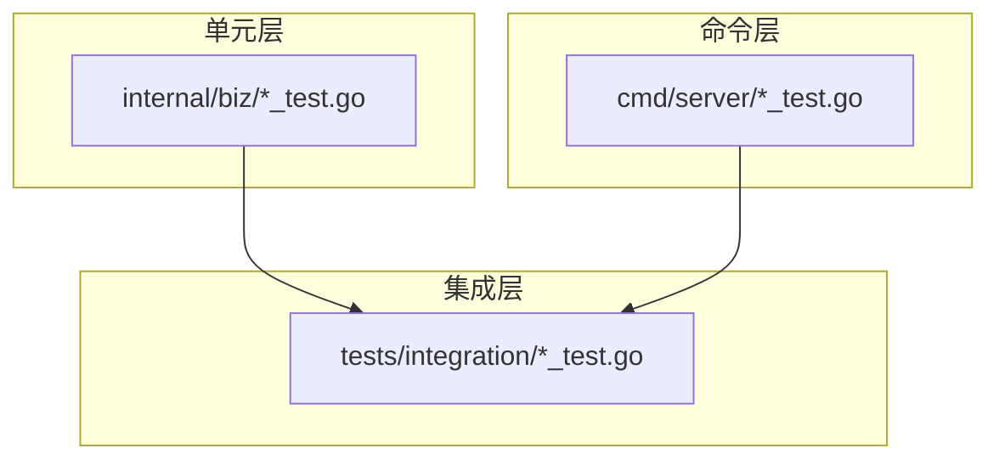
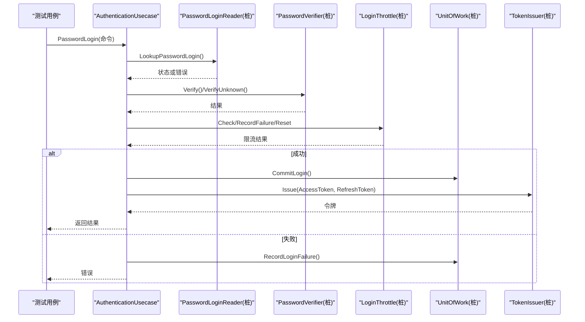
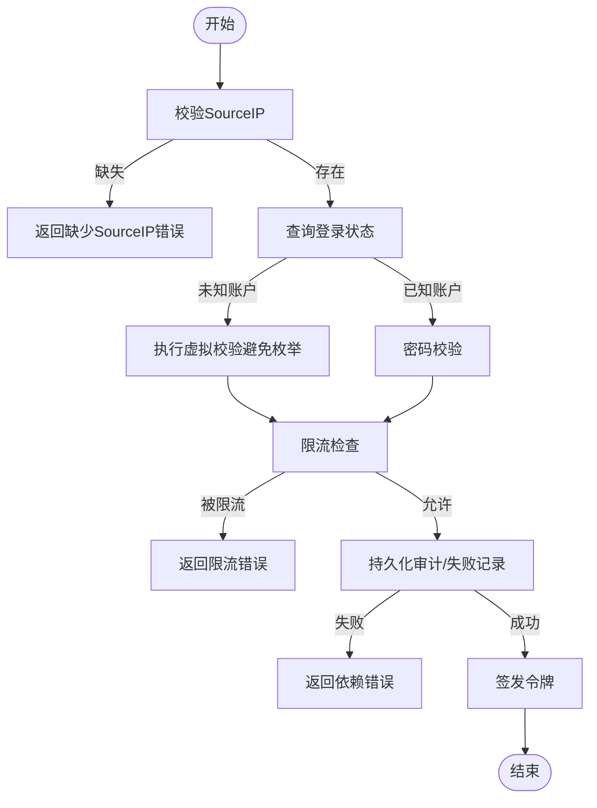
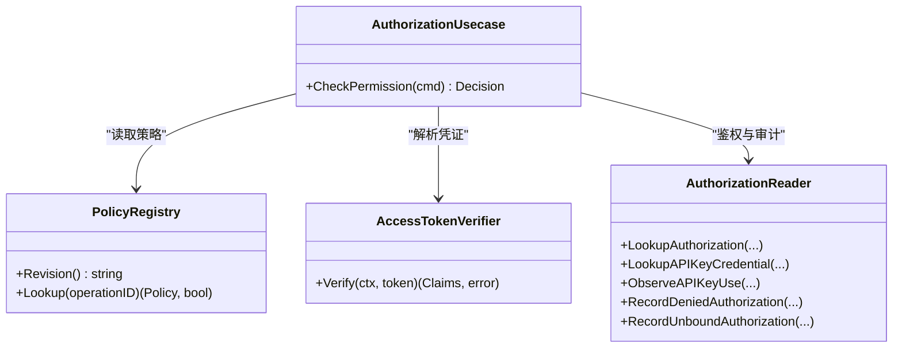
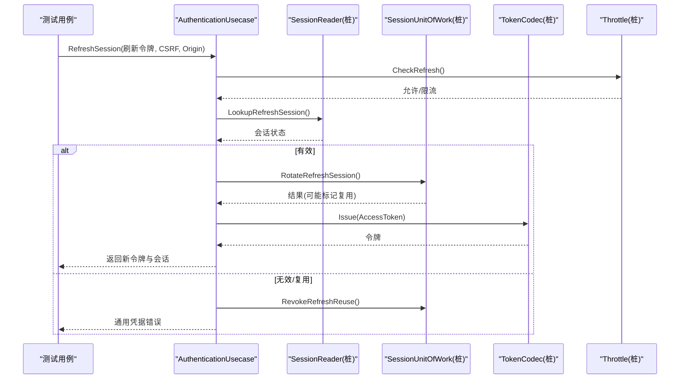
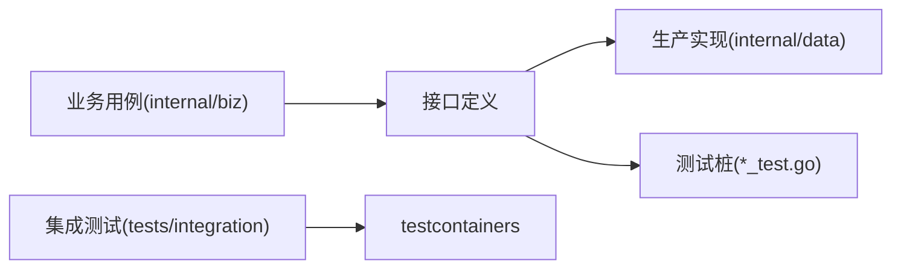

# 单元测试

<cite>
**本文引用的文件**
- [authentication_test.go](file://internal/biz/authentication_test.go)
- [authorization_test.go](file://internal/biz/authorization_test.go)
- [session_test.go](file://internal/biz/session_test.go)
- [workload_test.go](file://internal/biz/workload_test.go)
- [main_test.go](file://cmd/server/main_test.go)
- [isolation_test.go](file://tests/integration/isolation_test.go)
- [wr20_authentication_test.go](file://tests/integration/wr20_authentication_test.go)
- [go.mod](file://go.mod)
</cite>

## 目录
1. [简介](#简介)
2. [项目结构](#项目结构)
3. [核心组件](#核心组件)
4. [架构总览](#架构总览)
5. [详细组件分析](#详细组件分析)
6. [依赖分析](#依赖分析)
7. [性能考虑](#性能考虑)
8. [故障排查指南](#故障排查指南)
9. [结论](#结论)
10. [附录](#附录)

## 简介
本指南面向Go语言业务逻辑层的单元测试实践，结合本项目在认证、授权、会话管理等核心领域的测试实现，总结以下要点：
- 测试文件命名与组织规范
- 测试函数结构与断言方式
- Mock外部依赖的惯用模式（接口+内联桩）
- 边界条件与错误处理场景覆盖
- 测试数据准备与环境隔离
- 并发测试策略
- 覆盖率统计与报告生成方法

## 项目结构
本项目将单元测试按层次划分：
- 单元层：位于 internal/* 下的 *_test.go，聚焦用例与领域逻辑，通过内联桩模拟外部依赖。
- 集成层：位于 tests/integration/*，使用 testcontainers 启动真实依赖容器，验证端到端流程。
- 命令层：cmd/server/*_test.go，验证服务构建、日志脱敏等横切关注点。

**章节来源**
- [go.mod:1-119](file://go.mod#L1-L119)

## 核心组件
围绕认证、授权、会话三大核心能力，项目提供了丰富的单测样例，体现以下最佳实践：
- 以接口抽象外部依赖，测试中提供轻量桩（stub/recorder/failing），便于精确控制行为与观测调用。
- 使用标准库 testing 包进行结构化测试，配合 t.Run 子测试组织多分支场景。
- 对关键副作用（如审计事件、令牌签发、限流记录）通过“记录型”桩进行断言。
- 对并发与幂等性场景，通过并发刷新、重复登录等用例验证一致性。

**章节来源**
- [authentication_test.go:19-167](file://internal/biz/authentication_test.go#L19-L167)
- [authorization_test.go:15-178](file://internal/biz/authorization_test.go#L15-L178)
- [session_test.go:13-144](file://internal/biz/session_test.go#L13-L144)

## 架构总览
下图展示认证用例在测试中的典型调用链：输入命令经用例编排，依次访问读取器、密码校验器、限流器、工作单元、令牌签发器等依赖；测试通过内联桩控制返回值并断言副作用。

**图表来源**
- [authentication_test.go:19-167](file://internal/biz/authentication_test.go#L19-L167)

**章节来源**
- [authentication_test.go:19-167](file://internal/biz/authentication_test.go#L19-L167)

## 详细组件分析

### 认证（Authentication）
- 测试目标
  - 正常登录：创建活跃会话与授权许可，签发访问令牌与刷新令牌，记录审计事件。
  - 安全与风控：要求SourceIP、统一无效凭据错误、未知账户走虚拟校验避免枚举、锁定期重试返回限流。
  - 依赖故障分类：Redis不可用、持久化冲突等归类为依赖错误，不泄露内部细节。
- 关键断言点
  - 返回令牌、会话状态、授权版本、审计动作与边界。
  - 限流器调用次数与参数（检查/失败/重置）。
  - 工作单元提交或失败记录的字段完整性。
- 桩与隔离
  - staticPasswordLoginReader：固定返回状态或错误。
  - accepting/rejectingPasswordVerifier：控制密码校验结果。
  - recordingLoginThrottle：记录Check/RecordFailure/Reset调用及参数。
  - recordingLoginUnitOfWork：捕获Commit/RecordFailure事件。
  - fixedAuthClock/fixedIDs：固定时间与ID生成，保证确定性。

**图表来源**
- [authentication_test.go:88-167](file://internal/biz/authentication_test.go#L88-L167)
- [authentication_test.go:169-205](file://internal/biz/authentication_test.go#L169-L205)
- [authentication_test.go:258-314](file://internal/biz/authentication_test.go#L258-L314)

**章节来源**
- [authentication_test.go:19-167](file://internal/biz/authentication_test.go#L19-L167)
- [authentication_test.go:169-205](file://internal/biz/authentication_test.go#L169-L205)
- [authentication_test.go:258-314](file://internal/biz/authentication_test.go#L258-L314)

### 授权（Authorization）
- 测试目标
  - 基于策略注册的操作权限检查，支持Access Token与API Key两种凭证。
  - 跨租户拒绝、未注册操作快速失败、策略版本不一致快速失败。
  - 允许时返回义务（Obligations），拒绝时记录审计事件。
- 关键断言点
  - 决策ID、是否允许、拒绝原因、审计事件边界与认证方式。
  - API Key鉴权路径与使用观察调用。
  - 非租户策略（平台级）不应触发存储依赖。
- 桩与隔离
  - staticPolicyRegistry：固定策略与修订版本。
  - staticAccessTokenVerifier：注入Claims或错误。
  - recordingAuthorizationReader：记录鉴权查找、API Key查找/使用、拒绝审计等。

**图表来源**
- [authorization_test.go:15-178](file://internal/biz/authorization_test.go#L15-L178)
- [authorization_test.go:398-496](file://internal/biz/authorization_test.go#L398-L496)

**章节来源**
- [authorization_test.go:15-178](file://internal/biz/authorization_test.go#L15-L178)
- [authorization_test.go:398-496](file://internal/biz/authorization_test.go#L398-L496)

### 会话（Session）
- 测试目标
  - 刷新会话：轮换刷新令牌族、滑动空闲过期时间、签发新访问令牌。
  - 注销会话：撤销当前会话，幂等处理未知或已撤销会话。
  - 切换租户：在当前会话下创建独立边界，签发新的租户上下文令牌。
  - 并发与复用：并发刷新仅一次轮换，另一次视为复用并撤销原令牌族。
- 关键断言点
  - 刷新后令牌、会话版本、过期时间、审计事件。
  - 复用场景下返回通用凭据错误且不签发新令牌。
  - Boss受众限制与平台授权前置检查。
- 桩与隔离
  - recordingSessionContinuityUnitOfWork：捕获旋转、复用、注销、切换租户等变更。
  - recordingSessionTokenCodec：记录签发与验证的Claims。
  - recordingSessionThrottle：记录刷新限流检查。

**图表来源**
- [session_test.go:13-144](file://internal/biz/session_test.go#L13-L144)
- [session_test.go:353-394](file://internal/biz/session_test.go#L353-L394)

**章节来源**
- [session_test.go:13-144](file://internal/biz/session_test.go#L13-L144)
- [session_test.go:353-394](file://internal/biz/session_test.go#L353-L394)

### 工作负载身份与授权（Workload）
- 测试目标
  - 直接调用者认证与授权：校验绑定有效性、授予范围、目标匹配。
  - 推理调用授权：要求精确的当前授予，拒绝未注册目标。
- 关键断言点
  - 上下文传播的直接调用者身份。
  - 绑定撤销、授予撤销、目标不匹配时的拒绝。
  - 依赖失败透传。

**章节来源**
- [workload_test.go:44-87](file://internal/biz/workload_test.go#L44-L87)
- [workload_test.go:89-109](file://internal/biz/workload_test.go#L89-L109)

### 服务与日志脱敏
- 测试目标
  - 运行时日志对敏感字段进行脱敏，确保不会输出密钥、DSN、密码等。
- 关键断言点
  - 日志行不包含敏感值，且占位符数量正确。

**章节来源**
- [main_test.go:9-39](file://cmd/server/main_test.go#L9-L39)

## 依赖分析
- 测试依赖管理
  - 使用 Go 模块管理依赖，集成测试引入 testcontainers 与 Redis 客户端，用于启动隔离容器。
  - 单元层通过内联桩避免对外部服务的实际依赖，提升可重复性与速度。
- 耦合与内聚
  - 业务用例通过接口解耦外部系统（数据库、缓存、令牌签发、限流），测试易于替换与观测。
  - 测试桩集中在 *_test.go 文件中，保持被测代码纯净。

**图表来源**
- [go.mod:1-119](file://go.mod#L1-L119)
- [isolation_test.go:24-137](file://tests/integration/isolation_test.go#L24-L137)

**章节来源**
- [go.mod:1-119](file://go.mod#L1-L119)
- [isolation_test.go:24-137](file://tests/integration/isolation_test.go#L24-L137)

## 性能考虑
- 单元层测试无外部IO，运行速度快，适合频繁回归。
- 集成测试使用容器隔离资源，建议按需启用（通过构建标签），避免本地环境开销。
- 并发测试应控制并发度与超时，避免资源争用导致不稳定。

[本节为通用指导，无需特定文件引用]

## 故障排查指南
- 常见问题定位
  - 依赖不可用：认证/授权/会话用例将依赖错误分类为“依赖不可用”，便于上层区分业务错误与基础设施错误。
  - 限流误判：检查限流桩的Check/RecordFailure/Reset调用次数与参数是否符合预期。
  - 审计遗漏：核对工作单元提交的审计事件字段（动作、边界、目标、请求ID）。
- 调试技巧
  - 使用 t.Run 子测试逐步缩小问题范围。
  - 通过桩对象的计数与字段断言确认调用顺序与参数。
  - 集成测试中利用容器生命周期钩子记录资源创建与端口绑定信息。

**章节来源**
- [authentication_test.go:258-314](file://internal/biz/authentication_test.go#L258-L314)
- [authorization_test.go:286-305](file://internal/biz/authorization_test.go#L286-L305)
- [session_test.go:296-315](file://internal/biz/session_test.go#L296-L315)
- [isolation_test.go:98-137](file://tests/integration/isolation_test.go#L98-L137)

## 结论
本项目在认证、授权、会话等核心领域提供了高质量的单元测试范例，体现了以下最佳实践：
- 以接口为中心的设计使测试易于Mock与观测。
- 通过内联桩实现细粒度的行为控制与副作用断言。
- 覆盖边界条件、错误分类、并发与幂等性等关键质量属性。
- 集成测试采用容器化隔离，保障端到端稳定性与可复现性。

[本节为总结性内容，无需特定文件引用]

## 附录

### 测试文件命名与组织规范
- 文件名：与被测文件同名，后缀 _test.go，置于同一包或对应测试目录。
- 测试函数：以 TestXxx(t *testing.T) 形式命名，使用 t.Run 组织子测试。
- 包级别桩：将桩类型与辅助函数放在 *_test.go 中，便于复用与集中维护。

**章节来源**
- [authentication_test.go:1-11](file://internal/biz/authentication_test.go#L1-L11)
- [authorization_test.go:1-14](file://internal/biz/authorization_test.go#L1-L14)
- [session_test.go:1-11](file://internal/biz/session_test.go#L1-L11)

### 测试函数结构与断言方式
- 使用标准库 testing：t.Fatal/t.Errorf 终止或报告失败；errors.Is/as 进行错误分类与提取。
- 断言重点：返回值、副作用（审计/限流/令牌）、错误类型与原因。
- 子测试：通过 t.Run 组织多分支场景，便于并行与定位。

**章节来源**
- [authentication_test.go:19-167](file://internal/biz/authentication_test.go#L19-L167)
- [authorization_test.go:15-178](file://internal/biz/authorization_test.go#L15-L178)
- [session_test.go:13-144](file://internal/biz/session_test.go#L13-L144)

### Mock外部依赖的方法
- 接口桩：实现被测依赖接口，返回固定值或错误，记录调用次数与参数。
- 记录型桩：保存关键对象（如审计事件、令牌Claims），供后续断言。
- 选择性失败桩：针对特定方法返回错误，模拟依赖异常。

**章节来源**
- [authentication_test.go:578-773](file://internal/biz/authentication_test.go#L578-L773)
- [authorization_test.go:398-496](file://internal/biz/authorization_test.go#L398-L496)
- [session_test.go:583-753](file://internal/biz/session_test.go#L583-L753)

### 测试数据准备与环境隔离
- 固定ID与时间：使用 fixedIDs/fixedAuthClock 保证确定性。
- 容器化依赖：集成测试通过 testcontainers 启动Redis/Postgres等，端口绑定到回环地址，资源隔离。
- 凭据管理：将敏感凭据写入私有目录，仅保留引用，避免泄露。

**章节来源**
- [authentication_test.go:762-773](file://internal/biz/authentication_test.go#L762-L773)
- [isolation_test.go:24-137](file://tests/integration/isolation_test.go#L24-L137)
- [isolation_test.go:171-203](file://tests/integration/isolation_test.go#L171-L203)

### 并发测试实施方案
- 并发刷新：同时发起多次刷新请求，验证仅一次成功轮换，其余视为复用并撤销。
- 幂等登录：相同Idempotency-Key重复登录，确保响应不重放且会话一致。
- 超时与资源限制：设置合理超时，限制容器资源，避免竞争条件。

**章节来源**
- [session_test.go:353-394](file://internal/biz/session_test.go#L353-L394)
- [wr20_authentication_test.go:178-200](file://tests/integration/wr20_authentication_test.go#L178-L200)

### 覆盖率统计与报告生成
- 单元覆盖率：使用 go test -cover 收集覆盖率，结合 -coverprofile 生成报告。
- 集成覆盖率：可按需启用集成测试标签，单独收集覆盖率以避免环境依赖。
- 报告查看：使用 go tool cover 可视化或导出HTML报告。

[本节为通用指导，无需特定文件引用]