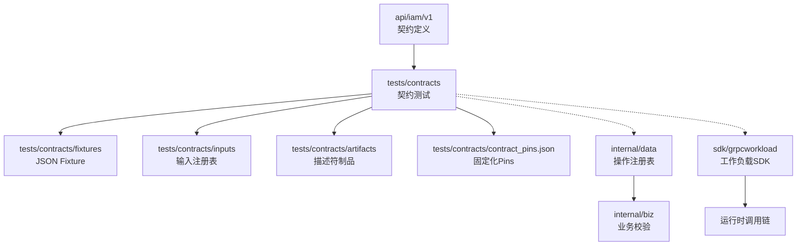
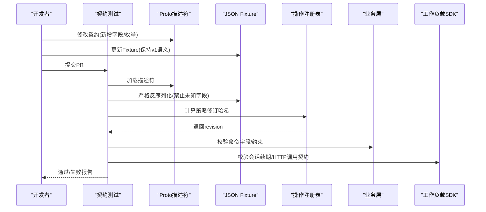
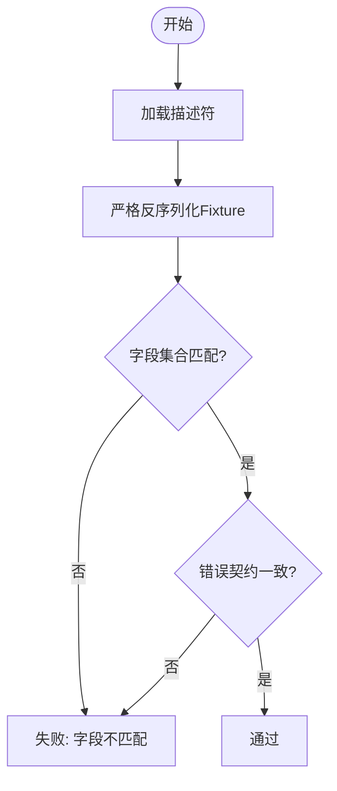
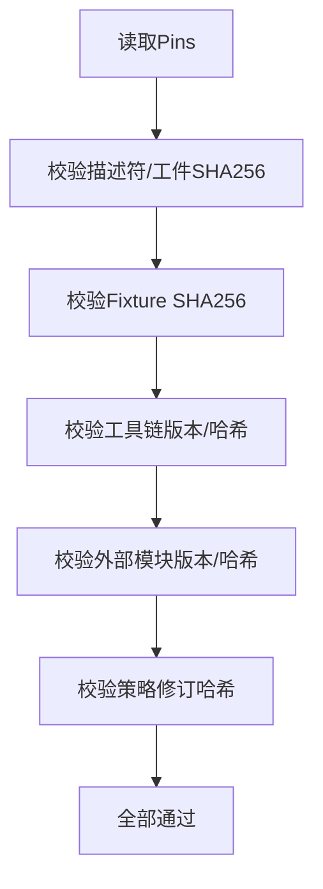
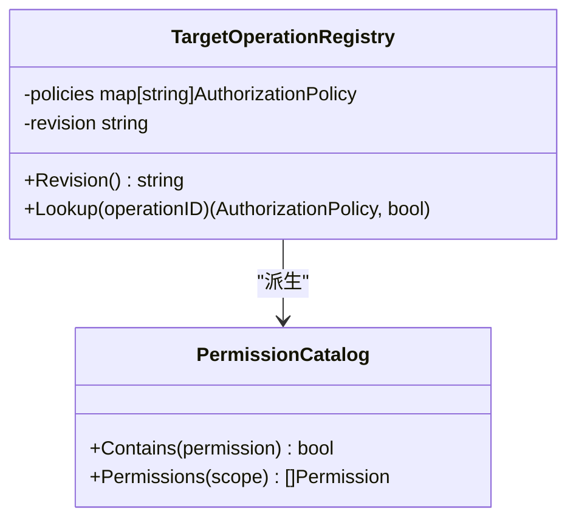
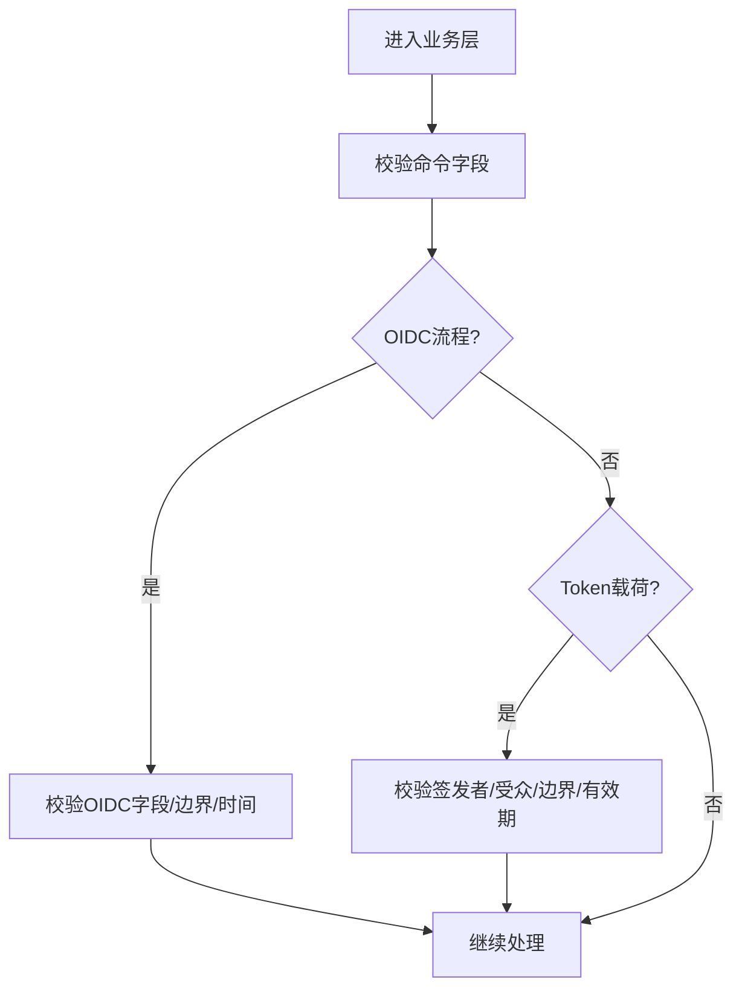
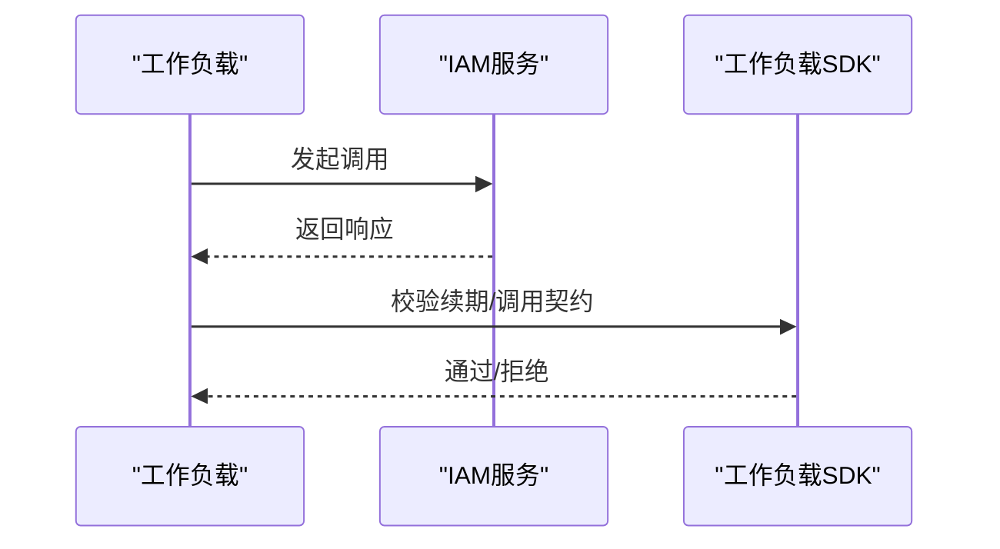
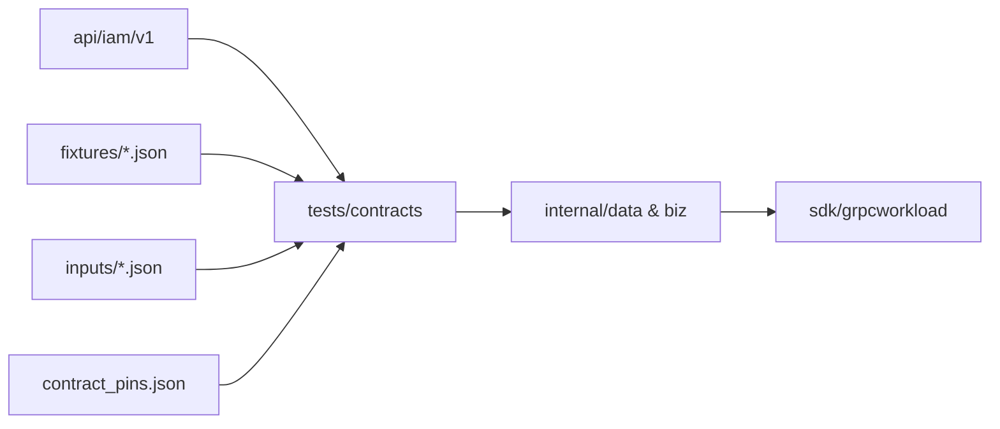

# 契约测试

<cite>
**本文引用的文件**
- [contracts_test.go](file://tests/contracts/contracts_test.go)
- [contract.proto](file://api/iam/v1/contract.proto)
- [core_error_contract.v1.json](file://tests/contracts/fixtures/core_error_contract.v1.json)
- [iam_error_contract.v1.json](file://tests/contracts/fixtures/iam_error_contract.v1.json)
- [iam_check_permission.v1.json](file://tests/contracts/fixtures/iam_check_permission.v1.json)
- [iam_password_login.v1.json](file://tests/contracts/fixtures/iam_password_login.v1.json)
- [workload-operation-registry.v1.json](file://tests/contracts/workload-operation-registry.v1.json)
- [ani-operation-registry.v1.json](file://tests/contracts/inputs/ani-operation-registry.v1.json)
- [operation_registry.go](file://internal/data/operation_registry.go)
- [authorization.go](file://internal/biz/authorization.go)
- [oidc_redis.go](file://internal/data/oidc_redis.go)
- [access_token_jwx.go](file://internal/data/access_token_jwx.go)
- [http.go](file://sdk/grpcworkload/http.go)
- [continuation_test.go](file://sdk/grpcworkload/continuation_test.go)
</cite>

## 目录
1. [简介](#简介)
2. [项目结构](#项目结构)
3. [核心组件](#核心组件)
4. [架构总览](#架构总览)
5. [详细组件分析](#详细组件分析)
6. [依赖关系分析](#依赖关系分析)
7. [性能考虑](#性能考虑)
8. [故障排查指南](#故障排查指南)
9. [结论](#结论)
10. [附录](#附录)

## 简介
本指南面向在微服务与IAM集成场景下，基于JSON Fixtures的契约测试实施。内容涵盖：
- 请求/响应契约的定义、版本管理与兼容性验证
- 操作注册表的契约测试实现（消息格式校验、字段约束检查、向后兼容保证）
- 针对IAM服务的API契约验证用例
- 契约测试在微服务架构中的作用及与CI/CD流水线的集成方式

该仓库通过“协议描述符 + JSON Fixture + 固定化Pins”的组合，确保跨服务接口稳定、可追溯、可回归。

## 项目结构
契约测试相关的关键位置与职责：
- api/iam/v1: 定义不可变的主版本契约（枚举、消息、错误域），并生成描述符供测试使用
- tests/contracts: 存放契约测试代码、Fixture、输入注册表与固定化Pins
- internal/data: 运行时加载并校验操作注册表，计算策略修订哈希，拒绝不匹配变更
- internal/biz: 业务层对认证/授权命令进行结构化校验
- sdk/grpcworkload: 工作负载侧对会话续期、HTTP调用等契约进行严格校验

图表来源
- [contracts_test.go:163-245](file://tests/contracts/contracts_test.go#L163-L245)
- [operation_registry.go:26-98](file://internal/data/operation_registry.go#L26-L98)
- [authorization.go:189-223](file://internal/biz/authorization.go#L189-L223)

章节来源
- [contracts_test.go:1-688](file://tests/contracts/contracts_test.go#L1-L688)
- [contract.proto:1-212](file://api/iam/v1/contract.proto#L1-L212)

## 核心组件
- 契约描述符与枚举
  - 通过proto定义主版本契约，包含领域枚举、消息结构与错误域，用于严格解析Fixture与生成描述符
- JSON Fixture
  - 以版本化命名（如 v1）保存请求/响应样例，配合“禁止未知字段”的解码器，确保契约演进不被静默忽略
- 固定化Pins
  - 锁定描述符、Fixture、工具链、外部模块与策略修订的SHA256，防止漂移
- 操作注册表
  - 将声明式注册表转换为内部授权策略，计算修订哈希；若与期望不一致则拒绝启动或运行
- 业务校验
  - 对命令对象进行强类型校验，保障入参完整性与语义正确性
- SDK契约校验
  - 在工作负载侧对会话续期、HTTP调用等进行签名/摘要/范围校验，避免越权与篡改

章节来源
- [contract.proto:13-212](file://api/iam/v1/contract.proto#L13-L212)
- [contracts_test.go:205-245](file://tests/contracts/contracts_test.go#L205-L245)
- [contracts_test.go:359-463](file://tests/contracts/contracts_test.go#L359-L463)
- [operation_registry.go:26-98](file://internal/data/operation_registry.go#L26-L98)
- [authorization.go:189-223](file://internal/biz/authorization.go#L189-L223)
- [http.go:133-156](file://sdk/grpcworkload/http.go#L133-L156)
- [continuation_test.go:49-83](file://sdk/grpcworkload/continuation_test.go#L49-L83)

## 架构总览
契约测试贯穿“定义—固化—校验—运行”的全链路：
- 定义：proto定义契约，生成描述符
- 固化：Fixture与Pins锁定版本与依赖
- 校验：测试用描述符+Fixture做严格反序列化与字段集校验；注册表计算策略修订哈希并与期望比对
- 运行：业务层与SDK在运行时继续执行字段与权限校验，形成端到端保障

图表来源
- [contracts_test.go:163-245](file://tests/contracts/contracts_test.go#L163-L245)
- [operation_registry.go:26-98](file://internal/data/operation_registry.go#L26-L98)
- [authorization.go:189-223](file://internal/biz/authorization.go#L189-L223)
- [http.go:133-156](file://sdk/grpcworkload/http.go#L133-L156)
- [continuation_test.go:49-83](file://sdk/grpcworkload/continuation_test.go#L49-L83)

## 详细组件分析

### 基于JSON Fixtures的请求/响应契约
- 方法
  - 使用proto生成的描述符，结合动态消息类型对Fixture进行严格反序列化（禁止丢弃未知字段）
  - 对关键消息进行字段集合断言，确保新增/删除字段被显式发现
  - 对错误契约（domain/reason/metadata）进行枚举一致性校验与gRPC状态码映射校验
- 示例
  - 密码登录请求Fixture：校验必需字段存在且类型正确
  - 权限检查请求Fixture：校验凭证、操作ID、策略修订、目标资源与属性
  - 错误契约：校验每个reason对应的gRPC code与required_metadata键集合

图表来源
- [contracts_test.go:205-245](file://tests/contracts/contracts_test.go#L205-L245)
- [contracts_test.go:284-357](file://tests/contracts/contracts_test.go#L284-L357)
- [iam_check_permission.v1.json:1-15](file://tests/contracts/fixtures/iam_check_permission.v1.json#L1-L15)
- [iam_password_login.v1.json:1-14](file://tests/contracts/fixtures/iam_password_login.v1.json#L1-L14)
- [iam_error_contract.v1.json:1-27](file://tests/contracts/fixtures/iam_error_contract.v1.json#L1-L27)
- [core_error_contract.v1.json:1-12](file://tests/contracts/fixtures/core_error_contract.v1.json#L1-L12)

章节来源
- [contracts_test.go:205-357](file://tests/contracts/contracts_test.go#L205-L357)
- [iam_check_permission.v1.json:1-15](file://tests/contracts/fixtures/iam_check_permission.v1.json#L1-L15)
- [iam_password_login.v1.json:1-14](file://tests/contracts/fixtures/iam_password_login.v1.json#L1-L14)
- [iam_error_contract.v1.json:1-27](file://tests/contracts/fixtures/iam_error_contract.v1.json#L1-L27)
- [core_error_contract.v1.json:1-12](file://tests/contracts/fixtures/core_error_contract.v1.json#L1-L12)

### 版本管理与兼容性验证
- 固定化Pins
  - 锁定描述符、Fixture、工具链、外部模块与策略修订的SHA256，任何变更都会导致校验失败
  - 对多阶段工作流（WR19/WR20/WR21/WR22/WR23）分别记录基线与候选版本，确保升级路径可追踪
- 兼容性断言
  - 服务清单与方法清单必须与预期完全一致
  - 关键消息字段集合必须与预期一致
  - 错误枚举值必须与Fixture中的reason一一对应，且gRPC code合法
  - 载荷指纹（payload fingerprint）按规范计算并校验

图表来源
- [contracts_test.go:359-463](file://tests/contracts/contracts_test.go#L359-L463)
- [contract_pins.json:1-83](file://tests/contracts/contract_pins.json#L1-L83)

章节来源
- [contracts_test.go:359-463](file://tests/contracts/contracts_test.go#L359-L463)
- [contract_pins.json:1-83](file://tests/contracts/contract_pins.json#L1-L83)

### 操作注册表的契约测试实现
- 设计要点
  - 从注册表构建授权策略集合，规范化排序后计算修订哈希
  - 若注册表内容与期望不一致（新增/删除/变更），直接报错，阻止部署
  - 提供权限目录查询能力，便于审计与可视化
- 契约测试覆盖
  - 通过输入注册表与当前产物对比，确保策略集合稳定
  - 对错误处理路径（未注册操作、策略不匹配）进行断言

图表来源
- [operation_registry.go:16-169](file://internal/data/operation_registry.go#L16-L169)

章节来源
- [operation_registry.go:26-169](file://internal/data/operation_registry.go#L26-L169)
- [workload-operation-registry.v1.json:1-800](file://tests/contracts/workload-operation-registry.v1.json#L1-L800)
- [ani-operation-registry.v1.json:1-800](file://tests/contracts/inputs/ani-operation-registry.v1.json#L1-L800)

### 消息格式验证与字段约束检查
- 业务层命令校验
  - 对CheckPermission等命令进行必填字段与类型校验，确保上游传入数据完整
- OIDC流程校验
  - 对OIDC操作的必要字段、边界、时间窗口等进行严格校验
- Token载荷校验
  - 对访问令牌签发者、受众、边界、有效期、版本等进行校验，防止越界与过期

图表来源
- [authorization.go:189-223](file://internal/biz/authorization.go#L189-L223)
- [oidc_redis.go:148-169](file://internal/data/oidc_redis.go#L148-L169)
- [access_token_jwx.go:332-362](file://internal/data/access_token_jwx.go#L332-L362)

章节来源
- [authorization.go:189-223](file://internal/biz/authorization.go#L189-L223)
- [oidc_redis.go:148-169](file://internal/data/oidc_redis.go#L148-L169)
- [access_token_jwx.go:332-362](file://internal/data/access_token_jwx.go#L332-L362)

### 向后兼容性保证
- 策略修订哈希
  - 当注册表内容变化时，策略修订哈希改变，运行时拒绝与旧客户端/网关的不匹配组合
- 错误契约一致性
  - 错误reason与gRPC code、metadata键集合必须与Fixture一致，避免下游误判
- 服务/方法清单冻结
  - 服务与方法清单必须与预期一致，防止意外暴露或移除

章节来源
- [operation_registry.go:26-98](file://internal/data/operation_registry.go#L26-L98)
- [contracts_test.go:284-357](file://tests/contracts/contracts_test.go#L284-L357)
- [contracts_test.go:163-203](file://tests/contracts/contracts_test.go#L163-L203)

### IAM服务API契约验证用例
- 密码登录
  - 使用Fixture验证请求体字段与类型，确保鉴权入口契约稳定
- 权限检查
  - 使用Fixture验证CheckPermissionRequest的凭证、操作ID、策略修订、目标资源与属性
- 错误契约
  - 校验IAM与Core的错误reason、gRPC code与required_metadata的一致性

章节来源
- [iam_password_login.v1.json:1-14](file://tests/contracts/fixtures/iam_password_login.v1.json#L1-L14)
- [iam_check_permission.v1.json:1-15](file://tests/contracts/fixtures/iam_check_permission.v1.json#L1-L15)
- [iam_error_contract.v1.json:1-27](file://tests/contracts/fixtures/iam_error_contract.v1.json#L1-L27)
- [core_error_contract.v1.json:1-12](file://tests/contracts/fixtures/core_error_contract.v1.json#L1-L12)

### 工作负载侧契约校验（会话续期与HTTP调用）
- 会话续期
  - 对续期响应的主体、调用方、摘要、过期时间等进行严格校验，防止篡改
- HTTP调用
  - 校验权威范围与修订头，清理敏感头，确保仅传递必要上下文

图表来源
- [continuation_test.go:49-83](file://sdk/grpcworkload/continuation_test.go#L49-L83)
- [http.go:133-156](file://sdk/grpcworkload/http.go#L133-L156)

章节来源
- [continuation_test.go:49-83](file://sdk/grpcworkload/continuation_test.go#L49-L83)
- [http.go:133-156](file://sdk/grpcworkload/http.go#L133-L156)

## 依赖关系分析
- 契约测试依赖
  - 描述符（来自api/iam/v1）
  - Fixture（tests/contracts/fixtures）
  - 输入注册表（tests/contracts/inputs）
  - 固定化Pins（tests/contracts/contract_pins.json）
- 运行时依赖
  - 操作注册表（internal/data）
  - 业务校验（internal/biz）
  - SDK契约校验（sdk/grpcworkload）

图表来源
- [contracts_test.go:163-245](file://tests/contracts/contracts_test.go#L163-L245)
- [operation_registry.go:26-98](file://internal/data/operation_registry.go#L26-L98)
- [authorization.go:189-223](file://internal/biz/authorization.go#L189-L223)
- [http.go:133-156](file://sdk/grpcworkload/http.go#L133-L156)

章节来源
- [contracts_test.go:163-245](file://tests/contracts/contracts_test.go#L163-L245)
- [operation_registry.go:26-98](file://internal/data/operation_registry.go#L26-L98)
- [authorization.go:189-223](file://internal/biz/authorization.go#L189-L223)
- [http.go:133-156](file://sdk/grpcworkload/http.go#L133-L156)

## 性能考虑
- 契约测试为静态/轻量级校验，主要开销在于描述符解析与JSON反序列化，适合在CI中快速执行
- 操作注册表策略哈希计算为O(n)遍历与排序，n为策略数量，通常较小，不影响启动性能
- 建议在CI中并行执行不同阶段的契约测试（描述符、Fixture、注册表、业务校验）

[本节为通用建议，无需特定文件引用]

## 故障排查指南
- 常见失败原因
  - Fixture新增未知字段：严格反序列化会失败，需更新Fixture或调整契约
  - 策略修订不匹配：注册表内容变化导致哈希不同，需审查变更并更新Pins
  - 错误契约不一致：reason/gRPC code/metadata键与Fixture不一致，需统一枚举与契约
  - 服务/方法清单不一致：新增或移除服务/方法未被预期捕获，需更新清单
- 定位步骤
  - 查看具体测试失败点（描述符、Fixture、注册表、业务校验）
  - 核对Pins中的SHA256与实际文件是否一致
  - 检查业务层命令校验与OIDC/Token校验逻辑是否与契约一致

章节来源
- [contracts_test.go:205-463](file://tests/contracts/contracts_test.go#L205-L463)
- [oidc_redis.go:148-169](file://internal/data/oidc_redis.go#L148-L169)
- [access_token_jwx.go:332-362](file://internal/data/access_token_jwx.go#L332-L362)

## 结论
通过“proto描述符 + JSON Fixture + 固定化Pins + 注册表策略哈希 + 业务/SDK运行时校验”的多层保障，本项目实现了高可靠性的契约测试体系。它有效防止了接口漂移、破坏性变更与下游误判，并为微服务架构下的稳定演进提供了坚实基础。

[本节为总结，无需特定文件引用]

## 附录
- 与CI/CD集成建议
  - 在PR阶段运行契约测试，阻断破坏性变更
  - 在发布前校验Pins与产物哈希，确保可重现构建
  - 将契约测试结果作为质量门禁，结合覆盖率与性能测试形成完整流水线

[本节为通用建议，无需特定文件引用]