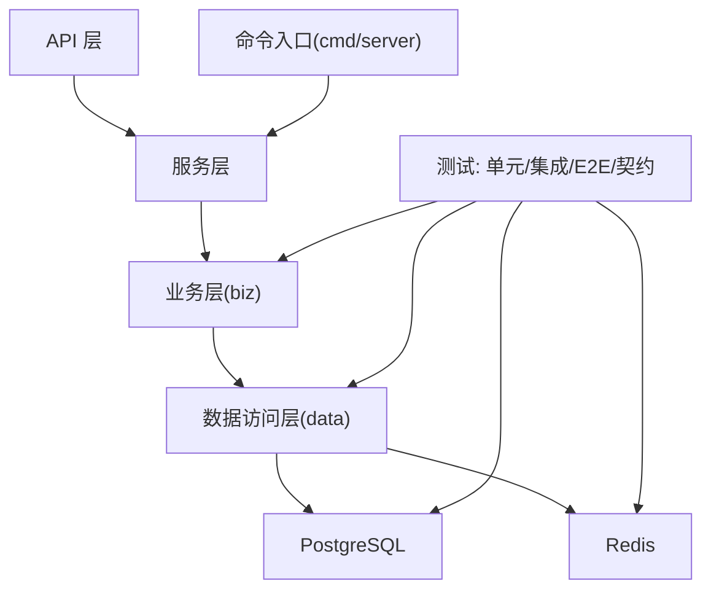
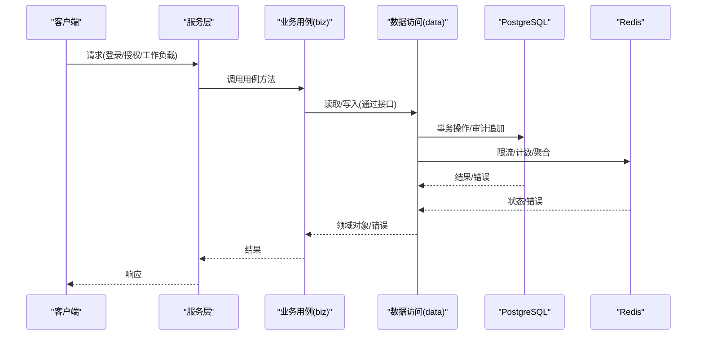
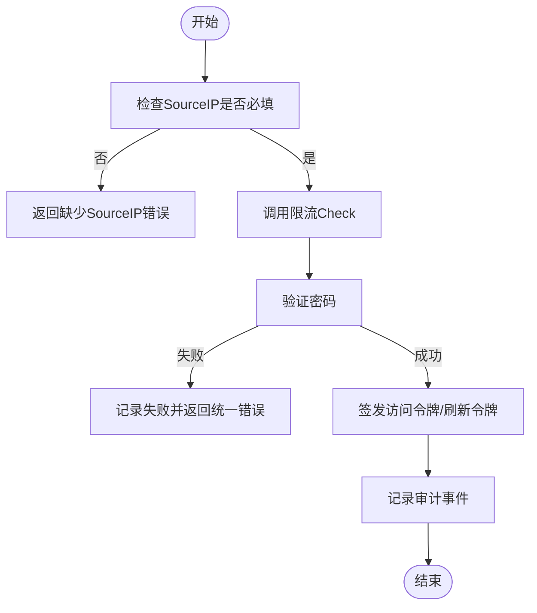
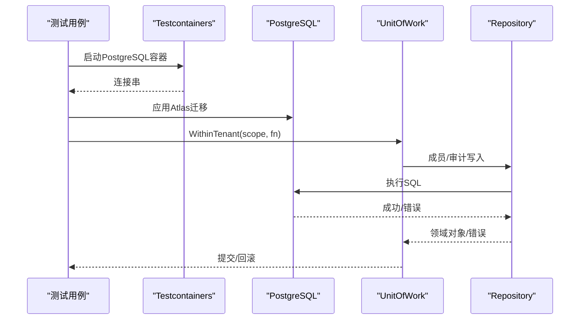
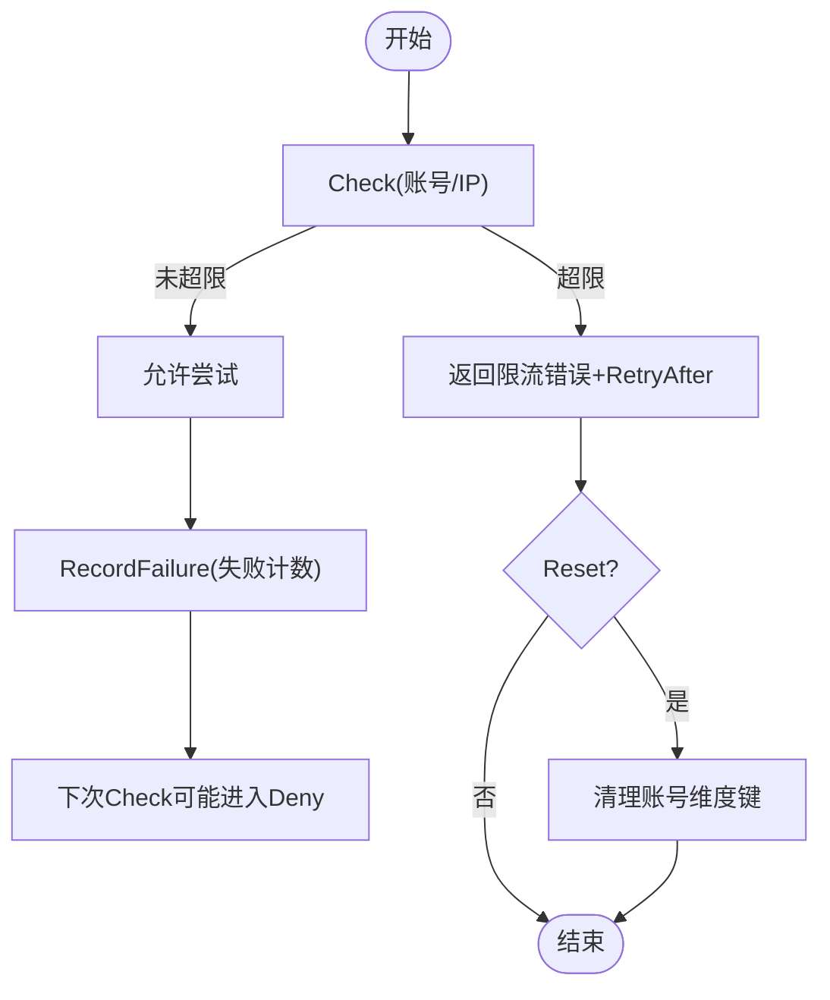
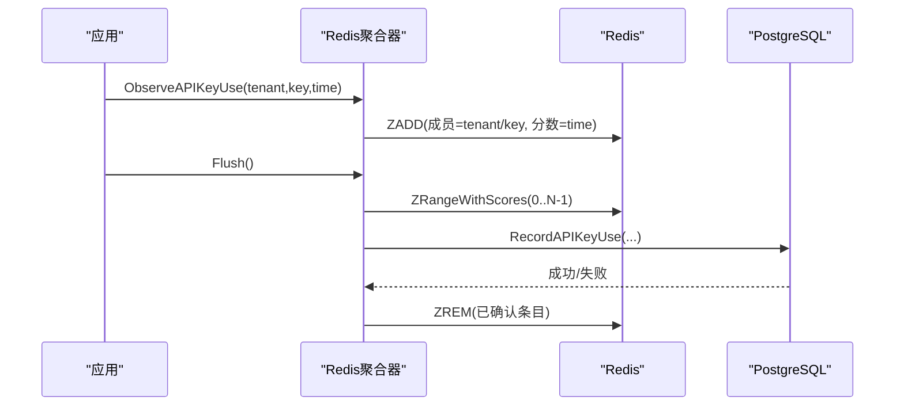
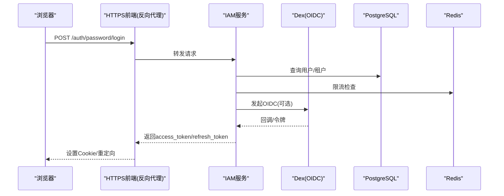
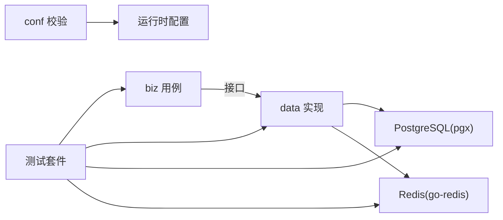

# 测试指南

<cite>
**本文引用的文件**
- [go.mod](file://go.mod)
- [tests/integration/persistence_test.go](file://tests/integration/persistence_test.go)
- [tests/integration/redis_throttle_test.go](file://tests/integration/redis_throttle_test.go)
- [tests/integration/wr20_fixture_test.go](file://tests/integration/wr20_fixture_test.go)
- [internal/data/postgres.go](file://internal/data/postgres.go)
- [internal/data/api_key_usage_redis.go](file://internal/data/api_key_usage_redis.go)
- [internal/biz/authentication_test.go](file://internal/biz/authentication_test.go)
- [tests/integration/api_key_redis_control_test.go](file://tests/integration/api_key_redis_control_test.go)
- [tests/integration/workload_bootstrap_test.go](file://tests/integration/workload_bootstrap_test.go)
- [internal/conf/validate.go](file://internal/conf/validate.go)
</cite>

## 目录
1. [简介](#简介)
2. [项目结构](#项目结构)
3. [核心组件](#核心组件)
4. [架构总览](#架构总览)
5. [详细组件分析](#详细组件分析)
6. [依赖关系分析](#依赖关系分析)
7. [性能与压力测试](#性能与压力测试)
8. [故障排查指南](#故障排查指南)
9. [结论](#结论)
10. [附录](#附录)

## 简介
本指南面向本项目的测试策略与实现，覆盖单元测试、集成测试、契约测试、端到端测试、Mock 使用、Testcontainers 环境搭建（PostgreSQL、Redis）、性能与压力测试、覆盖率与质量门禁，以及可维护性与执行效率的最佳实践。内容基于仓库中现有测试代码与基础设施进行归纳与提炼，确保读者能据此建立稳定、可复现且高效的测试体系。

## 项目结构
本项目采用分层架构：API 层、服务层、业务层（biz）、数据访问层（data）、配置（conf）与命令入口（cmd/server）。测试按类型组织在 tests 目录下，其中 integration 子目录包含大量集成测试；内部包内也包含对应单元测试。

**图示来源**
- [go.mod:1-119](file://go.mod#L1-L119)
- [tests/integration/persistence_test.go:1-28](file://tests/integration/persistence_test.go#L1-L28)

**章节来源**
- [go.mod:1-119](file://go.mod#L1-L119)

## 核心组件
- 业务用例与接口：认证、授权、会话、工作负载等用例定义在 biz 层，并通过接口解耦外部依赖，便于单元测试 Mock。
- 数据访问与事务：data 层提供 PostgreSQL 事务单元（UnitOfWork）和 Redis 聚合器，封装错误映射与一致性约束。
- 配置校验：conf 层对运行时配置进行严格校验，保障测试环境与生产一致的安全基线。
- 测试基础设施：integration 测试通过 Testcontainers 拉起真实 PostgreSQL/Redis/Dex，结合 Atlas 迁移与固定镜像，保证可重复性。

**章节来源**
- [internal/data/postgres.go:18-59](file://internal/data/postgres.go#L18-L59)
- [internal/data/api_key_usage_redis.go:21-61](file://internal/data/api_key_usage_redis.go#L21-L61)
- [internal/conf/validate.go:19-45](file://internal/conf/validate.go#L19-L45)
- [tests/integration/persistence_test.go:572-690](file://tests/integration/persistence_test.go#L572-L690)

## 架构总览
下图展示从 API 到数据层的调用链路与测试注入点，强调在 biz 层通过接口隔离外部依赖，在 data 层通过容器化真实依赖进行集成验证。

**图示来源**
- [internal/data/postgres.go:27-59](file://internal/data/postgres.go#L27-L59)
- [internal/data/api_key_usage_redis.go:63-123](file://internal/data/api_key_usage_redis.go#L63-L123)
- [internal/biz/authentication_test.go:19-86](file://internal/biz/authentication_test.go#L19-L86)

## 详细组件分析

### 单元测试：以认证用例为例
- 目标：验证密码登录流程的输入校验、限流、令牌签发、审计记录与租户边界。
- 方法：通过 Mock 读取器、验证器、限流器、ID 生成器、时钟与观测器，构造确定性输入并断言输出与副作用。
- 关键点：
  - 缺失 SourceIP 应拒绝并触发限流前置校验。
  - 未知账号与错误密码统一返回无效凭据错误，避免信息泄露。
  - 成功登录后创建活跃会话与授权，审计事件被持久化。

**图示来源**
- [internal/biz/authentication_test.go:88-113](file://internal/biz/authentication_test.go#L88-L113)
- [internal/biz/authentication_test.go:115-167](file://internal/biz/authentication_test.go#L115-L167)
- [internal/biz/authentication_test.go:19-86](file://internal/biz/authentication_test.go#L19-L86)

**章节来源**
- [internal/biz/authentication_test.go:19-200](file://internal/biz/authentication_test.go#L19-L200)

### 集成测试：PostgreSQL 权限与事务一致性
- 目标：验证数据库角色权限分离、无RLS安全模型、租户隔离、乐观并发控制、审计追加唯一性与回滚语义。
- 方法：使用 Testcontainers 启动固定版本 PostgreSQL，通过 Atlas 应用迁移，以不同角色连接执行受限操作，断言权限与约束。
- 关键点：
  - 运行角色不得拥有DDL权限或越权修改审计表。
  - 跨租户关系通过外键与谓词保护，禁止越界读写。
  - 并发更新仅允许一次成功，冲突返回版本冲突错误。
  - 审计插入失败时，整体事务回滚，不留下部分变更。

**图示来源**
- [tests/integration/persistence_test.go:572-690](file://tests/integration/persistence_test.go#L572-L690)
- [internal/data/postgres.go:27-59](file://internal/data/postgres.go#L27-L59)

**章节来源**
- [tests/integration/persistence_test.go:45-560](file://tests/integration/persistence_test.go#L45-L560)
- [internal/data/postgres.go:18-232](file://internal/data/postgres.go#L18-L232)

### 集成测试：Redis 登录限流与隔离
- 目标：验证按账号与源IP维度的指数退避限流、刷新令牌哈希键隔离、TTL 正确性、停止依赖时的错误传播。
- 方法：使用 Testcontainers 启动 Redis，构造限流器实例，模拟多次失败与恢复，断言错误类型、范围与重试时间。
- 关键点：
  - 账号与IP维度分别计数，达到阈值后返回限流错误并携带 Retry-After。
  - 刷新令牌使用摘要作为键，避免明文凭证落盘。
  - Redis 不可用时，所有相关操作应返回依赖失败错误。

**图示来源**
- [tests/integration/redis_throttle_test.go:20-168](file://tests/integration/redis_throttle_test.go#L20-L168)

**章节来源**
- [tests/integration/redis_throttle_test.go:1-180](file://tests/integration/redis_throttle_test.go#L1-L180)

### 集成测试：API Key 使用聚合与异步落库
- 目标：验证 Redis 中按租户与KeyID聚合使用计数，批量刷入 PostgreSQL，失败重试与幂等确认。
- 方法：构造 Redis 聚合器，观察使用事件，Flush 批处理写入数据库，断言 Pending 数量与错误路径。
- 关键点：
  - Observe 将使用事件加入有序集合（分数为时间戳），Flush 取前 N 条写入 DB 并确认移除。
  - PostgreSQL 不可用时，Redis 保留待处理条目，等待后续重试。
  - Redis 不可用时，Observe/Acquire 等操作直接报错。

**图示来源**
- [internal/data/api_key_usage_redis.go:63-123](file://internal/data/api_key_usage_redis.go#L63-L123)
- [tests/integration/api_key_redis_control_test.go:20-187](file://tests/integration/api_key_redis_control_test.go#L20-L187)

**章节来源**
- [internal/data/api_key_usage_redis.go:1-143](file://internal/data/api_key_usage_redis.go#L1-L143)
- [tests/integration/api_key_redis_control_test.go:1-187](file://tests/integration/api_key_redis_control_test.go#L1-L187)

### 端到端测试：WR20 正式流程（OIDC + TLS + 网关）
- 目标：在接近生产的条件下，验证 OIDC 登录、浏览器会话、网关转发、TLS 终止与审计。
- 方法：使用 Testcontainers 启动 Dex，配合反向代理与固定证书，构建 HTTPS 前端，驱动完整登录流程并断言响应头与状态码。
- 关键点：
  - 通过反向代理拦截并重写 token 响应，注入故障场景。
  - 使用固定 CA/Cert 与 DNS 重定向，模拟真实域名访问。
  - 断言审计响应不可缓存、状态码与错误码符合预期。

**图示来源**
- [tests/integration/wr20_fixture_test.go:72-136](file://tests/integration/wr20_fixture_test.go#L72-L136)
- [tests/integration/wr20_fixture_test.go:140-248](file://tests/integration/wr20_fixture_test.go#L140-L248)

**章节来源**
- [tests/integration/wr20_fixture_test.go:1-319](file://tests/integration/wr20_fixture_test.go#L1-L319)

### 契约测试：协议与工件校验
- 目标：确保 API 契约与生成的描述符一致，防止破坏性变更。
- 方法：在 tests/contracts 下维护 fixtures 与 inputs，结合生成的 pb 描述符进行比对与校验。
- 关键点：
  - 使用固定版本的契约工件，避免漂移。
  - 通过自动化脚本或测试用例对比变更，阻断不兼容升级。

**章节来源**
- [api/iam/v1/contract.pb.go:1470-1495](file://api/iam/v1/contract.pb.go#L1470-L1495)

## 依赖关系分析
- 外部依赖：PostgreSQL、Redis、Dex（OIDC）、Prometheus/Otel（可观测性）、gRPC/Protobuf。
- 测试依赖：testcontainers-go、postgres 模块、redis/go-redis、stretchr/testify（间接）。
- 关键耦合点：
  - biz 层通过接口与 data 交互，降低耦合度，便于 Mock。
  - data 层对 pgx/pgconn 错误进行映射，统一领域错误。
  - 配置层强制隔离模式与监听地址分离，减少端口冲突风险。

**图示来源**
- [internal/data/postgres.go:18-59](file://internal/data/postgres.go#L18-L59)
- [internal/conf/validate.go:19-45](file://internal/conf/validate.go#L19-L45)
- [go.mod:1-119](file://go.mod#L1-L119)

**章节来源**
- [go.mod:1-119](file://go.mod#L1-L119)
- [internal/data/postgres.go:18-232](file://internal/data/postgres.go#L18-L232)
- [internal/conf/validate.go:19-45](file://internal/conf/validate.go#L19-L45)

## 性能与压力测试
- 建议方案：
  - 使用独立压测集群与真实容器化依赖（PostgreSQL/Redis/Dex），避免共享资源干扰。
  - 针对登录、授权、工作负载调用等热点路径设计基准与压力用例，关注延迟分布与吞吐。
  - 利用 Prometheus 指标与 Otel 追踪采集性能数据，结合 CI 中的告警阈值。
  - 对 Redis 聚合器与限流器进行专项压测，验证高并发下的稳定性与内存占用。
- 注意事项：
  - 压测数据与生产数据隔离，避免污染。
  - 使用固定镜像与迁移集，确保可重复性。
  - 对超时、重试、背压进行显式验证。

[本节为通用指导，无需具体文件引用]

## 故障排查指南
- 常见错误与定位：
  - 权限不足：检查运行角色权限与审计表写入限制，参考持久化测试中的权限断言。
  - 版本冲突：并发更新导致乐观锁失败，需检查版本号与更新逻辑。
  - 依赖不可用：Redis/PostgreSQL 不可用时，应返回明确的依赖失败错误，便于上层降级或重试。
  - 配置错误：conf 校验失败会阻止启动，检查监听地址、TLS 与超时配置。
- 调试技巧：
  - 使用 Testcontainers 固定镜像与日志输出，快速复现问题。
  - 在集成测试中打印关键中间状态（如 Redis 键、TTL、Pending 数）。
  - 对端到端流程启用 TLS 与真实域名解析，确保网络栈行为一致。

**章节来源**
- [tests/integration/persistence_test.go:191-215](file://tests/integration/persistence_test.go#L191-L215)
- [tests/integration/redis_throttle_test.go:144-168](file://tests/integration/redis_throttle_test.go#L144-L168)
- [internal/conf/validate.go:19-45](file://internal/conf/validate.go#L19-L45)

## 结论
本项目测试体系以“接口隔离 + 真实依赖容器化”为核心，兼顾单元、集成、契约与端到端测试。通过固定镜像、精确权限、事务与审计约束，确保了安全性与一致性。建议在持续集成中引入覆盖率门禁与契约校验，保持高质量交付。

[本节为总结，无需具体文件引用]

## 附录
- 覆盖率要求与质量门禁建议：
  - 设定最低覆盖率阈值（例如行覆盖率≥80%），并在 CI 中阻断低覆盖率合并。
  - 对关键路径（认证、授权、事务、限流）提高覆盖率要求。
  - 契约测试失败应阻断发布流水线。
- 可维护性与执行效率：
  - 使用 build tag 区分测试类型（如 integration），按需执行。
  - 复用测试夹具与环境初始化函数，减少重复代码。
  - 对慢测试进行并行化与资源隔离，缩短反馈时间。

[本节为通用指导，无需具体文件引用]