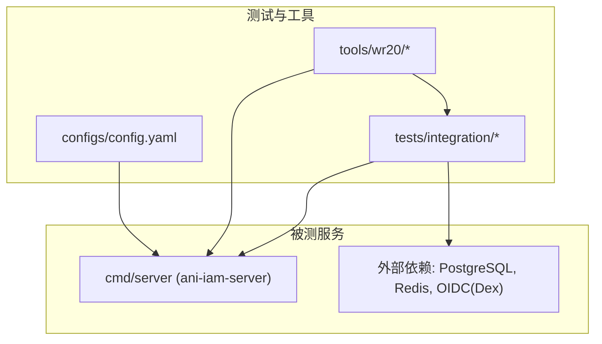
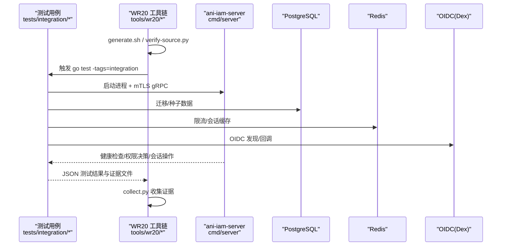
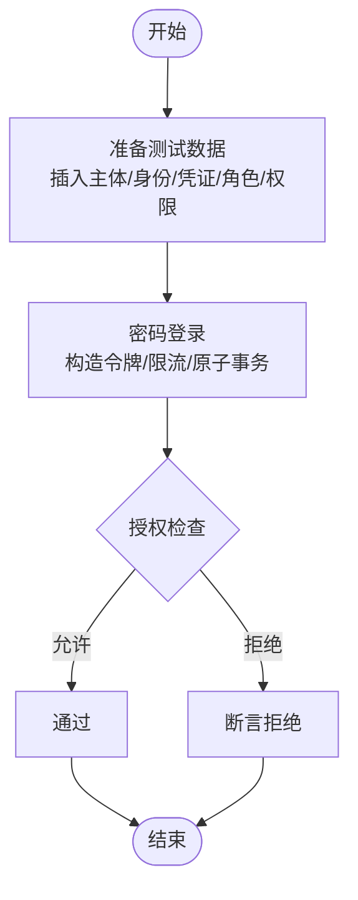
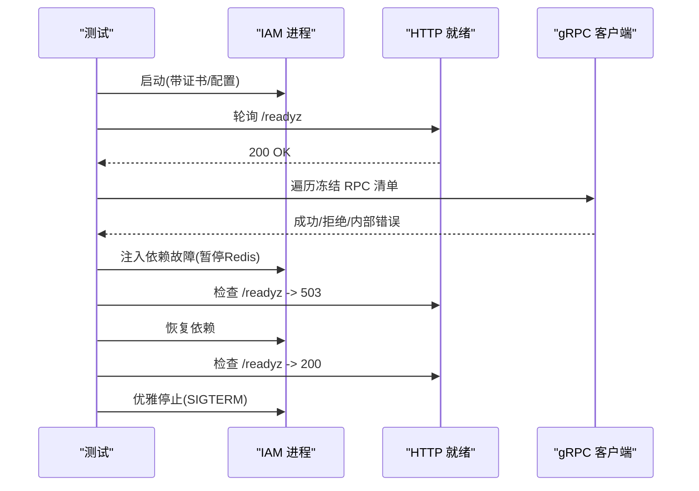
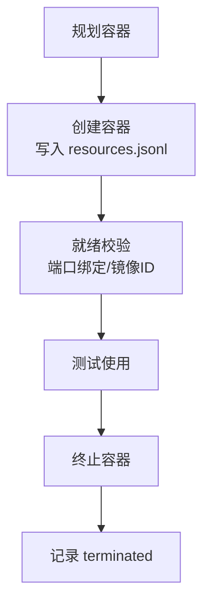
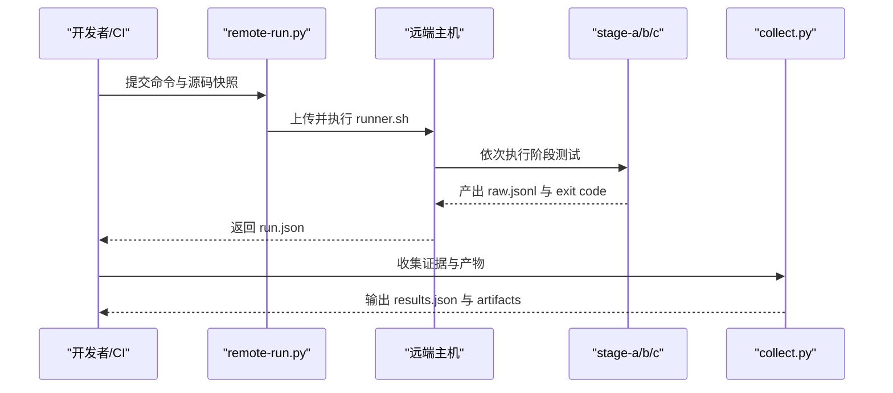
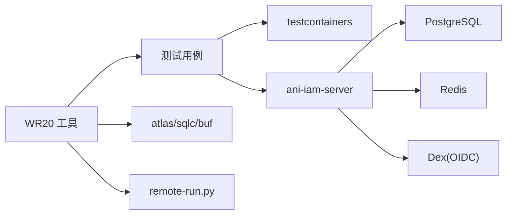

# 测试自动化

<cite>
**本文引用的文件**
- [vertical_slice_test.go](file://tests/integration/vertical_slice_test.go)
- [formal_runtime_test.go](file://tests/integration/formal_runtime_test.go)
- [isolation_test.go](file://tests/integration/isolation_test.go)
- [wr20_fixture_test.go](file://tests/integration/wr20_fixture_test.go)
- [generate.sh](file://tools/wr20/generate.sh)
- [remote-run.py](file://tools/wr20/remote-run.py)
- [collect.py](file://tools/wr20/collect.py)
- [checks-a.sh](file://tools/wr20/checks-a.sh)
- [stage-a.sh](file://tools/wr20/stage-a.sh)
- [stage-b.sh](file://tools/wr20/stage-b.sh)
- [stage-c.sh](file://tools/wr20/stage-c.sh)
- [verify-source.py](file://tools/wr20/verify-source.py)
- [config.yaml](file://configs/config.yaml)
</cite>

## 目录
1. [简介](#简介)
2. [项目结构](#项目结构)
3. [核心组件](#核心组件)
4. [架构总览](#架构总览)
5. [详细组件分析](#详细组件分析)
6. [依赖关系分析](#依赖关系分析)
7. [性能与质量门禁](#性能与质量门禁)
8. [故障排查指南](#故障排查指南)
9. [结论](#结论)
10. [附录](#附录)

## 简介
本文件面向“测试自动化”目标，系统化说明本项目中测试脚本的编写与管理、垂直切片测试与正式运行时测试的执行策略、测试数据与环境准备、结果收集与证据归档，以及在 CI/CD 流水线中的集成方式（并行执行、失败重试、结果通知），并给出测试性能监控与质量门禁的配置建议。内容基于仓库内现有测试代码与工具脚本进行提炼与组织，确保可追溯、可复现、可审计。

## 项目结构
测试相关代码主要分布在以下位置：
- tests/integration：集成测试与端到端测试，包含垂直切片测试、正式运行时测试、隔离环境管理、WR20 场景夹具等。
- tools/wr20：WR20 工作流工具集，包括源码生成、远程运行、阶段化测试编排、结果收集与校验。
- configs：运行时配置示例，用于本地或容器化部署时的最小可用配置。

**图表来源**
- [formal_runtime_test.go:87-273](file://tests/integration/formal_runtime_test.go#L87-L273)
- [isolation_test.go:26-137](file://tests/integration/isolation_test.go#L26-L137)
- [config.yaml:1-61](file://configs/config.yaml#L1-L61)

**章节来源**
- [formal_runtime_test.go:87-273](file://tests/integration/formal_runtime_test.go#L87-L273)
- [isolation_test.go:26-137](file://tests/integration/isolation_test.go#L26-L137)
- [config.yaml:1-61](file://configs/config.yaml#L1-L61)

## 核心组件
- 垂直切片测试：验证目标数据库 schema、登录授权流程、错误映射、租户隔离等关键路径，使用真实 Postgres 与 Redis 资源，并通过 testcontainers 实现资源隔离。
- 正式运行时测试：启动真实的 ani-iam-server 进程，通过 mTLS gRPC 调用冻结 RPC 清单，覆盖健康检查、权限控制、会话刷新、租户切换、注销、依赖故障恢复等。
- 隔离环境管理：为每个测试任务创建独立 Docker 网络与容器，记录资源生命周期事件与凭据引用，避免共享状态。
- WR20 工具链：源码生成与校验、远程单调度执行、分阶段测试编排（Stage A/B/C）、格式检查、结果收集与证据归档。

**章节来源**
- [vertical_slice_test.go:26-328](file://tests/integration/vertical_slice_test.go#L26-L328)
- [formal_runtime_test.go:45-273](file://tests/integration/formal_runtime_test.go#L45-L273)
- [isolation_test.go:26-137](file://tests/integration/isolation_test.go#L26-L137)
- [wr20_fixture_test.go:72-136](file://tests/integration/wr20_fixture_test.go#L72-L136)
- [generate.sh:1-45](file://tools/wr20/generate.sh#L1-L45)
- [remote-run.py:1-98](file://tools/wr20/remote-run.py#L1-L98)
- [collect.py:1-30](file://tools/wr20/collect.py#L1-L30)

## 架构总览
下图展示从测试驱动到被测服务的整体交互：测试通过 Go 构建与 testcontainers 拉起依赖（Postgres、Redis、OIDC/Dex），以 mTLS 连接 IAM 服务端，执行垂直切片与正式运行时用例；WR20 工具负责源码生成、远程执行、阶段化测试与结果收集。

**图表来源**
- [formal_runtime_test.go:87-273](file://tests/integration/formal_runtime_test.go#L87-L273)
- [isolation_test.go:26-137](file://tests/integration/isolation_test.go#L26-L137)
- [wr20_fixture_test.go:72-136](file://tests/integration/wr20_fixture_test.go#L72-L136)
- [generate.sh:1-45](file://tools/wr20/generate.sh#L1-L45)
- [remote-run.py:66-95](file://tools/wr20/remote-run.py#L66-L95)
- [collect.py:1-30](file://tools/wr20/collect.py#L1-L30)

## 详细组件分析

### 垂直切片测试（Vertical Slice）
- 目标：验证目标 schema、密码登录与授权、错误映射、租户隔离、并发幂等性等。
- 关键点：
  - 使用 testcontainers 拉起隔离的 Redis，并在生命周期钩子中记录容器事件与端口绑定。
  - 通过固定密钥与固定时钟构造访问令牌，验证签发与声明。
  - 删除权限后断言拒绝访问，验证授权读取器按租户边界隔离。
  - 模拟数据库不可用，断言返回稳定的 IAM_UNAVAILABLE 错误。

**图表来源**
- [vertical_slice_test.go:88-328](file://tests/integration/vertical_slice_test.go#L88-L328)
- [isolation_test.go:139-169](file://tests/integration/isolation_test.go#L139-L169)

**章节来源**
- [vertical_slice_test.go:26-328](file://tests/integration/vertical_slice_test.go#L26-L328)
- [isolation_test.go:139-169](file://tests/integration/isolation_test.go#L139-L169)

### 正式运行时测试（Formal Runtime）
- 目标：以真实进程和协议栈验证冻结 RPC 清单可达性、mTLS 强制、健康就绪、权限与撤销、会话生命周期、依赖故障恢复与优雅关闭。
- 关键点：
  - 动态构建或复用预构建二进制，写入临时配置与证书，启动进程并等待 HTTP 就绪。
  - 遍历所有冻结 RPC，未授权方法应被网关拦截，已授权方法必须到达实现层。
  - 注入依赖故障（如暂停 Redis），验证 readiness/liveness 与健康检查行为。
  - 记录进程 PID、二进制摘要、日志与配置引用，便于回溯。

**图表来源**
- [formal_runtime_test.go:87-273](file://tests/integration/formal_runtime_test.go#L87-L273)
- [formal_runtime_test.go:275-290](file://tests/integration/formal_runtime_test.go#L275-L290)
- [formal_runtime_test.go:303-483](file://tests/integration/formal_runtime_test.go#L303-L483)

**章节来源**
- [formal_runtime_test.go:45-273](file://tests/integration/formal_runtime_test.go#L45-L273)
- [formal_runtime_test.go:275-290](file://tests/integration/formal_runtime_test.go#L275-L290)
- [formal_runtime_test.go:303-483](file://tests/integration/formal_runtime_test.go#L303-L483)

### 隔离环境与资源管理
- 每个任务拥有独立的 run 目录与 Docker 网络，禁止共享容器、卷或选择器。
- 容器生命周期钩子记录 created/ready/terminated 事件，并校验端口仅绑定到回环地址。
- 凭据以文件形式保存在 private 目录，仅记录引用，不随证据外泄。

**图表来源**
- [isolation_test.go:26-137](file://tests/integration/isolation_test.go#L26-L137)
- [isolation_test.go:171-203](file://tests/integration/isolation_test.go#L171-L203)

**章节来源**
- [isolation_test.go:26-137](file://tests/integration/isolation_test.go#L26-L137)
- [isolation_test.go:171-203](file://tests/integration/isolation_test.go#L171-L203)

### WR20 工具链与流水线
- 源码生成与校验：
  - generate.sh 调用 atlas/sqlc/buf 生成产物，并重复生成以验证确定性。
  - verify-source.py 校验源文件一致性（哈希、模式、删除项）。
- 远程执行：
  - remote-run.py 将源码与命令打包上传至远端主机，设置严格环境变量与锁，执行命令并记录证据。
- 阶段化测试：
  - stage-a.sh：格式化与单元测试，运行特定集成用例。
  - stage-b.sh：聚焦 OIDC 相关集成测试。
  - stage-c.sh：影响范围检查、SDK/通知服务测试、集成编译检查。
- 结果收集：
  - collect.py 拉取非敏感证据与生成产物，支持 apply 模式将受控产物落盘。

**图表来源**
- [generate.sh:1-45](file://tools/wr20/generate.sh#L1-L45)
- [remote-run.py:66-95](file://tools/wr20/remote-run.py#L66-L95)
- [checks-a.sh:21-47](file://tools/wr20/checks-a.sh#L21-L47)
- [stage-a.sh:1-34](file://tools/wr20/stage-a.sh#L1-L34)
- [stage-b.sh:1-34](file://tools/wr20/stage-b.sh#L1-L34)
- [stage-c.sh:1-68](file://tools/wr20/stage-c.sh#L1-L68)
- [collect.py:1-30](file://tools/wr20/collect.py#L1-L30)
- [verify-source.py:1-11](file://tools/wr20/verify-source.py#L1-L11)

**章节来源**
- [generate.sh:1-45](file://tools/wr20/generate.sh#L1-L45)
- [remote-run.py:1-98](file://tools/wr20/remote-run.py#L1-L98)
- [checks-a.sh:21-47](file://tools/wr20/checks-a.sh#L21-L47)
- [stage-a.sh:1-34](file://tools/wr20/stage-a.sh#L1-L34)
- [stage-b.sh:1-34](file://tools/wr20/stage-b.sh#L1-L34)
- [stage-c.sh:1-68](file://tools/wr20/stage-c.sh#L1-L68)
- [collect.py:1-30](file://tools/wr20/collect.py#L1-L30)
- [verify-source.py:1-11](file://tools/wr20/verify-source.py#L1-L11)

### 测试数据与环境准备
- 数据种子：在垂直切片与正式运行时测试中，通过 SQL 直接插入主体、身份、凭证、角色与权限，保证可重复性与可控性。
- 环境准备：
  - 使用 testcontainers 拉起 Redis、Dex、Postgres，并以隔离网络与端口绑定限制暴露面。
  - 通过配置文件注入 TLS、OIDC、Redis、Postgres 等参数，确保进程级配置与测试一致。
- 凭据管理：凭据写入 private 目录，仅记录文件引用，避免泄露。

**章节来源**
- [vertical_slice_test.go:341-386](file://tests/integration/vertical_slice_test.go#L341-L386)
- [formal_runtime_test.go:87-171](file://tests/integration/formal_runtime_test.go#L87-L171)
- [wr20_fixture_test.go:72-136](file://tests/integration/wr20_fixture_test.go#L72-L136)
- [isolation_test.go:171-203](file://tests/integration/isolation_test.go#L171-L203)
- [config.yaml:1-61](file://configs/config.yaml#L1-L61)

### 结果收集与证据归档
- 测试输出：go test -json 输出逐行 JSON 事件，由脚本解析为结构化结果（checks-a-results.json、stage-a/b/c-results.json）。
- 证据文件：command.exit、command.started/finished、tools.txt、resources.jsonl、credential-references.jsonl、formal-processes.jsonl 等。
- 收集与校验：collect.py 仅收集白名单内的非敏感证据，apply 模式下对生成产物进行路径与哈希校验后落盘。

**章节来源**
- [checks-a.sh:21-47](file://tools/wr20/checks-a.sh#L21-L47)
- [stage-a.sh:18-34](file://tools/wr20/stage-a.sh#L18-L34)
- [stage-b.sh:18-34](file://tools/wr20/stage-b.sh#L18-L34)
- [stage-c.sh:43-68](file://tools/wr20/stage-c.sh#L43-L68)
- [collect.py:1-30](file://tools/wr20/collect.py#L1-L30)

## 依赖关系分析
- 组件耦合：
  - 测试与依赖（Postgres/Redis/OIDC）通过 testcontainers 解耦，资源隔离强。
  - 正式运行时测试与 IAM 进程通过 mTLS gRPC 通信，配置集中管理。
  - WR20 工具链与测试用例通过标准化输入/输出契约协作。
- 外部依赖：
  - Atlas、sqlc、buf、protoc-gen-go/grpc 等工具版本锁定，确保生成产物确定性。
  - 远端执行依赖 SSH 与 nohup，具备资源限制与互斥锁。

**图表来源**
- [isolation_test.go:26-137](file://tests/integration/isolation_test.go#L26-L137)
- [formal_runtime_test.go:87-273](file://tests/integration/formal_runtime_test.go#L87-L273)
- [generate.sh:1-45](file://tools/wr20/generate.sh#L1-L45)
- [remote-run.py:66-95](file://tools/wr20/remote-run.py#L66-L95)

**章节来源**
- [isolation_test.go:26-137](file://tests/integration/isolation_test.go#L26-L137)
- [formal_runtime_test.go:87-273](file://tests/integration/formal_runtime_test.go#L87-L273)
- [generate.sh:1-45](file://tools/wr20/generate.sh#L1-L45)
- [remote-run.py:66-95](file://tools/wr20/remote-run.py#L66-L95)

## 性能与质量门禁
- 并行执行：
  - 通过 WR20 多阶段脚本并行运行不同包或子模块的测试（例如 checks-a.sh 对 iam、ani-adapter、ani-gateway 分别执行）。
  - 远端执行使用 flock 互斥，避免同一主机上并发 heavy 任务冲突。
- 失败重试：
  - 当前 remote-run.py 明确“从不重试执行”，以保证证据唯一性与可复现性；如需重试，应在上层 CI 编排层面处理，并保留每次运行的证据。
- 结果通知：
  - 建议在 CI 层监听 collect.py 输出的 exit 码与结果文件，结合 Slack/邮件/IM 发送通知。
- 性能监控：
  - 利用 go test -json 的 Elapsed 字段统计用例耗时，聚合到 stage-*-results.json。
  - 在远端 runner 中记录 tools.txt（工具版本）与 command.started/finished，辅助定位性能回归。
- 质量门禁：
  - 生成产物校验：generate.sh 重复生成并比对哈希，确保确定性。
  - 源码一致性：verify-source.py 校验文件存在性、哈希与模式。
  - 格式检查：gofmt 作为门禁，失败即阻断流水线。
  - 依赖健康：正式运行时测试要求 /readyz 200 且 /healthz 正常，否则视为失败。

**章节来源**
- [checks-a.sh:21-47](file://tools/wr20/checks-a.sh#L21-L47)
- [remote-run.py:66-95](file://tools/wr20/remote-run.py#L66-L95)
- [generate.sh:1-45](file://tools/wr20/generate.sh#L1-L45)
- [verify-source.py:1-11](file://tools/wr20/verify-source.py#L1-L11)
- [formal_runtime_test.go:275-290](file://tests/integration/formal_runtime_test.go#L275-L290)

## 故障排查指南
- 常见失败点：
  - 配置无效：正式运行时测试会拒绝非法配置，需检查 profile、runtime.environment/trust_domain、TLS 文件路径等。
  - 依赖不可用：Postgres/Redis 不可达时，readiness 返回 503，liveness 仍可能 200；检查容器网络与端口绑定。
  - 权限不足：移除角色权限后，API Key 创建等操作应被拒绝；确认权限目录与版本。
  - 生成不一致：generate.sh 重复生成失败或哈希不匹配，检查工具版本与输入源。
- 定位步骤：
  - 查看 formal-processes.jsonl 与 process.log，获取进程 PID、二进制摘要与日志。
  - 查看 resources.jsonl 与 credential-references.jsonl，确认容器与凭据引用。
  - 查看 stage-*-results.json 与 raw.jsonl，定位具体失败用例与耗时。
  - 使用 collect.py --apply 将受控产物落盘，对比差异。

**章节来源**
- [formal_runtime_test.go:485-511](file://tests/integration/formal_runtime_test.go#L485-L511)
- [formal_runtime_test.go:275-290](file://tests/integration/formal_runtime_test.go#L275-L290)
- [collect.py:1-30](file://tools/wr20/collect.py#L1-L30)

## 结论
本项目建立了以“隔离环境 + 真实进程 + 确定性生成”为核心的测试自动化体系。垂直切片测试保障关键业务路径的正确性，正式运行时测试覆盖协议与安全边界，WR20 工具链提供可复现的远程执行与证据归档能力。通过严格的版本锁定、生成产物校验与结果收集，可在 CI/CD 中实现高可信度的质量门禁与问题定位。

## 附录
- 配置参考：configs/config.yaml 提供了最小可用配置，涵盖 gRPC/TLS、Admin、Runtime（Postgres/Redis/AccessToken/Notification/OIDC）等关键项。
- 典型命令：
  - 运行集成测试：go test -tags=integration -timeout=12m ./tests/integration
  - 执行 WR20 阶段：bash tools/wr20/stage-a.sh | stage-b.sh | stage-c.sh
  - 收集证据：python3 tools/wr20/collect.py <run_id> [--apply]

**章节来源**
- [config.yaml:1-61](file://configs/config.yaml#L1-L61)
- [stage-a.sh:1-34](file://tools/wr20/stage-a.sh#L1-L34)
- [stage-b.sh:1-34](file://tools/wr20/stage-b.sh#L1-L34)
- [stage-c.sh:1-68](file://tools/wr20/stage-c.sh#L1-L68)
- [collect.py:1-30](file://tools/wr20/collect.py#L1-L30)