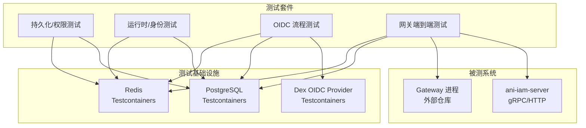
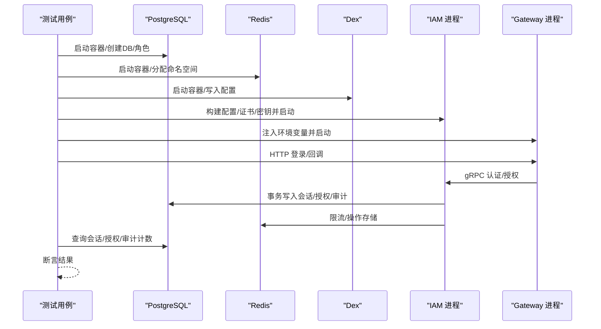
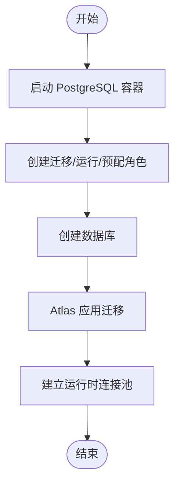
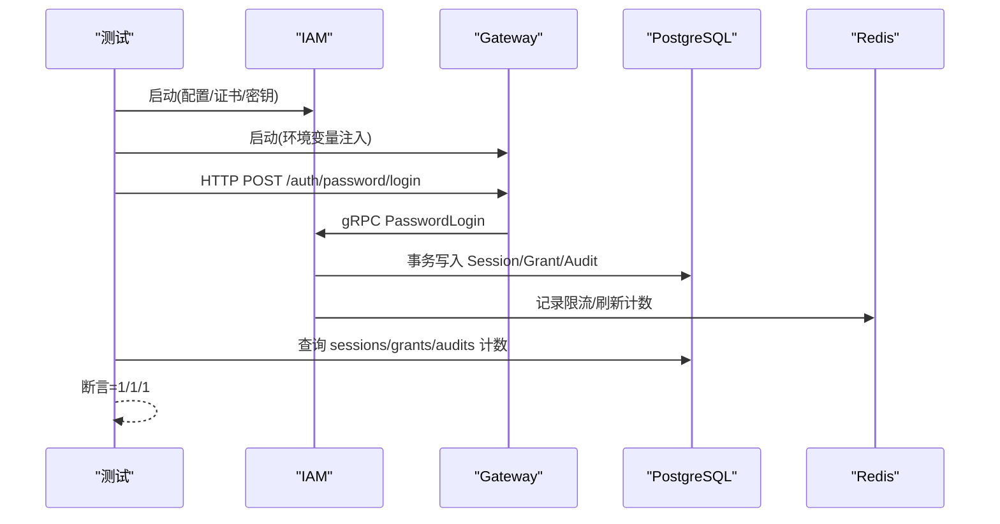
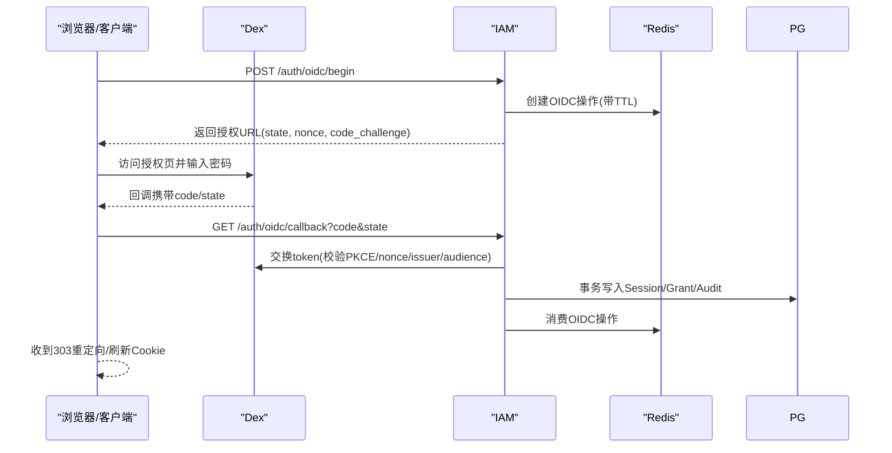
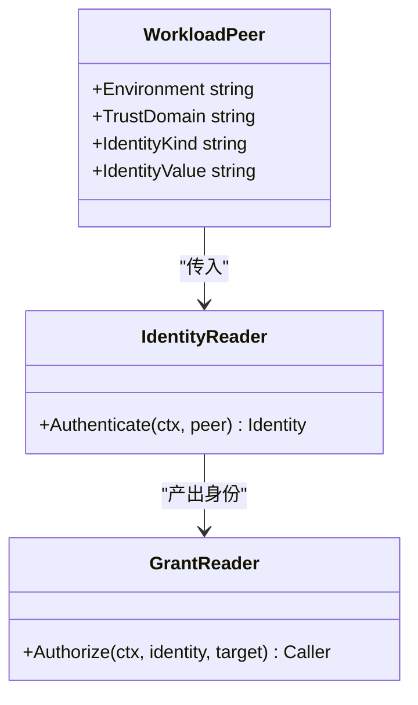
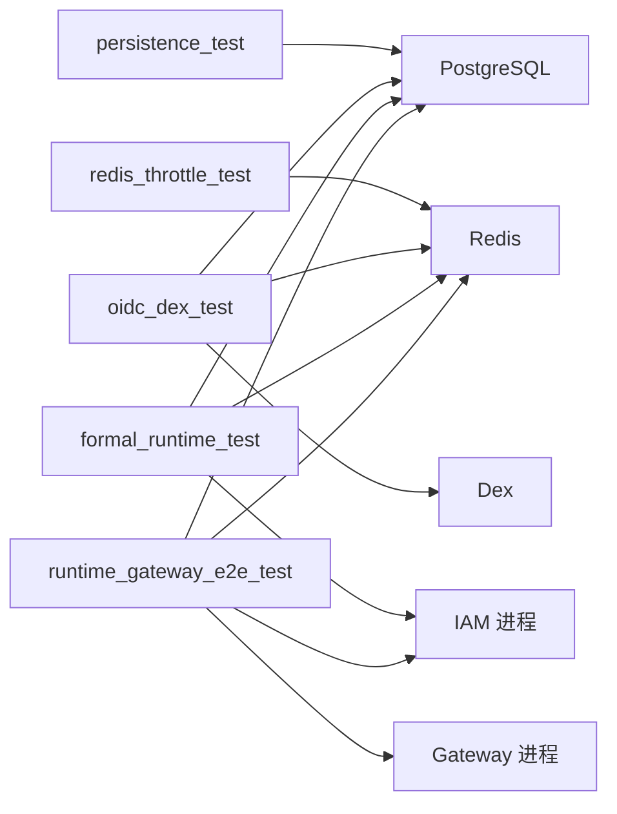

# 集成测试

<cite>
**本文引用的文件**
- [tests/integration/persistence_test.go](file://tests/integration/persistence_test.go)
- [tests/integration/redis_throttle_test.go](file://tests/integration/redis_throttle_test.go)
- [tests/integration/oidc_dex_test.go](file://tests/integration/oidc_dex_test.go)
- [tests/integration/wr20_oidc_test.go](file://tests/integration/wr20_oidc_test.go)
- [tests/integration/wr20_fixture_test.go](file://tests/integration/wr20_fixture_test.go)
- [tests/integration/runtime_gateway_e2e_test.go](file://tests/integration/runtime_gateway_e2e_test.go)
- [tests/integration/formal_runtime_test.go](file://tests/integration/formal_runtime_test.go)
- [tests/integration/vertical_slice_test.go](file://tests/integration/vertical_slice_test.go)
- [internal/data/oidc_redis.go](file://internal/data/oidc_redis.go)
- [migrations/202609100001_workload_runtime_foundation.sql](file://migrations/202609100001_workload_runtime_foundation.sql)
</cite>

## 目录
1. [简介](#简介)
2. [项目结构](#项目结构)
3. [核心组件](#核心组件)
4. [架构总览](#架构总览)
5. [详细组件分析](#详细组件分析)
6. [依赖关系分析](#依赖关系分析)
7. [性能与压力测试](#性能与压力测试)
8. [故障排查指南](#故障排查指南)
9. [结论](#结论)

## 简介
本文件面向“集成测试策略”的落地方案，基于仓库中已有的端到端与集成测试实现，系统化说明如何使用 Testcontainers 搭建 PostgreSQL 与 Redis 测试环境，如何编写覆盖数据库初始化、服务启动、API 调用验证的端到端用例；并给出 OIDC 集成测试与工作负载运行时测试的具体实现思路。同时涵盖测试数据管理、测试环境清理、并行执行优化、性能与压力测试实施方案，以及测试结果分析与报告生成建议。

## 项目结构
仓库将集成测试集中在 tests/integration 目录下，按能力域划分：
- 持久化与权限隔离：persistence_test.go、vertical_slice_test.go
- Redis 限流与键空间隔离：redis_throttle_test.go
- OIDC 协议与流程：oidc_dex_test.go、wr20_oidc_test.go
- 工作负载运行时与 mTLS：workload_runtime_test.go、formal_runtime_test.go
- 网关端到端：runtime_gateway_e2e_test.go

图表来源
- [tests/integration/persistence_test.go:572-690](file://tests/integration/persistence_test.go#L572-L690)
- [tests/integration/redis_throttle_test.go:20-33](file://tests/integration/redis_throttle_test.go#L20-L33)
- [tests/integration/oidc_dex_test.go:99-169](file://tests/integration/oidc_dex_test.go#L99-L169)
- [tests/integration/runtime_gateway_e2e_test.go:158-311](file://tests/integration/runtime_gateway_e2e_test.go#L158-L311)
- [tests/integration/formal_runtime_test.go:87-273](file://tests/integration/formal_runtime_test.go#L87-L273)

章节来源
- [tests/integration/persistence_test.go:572-690](file://tests/integration/persistence_test.go#L572-L690)
- [tests/integration/redis_throttle_test.go:20-33](file://tests/integration/redis_throttle_test.go#L20-L33)
- [tests/integration/oidc_dex_test.go:99-169](file://tests/integration/oidc_dex_test.go#L99-L169)
- [tests/integration/runtime_gateway_e2e_test.go:158-311](file://tests/integration/runtime_gateway_e2e_test.go#L158-L311)
- [tests/integration/formal_runtime_test.go:87-273](file://tests/integration/formal_runtime_test.go#L87-L273)

## 核心组件
- PostgreSQL 环境（Testcontainers）
  - 使用固定镜像与版本，创建独立数据库与角色（迁移、运行、预配），通过 Atlas 应用迁移，确保幂等与可回放。
  - 提供运行时连接池与迁移连接池，支持租户隔离与权限校验。
- Redis 环境（Testcontainers）
  - 为每个测试分配独立命名空间与端口，用于登录限流、刷新令牌计数、OIDC 操作存储等。
- Dex OIDC Provider（Testcontainers）
  - 固定镜像与配置，注入静态用户与客户端，模拟真实 OIDC 提供方，完成授权码+PKCE 流程。
- IAM 进程（正式二进制）
  - 在测试内构建或复用预构建二进制，生成证书、配置、密钥文件，启动后通过健康检查就绪。
- Gateway 进程（外部仓库）
  - 通过环境变量注入 IAM 地址、证书、Redis 等，进行端到端认证、授权、会话与审计链路验证。

章节来源
- [tests/integration/persistence_test.go:572-690](file://tests/integration/persistence_test.go#L572-L690)
- [tests/integration/redis_throttle_test.go:20-33](file://tests/integration/redis_throttle_test.go#L20-L33)
- [tests/integration/oidc_dex_test.go:99-169](file://tests/integration/oidc_dex_test.go#L99-L169)
- [tests/integration/formal_runtime_test.go:87-273](file://tests/integration/formal_runtime_test.go#L87-L273)
- [tests/integration/runtime_gateway_e2e_test.go:158-311](file://tests/integration/runtime_gateway_e2e_test.go#L158-L311)

## 架构总览
下图展示端到端测试的关键交互：测试驱动容器化依赖（PG/Redis/Dex），启动 IAM 与 Gateway，发起 HTTP/gRPC 请求，断言数据库状态与审计事件。

图表来源
- [tests/integration/runtime_gateway_e2e_test.go:158-311](file://tests/integration/runtime_gateway_e2e_test.go#L158-L311)
- [tests/integration/formal_runtime_test.go:87-273](file://tests/integration/formal_runtime_test.go#L87-L273)
- [tests/integration/persistence_test.go:572-690](file://tests/integration/persistence_test.go#L572-L690)
- [tests/integration/redis_throttle_test.go:20-33](file://tests/integration/redis_throttle_test.go#L20-L33)
- [tests/integration/oidc_dex_test.go:99-169](file://tests/integration/oidc_dex_test.go#L99-L169)

## 详细组件分析

### 使用 Testcontainers 搭建 PostgreSQL 与 Redis 测试环境
- PostgreSQL
  - 固定镜像与版本，创建 superuser 连接，动态创建迁移/运行/预配角色与数据库。
  - 通过 Atlas 命令对空库进行迁移回放，保证 schema 一致性与可重复性。
  - 提供运行时连接池与迁移连接池，分别用于业务读写与迁移安装。
- Redis
  - 为每个测试实例化独立 Redis 容器，设置唯一命名空间，避免并发冲突。
  - 用于登录限流、刷新令牌计数、OIDC 操作存储等。

图表来源
- [tests/integration/persistence_test.go:572-690](file://tests/integration/persistence_test.go#L572-L690)
- [tests/integration/persistence_test.go:715-729](file://tests/integration/persistence_test.go#L715-L729)

章节来源
- [tests/integration/persistence_test.go:572-690](file://tests/integration/persistence_test.go#L572-L690)
- [tests/integration/persistence_test.go:715-729](file://tests/integration/persistence_test.go#L715-L729)
- [tests/integration/redis_throttle_test.go:20-33](file://tests/integration/redis_throttle_test.go#L20-L33)

### 端到端测试：数据库初始化、服务启动、API 调用验证
- 数据库初始化
  - 通过 Atlas 对空库进行迁移回放，安装目标注册表，确保权限最小化与一致性。
- 服务启动
  - 生成 CA/证书/密钥文件，构造 IAM/Gateway 配置，启动进程并通过健康检查等待就绪。
- API 调用验证
  - 通过 HTTP/gRPC 发起登录、授权、会话刷新等操作，断言返回状态与数据库中的会话、授权、审计记录数量。

图表来源
- [tests/integration/runtime_gateway_e2e_test.go:158-311](file://tests/integration/runtime_gateway_e2e_test.go#L158-L311)
- [tests/integration/runtime_gateway_e2e_test.go:329-358](file://tests/integration/runtime_gateway_e2e_test.go#L329-L358)
- [tests/integration/formal_runtime_test.go:87-273](file://tests/integration/formal_runtime_test.go#L87-L273)

章节来源
- [tests/integration/runtime_gateway_e2e_test.go:158-311](file://tests/integration/runtime_gateway_e2e_test.go#L158-L311)
- [tests/integration/runtime_gateway_e2e_test.go:329-358](file://tests/integration/runtime_gateway_e2e_test.go#L329-L358)
- [tests/integration/formal_runtime_test.go:87-273](file://tests/integration/formal_runtime_test.go#L87-L273)

### OIDC 集成测试（含 PKCE、状态机、失败恢复）
- 使用固定 Dex 镜像，注入静态客户端与用户，完成授权码+PKCE 流程。
- 验证 state/nonce/code_verifier 绑定、回调重定向、错误场景（过期、签名错误、跨流程）。
- 结合 Redis 存储 OIDC 操作，确保幂等与状态一致性。

图表来源
- [tests/integration/oidc_dex_test.go:99-169](file://tests/integration/oidc_dex_test.go#L99-L169)
- [tests/integration/wr20_oidc_test.go:25-94](file://tests/integration/wr20_oidc_test.go#L25-L94)
- [internal/data/oidc_redis.go:25-54](file://internal/data/oidc_redis.go#L25-L54)

章节来源
- [tests/integration/oidc_dex_test.go:99-169](file://tests/integration/oidc_dex_test.go#L99-L169)
- [tests/integration/wr20_oidc_test.go:25-94](file://tests/integration/wr20_oidc_test.go#L25-L94)
- [internal/data/oidc_redis.go:25-54](file://internal/data/oidc_redis.go#L25-L54)

### 工作负载运行时测试（mTLS、身份绑定、授权边界）
- 通过直接 SQL 注入工作负载身份绑定与授权，验证当前信任域与环境下的身份认证与授权判定。
- 验证运行时角色无法越权修改敏感表，复合外键约束阻止跨租户关联。
- 通过正式 IAM 进程与 Gateway 进程进行 mTLS 通信，验证健康检查、权限拒绝、会话与审计。

图表来源
- [tests/integration/workload_runtime_test.go:22-62](file://tests/integration/workload_runtime_test.go#L22-L62)
- [tests/integration/workload_runtime_test.go:82-153](file://tests/integration/workload_runtime_test.go#L82-L153)
- [tests/integration/formal_runtime_test.go:303-483](file://tests/integration/formal_runtime_test.go#L303-L483)

章节来源
- [tests/integration/workload_runtime_test.go:22-62](file://tests/integration/workload_runtime_test.go#L22-L62)
- [tests/integration/workload_runtime_test.go:82-153](file://tests/integration/workload_runtime_test.go#L82-L153)
- [tests/integration/formal_runtime_test.go:303-483](file://tests/integration/formal_runtime_test.go#L303-L483)

### 测试数据管理与环境清理
- 数据管理
  - 通过迁移回放与精确安装目标注册表，保证 schema 与权限基线稳定。
  - 使用固定 ID 与时间戳辅助断言原子性与幂等。
- 环境清理
  - 所有容器在 t.Cleanup 中终止，关闭连接池，释放端口。
  - 临时目录与私钥文件置于测试专属目录，避免污染。

章节来源
- [tests/integration/persistence_test.go:572-690](file://tests/integration/persistence_test.go#L572-L690)
- [tests/integration/oidc_dex_test.go:37-48](file://tests/integration/oidc_dex_test.go#L37-L48)
- [tests/integration/runtime_gateway_e2e_test.go:265-311](file://tests/integration/runtime_gateway_e2e_test.go#L265-L311)

### 并行执行优化
- 端口与主机名隔离
  - 通过 Testcontainers 暴露随机宿主端口，并使用 loopback 地址映射，避免端口竞争。
- 命名空间隔离
  - Redis 使用唯一命名空间，避免键冲突。
- 资源隔离
  - 每个测试拥有独立的 PG/Redis/Dex 实例，减少相互干扰。
- 超时与重试
  - 健康检查与就绪探测采用短超时轮询，快速失败与恢复。

章节来源
- [tests/integration/persistence_test.go:572-690](file://tests/integration/persistence_test.go#L572-L690)
- [tests/integration/redis_throttle_test.go:20-33](file://tests/integration/redis_throttle_test.go#L20-L33)
- [tests/integration/runtime_gateway_e2e_test.go:281-311](file://tests/integration/runtime_gateway_e2e_test.go#L281-L311)

## 依赖关系分析
- 测试与依赖
  - persistence_test 依赖 PG（迁移/权限）、Atlas、目标注册表。
  - redis_throttle_test 依赖 Redis（限流/刷新计数）。
  - oidc_dex_test 依赖 Dex（OIDC 提供方）、PG（身份/会话）、Redis（操作存储）。
  - formal_runtime_test 依赖 PG、Redis、IAM 进程（mTLS）。
  - runtime_gateway_e2e_test 依赖 IAM、Gateway、PG、Redis。
- 内部模块依赖
  - OIDC 操作存储在 Redis 中使用 Lua 脚本保证原子性。
  - 工作负载运行时依赖 PG 的约束与角色权限模型。

图表来源
- [tests/integration/persistence_test.go:572-690](file://tests/integration/persistence_test.go#L572-L690)
- [tests/integration/redis_throttle_test.go:20-33](file://tests/integration/redis_throttle_test.go#L20-L33)
- [tests/integration/oidc_dex_test.go:99-169](file://tests/integration/oidc_dex_test.go#L99-L169)
- [tests/integration/formal_runtime_test.go:87-273](file://tests/integration/formal_runtime_test.go#L87-L273)
- [tests/integration/runtime_gateway_e2e_test.go:158-311](file://tests/integration/runtime_gateway_e2e_test.go#L158-L311)

章节来源
- [tests/integration/persistence_test.go:572-690](file://tests/integration/persistence_test.go#L572-L690)
- [tests/integration/redis_throttle_test.go:20-33](file://tests/integration/redis_throttle_test.go#L20-L33)
- [tests/integration/oidc_dex_test.go:99-169](file://tests/integration/oidc_dex_test.go#L99-L169)
- [tests/integration/formal_runtime_test.go:87-273](file://tests/integration/formal_runtime_test.go#L87-L273)
- [tests/integration/runtime_gateway_e2e_test.go:158-311](file://tests/integration/runtime_gateway_e2e_test.go#L158-L311)

## 性能与压力测试
- 设计要点
  - 使用独立 PG/Redis 实例，避免共享资源争用。
  - 通过批量登录/刷新/授权请求模拟高并发，观察限流与回退行为。
  - 利用 Docker pause/unpause 注入依赖故障，验证服务降级与恢复。
- 实施建议
  - 以垂直切片测试为基础，扩展并发登录与刷新路径，统计延迟分布与错误率。
  - 针对 OIDC 流程，增加并发授权与回调处理，验证 Redis 操作存储的吞吐与一致性。
  - 针对工作负载运行时，增加并发身份认证与授权判定，验证 PG 约束与锁行为。
- 指标采集
  - 收集响应时间、QPS、错误码分布、数据库连接池使用率、Redis 命中率。
  - 记录健康检查与就绪状态的切换频率，评估稳定性。

[本节为通用指导，不直接分析具体文件]

## 故障排查指南
- 常见错误定位
  - 数据库权限不足：检查运行时角色权限与迁移安装是否成功。
  - Redis 不可用：检查命名空间与端口映射，确认容器存活与网络可达。
  - OIDC 回调失败：核对 state/nonce/code_verifier/redirect_uri 绑定与域名白名单。
  - mTLS 握手失败：检查证书链、服务器名称与 RootCA 配置。
- 诊断步骤
  - 查看 IAM/Gateway 日志输出，定位启动失败与运行时异常。
  - 查询 PG 中的 sessions/grants/audits 计数，验证事务原子性。
  - 检查 Redis 键 TTL 与命名空间，确认限流与操作存储正确。
  - 使用 Docker pause/unpause 注入依赖故障，验证服务降级与恢复。

章节来源
- [tests/integration/runtime_gateway_e2e_test.go:281-311](file://tests/integration/runtime_gateway_e2e_test.go#L281-L311)
- [tests/integration/formal_runtime_test.go:440-483](file://tests/integration/formal_runtime_test.go#L440-L483)
- [tests/integration/redis_throttle_test.go:144-168](file://tests/integration/redis_throttle_test.go#L144-L168)

## 结论
本仓库的集成测试体系以 Testcontainers 为核心，围绕 PostgreSQL、Redis、Dex 构建稳定且可复现的测试环境。通过端到端测试覆盖数据库初始化、服务启动、API 调用验证；OIDC 与工作负载运行时测试覆盖了关键安全与权限边界。测试数据管理与环境清理确保了并行执行的可靠性。在此基础上，可通过扩展并发场景与依赖故障注入，形成完善的性能与压力测试方案，并结合日志与指标进行结果分析与报告生成。