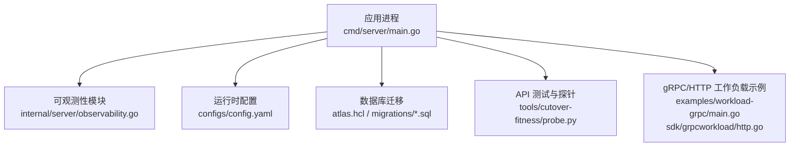
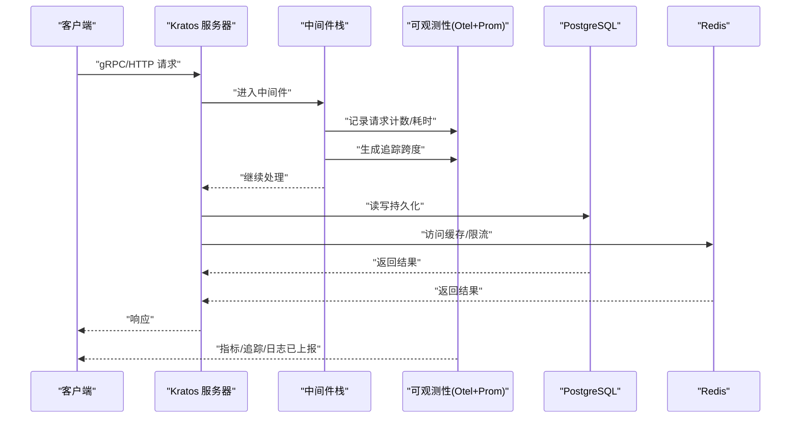
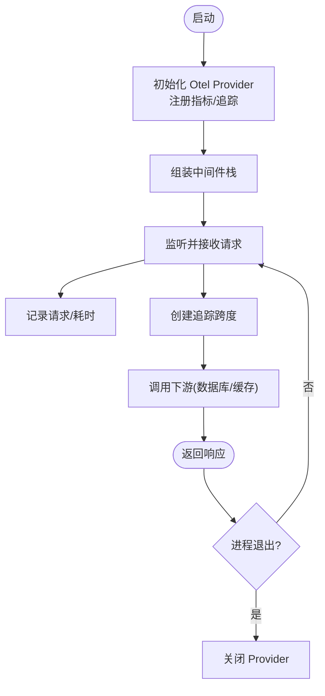
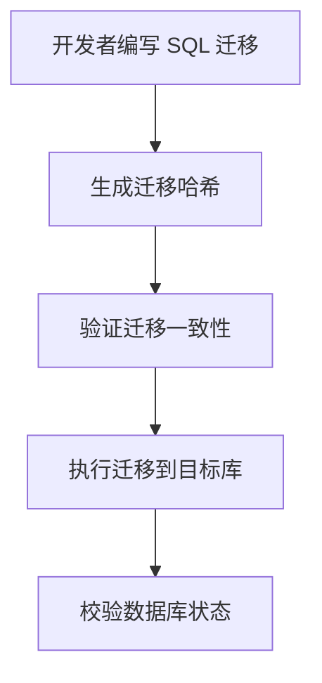
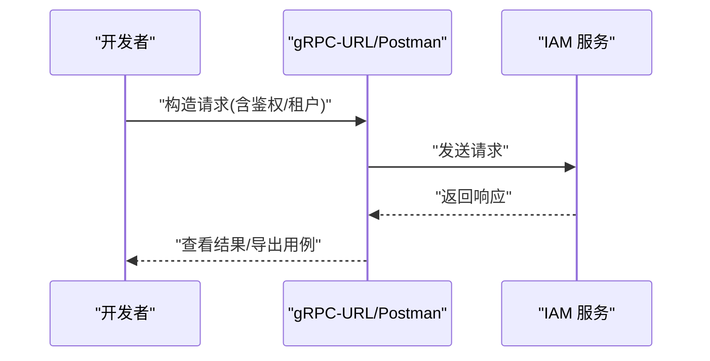
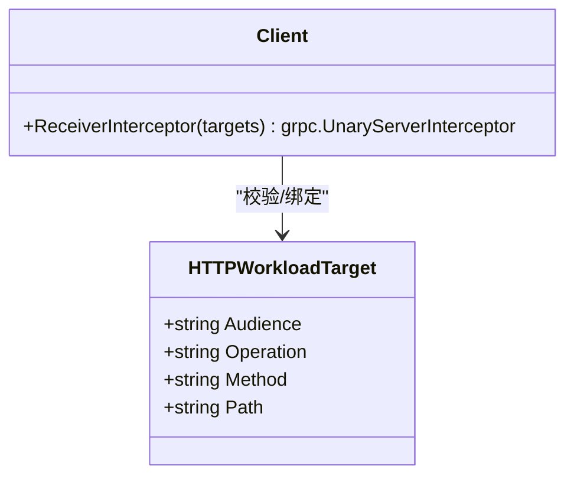
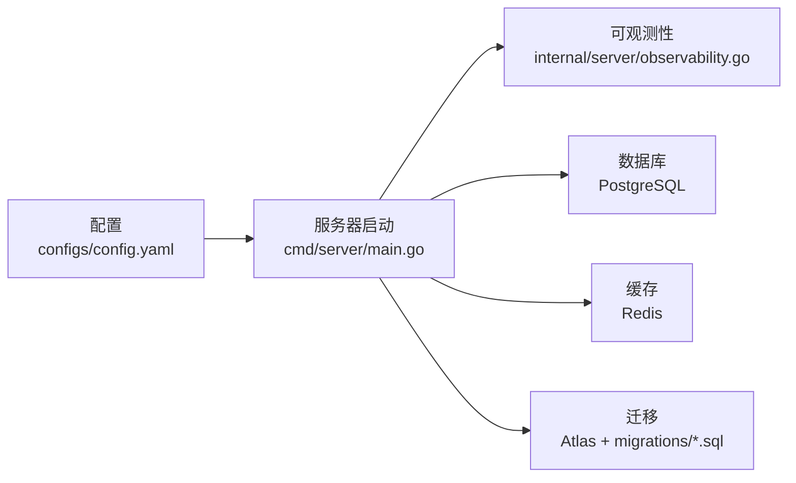

# 调试与工具

<cite>
**本文引用的文件**
- [configs/config.yaml](file://configs/config.yaml)
- [internal/server/observability.go](file://internal/server/observability.go)
- [cmd/server/main.go](file://cmd/server/main.go)
- [atlas.hcl](file://atlas.hcl)
- [migrations/202609040001_persistence_foundation.sql](file://migrations/202609040001_persistence_foundation.sql)
- [tools/cutover-fitness/probe.py](file://tools/cutover-fitness/probe.py)
- [api/README.md](file://api/README.md)
- [examples/workload-grpc/main.go](file://examples/workload-grpc/main.go)
- [sdk/grpcworkload/http.go](file://sdk/grpcworkload/http.go)
- [internal/conf/validate.go](file://internal/conf/validate.go)
</cite>

## 目录
1. [简介](#简介)
2. [项目结构](#项目结构)
3. [核心组件](#核心组件)
4. [架构总览](#架构总览)
5. [详细组件分析](#详细组件分析)
6. [依赖关系分析](#依赖关系分析)
7. [性能注意事项](#性能注意事项)
8. [故障排查指南](#故障排查指南)
9. [结论](#结论)
10. [附录](#附录)

## 简介
本章节面向开发者，系统化介绍本项目在调试与开发辅助方面的工具链与实践，重点覆盖：
- OpenTelemetry 监控与追踪的配置、指标导出与链路传播
- 结构化日志收集与敏感信息过滤
- 数据库迁移工具 Atlas 的使用方式
- API 测试工具（gRPC-URL、Postman）在本项目的配置与使用建议
- 性能分析与优化建议
- 常见问题定位技巧与排障流程

## 项目结构
围绕“可观测性 + 迁移 + 测试”的三大主题，关键位置如下：
- 可观测性初始化与中间件装配：internal/server/observability.go
- 启动入口与日志处理器：cmd/server/main.go
- 运行时配置（含 gRPC/TLS、Redis、OIDC、通知等）：configs/config.yaml
- 数据库迁移配置与脚本：atlas.hcl、migrations/*.sql
- 端到端探针与冒烟测试：tools/cutover-fitness/probe.py
- gRPC/HTTP 工作负载调用示例与头约定：examples/workload-grpc/main.go、sdk/grpcworkload/http.go
- 配置校验规则：internal/conf/validate.go

**图表来源**
- [cmd/server/main.go:34-101](file://cmd/server/main.go#L34-L101)
- [internal/server/observability.go:41-143](file://internal/server/observability.go#L41-L143)
- [configs/config.yaml:1-61](file://configs/config.yaml#L1-L61)
- [atlas.hcl:1-8](file://atlas.hcl#L1-L8)
- [migrations/202609040001_persistence_foundation.sql:1-148](file://migrations/202609040001_persistence_foundation.sql#L1-L148)
- [tools/cutover-fitness/probe.py:171-241](file://tools/cutover-fitness/probe.py#L171-L241)
- [examples/workload-grpc/main.go:29-40](file://examples/workload-grpc/main.go#L29-L40)
- [sdk/grpcworkload/http.go:19-39](file://sdk/grpcworkload/http.go#L19-L39)

**章节来源**
- [cmd/server/main.go:34-101](file://cmd/server/main.go#L34-L101)
- [internal/server/observability.go:41-143](file://internal/server/observability.go#L41-L143)
- [configs/config.yaml:1-61](file://configs/config.yaml#L1-L61)
- [atlas.hcl:1-8](file://atlas.hcl#L1-L8)
- [migrations/202609040001_persistence_foundation.sql:1-148](file://migrations/202609040001_persistence_foundation.sql#L1-L148)
- [tools/cutover-fitness/probe.py:171-241](file://tools/cutover-fitness/probe.py#L171-L241)
- [examples/workload-grpc/main.go:29-40](file://examples/workload-grpc/main.go#L29-L40)
- [sdk/grpcworkload/http.go:19-39](file://sdk/grpcworkload/http.go#L19-L39)

## 核心组件
- 可观测性（OpenTelemetry + Prometheus）
  - 创建并注册 Go 与进程指标采集器
  - 通过 OTel Prometheus Exporter 将指标暴露给 Prometheus
  - 设置服务名与版本资源属性
  - 启用请求计数与耗时直方图（Kratos 集成）
  - 定义自定义指标（就绪状态、API Key 异常统计、快照时间戳）
  - 注入 Kratos 中间件栈（恢复、元数据、追踪、日志、度量、校验）
  - 设置全局 TracerProvider/MeterProvider 与文本映射传播器（TraceContext + Baggage）
- 日志系统
  - JSON 格式输出，开启源码行号
  - 自动提取追踪上下文属性
  - 过滤敏感键（如密码、令牌、DSN、私钥等）
- 配置与校验
  - 强制隔离运行模式
  - 校验监听地址、超时、TLS 证书路径与网关客户端 DNS 身份
  - 禁止 gRPC 与 admin 监听端口冲突
- 数据库迁移
  - 使用 Atlas 管理迁移目录与哈希校验
  - 首次迁移建立基础 schema 与权限

**章节来源**
- [internal/server/observability.go:41-143](file://internal/server/observability.go#L41-L143)
- [internal/server/observability.go:160-179](file://internal/server/observability.go#L160-L179)
- [cmd/server/main.go:104-131](file://cmd/server/main.go#L104-L131)
- [internal/conf/validate.go:19-45](file://internal/conf/validate.go#L19-L45)
- [internal/conf/validate.go:47-90](file://internal/conf/validate.go#L47-L90)
- [atlas.hcl:1-8](file://atlas.hcl#L1-L8)
- [migrations/202609040001_persistence_foundation.sql:1-148](file://migrations/202609040001_persistence_foundation.sql#L1-L148)

## 架构总览
下图展示了从请求进入、中间件处理到指标/追踪/日志输出的整体流程。

**图表来源**
- [internal/server/observability.go:160-171](file://internal/server/observability.go#L160-L171)
- [internal/server/observability.go:41-143](file://internal/server/observability.go#L41-L143)

## 详细组件分析

### OpenTelemetry 监控与追踪
- 指标体系
  - 内置：Go 运行时、进程指标；Kratos 默认请求计数与耗时直方图
  - 自定义：服务就绪、API Key 异常计数、快照时间戳
  - 导出：OTel Prometheus Exporter 聚合到 Prometheus Registry
- 追踪链路
  - 设置 TracerProvider 与采样策略
  - 设置 TextMapPropagator（TraceContext + Baggage），跨服务传递上下文
- 中间件集成
  - 恢复、元数据、追踪、日志、度量、校验按序组合
- 关闭流程
  - 优雅关闭 MeterProvider 与 TracerProvider

**图表来源**
- [internal/server/observability.go:41-143](file://internal/server/observability.go#L41-L143)
- [internal/server/observability.go:160-179](file://internal/server/observability.go#L160-L179)

**章节来源**
- [internal/server/observability.go:41-143](file://internal/server/observability.go#L41-L143)
- [internal/server/observability.go:160-179](file://internal/server/observability.go#L160-L179)

### 日志收集与分析
- 输出格式：JSON，便于集中式日志平台解析
- 字段增强：自动注入追踪上下文，便于关联请求链路
- 安全过滤：对敏感键进行过滤，避免泄露密码、令牌、DSN、私钥等
- 建议：
  - 统一以结构化日志输出业务事件
  - 结合 TraceID/CorrelationID 进行全链路检索
  - 在日志中保留必要上下文（租户、操作、决策 ID）

**章节来源**
- [cmd/server/main.go:104-131](file://cmd/server/main.go#L104-L131)

### 数据库迁移工具 Atlas
- 环境配置：通过环境变量 DATABASE_URL 指定目标库
- 迁移目录：指向 migrations 目录
- 常用命令（概念说明）：
  - 生成迁移哈希：用于一致性校验
  - 验证迁移：检查迁移脚本与期望状态一致
  - 执行迁移：在生产或测试环境中推进数据库版本
- 首次迁移：创建基础表结构与权限，确保最小可用 schema

**图表来源**
- [atlas.hcl:1-8](file://atlas.hcl#L1-L8)
- [migrations/202609040001_persistence_foundation.sql:1-148](file://migrations/202609040001_persistence_foundation.sql#L1-L148)

**章节来源**
- [atlas.hcl:1-8](file://atlas.hcl#L1-L8)
- [migrations/202609040001_persistence_foundation.sql:1-148](file://migrations/202609040001_persistence_foundation.sql#L1-L148)

### API 测试工具（gRPC-URL、Postman）
- gRPC-URL
  - 适用于快速调试 gRPC 接口，支持 TLS 与认证头
  - 结合项目中的 gRPC 监听地址与 TLS 配置进行连接
- Postman
  - 适合 HTTP 接口与 OIDC 回调流程的调试
  - 可通过环境变量注入令牌、租户边界等信息
- 本地冒烟测试
  - 提供 Python 探针，支持 TCP/UDP 回显、存储往返、DNS 解析与 HTTP 冒烟
  - 可用于快速验证服务就绪、登录与受保护资源访问

**图表来源**
- [configs/config.yaml:2-16](file://configs/config.yaml#L2-L16)
- [tools/cutover-fitness/probe.py:171-241](file://tools/cutover-fitness/probe.py#L171-L241)

**章节来源**
- [configs/config.yaml:2-16](file://configs/config.yaml#L2-L16)
- [tools/cutover-fitness/probe.py:171-241](file://tools/cutover-fitness/probe.py#L171-L241)
- [api/README.md:1-8](file://api/README.md#L1-L8)

### 工作负载 gRPC/HTTP 调用示例
- 示例程序
  - 展示如何加载工作负载注册表、配置 IAM 客户端、发起调用
- HTTP 工作负载头约定
  - 工作负载令牌头
  - 目标修订头
  - 用于服务端校验与路由

**图表来源**
- [examples/workload-grpc/main.go:29-40](file://examples/workload-grpc/main.go#L29-L40)
- [sdk/grpcworkload/http.go:19-39](file://sdk/grpcworkload/http.go#L19-L39)

**章节来源**
- [examples/workload-grpc/main.go:29-40](file://examples/workload-grpc/main.go#L29-L40)
- [sdk/grpcworkload/http.go:19-39](file://sdk/grpcworkload/http.go#L19-L39)

## 依赖关系分析
- 可观测性与框架
  - 基于 Kratos 中间件生态，集成 OTel 指标与追踪
  - 通过 Prometheus Registry 暴露指标
- 配置与运行时
  - 配置文件驱动 gRPC/TLS、Redis、OIDC、通知等
  - 严格校验监听地址、超时与 TLS 参数
- 迁移与数据层
  - Atlas 管理迁移脚本与一致性校验
  - 首版迁移建立基础 schema 与权限模型

**图表来源**
- [configs/config.yaml:1-61](file://configs/config.yaml#L1-L61)
- [cmd/server/main.go:34-101](file://cmd/server/main.go#L34-L101)
- [internal/server/observability.go:41-143](file://internal/server/observability.go#L41-L143)
- [atlas.hcl:1-8](file://atlas.hcl#L1-L8)
- [migrations/202609040001_persistence_foundation.sql:1-148](file://migrations/202609040001_persistence_foundation.sql#L1-L148)

**章节来源**
- [configs/config.yaml:1-61](file://configs/config.yaml#L1-L61)
- [cmd/server/main.go:34-101](file://cmd/server/main.go#L34-L101)
- [internal/server/observability.go:41-143](file://internal/server/observability.go#L41-L143)
- [atlas.hcl:1-8](file://atlas.hcl#L1-L8)
- [migrations/202609040001_persistence_foundation.sql:1-148](file://migrations/202609040001_persistence_foundation.sql#L1-L148)

## 性能注意事项
- 指标采集
  - 使用直方图观察请求延迟分布，识别长尾请求
  - 关注自定义就绪与异常指标，及时告警
- 追踪采样
  - 当前采用父级决定且始终采样，生产环境可按需调整采样策略以降低开销
- 日志量控制
  - 利用敏感键过滤减少噪音与安全风险
  - 在高吞吐场景下，合理设置日志级别与采样
- 数据库与缓存
  - 通过查询与索引优化热点路径
  - Redis 限流与节流参数调优，避免雪崩

[本节为通用指导，不直接分析具体文件]

## 故障排查指南
- 启动失败
  - 检查配置文件是否满足隔离模式与监听地址要求
  - 确认 TLS 证书路径为绝对路径且存在
  - 确认 gRPC 与 admin 监听地址不冲突
- 无法连接数据库/缓存
  - 核对 DSN、网络可达性与凭据
  - 检查迁移是否已正确执行
- 指标未上报
  - 确认 Prometheus Exporter 已注册并暴露
  - 检查中间件栈是否包含度量与追踪
- 追踪缺失
  - 确认全局 TracerProvider 已设置
  - 确认 TextMapPropagator 已启用
- 冒烟测试失败
  - 使用探针工具验证 TCP/UDP/DNS/HTTP 能力
  - 逐步缩小问题范围（网络、证书、鉴权）

**章节来源**
- [internal/conf/validate.go:19-45](file://internal/conf/validate.go#L19-L45)
- [internal/conf/validate.go:47-90](file://internal/conf/validate.go#L47-L90)
- [internal/server/observability.go:41-143](file://internal/server/observability.go#L41-L143)
- [tools/cutover-fitness/probe.py:171-241](file://tools/cutover-fitness/probe.py#L171-L241)

## 结论
本项目以 OpenTelemetry 为核心构建可观测性体系，配合结构化日志与严格的配置校验，形成稳定的开发与运维基线。Atlas 保障数据库演进的可控与可回溯，探针与示例代码为 API 测试与联调提供了便捷手段。遵循本文档的实践，开发者可以高效定位问题、持续优化性能并确保交付质量。

## 附录
- 常用命令参考（概念说明）
  - Atlas 迁移哈希与验证：用于保证迁移一致性与可重复性
  - 探针冒烟：快速验证服务健康与基本功能
- 相关文档
  - gRPC 契约与生成说明：了解接口版本与生成约束

**章节来源**
- [api/README.md:1-8](file://api/README.md#L1-L8)