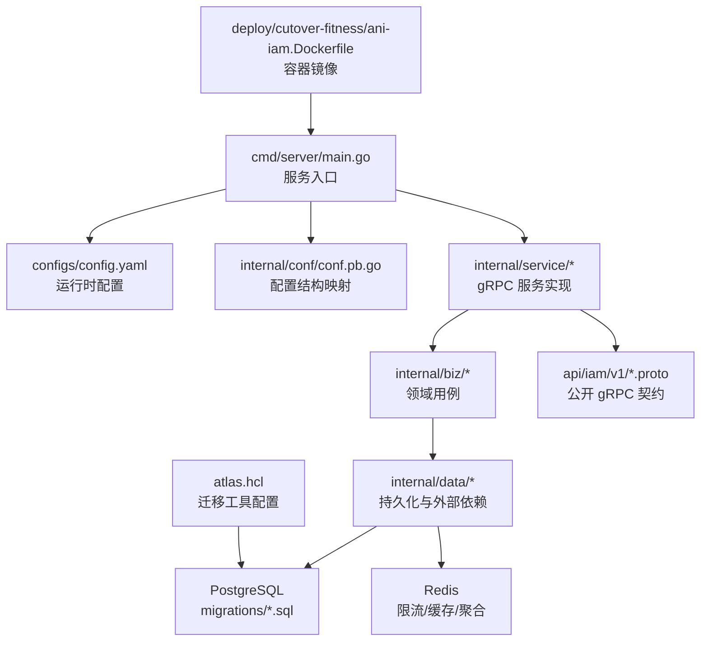
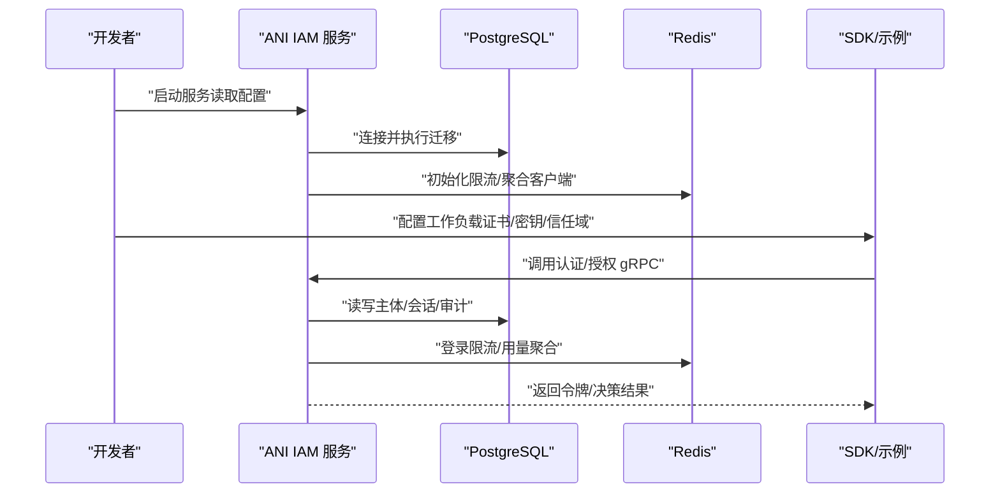
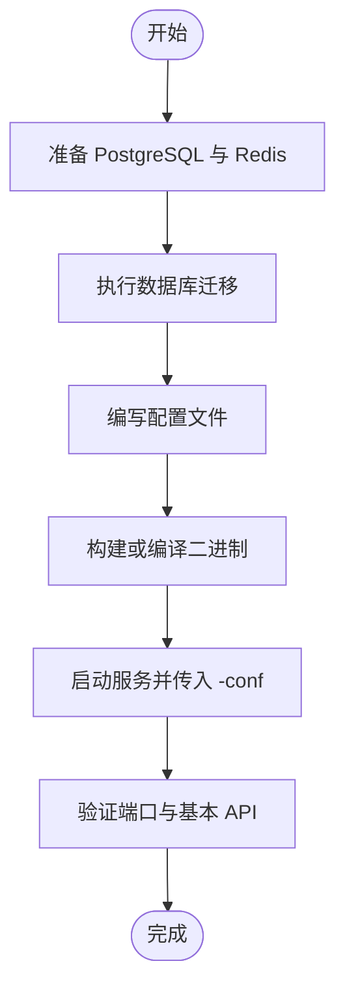
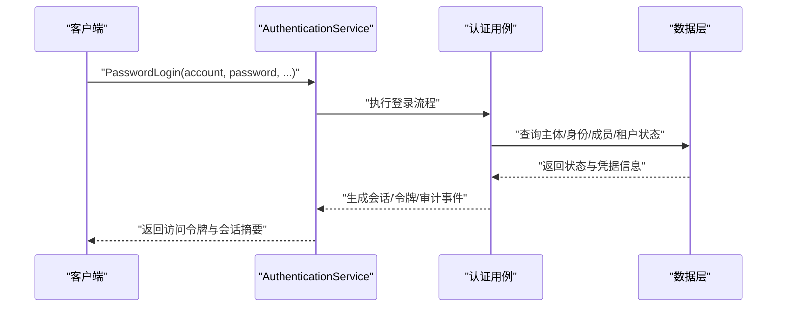
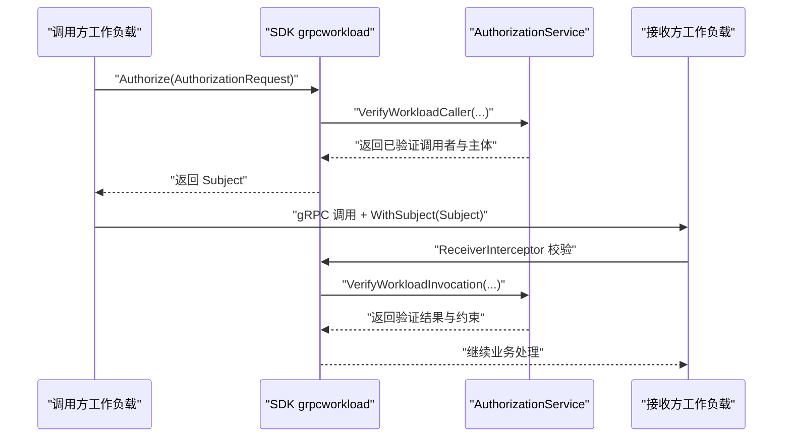
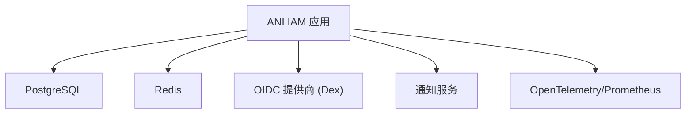

# 快速开始

<cite>
**本文引用的文件**
- [README.md](file://README.md)
- [go.mod](file://go.mod)
- [configs/config.yaml](file://configs/config.yaml)
- [cmd/server/main.go](file://cmd/server/main.go)
- [deploy/cutover-fitness/ani-iam.Dockerfile](file://deploy/cutover-fitness/ani-iam.Dockerfile)
- [atlas.hcl](file://atlas.hcl)
- [migrations/202609040001_persistence_foundation.sql](file://migrations/202609040001_persistence_foundation.sql)
- [api/iam/v1/authentication_service.proto](file://api/iam/v1/authentication_service.proto)
- [api/iam/v1/authorization_service.proto](file://api/iam/v1/authorization_service.proto)
- [sdk/README.md](file://sdk/README.md)
- [examples/workload-grpc/main.go](file://examples/workload-grpc/main.go)
- [internal/conf/conf.pb.go](file://internal/conf/conf.pb.go)
- [internal/service/authentication.go](file://internal/service/authentication.go)
- [internal/data/workload_token_jwx.go](file://internal/data/workload_token_jwx.go)
</cite>

## 目录
1. [简介](#简介)
2. [项目结构](#项目结构)
3. [核心组件](#核心组件)
4. [架构总览](#架构总览)
5. [详细组件分析](#详细组件分析)
6. [依赖分析](#依赖分析)
7. [性能考虑](#性能考虑)
8. [故障排查指南](#故障排查指南)
9. [结论](#结论)
10. [附录](#附录)

## 简介
本快速开始指南面向首次接触 ANI IAM 的开发者，目标是在约 30 分钟内完成环境准备、安装部署、基础配置与第一个 API 调用验证。ANI IAM 是独立的身份与访问控制服务，提供人类与工作负载的身份、凭据、会话、成员关系、角色绑定与权限判定能力，并通过 gRPC 暴露认证与授权接口，配合 SDK 简化工作负载间的受控调用。

## 项目结构
仓库采用分层组织：API 契约定义在 api 目录；服务端入口与启动逻辑位于 cmd/server；运行时配置在 configs；数据库迁移脚本在 migrations；Docker 构建脚本在 deploy；SDK 与示例在 sdk 与 examples；内部业务、数据访问、服务层分别位于 internal/biz、internal/data、internal/service。

图表来源
- [cmd/server/main.go:34-101](file://cmd/server/main.go#L34-L101)
- [configs/config.yaml:1-61](file://configs/config.yaml#L1-L61)
- [internal/conf/conf.pb.go:964-1089](file://internal/conf/conf.pb.go#L964-L1089)
- [api/iam/v1/authentication_service.proto:11-33](file://api/iam/v1/authentication_service.proto#L11-L33)
- [api/iam/v1/authorization_service.proto:10-16](file://api/iam/v1/authorization_service.proto#L10-L16)
- [migrations/202609040001_persistence_foundation.sql:1-148](file://migrations/202609040001_persistence_foundation.sql#L1-L148)
- [deploy/cutover-fitness/ani-iam.Dockerfile:1-15](file://deploy/cutover-fitness/ani-iam.Dockerfile#L1-L15)
- [atlas.hcl:1-8](file://atlas.hcl#L1-L8)

章节来源
- [README.md:1-13](file://README.md#L1-L13)
- [go.mod:1-37](file://go.mod#L1-L37)

## 核心组件
- 服务入口与生命周期：main 负责解析命令行参数、加载配置文件、初始化日志与运行期 CPU 配额，并启动应用。
- 配置系统：通过 YAML 与环境变量合并，映射到强类型配置结构，包含 gRPC/Admin 监听地址、TLS、PostgreSQL、Redis、OIDC、通知、访问令牌等。
- 认证服务：提供密码登录、OIDC 登录、会话刷新、登出、租户切换、会话列表与撤销、主体校验、工作负载令牌签发与委托等。
- 授权服务：提供工作负载调用者校验、会话延续校验、权限检查与工作负载调用验证。
- 数据层：PostgreSQL 存储主体、租户、成员、角色、审计等；Redis 用于登录限流、API Key 使用量聚合等。
- 工作负载安全：基于 EdDSA 签名的工作负载 JWT，结合注册表与策略版本进行严格校验。

章节来源
- [cmd/server/main.go:34-101](file://cmd/server/main.go#L34-L101)
- [configs/config.yaml:1-61](file://configs/config.yaml#L1-L61)
- [internal/conf/conf.pb.go:964-1089](file://internal/conf/conf.pb.go#L964-L1089)
- [api/iam/v1/authentication_service.proto:11-33](file://api/iam/v1/authentication_service.proto#L11-L33)
- [api/iam/v1/authorization_service.proto:10-16](file://api/iam/v1/authorization_service.proto#L10-L16)
- [internal/service/authentication.go:181-211](file://internal/service/authentication.go#L181-L211)
- [internal/data/workload_token_jwx.go:18-213](file://internal/data/workload_token_jwx.go#L18-L213)

## 架构总览
ANI IAM 以 gRPC 对外暴露认证与授权能力，内部通过领域用例与数据访问层对接 PostgreSQL 与 Redis。工作负载通过 mTLS 与 SDK 发起受控调用，IAM 对请求进行在线验证与权限决策，确保“失败关闭”的安全模型。

图表来源
- [cmd/server/main.go:34-101](file://cmd/server/main.go#L34-L101)
- [configs/config.yaml:1-61](file://configs/config.yaml#L1-L61)
- [migrations/202609040001_persistence_foundation.sql:1-148](file://migrations/202609040001_persistence_foundation.sql#L1-L148)
- [api/iam/v1/authentication_service.proto:11-33](file://api/iam/v1/authentication_service.proto#L11-L33)
- [api/iam/v1/authorization_service.proto:10-16](file://api/iam/v1/authorization_service.proto#L10-L16)

## 详细组件分析

### 环境准备要求
- Go 版本：根据模块声明，需使用 Go 1.26.7 或更高版本。
- PostgreSQL：需要可连接的数据库实例，IAM 使用专用 schema 与用户，迁移脚本会创建必要表结构与索引。
- Redis：用于登录限流、API Key 使用量聚合等，需配置地址、数据库号、命名空间与超时。
- TLS 与 OIDC：生产环境建议启用 gRPC TLS 与 OIDC 集成（如 Dex），本地开发可暂时跳过或替换为测试值。
- 工作负载注册表与策略版本：服务启动时需要加载工作负载注册表与策略修订，确保调用方与接收方一致。

章节来源
- [go.mod:1-37](file://go.mod#L1-L37)
- [configs/config.yaml:17-61](file://configs/config.yaml#L17-L61)
- [migrations/202609040001_persistence_foundation.sql:1-148](file://migrations/202609040001_persistence_foundation.sql#L1-L148)

### 安装与部署步骤
- 克隆仓库并进入根目录。
- 准备 PostgreSQL 与 Redis 实例，确保网络可达。
- 使用 Atlas 执行迁移：设置 DATABASE_URL 指向目标库，运行迁移将创建 schema、表、索引与权限。
- 编写或复制配置文件：至少配置 gRPC/Admin 监听地址、PostgreSQL DSN、Redis 地址与命名空间、访问令牌发行者与私钥路径、OIDC 提供商与回调地址。
- 构建并运行服务：可直接使用 go run 或构建二进制后启动，传入 -conf 指定配置文件路径。
- 验证健康：通过 admin 端口或 gRPC 健康检查确认服务就绪。

图表来源
- [atlas.hcl:1-8](file://atlas.hcl#L1-L8)
- [migrations/202609040001_persistence_foundation.sql:1-148](file://migrations/202609040001_persistence_foundation.sql#L1-L148)
- [configs/config.yaml:1-61](file://configs/config.yaml#L1-L61)
- [cmd/server/main.go:34-101](file://cmd/server/main.go#L34-L101)

章节来源
- [atlas.hcl:1-8](file://atlas.hcl#L1-L8)
- [cmd/server/main.go:34-101](file://cmd/server/main.go#L34-L101)

### Docker 容器化部署
- 镜像构建：仓库提供多阶段 Dockerfile，第一阶段使用 Go 镜像编译二进制，第二阶段使用 Alpine 运行，暴露 19090（gRPC）与 19091（Admin）。
- 配置文件挂载：将 configs/config.yaml 与所需密钥文件（如 TLS 私钥、OIDC 客户端密钥、访问令牌私钥）挂载到容器内对应路径。
- 环境变量覆盖：可通过 KRATOS_* 环境变量覆盖配置项（例如数据库连接、Redis 地址等）。
- 启动命令：容器默认以 /usr/local/bin/ani-iam 作为入口，支持 -conf 参数指定配置路径。

图表来源
- [deploy/cutover-fitness/ani-iam.Dockerfile:1-15](file://deploy/cutover-fitness/ani-iam.Dockerfile#L1-L15)
- [configs/config.yaml:1-61](file://configs/config.yaml#L1-L61)
- [cmd/server/main.go:34-101](file://cmd/server/main.go#L34-L101)

章节来源
- [deploy/cutover-fitness/ani-iam.Dockerfile:1-15](file://deploy/cutover-fitness/ani-iam.Dockerfile#L1-L15)
- [configs/config.yaml:1-61](file://configs/config.yaml#L1-L61)

### 基本配置说明
- 服务器：
  - gRPC：网络、地址、超时、TLS 证书与客户端 CA、网关客户端 DNS 名称。
  - Admin：网络、地址、超时。
  - 关闭超时：优雅停机等待时间。
- 运行时：
  - 工作负载注册表：文件路径与 SHA256 校验。
  - 环境与信任域：隔离环境标识与信任域。
  - PostgreSQL：DSN 连接字符串。
  - Redis：地址、数据库号、命名空间、登录限制窗口与超时。
  - 访问令牌：发行者、当前活动密钥 ID、私钥文件。
  - 通知：地址、证书、CA、DNS 名称、出站键文件、控制台/邀请链接、区域、分发间隔与提交超时。
  - OIDC：提供商、发行者 URL、客户端 ID、客户端密钥文件、回调地址、最近重认证时间与 HTTP 超时。
  - 策略版本：固定策略修订哈希。

章节来源
- [configs/config.yaml:1-61](file://configs/config.yaml#L1-L61)
- [internal/conf/conf.pb.go:964-1089](file://internal/conf/conf.pb.go#L964-L1089)

### 第一个 API 调用示例
- 选择认证方式：
  - 密码登录：适用于控制台或 BOSS 的人类用户，返回访问令牌与会话摘要。
  - OIDC 登录：适合浏览器或第三方身份提供者，分两步 Begin/Complete。
  - 工作负载令牌：适用于服务间调用，短时效且不可刷新。
- 调用流程（以密码登录为例）：
  - 构造 PasswordLoginRequest，包含账号、密码、受众、边界、设备名、幂等键与可信源 IP。
  - 调用 AuthenticationService.PasswordLogin。
  - 若成功，获取 access_token、refresh_token、会话与授权摘要。
  - 后续使用 ValidatePrincipal 或 CheckPermission 进行主体校验与权限检查。

图表来源
- [api/iam/v1/authentication_service.proto:35-59](file://api/iam/v1/authentication_service.proto#L35-L59)
- [internal/service/authentication.go:181-211](file://internal/service/authentication.go#L181-L211)

章节来源
- [api/iam/v1/authentication_service.proto:35-59](file://api/iam/v1/authentication_service.proto#L35-L59)
- [internal/service/authentication.go:181-211](file://internal/service/authentication.go#L181-L211)

### 使用 SDK 进行认证与授权
- SDK 职责：封装 mTLS、拦截器、请求绑定与在线验证，避免业务代码直接处理敏感凭据。
- 典型场景：
  - 工作负载认证：使用 NewClient 建立与 IAM 的认证连接，携带工作负载证书/密钥、信任域与策略版本。
  - 授权检查：调用 Authorize 获取 Subject，并在业务侧实现资源边界检查（CheckResource）。
  - 调用下游服务：使用 DialCaller 与 WithSubject 发起带授权的 RPC，拦截器自动注入短期工作负载令牌与委托。
  - 接收端验证：ReceiverInterceptor 校验实际 TLS 对端、DTO 哈希与在线授权，未经验证的请求一律拒绝。
- 参考示例：examples/workload-grpc 展示了 caller 与 receiver 两种模式，包括目标方法注册、Describe 回调与资源边界检查。

图表来源
- [sdk/README.md:1-33](file://sdk/README.md#L1-L33)
- [examples/workload-grpc/main.go:51-100](file://examples/workload-grpc/main.go#L51-L100)
- [examples/workload-grpc/main.go:137-203](file://examples/workload-grpc/main.go#L137-L203)
- [api/iam/v1/authorization_service.proto:10-16](file://api/iam/v1/authorization_service.proto#L10-L16)

章节来源
- [sdk/README.md:1-33](file://sdk/README.md#L1-L33)
- [examples/workload-grpc/main.go:51-100](file://examples/workload-grpc/main.go#L51-L100)
- [examples/workload-grpc/main.go:137-203](file://examples/workload-grpc/main.go#L137-L203)
- [api/iam/v1/authorization_service.proto:10-16](file://api/iam/v1/authorization_service.proto#L10-L16)

### 工作负载令牌与安全机制
- 令牌类型：工作负载 JWT、委托 JWT、延续 JWT，均使用 EdDSA 签名。
- 签发与校验：
  - IssueWorkload：校验调用者身份与目标注册表，签发短时效令牌。
  - VerifyWorkload：解析并校验签名、主体、时间、注册表与策略版本。
  - IssueDelegation/VerifyDelegation：在人类或工作负载上下文中进行细粒度委托。
- 安全原则：
  - 失败关闭：未知方法、过期/吊销身份、策略不匹配或 IAM 不可用一律拒绝。
  - 最小权限：每次调用绑定精确的方法/受众/操作，不传递原始主体凭据。
  - 在线验证：接收端对实际 TLS 对端与 DTO 哈希进行在线校验，避免离线绕过。

章节来源
- [internal/data/workload_token_jwx.go:18-213](file://internal/data/workload_token_jwx.go#L18-L213)
- [sdk/README.md:1-33](file://sdk/README.md#L1-L33)

## 依赖分析
- 语言与框架：Go 1.26.7，Kratos 框架、gRPC、Protobuf。
- 数据存储：PostgreSQL（pgx）、Redis（go-redis）。
- 安全与加密：Argon2id 密码哈希、JWX 签名与 JWT、OIDC（coreos/go-oidc）。
- 可观测性：OpenTelemetry、Prometheus。
- 外部服务：通知服务、Dex（OIDC 提供商）。

图表来源
- [go.mod:1-37](file://go.mod#L1-L37)
- [configs/config.yaml:17-61](file://configs/config.yaml#L17-L61)

章节来源
- [go.mod:1-37](file://go.mod#L1-L37)
- [configs/config.yaml:17-61](file://configs/config.yaml#L17-L61)

## 性能考虑
- 连接池与超时：合理设置 PostgreSQL 与 Redis 的连接数、拨号/读/写超时，避免阻塞。
- 登录限流：通过 Redis 限制单位时间内登录尝试次数，防止暴力破解。
- 异步聚合：API Key 使用量通过 Redis 队列异步落库，降低主路径延迟。
- 令牌有效期：工作负载令牌与委托令牌短时效，减少长期凭据风险。
- 策略版本：固定策略修订哈希，避免策略漂移导致误判。

[本节为通用指导，无需特定文件引用]

## 故障排查指南
- 无法连接数据库：
  - 检查 DSN、用户名、密码与网络连通性。
  - 确认迁移是否已执行，schema 与权限是否正确。
- 无法连接 Redis：
  - 检查地址、数据库号、命名空间与超时配置。
  - 关注登录限流与 API Key 使用量聚合是否因 Redis 不可用而失败。
- 登录失败：
  - 检查主体状态、成员状态、租户访问状态与生命周期投影。
  - 查看审计事件与错误上下文，定位失败原因。
- 工作负载调用被拒：
  - 核对工作负载证书/密钥、信任域、目标注册表与策略版本。
  - 确认接收端已注册方法与 Describe 回调，且资源边界检查通过。
- 服务启动异常：
  - 检查配置文件路径与密钥文件权限。
  - 查看日志中过滤后的敏感字段，定位配置或依赖问题。

章节来源
- [configs/config.yaml:17-61](file://configs/config.yaml#L17-L61)
- [internal/service/authentication.go:181-211](file://internal/service/authentication.go#L181-L211)
- [migrations/202609040001_persistence_foundation.sql:1-148](file://migrations/202609040001_persistence_foundation.sql#L1-L148)

## 结论
通过本指南，你可以在 30 分钟内完成 ANI IAM 的环境准备、部署与基础功能验证。建议在生产环境中启用 TLS、OIDC 与严格的策略版本管理，并结合 SDK 的工作负载认证与授权机制，确保调用链路的可追溯性与安全性。

[本节为总结，无需特定文件引用]

## 附录
- 常用命令参考：
  - 执行迁移：设置 DATABASE_URL 后运行 Atlas 迁移。
  - 启动服务：go run ./cmd/server -conf configs/config.yaml。
  - 构建镜像：docker build -f deploy/cutover-fitness/ani-iam.Dockerfile .
- 关键配置项速查：
  - server.grpc.addr、server.admin.addr
  - runtime.postgresql.dsn、runtime.redis.addr
  - runtime.access_token.private_key_file
  - runtime.oidc.provider、runtime.oidc.issuer_url
  - runtime.policy_revision

章节来源
- [configs/config.yaml:1-61](file://configs/config.yaml#L1-L61)
- [atlas.hcl:1-8](file://atlas.hcl#L1-L8)
- [deploy/cutover-fitness/ani-iam.Dockerfile:1-15](file://deploy/cutover-fitness/ani-iam.Dockerfile#L1-L15)