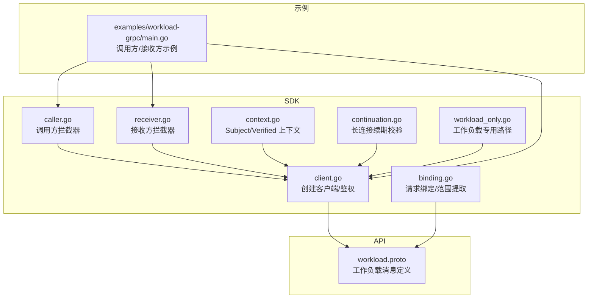
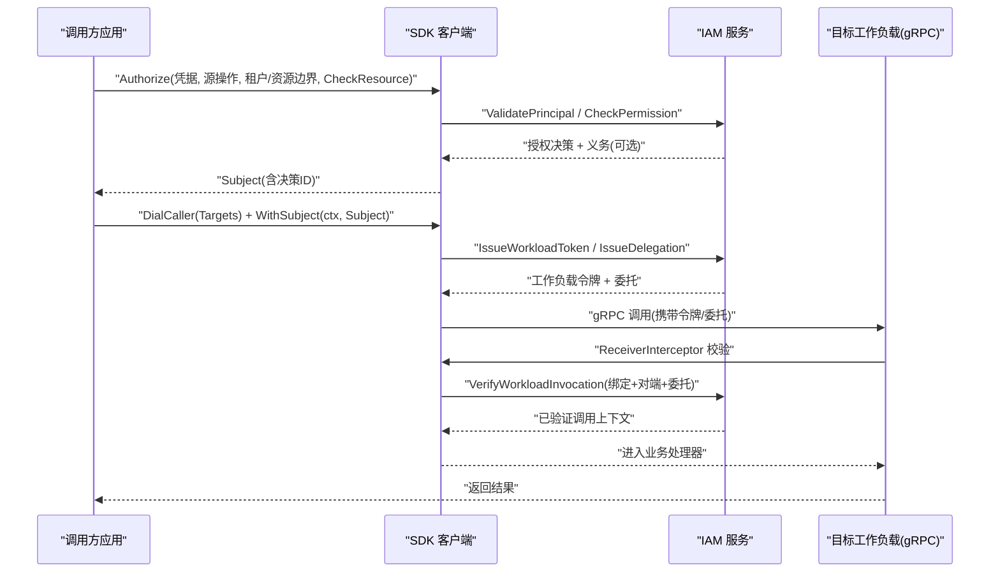
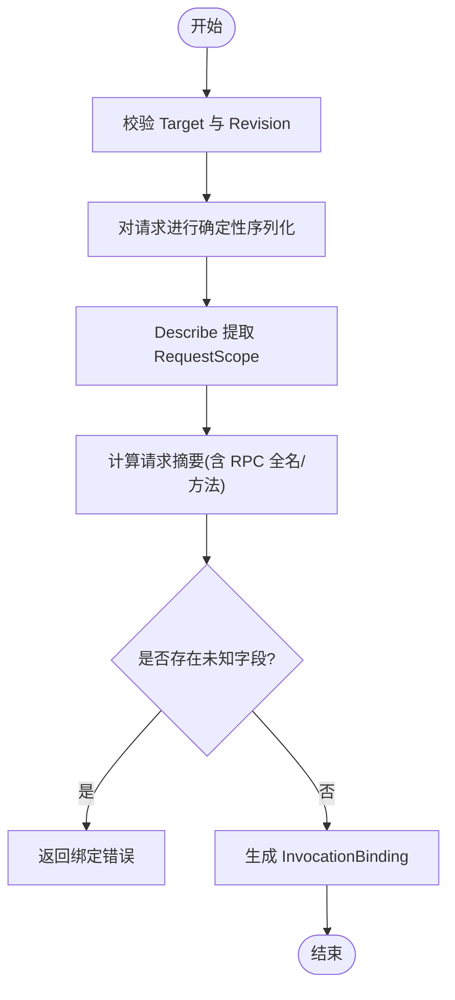
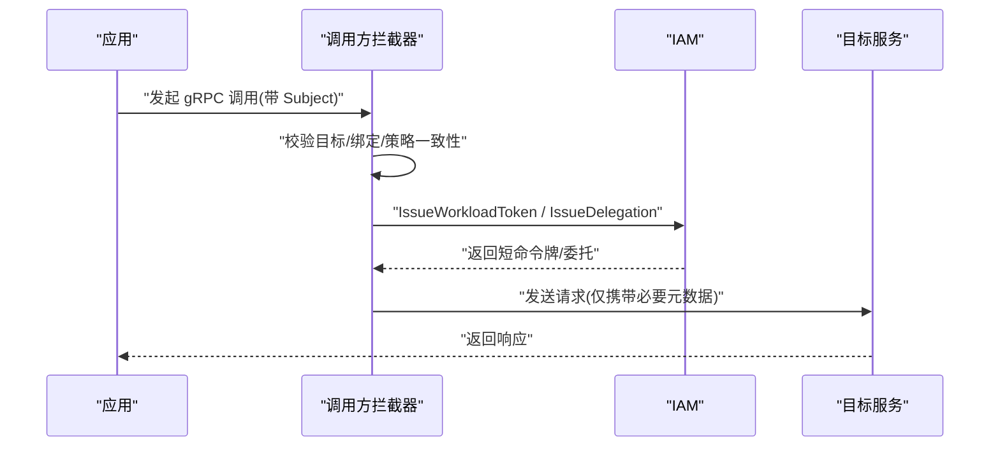
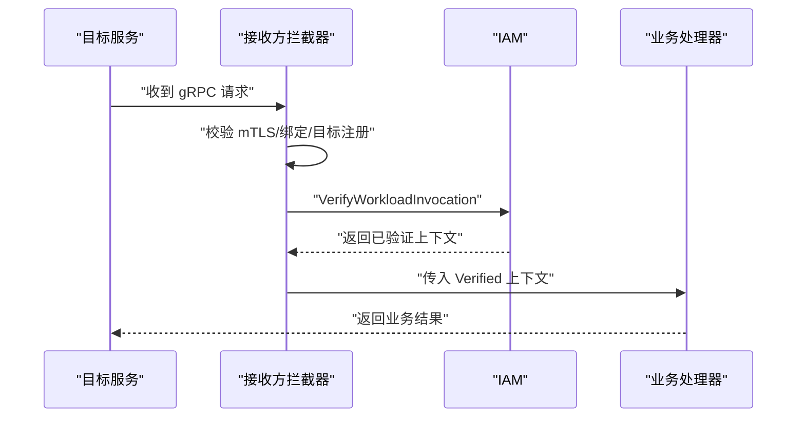
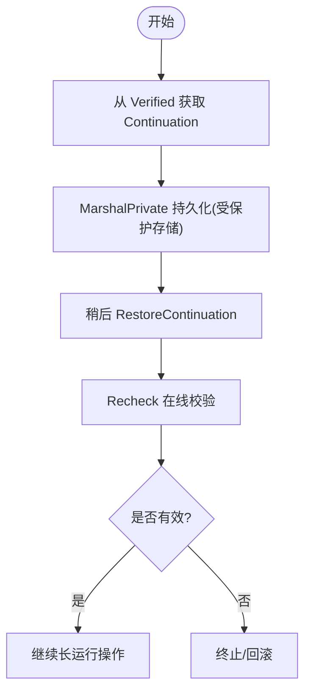
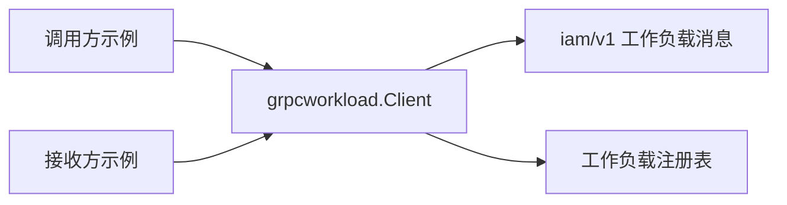

# SDK使用指南

<cite>
**本文引用的文件**
- [sdk/README.md](file://sdk/README.md)
- [examples/workload-grpc/README.md](file://examples/workload-grpc/README.md)
- [examples/workload-grpc/main.go](file://examples/workload-grpc/main.go)
- [sdk/grpcworkload/client.go](file://sdk/grpcworkload/client.go)
- [sdk/grpcworkload/binding.go](file://sdk/grpcworkload/binding.go)
- [sdk/grpcworkload/caller.go](file://sdk/grpcworkload/caller.go)
- [sdk/grpcworkload/receiver.go](file://sdk/grpcworkload/receiver.go)
- [sdk/grpcworkload/context.go](file://sdk/grpcworkload/context.go)
- [sdk/grpcworkload/continuation.go](file://sdk/grpcworkload/continuation.go)
- [sdk/grpcworkload/workload_only.go](file://sdk/grpcworkload/workload_only.go)
- [api/iam/v1/workload.proto](file://api/iam/v1/workload.proto)
</cite>

## 目录
1. [简介](#简介)
2. [项目结构](#项目结构)
3. [核心组件](#核心组件)
4. [架构总览](#架构总览)
5. [详细组件分析](#详细组件分析)
6. [依赖关系分析](#依赖关系分析)
7. [性能与可靠性](#性能与可靠性)
8. [故障排查指南](#故障排查指南)
9. [结论](#结论)
10. [附录：集成步骤与最佳实践](#附录集成步骤与最佳实践)

## 简介
本指南面向需要在现有应用中集成 ANI IAM gRPC 工作负载 SDK 的开发者。内容涵盖：
- 工作负载绑定（Binding）与调用者/接收者模式
- 客户端配置、身份验证与权限检查流程
- 完整示例与常见交互场景
- 错误处理、重试策略与性能优化建议
- 将 SDK 集成到现有应用的步骤与最佳实践

该 SDK 提供 mTLS 安全通道、在线授权校验、请求级绑定与最小化凭证传递，确保业务代码无需解析令牌或查询 IAM 表即可完成安全调用。

## 项目结构
仓库中与 SDK 相关的关键位置：
- SDK 模块：sdk/grpcworkload（gRPC 工作负载适配器）
- 公开 API：api/iam/v1（IAM gRPC 协议定义）
- 独立示例：examples/workload-grpc（可运行的调用方/接收方示例）

图表来源
- [sdk/grpcworkload/client.go:78-114](file://sdk/grpcworkload/client.go#L78-L114)
- [sdk/grpcworkload/binding.go:16-56](file://sdk/grpcworkload/binding.go#L16-L56)
- [sdk/grpcworkload/caller.go:19-45](file://sdk/grpcworkload/caller.go#L19-L45)
- [sdk/grpcworkload/receiver.go:15-88](file://sdk/grpcworkload/receiver.go#L15-L88)
- [sdk/grpcworkload/context.go:12-87](file://sdk/grpcworkload/context.go#L12-L87)
- [sdk/grpcworkload/continuation.go:13-74](file://sdk/grpcworkload/continuation.go#L13-L74)
- [sdk/grpcworkload/workload_only.go:18-174](file://sdk/grpcworkload/workload_only.go#L18-L174)
- [api/iam/v1/workload.proto:10-121](file://api/iam/v1/workload.proto#L10-L121)
- [examples/workload-grpc/main.go:29-100](file://examples/workload-grpc/main.go#L29-L100)

章节来源
- [sdk/README.md:1-33](file://sdk/README.md#L1-L33)
- [examples/workload-grpc/README.md:1-14](file://examples/workload-grpc/README.md#L1-L14)

## 核心组件
- 客户端与 TLS：负责建立 mTLS 连接、限制超时、构造 IAM 服务客户端
- 绑定与范围：从规范化 DTO 提取租户、主体、资源、操作等维度并生成不可变摘要
- 调用方拦截器：为每次调用签发短生命周期凭证与工作负载令牌，附加至元数据并执行一次业务 RPC
- 接收方拦截器：校验 mTLS 对端、绑定、工作负载令牌与委托，注入已验证上下文
- 上下文对象：Subject（调用侧授权结果）、Verified（接收侧已验证信息）
- 续期机制：支持长运行操作的在线续期校验
- 工作负载专用路径：仅工作负载身份的轻量验证与健康探测

章节来源
- [sdk/grpcworkload/client.go:21-114](file://sdk/grpcworkload/client.go#L21-L114)
- [sdk/grpcworkload/binding.go:16-56](file://sdk/grpcworkload/binding.go#L16-L56)
- [sdk/grpcworkload/caller.go:19-109](file://sdk/grpcworkload/caller.go#L19-L109)
- [sdk/grpcworkload/receiver.go:15-88](file://sdk/grpcworkload/receiver.go#L15-L88)
- [sdk/grpcworkload/context.go:12-87](file://sdk/grpcworkload/context.go#L12-L87)
- [sdk/grpcworkload/continuation.go:13-74](file://sdk/grpcworkload/continuation.go#L13-L74)
- [sdk/grpcworkload/workload_only.go:18-174](file://sdk/grpcworkload/workload_only.go#L18-L174)

## 架构总览
下图展示一次典型的工作负载调用流程：调用方通过 SDK 完成授权、签发工作负载令牌与委托，接收方在线验证后执行业务逻辑。

图表来源
- [sdk/grpcworkload/client.go:126-178](file://sdk/grpcworkload/client.go#L126-L178)
- [sdk/grpcworkload/caller.go:47-109](file://sdk/grpcworkload/caller.go#L47-L109)
- [sdk/grpcworkload/receiver.go:38-87](file://sdk/grpcworkload/receiver.go#L38-L87)
- [api/iam/v1/workload.proto:46-81](file://api/iam/v1/workload.proto#L46-L81)

## 详细组件分析

### 客户端与 TLS 配置
- 构建 Client：要求地址、环境、信任域、策略版本；默认 2 秒超时，禁用重试
- TLSFiles：加载 CA、证书与私钥；服务端强制客户端证书校验；客户端指定 ServerName
- 关闭连接：显式 Close 释放底层连接

章节来源
- [sdk/grpcworkload/client.go:21-76](file://sdk/grpcworkload/client.go#L21-L76)
- [sdk/grpcworkload/client.go:78-114](file://sdk/grpcworkload/client.go#L78-L114)

### 工作负载绑定（Binding）与范围提取
- Target：声明方法、受众、操作与 Describe 回调
- Describe：从规范化 DTO 提取 RequestScope（租户、主体、资源、源操作、模式），不得修改请求
- 绑定过程：对完整 DTO 进行确定性序列化并计算 SHA256，包含 RPC 全名与方法名前缀，拒绝未知字段
- 目标索引：去重校验，防止重复注册

图表来源
- [sdk/grpcworkload/binding.go:16-56](file://sdk/grpcworkload/binding.go#L16-L56)
- [sdk/grpcworkload/binding.go:58-81](file://sdk/grpcworkload/binding.go#L58-L81)

章节来源
- [sdk/grpcworkload/binding.go:16-99](file://sdk/grpcworkload/binding.go#L16-L99)

### 调用方模式（Caller）
- DialCaller：为目标注册表中的方法建立 mTLS 连接，禁用重试，附加调用方拦截器
- 拦截器职责：
  - 校验目标已注册且与 Subject 匹配
  - 绑定请求并校验策略版本、租户、主体、资源一致性
  - 向 IAM 申请工作负载令牌与委托，清理敏感头，仅发送一次业务 RPC
- 注意：不重试变更类调用；原始用户凭据不会透传到接收方

图表来源
- [sdk/grpcworkload/caller.go:19-45](file://sdk/grpcworkload/caller.go#L19-L45)
- [sdk/grpcworkload/caller.go:47-109](file://sdk/grpcworkload/caller.go#L47-L109)

章节来源
- [sdk/grpcworkload/caller.go:19-109](file://sdk/grpcworkload/caller.go#L19-L109)

### 接收方模式（Receiver）
- ReceiverInterceptor：
  - 校验 mTLS 对端身份与环境/信任域
  - 绑定请求并校验目标注册
  - 校验工作负载令牌与委托，在线调用 IAM 验证
  - 清理敏感元数据，注入 Verified 上下文
  - 若目标要求“接收方所有权检查”，则调用 ownerCheck 回调
- 业务处理器通过 VerifiedFromContext 获取已验证的调用者、主体与绑定

图表来源
- [sdk/grpcworkload/receiver.go:15-88](file://sdk/grpcworkload/receiver.go#L15-L88)
- [sdk/grpcworkload/context.go:46-87](file://sdk/grpcworkload/context.go#L46-L87)

章节来源
- [sdk/grpcworkload/receiver.go:15-88](file://sdk/grpcworkload/receiver.go#L15-L88)
- [sdk/grpcworkload/context.go:46-87](file://sdk/grpcworkload/context.go#L46-L87)

### 上下文对象：Subject 与 Verified
- Subject：来自 Authorize 的结果，封装主体、策略版本、资源 ID、决策 ID；格式化时隐去凭据
- Verified：接收方拦截器注入的已验证上下文，包含调用者、主体、绑定与续期信息；提供克隆访问接口

章节来源
- [sdk/grpcworkload/context.go:12-87](file://sdk/grpcworkload/context.go#L12-L87)

### 长运行操作续期（Continuation）
- 接收方可从 Verified 获取 Continuation，并通过 MarshalPrivate 持久化到受保护的存储
- 后续通过 RestoreContinuation 恢复并使用 Recheck 在线校验，确保当前 IAM 仍允许该操作
- 续期引用不可用于新授权，也不可刷新

图表来源
- [sdk/grpcworkload/continuation.go:13-74](file://sdk/grpcworkload/continuation.go#L13-L74)

章节来源
- [sdk/grpcworkload/continuation.go:13-74](file://sdk/grpcworkload/continuation.go#L13-L74)

### 工作负载专用路径（Workload Only）
- NewWorkloadOnlyClient：仅工作负载身份的最小化客户端，适合通知服务等场景
- Check：通过健康检查与负向探测确认 IAM 就绪
- VerifyCaller：基于工作负载令牌验证调用者，清理敏感元数据
- WorkloadOnlyCallerInterceptor：为工作负载专用调用添加短命令牌，禁止其他敏感头

章节来源
- [sdk/grpcworkload/workload_only.go:18-174](file://sdk/grpcworkload/workload_only.go#L18-L174)

### 示例：调用方与接收方
- 示例展示了如何：
  - 配置 IAM 客户端与 mTLS
  - 注册目标与 Describe 回调
  - 调用方执行 Authorize 并发起调用
  - 接收方安装 ReceiverInterceptor 并在处理器中读取 Verified
- 示例不包含真实 Session 后端，仅演示授权与绑定流程

章节来源
- [examples/workload-grpc/main.go:29-100](file://examples/workload-grpc/main.go#L29-L100)
- [examples/workload-grpc/main.go:120-211](file://examples/workload-grpc/main.go#L120-L211)
- [examples/workload-grpc/README.md:1-14](file://examples/workload-grpc/README.md#L1-L14)

## 依赖关系分析
- SDK 依赖公开 IAM API（认证/授权/工作负载消息）
- 调用方/接收方均依赖目标注册表以校验方法与受众
- 示例依赖 Session 的 protobuf 定义以演示 DTO 绑定

图表来源
- [sdk/grpcworkload/client.go:78-114](file://sdk/grpcworkload/client.go#L78-L114)
- [sdk/grpcworkload/caller.go:19-45](file://sdk/grpcworkload/caller.go#L19-L45)
- [sdk/grpcworkload/receiver.go:15-37](file://sdk/grpcworkload/receiver.go#L15-L37)
- [api/iam/v1/workload.proto:10-121](file://api/iam/v1/workload.proto#L10-L121)

章节来源
- [sdk/grpcworkload/client.go:78-114](file://sdk/grpcworkload/client.go#L78-L114)
- [sdk/grpcworkload/caller.go:19-45](file://sdk/grpcworkload/caller.go#L19-L45)
- [sdk/grpcworkload/receiver.go:15-37](file://sdk/grpcworkload/receiver.go#L15-L37)
- [api/iam/v1/workload.proto:10-121](file://api/iam/v1/workload.proto#L10-L121)

## 性能与可靠性
- 超时控制：客户端默认 2 秒超时，继承更短的父上下文截止时间；避免阻塞
- 重试策略：SDK 明确禁用重试，防止幂等性风险；业务层需自行实现幂等键
- 凭证生命周期：工作负载令牌与委托均为短生命周期，每次调用重新签发，降低泄露面
- 绑定完整性：对完整 DTO 计算摘要，拒绝未知字段，减少兼容性与攻击面
- 连接管理：显式 Close 释放连接；mTLS 证书在握手时动态加载，便于轮换
- 健康探测：工作负载专用路径提供负向探测，确保 IAM 就绪后再启用业务流量

[本节为通用指导，不直接分析具体文件]

## 故障排查指南
- 未认证/无权限：
  - 检查 mTLS 证书链与对端身份是否有效
  - 确认 SourceOperation、TenantID、ResourceID 与策略版本一致
  - 确认目标已在注册表中正确登记
- 绑定错误：
  - 确保 Describe 不修改请求，且能稳定提取 RequestScope
  - 检查 DTO 是否包含未知字段
- 接收方校验失败：
  - 检查工作负载令牌与委托是否齐全且未过期
  - 确认 VerifyWorkloadInvocation 返回的 caller/subject/binding 与当前请求一致
- 续期失败：
  - 确保持有的 Continuation 未过期且目标注册未变更
  - Recheck 必须使用接收方自身 mTLS 身份

章节来源
- [sdk/grpcworkload/client.go:180-232](file://sdk/grpcworkload/client.go#L180-L232)
- [sdk/grpcworkload/caller.go:47-109](file://sdk/grpcworkload/caller.go#L47-L109)
- [sdk/grpcworkload/receiver.go:38-87](file://sdk/grpcworkload/receiver.go#L38-L87)
- [sdk/grpcworkload/continuation.go:53-74](file://sdk/grpcworkload/continuation.go#L53-L74)

## 结论
ANI IAM gRPC 工作负载 SDK 通过严格的 mTLS、在线授权与请求级绑定，为工作负载间通信提供了高安全、可审计、可追溯的调用模型。调用方与接收方各司其职：调用方负责授权与最小化凭证传递，接收方负责在线验证与业务上下文注入。结合短生命周期凭证、禁用重试与确定性绑定，可在保证安全性的同时获得良好性能。

[本节为总结性内容，不直接分析具体文件]

## 附录：集成步骤与最佳实践
- 准备证书与密钥
  - 为调用方与接收方分别准备独立的证书与私钥，严格限制文件权限
  - 配置 TLSFiles 的 CA、证书与私钥路径
- 配置 IAM 客户端
  - 设置 Address、ServerName、Environment、TrustDomain、PolicyRevision
  - 如需自定义超时，确保不超过上限
- 注册目标与 Define 绑定
  - 为每个受保护方法注册 Target，提供 Method、Audience、Operation 与 Describe
  - Describe 应从规范化 DTO 提取 TenantID、SubjectID、ResourceID、SourceOperation、Mode
- 实现所有权检查
  - 在调用方 Authorize 中提供 CheckResource 回调，验证资源归属
  - 若目标要求接收方所有权检查，需在 ReceiverInterceptor 中提供 ownerCheck
- 接入调用方
  - 使用 DialCaller 建立连接，WithSubject 注入授权结果
  - 调用业务 RPC；不要重试变更类调用
- 接入接收方
  - 安装 ReceiverInterceptor，注册相同的目标映射
  - 在处理器中使用 VerifiedFromContext 获取已验证上下文，并进行最终资源检查
- 长运行操作
  - 使用 Verified.Continuation() 获取续期引用，持久化到受保护存储
  - 定期调用 Recheck 校验有效性
- 工作负载专用路径
  - 对于仅需工作负载身份的场景，使用 NewWorkloadOnlyClient 与相应拦截器
  - 使用 Check 进行健康探测，确保 IAM 就绪

章节来源
- [sdk/grpcworkload/client.go:78-114](file://sdk/grpcworkload/client.go#L78-L114)
- [sdk/grpcworkload/binding.go:16-56](file://sdk/grpcworkload/binding.go#L16-L56)
- [sdk/grpcworkload/caller.go:19-45](file://sdk/grpcworkload/caller.go#L19-L45)
- [sdk/grpcworkload/receiver.go:15-37](file://sdk/grpcworkload/receiver.go#L15-L37)
- [sdk/grpcworkload/continuation.go:13-74](file://sdk/grpcworkload/continuation.go#L13-L74)
- [sdk/grpcworkload/workload_only.go:18-94](file://sdk/grpcworkload/workload_only.go#L18-L94)
- [examples/workload-grpc/main.go:29-100](file://examples/workload-grpc/main.go#L29-L100)
- [examples/workload-grpc/README.md:1-14](file://examples/workload-grpc/README.md#L1-L14)