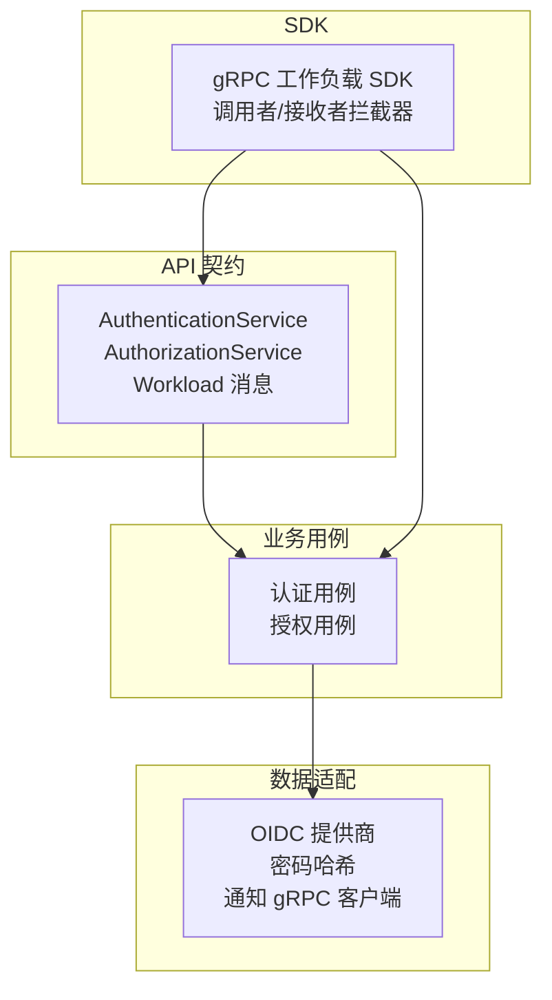
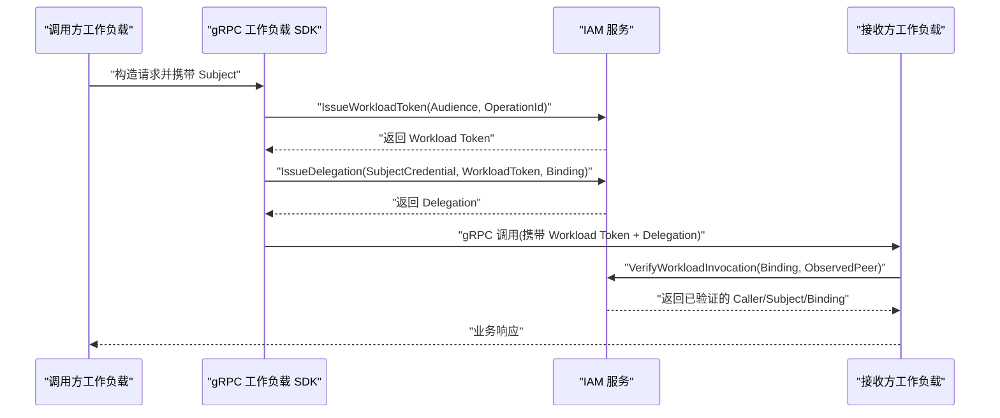
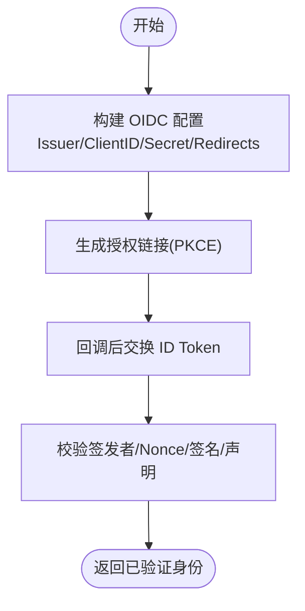
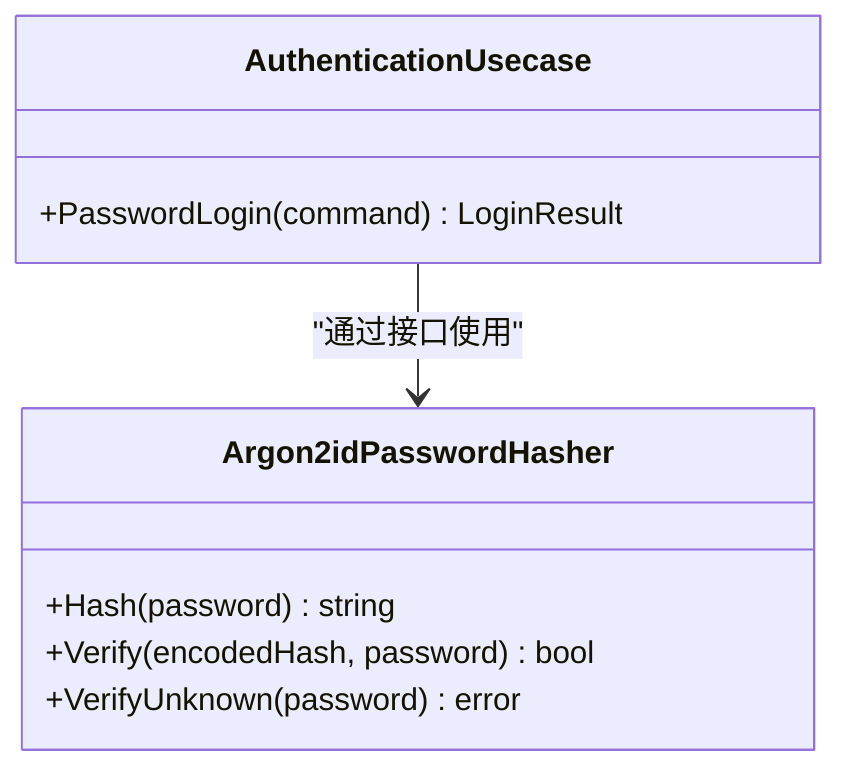
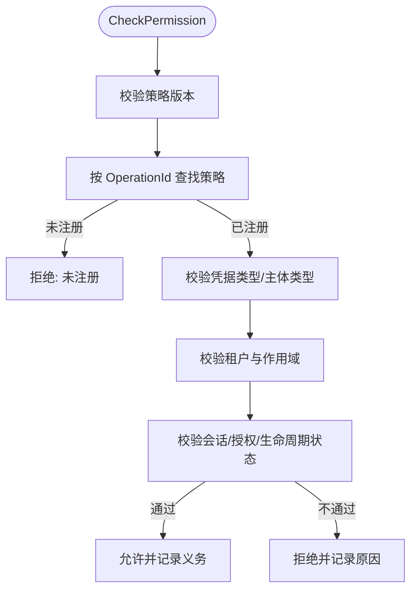
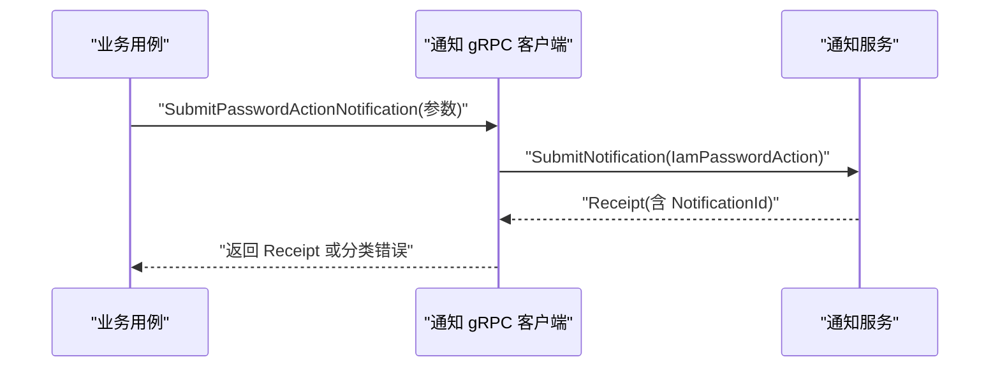
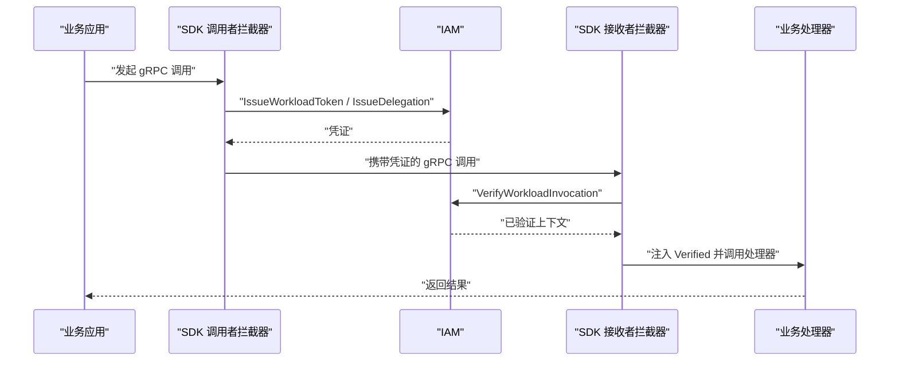
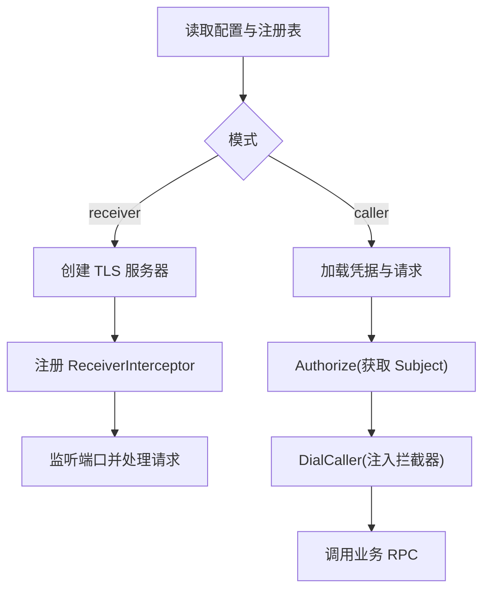
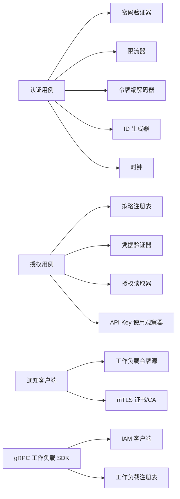

# 扩展开发

<cite>
**本文引用的文件**
- [authentication_service.proto](file://api/iam/v1/authentication_service.proto)
- [authorization_service.proto](file://api/iam/v1/authorization_service.proto)
- [workload.proto](file://api/iam/v1/workload.proto)
- [binding.go](file://sdk/grpcworkload/binding.go)
- [caller.go](file://sdk/grpcworkload/caller.go)
- [receiver.go](file://sdk/grpcworkload/receiver.go)
- [client.go](file://sdk/grpcworkload/client.go)
- [context.go](file://sdk/grpcworkload/context.go)
- [main.go](file://examples/workload-grpc/main.go)
- [authentication.go](file://internal/biz/authentication.go)
- [authorization.go](file://internal/biz/authorization.go)
- [notification_grpc_client.go](file://internal/data/notification_grpc_client.go)
- [password_action_notification_grpc.go](file://internal/data/password_action_notification_grpc.go)
- [oidc_provider.go](file://internal/data/oidc_provider.go)
- [password_argon2id.go](file://internal/data/password_argon2id.go)
</cite>

## 目录
1. [简介](#简介)
2. [项目结构](#项目结构)
3. [核心组件](#核心组件)
4. [架构总览](#架构总览)
5. [详细组件分析](#详细组件分析)
6. [依赖关系分析](#依赖关系分析)
7. [性能考虑](#性能考虑)
8. [故障排查指南](#故障排查指南)
9. [结论](#结论)
10. [附录](#附录)

## 简介
本指南面向希望扩展 ANI IAM 功能的开发者，围绕插件化与扩展点设计，系统讲解如何在不侵入核心逻辑的前提下实现自定义认证提供者、授权策略与通知渠道。文档同时覆盖 gRPC 工作负载绑定的 SDK 使用方式（调用者与接收者）、最佳实践、性能考量、测试策略以及打包分发与版本管理方法，并提供完整示例路径以便快速上手。

## 项目结构
ANI IAM 采用“API 契约 + 业务用例 + 数据适配 + SDK”的分层组织：
- API 契约层：定义认证、授权与工作负载相关的 gRPC 接口与消息类型，作为跨服务边界稳定契约。
- 业务用例层：封装登录、授权、会话、租户范围等核心流程，通过接口抽象外部依赖（如密码哈希、OIDC、限流器）。
- 数据适配层：提供具体实现（Postgres、Redis、gRPC 客户端、OIDC 提供商、通知通道等），以可替换的适配器形式接入。
- SDK 层：为业务工作负载提供安全的 gRPC 调用封装，自动完成 mTLS 身份、请求绑定、IAM 凭证签发与校验。

图示来源
- [authentication_service.proto:11-33](file://api/iam/v1/authentication_service.proto#L11-L33)
- [authorization_service.proto:10-16](file://api/iam/v1/authorization_service.proto#L10-L16)
- [workload.proto:10-121](file://api/iam/v1/workload.proto#L10-L121)
- [client.go:78-114](file://sdk/grpcworkload/client.go#L78-L114)
- [authentication.go:286-339](file://internal/biz/authentication.go#L286-L339)
- [authorization.go:199-223](file://internal/biz/authorization.go#L199-L223)
- [notification_grpc_client.go:27-103](file://internal/data/notification_grpc_client.go#L27-L103)
- [oidc_provider.go:44-95](file://internal/data/oidc_provider.go#L44-L95)
- [password_argon2id.go:24-63](file://internal/data/password_argon2id.go#L24-L63)

章节来源
- [authentication_service.proto:11-33](file://api/iam/v1/authentication_service.proto#L11-L33)
- [authorization_service.proto:10-16](file://api/iam/v1/authorization_service.proto#L10-L16)
- [workload.proto:10-121](file://api/iam/v1/workload.proto#L10-L121)
- [client.go:78-114](file://sdk/grpcworkload/client.go#L78-L114)
- [authentication.go:286-339](file://internal/biz/authentication.go#L286-L339)
- [authorization.go:199-223](file://internal/biz/authorization.go#L199-L223)
- [notification_grpc_client.go:27-103](file://internal/data/notification_grpc_client.go#L27-L103)
- [oidc_provider.go:44-95](file://internal/data/oidc_provider.go#L44-L95)
- [password_argon2id.go:24-63](file://internal/data/password_argon2id.go#L24-L63)

## 核心组件
- 认证子系统：负责人类与会话生命周期、刷新、登出、令牌签发；通过可插拔的密码验证器、限流器、令牌编解码器进行扩展。
- 授权子系统：基于操作注册表与访问凭据校验，产出明确的允许/拒绝决策，并支持平台/租户/自有资源范围。
- 工作负载认证：通过 Workload Token 与 Delegation 机制，在 mTLS 基础上对每次调用进行在线鉴权与绑定校验。
- 通知子系统：将密码重置/设置等操作以标准化格式投递到通知服务，支持错误分类与重试/永久失败语义。
- SDK：为调用方注入工作负载凭证与委托，为接收方拦截并验证调用上下文，屏蔽底层安全细节。

章节来源
- [authentication.go:286-339](file://internal/biz/authentication.go#L286-L339)
- [authorization.go:199-223](file://internal/biz/authorization.go#L199-L223)
- [workload.proto:46-121](file://api/iam/v1/workload.proto#L46-L121)
- [password_action_notification_grpc.go:19-126](file://internal/data/password_action_notification_grpc.go#L19-L126)
- [caller.go:19-109](file://sdk/grpcworkload/caller.go#L19-L109)
- [receiver.go:15-89](file://sdk/grpcworkload/receiver.go#L15-L89)

## 架构总览
下图展示了从业务调用到 IAM 鉴权的端到端流程，包括调用者侧的凭证签发与接收者侧的在线校验。

图示来源
- [caller.go:47-109](file://sdk/grpcworkload/caller.go#L47-L109)
- [receiver.go:22-89](file://sdk/grpcworkload/receiver.go#L22-L89)
- [workload.proto:46-121](file://api/iam/v1/workload.proto#L46-L121)

## 详细组件分析

### 扩展点一：自定义认证提供者（OIDC）
- 扩展目标：对接第三方 OIDC 提供商，完成授权码流程与 ID Token 校验。
- 关键接口与实现：
  - 配置与发现：加载 Issuer URL、Client ID/Secret、重定向白名单，建立 OAuth2 配置与 ID Token 验证器。
  - 授权链接生成：根据请求参数生成带 PKCE 的授权链接。
  - 交换与校验：用授权码换取 ID Token，校验签发者、Nonce、签名与声明。
- 集成位置：业务用例通过 Provider 接口调用，数据适配层提供具体实现。

图示来源
- [oidc_provider.go:44-95](file://internal/data/oidc_provider.go#L44-L95)
- [oidc_provider.go:101-154](file://internal/data/oidc_provider.go#L101-L154)
- [oidc_provider.go:156-190](file://internal/data/oidc_provider.go#L156-L190)
- [oidc_provider.go:192-235](file://internal/data/oidc_provider.go#L192-L235)

章节来源
- [oidc_provider.go:44-95](file://internal/data/oidc_provider.go#L44-L95)
- [oidc_provider.go:101-154](file://internal/data/oidc_provider.go#L101-L154)
- [oidc_provider.go:156-190](file://internal/data/oidc_provider.go#L156-L190)
- [oidc_provider.go:192-235](file://internal/data/oidc_provider.go#L192-L235)

### 扩展点二：自定义密码哈希算法
- 扩展目标：替换或升级密码哈希策略，确保参数一致性与未知账户防护。
- 关键点：
  - 固定目标参数集，防止漂移。
  - 提供未知账户的恒定时间比较，避免信息泄露。
- 集成位置：认证用例通过 PasswordVerifier 接口调用。

图示来源
- [authentication.go:286-339](file://internal/biz/authentication.go#L286-L339)
- [password_argon2id.go:24-63](file://internal/data/password_argon2id.go#L24-L63)

章节来源
- [authentication.go:286-339](file://internal/biz/authentication.go#L286-L339)
- [password_argon2id.go:24-63](file://internal/data/password_argon2id.go#L24-L63)

### 扩展点三：自定义授权策略
- 扩展目标：为新增操作注册策略，限定允许的凭据类型、主体类型、作用域与义务约束。
- 关键点：
  - 策略注册表需提供 Revision 与按 OperationId 查询能力。
  - 授权用例会校验策略、凭据、租户范围、会话/授权状态，并输出明确原因。
- 集成位置：授权用例通过 AuthorizationPolicyRegistry 与 AccessCredentialVerifier 接口协作。

图示来源
- [authorization.go:225-329](file://internal/biz/authorization.go#L225-L329)
- [authorization.go:331-420](file://internal/biz/authorization.go#L331-L420)
- [authorization.go:491-514](file://internal/biz/authorization.go#L491-L514)
- [authorization.go:516-576](file://internal/biz/authorization.go#L516-L576)

章节来源
- [authorization.go:225-329](file://internal/biz/authorization.go#L225-L329)
- [authorization.go:331-420](file://internal/biz/authorization.go#L331-L420)
- [authorization.go:491-514](file://internal/biz/authorization.go#L491-L514)
- [authorization.go:516-576](file://internal/biz/authorization.go#L516-L576)

### 扩展点四：自定义通知渠道
- 扩展目标：将密码动作（设置/重置）投递到通知服务，支持多语言与受众（Console/Boss）。
- 关键点：
  - 严格校验提交参数（UUID v7、邮箱规范化、时间窗口）。
  - 将 gRPC 错误分类为可重试与永久失败，便于上层重试与死信处理。
- 集成位置：数据适配层通过 NotificationGRPCClient 发送，业务用例仅依赖提交接口。

图示来源
- [password_action_notification_grpc.go:19-126](file://internal/data/password_action_notification_grpc.go#L19-L126)
- [password_action_notification_grpc.go:172-203](file://internal/data/password_action_notification_grpc.go#L172-L203)
- [notification_grpc_client.go:27-103](file://internal/data/notification_grpc_client.go#L27-L103)

章节来源
- [password_action_notification_grpc.go:19-126](file://internal/data/password_action_notification_grpc.go#L19-L126)
- [password_action_notification_grpc.go:172-203](file://internal/data/password_action_notification_grpc.go#L172-L203)
- [notification_grpc_client.go:27-103](file://internal/data/notification_grpc_client.go#L27-L103)

### SDK 使用：gRPC 工作负载绑定、调用者与接收者
- 请求绑定：将业务 DTO 规范化为 InvocationBinding，包含审计所需的摘要与范围字段，防止篡改与未知字段。
- 调用者：
  - 在出站拦截器中为每个受保护 RPC 申请 Workload Token 与 Delegation，并清理敏感元数据。
  - 要求调用前已通过 Authorize 获得 Subject，且目标与方法必须注册。
- 接收者：
  - 在入站拦截器中解析 mTLS 对端身份，调用 IAM 在线验证，并将 Verified 注入上下文供业务使用。
  - 若策略要求“接收方所有权检查”，则需传入 ownerCheck 回调。

图示来源
- [binding.go:16-56](file://sdk/grpcworkload/binding.go#L16-L56)
- [caller.go:25-109](file://sdk/grpcworkload/caller.go#L25-L109)
- [receiver.go:15-89](file://sdk/grpcworkload/receiver.go#L15-L89)
- [context.go:12-87](file://sdk/grpcworkload/context.go#L12-L87)

章节来源
- [binding.go:16-56](file://sdk/grpcworkload/binding.go#L16-L56)
- [caller.go:25-109](file://sdk/grpcworkload/caller.go#L25-L109)
- [receiver.go:15-89](file://sdk/grpcworkload/receiver.go#L15-L89)
- [context.go:12-87](file://sdk/grpcworkload/context.go#L12-L87)

### 完整示例：工作负载 gRPC 调用
示例演示了如何在本地启动一个最小化的接收者与调用者，完成注册目标、授权、绑定与调用。

图示来源
- [main.go:29-77](file://examples/workload-grpc/main.go#L29-L77)
- [main.go:120-211](file://examples/workload-grpc/main.go#L120-L211)

章节来源
- [main.go:29-77](file://examples/workload-grpc/main.go#L29-L77)
- [main.go:120-211](file://examples/workload-grpc/main.go#L120-L211)

## 依赖关系分析
- 认证用例依赖：密码验证器、限流器、令牌编解码器、ID 生成器、时钟、键值使用观察器等，均通过接口注入，便于替换与测试。
- 授权用例依赖：策略注册表、凭据验证器、授权读取器、ID 生成器、时钟、API Key 使用观察器。
- 通知客户端依赖：工作负载令牌源与注册表用于工作负载身份，证书与 CA 用于 mTLS。
- SDK 依赖：IAM gRPC 客户端、mTLS 配置、工作负载注册表、上下文传递。

图示来源
- [authentication.go:286-339](file://internal/biz/authentication.go#L286-L339)
- [authorization.go:199-223](file://internal/biz/authorization.go#L199-L223)
- [notification_grpc_client.go:27-103](file://internal/data/notification_grpc_client.go#L27-L103)
- [client.go:78-114](file://sdk/grpcworkload/client.go#L78-L114)

章节来源
- [authentication.go:286-339](file://internal/biz/authentication.go#L286-L339)
- [authorization.go:199-223](file://internal/biz/authorization.go#L199-L223)
- [notification_grpc_client.go:27-103](file://internal/data/notification_grpc_client.go#L27-L103)
- [client.go:78-114](file://sdk/grpcworkload/client.go#L78-L114)

## 性能考虑
- 短超时与禁用重试：SDK 默认对 IAM 调用设置短超时并禁用重试，避免级联雪崩。
- 在线校验与缓存：工作负载调用采用在线验证，建议在高并发场景下结合网关或边车缓存短期决策以减少 IAM 压力。
- 幂等与去抖：登录与操作提交使用幂等键与限流，降低重复请求影响。
- 证书热更新：服务端证书按需加载，减少重启成本。
- 错误分类：通知通道区分可重试与永久失败，避免无效重试放大负载。

[本节为通用指导，无需特定文件引用]

## 故障排查指南
- 认证失败：
  - 检查限流是否触发、凭据是否有效、主体/成员/租户访问状态、生命周期是否活跃。
  - 关注匿名失败记录与锁定策略。
- 授权拒绝：
  - 核对策略版本、OperationId、凭据类型与主体类型、租户匹配、会话/授权状态。
  - 查看拒绝原因与审计事件。
- 工作负载调用失败：
  - 确认调用前已正确 Authorize 并获得 Subject。
  - 检查目标与方法是否注册、Binding 是否合法、mTLS 对端身份是否可信。
  - 接收方需确保 OwnerCheck 回调满足策略义务。
- 通知投递失败：
  - 依据错误分类判断是否重试；检查证书、DNS 名称、地址与参数合法性。

章节来源
- [authentication.go:341-530](file://internal/biz/authentication.go#L341-L530)
- [authorization.go:225-420](file://internal/biz/authorization.go#L225-L420)
- [caller.go:47-109](file://sdk/grpcworkload/caller.go#L47-L109)
- [receiver.go:22-89](file://sdk/grpcworkload/receiver.go#L22-L89)
- [password_action_notification_grpc.go:172-203](file://internal/data/password_action_notification_grpc.go#L172-L203)

## 结论
ANI IAM 通过清晰的 API 契约、可插拔的业务用例与数据适配、以及安全的 SDK 封装，提供了完善的扩展机制。开发者可以以最小侵入的方式实现自定义认证、授权与通知能力，并通过严格的绑定与在线校验保障工作负载间调用的安全性与可追溯性。遵循本文的最佳实践与测试策略，可显著提升扩展的可维护性与稳定性。

[本节为总结性内容，无需特定文件引用]

## 附录

### 扩展开发最佳实践
- 始终通过接口抽象外部依赖，便于替换与单测。
- 所有用户可控输入在进入适配器前进行规范化与校验。
- 使用短生命周期凭证与在线校验，避免长驻权限扩散。
- 对敏感元数据进行清理，不在业务链路中传播。
- 对通知等异步通道进行错误分类与幂等处理。

[本节为通用指导，无需特定文件引用]

### 测试策略
- 单元测试：针对用例与适配器分别编写，模拟外部依赖（OIDC、数据库、Redis、gRPC）。
- 集成测试：覆盖登录、授权、工作负载调用、通知投递等端到端流程。
- 契约测试：确保 API 消息与行为向后兼容。
- 负向测试：覆盖限流、过期、非法参数、证书异常等场景。

[本节为通用指导，无需特定文件引用]

### 打包、分发与版本管理
- API 契约：通过 proto 文件与生成的 Go 代码作为稳定契约，变更需评估兼容性。
- 模块与依赖：SDK 与内部包独立 go.mod，便于版本管理与复用。
- 部署工件：容器镜像与配置文件分离，证书与密钥通过挂载或密钥管理服务注入。
- 策略版本：授权策略需维护 Revision，客户端与服务端保持一致以避免误判。

[本节为通用指导，无需特定文件引用]