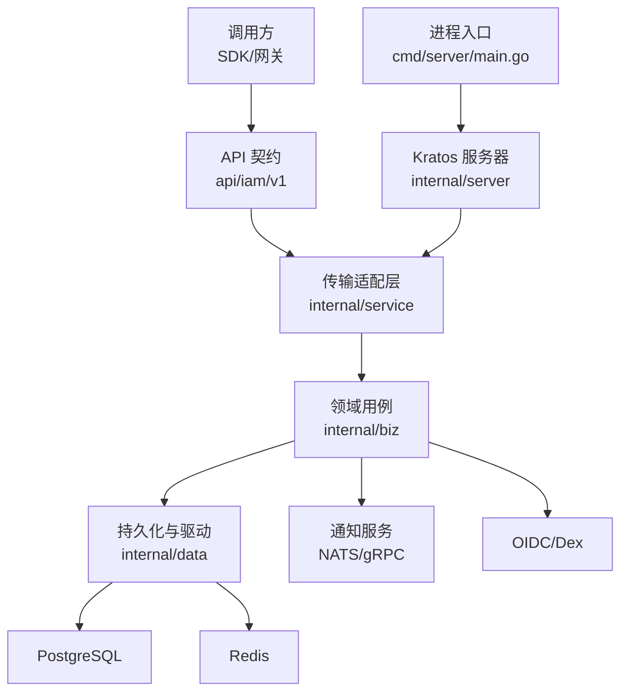
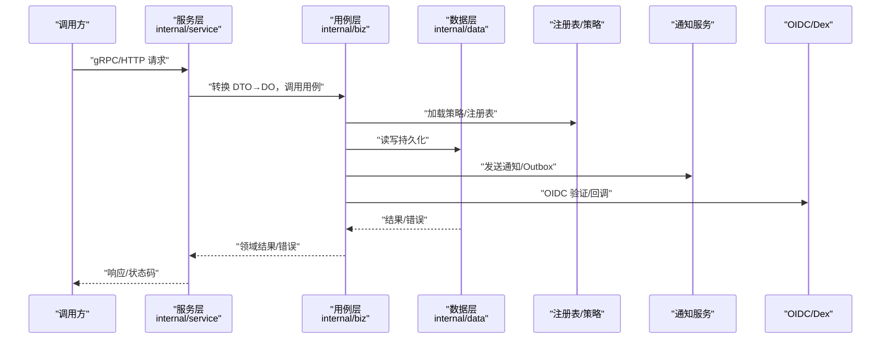
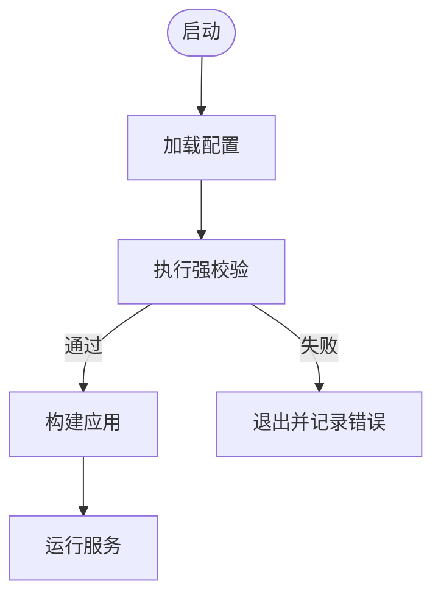
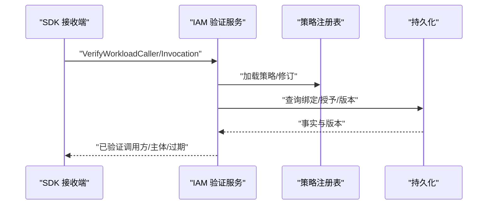
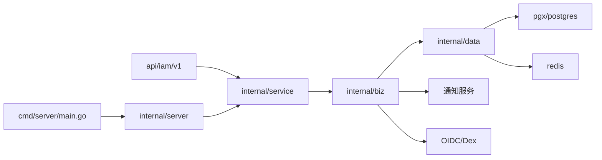
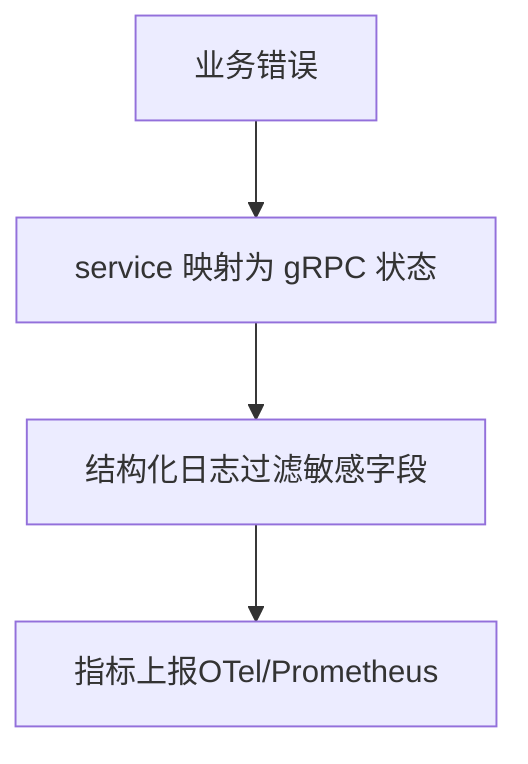

# 扩展最佳实践

<cite>
**本文引用的文件**
- [README.md](file://README.md)
- [AGENTS.md](file://AGENTS.md)
- [CLAUDE.md](file://CLAUDE.md)
- [go.mod](file://go.mod)
- [configs/config.yaml](file://configs/config.yaml)
- [cmd/server/main.go](file://cmd/server/main.go)
- [internal/conf/validate.go](file://internal/conf/validate.go)
- [internal/data/data.go](file://internal/data/data.go)
- [internal/biz/authorization.go](file://internal/biz/authorization.go)
- [internal/service/workload_caller.go](file://internal/service/workload_caller.go)
- [sdk/grpcworkload/http.go](file://sdk/grpcworkload/http.go)
- [sdk/grpcworkload/receiver.go](file://sdk/grpcworkload/receiver.go)
- [tests/integration/workload_runtime_test.go](file://tests/integration/workload_runtime_test.go)
</cite>

## 目录
1. [简介](#简介)
2. [项目结构](#项目结构)
3. [核心组件](#核心组件)
4. [架构总览](#架构总览)
5. [详细组件分析](#详细组件分析)
6. [依赖关系分析](#依赖关系分析)
7. [性能与资源管理](#性能与资源管理)
8. [错误处理、日志与监控](#错误处理日志与监控)
9. [测试指南](#测试指南)
10. [文档与版本管理](#文档与版本管理)
11. [结论](#结论)

## 简介
本指南面向 ANI IAM 的扩展开发者，聚焦可维护性、可扩展性与安全性三大原则，结合仓库现有分层架构、配置校验、工作负载身份验证、授权判定、通知与 OIDC 集成等能力，给出扩展设计、错误处理、日志与监控、性能优化、测试策略以及文档与版本管理的系统化最佳实践。目标是让新增能力在不破坏既有契约的前提下安全、稳定地融入 IAM/Governance 体系。

## 项目结构
ANI IAM 采用清晰的分层与职责边界：
- api：公开 gRPC/HTTP 契约（DTO、生成代码），不包含服务实现或存储依赖。
- cmd/server：唯一组合入口，负责启动、配置加载、运行时初始化与子命令。
- internal/server：gRPC/admin 服务器装配与中间件注册。
- internal/service：传输适配层，将 DTO 转换为领域对象并调用用例。
- internal/biz：领域模型、用例、仓储接口与业务错误；不依赖框架、Proto 或驱动。
- internal/data：仓储实现与基础设施客户端；持有 DO↔PO 转换与驱动错误映射。
- internal/conf：配置结构与强校验；确保运行期配置安全、可审计。
- sdk：工作负载 SDK，封装 Workload Token 验证、调用与接收端校验。
- tests：单元测试、集成测试与契约测试。

图表来源
- [cmd/server/main.go:34-101](file://cmd/server/main.go#L34-L101)
- [internal/server/server.go:1-4](file://internal/server/server.go#L1-L4)
- [internal/service/workload_caller.go:1-16](file://internal/service/workload_caller.go#L1-L16)
- [internal/biz/authorization.go:189-223](file://internal/biz/authorization.go#L189-L223)
- [internal/data/data.go:1-29](file://internal/data/data.go#L1-L29)
- [configs/config.yaml:1-61](file://configs/config.yaml#L1-L61)

章节来源
- [AGENTS.md:28-116](file://AGENTS.md#L28-L116)
- [CLAUDE.md:66-109](file://CLAUDE.md#L66-L109)
- [api/README.md:1-8](file://api/README.md#L1-L8)

## 核心组件
- 配置与启动
  - 通过命令行参数加载配置文件与环境变量，设置日志处理器并注入追踪属性，限制敏感字段输出。
  - 使用显式构造函数组装应用，避免隐式全局状态。
- 配置校验
  - 强制 profile、监听地址、TLS、超时、数据库 DSN、Redis namespace、OIDC issuer/redirect、通知服务证书与 URL 规范等。
  - 对非回环地址要求 verify-full 与 CA 文件；对 OIDC 与通知 URL 进行严格规范化检查。
- 数据层
  - 共享 pgx 连接池与 Outbox 保护器；Data 对象仅持有长生命周期客户端，无事务级状态。
- 领域用例
  - 授权用例聚合策略注册表、凭据验证器、读取器、ID 生成器、时钟与 API Key 使用观测器；提供平台授权注入能力。
- 传输适配
  - 工作负载调用者验证接口抽象，便于在 HTTP/gRPC 场景复用同一验证逻辑。
- SDK
  - 工作负载 HTTP/gRPC 客户端与接收端校验，强制绑定目标 audience、operation、revision、peer 与过期时间，拒绝多余头与非法授权范围。

章节来源
- [cmd/server/main.go:34-131](file://cmd/server/main.go#L34-L131)
- [internal/conf/validate.go:19-167](file://internal/conf/validate.go#L19-L167)
- [internal/data/data.go:1-29](file://internal/data/data.go#L1-L29)
- [internal/biz/authorization.go:189-223](file://internal/biz/authorization.go#L189-L223)
- [internal/service/workload_caller.go:1-16](file://internal/service/workload_caller.go#L1-L16)
- [sdk/grpcworkload/http.go:118-164](file://sdk/grpcworkload/http.go#L118-L164)
- [sdk/grpcworkload/receiver.go:57-71](file://sdk/grpcworkload/receiver.go#L57-L71)

## 架构总览
扩展应遵循“传输适配→领域用例→持久化”的单向依赖，禁止反向耦合；新增能力以接口与契约为边界，通过 service 层暴露、biz 层实现、data 层落库。工作负载身份与授权贯穿请求链路，所有外部交互必须经过 SDK 或 server 中间件校验。

图表来源
- [internal/service/workload_caller.go:1-16](file://internal/service/workload_caller.go#L1-L16)
- [internal/biz/authorization.go:189-223](file://internal/biz/authorization.go#L189-L223)
- [internal/data/data.go:1-29](file://internal/data/data.go#L1-L29)
- [configs/config.yaml:37-60](file://configs/config.yaml#L37-L60)

## 详细组件分析

### 配置与安全基线
- 强制 profile 与监听隔离：grpc 与 admin 端口不可相同；超时上限受控。
- TLS 与证书：gRPC mTLS、通知服务证书与 CA、访问令牌私钥路径必须绝对且存在。
- 数据库与缓存：PostgreSQL 限定受限角色与独立库；非回环需 verify-full+CA；Redis 命名空间与登录限流窗口受控。
- OIDC：固定 provider、issuer 格式、重定向 URI 必须 HTTPS 且规范；区分登录与身份关联重定向。
- 策略修订：以 sha256 摘要锁定策略版本，防止漂移。

图表来源
- [cmd/server/main.go:34-101](file://cmd/server/main.go#L34-L101)
- [internal/conf/validate.go:19-167](file://internal/conf/validate.go#L19-L167)

章节来源
- [internal/conf/validate.go:19-167](file://internal/conf/validate.go#L19-L167)
- [configs/config.yaml:1-61](file://configs/config.yaml#L1-L61)

### 工作负载身份与授权
- 调用方验证：SDK 在 HTTP/gRPC 接收端强制校验 Workload Token、Delegation、Binding、ObservedPeer、Revision、Method/Path 与过期时间，拒绝多余头与越权范围。
- 授权用例：聚合策略注册表、凭据验证器、读取器、ID 生成器、时钟与 API Key 使用观测器，支持平台授权注入。
- 运行时约束：集成测试覆盖跨环境/信任域/主体 ID 的拒绝路径，以及权限撤销后的即时失效。

图表来源
- [sdk/grpcworkload/http.go:118-164](file://sdk/grpcworkload/http.go#L118-L164)
- [sdk/grpcworkload/receiver.go:57-71](file://sdk/grpcworkload/receiver.go#L57-L71)
- [internal/biz/authorization.go:189-223](file://internal/biz/authorization.go#L189-L223)
- [tests/integration/workload_runtime_test.go:103-158](file://tests/integration/workload_runtime_test.go#L103-L158)

章节来源
- [sdk/grpcworkload/http.go:118-164](file://sdk/grpcworkload/http.go#L118-L164)
- [sdk/grpcworkload/receiver.go:57-71](file://sdk/grpcworkload/receiver.go#L57-L71)
- [internal/biz/authorization.go:189-223](file://internal/biz/authorization.go#L189-L223)
- [tests/integration/workload_runtime_test.go:103-158](file://tests/integration/workload_runtime_test.go#L103-L158)

### 通知与审计
- 通知服务：证书、CA、服务端 DNS、客户端 DNS、Outbox 密钥、控制台/BOSS 邀请链接、区域与调度间隔均受校验。
- 审计事件：密码登录成功、平台角色创建等事件写入审计表，包含 actor、boundary、action、target、result、request/correlation id 等上下文。

章节来源
- [configs/config.yaml:37-60](file://configs/config.yaml#L37-L60)
- [internal/conf/validate.go:237-273](file://internal/conf/validate.go#L237-L273)

## 依赖关系分析
- 模块与外部依赖
  - Kratos 框架、gRPC、Protobuf、otel/prometheus、pgx、redis、nats、oidc、argon2id 等。
  - 内部模块：api、sdk、workloadregistry 以固定版本引入，保证契约稳定。
- 分层依赖
  - service 依赖 api 与 biz；biz 仅依赖 api 的错误枚举；data 依赖 biz 接口；server 仅装配。
- 扩展点
  - 新增资源/能力应在 api 定义契约，在 biz 实现用例与 repo 接口，在 data 实现持久化，在 service 暴露传输适配，在 server 注册。

图表来源
- [go.mod:1-119](file://go.mod#L1-L119)
- [AGENTS.md:41-68](file://AGENTS.md#L41-L68)
- [CLAUDE.md:79-109](file://CLAUDE.md#L79-L109)

章节来源
- [go.mod:1-119](file://go.mod#L1-L119)
- [AGENTS.md:41-68](file://AGENTS.md#L41-L68)
- [CLAUDE.md:79-109](file://CLAUDE.md#L79-L109)

## 性能与资源管理
- 连接与超时
  - PostgreSQL 连接池由 Data 集中持有；Redis 与 gRPC 超时受配置限制，避免长尾阻塞。
- 并发与 CPU
  - 启动时自动设置 GOMAXPROCS，配合日志记录运行时配额信息。
- 幂等与重试
  - 幂等键用于登录与关键操作；通知 Outbox 保障可靠投递；对外部调用设置 deadline。
- 策略与注册表
  - 策略修订以摘要锁定，减少动态解析开销；工作负载注册表文件与 SHA256 校验，避免篡改与漂移。

章节来源
- [cmd/server/main.go:72-80](file://cmd/server/main.go#L72-L80)
- [internal/data/data.go:1-29](file://internal/data/data.go#L1-L29)
- [configs/config.yaml:17-60](file://configs/config.yaml#L17-L60)

## 错误处理、日志与监控
- 错误分类与传播
  - biz 层定义类型化错误与原因枚举；service 层将其映射为稳定的 gRPC status/ErrorInfo；data 层将驱动错误映射为 biz 错误。
- 日志规范
  - 统一 JSON 日志，过滤敏感字段（token、password、DSN、private_key 等）；附加 trace 属性与服务标识。
- 监控指标
  - 通过 otel/prometheus 暴露指标；启动时记录 CPU 配额；超时与错误率纳入观测。

图表来源
- [cmd/server/main.go:104-131](file://cmd/server/main.go#L104-L131)
- [AGENTS.md:90-116](file://AGENTS.md#L90-L116)
- [go.mod:8-36](file://go.mod#L8-L36)

章节来源
- [cmd/server/main.go:104-131](file://cmd/server/main.go#L104-L131)
- [AGENTS.md:90-116](file://AGENTS.md#L90-L116)

## 测试指南
- 单元测试
  - 在 service 层 fake 用例，biz 层 fake 仓储，data 层直接对接存储边界；围绕输入校验、错误映射与转换编写用例。
- 集成测试
  - 使用真实 Postgres/Redis/NATS/OIDC 环境，覆盖认证、授权、会话连续性、通知投递、幂等与隔离等场景；验证权限撤销后即时失效与 SQL 权限约束。
- 契约测试
  - 基于 api 契约与 fixtures，验证请求/响应结构、错误合同与工作负载调用绑定；确保 SDK 与服务端行为一致。
- 验收要点
  - pass/fail/not_verified 明确标注；测试基线与数据库/消息/身份空间隔离；不替代 M1 产品验证。

章节来源
- [AGENTS.md:137-141](file://AGENTS.md#L137-L141)
- [tests/integration/workload_runtime_test.go:103-158](file://tests/integration/workload_runtime_test.go#L103-L158)
- [api/README.md:1-8](file://api/README.md#L1-L8)

## 文档与版本管理
- 文档规范
  - 公共契约位于 api 模块；SDK README 说明消费版本与历史背景；ADR 记录已接受设计；计划与决策文件维护当前范围与顺序。
- 版本策略
  - 外部依赖与内部模块固定不可变 commit/tree/摘要；生成文件随源变更提交；不手工编辑 *.pb.go 等生成文件。
- 提交规范
  - Conventional Commits；敏感配置不得入库；变更需附带测试与回归证据。

章节来源
- [README.md:1-13](file://README.md#L1-L13)
- [AGENTS.md:159-165](file://AGENTS.md#L159-L165)
- [CLAUDE.md:197-203](file://CLAUDE.md#L197-L203)
- [api/README.md:1-8](file://api/README.md#L1-L8)

## 结论
扩展 ANI IAM 应以分层与契约为核心，坚持最小权限、显式校验与可观测性。通过严格的配置校验、工作负载身份与授权、通知与审计、完善的测试与文档版本管理，确保新增能力具备高可维护性、可扩展性与安全性。遵循本指南的实践，可在不破坏既有稳定性的前提下，稳步交付高质量扩展。