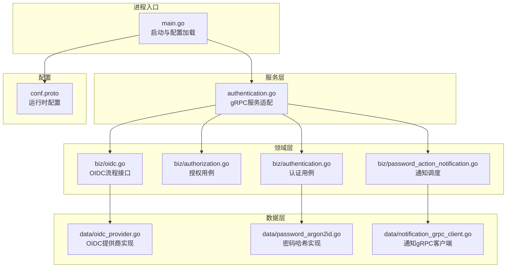
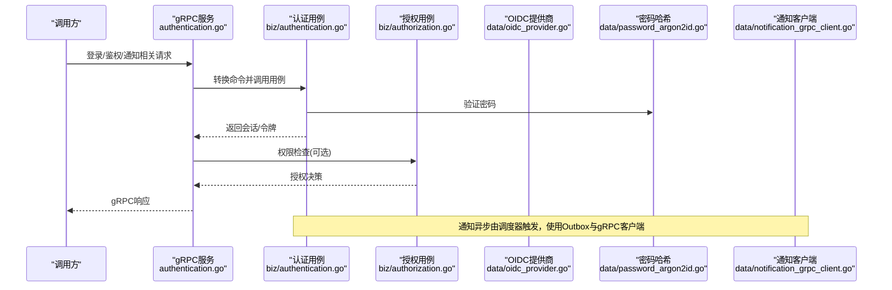
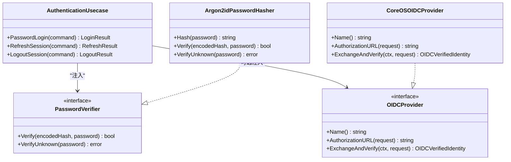
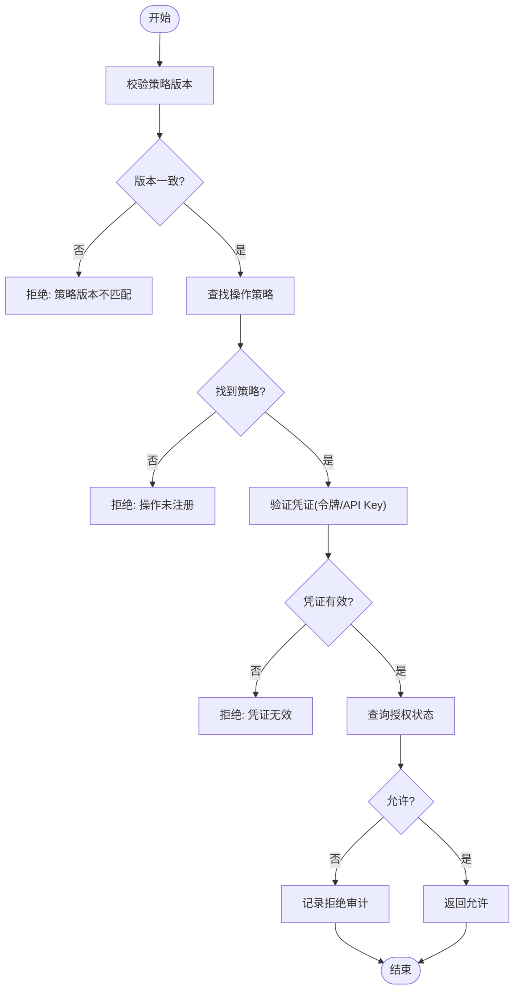
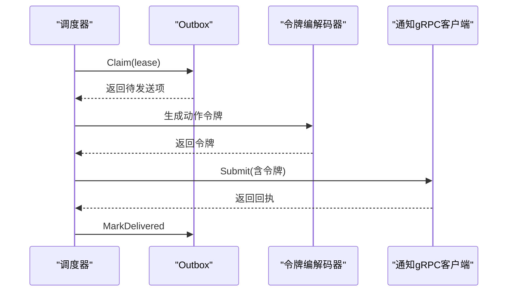
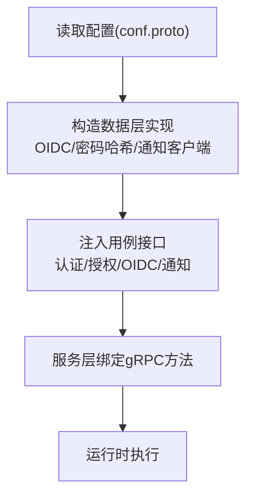
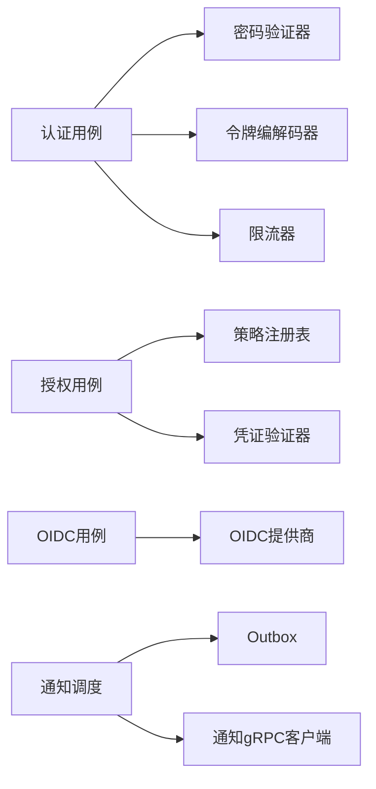

# 插件架构

<cite>
**本文引用的文件**
- [internal/biz/authentication.go](file://internal/biz/authentication.go)
- [internal/biz/authorization.go](file://internal/biz/authorization.go)
- [internal/biz/oidc.go](file://internal/biz/oidc.go)
- [internal/biz/password_action_notification.go](file://internal/biz/password_action_notification.go)
- [internal/data/oidc_provider.go](file://internal/data/oidc_provider.go)
- [internal/data/password_argon2id.go](file://internal/data/password_argon2id.go)
- [internal/data/notification_grpc_client.go](file://internal/data/notification_grpc_client.go)
- [internal/service/authentication.go](file://internal/service/authentication.go)
- [cmd/server/main.go](file://cmd/server/main.go)
- [internal/conf/conf.proto](file://internal/conf/conf.proto)
</cite>

## 目录
1. [简介](#简介)
2. [项目结构](#项目结构)
3. [核心组件](#核心组件)
4. [架构总览](#架构总览)
5. [详细组件分析](#详细组件分析)
6. [依赖关系分析](#依赖关系分析)
7. [性能考虑](#性能考虑)
8. [故障排查指南](#故障排查指南)
9. [结论](#结论)
10. [附录](#附录)

## 简介
本文件面向ANI IAM的“插件化”设计与扩展机制，围绕以下目标展开：
- 解释插件的生命周期管理、依赖注入与接口抽象
- 说明如何开发自定义认证提供者、授权策略与通知渠道
- 阐述插件注册、发现与加载的实现细节
- 提供插件开发的完整示例（以代码片段路径形式引用）
- 说明插件打包、分发与版本管理方法
- 给出性能与安全最佳实践

该系统的插件化通过“领域接口 + 数据实现 + 服务适配 + 配置驱动”的分层设计实现：业务用例仅依赖稳定接口，具体实现由运行时装配；外部能力（如OIDC提供商、密码哈希算法、通知通道）以可替换实现接入。

## 项目结构
- 入口与启动：命令行入口负责解析配置并构建应用
- 配置模型：集中定义运行时参数（PostgreSQL、Redis、AccessToken、OIDC、Notification等）
- 服务层：gRPC服务将请求转换为领域命令，调用用例
- 领域层：用例与接口抽象（认证、授权、OIDC流程、通知调度）
- 数据层：具体实现（OIDC提供商、密码哈希、通知gRPC客户端等）

**图示来源**
- [cmd/server/main.go:34-101](file://cmd/server/main.go#L34-L101)
- [internal/service/authentication.go:91-106](file://internal/service/authentication.go#L91-L106)
- [internal/biz/authentication.go:286-339](file://internal/biz/authentication.go#L286-L339)
- [internal/biz/authorization.go:199-223](file://internal/biz/authorization.go#L199-L223)
- [internal/biz/oidc.go:89-93](file://internal/biz/oidc.go#L89-L93)
- [internal/biz/password_action_notification.go:72-94](file://internal/biz/password_action_notification.go#L72-L94)
- [internal/data/oidc_provider.go:62-95](file://internal/data/oidc_provider.go#L62-L95)
- [internal/data/password_argon2id.go:24-32](file://internal/data/password_argon2id.go#L24-L32)
- [internal/data/notification_grpc_client.go:46-103](file://internal/data/notification_grpc_client.go#L46-L103)
- [internal/conf/conf.proto:41-112](file://internal/conf/conf.proto#L41-L112)

**章节来源**
- [cmd/server/main.go:34-101](file://cmd/server/main.go#L34-L101)
- [internal/conf/conf.proto:41-112](file://internal/conf/conf.proto#L41-L112)

## 核心组件
- 认证用例：封装密码登录、会话刷新、登出、租户切换、主体验证等流程，依赖密码验证器、限流器、令牌编解码器、工作单元等接口
- 授权用例：基于操作ID与策略注册表进行权限判定，支持访问令牌与API Key两种凭证类型，输出决策与义务
- OIDC流程：定义认证提供者接口与操作流程，数据层提供CoreOS OIDC实现
- 通知调度：通过Outbox模式拉取待发送项，生成动作令牌并调用通知适配器，具备重试与退避策略
- 配置驱动：通过Bootstrap/Runtime配置组装各组件（数据库、缓存、令牌、OIDC、通知等）

**章节来源**
- [internal/biz/authentication.go:286-339](file://internal/biz/authentication.go#L286-L339)
- [internal/biz/authorization.go:199-223](file://internal/biz/authorization.go#L199-L223)
- [internal/biz/oidc.go:89-93](file://internal/biz/oidc.go#L89-L93)
- [internal/biz/password_action_notification.go:72-94](file://internal/biz/password_action_notification.go#L72-L94)
- [internal/conf/conf.proto:41-112](file://internal/conf/conf.proto#L41-L112)

## 架构总览
系统采用分层与接口隔离的插件化架构：
- 服务层仅依赖领域用例接口，不感知具体实现
- 领域用例仅依赖稳定的端口接口（Reader/Writer/Codec/Provider等）
- 数据层提供具体实现（OIDC、密码哈希、通知gRPC客户端）
- 配置在启动时完成依赖注入，决定启用哪些插件

**图示来源**
- [internal/service/authentication.go:150-194](file://internal/service/authentication.go#L150-L194)
- [internal/biz/authentication.go:341-530](file://internal/biz/authentication.go#L341-L530)
- [internal/biz/authorization.go:225-329](file://internal/biz/authorization.go#L225-L329)
- [internal/data/oidc_provider.go:115-154](file://internal/data/oidc_provider.go#L115-L154)
- [internal/data/password_argon2id.go:30-55](file://internal/data/password_argon2id.go#L30-L55)
- [internal/data/notification_grpc_client.go:46-103](file://internal/data/notification_grpc_client.go#L46-L103)

## 详细组件分析

### 认证插件（密码与OIDC）
- 插件接口
  - 密码验证器：提供校验与未知账户恒定时间验证，避免时序侧信道
  - OIDC提供商：提供授权URL生成与令牌交换验证
- 生命周期
  - 启动时根据配置创建具体实现（Argon2id、CoreOS OIDC）
  - 运行期按请求路由到对应实现
- 依赖注入
  - 用例通过构造函数注入接口，便于测试与替换
- 错误处理
  - 区分依赖不可用与业务失败，统一映射为gRPC状态码

**图示来源**
- [internal/biz/authentication.go:286-339](file://internal/biz/authentication.go#L286-L339)
- [internal/biz/oidc.go:89-93](file://internal/biz/oidc.go#L89-L93)
- [internal/data/password_argon2id.go:24-63](file://internal/data/password_argon2id.go#L24-L63)
- [internal/data/oidc_provider.go:62-95](file://internal/data/oidc_provider.go#L62-L95)

**章节来源**
- [internal/biz/authentication.go:341-530](file://internal/biz/authentication.go#L341-L530)
- [internal/data/password_argon2id.go:30-55](file://internal/data/password_argon2id.go#L30-L55)
- [internal/data/oidc_provider.go:115-154](file://internal/data/oidc_provider.go#L115-L154)

### 授权插件（策略注册与凭证校验）
- 插件接口
  - 策略注册表：提供策略查询与版本修订号
  - 凭证验证器：验证访问令牌或API Key
- 生命周期
  - 启动时加载策略注册表与凭证验证器
  - 每次鉴权前校验策略版本一致性
- 依赖注入
  - 用例通过构造函数注入注册表、验证器、读取器等
- 错误处理
  - 策略不匹配、未注册操作、凭证无效等均有明确错误码与审计记录

**图示来源**
- [internal/biz/authorization.go:225-329](file://internal/biz/authorization.go#L225-L329)
- [internal/biz/authorization.go:331-420](file://internal/biz/authorization.go#L331-L420)
- [internal/biz/authorization.go:516-576](file://internal/biz/authorization.go#L516-L576)

**章节来源**
- [internal/biz/authorization.go:199-223](file://internal/biz/authorization.go#L199-L223)
- [internal/biz/authorization.go:225-329](file://internal/biz/authorization.go#L225-L329)

### 通知插件（Outbox与gRPC适配器）
- 插件接口
  - Outbox：持久化待发送通知，支持租约与重排
  - 提交适配器：将通知发送到外部通知服务（gRPC）
- 生命周期
  - 后台调度器周期性Claim条目，生成动作令牌，调用适配器
  - 成功则标记已投递，失败则指数退避重试或转入人工关注
- 依赖注入
  - 调度器注入Outbox、令牌编解码器、提交适配器与时钟
- 错误处理
  - 区分可重试与永久错误，保证幂等与最终一致性

**图示来源**
- [internal/biz/password_action_notification.go:96-153](file://internal/biz/password_action_notification.go#L96-L153)
- [internal/data/notification_grpc_client.go:46-103](file://internal/data/notification_grpc_client.go#L46-L103)

**章节来源**
- [internal/biz/password_action_notification.go:72-94](file://internal/biz/password_action_notification.go#L72-L94)
- [internal/biz/password_action_notification.go:96-153](file://internal/biz/password_action_notification.go#L96-L153)
- [internal/data/notification_grpc_client.go:46-103](file://internal/data/notification_grpc_client.go#L46-L103)

### 插件注册、发现与加载
- 注册：通过配置中的字段声明插件能力（如OIDC provider、issuer_url、client_id、secret_file、notification address等）
- 发现：启动时解析配置，构造具体实现对象（如CoreOS OIDC Provider、Argon2id Hasher、Notification gRPC Client）
- 加载：将实现注入到用例与服务层，形成完整的依赖图
- 版本：策略注册表提供Revision，授权流程强制版本匹配，确保策略变更的一致性

**图示来源**
- [internal/conf/conf.proto:41-112](file://internal/conf/conf.proto#L41-L112)
- [internal/data/oidc_provider.go:62-95](file://internal/data/oidc_provider.go#L62-L95)
- [internal/data/password_argon2id.go:24-32](file://internal/data/password_argon2id.go#L24-L32)
- [internal/data/notification_grpc_client.go:46-103](file://internal/data/notification_grpc_client.go#L46-L103)
- [internal/service/authentication.go:91-106](file://internal/service/authentication.go#L91-L106)

**章节来源**
- [cmd/server/main.go:82-101](file://cmd/server/main.go#L82-L101)
- [internal/conf/conf.proto:41-112](file://internal/conf/conf.proto#L41-L112)

## 依赖关系分析
- 耦合度
  - 服务层与用例层松耦合，仅依赖接口
  - 用例层与数据层通过接口解耦，便于替换实现
- 直接依赖
  - 认证用例依赖密码验证器、限流器、令牌编解码器、工作单元
  - 授权用例依赖策略注册表、凭证验证器、读取器
  - OIDC用例依赖OIDC提供商接口
  - 通知调度依赖Outbox、令牌编解码器、提交适配器
- 外部依赖
  - PostgreSQL、Redis（通过配置与数据层实现）
  - 外部OIDC服务器、通知服务（通过gRPC/TLS安全连接）

**图示来源**
- [internal/biz/authentication.go:286-339](file://internal/biz/authentication.go#L286-L339)
- [internal/biz/authorization.go:199-223](file://internal/biz/authorization.go#L199-L223)
- [internal/biz/oidc.go:89-93](file://internal/biz/oidc.go#L89-L93)
- [internal/biz/password_action_notification.go:72-94](file://internal/biz/password_action_notification.go#L72-L94)
- [internal/data/notification_grpc_client.go:46-103](file://internal/data/notification_grpc_client.go#L46-L103)

**章节来源**
- [internal/biz/authentication.go:286-339](file://internal/biz/authentication.go#L286-L339)
- [internal/biz/authorization.go:199-223](file://internal/biz/authorization.go#L199-L223)
- [internal/biz/oidc.go:89-93](file://internal/biz/oidc.go#L89-L93)
- [internal/biz/password_action_notification.go:72-94](file://internal/biz/password_action_notification.go#L72-L94)

## 性能考虑
- 密码哈希参数固定且受控，避免参数漂移导致的安全与性能问题
- 限流器对登录与刷新进行速率控制，防止滥用
- 通知Outbox采用租约与指数退避，降低重复处理与外部压力
- 策略版本校验减少不一致导致的额外计算
- gRPC连接复用与TLS最小版本限制提升网络与加密性能

[本节为通用指导，无需特定文件来源]

## 故障排查指南
- 认证失败
  - 检查限流是否触发、密码验证是否成功、租户生命周期与成员状态
  - 参考错误映射与审计事件定位原因
- 授权失败
  - 确认策略版本匹配、操作已注册、凭证有效、资源边界正确
  - 查看拒绝审计事件与决策ID
- OIDC异常
  - 检查提供商配置、回调地址、PKCE验证器、网络超时
- 通知失败
  - 查看Outbox重试次数、退避时间、是否转入人工关注
  - 检查gRPC证书与DNS身份校验

**章节来源**
- [internal/service/authentication.go:476-683](file://internal/service/authentication.go#L476-L683)
- [internal/biz/authorization.go:516-576](file://internal/biz/authorization.go#L516-L576)
- [internal/data/oidc_provider.go:156-190](file://internal/data/oidc_provider.go#L156-L190)
- [internal/biz/password_action_notification.go:155-180](file://internal/biz/password_action_notification.go#L155-L180)

## 结论
ANI IAM通过清晰的接口抽象与依赖注入实现了高内聚、低耦合的插件化架构。认证、授权、OIDC与通知均以可替换实现接入，配合配置驱动与策略版本控制，既保证了可扩展性，又确保了安全性与一致性。遵循本文的最佳实践，可高效开发自定义认证提供者、授权策略与通知渠道，并在生产环境中稳定运行。

[本节为总结，无需特定文件来源]

## 附录

### 自定义认证提供者（OIDC）
- 步骤
  - 实现OIDCProvider接口（名称、授权URL、令牌交换与验证）
  - 在配置中设置provider、issuer_url、client_id、secret_file、redirect_uri等
  - 启动时由配置构造具体实现并注入用例
- 参考路径
  - [internal/biz/oidc.go:89-93](file://internal/biz/oidc.go#L89-L93)
  - [internal/data/oidc_provider.go:62-95](file://internal/data/oidc_provider.go#L62-L95)
  - [internal/conf/conf.proto:103-112](file://internal/conf/conf.proto#L103-L112)

**章节来源**
- [internal/biz/oidc.go:89-93](file://internal/biz/oidc.go#L89-L93)
- [internal/data/oidc_provider.go:62-95](file://internal/data/oidc_provider.go#L62-L95)
- [internal/conf/conf.proto:103-112](file://internal/conf/conf.proto#L103-L112)

### 自定义授权策略
- 步骤
  - 维护策略注册表，提供Revision与Lookup
  - 在服务启动时加载策略，确保版本一致
  - 在授权用例中校验策略版本并查询策略
- 参考路径
  - [internal/biz/authorization.go:108-111](file://internal/biz/authorization.go#L108-L111)
  - [internal/biz/authorization.go:225-249](file://internal/biz/authorization.go#L225-L249)

**章节来源**
- [internal/biz/authorization.go:108-111](file://internal/biz/authorization.go#L108-L111)
- [internal/biz/authorization.go:225-249](file://internal/biz/authorization.go#L225-L249)

### 自定义通知渠道
- 步骤
  - 实现PasswordActionNotificationSubmitter接口
  - 配置通知gRPC客户端（地址、证书、CA、DNS名）
  - 将适配器注入通知调度器
- 参考路径
  - [internal/biz/password_action_notification.go:66-68](file://internal/biz/password_action_notification.go#L66-L68)
  - [internal/data/notification_grpc_client.go:27-36](file://internal/data/notification_grpc_client.go#L27-L36)
  - [internal/data/notification_grpc_client.go:46-103](file://internal/data/notification_grpc_client.go#L46-L103)

**章节来源**
- [internal/biz/password_action_notification.go:66-68](file://internal/biz/password_action_notification.go#L66-L68)
- [internal/data/notification_grpc_client.go:27-36](file://internal/data/notification_grpc_client.go#L27-L36)
- [internal/data/notification_grpc_client.go:46-103](file://internal/data/notification_grpc_client.go#L46-L103)

### 插件打包、分发与版本管理
- 打包
  - 将插件实现编译为独立二进制或库，随主应用部署
- 分发
  - 通过配置中心或配置文件下发插件参数（如OIDC、通知地址、密钥文件路径）
- 版本管理
  - 策略注册表提供Revision，授权流程强制版本匹配
  - 通知Outbox与令牌时效控制保障最终一致性

**章节来源**
- [internal/biz/authorization.go:225-249](file://internal/biz/authorization.go#L225-L249)
- [internal/biz/password_action_notification.go:96-153](file://internal/biz/password_action_notification.go#L96-L153)

### 安全最佳实践
- 使用强密码哈希（固定参数），避免参数漂移
- 使用HTTPS与TLS1.3，严格证书与DNS身份校验
- 限流与锁定防止暴力破解
- 审计与决策ID用于可追溯性
- 策略版本校验避免不一致

**章节来源**
- [internal/data/password_argon2id.go:14-22](file://internal/data/password_argon2id.go#L14-L22)
- [internal/data/notification_grpc_client.go:79-85](file://internal/data/notification_grpc_client.go#L79-L85)
- [internal/biz/authentication.go:371-419](file://internal/biz/authentication.go#L371-L419)
- [internal/biz/authorization.go:225-249](file://internal/biz/authorization.go#L225-L249)