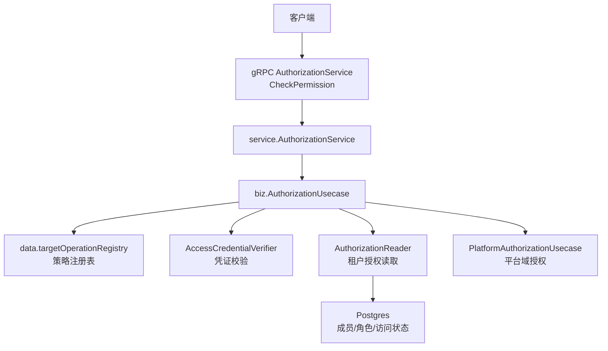
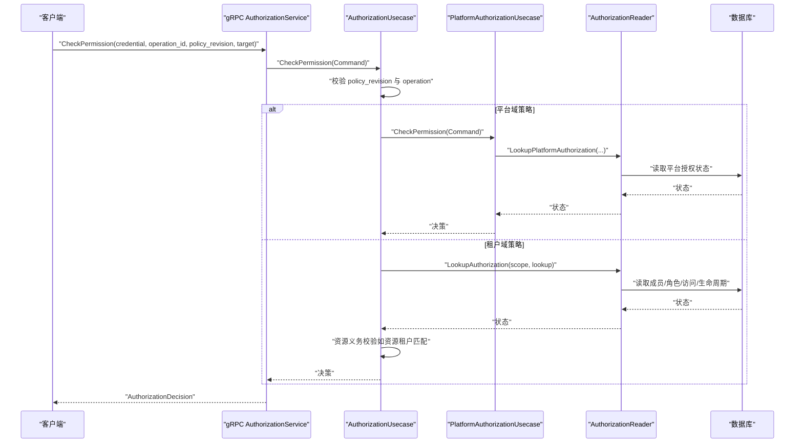
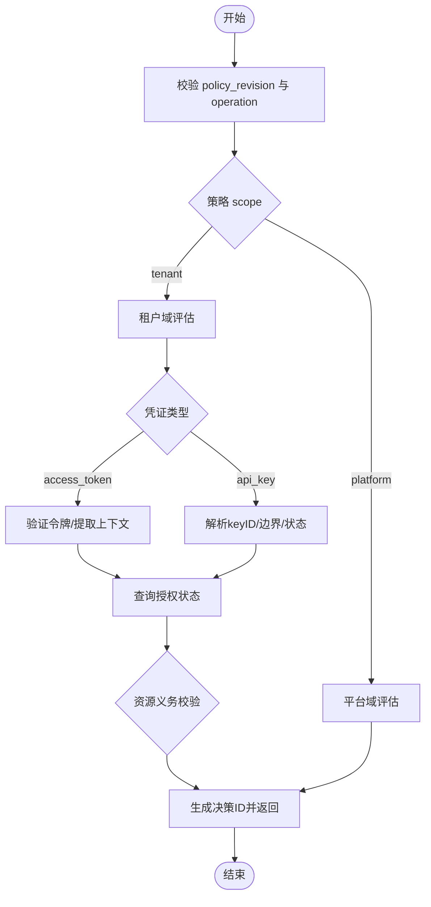
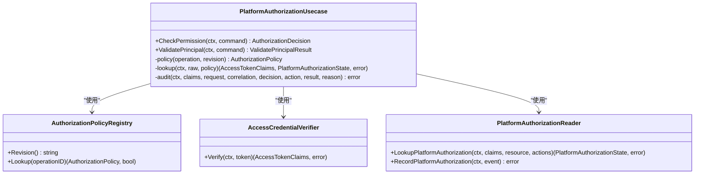
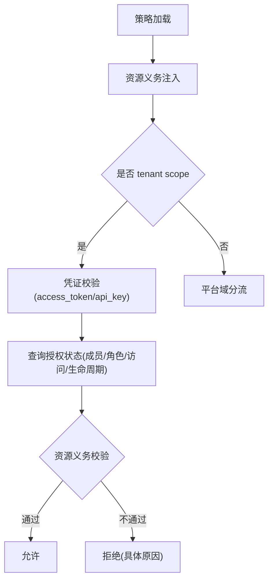
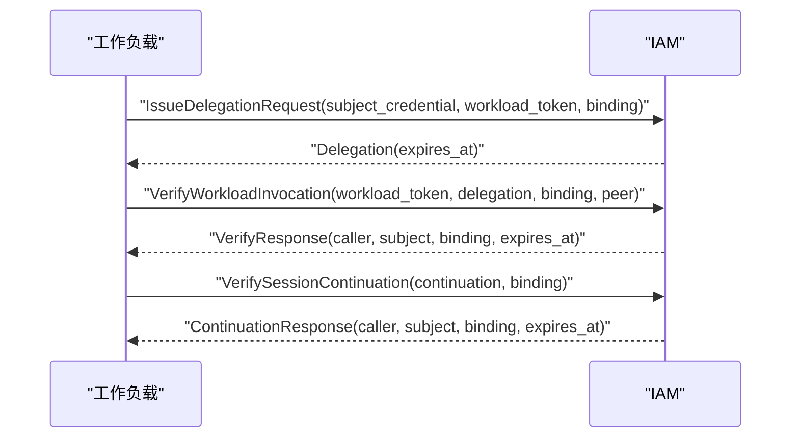
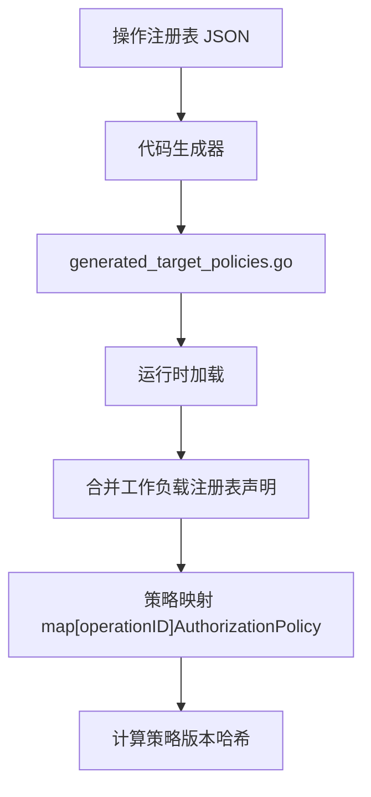
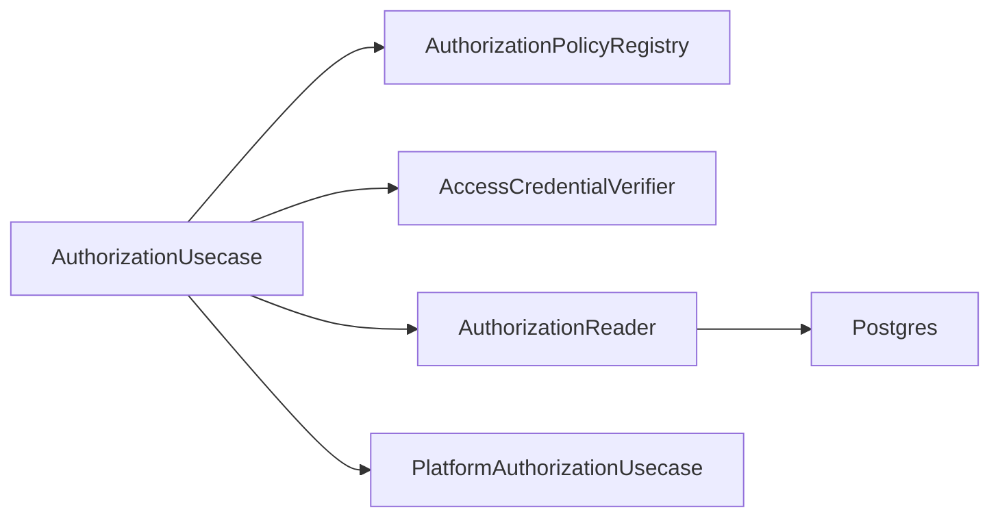

# 自定义授权

<cite>
**本文引用的文件**
- [internal/biz/authorization.go](file://internal/biz/authorization.go)
- [internal/service/authorization.go](file://internal/service/authorization.go)
- [api/iam/v1/authorization_service.proto](file://api/iam/v1/authorization_service.proto)
- [internal/data/generated_operation_policies.go](file://internal/data/generated_operation_policies.go)
- [internal/data/operation_registry.go](file://internal/data/operation_registry.go)
- [internal/biz/platform_authorization.go](file://internal/biz/platform_authorization.go)
- [internal/biz/tenant_authorization.go](file://internal/biz/tenant_authorization.go)
- [internal/data/tenant_authorization.go](file://internal/data/tenant_authorization.go)
- [api/iam/v1/workload.proto](file://api/iam/v1/workload.proto)
</cite>

## 目录
1. [简介](#简介)
2. [项目结构](#项目结构)
3. [核心组件](#核心组件)
4. [架构总览](#架构总览)
5. [详细组件分析](#详细组件分析)
6. [依赖关系分析](#依赖关系分析)
7. [性能考虑](#性能考虑)
8. [故障排查指南](#故障排查指南)
9. [结论](#结论)
10. [附录](#附录)

## 简介
本指南面向希望扩展 ANI IAM 授权能力的开发者，系统性说明如何基于现有机制实现“自定义授权规则、资源级权限控制与上下文感知授权”。文档围绕以下主题展开：
- 授权评估流程与策略执行机制
- 策略注册、版本一致性与可审计性
- 资源级权限（Resource-scoped）与租户边界约束
- 上下文感知授权（Principal、Session、Grant、生命周期等）
- 平台域与租户域的差异化处理
- 工作负载调用链中的授权与委托
- 性能优化与测试策略
- 完整示例与最佳实践

## 项目结构
ANI IAM 的授权能力由服务层、业务用例、数据访问与协议定义共同构成。关键路径如下：
- 协议层：gRPC 接口暴露 CheckPermission 等能力
- 服务层：将请求转换为领域命令并调用用例
- 业务层：AuthorizationUsecase 负责策略解析、凭证校验、状态查询与决策生成
- 数据层：操作策略注册表、权限目录、租户授权读写
- 平台授权：针对平台域（Boss 受众）的专用评估流程

**图示来源**
- [api/iam/v1/authorization_service.proto:10-16](file://api/iam/v1/authorization_service.proto#L10-L16)
- [internal/service/authorization.go:27-67](file://internal/service/authorization.go#L27-L67)
- [internal/biz/authorization.go:214-223](file://internal/biz/authorization.go#L214-L223)
- [internal/data/operation_registry.go:26-39](file://internal/data/operation_registry.go#L26-L39)
- [internal/biz/platform_authorization.go:26-39](file://internal/biz/platform_authorization.go#L26-L39)

**章节来源**
- [api/iam/v1/authorization_service.proto:10-16](file://api/iam/v1/authorization_service.proto#L10-L16)
- [internal/service/authorization.go:27-67](file://internal/service/authorization.go#L27-L67)
- [internal/biz/authorization.go:214-223](file://internal/biz/authorization.go#L214-L223)
- [internal/data/operation_registry.go:26-39](file://internal/data/operation_registry.go#L26-L39)
- [internal/biz/platform_authorization.go:26-39](file://internal/biz/platform_authorization.go#L26-L39)

## 核心组件
- 策略注册表（AuthorizationPolicyRegistry）
  - 提供策略版本与按 operationID 查找策略的能力
  - 运行时合并生成的策略与工作负载注册表声明，确保一致性
- 业务用例（AuthorizationUsecase）
  - 校验策略版本、操作与目标资源
  - 区分凭证类型（access_token、api_key、workload_token）
  - 委派平台域或租户域评估
  - 生成决策 ID、记录审计事件
- 平台授权（PlatformAuthorizationUsecase）
  - 仅接受平台域（Boss 受众）的人类用户令牌
  - 校验会话、成员、授予版本与权限
- 租户授权（TenantAuthorizationUsecase + Reader）
  - 读取成员、角色、访问状态、生命周期新鲜度
  - 支持资源级义务（Obligation）校验（如资源必须属于指定租户）
- 数据访问（Postgres 实现）
  - 事务化成员/角色绑定与访问状态变更
  - 管理式锁与版本冲突保护

**章节来源**
- [internal/biz/authorization.go:108-115](file://internal/biz/authorization.go#L108-L115)
- [internal/biz/authorization.go:199-223](file://internal/biz/authorization.go#L199-L223)
- [internal/biz/platform_authorization.go:26-39](file://internal/biz/platform_authorization.go#L26-L39)
- [internal/biz/tenant_authorization.go:194-215](file://internal/biz/tenant_authorization.go#L194-L215)
- [internal/data/tenant_authorization.go:137-172](file://internal/data/tenant_authorization.go#L137-L172)

## 架构总览
授权评估遵循“策略优先、凭证校验、上下文检查、资源义务、最终决策”的流程。平台域与租户域在入口处分流，但共享统一的决策结构与审计模型。

**图示来源**
- [api/iam/v1/authorization_service.proto:10-16](file://api/iam/v1/authorization_service.proto#L10-L16)
- [internal/service/authorization.go:27-67](file://internal/service/authorization.go#L27-L67)
- [internal/biz/authorization.go:225-329](file://internal/biz/authorization.go#L225-L329)
- [internal/biz/platform_authorization.go:92-117](file://internal/biz/platform_authorization.go#L92-L117)

## 详细组件分析

### 授权评估主流程（AuthorizationUsecase）
- 策略版本与操作合法性校验
- 根据策略 scope 分流到平台域或租户域
- 凭证类型与主体类型白名单校验
- access_token 路径：验证令牌、提取主体/会话/授予信息、构建租户范围、查询授权状态、判定拒绝原因
- api_key 路径：解析 keyID、获取边界租户、校验密钥状态、查询授权状态、观测使用量
- 生成决策 ID 并返回决策结果；失败路径统一记录审计事件

**图示来源**
- [internal/biz/authorization.go:225-329](file://internal/biz/authorization.go#L225-L329)
- [internal/biz/authorization.go:331-420](file://internal/biz/authorization.go#L331-L420)

**章节来源**
- [internal/biz/authorization.go:225-329](file://internal/biz/authorization.go#L225-L329)
- [internal/biz/authorization.go:331-420](file://internal/biz/authorization.go#L331-L420)

### 平台域授权（PlatformAuthorizationUsecase）
- 策略限定：仅 platform scope、人类主体、无资源义务
- 凭证限定：仅 access_token，且需为 Boss 受众、平台边界、包含人类认证方法
- 状态检查：主体活跃、成员活跃、会话有效、授予版本匹配、权限允许
- 审计：成功/失败均记录平台域审计事件

**图示来源**
- [internal/biz/platform_authorization.go:26-39](file://internal/biz/platform_authorization.go#L26-L39)
- [internal/biz/platform_authorization.go:92-117](file://internal/biz/platform_authorization.go#L92-L117)
- [internal/biz/platform_authorization.go:162-187](file://internal/biz/platform_authorization.go#L162-L187)

**章节来源**
- [internal/biz/platform_authorization.go:40-75](file://internal/biz/platform_authorization.go#L40-L75)
- [internal/biz/platform_authorization.go:92-117](file://internal/biz/platform_authorization.go#L92-L117)
- [internal/biz/platform_authorization.go:162-187](file://internal/biz/platform_authorization.go#L162-L187)

### 租户域授权与资源级权限
- 策略来源：由代码生成器从操作注册表生成，并在运行时合并工作负载注册表声明
- 资源级权限：通过 AuthorizationObligation 强制资源与租户匹配（handler 名称约定）
- 上下文感知：主体状态、成员状态、租户访问状态、生命周期新鲜度、会话状态、授予版本
- 审计：拒绝与未绑定场景分别记录审计事件

**图示来源**
- [internal/data/operation_registry.go:43-98](file://internal/data/operation_registry.go#L43-L98)
- [internal/biz/authorization.go:477-489](file://internal/biz/authorization.go#L477-L489)
- [internal/biz/authorization.go:491-514](file://internal/biz/authorization.go#L491-L514)

**章节来源**
- [internal/data/operation_registry.go:43-98](file://internal/data/operation_registry.go#L43-L98)
- [internal/biz/authorization.go:477-489](file://internal/biz/authorization.go#L477-L489)
- [internal/biz/authorization.go:491-514](file://internal/biz/authorization.go#L491-L514)

### 工作负载调用链与委托
- 工作负载身份与调用绑定通过 InvocationBinding 描述，包含 audience、operation、resource、policy_revision 等
- 委托令牌（Delegation）用于对特定请求进行短期再授权
- 接收方可在线续验（Continuation）以确认当前授权有效性

**图示来源**
- [api/iam/v1/workload.proto:10-25](file://api/iam/v1/workload.proto#L10-L25)
- [api/iam/v1/workload.proto:46-81](file://api/iam/v1/workload.proto#L46-L81)
- [api/iam/v1/workload.proto:83-94](file://api/iam/v1/workload.proto#L83-L94)

**章节来源**
- [api/iam/v1/workload.proto:10-25](file://api/iam/v1/workload.proto#L10-L25)
- [api/iam/v1/workload.proto:46-81](file://api/iam/v1/workload.proto#L46-L81)
- [api/iam/v1/workload.proto:83-94](file://api/iam/v1/workload.proto#L83-L94)

### 策略配置与生成
- 策略由操作注册表生成，包含 scope、resource、actions、principal/credential kinds、obligations
- 运行时合并工作负载注册表声明，若冲突或不一致则拒绝
- 版本哈希保证策略与调用方一致，避免降级风险

**图示来源**
- [internal/data/cmd/genoperationregistry/main.go:56-66](file://internal/data/cmd/genoperationregistry/main.go#L56-L66)
- [internal/data/cmd/genoperationregistry/main.go:201-238](file://internal/data/cmd/genoperationregistry/main.go#L201-L238)
- [internal/data/operation_registry.go:43-98](file://internal/data/operation_registry.go#L43-L98)

**章节来源**
- [internal/data/cmd/genoperationregistry/main.go:56-66](file://internal/data/cmd/genoperationregistry/main.go#L56-L66)
- [internal/data/cmd/genoperationregistry/main.go:201-238](file://internal/data/cmd/genoperationregistry/main.go#L201-L238)
- [internal/data/operation_registry.go:43-98](file://internal/data/operation_registry.go#L43-L98)

## 依赖关系分析
- AuthorizationUsecase 依赖：
  - 策略注册表（版本与策略查找）
  - 凭证校验器（access_token 验证）
  - 授权读取器（租户授权状态、API Key 授权状态）
  - 平台授权用例（平台域分流）
  - ID 生成器与时钟（决策 ID、时间比较）
- 数据层依赖 Postgres，提供成员、角色、访问状态的事务化读写与管理式锁

**图示来源**
- [internal/biz/authorization.go:199-223](file://internal/biz/authorization.go#L199-L223)
- [internal/data/tenant_authorization.go:137-172](file://internal/data/tenant_authorization.go#L137-L172)

**章节来源**
- [internal/biz/authorization.go:199-223](file://internal/biz/authorization.go#L199-L223)
- [internal/data/tenant_authorization.go:137-172](file://internal/data/tenant_authorization.go#L137-L172)

## 性能考虑
- 策略版本前置校验：在策略版本不匹配时短路，避免后续昂贵依赖调用
- 早期拒绝：资源义务与凭证类型白名单在早期阶段拒绝非法请求
- 只读路径优化：授权读取尽量使用索引与分页，减少大结果集
- 并发安全：租户管理操作使用管理式锁与版本冲突检测，避免竞态
- 审计异步化：审计写入应尽可能非阻塞或在事务外完成，降低延迟
- 缓存建议：对高频只读策略与权限目录可引入内存缓存（注意失效策略）

[本节为通用指导，无需特定文件引用]

## 故障排查指南
- 策略版本不匹配：检查调用方传入的 policy_revision 与服务端策略版本是否一致
- 凭证无效：检查 access_token 是否过期、主体/会话/授予是否为空或无效；检查 api_key 是否激活且未过期
- 资源不匹配：检查资源义务 handler 是否正确，资源所属租户是否与请求目标租户一致
- 权限不足：检查成员角色是否包含所需权限，权限是否在已接受的目录中
- 依赖不可用：当出现依赖错误（如数据库不可用），应重试或降级为观察模式（如适用）

**章节来源**
- [internal/biz/authorization.go:225-253](file://internal/biz/authorization.go#L225-L253)
- [internal/biz/authorization.go:254-329](file://internal/biz/authorization.go#L254-L329)
- [internal/biz/authorization.go:331-420](file://internal/biz/authorization.go#L331-L420)
- [internal/biz/authorization.go:491-514](file://internal/biz/authorization.go#L491-L514)

## 结论
ANI IAM 的授权体系通过“策略驱动、凭证校验、上下文感知、资源义务、统一审计”的设计，提供了可扩展、可审计、可回滚的安全基线。开发者可通过以下方式扩展：
- 在工作负载注册表中声明新的 operation 与权限，自动生成策略
- 通过 AuthorizationObligation 实现资源级约束（如资源租户匹配）
- 在平台域或租户域实现更细粒度的上下文判断（如多因素认证强度）
- 结合审计与监控，持续优化授权路径的性能与可观测性

[本节为总结性内容，无需特定文件引用]

## 附录

### 自定义授权实现步骤（示例）
- 新增操作与权限
  - 在工作负载注册表中声明新 operation，指定 resource、actions、scope、principal/credential kinds
  - 运行代码生成器生成策略常量与映射
- 添加资源义务
  - 为需要资源级控制的 operation 添加 obligation（如 core.resource_tenant）
- 实现上下文感知逻辑
  - 在租户授权读取器中增加额外上下文字段（如设备指纹、网络区域）
  - 在评估流程中根据上下文调整拒绝原因或附加条件
- 测试策略
  - 单元测试：覆盖策略版本不匹配、凭证无效、资源不匹配、权限不足等分支
  - 集成测试：端到端验证 CheckPermission 决策与审计事件

**章节来源**
- [internal/data/cmd/genoperationregistry/main.go:56-66](file://internal/data/cmd/genoperationregistry/main.go#L56-L66)
- [internal/data/cmd/genoperationregistry/main.go:201-238](file://internal/data/cmd/genoperationregistry/main.go#L201-L238)
- [internal/data/operation_registry.go:43-98](file://internal/data/operation_registry.go#L43-L98)
- [internal/biz/authorization.go:225-329](file://internal/biz/authorization.go#L225-L329)