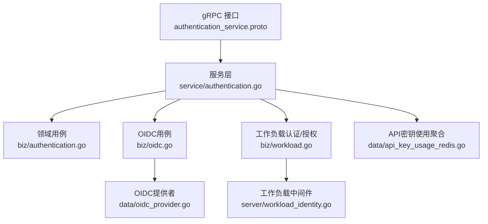
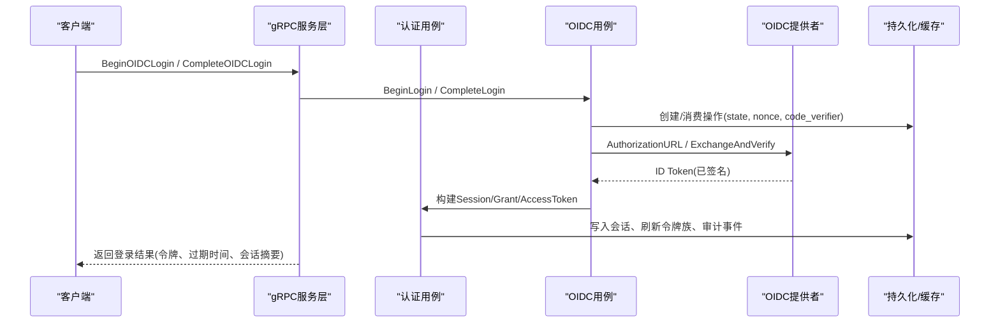
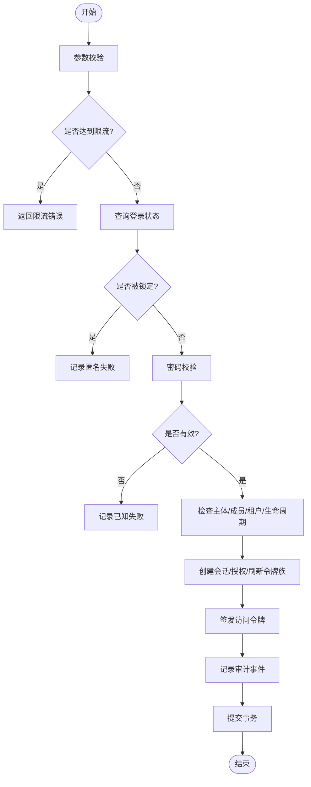
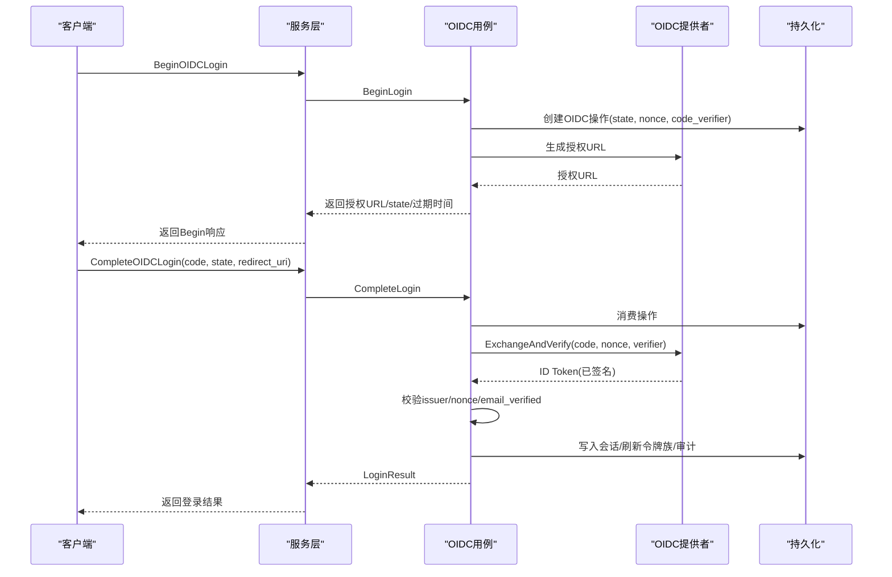
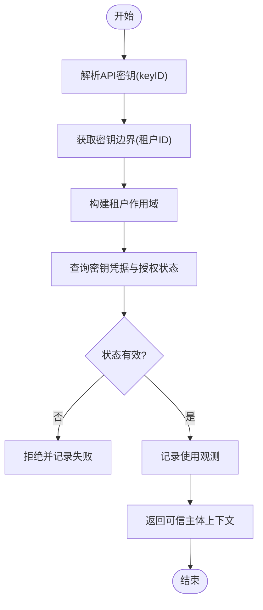
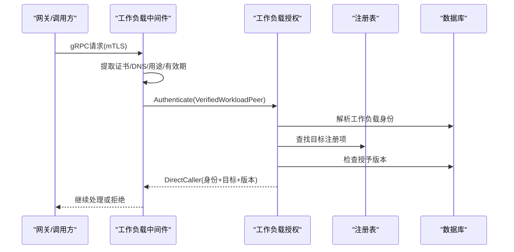
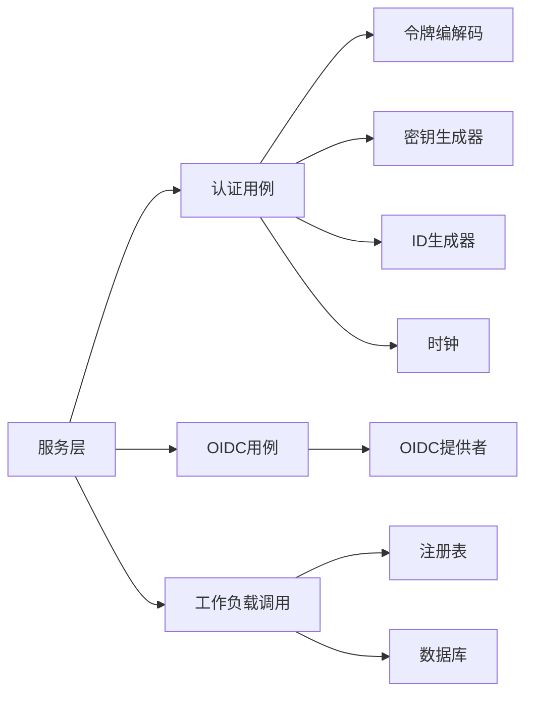

# 自定义认证

<cite>
**本文引用的文件**
- [authentication_service.proto](file://api/iam/v1/authentication_service.proto)
- [authentication.go（服务层）](file://internal/service/authentication.go)
- [authentication.go（领域用例）](file://internal/biz/authentication.go)
- [oidc.go（OIDC领域用例）](file://internal/biz/oidc.go)
- [oidc_provider.go（OIDC提供者实现）](file://internal/data/oidc_provider.go)
- [workload_identity.go（工作负载身份中间件）](file://internal/server/workload_identity.go)
- [workload.go（工作负载认证与授权）](file://internal/biz/workload.go)
- [workload_caller.go（工作负载调用者验证）](file://internal/biz/workload_caller.go)
- [api_key_usage_redis.go（API密钥使用聚合）](file://internal/data/api_key_usage_redis.go)
- [principal_validation.go（主体校验，含API密钥路径）](file://internal/biz/principal_validation.go)
</cite>

## 目录
1. [简介](#简介)
2. [项目结构](#项目结构)
3. [核心组件](#核心组件)
4. [架构总览](#架构总览)
5. [详细组件分析](#详细组件分析)
6. [依赖关系分析](#依赖关系分析)
7. [性能考虑](#性能考虑)
8. [故障排查指南](#故障排查指南)
9. [结论](#结论)
10. [附录：扩展点与示例](#附录：扩展点与示例)

## 简介
本指南面向需要在ANI IAM中扩展认证能力的开发者。内容涵盖：
- 认证流程的扩展点与钩子机制
- 如何实现自定义认证提供者（包括OIDC集成、API密钥验证、工作负载认证）
- 认证令牌处理、会话管理与安全注意事项
- 完整自定义认证实现示例与复杂场景处理
- 测试策略与性能优化方法

## 项目结构
ANI IAM采用分层设计：
- API定义：gRPC接口契约
- 服务层：请求解析、错误映射、协议适配
- 领域用例：认证/授权/会话/OIDC等核心业务逻辑
- 数据层：持久化、外部依赖（Redis、Postgres、HTTP客户端）
- 服务器层：中间件、TLS、工作负载身份验证

图表来源
- [authentication_service.proto:11-33](file://api/iam/v1/authentication_service.proto#L11-L33)
- [authentication.go（服务层）:91-106](file://internal/service/authentication.go#L91-L106)
- [authentication.go（领域用例）:286-339](file://internal/biz/authentication.go#L286-L339)
- [oidc.go（OIDC领域用例）:216-251](file://internal/biz/oidc.go#L216-L251)
- [oidc_provider.go（OIDC提供者实现）:44-95](file://internal/data/oidc_provider.go#L44-L95)
- [workload_identity.go（工作负载身份中间件）:22-50](file://internal/server/workload_identity.go#L22-L50)
- [api_key_usage_redis.go（API密钥使用聚合）:26-61](file://internal/data/api_key_usage_redis.go#L26-L61)

章节来源
- [authentication_service.proto:11-33](file://api/iam/v1/authentication_service.proto#L11-L33)
- [authentication.go（服务层）:91-106](file://internal/service/authentication.go#L91-L106)

## 核心组件
- 认证服务（gRPC）：暴露PasswordLogin、OIDC登录、刷新/登出、租户切换、ValidatePrincipal等能力
- 领域认证用例：密码登录、会话创建、令牌签发、限流、审计
- OIDC用例：登录流程、身份绑定、重认证窗口控制
- OIDC提供者：对接外部OIDC发行方，支持PKCE、ID Token校验
- 工作负载认证/授权：mTLS证书身份、工作负载令牌签发与验证、调用链可信性
- API密钥验证：基于前缀“ani_”的密钥解析、边界检查、使用观测
- 令牌与会话：访问令牌、刷新令牌族、会话状态、授权授予

章节来源
- [authentication_service.proto:11-33](file://api/iam/v1/authentication_service.proto#L11-L33)
- [authentication.go（领域用例）:286-339](file://internal/biz/authentication.go#L286-L339)
- [oidc.go（OIDC领域用例）:216-251](file://internal/biz/oidc.go#L216-L251)
- [oidc_provider.go（OIDC提供者实现）:44-95](file://internal/data/oidc_provider.go#L44-L95)
- [workload.go（工作负载认证与授权）:56-106](file://internal/biz/workload.go#L56-L106)
- [principal_validation.go（主体校验，含API密钥路径）:120-220](file://internal/biz/principal_validation.go#L120-L220)

## 架构总览
ANI IAM的认证架构围绕“可插拔提供者 + 统一用例 + 强约束令牌/会话”展开：
- 服务层将gRPC请求转换为领域命令，并映射错误为统一的IAM状态码
- 领域用例负责业务规则、令牌签发、审计记录、限流与幂等
- OIDC通过Provider接口抽象，允许替换或扩展第三方提供方
- 工作负载认证通过中间件在传输层完成mTLS身份提取，再交由领域授权
- API密钥作为工作负载主体的凭证，受策略与边界限制

图表来源
- [authentication_service.proto:11-33](file://api/iam/v1/authentication_service.proto#L11-L33)
- [authentication.go（服务层）:256-316](file://internal/service/authentication.go#L256-L316)
- [oidc.go（OIDC领域用例）:547-742](file://internal/biz/oidc.go#L547-L742)
- [oidc_provider.go（OIDC提供者实现）:101-154](file://internal/data/oidc_provider.go#L101-L154)

## 详细组件分析

### 密码登录与会话管理
- 输入校验：账户、密码、受众、源IP、幂等键
- 限流：按账号/IP进行尝试次数限制，失败记录与锁定
- 状态检查：主体、成员关系、租户访问、生命周期
- 令牌签发：访问令牌包含边界、受众、会话ID、授权版本、租户ID、认证方法
- 刷新令牌：家族式轮换，绝对过期与空闲过期分离
- 审计：成功/失败均记录，匿名失败不泄露敏感信息

图表来源
- [authentication.go（领域用例）:341-530](file://internal/biz/authentication.go#L341-L530)

章节来源
- [authentication.go（领域用例）:341-530](file://internal/biz/authentication.go#L341-L530)
- [authentication.go（服务层）:150-194](file://internal/service/authentication.go#L150-L194)

### OIDC集成与身份绑定
- 开始登录：生成state/nonce/code_verifier，持久化操作，构造授权URL
- 完成登录：消费操作，交换code换取ID Token，校验issuer/nonce/email_verified
- 身份绑定：查找已绑定的Identity/Principal/Membership，校验状态与生命周期
- 重认证窗口：对敏感操作要求近期重新认证
- 浏览器证明：可选的browser_proof用于回调安全

图表来源
- [authentication_service.proto:61-87](file://api/iam/v1/authentication_service.proto#L61-L87)
- [authentication.go（服务层）:256-316](file://internal/service/authentication.go#L256-L316)
- [oidc.go（OIDC领域用例）:547-742](file://internal/biz/oidc.go#L547-L742)
- [oidc_provider.go（OIDC提供者实现）:101-154](file://internal/data/oidc_provider.go#L101-L154)

章节来源
- [oidc.go（OIDC领域用例）:547-742](file://internal/biz/oidc.go#L547-L742)
- [oidc_provider.go（OIDC提供者实现）:101-154](file://internal/data/oidc_provider.go#L101-L154)

### API密钥验证与工作负载主体
- 凭证格式：以“ani_”前缀标识，解析出keyID
- 边界检查：从密钥获取租户边界，确保目标租户一致
- 状态检查：密钥活跃、未过期、主体/成员/租户访问状态
- 使用观测：每次认证后记录使用量，异步落库
- 策略限制：仅允许工作负载主体类型，拒绝人类主体

图表来源
- [principal_validation.go（主体校验，含API密钥路径）:120-220](file://internal/biz/principal_validation.go#L120-L220)
- [api_key_usage_redis.go（API密钥使用聚合）:63-123](file://internal/data/api_key_usage_redis.go#L63-L123)

章节来源
- [principal_validation.go（主体校验，含API密钥路径）:120-220](file://internal/biz/principal_validation.go#L120-L220)
- [api_key_usage_redis.go（API密钥使用聚合）:63-123](file://internal/data/api_key_usage_redis.go#L63-L123)

### 工作负载认证与调用链可信性
- mTLS中间件：从TLS握手提取证书链，校验DNS名称、用途、有效期
- 身份解析：将VerifiedWorkloadPeer解析为WorkloadIdentity
- 授权检查：根据注册表与授予版本判断是否允许访问目标操作
- 调用者验证：支持RPC与HTTP两种调用方式，校验目标、方法、路径、修订版
- 本地令牌：内部服务间短时效令牌，不可刷新，严格边界

图表来源
- [workload_identity.go（工作负载身份中间件）:22-50](file://internal/server/workload_identity.go#L22-L50)
- [workload.go（工作负载认证与授权）:56-106](file://internal/biz/workload.go#L56-L106)
- [workload_caller.go（工作负载调用者验证）:43-114](file://internal/biz/workload_caller.go#L43-L114)

章节来源
- [workload_identity.go（工作负载身份中间件）:22-50](file://internal/server/workload_identity.go#L22-L50)
- [workload.go（工作负载认证与授权）:56-106](file://internal/biz/workload.go#L56-L106)
- [workload_caller.go（工作负载调用者验证）:43-114](file://internal/biz/workload_caller.go#L43-L114)

## 依赖关系分析
- 服务层依赖领域用例：AuthenticationUsecase、OIDCUsecase、WorkloadInvocation
- 领域用例依赖数据接口：OIDCProvider、TokenCodec、SecretGenerator、IDGenerator、Clock
- 数据层实现：Postgres、Redis、HTTP客户端、JWX编解码
- 中间件依赖传输层：gRPC peer、TLSInfo、transport.Operation

图表来源
- [authentication.go（服务层）:91-106](file://internal/service/authentication.go#L91-L106)
- [oidc.go（OIDC领域用例）:216-251](file://internal/biz/oidc.go#L216-L251)
- [workload_caller.go（工作负载调用者验证）:24-41](file://internal/biz/workload_caller.go#L24-L41)

章节来源
- [authentication.go（服务层）:91-106](file://internal/service/authentication.go#L91-L106)
- [oidc.go（OIDC领域用例）:216-251](file://internal/biz/oidc.go#L216-L251)
- [workload_caller.go（工作负载调用者验证）:24-41](file://internal/biz/workload_caller.go#L24-L41)

## 性能考虑
- 限流与防刷：按账号/IP维度限制，失败快速返回，避免重复计算
- 令牌与刷新：家族式刷新令牌减少并发冲突，绝对过期保障资源回收
- Redis批处理：API密钥使用观测批量写入，降低数据库压力
- OIDC网络：超时与重试控制，区分临时不可用与永久错误
- 审计与幂等：幂等键避免重复提交，审计事件异步落库

[本节提供通用指导，无需特定文件引用]

## 故障排查指南
- 依赖不可用：当OIDC、数据库、Redis不可用时，服务层返回IAM_UNAVAILABLE，附带依赖名
- 令牌无效：CREDENTIAL_INVALID，检查令牌签名、受众、过期时间、认证方法
- 权限不足：PERMISSION_DENIED，检查策略、租户边界、授予版本
- 限流：AUTH_RATE_LIMITED，携带limit_scope与retry_after_seconds
- 工作负载身份无效：CREDENTIAL_INVALID或IAM_UNAVAILABLE，检查mTLS证书链、DNS、用途

章节来源
- [authentication.go（服务层）:476-683](file://internal/service/authentication.go#L476-L683)
- [workload_identity.go（工作负载身份中间件）:93-117](file://internal/server/workload_identity.go#L93-L117)

## 结论
ANI IAM通过清晰的层次划分与可插拔的提供者接口，提供了强大的认证扩展能力。开发者可以：
- 实现自定义OIDC提供者，接入企业身份系统
- 扩展API密钥验证策略，支持更多工作负载场景
- 利用工作负载认证与授权，构建可信的服务调用链
- 借助会话与令牌机制，实现安全的用户与工作负载交互

[本节总结无特定文件引用]

## 附录：扩展点与示例

### 扩展点与钩子
- OIDCProvider接口：Name、AuthorizationURL、ExchangeAndVerify
- 令牌编解码器：Issue、Verify（Access/Workload/Delegation）
- 密钥生成器：NewSecret
- ID生成器：NewID
- 时钟：Now
- 工作负载身份解析：ResolveWorkloadIdentity
- 工作负载授权：CheckWorkloadGrant

章节来源
- [oidc.go（OIDC领域用例）:89-98](file://internal/biz/oidc.go#L89-L98)
- [workload.go（工作负载认证与授权）:48-54](file://internal/biz/workload.go#L48-L54)

### 实现示例：自定义OIDC提供者
- 配置校验：名称、发行方URL、客户端ID/密钥、重定向URI白名单
- PKCE支持：CodeVerifier长度与字符集校验
- 授权URL生成：注入state、nonce、S256挑战
- 令牌交换：code换取ID Token，校验issuer、nonce、email_verified
- 错误分类：区分临时不可用与永久错误，便于上层重试

章节来源
- [oidc_provider.go（OIDC提供者实现）:23-95](file://internal/data/oidc_provider.go#L23-L95)
- [oidc_provider.go（OIDC提供者实现）:101-154](file://internal/data/oidc_provider.go#L101-L154)

### 实现示例：API密钥验证增强
- 新增策略：限制特定租户或操作
- 使用观测：增加维度（如环境、信任域）
- 审计增强：记录更详细的失败原因

章节来源
- [principal_validation.go（主体校验，含API密钥路径）:120-220](file://internal/biz/principal_validation.go#L120-L220)
- [api_key_usage_redis.go（API密钥使用聚合）:63-123](file://internal/data/api_key_usage_redis.go#L63-L123)

### 实现示例：工作负载认证增强
- 多证书支持：扩展VerifiedWorkloadPeer的IdentityKind
- 动态授权：基于运行时策略调整授予版本
- 调用链追踪：增加AuthorityRevision，确保权威操作一致性

章节来源
- [workload_identity.go（工作负载身份中间件）:22-50](file://internal/server/workload_identity.go#L22-L50)
- [workload_caller.go（工作负载调用者验证）:43-114](file://internal/biz/workload_caller.go#L43-L114)

### 测试策略
- 单元测试：覆盖参数校验、状态转换、错误映射
- 集成测试：模拟OIDC提供者、Redis、Postgres
- 契约测试：验证gRPC接口与消息结构
- 性能测试：压测限流、令牌签发、刷新流程

[本节提供通用指导，无需特定文件引用]

### 性能优化方法
- 连接池：数据库与Redis连接复用
- 缓存：OIDC发现与JWKS缓存
- 批处理：审计事件与使用观测批量写入
- 超时控制：网络请求设置合理超时与重试策略

[本节提供通用指导，无需特定文件引用]