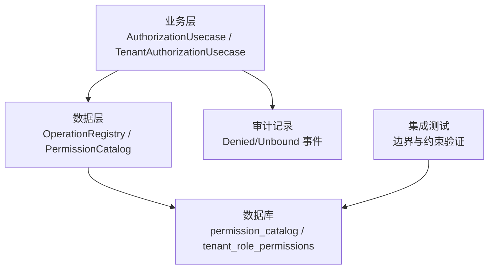
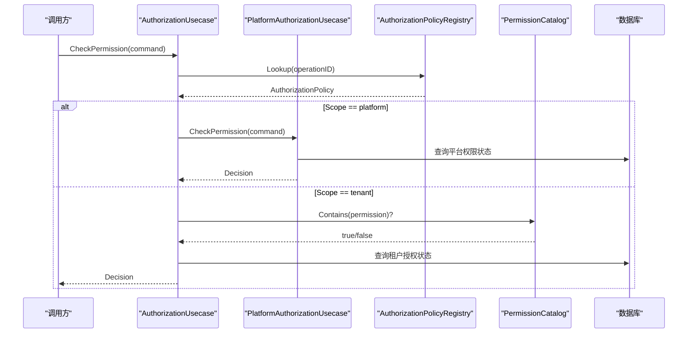
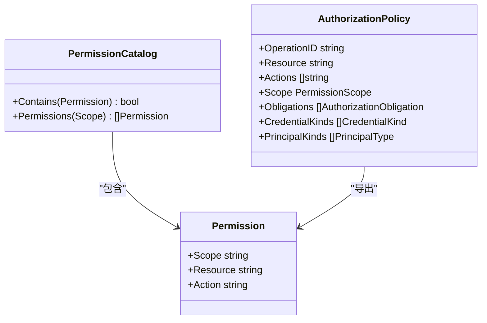
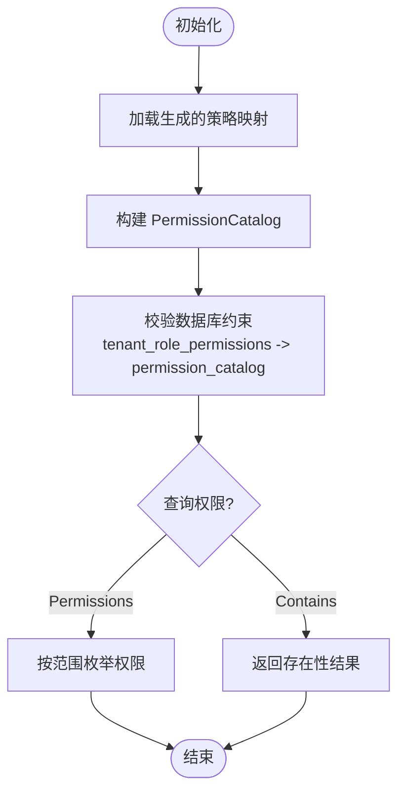
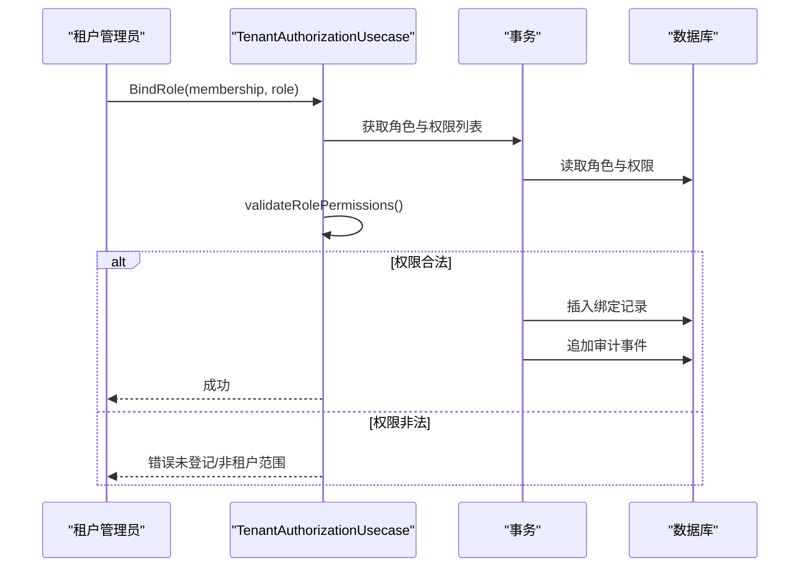
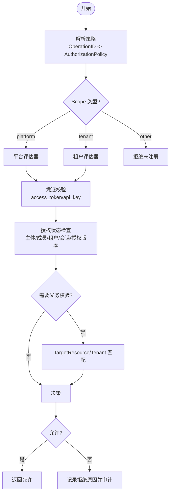
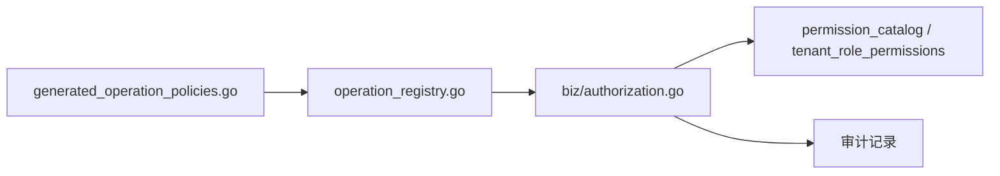
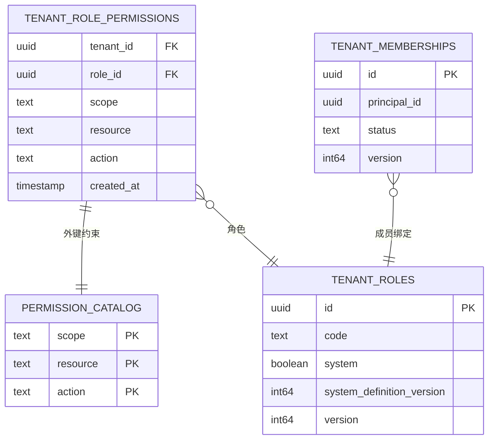

# RBAC权限模型

<cite>
**本文引用的文件**
- [internal/biz/authorization.go](file://internal/biz/authorization.go)
- [internal/biz/platform_authorization.go](file://internal/biz/platform_authorization.go)
- [internal/biz/tenant_authorization.go](file://internal/biz/tenant_authorization.go)
- [internal/data/operation_registry.go](file://internal/data/operation_registry.go)
- [internal/data/generated_operation_policies.go](file://internal/data/generated_operation_policies.go)
- [migrations/202609080002_permission_catalog.sql](file://migrations/202609080002_permission_catalog.sql)
- [tests/integration/tenant_authorization_test.go](file://tests/integration/tenant_authorization_test.go)
</cite>

## 目录
1. [简介](#简介)
2. [项目结构](#项目结构)
3. [核心组件](#核心组件)
4. [架构总览](#架构总览)
5. [详细组件分析](#详细组件分析)
6. [依赖关系分析](#依赖关系分析)
7. [性能考量](#性能考量)
8. [故障排查指南](#故障排查指南)
9. [结论](#结论)
10. [附录](#附录)

## 简介
本文件系统性阐述基于角色的访问控制（RBAC）权限模型，覆盖角色定义、权限绑定与资源访问控制的实现机制。重点说明 Permission 结构体的设计（Scope：租户级/平台级/自身级；Resource 与 Action 的组合），权限目录 PermissionCatalog 的作用与实现（注册、查询、校验流程），以及权限评估算法的工作原理（匹配规则、优先级处理、冲突解决策略）。同时提供完整的权限配置示例与最佳实践建议。

## 项目结构
该权限系统由业务层（biz）、数据层（data）、迁移脚本（migrations）与测试用例（tests）共同构成：
- biz 层定义权限模型、策略注册接口、评估流程与审计记录。
- data 层生成并维护操作策略映射、权限目录（PermissionCatalog）与运行时策略版本一致性校验。
- migrations 通过数据库约束保证“仅允许已登记权限”的强一致性与边界隔离。
- tests 验证跨租户边界、平台权限不可在租户角色中绑定等关键行为。

图表来源
- [internal/biz/authorization.go:225-328](file://internal/biz/authorization.go#L225-L328)
- [internal/data/operation_registry.go:100-137](file://internal/data/operation_registry.go#L100-L137)
- [migrations/202609080002_permission_catalog.sql:5-10](file://migrations/202609080002_permission_catalog.sql#L5-L10)

章节来源
- [internal/biz/authorization.go:225-328](file://internal/biz/authorization.go#L225-L328)
- [internal/data/operation_registry.go:100-137](file://internal/data/operation_registry.go#L100-L137)
- [migrations/202609080002_permission_catalog.sql:5-10](file://migrations/202609080002_permission_catalog.sql#L5-L10)

## 核心组件
- Permission 结构体：包含 Scope（租户/平台/自身）、Resource、Action 三元组，用于表达最小权限单元。
- PermissionCatalog 接口：提供 Contains(Permission) 与 Permissions(Scope) 能力，用于权限白名单校验与枚举。
- AuthorizationPolicy：将 OperationID 与 Resource/Actions/Scope/Obligations/CredentialKinds/PrincipalKinds 绑定，形成可执行策略。
- AuthorizationPolicyRegistry：按 OperationID 查找策略，并提供当前策略版本 Revision。
- AuthorizationUsecase：统一入口，负责凭证校验、策略路由（平台/租户/自身）、授权状态查询、拒绝原因判定与审计。
- PlatformAuthorizationUsecase：处理平台级权限评估（人类主体、平台会话、平台角色与权限）。
- TenantAuthorizationUsecase：处理租户级权限管理（成员、角色、绑定、访问控制）与权限目录校验。

章节来源
- [internal/biz/authorization.go:60-95](file://internal/biz/authorization.go#L60-L95)
- [internal/biz/authorization.go:108-145](file://internal/biz/authorization.go#L108-L145)
- [internal/biz/platform_authorization.go:55-117](file://internal/biz/platform_authorization.go#L55-L117)
- [internal/biz/tenant_authorization.go:49-59](file://internal/biz/tenant_authorization.go#L49-L59)
- [internal/data/operation_registry.go:16-39](file://internal/data/operation_registry.go#L16-L39)

## 架构总览
权限评估从请求进入开始，先根据 OperationID 查策略，再依据 Scope 分流到平台或租户评估器；随后进行凭证校验、主体/会话/授权有效性检查，最终返回允许或拒绝及原因。

图表来源
- [internal/biz/authorization.go:225-328](file://internal/biz/authorization.go#L225-L328)
- [internal/biz/platform_authorization.go:92-117](file://internal/biz/platform_authorization.go#L92-L117)
- [internal/data/operation_registry.go:100-137](file://internal/data/operation_registry.go#L100-L137)

## 详细组件分析

### Permission 设计与组合模式
- Scope：
  - tenant：租户级资源，需结合租户上下文与成员/角色权限。
  - platform：平台级资源，仅限平台管理员或平台工作负载。
  - own：自身级资源，通常限制为当前主体对自身资源的访问（如配额读取）。
- Resource/Action：细粒度资源与动作组合，例如 instances/read、secrets/create。
- 组合模式：PermissionCatalog 以 map[Permission]struct{} 存储，O(1) 判断是否存在；Permissions(scope) 支持按范围枚举。

图表来源
- [internal/biz/authorization.go:78-95](file://internal/biz/authorization.go#L78-L95)
- [internal/data/operation_registry.go:100-137](file://internal/data/operation_registry.go#L100-L137)

章节来源
- [internal/biz/authorization.go:78-95](file://internal/biz/authorization.go#L78-L95)
- [internal/data/operation_registry.go:100-137](file://internal/data/operation_registry.go#L100-L137)

### 权限目录（PermissionCatalog）的实现与作用
- 生成与注册：
  - 由 generated_operation_policies.go 提供目标策略集合，data 层构建 targetOperationRegistry 与 targetPermissionCatalog。
  - 支持 owner/target 扩展策略合并，并通过哈希校验确保策略版本一致性。
- 查询与验证：
  - Contains 用于快速判断某权限是否被接受（白名单）。
  - Permissions(scope) 用于列出某一范围内的全部可用权限，便于前端展示或管理界面。
- 数据库约束：
  - permission_catalog 表作为权威白名单，tenant_role_permissions 的外键强制只能引用已登记的权限，且租户角色仅允许 tenant 范围。

图表来源
- [internal/data/operation_registry.go:26-39](file://internal/data/operation_registry.go#L26-L39)
- [internal/data/operation_registry.go:100-137](file://internal/data/operation_registry.go#L100-L137)
- [migrations/202609080002_permission_catalog.sql:5-10](file://migrations/202609080002_permission_catalog.sql#L5-L10)

章节来源
- [internal/data/operation_registry.go:26-39](file://internal/data/operation_registry.go#L26-L39)
- [internal/data/operation_registry.go:100-137](file://internal/data/operation_registry.go#L100-L137)
- [migrations/202609080002_permission_catalog.sql:5-10](file://migrations/202609080002_permission_catalog.sql#L5-L10)

### 角色定义与权限绑定
- 角色（TenantRole）：包含 ID、Code、DisplayName、System、SystemDefinitionVersion、Permissions、Version 等元信息。
- 绑定（BindRole/UnbindRole）：在事务内完成成员与角色的关联，并记录审计事件；要求操作者具备租户管理员权限。
- 权限校验：
  - 租户角色仅能包含 tenant 范围的权限，否则报错。
  - 所有权限必须存在于 PermissionCatalog，否则视为未登记权限。
- 数据库约束：
  - tenant_role_permissions.scope 限定为 tenant，并通过外键强制引用 permission_catalog。

图表来源
- [internal/biz/tenant_authorization.go:383-439](file://internal/biz/tenant_authorization.go#L383-L439)
- [internal/biz/tenant_authorization.go:517-527](file://internal/biz/tenant_authorization.go#L517-L527)
- [migrations/202609080002_permission_catalog.sql:151-159](file://migrations/202609080002_permission_catalog.sql#L151-L159)

章节来源
- [internal/biz/tenant_authorization.go:383-439](file://internal/biz/tenant_authorization.go#L383-L439)
- [internal/biz/tenant_authorization.go:517-527](file://internal/biz/tenant_authorization.go#L517-L527)
- [migrations/202609080002_permission_catalog.sql:151-159](file://migrations/202609080002_permission_catalog.sql#L151-L159)

### 资源访问控制与评估算法
- 策略路由：
  - 若策略 Scope 为 platform，则交由 PlatformAuthorizationUsecase 处理。
  - 若 Scope 为 tenant，则走租户评估路径；其他范围直接拒绝（fail-closed）。
- 凭证校验：
  - 支持 access_token（人类主体）与 api_key（工作负载主体）。
  - 对 token 进行签名与过期校验；对 api_key 进行边界与状态校验。
- 授权状态检查：
  - 主体状态、成员状态、租户访问状态、生命周期新鲜度、会话与授权版本一致性。
  - 任一失败即返回具体拒绝原因（如 PRINCIPAL_INACTIVE、SESSION_INACTIVE、GRANT_VERSION_MISMATCH）。
- 义务（Obligations）：
  - 当策略声明 resource_tenant_match 时，要求 TargetResourceID 与 TargetTenantID 匹配，防止越权访问。

图表来源
- [internal/biz/authorization.go:225-328](file://internal/biz/authorization.go#L225-L328)
- [internal/biz/platform_authorization.go:92-117](file://internal/biz/platform_authorization.go#L92-L117)
- [internal/biz/authorization.go:491-514](file://internal/biz/authorization.go#L491-L514)

章节来源
- [internal/biz/authorization.go:225-328](file://internal/biz/authorization.go#L225-L328)
- [internal/biz/platform_authorization.go:92-117](file://internal/biz/platform_authorization.go#L92-L117)
- [internal/biz/authorization.go:491-514](file://internal/biz/authorization.go#L491-L514)

### 权限继承、组合与冲突解决
- 继承：
  - 通过成员（Membership）绑定多个角色（RoleIDs），聚合其权限集合。
  - 平台侧通过平台角色与权限集合进行聚合。
- 组合：
  - 策略中的 Actions 为数组，表示该操作允许的动作集合；PermissionCatalog 以三元组为单位进行白名单校验。
- 冲突解决：
  - 采用“默认拒绝”（fail-closed）原则：未登记权限或未满足任何条件即拒绝。
  - 数据库外键与 CHECK 约束确保租户角色仅能使用 tenant 范围且已登记的权限，避免越界与冲突。
  - 策略版本一致性校验（Revision）防止新旧策略不一致导致的误判。

章节来源
- [internal/biz/tenant_authorization.go:517-527](file://internal/biz/tenant_authorization.go#L517-L527)
- [internal/data/operation_registry.go:26-39](file://internal/data/operation_registry.go#L26-L39)
- [migrations/202609080002_permission_catalog.sql:151-159](file://migrations/202609080002_permission_catalog.sql#L151-L159)

### 权限配置示例（细粒度资源级控制）
- 租户级资源：
  - 实例：instances/read、instances/create、instances/delete、instances/execute 等。
  - 对象存储：object-store/read、object-store/create、object-store/delete 等。
  - 网络：networks/read、networks/create、networks/delete 等。
- 平台级资源：
  - IAM 管理：iam.platform-roles/read、iam.platform-memberships/create 等。
  - 容量与观测：capacity/get、observability/read 等。
- 自身级资源：
  - 配额读取：quota/read（own 范围，限制为当前主体）。

这些权限均在 permission_catalog 中登记，并通过租户角色绑定至成员，从而实现细粒度的资源级访问控制。

章节来源
- [migrations/202609080002_permission_catalog.sql:12-149](file://migrations/202609080002_permission_catalog.sql#L12-L149)
- [internal/data/generated_operation_policies.go:17-269](file://internal/data/generated_operation_policies.go#L17-L269)

## 依赖关系分析
- 策略注册与目录：
  - generated_operation_policies.go 提供基础策略映射；operation_registry.go 将其转换为运行时可用的策略与权限目录。
- 评估流程：
  - AuthorizationUsecase 依赖 AuthorizationPolicyRegistry、AccessCredentialVerifier、AuthorizationReader 与 APIKeyUsageObserver。
  - PlatformAuthorizationUsecase 依赖平台鉴权读取器与审计器。
- 数据库约束：
  - permission_catalog 作为权威白名单；tenant_role_permissions 通过外键与 CHECK 约束限制权限范围与合法性。

图表来源
- [internal/data/generated_operation_policies.go:17-269](file://internal/data/generated_operation_policies.go#L17-L269)
- [internal/data/operation_registry.go:26-39](file://internal/data/operation_registry.go#L26-L39)
- [internal/biz/authorization.go:225-328](file://internal/biz/authorization.go#L225-L328)

章节来源
- [internal/data/generated_operation_policies.go:17-269](file://internal/data/generated_operation_policies.go#L17-L269)
- [internal/data/operation_registry.go:26-39](file://internal/data/operation_registry.go#L26-L39)
- [internal/biz/authorization.go:225-328](file://internal/biz/authorization.go#L225-L328)

## 性能考量
- 策略与目录缓存：
  - 策略映射与权限目录在启动时构建并缓存，Lookup/Contains 均为 O(1) 或近似常数时间。
- 早期拒绝：
  - 策略未注册、凭证无效、范围不匹配等场景尽早返回，减少后续数据库访问。
- 批量枚举优化：
  - Permissions(scope) 返回排序后的权限列表，便于前端渲染与增量更新。
- 审计与观测：
  - 审计事件异步记录，避免阻塞主路径；API Key 使用观测仅在允许后触发。

## 故障排查指南
- 常见错误与原因：
  - 未登记权限：尝试绑定不在 permission_catalog 中的权限，数据库外键约束会拒绝。
  - 平台权限误绑：租户角色不允许绑定 platform 范围权限，CHECK 约束会拒绝。
  - 策略版本不匹配：客户端传入的 PolicyRevision 与服务端不一致，导致拒绝。
  - 凭证无效：access_token 过期或缺失必要字段；api_key 不存在或已撤销。
  - 授权状态异常：主体/成员/租户/会话/授权版本任一不满足即拒绝，并返回具体原因。
- 定位方法：
  - 查看审计事件（Denied/Unbound）中的 Reason 与 DecisionID。
  - 核对策略版本与 OperationID 是否正确。
  - 检查数据库约束与权限目录是否一致。

章节来源
- [tests/integration/tenant_authorization_test.go:91-112](file://tests/integration/tenant_authorization_test.go#L91-L112)
- [internal/biz/authorization.go:491-514](file://internal/biz/authorization.go#L491-L514)
- [internal/data/operation_registry.go:26-39](file://internal/data/operation_registry.go#L26-L39)

## 结论
本 RBAC 权限模型通过明确的 Permission 三元组、严格的权限目录白名单与数据库约束，实现了细粒度的资源级访问控制。策略路由区分平台与租户范围，评估算法遵循默认拒绝原则，确保安全性与可审计性。通过角色绑定与成员聚合，支持灵活的权限继承与组合；策略版本一致性校验避免了冲突与误判。整体设计兼顾了可扩展性、性能与可运维性。

## 附录
- 关键实体关系图（ER）：

图表来源
- [migrations/202609080002_permission_catalog.sql:5-10](file://migrations/202609080002_permission_catalog.sql#L5-L10)
- [migrations/202609080002_permission_catalog.sql:151-159](file://migrations/202609080002_permission_catalog.sql#L151-L159)