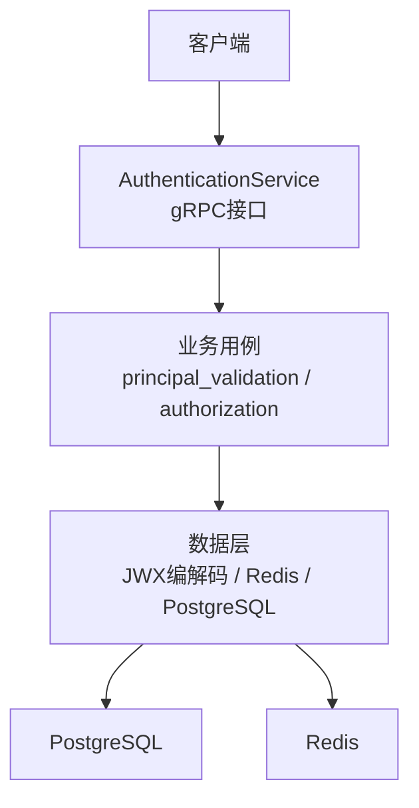
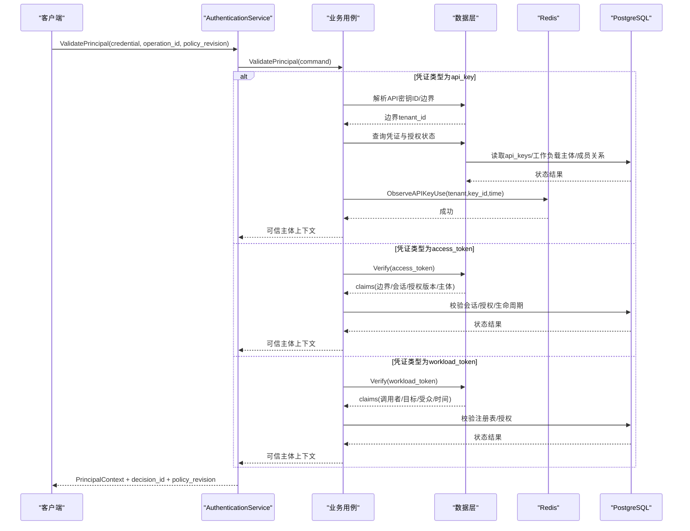
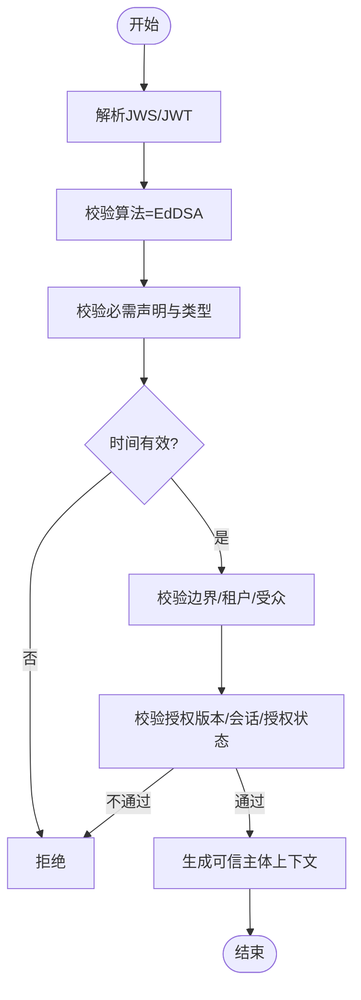
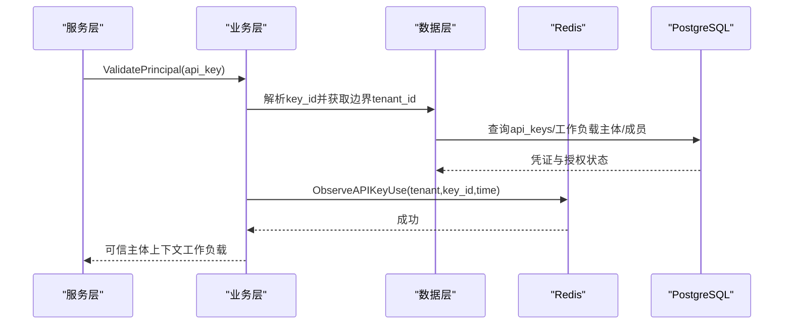
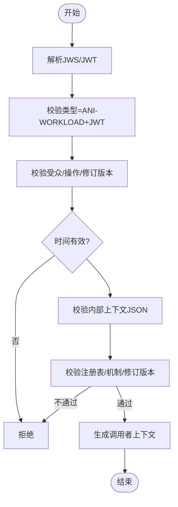
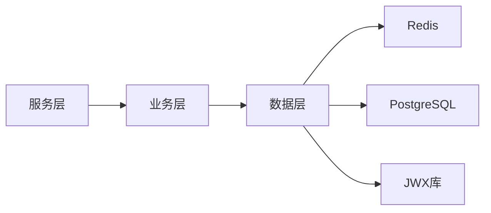

# 凭证认证

<cite>
**本文引用的文件**
- [api/iam/v1/authentication_service.proto](file://api/iam/v1/authentication_service.proto)
- [internal/service/authentication.go](file://internal/service/authentication.go)
- [internal/biz/authentication.go](file://internal/biz/authentication.go)
- [internal/biz/principal_validation.go](file://internal/biz/principal_validation.go)
- [internal/biz/authorization.go](file://internal/biz/authorization.go)
- [internal/data/access_token_jwx.go](file://internal/data/access_token_jwx.go)
- [internal/data/workload_token_jwx.go](file://internal/data/workload_token_jwx.go)
- [internal/data/api_key_usage_redis.go](file://internal/data/api_key_usage_redis.go)
- [internal/data/api_key_creation_limiter_redis.go](file://internal/data/api_key_creation_limiter_redis.go)
- [migrations/202609080003_tenant_workload_api_key.sql](file://migrations/202609080003_tenant_workload_api_key.sql)
</cite>

## 目录
1. [简介](#简介)
2. [项目结构](#项目结构)
3. [核心组件](#核心组件)
4. [架构总览](#架构总览)
5. [详细组件分析](#详细组件分析)
6. [依赖关系分析](#依赖关系分析)
7. [性能考虑](#性能考虑)
8. [故障诊断指南](#故障诊断指南)
9. [结论](#结论)
10. [附录：最佳实践与示例](#附录：最佳实践与示例)

## 简介
本文件面向凭证认证系统，系统性说明支持的三种凭证类型：访问令牌（access_token）、API密钥（api_key）和工作负载令牌（workload_token）。文档覆盖每种凭证的验证流程（格式校验、有效性检查、权限关联）、与主体的绑定关系（PrincipalType映射与权限继承）、生命周期管理（创建、更新、撤销、过期），以及API密钥的使用跟踪与监控（使用统计、频率限制、安全审计）。最后提供配置最佳实践、使用示例与故障诊断指引。

## 项目结构
凭证认证由三层组成：
- API层：定义gRPC接口与消息契约，如ValidatePrincipal、PasswordLogin、IssueWorkloadToken等。
- 业务层：实现凭证解析、鉴权策略、会话与授权状态校验、审计事件生成。
- 数据层：负责令牌编解码（JWX/JWT）、Redis限流与使用聚合、PostgreSQL持久化与约束。

图表来源
- [api/iam/v1/authentication_service.proto:11-33](file://api/iam/v1/authentication_service.proto#L11-L33)
- [internal/service/authentication.go:108-138](file://internal/service/authentication.go#L108-L138)
- [internal/biz/principal_validation.go:120-219](file://internal/biz/principal_validation.go#L120-L219)
- [internal/data/access_token_jwx.go:169-224](file://internal/data/access_token_jwx.go#L169-L224)
- [internal/data/workload_token_jwx.go:36-66](file://internal/data/workload_token_jwx.go#L36-L66)
- [internal/data/api_key_usage_redis.go:63-84](file://internal/data/api_key_usage_redis.go#L63-L84)

章节来源
- [api/iam/v1/authentication_service.proto:11-33](file://api/iam/v1/authentication_service.proto#L11-L33)
- [internal/service/authentication.go:108-138](file://internal/service/authentication.go#L108-L138)

## 核心组件
- 凭证类型与策略
  - access_token：人类主体登录后的短期访问令牌，携带边界、会话、授权版本等信息。
  - api_key：工作负载主体绑定的长期或可过期密钥，支持创建限速、使用观测与审计。
  - workload_token：工作负载间调用的短时效JWT，包含调用者身份、目标操作与有效期。
- 关键能力
  - ValidatePrincipal：统一入口，根据策略选择凭证类型进行验证并返回可信主体上下文。
  - 访问令牌验证：JWS签名校验、声明完整性、有效期、边界与授权版本一致性。
  - API密钥验证：格式解析、边界归属、活跃性、过期检查、授权状态与使用观测。
  - 工作负载令牌验证：类型与算法校验、受众匹配、注册表校验、时间窗口与上下文完整性。
- 速率限制与使用观测
  - API密钥创建限速：基于Redis滑动窗口，按租户+主体维度限制。
  - API密钥使用观测：Redis有序集合聚合，批量落库至PostgreSQL，保证幂等与顺序。

章节来源
- [internal/biz/authorization.go:60-84](file://internal/biz/authorization.go#L60-L84)
- [internal/biz/principal_validation.go:120-219](file://internal/biz/principal_validation.go#L120-L219)
- [internal/data/api_key_creation_limiter_redis.go:46-90](file://internal/data/api_key_creation_limiter_redis.go#L46-L90)
- [internal/data/api_key_usage_redis.go:21-84](file://internal/data/api_key_usage_redis.go#L21-L84)

## 架构总览
凭证认证采用“策略驱动”的统一验证路径：服务层接收请求，业务层依据策略决定允许的凭证类型与主体类型，数据层完成具体凭证的解析与校验，最终产出可信主体上下文供后续授权决策使用。

图表来源
- [internal/service/authentication.go:108-138](file://internal/service/authentication.go#L108-L138)
- [internal/biz/principal_validation.go:120-219](file://internal/biz/principal_validation.go#L120-L219)
- [internal/data/access_token_jwx.go:169-224](file://internal/data/access_token_jwx.go#L169-L224)
- [internal/data/workload_token_jwx.go:36-66](file://internal/data/workload_token_jwx.go#L36-L66)
- [internal/data/api_key_usage_redis.go:63-84](file://internal/data/api_key_usage_redis.go#L63-L84)

## 详细组件分析

### 访问令牌（access_token）
- 格式与签发
  - JWS（EdDSA）签名，JWT类型，包含必需声明：主体、受众、令牌ID、签发时间、过期时间、边界类型、会话ID、授权ID、授权版本、认证方法等。
  - 签发时由业务层构造AccessTokenClaims并调用数据层编解码器生成令牌。
- 验证流程
  - 解析JWS，校验签名算法与键ID，校验JWT类型与必需声明。
  - 校验受众、签发者、时间窗口（issued <= now < expires）。
  - 校验边界类型与租户ID（平台边界不含tenant_id）。
  - 校验授权版本与会话/授权状态，确保未撤销且版本一致。
  - 输出可信主体上下文（人类主体、边界、会话、授权信息）。
- 与主体绑定
  - PrincipalType为人类；Boundary可为租户或平台；SessionID与GrantID用于后续授权决策。
- 生命周期
  - 短期有效，随会话刷新或登出而失效；通过会话与授权版本控制撤销与轮换。

图表来源
- [internal/data/access_token_jwx.go:169-224](file://internal/data/access_token_jwx.go#L169-L224)
- [internal/biz/principal_validation.go:241-307](file://internal/biz/principal_validation.go#L241-L307)

章节来源
- [internal/data/access_token_jwx.go:169-224](file://internal/data/access_token_jwx.go#L169-L224)
- [internal/biz/principal_validation.go:241-307](file://internal/biz/principal_validation.go#L241-L307)

### API密钥（api_key）
- 格式与存储
  - 密钥以摘要形式存储，显示前缀固定为“ani_”，支持永不过期或指定过期时间。
  - 数据库约束保证唯一性、不可变性与状态一致性（active/revoked）。
- 验证流程
  - 从原始凭证解析key_id，获取其边界tenant_id。
  - 查询凭证与授权状态：必须为active且未过期。
  - 校验工作负载主体、成员关系、租户访问与生命周期状态。
  - 记录使用观测（Redis有序集合），异步批处理落库。
- 与主体绑定
  - PrincipalType为工作负载；绑定到租户工作负载主体，受成员关系与租户访问控制。
- 生命周期
  - 创建：受创建限速保护（按租户+主体维度）。
  - 更新：不可变（身份与凭据不可改），仅允许撤销。
  - 撤销：状态变为revoked后不可恢复。
  - 过期：若设置expires_at，到期即失效。

图表来源
- [internal/biz/principal_validation.go:120-219](file://internal/biz/principal_validation.go#L120-L219)
- [internal/data/api_key_usage_redis.go:63-84](file://internal/data/api_key_usage_redis.go#L63-L84)
- [migrations/202609080003_tenant_workload_api_key.sql:149-200](file://migrations/202609080003_tenant_workload_api_key.sql#L149-L200)

章节来源
- [internal/biz/principal_validation.go:120-219](file://internal/biz/principal_validation.go#L120-L219)
- [internal/data/api_key_usage_redis.go:63-84](file://internal/data/api_key_usage_redis.go#L63-L84)
- [migrations/202609080003_tenant_workload_api_key.sql:149-200](file://migrations/202609080003_tenant_workload_api_key.sql#L149-L200)

### 工作负载令牌（workload_token）
- 格式与签发
  - 自定义JWT类型（ANI-WORKLOAD+JWT），使用EdDSA签名，包含调用者身份、目标受众、操作、有效期与内部上下文。
  - 签发前校验调用者与目标注册情况、受众与修订版本。
- 验证流程
  - 解析JWS，校验算法、类型、键ID、受众、时间窗口。
  - 校验内部上下文JSON，禁止未知字段。
  - 校验调用者身份与工作负载注册表，确保机制与修订版本一致。
  - 输出可信调用者上下文，供后续授权决策。
- 与主体绑定
  - 绑定到工作负载主体，严格限制目标受众与操作，防止越权。
- 生命周期
  - 短时效（最多五分钟），不可刷新；每次调用需重新签发。

图表来源
- [internal/data/workload_token_jwx.go:36-66](file://internal/data/workload_token_jwx.go#L36-L66)
- [internal/data/workload_token_jwx.go:104-180](file://internal/data/workload_token_jwx.go#L104-L180)

章节来源
- [internal/data/workload_token_jwx.go:36-66](file://internal/data/workload_token_jwx.go#L36-L66)
- [internal/data/workload_token_jwx.go:104-180](file://internal/data/workload_token_jwx.go#L104-L180)

### 主体绑定与权限继承
- PrincipalType映射
  - access_token -> PrincipalTypeHuman（人类主体）
  - api_key -> PrincipalTypeWorkload（工作负载主体）
  - workload_token -> PrincipalTypeWorkload（工作负载主体）
- 权限继承
  - 人类主体通过会话与授权（Grant）获得租户边界内的权限。
  - 工作负载主体通过成员关系与租户访问控制获得权限；API密钥进一步绑定到具体工作负载主体。
  - 工作负载令牌严格限定目标受众与操作，结合注册表与授权版本确保最小权限。

章节来源
- [internal/biz/authorization.go:60-84](file://internal/biz/authorization.go#L60-L84)
- [internal/biz/principal_validation.go:120-219](file://internal/biz/principal_validation.go#L120-L219)
- [internal/biz/principal_validation.go:241-307](file://internal/biz/principal_validation.go#L241-L307)

### 生命周期管理
- 创建
  - API密钥创建受Redis限速保护（按租户+主体维度），避免滥用。
  - 工作负载主体创建需满足成员关系与租户访问约束。
- 更新
  - API密钥不可变（身份与凭据不可改），仅允许撤销。
  - 工作负载主体身份与所有者不可变。
- 撤销
  - API密钥状态变为revoked后不可恢复；数据库触发器强制约束。
- 过期
  - API密钥可设置expires_at；访问令牌与工作负载令牌均为短期有效。

章节来源
- [internal/data/api_key_creation_limiter_redis.go:46-90](file://internal/data/api_key_creation_limiter_redis.go#L46-L90)
- [migrations/202609080003_tenant_workload_api_key.sql:149-200](file://migrations/202609080003_tenant_workload_api_key.sql#L149-L200)
- [migrations/202609080003_tenant_workload_api_key.sql:202-232](file://migrations/202609080003_tenant_workload_api_key.sql#L202-L232)

## 依赖关系分析
- 服务层依赖业务层进行策略判断与状态校验。
- 业务层依赖数据层完成凭证解析、Redis观测与PostgreSQL查询。
- 数据层依赖外部组件：
  - Redis：用于API密钥创建限速与使用观测聚合。
  - PostgreSQL：持久化凭证、主体、成员关系与审计事件。
  - JWX库：用于JWT/JWS签名与解析。

图表来源
- [internal/service/authentication.go:108-138](file://internal/service/authentication.go#L108-L138)
- [internal/biz/principal_validation.go:120-219](file://internal/biz/principal_validation.go#L120-L219)
- [internal/data/api_key_usage_redis.go:63-84](file://internal/data/api_key_usage_redis.go#L63-L84)
- [internal/data/access_token_jwx.go:169-224](file://internal/data/access_token_jwx.go#L169-L224)

章节来源
- [internal/service/authentication.go:108-138](file://internal/service/authentication.go#L108-L138)
- [internal/biz/principal_validation.go:120-219](file://internal/biz/principal_validation.go#L120-L219)

## 性能考虑
- Redis观测与批处理
  - API密钥使用观测采用Redis有序集合，批量读取并落库，减少数据库压力。
  - 批大小可配置，平衡延迟与吞吐。
- 创建限速
  - 基于Redis原子脚本实现滑动窗口限速，避免竞争条件。
- 令牌验证
  - JWS解析与声明校验在内存中完成，开销低；数据库查询仅在必要时执行。

[本节提供一般性指导，无需特定文件分析]

## 故障诊断指南
- 常见错误与定位
  - 凭证无效：检查凭证格式、签名、类型与声明完整性。
  - 权限不足：检查主体状态、成员关系、租户访问与生命周期状态。
  - 依赖不可用：检查Redis与PostgreSQL连接状态。
  - 速率限制：检查API密钥创建限速是否达到阈值。
- 调试步骤
  - 确认operation_id与policy_revision是否正确传递。
  - 检查Redis中是否存在使用观测条目与限速键。
  - 查看PostgreSQL中api_keys与工作负载主体的状态与约束触发器。

章节来源
- [internal/service/authentication.go:476-683](file://internal/service/authentication.go#L476-L683)
- [internal/data/api_key_usage_redis.go:90-123](file://internal/data/api_key_usage_redis.go#L90-L123)
- [internal/data/api_key_creation_limiter_redis.go:59-90](file://internal/data/api_key_creation_limiter_redis.go#L59-L90)

## 结论
本凭证认证系统通过统一的ValidatePrincipal入口，支持access_token、api_key与workload_token三种凭证类型，分别对应人类与工作负载主体。系统采用策略驱动的鉴权路径，结合JWS签名、Redis限速与使用观测、PostgreSQL持久化与约束，实现了高安全、高性能与可审计的认证体系。建议在生产环境中严格配置令牌有效期、启用API密钥创建限速与使用观测，并定期审计凭证状态与权限分配。

[本节总结性内容，无需特定文件分析]

## 附录：最佳实践与示例
- 安全设置
  - 访问令牌与工作负载令牌均设置为短期有效，避免长期驻留。
  - API密钥建议使用过期时间，并定期轮换。
  - 启用创建限速与使用观测，防止滥用与便于审计。
- 轮换策略
  - 访问令牌随会话刷新自动轮换。
  - API密钥撤销旧密钥并创建新密钥，确保无缝切换。
  - 工作负载令牌每次调用重新签发。
- 错误处理
  - 对依赖不可用进行降级与重试，避免级联失败。
  - 对速率限制返回明确的Retry-After信息。
- 使用示例
  - 人类用户登录：调用PasswordLogin获取access_token与refresh_token。
  - 工作负载调用：使用workload_token调用目标操作，服务端验证调用者身份与权限。
  - API密钥访问：使用api_key作为凭证，服务端验证主体与权限并记录使用观测。

章节来源
- [api/iam/v1/authentication_service.proto:35-59](file://api/iam/v1/authentication_service.proto#L35-L59)
- [internal/biz/authentication.go:341-530](file://internal/biz/authentication.go#L341-L530)
- [internal/data/api_key_usage_redis.go:63-84](file://internal/data/api_key_usage_redis.go#L63-L84)