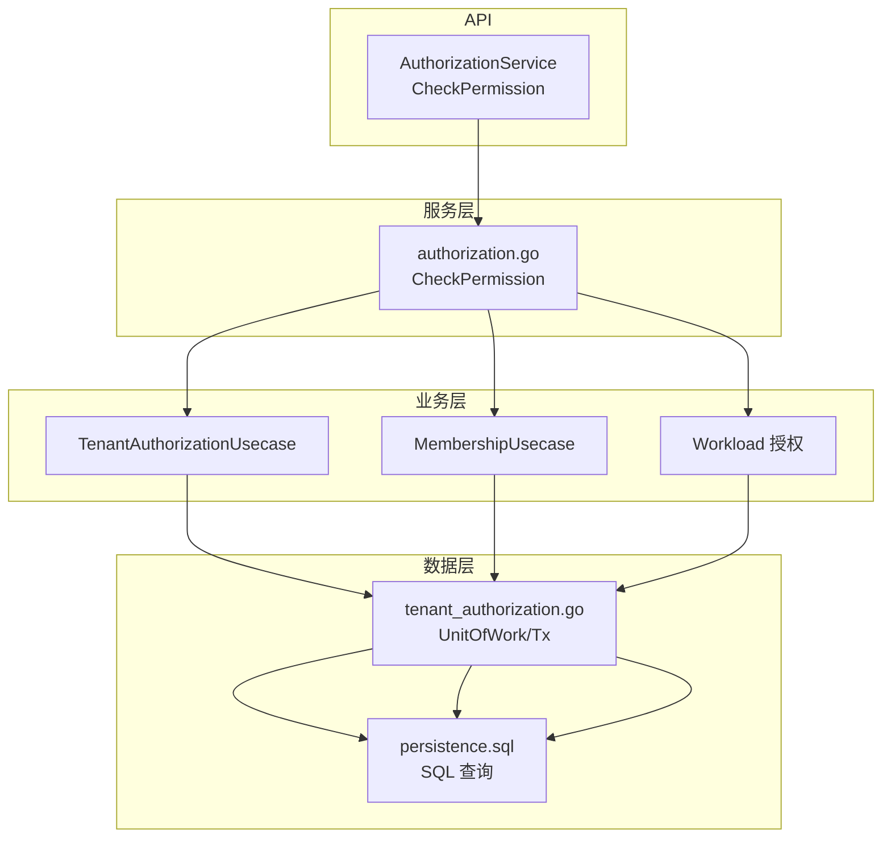
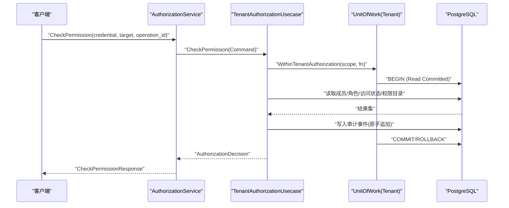
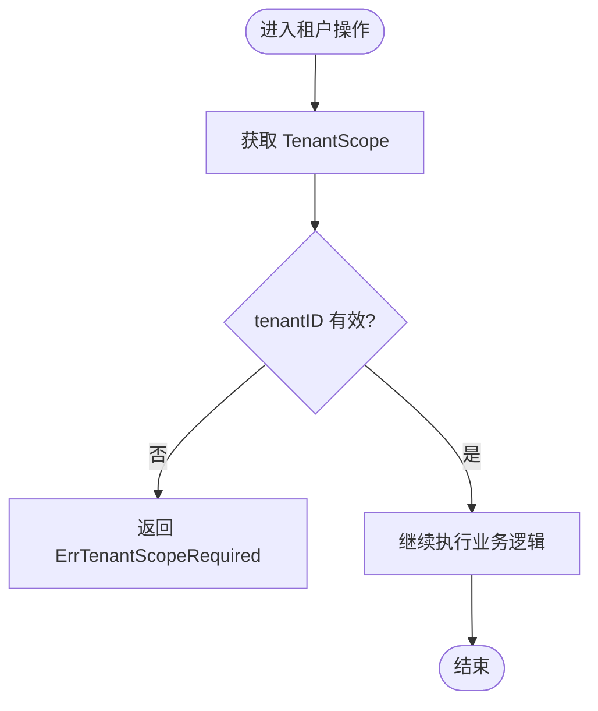
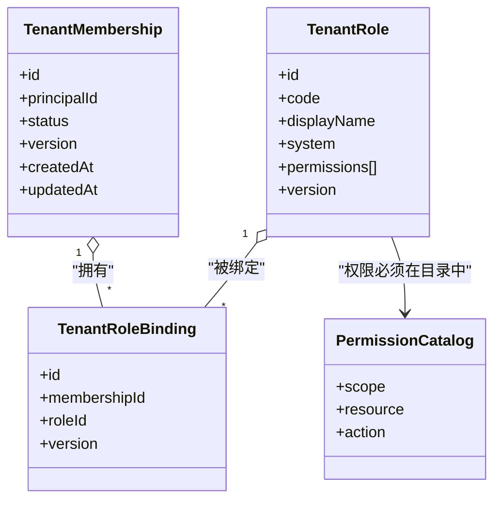
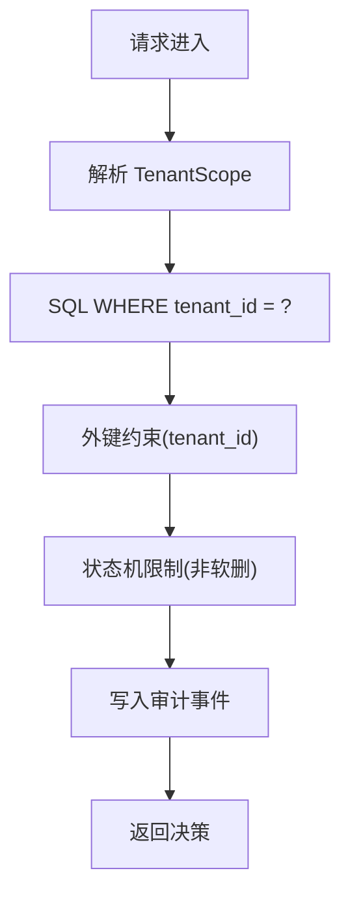
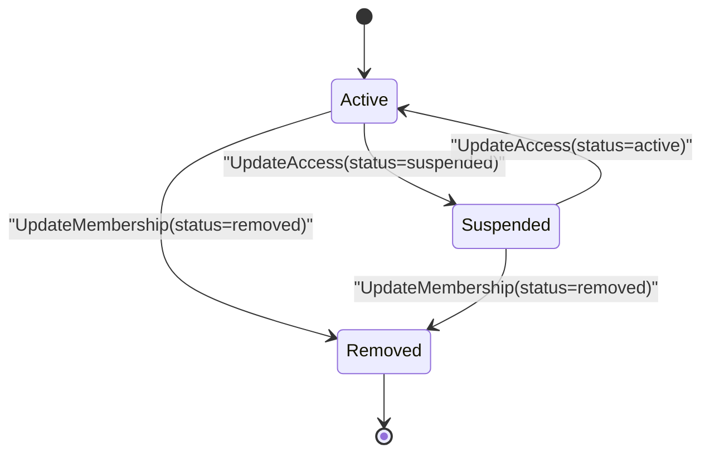
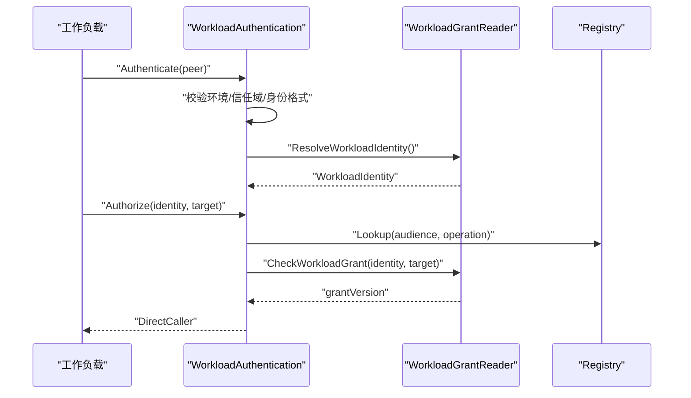
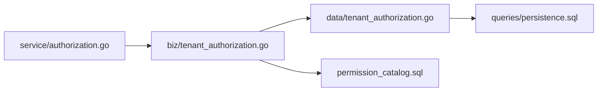

# 多租户授权

<cite>
**本文引用的文件**
- [internal/biz/tenant_scope.go](file://internal/biz/tenant_scope.go)
- [internal/biz/tenant_authorization.go](file://internal/biz/tenant_authorization.go)
- [internal/biz/membership.go](file://internal/biz/membership.go)
- [internal/biz/workload.go](file://internal/biz/workload.go)
- [internal/data/tenant_authorization.go](file://internal/data/tenant_authorization.go)
- [internal/service/authorization.go](file://internal/service/authorization.go)
- [api/iam/v1/authorization_service.proto](file://api/iam/v1/authorization_service.proto)
- [migrations/202609080001_tenant_authorization.sql](file://migrations/202609080001_tenant_authorization.sql)
- [migrations/202609080002_permission_catalog.sql](file://migrations/202609080002_permission_catalog.sql)
- [internal/data/queries/persistence.sql](file://internal/data/queries/persistence.sql)
- [docs/adr/0008-model-tenant-authorization-with-explicit-relations.md](file://docs/adr/0008-model-tenant-authorization-with-explicit-relations.md)
- [docs/adr/0017-use-explicit-iam-lifecycle-states-instead-of-generic-soft-delete.md](file://docs/adr/0017-use-explicit-iam-lifecycle-states-instead-of-generic-soft-delete.md)
</cite>

## 目录
1. [简介](#简介)
2. [项目结构](#项目结构)
3. [核心组件](#核心组件)
4. [架构总览](#架构总览)
5. [详细组件分析](#详细组件分析)
6. [依赖关系分析](#依赖关系分析)
7. [性能考虑](#性能考虑)
8. [故障排查指南](#故障排查指南)
9. [结论](#结论)
10. [附录：API与最佳实践](#附录api与最佳实践)

## 简介
本文件面向多租户授权系统的实现与使用，聚焦以下目标：
- 解释租户隔离机制与 TenantScope 的设计与作用域管理。
- 阐述租户级权限模型：成员管理、角色分配与权限继承。
- 说明跨租户访问控制策略：边界检查、数据隔离与安全边界。
- 描述租户生命周期状态对授权的影响（活跃、暂停、删除等）。
- 提供配置最佳实践：权限模板、批量授权与权限审计。
- 给出性能优化策略：缓存、索引与查询优化。
- 包含完整的 API 使用示例与故障排查指南。

## 项目结构
系统采用分层设计：
- API 层：gRPC AuthorizationService 暴露统一的鉴权入口 CheckPermission 等。
- 服务层：将请求转换为领域命令并调用用例。
- 业务层：TenantAuthorizationUsecase 编排成员、角色、访问状态变更；MembershipUsecase 负责成员创建；Workload 相关用于工作负载身份与授权。
- 数据层：Postgres 事务单元 with tenant scope，SQL 通过 sqlc 生成，持久化成员、角色、绑定、审计事件等。
- 迁移与契约：权限目录表 permission_catalog 约束可授予的权限集合；迁移脚本维护数据库结构与最小权限。

**图表来源**
- [internal/service/authorization.go:27-67](file://internal/service/authorization.go#L27-L67)
- [internal/biz/tenant_authorization.go:194-215](file://internal/biz/tenant_authorization.go#L194-L215)
- [internal/data/tenant_authorization.go:141-172](file://internal/data/tenant_authorization.go#L141-L172)
- [internal/data/queries/persistence.sql:1-200](file://internal/data/queries/persistence.sql#L1-L200)

**章节来源**
- [api/iam/v1/authorization_service.proto:10-16](file://api/iam/v1/authorization_service.proto#L10-L16)
- [internal/service/authorization.go:27-67](file://internal/service/authorization.go#L27-L67)
- [internal/biz/tenant_authorization.go:194-215](file://internal/biz/tenant_authorization.go#L194-L215)
- [internal/data/tenant_authorization.go:141-172](file://internal/data/tenant_authorization.go#L141-L172)
- [internal/data/queries/persistence.sql:1-200](file://internal/data/queries/persistence.sql#L1-L200)

## 核心组件
- TenantScope：不可提升的租户边界对象，所有普通租户拥有的仓储操作必须携带该作用域，防止跨租户越权。
- TenantAuthorizationUsecase：编排租户访问状态、成员、角色绑定、审计等关键流程，保证幂等与一致性。
- MembershipUsecase：创建成员并在同一事务中写入安全审计事件。
- Workload 授权：校验工作负载身份与授予，产出 DirectCaller 供后续鉴权使用。
- 数据层 UnitOfWork：以 Read Committed 事务封装租户范围的操作，提供行级锁与乐观版本冲突检测。

**章节来源**
- [internal/biz/tenant_scope.go:16-38](file://internal/biz/tenant_scope.go#L16-L38)
- [internal/biz/tenant_authorization.go:194-215](file://internal/biz/tenant_authorization.go#L194-L215)
- [internal/biz/membership.go:155-163](file://internal/biz/membership.go#L155-L163)
- [internal/biz/workload.go:74-106](file://internal/biz/workload.go#L74-L106)
- [internal/data/tenant_authorization.go:141-172](file://internal/data/tenant_authorization.go#L141-L172)

## 架构总览
下图展示从 gRPC 到数据库的事务边界与租户隔离路径：

**图表来源**
- [internal/service/authorization.go:27-67](file://internal/service/authorization.go#L27-L67)
- [internal/biz/tenant_authorization.go:250-299](file://internal/biz/tenant_authorization.go#L250-L299)
- [internal/data/tenant_authorization.go:141-172](file://internal/data/tenant_authorization.go#L141-L172)

## 详细组件分析

### 租户隔离与作用域：TenantScope
- 设计要点：
  - 每个租户操作必须显式传入 TenantScope，其内部 tenantID 为私有字段，只能通过 NewTenantScope 构造，避免伪造或遗漏。
  - 任何仓储方法若需要访问租户数据，必须首先解析 TenantScope 中的 tenantID，确保跨租户隔离。
- 错误处理：
  - 缺少或非法作用域返回 ErrTenantScopeRequired，阻止无界访问。

**图表来源**
- [internal/biz/tenant_scope.go:16-38](file://internal/biz/tenant_scope.go#L16-L38)

**章节来源**
- [internal/biz/tenant_scope.go:16-38](file://internal/biz/tenant_scope.go#L16-L38)

### 租户级权限模型：成员、角色与权限继承
- 成员管理：
  - 成员状态包括 active、suspended、removed；移除成员时若为工作负载类型，会禁用对应的工作负载关联。
  - 成员创建在同一事务中追加审计事件，保证一致性。
- 角色与绑定：
  - 角色属于租户，内置角色具有稳定 code 且受保护；自定义角色也存储在租户表中。
  - 角色绑定通过 tenant_role_bindings 将成员与角色关联，外键包含 tenant_id，跨租户绑定被数据库约束拒绝。
  - 绑定/解绑需具备租户管理员权限，并通过管理守卫锁防止并发篡改。
- 权限目录：
  - permission_catalog 定义允许授予的权限集合；角色只能包含目录中存在的权限，且租户角色的权限范围限定为 tenant。
- 权限继承：
  - 一个成员可绑定多个角色，权限为所绑定角色权限的并集；权限评估基于当前成员的活跃绑定。

**图表来源**
- [internal/biz/tenant_authorization.go:42-99](file://internal/biz/tenant_authorization.go#L42-L99)
- [internal/data/tenant_authorization.go:277-305](file://internal/data/tenant_authorization.go#L277-L305)
- [migrations/202609080002_permission_catalog.sql:5-159](file://migrations/202609080002_permission_catalog.sql#L5-L159)

**章节来源**
- [internal/biz/membership.go:31-85](file://internal/biz/membership.go#L31-L85)
- [internal/biz/tenant_authorization.go:383-492](file://internal/biz/tenant_authorization.go#L383-L492)
- [migrations/202609080002_permission_catalog.sql:5-159](file://migrations/202609080002_permission_catalog.sql#L5-L159)
- [docs/adr/0008-model-tenant-authorization-with-explicit-relations.md:9-19](file://docs/adr/0008-model-tenant-authorization-with-explicit-relations.md#L9-L19)

### 跨租户访问控制：边界检查、数据隔离与安全边界
- 边界检查：
  - 所有读写操作均通过 TenantScope 限定租户上下文；数据层查询均以 tenant_id 过滤。
  - 角色绑定与成员关系的外键包含 tenant_id，数据库层面拒绝跨租户关联。
- 数据隔离：
  - 租户表均含非空 tenant_id；平台实体使用独立表，不混用 NULL 或特殊标识。
- 安全边界：
  - 不使用通用软删除，而是明确的状态机（disabled、revoked、expired、cancelled、removed），避免隐式恢复路径。
  - 审计事件追加在事务内，保证安全变更的可追溯性。

**图表来源**
- [internal/data/tenant_authorization.go:27-84](file://internal/data/tenant_authorization.go#L27-L84)
- [migrations/202609080002_permission_catalog.sql:151-159](file://migrations/202609080002_permission_catalog.sql#L151-L159)
- [docs/adr/0017-use-explicit-iam-lifecycle-states-instead-of-generic-soft-delete.md:15-23](file://docs/adr/0017-use-explicit-iam-lifecycle-states-instead-of-generic-soft-delete.md#L15-L23)

**章节来源**
- [internal/data/tenant_authorization.go:27-84](file://internal/data/tenant_authorization.go#L27-L84)
- [migrations/202609080002_permission_catalog.sql:151-159](file://migrations/202609080002_permission_catalog.sql#L151-L159)
- [docs/adr/0017-use-explicit-iam-lifecycle-states-instead-of-generic-soft-delete.md:15-23](file://docs/adr/0017-use-explicit-iam-lifecycle-states-instead-of-generic-soft-delete.md#L15-L23)

### 租户生命周期状态对授权的影响
- 租户访问状态：
  - 支持 active 与 suspended；更新时需版本控制与审计记录。
- 成员状态：
  - active/suspended/removed；移除成员时若为工作负载，则禁用其工作负载并记录审计。
- 管理员保护：
  - 禁止移除最后一个活跃的人类租户管理员，防止锁定风险。
- 工作负载：
  - 工作负载主体会随成员状态变化而启用/禁用，影响凭据有效性。

**图表来源**
- [internal/biz/tenant_authorization.go:250-299](file://internal/biz/tenant_authorization.go#L250-L299)
- [internal/biz/tenant_authorization.go:301-381](file://internal/biz/tenant_authorization.go#L301-L381)
- [internal/biz/tenant_authorization.go:501-515](file://internal/biz/tenant_authorization.go#L501-L515)

**章节来源**
- [internal/biz/tenant_authorization.go:250-299](file://internal/biz/tenant_authorization.go#L250-L299)
- [internal/biz/tenant_authorization.go:301-381](file://internal/biz/tenant_authorization.go#L301-L381)
- [internal/biz/tenant_authorization.go:501-515](file://internal/biz/tenant_authorization.go#L501-L515)

### 工作负载身份与授权
- 工作负载身份验证：
  - 基于证书链与信任域解析出 WorkloadIdentity，包含 principalId、bindingId 及版本。
- 授权检查：
  - 根据注册表与工作负载授予检查，产出 DirectCaller，供后续鉴权使用。
- 与租户的关系：
  - 工作负载主体属于租户，其权限来自成员的活跃角色绑定。

**图表来源**
- [internal/biz/workload.go:62-106](file://internal/biz/workload.go#L62-L106)

**章节来源**
- [internal/biz/workload.go:62-106](file://internal/biz/workload.go#L62-L106)

## 依赖关系分析
- 服务层依赖业务用例接口，业务用例依赖 UnitOfWork 与权限目录。
- 数据层通过 sqlc 生成的查询与 Postgres 事务协作，提供行级锁与乐观版本冲突检测。
- 迁移脚本提供最小权限与权限目录，确保运行时仅能操作允许的权限集合。

**图表来源**
- [internal/service/authorization.go:27-67](file://internal/service/authorization.go#L27-L67)
- [internal/biz/tenant_authorization.go:194-215](file://internal/biz/tenant_authorization.go#L194-L215)
- [internal/data/tenant_authorization.go:141-172](file://internal/data/tenant_authorization.go#L141-L172)
- [migrations/202609080002_permission_catalog.sql:5-159](file://migrations/202609080002_permission_catalog.sql#L5-L159)

**章节来源**
- [internal/service/authorization.go:27-67](file://internal/service/authorization.go#L27-L67)
- [internal/biz/tenant_authorization.go:194-215](file://internal/biz/tenant_authorization.go#L194-L215)
- [internal/data/tenant_authorization.go:141-172](file://internal/data/tenant_authorization.go#L141-L172)
- [migrations/202609080002_permission_catalog.sql:5-159](file://migrations/202609080002_permission_catalog.sql#L5-L159)

## 性能考虑
- 事务与锁：
  - 使用 Read Committed 事务，配合行级锁与乐观版本冲突检测，减少锁竞争。
- 索引设计：
  - 租户相关查询以 tenant_id 作为前缀列；成员列表、角色列表使用游标分页，避免全表扫描。
- 查询优化：
  - 列表操作限制 page_limit，结合 NextCursor 实现高效分页。
  - 权限目录表提供快速校验，避免动态策略带来的开销。
- 审计与监控：
  - 审计事件追加在事务内，保持强一致；监控累积表大小与增长速率，设置告警。

[本节为通用指导，无需具体文件引用]

## 故障排查指南
- 常见错误与定位：
  - 缺少租户作用域：ErrTenantScopeRequired，检查是否在每个租户操作中传递了有效的 TenantScope。
  - 版本冲突：ErrVersionConflict，检查并发更新时的 expectedVersion 是否正确。
  - 成员不存在：ErrMembershipNotFound，确认成员 ID 与租户匹配。
  - 角色不存在或绑定冲突：ErrRoleNotFound / ErrRoleBindingConflict，检查角色是否存在以及是否已绑定。
  - 权限未登记：ErrPermissionUncatalogued，确认权限是否在 permission_catalog 中。
  - 最后管理员保护：ErrLastTenantAdministrator，确保至少保留一个活跃人类管理员。
- 调试建议：
  - 查看审计事件，确认变更操作与决策 ID。
  - 检查数据库约束与索引覆盖，确保查询走预期路径。
  - 核对权限目录与角色权限，确保只授予允许的权限。

**章节来源**
- [internal/biz/tenant_scope.go:9-14](file://internal/biz/tenant_scope.go#L9-L14)
- [internal/biz/tenant_authorization.go:13-24](file://internal/biz/tenant_authorization.go#L13-L24)
- [internal/biz/tenant_authorization.go:517-527](file://internal/biz/tenant_authorization.go#L517-L527)
- [internal/biz/tenant_authorization.go:501-515](file://internal/biz/tenant_authorization.go#L501-L515)

## 结论
本系统通过 TenantScope 强制租户边界，结合显式的成员、角色与权限目录，实现了严格的多租户授权模型。事务与行级锁保障一致性，审计事件确保可追溯。通过明确的狀態机而非软删除，避免了隐式恢复路径。整体设计兼顾安全性、可维护性与可扩展性。

[本节为总结，无需具体文件引用]

## 附录：API与最佳实践

### API 使用示例
- 权限检查：
  - 调用 AuthorizationService.CheckPermission，传入 BearerCredential、operation_id、policy_revision 与 AuthorizationTarget（包含 tenant_id、resource_id）。
  - 响应中包含 AuthorizationDecision，指示 allowed、reason、decision_id、principal 与 obligations。
- 典型流程：
  - 客户端准备凭据与目标资源。
  - 服务端解析租户边界并执行权限评估。
  - 返回决策，客户端据此决定是否继续操作。

**章节来源**
- [api/iam/v1/authorization_service.proto:10-39](file://api/iam/v1/authorization_service.proto#L10-L39)
- [internal/service/authorization.go:27-67](file://internal/service/authorization.go#L27-L67)

### 配置最佳实践
- 权限模板：
  - 使用 permission_catalog 预定义可授予权限；角色仅包含目录中的权限，避免越权。
- 批量授权：
  - 通过成员列表与角色列表进行游标分页，结合幂等键批量绑定/解绑角色。
- 权限审计：
  - 每次变更都追加审计事件，包含 actor、authentication_method、target、result 等，便于追踪与合规。

**章节来源**
- [migrations/202609080002_permission_catalog.sql:5-159](file://migrations/202609080002_permission_catalog.sql#L5-L159)
- [internal/biz/tenant_authorization.go:250-299](file://internal/biz/tenant_authorization.go#L250-L299)
- [internal/biz/membership.go:165-240](file://internal/biz/membership.go#L165-L240)

### 性能优化策略
- 缓存机制：
  - 可在服务层缓存角色与权限目录的只读视图，降低重复查询；注意失效策略与一致性。
- 索引设计：
  - 以 tenant_id 为首列建立索引；成员、角色、绑定表按常用查询条件建立复合索引。
- 查询优化：
  - 使用游标分页与 LIMIT 控制返回量；避免 SELECT *，仅选择必要字段。

[本节为通用指导，无需具体文件引用]