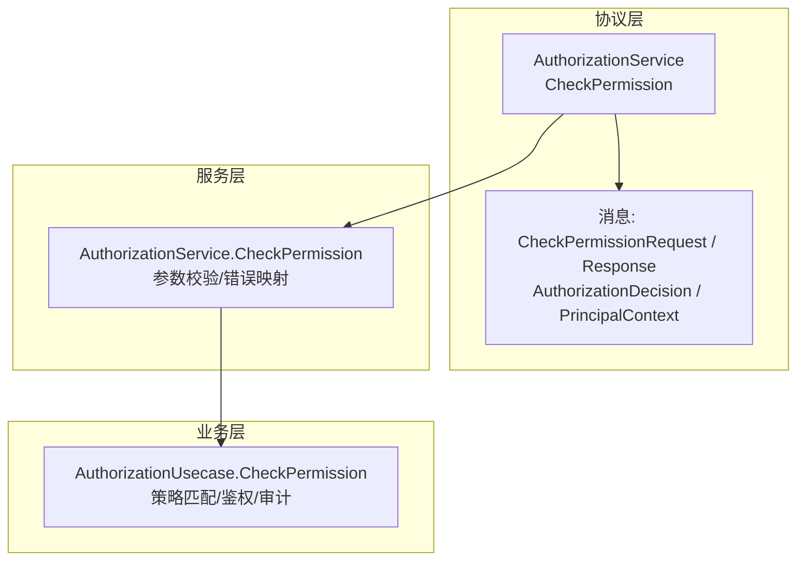
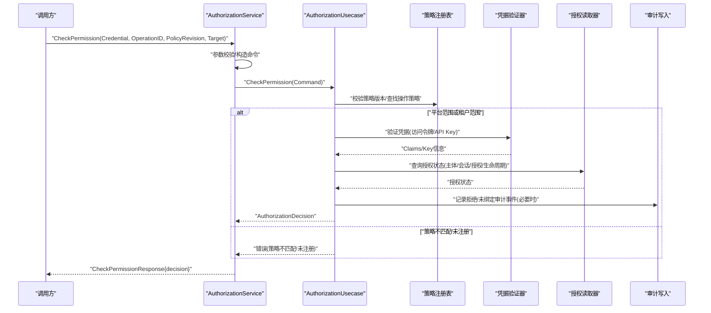
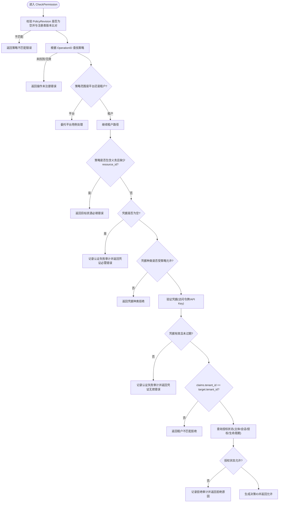
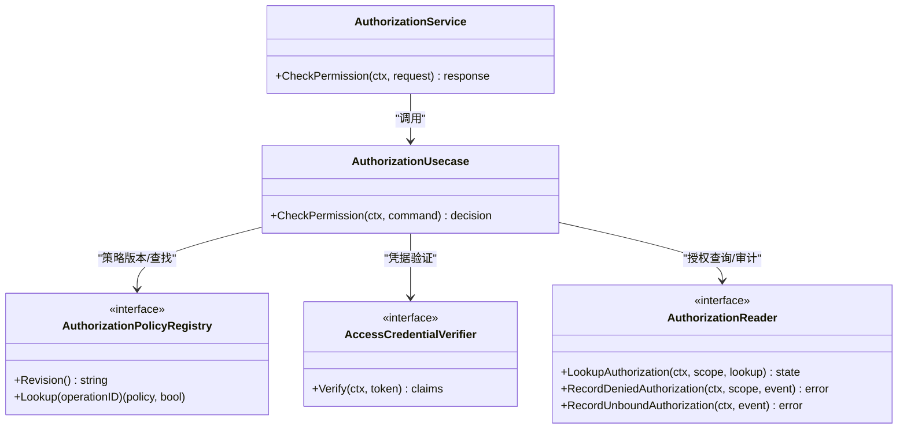

# 授权API接口

<cite>
**本文引用的文件**
- [authorization_service.proto](file://api/iam/v1/authorization_service.proto)
- [contract.proto](file://api/iam/v1/contract.proto)
- [authorization.go](file://internal/service/authorization.go)
- [authorization.go](file://internal/biz/authorization.go)
- [authentication.go](file://internal/service/authentication.go)
- [iam_check_permission.v1.json](file://tests/contracts/fixtures/iam_check_permission.v1.json)
- [iam_error_contract.v1.json](file://tests/contracts/fixtures/iam_error_contract.v1.json)
- [main.go](file://examples/workload-grpc/main.go)
</cite>

## 目录
1. [简介](#简介)
2. [项目结构](#项目结构)
3. [核心组件](#核心组件)
4. [架构总览](#架构总览)
5. [详细组件分析](#详细组件分析)
6. [依赖关系分析](#依赖关系分析)
7. [性能考量](#性能考量)
8. [故障排查指南](#故障排查指南)
9. [结论](#结论)
10. [附录](#附录)

## 简介
本参考文档面向调用方与集成者，系统化说明授权系统提供的 CheckPermission 接口。内容涵盖：
- 请求参数、响应结构与错误码规范
- CheckPermissionCommand 内部命令结构（RawCredential、OperationID、PolicyRevision、TargetTenantID 等）的语义与使用要求
- AuthorizationDecision 响应字段（Allowed、Reason、DecisionID、Principal 等）的含义
- 权限检查的错误处理机制与 gRPC 状态码映射
- 完整的 API 调用示例（成功与失败场景）
- API 版本管理与向后兼容性策略
- API 测试工具与调试方法

## 项目结构
授权能力由三层组成：
- 协议层：gRPC 服务定义与消息类型（proto）
- 服务层：将传输层请求转换为领域命令并映射错误
- 业务层：执行权限判定、审计记录与决策生成

图表来源
- [authorization_service.proto:10-39](file://api/iam/v1/authorization_service.proto#L10-L39)
- [authorization.go:27-67](file://internal/service/authorization.go#L27-L67)
- [authorization.go:225-329](file://internal/biz/authorization.go#L225-L329)

章节来源
- [authorization_service.proto:10-39](file://api/iam/v1/authorization_service.proto#L10-L39)
- [authorization.go:27-67](file://internal/service/authorization.go#L27-L67)
- [authorization.go:225-329](file://internal/biz/authorization.go#L225-L329)

## 核心组件
- AuthorizationService（gRPC 服务）：暴露 CheckPermission RPC，负责参数校验、上下文构建、错误映射与响应组装。
- AuthorizationUsecase（业务用例）：实现权限检查主流程，包括策略注册表校验、凭据验证、租户边界与授权状态查询、审计记录与决策生成。
- 协议消息：
  - CheckPermissionRequest：携带原始凭据、操作标识、策略版本与目标资源信息
  - AuthorizationDecision：返回是否允许、原因、决策ID、主体上下文、附加义务与策略版本
  - PrincipalContext：最小可信主体上下文（主体ID、类型、状态、边界、会话/授权ID、认证方式）

章节来源
- [authorization_service.proto:18-39](file://api/iam/v1/authorization_service.proto#L18-L39)
- [contract.proto:145-198](file://api/iam/v1/contract.proto#L145-L198)
- [authorization.go:27-78](file://internal/service/authorization.go#L27-L78)
- [authorization.go:180-197](file://internal/biz/authorization.go#L180-L197)

## 架构总览
CheckPermission 的典型调用序列如下：

图表来源
- [authorization_service.proto:10-39](file://api/iam/v1/authorization_service.proto#L10-L39)
- [authorization.go:27-67](file://internal/service/authorization.go#L27-L67)
- [authorization.go:225-329](file://internal/biz/authorization.go#L225-L329)

## 详细组件分析

### CheckPermission 接口定义与用法
- 服务与方法
  - 服务：AuthorizationService
  - 方法：CheckPermission
- 请求体 CheckPermissionRequest
  - credential: BearerCredential（原始凭据值，不应日志化或持久化明文）
  - operation_id: 已注册的操作标识
  - policy_revision: 当前客户端使用的策略版本哈希
  - target: AuthorizationTarget（tenant_id、resource_id、attributes）
- 响应体 CheckPermissionResponse
  - decision: AuthorizationDecision

章节来源
- [authorization_service.proto:10-39](file://api/iam/v1/authorization_service.proto#L10-L39)
- [contract.proto:145-198](file://api/iam/v1/contract.proto#L145-L198)

### CheckPermissionCommand 结构说明
该命令在服务层被构造并传递给业务层，用于承载一次权限检查所需的全部输入：
- RawCredential: 原始凭据字符串（Bearer Token 或 API Key），服务层会识别凭据种类（bearer/api_key）
- OperationID: 要检查的操作标识，必须在策略注册表中存在且有效
- PolicyRevision: 策略版本哈希，必须与服务端当前策略版本一致，否则返回策略不匹配错误
- TargetTenantID: 目标租户ID（来自 target.tenant_id），用于构建租户作用域
- TargetResourceID: 目标资源ID（来自 target.resource_id），当策略包含义务时必填
- RequestID/CorrelationID: 用于审计追踪的请求与关联ID

章节来源
- [authorization.go:27-67](file://internal/service/authorization.go#L27-L67)
- [authorization.go:189-197](file://internal/biz/authorization.go#L189-L197)

### AuthorizationDecision 响应结构
- allowed: 布尔值，表示是否允许
- reason: 原因枚举（如 ALLOWED、PERMISSION_DENIED、PRINCIPAL_INACTIVE 等）
- decision_id: 本次决策的唯一标识（UUID v7）
- principal: PrincipalContext，最小可信主体上下文
  - principal_id、principal_type、principal_status
  - boundary: TenantBoundary 或 PlatformBoundary
  - session_id、grant_id
  - authn_methods: 认证方式列表（password/oidc/api_key/workload_token）
- obligations: 附加义务列表（例如资源归属租户一致性校验），由拥有处理器在后续步骤中完成
- policy_revision: 本次决策使用的策略版本

章节来源
- [authorization_service.proto:26-39](file://api/iam/v1/authorization_service.proto#L26-L39)
- [contract.proto:145-198](file://api/iam/v1/contract.proto#L145-L198)
- [authorization.go:69-78](file://internal/service/authorization.go#L69-L78)
- [authorization.go:180-187](file://internal/biz/authorization.go#L180-L187)

### 权限检查主流程与关键分支

图表来源
- [authorization.go:225-329](file://internal/biz/authorization.go#L225-L329)
- [authorization.go:331-420](file://internal/biz/authorization.go#L331-L420)
- [authorization.go:491-514](file://internal/biz/authorization.go#L491-L514)

章节来源
- [authorization.go:225-329](file://internal/biz/authorization.go#L225-L329)
- [authorization.go:331-420](file://internal/biz/authorization.go#L331-L420)
- [authorization.go:491-514](file://internal/biz/authorization.go#L491-L514)

### 错误处理机制与状态码映射
所有稳定失败通过 google.rpc.ErrorInfo 携带稳定 reason，并映射到 gRPC 状态码。常见映射如下：
- INVALID_ARGUMENT -> codes.InvalidArgument（字段级校验失败）
- NOT_FOUND -> codes.NotFound（IAM 资源不存在）
- CREDENTIAL_INVALID -> codes.Unauthenticated（凭据无效）
- PERMISSION_DENIED -> codes.PermissionDenied（权限拒绝）
- AUTH_RATE_LIMITED -> codes.ResourceExhausted（限流）
- AUTHZ_OPERATION_UNREGISTERED -> codes.Unavailable（操作未注册）
- AUTHZ_POLICY_MISMATCH -> codes.Unavailable（策略版本不匹配）
- IAM_UNAVAILABLE -> codes.Unavailable（依赖不可用）
- IAM_TIMEOUT -> codes.DeadlineExceeded（超时）
- TENANT_IAM_NOT_READY -> codes.Unavailable（租户IAM未就绪）
- TENANT_LIFECYCLE_STALE -> codes.Unavailable（生命周期投影陈旧）
- IDEMPOTENCY_CONFLICT -> codes.AlreadyExists（幂等冲突）
- IDEMPOTENCY_KEY_EXPIRED -> codes.FailedPrecondition（幂等键过期）
- ROLE_IN_USE -> codes.FailedPrecondition（角色使用中）
- VERSION_CONFLICT -> codes.Aborted（版本冲突）
- SESSION_REVOKED -> codes.Unauthenticated（会话撤销）
- GRANT_VERSION_MISMATCH -> codes.Unauthenticated（授权版本不匹配）
- BOOTSTRAP_FINGERPRINT_CONFLICT -> codes.AlreadyExists（引导指纹冲突）
- SCHEMA_MAJOR_UNSUPPORTED -> codes.FailedPrecondition（不支持的主版本）

错误详情中包含 domain 为 iam.ani.internal，以及必要的 metadata（如 operation_id、policy_revision、tenant_id、dependency、field 等）。

章节来源
- [iam_error_contract.v1.json:1-27](file://tests/contracts/fixtures/iam_error_contract.v1.json#L1-L27)
- [authentication.go:748-759](file://internal/service/authentication.go#L748-L759)
- [authorization.go:27-67](file://internal/service/authorization.go#L27-L67)

### API 版本管理与向后兼容
- 协议包采用固定主版本 iam.v1，作为“不可变主版本契约”，避免破坏性变更
- 策略版本通过 policy_revision 进行强校验：客户端必须传递与服务端一致的策略版本哈希，否则返回策略不匹配错误
- 错误原因枚举与 ErrorInfo 结构保持稳定，便于客户端按 reason 做兼容处理
- 新增字段需保持可选，旧客户端可忽略；删除字段需保留占位或提供迁移期兼容

章节来源
- [contract.proto:1-12](file://api/iam/v1/contract.proto#L1-L12)
- [authorization.go:225-234](file://internal/biz/authorization.go#L225-L234)
- [iam_error_contract.v1.json:1-27](file://tests/contracts/fixtures/iam_error_contract.v1.json#L1-L27)

### API 调用示例
以下为典型请求与响应的结构示意（以 JSON 形式展示字段含义，实际传输为 gRPC Protobuf）：

- 成功场景
  - 请求字段
    - credential.value: 访问令牌或 API Key
    - operation_id: 已注册操作标识
    - policy_revision: 服务端当前策略版本哈希
    - target.tenant_id: 目标租户ID
    - target.resource_id: 目标资源ID（策略含义务时必填）
    - target.attributes: 可选属性（如 request_method）
  - 响应字段
    - decision.allowed: true
    - decision.reason: "ALLOWED"
    - decision.decision_id: UUID v7
    - decision.principal.*: 主体上下文
    - decision.obligations: 可能为空或包含资源归属校验义务
    - decision.policy_revision: 与请求一致

- 失败场景（示例）
  - 策略版本不匹配
    - 响应 gRPC 状态码: Unavailable
    - reason: AUTHZ_POLICY_MISMATCH
    - metadata: expected_policy_revision, actual_policy_revision
  - 操作未注册
    - 响应 gRPC 状态码: Unavailable
    - reason: AUTHZ_OPERATION_UNREGISTERED
    - metadata: operation_id, policy_revision
  - 凭据无效
    - 响应 gRPC 状态码: Unauthenticated
    - reason: CREDENTIAL_INVALID
    - metadata: credential_kind
  - 权限拒绝
    - 响应 gRPC 状态码: PermissionDenied
    - reason: PERMISSION_DENIED
    - metadata: operation_id, decision_id

章节来源
- [iam_check_permission.v1.json:1-15](file://tests/contracts/fixtures/iam_check_permission.v1.json#L1-L15)
- [iam_error_contract.v1.json:1-27](file://tests/contracts/fixtures/iam_error_contract.v1.json#L1-L27)
- [authorization.go:27-67](file://internal/service/authorization.go#L27-L67)

### 测试工具与调试方法
- 合同测试夹具
  - 使用 tests/contracts/fixtures/iam_check_permission.v1.json 作为请求样例，确保字段完整与格式正确
  - 使用 tests/contracts/fixtures/iam_error_contract.v1.json 校验错误响应中的 reason 与 required_metadata
- 工作负载示例
  - examples/workload-grpc/main.go 展示了如何配置 IAM 客户端、加载策略注册表、发起授权检查并调用下游服务
  - 可通过本地配置文件指定 registry_file、registry_sha256、IAM 连接参数、目标地址与证书
- 调试建议
  - 关注 gRPC 状态码与 ErrorInfo.reason，结合 metadata 定位问题（operation_id、policy_revision、tenant_id、dependency、field）
  - 对策略版本不匹配，优先核对客户端与服务端的策略版本哈希
  - 对依赖不可用或超时，检查数据库、Redis、OIDC 等外部依赖健康状态

章节来源
- [iam_check_permission.v1.json:1-15](file://tests/contracts/fixtures/iam_check_permission.v1.json#L1-L15)
- [iam_error_contract.v1.json:1-27](file://tests/contracts/fixtures/iam_error_contract.v1.json#L1-L27)
- [main.go:29-40](file://examples/workload-grpc/main.go#L29-L40)
- [main.go:120-210](file://examples/workload-grpc/main.go#L120-L210)

## 依赖关系分析
- 服务层依赖业务层接口 authorizationUsecase.CheckPermission
- 业务层依赖：
  - 策略注册表 AuthorizationPolicyRegistry（Revision/Lookup）
  - 凭据验证器 AccessCredentialVerifier（Verify）
  - 授权读取器 AuthorizationReader（LookupAuthorization/RecordDeniedAuthorization/RecordUnboundAuthorization）
  - ID 生成器与时间源（用于决策ID与审计时间）
- 错误映射统一通过 newIAMStatus 注入 ErrorInfo，保证稳定的 reason 与 domain

图表来源
- [authorization.go:13-25](file://internal/service/authorization.go#L13-L25)
- [authorization.go:214-223](file://internal/biz/authorization.go#L214-L223)
- [authorization.go:108-115](file://internal/biz/authorization.go#L108-L115)
- [authorization.go:140-145](file://internal/biz/authorization.go#L140-L145)

章节来源
- [authorization.go:13-25](file://internal/service/authorization.go#L13-L25)
- [authorization.go:214-223](file://internal/biz/authorization.go#L214-L223)
- [authorization.go:108-115](file://internal/biz/authorization.go#L108-L115)
- [authorization.go:140-145](file://internal/biz/authorization.go#L140-L145)

## 性能考量
- 策略版本前置校验可快速拒绝不匹配的客户端，减少后续昂贵查询
- 凭据验证与授权查询可能涉及外部依赖（数据库、缓存、OIDC），应设置合理超时与重试策略
- 审计写入为追加型，通常不影响主路径延迟；但需考虑异步落库与背压
- 对于高频调用，建议在网关侧缓存策略版本与操作元数据，降低 IAM 压力

[本节为通用指导，不直接分析具体文件]

## 故障排查指南
- 参数校验失败
  - 现象：INVALID_ARGUMENT，metadata.field 指向缺失或非法字段（如 target.tenant_id）
  - 处理：修正请求字段格式与必填项
- 策略版本不匹配
  - 现象：AUTHZ_POLICY_MISMATCH，metadata.expected_policy_revision/actual_policy_revision
  - 处理：同步客户端策略版本哈希
- 操作未注册
  - 现象：AUTHZ_OPERATION_UNREGISTERED，metadata.operation_id/policy_revision
  - 处理：确认 operation_id 已在策略注册表中登记
- 凭据无效/未提供
  - 现象：CREDENTIAL_INVALID 或凭证必需错误
  - 处理：检查凭据格式、有效期与作用域
- 权限拒绝
  - 现象：PERMISSION_DENIED，metadata.operation_id/decision_id
  - 处理：检查主体状态、成员资格、租户访问状态、会话/授权状态与策略动作
- 依赖不可用/超时
  - 现象：IAM_UNAVAILABLE/IAM_TIMEOUT/TENANT_IAM_NOT_READY/TENANT_LIFECYCLE_STALE
  - 处理：检查数据库、Redis、OIDC、租户生命周期投影等依赖健康状态

章节来源
- [iam_error_contract.v1.json:1-27](file://tests/contracts/fixtures/iam_error_contract.v1.json#L1-L27)
- [authorization.go:27-67](file://internal/service/authorization.go#L27-L67)
- [authorization.go:225-329](file://internal/biz/authorization.go#L225-L329)

## 结论
CheckPermission 提供了单一、明确且可审计的权限决策点。通过严格的策略版本控制、稳定的错误契约与清晰的响应结构，调用方可可靠地进行权限检查与后续处理。建议在生产环境中：
- 严格管理策略版本与 operation_id
- 基于 ErrorInfo.reason 与 metadata 实现稳健的错误处理
- 利用合同测试与工作负载示例进行持续验证与回归

[本节为总结性内容，不直接分析具体文件]

## 附录
- 常用字段速查
  - CheckPermissionRequest.credential.value: 原始凭据（BearerToken 或 API Key）
  - CheckPermissionRequest.operation_id: 已注册操作标识
  - CheckPermissionRequest.policy_revision: 策略版本哈希
  - CheckPermissionRequest.target.tenant_id/resource_id/attributes: 目标资源与属性
  - AuthorizationDecision.allowed/reason/decision_id/principal/obligations/policy_revision: 决策结果与上下文
- 错误契约
  - 详见 tests/contracts/fixtures/iam_error_contract.v1.json 中的 reason 与 grpc_code 映射及 required_metadata

章节来源
- [authorization_service.proto:18-39](file://api/iam/v1/authorization_service.proto#L18-L39)
- [contract.proto:145-198](file://api/iam/v1/contract.proto#L145-L198)
- [iam_error_contract.v1.json:1-27](file://tests/contracts/fixtures/iam_error_contract.v1.json#L1-L27)