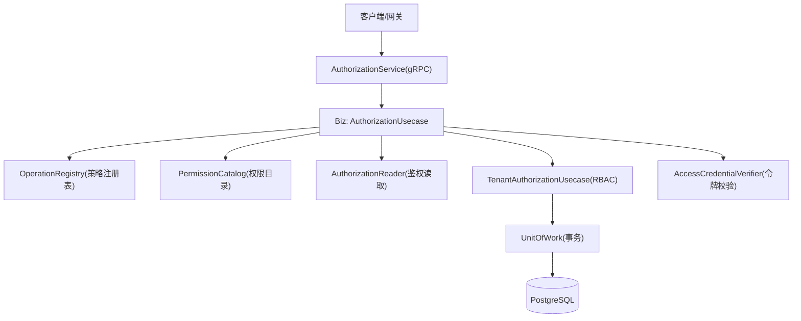
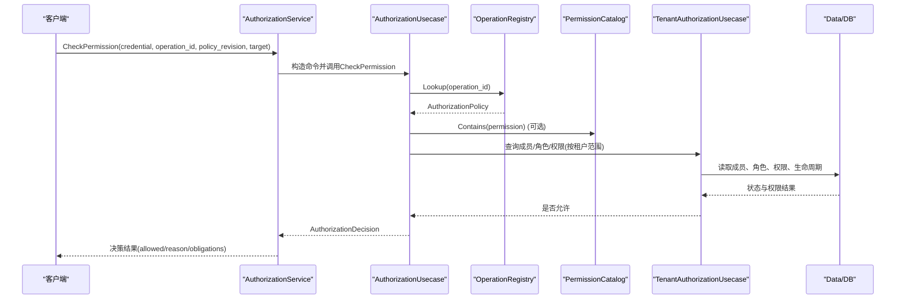
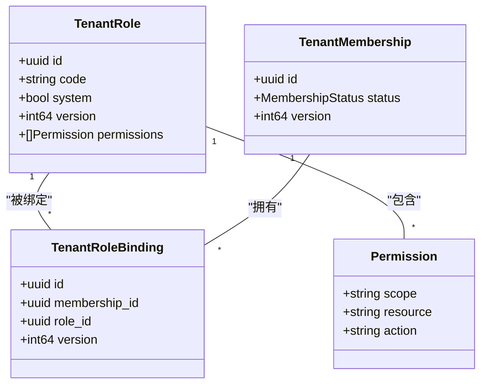
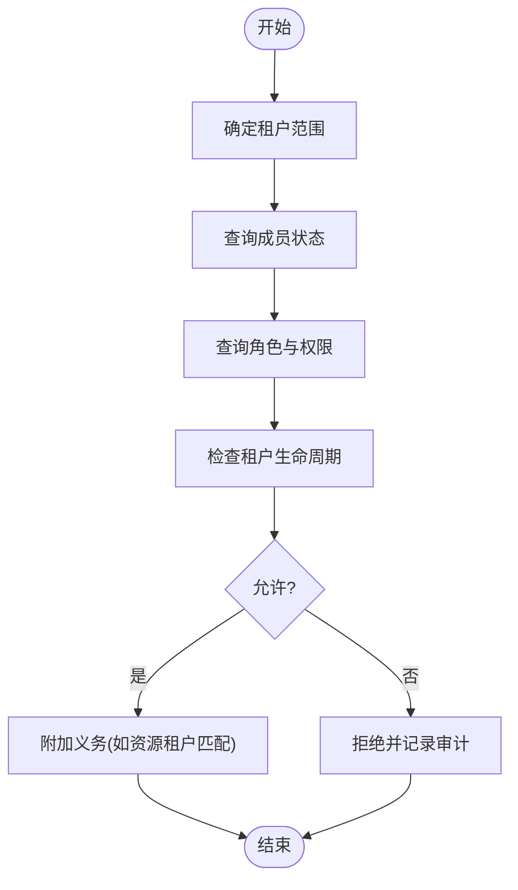
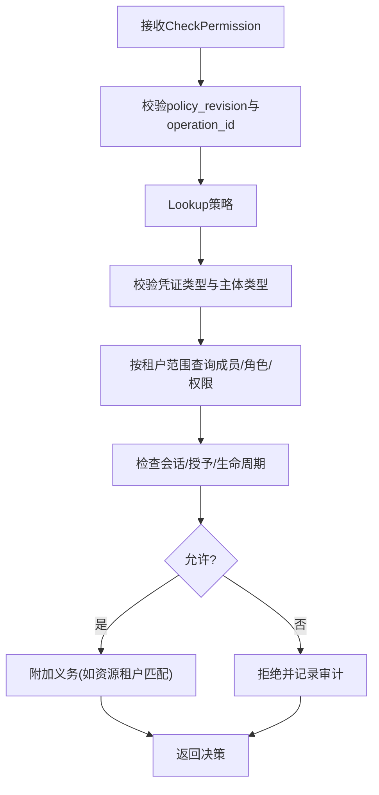
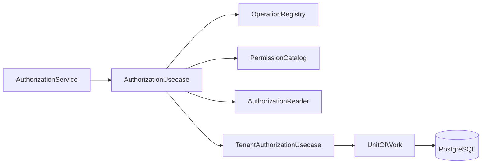

# 授权系统

<cite>
**本文引用的文件**
- [api/iam/v1/authorization_service.proto](file://api/iam/v1/authorization_service.proto)
- [api/iam/v1/authentication_service.proto](file://api/iam/v1/authentication_service.proto)
- [api/iam/v1/contract.proto](file://api/iam/v1/contract.proto)
- [internal/biz/authorization.go](file://internal/biz/authorization.go)
- [internal/biz/tenant_authorization.go](file://internal/biz/tenant_authorization.go)
- [internal/service/authorization.go](file://internal/service/authorization.go)
- [internal/data/generated_operation_policies.go](file://internal/data/generated_operation_policies.go)
- [internal/data/operation_registry.go](file://internal/data/operation_registry.go)
- [migrations/202609080002_permission_catalog.sql](file://migrations/202609080002_permission_catalog.sql)
- [configs/config.yaml](file://configs/config.yaml)
</cite>

## 目录
1. [简介](#简介)
2. [项目结构](#项目结构)
3. [核心组件](#核心组件)
4. [架构总览](#架构总览)
5. [详细组件分析](#详细组件分析)
6. [依赖关系分析](#依赖关系分析)
7. [性能考虑](#性能考虑)
8. [故障排查指南](#故障排查指南)
9. [结论](#结论)
10. [附录：API参考与策略配置示例](#附录api参考与策略配置示例)

## 简介
本文件系统性阐述 ANI IAM 授权系统的 RBAC 权限模型、多租户隔离机制、权限评估算法、策略执行引擎以及上下文感知的授权决策过程。文档覆盖角色定义、权限绑定、资源访问控制、动态权限检查、审计与可观测性，并提供完整的 API 参考与策略配置示例，帮助读者快速理解并正确使用该授权系统。

## 项目结构
ANI IAM 采用分层架构：
- API 层：gRPC 接口定义（认证、授权、管理）
- Service 层：协议适配与错误映射
- Biz 层：业务用例与策略执行（RBAC、租户授权、工作负载授权）
- Data 层：持久化、操作注册表、权限目录、数据库迁移
- 配置与部署：运行时配置、Docker/K8s 模板

图表来源
- [internal/service/authorization.go:27-67](file://internal/service/authorization.go#L27-L67)
- [internal/biz/authorization.go:225-329](file://internal/biz/authorization.go#L225-L329)
- [internal/data/operation_registry.go:26-98](file://internal/data/operation_registry.go#L26-L98)

章节来源
- [configs/config.yaml:1-61](file://configs/config.yaml#L1-L61)

## 核心组件
- 授权服务（AuthorizationService）：对外暴露 CheckPermission 等接口，负责参数校验、上下文构建、调用业务用例并返回标准化决策。
- 业务用例（AuthorizationUsecase）：实现统一的权限评估流程，支持 Access Token、API Key、Workload Token 等多种凭证类型，结合策略注册表与权限目录进行判定。
- 租户授权用例（TenantAuthorizationUsecase）：实现 RBAC 角色管理、成员管理、角色绑定/解绑、租户访问状态控制，并保证最后管理员保护与并发安全。
- 操作注册表（targetOperationRegistry）：将声明式策略编译为不可变策略集合，提供版本一致性校验与查找。
- 权限目录（targetPermissionCatalog）：维护可被角色使用的最小权限集，防止越权分配。
- 数据访问层：通过 Unit of Work 封装事务，确保角色绑定、成员状态变更的原子性与审计事件记录。

章节来源
- [internal/service/authorization.go:27-67](file://internal/service/authorization.go#L27-L67)
- [internal/biz/authorization.go:225-329](file://internal/biz/authorization.go#L225-L329)
- [internal/biz/tenant_authorization.go:250-492](file://internal/biz/tenant_authorization.go#L250-L492)
- [internal/data/operation_registry.go:26-98](file://internal/data/operation_registry.go#L26-L98)

## 架构总览
授权系统以“失败关闭”为原则，所有未明确允许的操作均拒绝。请求进入后，先解析目标租户与资源，再根据操作 ID 查找策略，校验凭证类型与主体类型，随后在租户边界内查询成员、角色与权限，并结合会话、授予版本、生命周期状态做出最终决策。

图表来源
- [internal/service/authorization.go:27-67](file://internal/service/authorization.go#L27-L67)
- [internal/biz/authorization.go:225-329](file://internal/biz/authorization.go#L225-L329)
- [internal/data/operation_registry.go:26-98](file://internal/data/operation_registry.go#L26-L98)

## 详细组件分析

### RBAC 权限模型与角色管理
- 角色定义：每个租户拥有角色集合，角色包含一组权限（scope/resource/action），权限必须存在于全局权限目录中，避免越权。
- 成员管理：成员可以是人类或工作负载，成员具有状态（活跃/暂停/移除）。
- 角色绑定：管理员可将角色绑定到成员；解绑时受“最后管理员保护”约束，防止误删唯一管理员。
- 权限目录：通过 SQL 迁移生成，限制角色只能使用已登记的权限项。

图表来源
- [internal/biz/tenant_authorization.go:49-68](file://internal/biz/tenant_authorization.go#L49-L68)
- [migrations/202609080002_permission_catalog.sql:5-10](file://migrations/202609080002_permission_catalog.sql#L5-L10)

章节来源
- [internal/biz/tenant_authorization.go:250-492](file://internal/biz/tenant_authorization.go#L250-L492)
- [migrations/202609080002_permission_catalog.sql:12-149](file://migrations/202609080002_permission_catalog.sql#L12-L149)

### 多租户权限隔离机制
- 租户边界：所有权限查询与绑定均在租户范围内进行，跨租户访问直接拒绝。
- 成员与角色作用域：成员与角色属于特定租户，无法跨租户引用。
- 生命周期投影：租户生命周期状态（启动中/活跃/暂停）影响授权结果，过期或不一致会触发拒绝。
- 管理员保护：最后一个活跃的人类管理员不能被移除或禁用，保障租户可恢复性。

图表来源
- [internal/biz/authorization.go:225-329](file://internal/biz/authorization.go#L225-L329)
- [internal/biz/tenant_authorization.go:501-527](file://internal/biz/tenant_authorization.go#L501-L527)

章节来源
- [internal/biz/tenant_authorization.go:501-527](file://internal/biz/tenant_authorization.go#L501-L527)

### 权限评估算法与策略执行引擎
- 策略注册：操作 ID 对应不可变策略，包含资源、动作、允许的凭证类型、主体类型、义务等。
- 版本一致性：请求携带策略修订号，与服务端期望值不一致则拒绝，防止策略漂移。
- 凭证校验：
  - Access Token：校验主体、会话、授予版本、过期时间。
  - API Key：校验键存在、状态、有效期、边界与权限。
  - Workload Token：由工作负载身份与授予检查决定。
- 权限判定：在租户范围内组合成员、角色、权限目录，结合会话与授予状态、生命周期状态得出最终决策。
- 义务处理：对需要外部资源归属校验的操作，返回义务让上层处理器完成资源级检查。

图表来源
- [internal/biz/authorization.go:225-329](file://internal/biz/authorization.go#L225-L329)
- [internal/data/operation_registry.go:26-98](file://internal/data/operation_registry.go#L26-L98)

章节来源
- [internal/biz/authorization.go:225-329](file://internal/biz/authorization.go#L225-L329)
- [internal/data/operation_registry.go:26-98](file://internal/data/operation_registry.go#L26-L98)

### 上下文感知的授权决策
- 上下文包括：主体身份、认证方法、会话、授予、租户边界、策略修订、请求关联ID。
- 决策输出：允许/拒绝、原因、决策ID、主体上下文、义务列表、策略修订。
- 审计：每次拒绝或认证失败都会记录审计事件，便于追踪与排障。

章节来源
- [api/iam/v1/contract.proto:145-212](file://api/iam/v1/contract.proto#L145-L212)
- [internal/service/authorization.go:69-141](file://internal/service/authorization.go#L69-L141)

## 依赖关系分析
- 服务层依赖业务用例，业务用例依赖策略注册表、权限目录、数据访问层。
- 策略注册表从生成的策略与运行时装载的工作负载注册表中合并，保证策略不可变且可追溯。
- 权限目录来自迁移脚本，限制角色只能使用登记过的权限。
- 数据访问层通过 Unit of Work 封装事务，确保角色绑定与成员状态变更的原子性。

图表来源
- [internal/service/authorization.go:27-67](file://internal/service/authorization.go#L27-L67)
- [internal/data/operation_registry.go:26-98](file://internal/data/operation_registry.go#L26-L98)

章节来源
- [internal/data/operation_registry.go:26-98](file://internal/data/operation_registry.go#L26-L98)

## 性能考虑
- 策略注册表与权限目录为内存结构，查找复杂度近似 O(1)。
- 权限目录过滤按租户范围，减少不必要的数据扫描。
- 使用 Redis 做登录限流与 API Key 使用聚合，降低数据库压力。
- 审计事件异步落库，避免阻塞主路径。
- 建议：
  - 缓存高频操作的策略与权限结果（注意失效策略）。
  - 批量查询成员与角色，减少往返次数。
  - 合理设置超时与重试，避免雪崩。

## 故障排查指南
- 常见错误：
  - 凭证无效：检查 Access Token/API Key 的状态与有效期。
  - 策略不匹配：确认请求中的 policy_revision 与服务端期望一致。
  - 租户生命周期不新鲜：检查生命周期投影是否过期。
  - 权限不足：检查成员角色与权限目录是否包含所需权限。
- 审计追踪：
  - 查看拒绝决策的 decision_id 与审计事件，定位失败原因。
  - 关注认证失败的目标类型（凭证、API Key、主体）。

章节来源
- [internal/biz/authorization.go:516-576](file://internal/biz/authorization.go#L516-L576)
- [internal/biz/authorization.go:590-635](file://internal/biz/authorization.go#L590-L635)

## 结论
ANI IAM 授权系统通过不可变策略、严格的租户边界、RBAC 角色与权限目录约束，实现了高安全性的多租户权限模型。其上下文感知的决策流程与完善的审计能力，为复杂业务场景提供了可靠的安全基座。建议在集成时严格遵循策略修订与租户边界，充分利用义务机制完成资源级校验。

## 附录：API参考与策略配置示例

### gRPC 接口参考
- AuthenticationService
  - PasswordLogin、BeginOIDCLogin、CompleteOIDCLogin、RefreshSession、LogoutSession、SwitchTenant、ListSessions、RevokeSession、RevokeAllSessions、ValidatePrincipal、IssueWorkloadToken、IssueDelegation 等
- AuthorizationService
  - VerifyWorkloadCaller、VerifySessionContinuation、CheckPermission、VerifyWorkloadInvocation

章节来源
- [api/iam/v1/authentication_service.proto:11-33](file://api/iam/v1/authentication_service.proto#L11-L33)
- [api/iam/v1/authorization_service.proto:10-16](file://api/iam/v1/authorization_service.proto#L10-L16)

### CheckPermission 使用方法
- 请求参数
  - credential：BearerCredential（access_token/api_key/workload_token）
  - operation_id：操作标识，需已在策略注册表中注册
  - policy_revision：策略修订号，必须与服务端期望一致
  - target：AuthorizationTarget（tenant_id、resource_id、attributes）
- 返回值
  - decision：AuthorizationDecision（allowed、reason、decision_id、principal、obligations、policy_revision）

章节来源
- [api/iam/v1/authorization_service.proto:18-39](file://api/iam/v1/authorization_service.proto#L18-L39)
- [internal/service/authorization.go:27-67](file://internal/service/authorization.go#L27-L67)

### 策略配置示例（基于生成策略）
- 操作：createInstance
  - 资源：instances
  - 动作：create
  - 范围：tenant
  - 允许凭证：access_token、api_key、workload_token
  - 允许主体：human、workload
  - 义务：资源租户匹配（handler: core.resource_tenant）
- 操作：getMyQuota
  - 资源：quota
  - 动作：read
  - 范围：own（仅当前主体）
- 操作：approveRestoreTenantAdmin
  - 资源：iam.restore-tenant-admin
  - 动作：approve
  - 范围：platform（平台级）
  - 允许凭证：access_token
  - 允许主体：human

章节来源
- [internal/data/generated_operation_policies.go:17-269](file://internal/data/generated_operation_policies.go#L17-L269)

### 权限目录与角色约束
- 权限目录表 permission_catalog 定义了所有可用的 scope/resource/action 组合。
- 角色权限必须指向目录中的条目，否则创建或绑定失败。
- 迁移脚本中包含大量 tenant/platform/own 范围的权限定义。

章节来源
- [migrations/202609080002_permission_catalog.sql:5-149](file://migrations/202609080002_permission_catalog.sql#L5-L149)

### 配置要点
- 策略修订号：config.yaml 中 policy_revision 必须与运行时策略一致。
- 工作负载注册表：workload_registry_file 与 sha256 用于加载工作负载目标与策略。
- 数据库与缓存：PostgreSQL 与 Redis 连接信息、命名空间、限流窗口等。

章节来源
- [configs/config.yaml:17-61](file://configs/config.yaml#L17-L61)