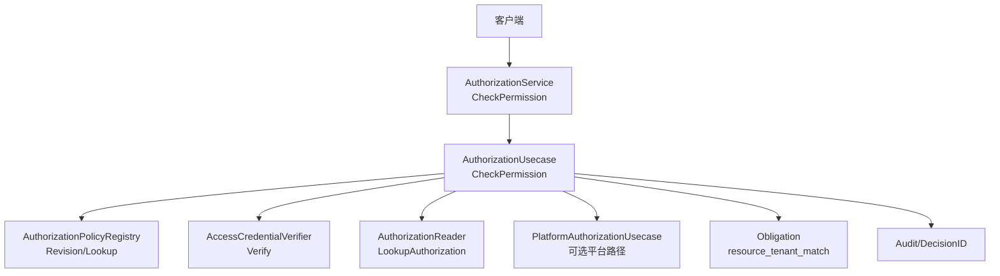
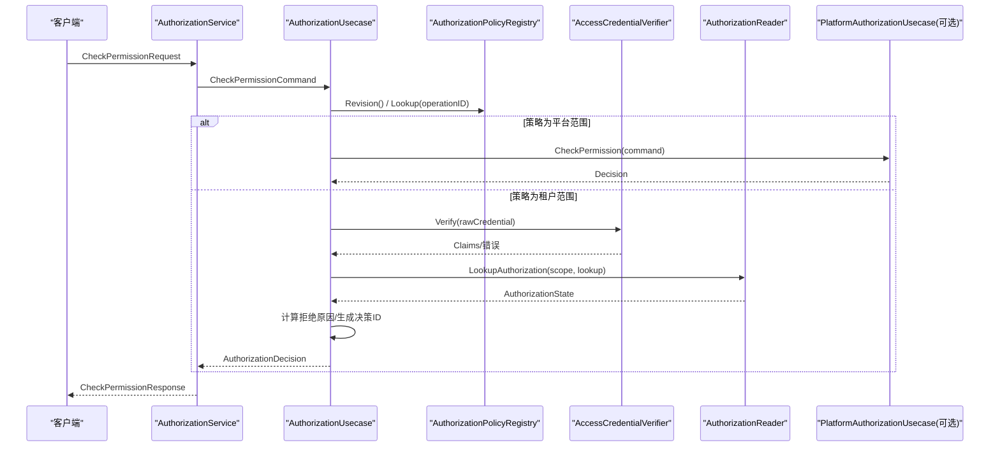
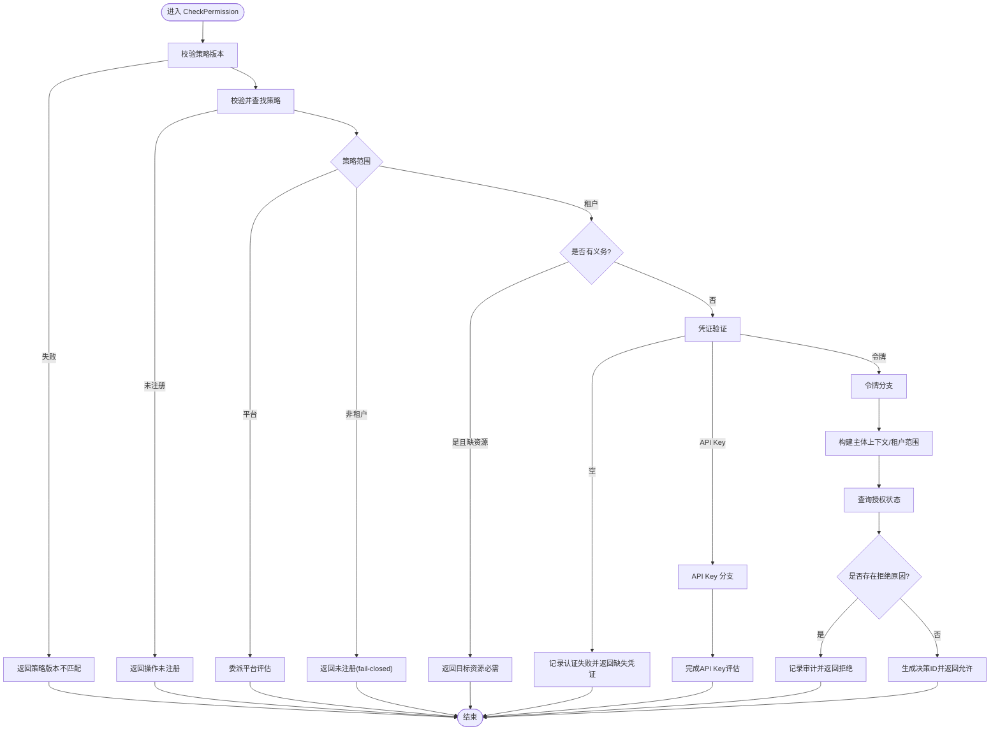
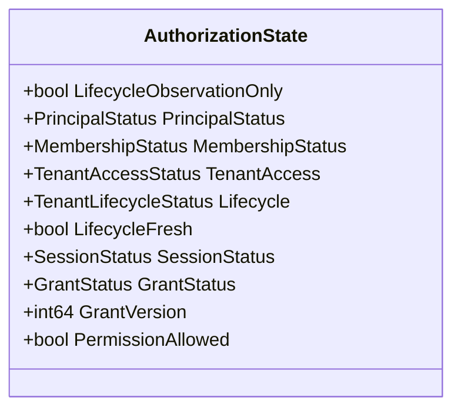
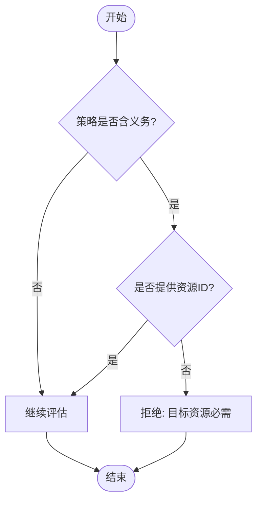
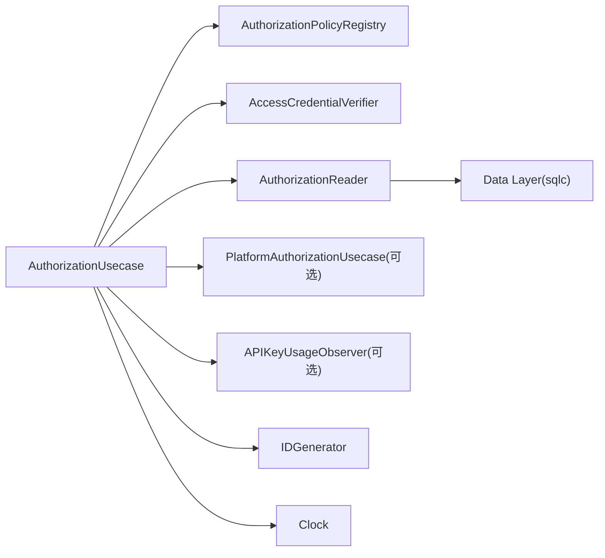

# 权限评估引擎

<cite>
**本文引用的文件**
- [internal/biz/authorization.go](file://internal/biz/authorization.go)
- [internal/biz/platform_authorization.go](file://internal/biz/platform_authorization.go)
- [internal/service/authorization.go](file://internal/service/authorization.go)
- [api/iam/v1/authorization_service.proto](file://api/iam/v1/authorization_service.proto)
- [api/iam/v1/contract.proto](file://api/iam/v1/contract.proto)
- [internal/data/tenant_authorization.go](file://internal/data/tenant_authorization.go)
</cite>

## 目录
1. [简介](#简介)
2. [项目结构](#项目结构)
3. [核心组件](#核心组件)
4. [架构总览](#架构总览)
5. [详细组件分析](#详细组件分析)
6. [依赖关系分析](#依赖关系分析)
7. [性能考量](#性能考量)
8. [故障排查指南](#故障排查指南)
9. [结论](#结论)
10. [附录](#附录)

## 简介
本技术文档聚焦于权限评估引擎的核心实现，围绕 AuthorizationUsecase.CheckPermission 的完整执行流程展开，系统阐述凭证验证、策略查找、上下文检查、权限匹配与决策生成的各阶段。同时解释 AuthorizationState 的状态管理机制（PrincipalStatus、MembershipStatus、TenantAccessStatus 等），说明拒绝原因（AuthorizationReason）的分类与处理逻辑，详述义务（Obligation）机制及其资源租户匹配约束的执行方式，并提供性能优化策略、评估流程示例与调试技巧。

## 项目结构
权限评估引擎由服务层、业务用例层、数据访问层及协议定义组成：
- 服务层：接收外部请求并调用业务用例，负责参数校验与响应转换。
- 业务用例层：实现权限评估主流程，包括策略解析、凭证验证、状态查询、决策生成与审计记录。
- 数据访问层：提供租户授权、成员关系、生命周期等状态的读取能力。
- 协议定义：定义 CheckPermission 请求/响应、主体上下文、义务类型等契约。

图表来源
- [internal/service/authorization.go:27-67](file://internal/service/authorization.go#L27-L67)
- [internal/biz/authorization.go:225-329](file://internal/biz/authorization.go#L225-L329)
- [internal/biz/platform_authorization.go:92-117](file://internal/biz/platform_authorization.go#L92-L117)
- [api/iam/v1/authorization_service.proto:18-39](file://api/iam/v1/authorization_service.proto#L18-L39)

章节来源
- [internal/service/authorization.go:27-67](file://internal/service/authorization.go#L27-L67)
- [internal/biz/authorization.go:225-329](file://internal/biz/authorization.go#L225-L329)
- [api/iam/v1/authorization_service.proto:18-39](file://api/iam/v1/authorization_service.proto#L18-L39)

## 核心组件
- AuthorizationUsecase：权限评估主入口，编排策略、凭证、上下文与决策。
- PlatformAuthorizationUsecase：平台边界下的专用评估路径（无租户、无义务）。
- AuthorizationPolicyRegistry：策略注册表，提供策略版本与按操作ID查找策略。
- AccessCredentialVerifier：访问凭证验证器（如令牌或API Key）。
- AuthorizationReader：读取授权上下文（成员、会话、授予、生命周期等）。
- APIKeyUsageObserver：API Key使用观测（用量统计/审计）。
- IDGenerator/Clock：决策ID生成与时钟抽象，便于测试与一致性。

章节来源
- [internal/biz/authorization.go:199-223](file://internal/biz/authorization.go#L199-L223)
- [internal/biz/platform_authorization.go:26-39](file://internal/biz/platform_authorization.go#L26-L39)

## 架构总览
权限评估采用“策略驱动 + 上下文校验”的分层设计：
- 策略层：通过 OperationID 与 PolicyRevision 定位策略，限定允许的资源、动作、凭证类型、主体类型以及是否携带义务。
- 凭证层：区分人类用户令牌与工作负载 API Key，分别进行有效性校验与边界检查。
- 上下文层：基于 TenantScope 查询 Principal/Membership/TenantAccess/Lifecycle/Session/Grant 等状态。
- 决策层：根据状态组合输出 ALLOWED 或具体拒绝原因，附带决策ID、主体上下文与义务列表。

图表来源
- [internal/service/authorization.go:27-67](file://internal/service/authorization.go#L27-L67)
- [internal/biz/authorization.go:225-329](file://internal/biz/authorization.go#L225-L329)
- [internal/biz/platform_authorization.go:92-117](file://internal/biz/platform_authorization.go#L92-L117)

## 详细组件分析

### AuthorizationUsecase.CheckPermission 执行流程
该方法是权限评估的主流程，包含以下阶段：
1. 策略校验与查找
   - 校验 PolicyRevision 非空并与注册表当前版本一致。
   - 校验 OperationID 非空，并通过注册表查找策略；若未注册或缺少必要字段（Resource/Actions），返回未注册错误。
   - 若策略 Scope 为平台且存在平台实现，则委派给 PlatformAuthorizationUsecase。
   - 若策略 Scope 非租户范围，直接拒绝（fail-closed）。
2. 义务前置检查
   - 若策略包含义务且未提供 TargetResourceID，直接拒绝（缺少目标资源）。
3. 凭证验证
   - 若凭证为空，记录认证失败事件并返回缺失凭证错误。
   - 若凭证以特定前缀开头，走 API Key 分支；否则要求凭证类型为访问令牌且主体类型为人。
   - 调用 AccessCredentialVerifier 验证令牌；对依赖不可用、无效、过期等情况分别记录审计并返回相应错误。
4. 上下文检查
   - 构建可信主体上下文（ID、类型、状态、租户、会话、授予、认证方法）。
   - 构造 TenantScope，校验请求目标租户与凭证所属租户一致，不一致则拒绝。
   - 调用 AuthorizationReader.LookupAuthorization 获取 AuthorizationState。
5. 权限匹配与决策生成
   - 将状态映射为拒绝原因（如主体不活跃、成员不活跃、租户访问不活跃、生命周期陈旧/阻塞、会话/授予无效、版本不匹配、权限不足）。
   - 若无不活跃或冲突，生成决策ID并返回允许决策，附带义务列表与策略版本。

图表来源
- [internal/biz/authorization.go:225-329](file://internal/biz/authorization.go#L225-L329)
- [internal/biz/authorization.go:331-420](file://internal/biz/authorization.go#L331-L420)

章节来源
- [internal/biz/authorization.go:225-329](file://internal/biz/authorization.go#L225-L329)
- [internal/biz/authorization.go:331-420](file://internal/biz/authorization.go#L331-L420)

### 凭证验证阶段
- 令牌路径：
  - 校验主体、会话、授予、有效期等关键字段；若依赖不可用或凭证无效，记录认证失败事件并返回错误。
  - 构建 TrustedPrincipalContext，确保目标租户一致。
- API Key 路径：
  - 解析键ID，获取边界租户，校验密钥存在性、状态与过期时间。
  - 查询 API Key 授权状态，校验主体与租户边界一致性。
  - 记录使用观测（若配置了观测器）。

章节来源
- [internal/biz/authorization.go:264-316](file://internal/biz/authorization.go#L264-L316)
- [internal/biz/authorization.go:331-420](file://internal/biz/authorization.go#L331-L420)

### 策略查找与范围路由
- 策略必须包含 Resource 与 Actions，且需与 OperationID 匹配。
- 平台范围策略由 PlatformAuthorizationUsecase 处理，不包含义务；租户范围策略可携带义务。
- 非租户范围策略在租户评估器中直接拒绝，保持 fail-closed。

章节来源
- [internal/biz/authorization.go:235-253](file://internal/biz/authorization.go#L235-L253)
- [internal/biz/platform_authorization.go:40-58](file://internal/biz/platform_authorization.go#L40-L58)

### 上下文检查与权限匹配
- 通过 AuthorizationReader.LookupAuthorization 获取 AuthorizationState，包含主体、成员、租户访问、生命周期、会话、授予等状态。
- 将状态转换为拒绝原因（见下节），若 PermissionAllowed 为假则拒绝。
- 平台路径使用 PlatformAuthorizationReader 与 PlatformAuthorizationState，同样进行状态到拒绝原因的映射。

章节来源
- [internal/biz/authorization.go:302-316](file://internal/biz/authorization.go#L302-L316)
- [internal/biz/platform_authorization.go:59-75](file://internal/biz/platform_authorization.go#L59-L75)

### 决策生成与审计
- 允许决策：生成决策ID，返回 Allowed=true，Reason=ALLOWED，附带主体上下文与义务列表。
- 拒绝决策：生成决策ID，记录审计事件（被拒绝的授权），返回 Reason 为具体拒绝原因。
- 认证失败：记录认证失败事件（可能无租户边界），返回对应错误。

章节来源
- [internal/biz/authorization.go:317-329](file://internal/biz/authorization.go#L317-L329)
- [internal/biz/authorization.go:516-576](file://internal/biz/authorization.go#L516-L576)
- [internal/biz/authorization.go:590-635](file://internal/biz/authorization.go#L590-L635)

### AuthorizationState 状态管理
AuthorizationState 用于承载一次评估所需的上下文状态，关键字段与作用：
- PrincipalStatus：主体状态，非 ACTIVE 时拒绝（PRINCIPAL_INACTIVE）。
- MembershipStatus：成员状态，非 ACTIVE 时拒绝（MEMBERSHIP_INACTIVE）。
- TenantAccess：租户访问状态，非 ACTIVE 时拒绝（TENANT_ACCESS_INACTIVE）。
- Lifecycle/LifecycleFresh：租户生命周期状态与新鲜度，陈旧或阻塞时拒绝（TENANT_LIFECYCLE_STALE/BLOCKED）。
- SessionStatus/GrantStatus/GrantVersion：会话与授予状态与版本，不活跃或版本不匹配时拒绝（SESSION_INACTIVE/GRANT_INACTIVE/GRANT_VERSION_MISMATCH）。
- PermissionAllowed：最终权限判定结果，为假时拒绝（PERMISSION_DENIED）。

图表来源
- [internal/biz/authorization.go:126-138](file://internal/biz/authorization.go#L126-L138)

章节来源
- [internal/biz/authorization.go:126-138](file://internal/biz/authorization.go#L126-L138)

### 拒绝原因（AuthorizationReason）分类与处理
拒绝原因覆盖从凭证到上下文的各类失效场景：
- 凭证相关：凭证必需、凭证无效、凭证类型不被允许。
- 主体/成员/租户：主体不活跃、成员不活跃、租户访问不活跃。
- 生命周期：生命周期陈旧或阻塞。
- 会话/授予：会话不活跃、授予不活跃、授予版本不匹配。
- 权限：最终权限不足。
- 其他：租户不匹配。

处理逻辑：
- 在状态检查函数中按优先级判断，返回首个匹配的拒绝原因。
- 拒绝决策统一记录审计事件，并返回明确的 Reason。

章节来源
- [internal/biz/authorization.go:30-45](file://internal/biz/authorization.go#L30-L45)
- [internal/biz/authorization.go:458-514](file://internal/biz/authorization.go#L458-L514)

### 义务（Obligation）机制
义务用于表达 IAM 无法独立完成的约束条件，交由拥有者处理器执行：
- 当前支持的义务类型：资源租户匹配（resource_tenant_match）。
- 当策略包含义务时，必须在请求中提供 TargetResourceID；否则拒绝。
- 允许决策会附带义务列表，包含义务类型、处理器名称、资源ID与期望租户ID，供后续处理器校验资源归属。

图表来源
- [internal/biz/authorization.go:251-253](file://internal/biz/authorization.go#L251-L253)
- [internal/biz/authorization.go:477-489](file://internal/biz/authorization.go#L477-L489)
- [api/iam/v1/contract.proto:97-101](file://api/iam/v1/contract.proto#L97-L101)

章节来源
- [internal/biz/authorization.go:251-253](file://internal/biz/authorization.go#L251-L253)
- [internal/biz/authorization.go:477-489](file://internal/biz/authorization.go#L477-L489)
- [api/iam/v1/contract.proto:97-101](file://api/iam/v1/contract.proto#L97-L101)

### 平台评估路径（PlatformAuthorizationUsecase）
平台路径适用于平台边界（无租户、无义务）的人类用户：
- 策略校验：仅接受平台范围策略，且不允许义务。
- 凭证校验：仅接受人类用户令牌，且需满足受众、边界、租户为空等约束。
- 状态校验：主体、成员、会话、授予状态与版本；最终权限判定。
- 审计：平台路径使用独立的审计记录接口。

章节来源
- [internal/biz/platform_authorization.go:40-75](file://internal/biz/platform_authorization.go#L40-L75)
- [internal/biz/platform_authorization.go:92-117](file://internal/biz/platform_authorization.go#L92-L117)

## 依赖关系分析
- AuthorizationUsecase 依赖：
  - 策略注册表：提供策略版本与查找。
  - 凭证验证器：验证令牌或 API Key。
  - 授权读取器：查询主体、成员、租户访问、生命周期、会话、授予等状态。
  - 平台评估器（可选）：处理平台范围策略。
  - 观测器（可选）：记录 API Key 使用情况。
  - ID 生成器与时钟：生成决策ID与获取当前时间。
- 数据访问层：
  - 通过 sqlc 生成的查询封装数据库访问，保证事务与并发安全。
  - 租户授权工作单元提供事务边界与锁保护，避免竞态。

图表来源
- [internal/biz/authorization.go:199-223](file://internal/biz/authorization.go#L199-L223)
- [internal/data/tenant_authorization.go:141-172](file://internal/data/tenant_authorization.go#L141-L172)

章节来源
- [internal/biz/authorization.go:199-223](file://internal/biz/authorization.go#L199-L223)
- [internal/data/tenant_authorization.go:141-172](file://internal/data/tenant_authorization.go#L141-L172)

## 性能考量
- 缓存设计
  - 策略注册表应缓存策略与版本，减少重复查找与网络开销。
  - 授权状态可按（主体、会话、授予、资源、动作）维度缓存，注意失效策略与一致性。
  - 租户生命周期投影可结合新鲜度字段（fresh_until）做短期缓存。
- 查询优化
  - 使用最小化查询集，一次性加载所需状态（成员、角色权限、生命周期、会话/授予）。
  - 利用索引与分页，避免全表扫描与大结果集。
- 并发控制
  - 使用事务隔离级别与行级锁（如管理员守卫、成员锁定）避免竞态。
  - 对高频读路径引入只读副本或缓存，降低写放大。
- 异步观测
  - API Key 使用观测可异步落库，避免阻塞主路径。
- 超时与降级
  - 对依赖不可用（ErrAuthorizationDependency）快速失败，避免级联雪崩。
  - 对关键路径设置超时与熔断，保障整体可用性。

[本节为通用指导，不直接分析具体文件]

## 故障排查指南
- 常见错误与定位
  - 策略版本不匹配：检查客户端传入的 policy_revision 与注册表当前版本是否一致。
  - 操作未注册：确认 operation_id 已登记且策略包含 resource/actions。
  - 凭证无效/缺失：检查凭证格式、签名、过期时间与依赖服务可用性。
  - 租户不匹配：核对请求目标租户与凭证所属租户是否一致。
  - 主体/成员/租户访问不活跃：检查主体状态、成员绑定与租户访问状态。
  - 生命周期陈旧/阻塞：检查生命周期投影的新鲜度与状态。
  - 会话/授予无效或版本不匹配：检查会话状态、授予状态与版本。
  - 权限不足：检查角色权限与资源/动作匹配。
- 审计与追踪
  - 所有拒绝与认证失败都会记录审计事件，包含决策ID、主体、方法、目标、结果与原因。
  - 通过决策ID关联请求链路，定位问题点。
- 调试技巧
  - 打印策略查找结果与状态字段，确认各阶段输入。
  - 使用测试时钟与模拟依赖，复现边界条件（过期、版本冲突、依赖不可用）。
  - 针对 API Key 路径，检查键ID解析、边界租户、状态与过期时间。

章节来源
- [internal/biz/authorization.go:516-635](file://internal/biz/authorization.go#L516-L635)
- [internal/biz/platform_authorization.go:149-187](file://internal/biz/platform_authorization.go#L149-L187)

## 结论
权限评估引擎以策略为核心，结合凭证验证与多阶段上下文检查，形成明确、可审计的决策输出。AuthorizationUsecase 将复杂的状态组合收敛为清晰的拒绝原因，并通过义务机制扩展跨边界约束。平台路径与租户路径分离，既保证了灵活性，又维持了 fail-closed 的安全边界。通过合理的缓存、查询优化与并发控制，可在高并发场景下保持稳定与高效。

[本节为总结性内容，不直接分析具体文件]

## 附录

### API 契约概览
- CheckPermissionRequest：包含原始凭证、操作ID、策略版本与目标（租户ID、资源ID、属性）。
- AuthorizationDecision：包含允许标志、拒绝原因、决策ID、主体上下文、义务列表与策略版本。
- 主体上下文：包含主体ID、类型、状态、边界、会话ID、授予ID与认证方法。

章节来源
- [api/iam/v1/authorization_service.proto:18-39](file://api/iam/v1/authorization_service.proto#L18-L39)
- [api/iam/v1/contract.proto:145-159](file://api/iam/v1/contract.proto#L145-L159)

### 评估流程示例
- 人类用户令牌路径：
  - 输入：Bearer 令牌、operation_id、policy_revision、target.tenant_id、target.resource_id。
  - 步骤：策略校验 -> 令牌验证 -> 租户范围检查 -> 授权状态查询 -> 拒绝原因判定 -> 决策输出。
- API Key 路径：
  - 输入：ani_开头的 API Key、operation_id、policy_revision、target.tenant_id、target.resource_id。
  - 步骤：策略校验 -> API Key 解析与边界检查 -> 状态查询 -> 拒绝原因判定 -> 使用观测 -> 决策输出。

章节来源
- [internal/service/authorization.go:27-67](file://internal/service/authorization.go#L27-L67)
- [internal/biz/authorization.go:225-329](file://internal/biz/authorization.go#L225-L329)
- [internal/biz/authorization.go:331-420](file://internal/biz/authorization.go#L331-L420)