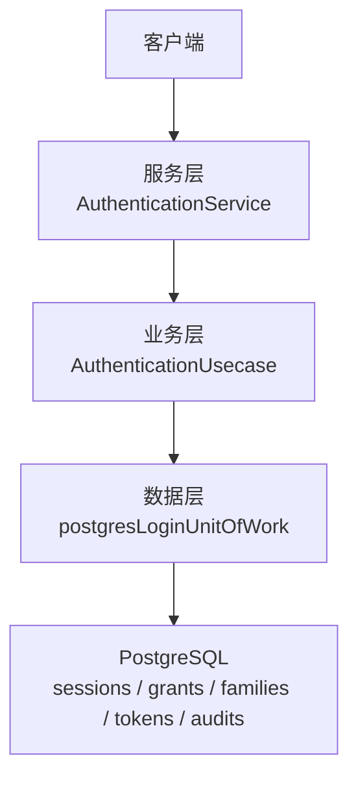
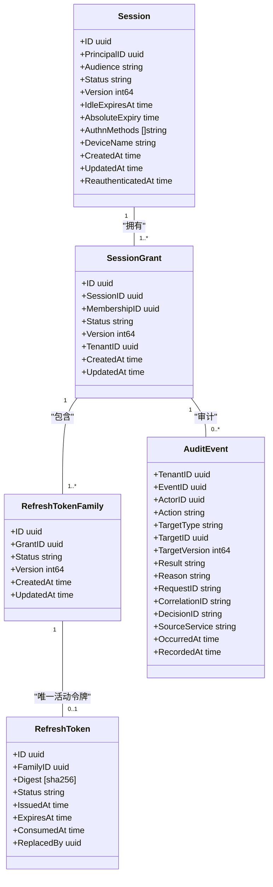
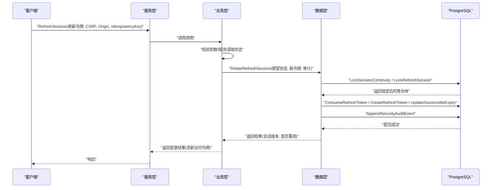
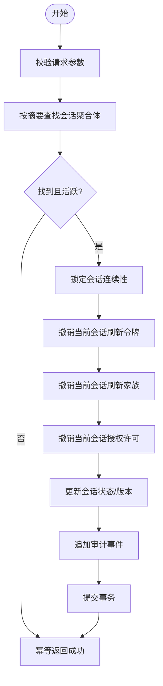
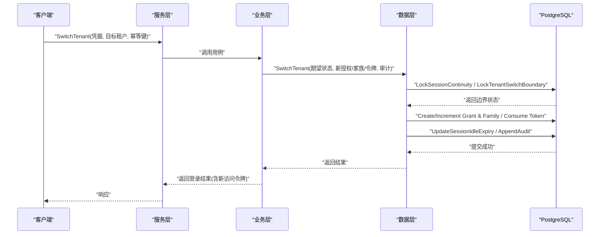
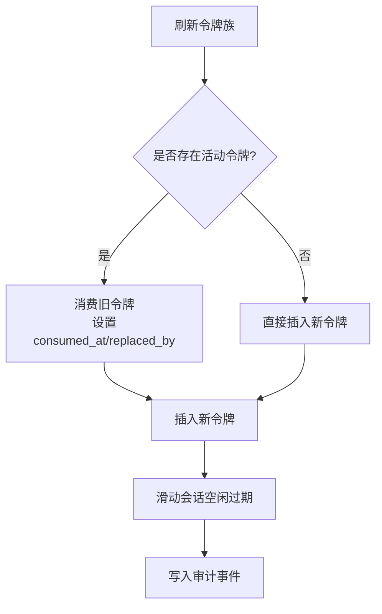
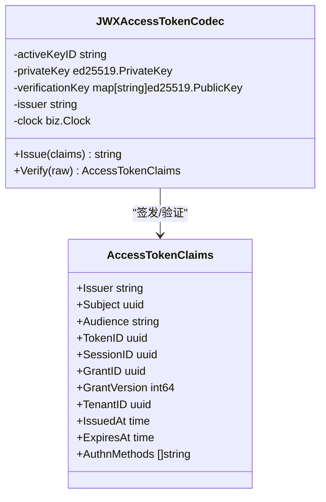
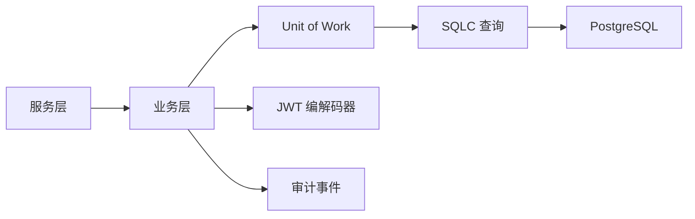

# 会话模型

<cite>
**本文引用的文件**
- [internal/biz/session.go](file://internal/biz/session.go)
- [internal/data/session_postgres.go](file://internal/data/session_postgres.go)
- [internal/service/authentication.go](file://internal/service/authentication.go)
- [migrations/202609070002_session_continuity.sql](file://migrations/202609070002_session_continuity.sql)
- [migrations/202609040001_persistence_foundation.sql](file://migrations/202609040001_persistence_foundation.sql)
- [internal/data/access_token_jwx.go](file://internal/data/access_token_jwx.go)
- [internal/data/workload_token_jwx.go](file://internal/data/workload_token_jwx.go)
- [internal/data/queries/session_query.sql](file://internal/data/queries/session_query.sql)
- [internal/data/sqlcgen/session_query.sql.go](file://internal/data/sqlcgen/session_query.sql.go)
</cite>

## 目录
1. [简介](#简介)
2. [项目结构](#项目结构)
3. [核心组件](#核心组件)
4. [架构总览](#架构总览)
5. [详细组件分析](#详细组件分析)
6. [依赖关系分析](#依赖关系分析)
7. [性能考虑](#性能考虑)
8. [故障处理指南](#故障处理指南)
9. [结论](#结论)
10. [附录](#附录)

## 简介
本文件系统性阐述 ANI IAM 的会话模型，覆盖会话持久化、连续性与状态管理的数据结构设计；解释会话表结构与约束、JWT 访问令牌与刷新令牌的存储与轮换机制；说明会话生命周期管理、并发控制与安全策略；并给出会话恢复、迁移与清理机制、查询优化与缓存策略、性能调优建议，以及 API 示例与常见故障处理方案。

## 项目结构
会话能力由三层协作实现：
- 服务层（gRPC）：对外暴露认证与会话操作接口，负责参数校验、错误映射与审计上下文注入。
- 业务层（用例）：定义会话刷新、登出、租户切换等用例，编排安全校验、限流、审计事件与令牌签发。
- 数据层（PostgreSQL + SQLC）：通过事务与行级锁保证并发一致性，维护会话、授权许可、刷新令牌族与审计事件。

**图示来源**
- [internal/service/authentication.go:196-254](file://internal/service/authentication.go#L196-L254)
- [internal/biz/session.go:154-478](file://internal/biz/session.go#L154-L478)
- [internal/data/session_postgres.go:75-498](file://internal/data/session_postgres.go#L75-L498)

**章节来源**
- [internal/service/authentication.go:196-254](file://internal/service/authentication.go#L196-L254)
- [internal/biz/session.go:154-478](file://internal/biz/session.go#L154-L478)
- [internal/data/session_postgres.go:75-498](file://internal/data/session_postgres.go#L75-L498)

## 核心组件
- 会话刷新：基于刷新令牌摘要定位会话聚合体，校验活跃性后原子旋转刷新令牌、滑动空闲过期时间、签发新访问令牌并记录审计。
- 会话登出：锁定会话边界，撤销当前会话所有刷新令牌、家族与授权许可，更新会话状态并追加审计。
- 租户切换：在会话边界内创建或升级目标租户的授权许可与刷新令牌族，签发新的访问令牌并记录审计。
- JWT 访问令牌：无状态签名令牌，携带主体、会话、授权许可、版本、受众、边界、认证方法等信息，用于下游鉴权。
- 刷新令牌族：每族仅允许一个活动刷新令牌，支持“已消费-被替换”链式追踪，确保并发安全与可追溯性。

**章节来源**
- [internal/biz/session.go:154-478](file://internal/biz/session.go#L154-L478)
- [internal/data/session_postgres.go:75-498](file://internal/data/session_postgres.go#L75-L498)
- [internal/data/access_token_jwx.go:83-134](file://internal/data/access_token_jwx.go#L83-L134)
- [migrations/202609070002_session_continuity.sql:1-19](file://migrations/202609070002_session_continuity.sql#L1-L19)

## 架构总览
会话模型围绕“会话-授权许可-刷新令牌族-刷新令牌”的聚合关系构建，并通过数据库行锁与版本控制保障并发一致性与安全性。

**图示来源**
- [migrations/202609040001_persistence_foundation.sql:17-148](file://migrations/202609040001_persistence_foundation.sql#L17-L148)
- [migrations/202609070002_session_continuity.sql:1-19](file://migrations/202609070002_session_continuity.sql#L1-L19)
- [internal/data/sqlcgen/session_query.sql.go:14-103](file://internal/data/sqlcgen/session_query.sql.go#L14-L103)

## 详细组件分析

### 会话刷新流程
- 输入校验：要求刷新令牌、CSRF Token、Origin、幂等键。
- 限流检查：对刷新尝试进行速率限制。
- 状态读取：按刷新令牌摘要查找会话聚合体，校验关系完整性与受众。
- 冲突处理：若令牌已被消费，则撤销同族其他令牌并记录重用审计。
- 令牌轮换：生成新刷新令牌摘要、计算空闲与绝对过期时间、签发新访问令牌。
- 原子提交：锁定会话连续性、锁定刷新令牌行、消费旧令牌、插入新令牌、滑动会话空闲过期、写入审计、提交事务。

**图示来源**
- [internal/service/authentication.go:196-211](file://internal/service/authentication.go#L196-L211)
- [internal/biz/session.go:154-286](file://internal/biz/session.go#L154-L286)
- [internal/data/session_postgres.go:75-165](file://internal/data/session_postgres.go#L75-L165)

**章节来源**
- [internal/service/authentication.go:196-211](file://internal/service/authentication.go#L196-L211)
- [internal/biz/session.go:154-286](file://internal/biz/session.go#L154-L286)
- [internal/data/session_postgres.go:75-165](file://internal/data/session_postgres.go#L75-L165)

### 会话登出流程
- 输入校验：要求刷新令牌、CSRF、Origin、幂等键。
- 状态读取：按摘要查找会话聚合体，确认会话仍为活跃。
- 原子撤销：锁定会话连续性，撤销当前会话的所有刷新令牌、家族与授权许可，更新会话状态并追加审计。

**图示来源**
- [internal/service/authentication.go:213-230](file://internal/service/authentication.go#L213-L230)
- [internal/biz/session.go:288-348](file://internal/biz/session.go#L288-L348)
- [internal/data/session_postgres.go:268-350](file://internal/data/session_postgres.go#L268-L350)

**章节来源**
- [internal/service/authentication.go:213-230](file://internal/service/authentication.go#L213-L230)
- [internal/biz/session.go:288-348](file://internal/biz/session.go#L288-L348)
- [internal/data/session_postgres.go:268-350](file://internal/data/session_postgres.go#L268-L350)

### 租户切换流程
- 输入校验：验证凭据、目标租户、幂等键。
- 状态读取：锁定会话边界，获取源租户授权许可与目标租户授权许可/家族信息。
- 资源创建/升级：若目标授权不存在则创建；若存在但无家族则创建家族；若已有家族则消费其活动刷新令牌并递增版本。
- 令牌签发：签发新的访问令牌，滑动会话空闲过期，追加审计并提交。

**图示来源**
- [internal/service/authentication.go:232-254](file://internal/service/authentication.go#L232-L254)
- [internal/biz/session.go:350-478](file://internal/biz/session.go#L350-L478)
- [internal/data/session_postgres.go:352-498](file://internal/data/session_postgres.go#L352-L498)

**章节来源**
- [internal/service/authentication.go:232-254](file://internal/service/authentication.go#L232-L254)
- [internal/biz/session.go:350-478](file://internal/biz/session.go#L350-L478)
- [internal/data/session_postgres.go:352-498](file://internal/data/session_postgres.go#L352-L498)

### 刷新令牌族与“唯一活动令牌”约束
- 约束设计：每个刷新令牌族在同一租户下仅允许一个活动刷新令牌，通过部分唯一索引实现。
- 消费链：已消费的刷新令牌必须记录 consumed_at 与 replaced_by，形成“被替换”链，便于追踪与撤销。
- 并发安全：通过行级锁与版本检查避免重复使用与竞态条件。

**图示来源**
- [migrations/202609070002_session_continuity.sql:1-19](file://migrations/202609070002_session_continuity.sql#L1-L19)
- [internal/data/session_postgres.go:128-165](file://internal/data/session_postgres.go#L128-L165)

**章节来源**
- [migrations/202609070002_session_continuity.sql:1-19](file://migrations/202609070002_session_continuity.sql#L1-L19)
- [internal/data/session_postgres.go:128-165](file://internal/data/session_postgres.go#L128-L165)

### JWT 访问令牌与刷新机制
- 访问令牌：EdDSA 签名的 JWT，包含主体、会话、授权许可、版本、受众、边界、认证方法等声明，短生命周期，适合高频鉴权。
- 刷新令牌：服务端持久化的刷新令牌摘要，配合族与消费链实现轮换与撤销。
- 密钥轮换：通过 active key ID 与验证密钥集合支持密钥轮换，验证时根据 kid 选择公钥。

**图示来源**
- [internal/data/access_token_jwx.go:42-134](file://internal/data/access_token_jwx.go#L42-L134)
- [internal/data/access_token_jwx.go:169-225](file://internal/data/access_token_jwx.go#L169-L225)

**章节来源**
- [internal/data/access_token_jwx.go:42-134](file://internal/data/access_token_jwx.go#L42-L134)
- [internal/data/access_token_jwx.go:169-225](file://internal/data/access_token_jwx.go#L169-L225)

### 工作负载令牌与延续
- 工作负载令牌：用于工作负载间调用，包含调用者身份、目标、修订号等私有声明，严格 TTL 与类型校验。
- 委派令牌：在工作负载或人类主体上下文中进行权限委派，校验绑定与受众一致性。
- 会话延续令牌：跨调用维持会话上下文，校验接收者与调用者环境一致性。

**章节来源**
- [internal/data/workload_token_jwx.go:23-102](file://internal/data/workload_token_jwx.go#L23-L102)
- [internal/data/workload_token_jwx.go:104-180](file://internal/data/workload_token_jwx.go#L104-L180)
- [internal/data/workload_token_jwx.go:215-250](file://internal/data/workload_token_jwx.go#L215-L250)

## 依赖关系分析
- 服务层依赖业务层接口，业务层通过 Unit of Work 抽象数据变更，数据层通过 SQLC 生成的查询执行具体 SQL。
- 会话刷新/登出/切换均依赖数据库行锁与版本控制，确保并发安全与一致性。
- 审计事件统一写入 iam_audit_events，关联主体、动作、目标与版本，支持可追溯性。

**图示来源**
- [internal/service/authentication.go:196-254](file://internal/service/authentication.go#L196-L254)
- [internal/biz/session.go:141-152](file://internal/biz/session.go#L141-L152)
- [internal/data/postgres.go:145-182](file://internal/data/postgres.go#L145-L182)

**章节来源**
- [internal/service/authentication.go:196-254](file://internal/service/authentication.go#L196-L254)
- [internal/biz/session.go:141-152](file://internal/biz/session.go#L141-L152)
- [internal/data/postgres.go:145-182](file://internal/data/postgres.go#L145-L182)

## 性能考虑
- 查询优化
  - 使用分页查询会话与授权许可，避免一次性加载大量数据。
  - 利用部分唯一索引与条件索引提升刷新令牌族的活动令牌约束查询效率。
- 缓存策略
  - 访问令牌为无状态 JWT，无需服务端缓存；刷新令牌摘要仅用于定位聚合体，不建议缓存明文。
  - 可将会话摘要（不含敏感字段）短期缓存以减少重复读取，但需考虑失效与一致性。
- 并发控制
  - 通过行级锁与版本检查避免竞争；刷新令牌族“唯一活动令牌”约束防止并发轮换冲突。
- 性能调优
  - 合理设置事务隔离级别与超时，避免长事务阻塞。
  - 对高频路径（刷新/登出）减少额外 I/O，尽量在事务内完成必要操作。
  - 监控慢查询与锁等待，必要时调整索引与统计信息。

[本节为通用指导，不直接分析具体文件]

## 故障处理指南
- 常见错误与处理
  - 刷新令牌无效或缺失：返回未认证错误，提示客户端重新登录。
  - 刷新令牌被重用：撤销同族其他令牌并记录审计，拒绝本次请求。
  - 会话已登出或过期：幂等返回成功或拒绝后续操作。
  - 租户切换失败：检查授权许可与家族状态，确保目标租户可用。
  - 依赖不可用：当认证、授权或持久化依赖不可用时，返回不可用状态并附带依赖信息。
- 重试与幂等
  - 使用幂等键避免重复提交；对限流错误遵循重试退避策略。
- 审计与可观测性
  - 所有关键操作均记录审计事件，包含主体、动作、目标、版本、原因与时间戳，便于问题定位与合规审计。

**章节来源**
- [internal/service/authentication.go:476-683](file://internal/service/authentication.go#L476-L683)
- [internal/biz/session.go:154-478](file://internal/biz/session.go#L154-L478)
- [internal/data/session_postgres.go:75-498](file://internal/data/session_postgres.go#L75-L498)

## 结论
ANI IAM 的会话模型以“会话-授权许可-刷新令牌族-刷新令牌”为核心聚合，结合数据库行锁、版本控制与审计事件，实现了高安全、高一致的会话生命周期管理。通过 JWT 访问令牌与刷新令牌轮换机制，系统在保持无状态鉴权的同时，提供了细粒度的撤销与追踪能力。建议在部署中关注查询性能、锁竞争与审计容量，持续优化以提升整体稳定性与可扩展性。

## 附录

### 会话查询优化与示例
- 列出用户拥有的会话（分页）：
  - 使用 ListOwnedHumanSessions，按 principal_id 与 after_id 分页，限制 row_limit。
- 列出会话的授权许可：
  - 使用 ListOwnedSessionGrants，按 tenant_id、session_id、principal_id 过滤。

**章节来源**
- [internal/data/queries/session_query.sql:1-14](file://internal/data/queries/session_query.sql#L1-L14)
- [internal/data/sqlcgen/session_query.sql.go:14-103](file://internal/data/sqlcgen/session_query.sql.go#L14-L103)

### API 示例
- 刷新会话
  - 请求：POST /iam.v1.AuthenticationService/RefreshSession
  - 参数：refresh_token、csrf_token、origin、idempotency_key
  - 响应：包含新访问令牌、刷新令牌、会话摘要与过期时间
- 登出会话
  - 请求：POST /iam.v1.AuthenticationService/LogoutSession
  - 参数：refresh_token、csrf_token、origin、idempotency_key
  - 响应：空结果（网关映射为 204）
- 切换租户
  - 请求：POST /iam.v1.AuthenticationService/SwitchTenant
  - 参数：credential、tenant_id、idempotency_key
  - 响应：包含新访问令牌、刷新令牌、会话摘要与过期时间

**章节来源**
- [internal/service/authentication.go:196-254](file://internal/service/authentication.go#L196-L254)