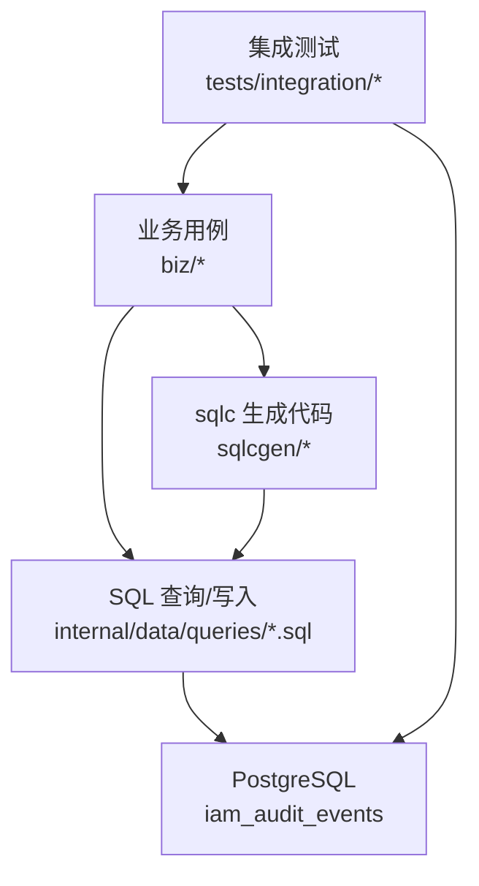
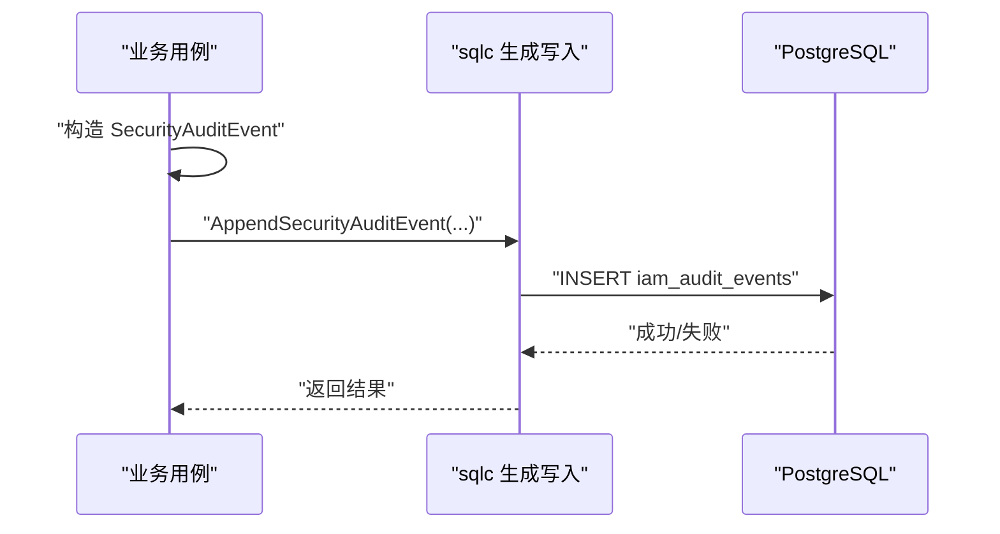
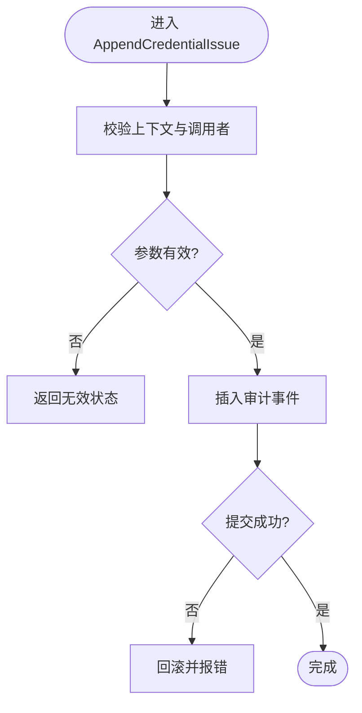
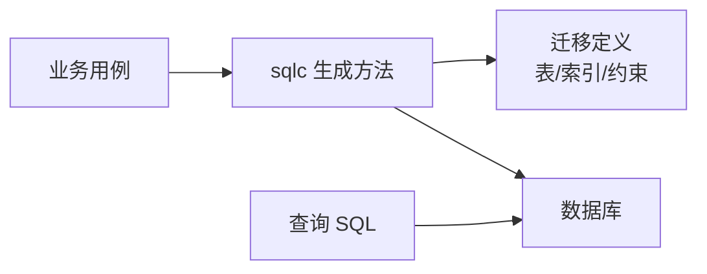

# 审计模型

<cite>
**本文引用的文件**
- [202609040001_persistence_foundation.sql](file://migrations/202609040001_persistence_foundation.sql)
- [persistence.sql](file://internal/data/queries/persistence.sql)
- [audit_query.sql](file://internal/data/queries/audit_query.sql)
- [platform_audit_query.sql](file://internal/data/queries/platform_audit_query.sql)
- [workload_invocation_audit.go](file://internal/data/workload_invocation_audit.go)
- [session.go](file://internal/biz/session.go)
- [platform_authorization.go](file://internal/biz/platform_authorization.go)
- [password_action.go](file://internal/biz/password_action.go)
- [oidc.go](file://internal/biz/oidc.go)
- [principal_validation.go](file://internal/biz/principal_validation.go)
- [wr22_platform_audit_test.go](file://tests/integration/wr22_platform_audit_test.go)
- [workload_bootstrap_test.go](file://tests/integration/workload_bootstrap_test.go)
</cite>

## 目录
1. [简介](#简介)
2. [项目结构](#项目结构)
3. [核心组件](#核心组件)
4. [架构总览](#架构总览)
5. [详细组件分析](#详细组件分析)
6. [依赖关系分析](#依赖关系分析)
7. [性能与存储策略](#性能与存储策略)
8. [故障排查指南](#故障排查指南)
9. [结论](#结论)
10. [附录：查询示例、报告与监控告警](#附录查询示例报告与监控告警)

## 简介
本文件系统性阐述 ANI IAM 的审计模型，聚焦 iam_audit_events 表的设计与实现，覆盖审计事件记录、结果追踪、原因分析、完整性约束、时间戳管理、关联 ID 机制、存储策略、查询优化与归档方案。同时说明不同认证方法的审计记录格式、边界控制与合规要求，并提供审计查询示例、报告生成思路以及监控告警配置建议，辅以最佳实践与安全考虑。

## 项目结构
审计能力贯穿业务层（biz）、数据访问层（data/queries）与数据库迁移（migrations），并通过测试用例验证行为与一致性。关键路径如下：
- 数据模型与约束：在迁移文件中定义 iam_audit_events 表及索引、外键、检查约束。
- 写入路径：业务用例构造 SecurityAuditEvent，通过 sqlc 生成的持久化方法插入审计事件。
- 读取路径：提供租户与平台两个维度的审计查询 SQL，用于列表与单条查询。
- 工作负载调用审计：针对工作负载凭证签发进行专用追加接口，确保幂等与可追溯。
- 端到端验证：集成测试覆盖权限、边界、失败回滚、触发器故障恢复等场景。

图表来源
- [202609040001_persistence_foundation.sql:100-148](file://migrations/202609040001_persistence_foundation.sql#L100-L148)
- [persistence.sql:372-409](file://internal/data/queries/persistence.sql#L372-L409)
- [audit_query.sql:1-18](file://internal/data/queries/audit_query.sql#L1-L18)
- [platform_audit_query.sql:1-16](file://internal/data/queries/platform_audit_query.sql#L1-L16)

章节来源
- [202609040001_persistence_foundation.sql:100-148](file://migrations/202609040001_persistence_foundation.sql#L100-L148)
- [persistence.sql:372-409](file://internal/data/queries/persistence.sql#L372-L409)
- [audit_query.sql:1-18](file://internal/data/queries/audit_query.sql#L1-L18)
- [platform_audit_query.sql:1-16](file://internal/data/queries/platform_audit_query.sql#L1-L16)

## 核心组件
- 审计事件表 iam_audit_events：以 tenant_id + event_id 为主键，强制使用 v7 UUID，限制认证方法枚举，强制非空字段，并建立按 recorded_at 降序的复合索引以支持分页查询。
- 审计事件写入：通过 AppendSecurityAuditEvent 等 sqlc 生成方法，将 SecurityAuditEvent 原子写入；匿名主体与特定边界有专用写入入口。
- 审计事件读取：提供租户维度与平台维度的查询，统一计算 actor_type（principal/workload/anonymous/initialization）。
- 工作负载调用审计：workloadCredentialAudit.AppendCredentialIssue 对凭证签发进行强校验与唯一追加，保证“仅一次”的幂等性。
- 业务用例中的审计注入：登录、密码操作、OIDC 身份绑定、租户切换、授权决策等均构造并持久化审计事件。

章节来源
- [202609040001_persistence_foundation.sql:100-148](file://migrations/202609040001_persistence_foundation.sql#L100-L148)
- [persistence.sql:372-409](file://internal/data/queries/persistence.sql#L372-L409)
- [persistence.sql:459-471](file://internal/data/queries/persistence.sql#L459-L471)
- [persistence.sql:651-663](file://internal/data/queries/persistence.sql#L651-L663)
- [persistence.sql:790-800](file://internal/data/queries/persistence.sql#L790-L800)
- [audit_query.sql:1-18](file://internal/data/queries/audit_query.sql#L1-L18)
- [platform_audit_query.sql:1-16](file://internal/data/queries/platform_audit_query.sql#L1-L16)
- [workload_invocation_audit.go:17-31](file://internal/data/workload_invocation_audit.go#L17-L31)

## 架构总览
审计事件贯穿请求生命周期，从业务用例构造事件到数据库落盘，再到查询导出。关键流程如下：

图表来源
- [persistence.sql:372-409](file://internal/data/queries/persistence.sql#L372-L409)
- [202609040001_persistence_foundation.sql:100-148](file://migrations/202609040001_persistence_foundation.sql#L100-L148)

章节来源
- [persistence.sql:372-409](file://internal/data/queries/persistence.sql#L372-L409)
- [202609040001_persistence_foundation.sql:100-148](file://migrations/202609040001_persistence_foundation.sql#L100-L148)

## 详细组件分析

### 数据模型与完整性约束
- 主键与版本：tenant_id + event_id 为主键；event_id 为 v7 UUID，便于时间排序与去重。
- 必填与枚举：authentication_method 限定为 password/oidc/api_key/workload_token/internal；boundary 当前为 tenant；result 限定 succeeded/denied/failed；reason/action/target_type/source_service 非空。
- 关联与外键：tenant_id 引用 tenant_access；actor_id 引用 principals（延迟约束，允许事务内顺序插入）。
- 索引：按 (tenant_id, recorded_at DESC, event_id) 建立索引，支撑高效分页与倒序扫描。

章节来源
- [202609040001_persistence_foundation.sql:100-148](file://migrations/202609040001_persistence_foundation.sql#L100-L148)

### 时间戳管理与关联 ID 机制
- 时间戳：occurred_at 表示事件发生时间，recorded_at 表示落库时间，均为 UTC。
- 关联 ID：
  - request_id：请求级标识，用于跨服务链路追踪。
  - correlation_id：关联同一业务流程的多个事件。
  - decision_id：本次决策的唯一标识，通常由事件 ID 或决策生成器产生。
- 目标对象：target_type + target_id + target_version 描述被审计的目标资源及其版本，便于定位变更上下文。

章节来源
- [platform_authorization.go:162-187](file://internal/biz/platform_authorization.go#L162-L187)
- [principal_validation.go:407-436](file://internal/biz/principal_validation.go#L407-L436)

### 不同认证方法的审计记录格式与边界
- 密码登录：记录密码登录成功/失败，边界为平台或租户，目标为会话或凭据。
- OIDC 身份绑定：记录身份链接成功/失败，边界为租户，目标为身份对象。
- 工作负载令牌：记录工作负载凭证签发，边界分 principal/tenant，目标为令牌或委托。
- 内部/匿名：内部调用与匿名访问分别标记，匿名主体 actor_id 为空。
- 边界控制：tenant 边界用于租户内操作；principal 边界用于全局主体相关操作；platform 边界用于平台级审计。

章节来源
- [password_action.go:247-283](file://internal/biz/password_action.go#L247-L283)
- [oidc.go:429-451](file://internal/biz/oidc.go#L429-L451)
- [workload_invocation_audit.go:17-31](file://internal/data/workload_invocation_audit.go#L17-L31)
- [platform_audit_query.sql:1-16](file://internal/data/queries/platform_audit_query.sql#L1-L16)
- [audit_query.sql:1-18](file://internal/data/queries/audit_query.sql#L1-L18)

### 结果追踪与原因分析
- 结果：succeeded/denied/failed 明确区分成功、拒绝与失败。
- 原因：根据错误类型映射到具体 reason，如主体不活跃、成员不活跃、租户访问不活跃、生命周期过期/阻塞、凭据无效等。
- 决策链：decision_id 串联一次决策的所有审计事件，便于回溯。

章节来源
- [principal_validation.go:438-453](file://internal/biz/principal_validation.go#L438-L453)
- [platform_authorization.go:162-187](file://internal/biz/platform_authorization.go#L162-L187)

### 工作负载调用审计的幂等与一致性
- 仅一次追加：AppendCredentialIssue 严格校验上下文、边界、动作与结果，确保只追加一次，避免重复签发。
- 调用者溯源：记录 caller_principal_id、caller_binding_id、caller_binding_version、caller_grant_version，形成完整调用链。

图表来源
- [workload_invocation_audit.go:17-31](file://internal/data/workload_invocation_audit.go#L17-L31)

章节来源
- [workload_invocation_audit.go:17-31](file://internal/data/workload_invocation_audit.go#L17-L31)

### 会话与租户切换的审计
- 刷新与会话复用：在并发竞争下，确保仅一个审计事件被持久化，避免重复记录。
- 租户切换：记录切换成功，目标为新授予，包含版本信息。

章节来源
- [session.go:60-81](file://internal/biz/session.go#L60-L81)
- [session.go:447-478](file://internal/biz/session.go#L447-L478)

### 平台审计查询与角色权限
- 平台审计查询：支持按 action/result 过滤，按 event_id 分页，actor_type 自动推导。
- 权限控制：普通管理员无隐式审计员权限，需显式绑定平台审计员角色才能访问审计事件。

章节来源
- [platform_audit_query.sql:1-16](file://internal/data/queries/platform_audit_query.sql#L1-L16)
- [wr22_platform_audit_test.go:43-146](file://tests/integration/wr22_platform_audit_test.go#L43-L146)

### 审计失败回滚与事务一致性
- 审计失败回滚：当审计写入失败时，整体事务回滚，确保业务状态与审计一致。
- 触发器故障恢复：测试中模拟触发器故障后恢复，确认查询可用性。

章节来源
- [workload_bootstrap_test.go:152-156](file://tests/integration/workload_bootstrap_test.go#L152-L156)
- [wr22_platform_audit_test.go:125-137](file://tests/integration/wr22_platform_audit_test.go#L125-L137)

## 依赖关系分析
- 业务用例依赖 sqlc 生成的持久化方法，后者直接执行 SQL 插入审计事件。
- 查询 SQL 通过 LEFT JOIN principals 推导 actor_type，屏蔽底层细节。
- 迁移文件定义表结构与约束，确保数据质量与一致性。

图表来源
- [persistence.sql:372-409](file://internal/data/queries/persistence.sql#L372-L409)
- [audit_query.sql:1-18](file://internal/data/queries/audit_query.sql#L1-L18)
- [platform_audit_query.sql:1-16](file://internal/data/queries/platform_audit_query.sql#L1-L16)
- [202609040001_persistence_foundation.sql:100-148](file://migrations/202609040001_persistence_foundation.sql#L100-L148)

章节来源
- [persistence.sql:372-409](file://internal/data/queries/persistence.sql#L372-L409)
- [audit_query.sql:1-18](file://internal/data/queries/audit_query.sql#L1-L18)
- [platform_audit_query.sql:1-16](file://internal/data/queries/platform_audit_query.sql#L1-L16)
- [202609040001_persistence_foundation.sql:100-148](file://migrations/202609040001_persistence_foundation.sql#L100-L148)

## 性能与存储策略
- 索引设计：(tenant_id, recorded_at DESC, event_id) 支持按租户和时间倒序分页，减少全表扫描。
- 写入优化：批量审计事件建议在应用层合并，降低事务开销；但需注意幂等与顺序。
- 归档方案：
  - 基于 recorded_at 的时间窗口归档，将历史数据迁移至冷存储或分区表。
  - 保留策略：生产环境建议至少保留 180 天以上，满足合规与审计需求。
- 查询优化：
  - 使用 before_id 游标分页，避免深翻页。
  - 过滤 action/result 缩小数据集。
  - 结合 tenant_id 精确隔离。

[本节为通用指导，无需引用具体文件]

## 故障排查指南
- 审计缺失：检查是否命中匿名主体或边界过滤条件；确认 request_id/correlation_id 是否正确传递。
- 权限不足：平台审计需显式绑定审计员角色；普通管理员默认无隐式权限。
- 触发器故障：若自定义触发器导致写入失败，应快速恢复并验证查询可用性。
- 回滚冲突：重试相同 decision_id 会触发冲突错误，需确保幂等处理。

章节来源
- [wr22_platform_audit_test.go:52-58](file://tests/integration/wr22_platform_audit_test.go#L52-L58)
- [wr22_platform_audit_test.go:125-137](file://tests/integration/wr22_platform_audit_test.go#L125-L137)
- [workload_bootstrap_test.go:152-156](file://tests/integration/workload_bootstrap_test.go#L152-L156)

## 结论
ANI IAM 的审计模型以 iam_audit_events 为核心，通过严格的完整性约束、清晰的时间戳与关联 ID 机制、多边界与多认证方法的审计记录格式，实现了高可信、可追溯、可扩展的安全审计能力。配合高效的索引与查询、合理的归档策略与完善的权限控制，能够满足生产环境的合规与运维需求。

[本节为总结，无需引用具体文件]

## 附录：查询示例、报告与监控告警

### 审计查询示例
- 获取单个租户审计事件：
  - 使用 GetTenantAuditEvent，传入 tenant_id 与 event_id。
- 列出租户审计事件：
  - 使用 ListTenantAuditEvents，支持 action/result/before_id/page_limit 过滤与分页。
- 获取平台审计事件：
  - 使用 GetPlatformAuditEvent/ListPlatformAuditEvents，支持按 action/result 过滤与分页。

章节来源
- [audit_query.sql:1-18](file://internal/data/queries/audit_query.sql#L1-L18)
- [platform_audit_query.sql:1-16](file://internal/data/queries/platform_audit_query.sql#L1-L16)

### 报告生成
- 按时间范围统计：基于 recorded_at 聚合 succeeded/denied/failed 数量。
- 按认证方法统计：按 authentication_method 分组，识别高风险方法（如 anonymous/internal）。
- 按原因分析：按 reason 分组，定位失败与拒绝的主因。
- 调用链追踪：通过 correlation_id 串联多次交互，还原完整流程。

[本节为通用指导，无需引用具体文件]

### 监控告警配置
- 高频失败告警：当 denied/failed 比率超过阈值时触发。
- 异常认证方法告警：出现 unexpected authentication_method 时告警。
- 审计写入失败告警：监听数据库写入错误与触发器异常。
- 权限越界告警：未授权访问审计接口时告警。

[本节为通用指导，无需引用具体文件]

### 最佳实践与安全考虑
- 最小权限：仅授权必要的审计员角色访问审计接口。
- 数据保护：审计日志可能包含敏感信息，需加密存储与传输。
- 不可篡改：利用 v7 UUID 与记录顺序，确保审计日志的可验证性。
- 定期审查：定期审计审计日志的完整性与一致性，防止遗漏或篡改。

[本节为通用指导，无需引用具体文件]