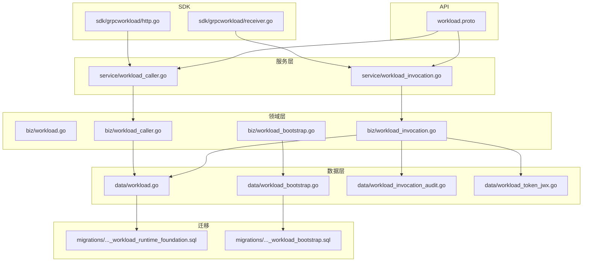
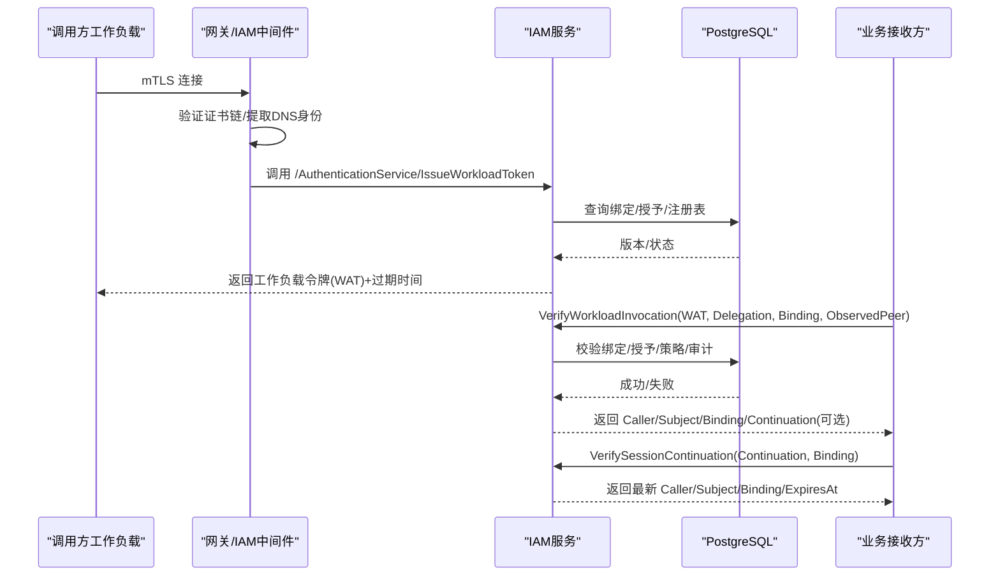
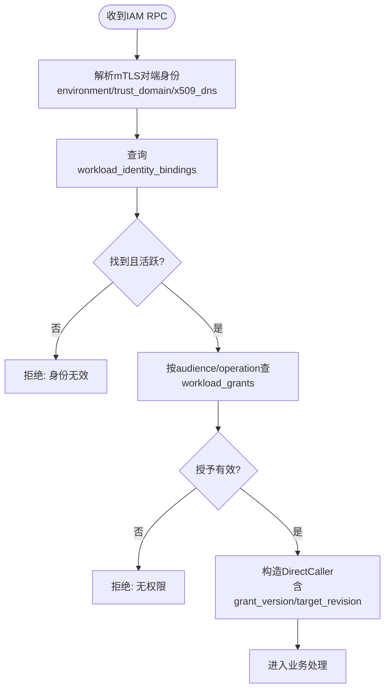
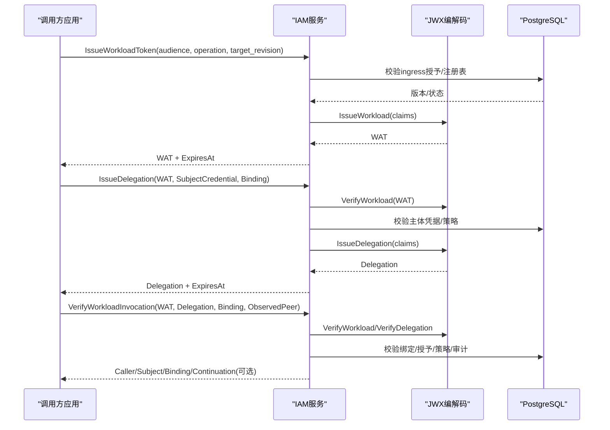
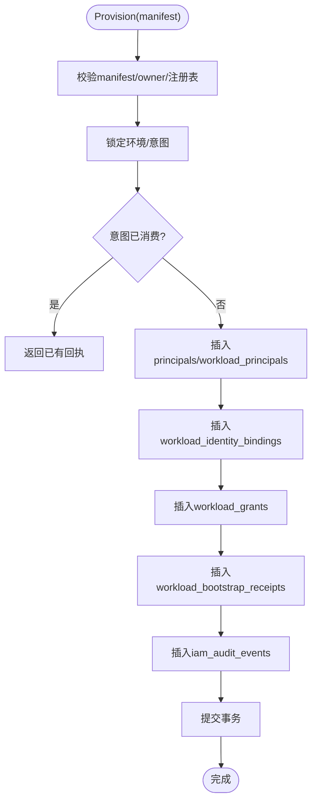
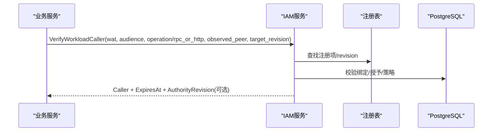
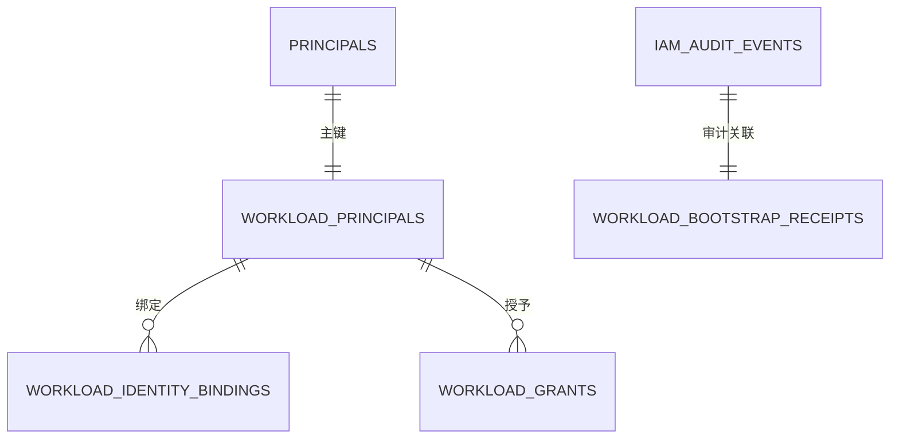
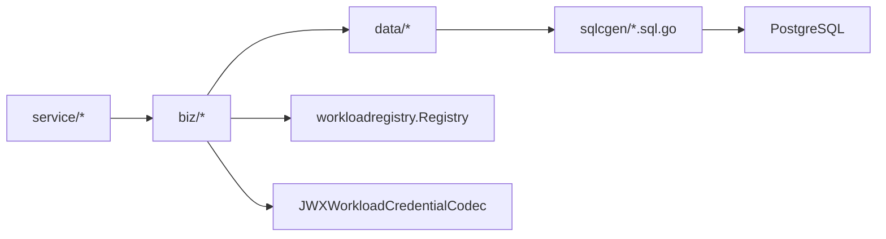

# 工作负载模型

<cite>
**本文引用的文件**
- [workload.proto](file://api/iam/v1/workload.proto)
- [workload.go](file://internal/biz/workload.go)
- [workload_bootstrap.go](file://internal/biz/workload_bootstrap.go)
- [workload_caller.go](file://internal/biz/workload_caller.go)
- [workload_invocation.go](file://internal/biz/workload_invocation.go)
- [202609100001_workload_runtime_foundation.sql](file://migrations/202609100001_workload_runtime_foundation.sql)
- [202609100003_workload_bootstrap.sql](file://migrations/202609100003_workload_bootstrap.sql)
- [workload.go](file://internal/data/workload.go)
- [workload_bootstrap.go](file://internal/data/workload_bootstrap.go)
- [workload_invocation_audit.go](file://internal/data/workload_invocation_audit.go)
- [workload_identity.go](file://internal/server/workload_identity.go)
- [workload_caller.go](file://internal/service/workload_caller.go)
- [workload_invocation.go](file://internal/service/workload_invocation.go)
- [workload_token_jwx.go](file://internal/data/workload_token_jwx.go)
- [http.go](file://sdk/grpcworkload/http.go)
- [receiver.go](file://sdk/grpcworkload/receiver.go)
- [main.go](file://examples/workload-grpc/main.go)
</cite>

## 目录
1. [简介](#简介)
2. [项目结构](#项目结构)
3. [核心组件](#核心组件)
4. [架构总览](#架构总览)
5. [详细组件分析](#详细组件分析)
6. [依赖关系分析](#依赖关系分析)
7. [性能考量](#性能考量)
8. [故障排查指南](#故障排查指南)
9. [结论](#结论)
10. [附录](#附录)

## 简介
本文件系统性阐述 ANI IAM 的工作负载（Workload）模型，覆盖身份与运行时基础、短期令牌与委托机制、注册与引导流程、权限委托模式以及完整的数据流。重点解释 workload_identity_bindings、workload_grants、workload_bootstrap_receipts 等表的作用与字段含义，并给出认证、令牌签发、调用验证的端到端序列图与流程图，帮助读者从业务到实现全面理解。

## 项目结构
ANI IAM 的工作负载能力由四层构成：
- API 层：定义工作负载相关的请求/响应消息与 RPC 方法。
- 服务层：将 gRPC/HTTP 请求映射为领域用例调用。
- 领域层：封装身份解析、授权校验、令牌签发与验证、委托与延续等核心逻辑。
- 数据层：通过 SQLc 生成代码访问 PostgreSQL，完成身份绑定、授予、引导、审计等持久化操作。
- SDK 层：提供 HTTP/gRPC 客户端拦截器，便于业务服务集成工作负载认证与授权。

图表来源
- [workload.proto:1-121](file://api/iam/v1/workload.proto#L1-L121)
- [workload_invocation.go:1-161](file://internal/service/workload_invocation.go#L1-L161)
- [workload_caller.go:1-50](file://internal/service/workload_caller.go#L1-L50)
- [workload.go:1-118](file://internal/biz/workload.go#L1-L118)
- [workload_invocation.go:1-452](file://internal/biz/workload_invocation.go#L1-L452)
- [workload_caller.go:1-114](file://internal/biz/workload_caller.go#L1-L114)
- [workload_bootstrap.go:1-173](file://internal/biz/workload_bootstrap.go#L1-L173)
- [workload.go:1-177](file://internal/data/workload.go#L1-L177)
- [workload_bootstrap.go:1-165](file://internal/data/workload_bootstrap.go#L1-L165)
- [workload_invocation_audit.go:1-32](file://internal/data/workload_invocation_audit.go#L1-L32)
- [workload_token_jwx.go:1-66](file://internal/data/workload_token_jwx.go#L1-L66)
- [202609100001_workload_runtime_foundation.sql:1-89](file://migrations/202609100001_workload_runtime_foundation.sql#L1-L89)
- [202609100003_workload_bootstrap.sql:1-91](file://migrations/202609100003_workload_bootstrap.sql#L1-L91)
- [http.go:1-164](file://sdk/grpcworkload/http.go#L1-L164)
- [receiver.go:57-71](file://sdk/grpcworkload/receiver.go#L57-L71)

章节来源
- [workload.proto:1-121](file://api/iam/v1/workload.proto#L1-L121)
- [workload_invocation.go:1-161](file://internal/service/workload_invocation.go#L1-L161)
- [workload_caller.go:1-50](file://internal/service/workload_caller.go#L1-L50)
- [workload.go:1-118](file://internal/biz/workload.go#L1-L118)
- [workload_invocation.go:1-452](file://internal/biz/workload_invocation.go#L1-L452)
- [workload_caller.go:1-114](file://internal/biz/workload_caller.go#L1-L114)
- [workload_bootstrap.go:1-173](file://internal/biz/workload_bootstrap.go#L1-L173)
- [workload.go:1-177](file://internal/data/workload.go#L1-L177)
- [workload_bootstrap.go:1-165](file://internal/data/workload_bootstrap.go#L1-L165)
- [workload_invocation_audit.go:1-32](file://internal/data/workload_invocation_audit.go#L1-L32)
- [workload_token_jwx.go:1-66](file://internal/data/workload_token_jwx.go#L1-L66)
- [202609100001_workload_runtime_foundation.sql:1-89](file://migrations/202609100001_workload_runtime_foundation.sql#L1-L89)
- [202609100003_workload_bootstrap.sql:1-91](file://migrations/202609100003_workload_bootstrap.sql#L1-L91)
- [http.go:1-164](file://sdk/grpcworkload/http.go#L1-L164)
- [receiver.go:57-71](file://sdk/grpcworkload/receiver.go#L57-L71)

## 核心组件
- 工作负载身份与授权
  - VerifiedWorkloadPeer：经 mTLS 验证后的对端身份元信息（环境、信任域、证书 DNS）。
  - WorkloadIdentity：解析出的 principal_id、binding_id、版本号及 peer。
  - DirectCaller：一次入站鉴权结果，包含身份、目标、授予版本与目标修订号。
  - WorkloadAuthentication/Authorization：负责身份解析与基于注册表的授予检查。
- 工作负载调用与令牌
  - WorkloadInvocation：签发工作负载令牌、签发委托、验证调用、会话延续。
  - JWXWorkloadCredentialCodec：JWK 签名的工作负载令牌、委托与延续凭证编解码。
- 工作负载引导
  - WorkloadBootstrap：校验并执行一次性引导清单，创建 principal、profile、绑定与授予，记录回执与审计。
- 运行时基础
  - 数据库表：workload_identity_bindings、workload_grants、workload_bootstrap_receipts、iam_schema_revision 等。
  - 角色与守卫：限制 provisioner 仅能写入必要表，确保只读运行态。

章节来源
- [workload.go:17-118](file://internal/biz/workload.go#L17-L118)
- [workload_invocation.go:65-144](file://internal/biz/workload_invocation.go#L65-L144)
- [workload_token_jwx.go:18-66](file://internal/data/workload_token_jwx.go#L18-L66)
- [workload_bootstrap.go:25-173](file://internal/biz/workload_bootstrap.go#L25-L173)
- [202609100001_workload_runtime_foundation.sql:1-89](file://migrations/202609100001_workload_runtime_foundation.sql#L1-L89)
- [202609100003_workload_bootstrap.sql:1-91](file://migrations/202609100003_workload_bootstrap.sql#L1-L91)

## 架构总览
工作负载模型围绕“受控入口 + 在线校验 + 短期凭证”展开：
- 入口：IAM 服务通过中间件校验 mTLS 证书链，解析出 VerifiedWorkloadPeer，再根据 IAM 内部授予允许调用 Issue/Verify 等 RPC。
- 在线校验：业务接收方在每次调用前向 IAM 发起 VerifyWorkloadInvocation/VerifyWorkloadCaller，携带 observed_peer、binding、WAT/Delegation，返回可直接使用的 caller/subject 与可选 continuation。
- 短期凭证：工作负载令牌（WAT）有效期短；委托（Delegation）更短且不可刷新；会话延续（Continuation）用于同一接收方的后续重检。

图表来源
- [workload_identity.go:22-49](file://internal/server/workload_identity.go#L22-L49)
- [workload_invocation.go:146-173](file://internal/biz/workload_invocation.go#L146-L173)
- [workload_invocation.go:238-292](file://internal/biz/workload_invocation.go#L238-L292)
- [workload_invocation.go:413-451](file://internal/biz/workload_invocation.go#L413-L451)
- [workload.go:32-65](file://internal/data/workload.go#L32-L65)

## 详细组件分析

### 身份与授权：VerifiedWorkloadPeer、WorkloadIdentity、DirectCaller
- 身份解析：从 mTLS 证书链中提取唯一 DNS，结合 environment/trust_domain 查 workload_identity_bindings，得到 principal_id、binding_id 与版本号。
- 授权检查：依据 workloadregistry 中注册的 audience/operation，查询 workload_grants 是否有效，返回 DirectCaller（含 grant_version 与 target_revision）。
- 上下文传播：通过 WithDirectCaller/DirectCallerFromContext 在链路中传递已授权的入站身份。

图表来源
- [workload_identity.go:22-49](file://internal/server/workload_identity.go#L22-L49)
- [workload.go:32-65](file://internal/data/workload.go#L32-L65)
- [workload.go:87-106](file://internal/biz/workload.go#L87-L106)

章节来源
- [workload_identity.go:22-49](file://internal/server/workload_identity.go#L22-L49)
- [workload.go:17-118](file://internal/biz/workload.go#L17-L118)
- [workload.go:32-65](file://internal/data/workload.go#L32-L65)

### 工作负载令牌与委托：签发与验证
- 签发 WAT：需具备 IAM ingress 授予，目标为 IssueWorkloadToken；校验注册表机制为 Delegated 或 WorkloadOnly；签发短 TTL 的 JWT（类型 ANI-WORKLOAD+JWT），记录审计事件。
- 签发委托：校验 WAT、当前 caller、目标 binding、主体凭据（人类 Session 或工作负载 API Key），签发短 TTL 的委托 JWT（类型 ANI-DELEGATION+JWT），记录审计。
- 验证调用：接收方提供 observed_peer、binding、WAT、Delegation；IAM 校验 WAT/Delegation 一致性、caller/subject 与 binding 匹配、策略版本与授予有效性；若支持延续则返回 continuation。
- 验证调用者（工作负载直验）：适用于工作负载直调场景，校验 WAT 与目标注册项一致，必要时计算 authority revision。

图表来源
- [workload_invocation.go:146-173](file://internal/biz/workload_invocation.go#L146-L173)
- [workload_invocation.go:175-236](file://internal/biz/workload_invocation.go#L175-L236)
- [workload_invocation.go:238-292](file://internal/biz/workload_invocation.go#L238-L292)
- [workload_token_jwx.go:36-66](file://internal/data/workload_token_jwx.go#L36-L66)
- [workload_invocation_audit.go:17-31](file://internal/data/workload_invocation_audit.go#L17-L31)

章节来源
- [workload_invocation.go:146-292](file://internal/biz/workload_invocation.go#L146-L292)
- [workload_token_jwx.go:18-66](file://internal/data/workload_token_jwx.go#L18-L66)
- [workload_invocation_audit.go:17-31](file://internal/data/workload_invocation_audit.go#L17-L31)

### 工作负载引导（Bootstrap）：注册与状态同步
- 输入：WorkloadBootstrapManifest（不含凭据），包含 environment、trust_domain、CA 指纹、到期时间、若干 workloads（principal_id、name、binding_id、dns_identity、grants）。
- 校验：版本、ID 格式、域名/名称合法性、去重、注册表存在性、所有者环境/信任域/CASHA256 匹配、过期时间约束。
- 执行：以事务方式插入 principals、workload_principals、workload_identity_bindings、workload_grants，写入 workload_bootstrap_receipts 与 iam_audit_events，保证幂等与原子性。
- 安全：provisioner 角色受限，触发器禁止越权写入；receipt 防重复消费与环境冲突。

图表来源
- [workload_bootstrap.go:93-167](file://internal/biz/workload_bootstrap.go#L93-L167)
- [workload_bootstrap.go:33-126](file://internal/data/workload_bootstrap.go#L33-L126)
- [workload_bootstrap.sql:1-35](file://internal/data/queries/workload_bootstrap.sql#L1-L35)
- [202609100003_workload_bootstrap.sql:1-91](file://migrations/202609100003_workload_bootstrap.sql#L1-L91)

章节来源
- [workload_bootstrap.go:25-173](file://internal/biz/workload_bootstrap.go#L25-L173)
- [workload_bootstrap.go:33-126](file://internal/data/workload_bootstrap.go#L33-L126)
- [workload_bootstrap.sql:1-35](file://internal/data/queries/workload_bootstrap.sql#L1-L35)
- [202609100003_workload_bootstrap.sql:1-91](file://migrations/202609100003_workload_bootstrap.sql#L1-L91)

### 工作负载调用者验证（工作负载直验）
- 适用场景：工作负载直接调用其他工作负载，无需人类主体。
- 流程：服务端传入 observed_peer、target_revision、rpc_method/http_method+path；IAM 校验注册表、WAT、caller 与 observed_peer 一致性，必要时计算 authority revision。
- 输出：DirectWorkloadCaller、过期时间、authority revision（如有）。

图表来源
- [workload_caller.go:44-113](file://internal/biz/workload_caller.go#L44-L113)
- [workload_caller.go:18-50](file://internal/service/workload_caller.go#L18-L50)

章节来源
- [workload_caller.go:44-113](file://internal/biz/workload_caller.go#L44-L113)
- [workload_caller.go:18-50](file://internal/service/workload_caller.go#L18-L50)

### 数据模型与表结构
- workload_identity_bindings：存储工作负载证书 DNS 与 principal 的绑定关系，含 environment、trust_domain、identity_kind/value、status/version。
- workload_grants：存储工作负载对特定 audience/operation 的授予，含 scope（如 iam_ingress/delegated_session）、status/version。
- workload_bootstrap_receipts：记录引导回执，包含 manifest_id、intent_sha256、receipt JSON、关联审计事件。
- iam_schema_revision：标记当前 schema 版本，供运行时校验。
- iam_audit_events：扩展字段记录 caller_principal_id、caller_binding_id、provisioner_role、bootstrap_manifest_id 等，支持工作负载与引导审计。

图表来源
- [202609100001_workload_runtime_foundation.sql:1-89](file://migrations/202609100001_workload_runtime_foundation.sql#L1-L89)
- [202609100003_workload_bootstrap.sql:1-91](file://migrations/202609100003_workload_bootstrap.sql#L1-L91)

章节来源
- [202609100001_workload_runtime_foundation.sql:1-89](file://migrations/202609100001_workload_runtime_foundation.sql#L1-L89)
- [202609100003_workload_bootstrap.sql:1-91](file://migrations/202609100003_workload_bootstrap.sql#L1-L91)

### 集成示例与最佳实践
- 调用方（gRPC/HTTP）：使用 SDK 获取注册目标、注入工作负载令牌头、调用 IAM 验证并清理敏感头。
- 接收方：使用 ReceiverInterceptor 自动验证 WAT/Delegation/Binding/ObservedPeer，并在上下文中取出 Verified 结果进行资源边界检查。
- 示例程序：examples/workload-grpc 展示了 receiver/caller 两种模式的配置与调用流程。

章节来源
- [http.go:19-39](file://sdk/grpcworkload/http.go#L19-L39)
- [http.go:133-144](file://sdk/grpcworkload/http.go#L133-L144)
- [receiver.go:57-71](file://sdk/grpcworkload/receiver.go#L57-L71)
- [main.go:60-100](file://examples/workload-grpc/main.go#L60-L100)
- [main.go:120-210](file://examples/workload-grpc/main.go#L120-L210)

## 依赖关系分析
- 服务层依赖领域层用例，领域层依赖数据层接口，数据层通过 SQLc 访问数据库。
- 工作负载令牌编解码依赖注册表以校验 claims 合法性。
- 引导流程强依赖 provisioner 角色与数据库触发器，确保最小权限与安全边界。
- 运行时通过 ValidateRuntimeFoundation 校验 schema 版本与角色权限，防止不合规部署。

图表来源
- [workload_invocation.go:131-144](file://internal/biz/workload_invocation.go#L131-L144)
- [workload_token_jwx.go:23-34](file://internal/data/workload_token_jwx.go#L23-L34)
- [workload.go:67-177](file://internal/data/workload.go#L67-L177)

章节来源
- [workload_invocation.go:131-144](file://internal/biz/workload_invocation.go#L131-L144)
- [workload_token_jwx.go:23-34](file://internal/data/workload_token_jwx.go#L23-L34)
- [workload.go:67-177](file://internal/data/workload.go#L67-L177)

## 性能考量
- 短期令牌与委托：WAT 默认最大 TTL 较短，委托更短且不可刷新，降低泄露面与重放风险。
- 在线校验：VerifyWorkloadInvocation/VerifyWorkloadCaller 每次调用均在线校验，避免本地缓存不一致；可通过 continuation 减少多次往返。
- 数据库访问：引导过程使用事务与行级锁，避免并发冲突；运行时仅读取关键表，减少写放大。
- 注册表与策略：通过 revision 控制变更生效，避免频繁全量刷新。

[本节为通用指导，不直接分析具体文件]

## 故障排查指南
- 身份无效：检查 mTLS 证书链、DNS 字段、environment/trust_domain 是否与绑定一致。
- 权限拒绝：核对 workload_grants 是否 active、version 是否匹配、注册表是否启用对应 operation。
- 令牌无效：确认 WAT/Delegation 未过期、issuer/subject/target 与 binding 一致、策略版本匹配。
- 引导冲突：manifest_id 重复或环境已存在 receipt；检查 intent_sha256 与 CA 指纹。
- 运行时不健康：ValidateRuntimeFoundation 失败通常意味着 schema 版本或角色权限不匹配。

章节来源
- [workload_identity.go:93-145](file://internal/server/workload_identity.go#L93-L145)
- [workload_invocation.go:121-140](file://internal/service/workload_invocation.go#L121-L140)
- [workload_bootstrap.go:128-165](file://internal/data/workload_bootstrap.go#L128-L165)
- [workload.go:67-177](file://internal/data/workload.go#L67-L177)

## 结论
ANI IAM 的工作负载模型通过严格的 mTLS 身份解析、细粒度授予检查、短期令牌与委托机制，以及幂等的引导流程，实现了高安全、可审计、可扩展的工作负载间通信与权限委托。配合 SDK 与示例，业务服务可以快速集成并正确落地工作负载认证与授权。

[本节为总结，不直接分析具体文件]

## 附录
- API 消息参考：workload.proto 定义了 InvocationBinding、WorkloadPeer、DirectWorkloadCaller、IssueDelegationRequest/Response、VerifyWorkloadInvocationRequest/Response、VerifySessionContinuationRequest/Response、VerifyWorkloadCallerRequest/Response。
- 错误码映射：服务层将领域错误映射为 gRPC 状态码与原因，便于客户端定位问题。

章节来源
- [workload.proto:10-121](file://api/iam/v1/workload.proto#L10-L121)
- [workload_invocation.go:121-140](file://internal/service/workload_invocation.go#L121-L140)