# 数据模型

<cite>
**本文引用的文件**
- [202609040001_persistence_foundation.sql](file://migrations/202609040001_persistence_foundation.sql)
- [202609040002_target_vertical_slice.sql](file://migrations/202609040002_target_vertical_slice.sql)
- [202609080001_tenant_authorization.sql](file://migrations/202609080001_tenant_authorization.sql)
- [202609080002_permission_catalog.sql](file://migrations/202609080002_permission_catalog.sql)
- [202609100001_workload_runtime_foundation.sql](file://migrations/202609100001_workload_runtime_foundation.sql)
- [202609100002_idempotency.sql](file://migrations/202609100002_idempotency.sql)
- [202609100003_workload_bootstrap.sql](file://migrations/202609100003_workload_bootstrap.sql)
- [models.go](file://internal/data/sqlcgen/models.go)
- [contract.proto](file://api/iam/v1/contract.proto)
- [principal_validation.go](file://internal/biz/principal_validation.go)
- [workload.go](file://internal/data/workload.go)
</cite>

## 目录
1. [简介](#简介)
2. [项目结构](#项目结构)
3. [核心实体与关系](#核心实体与关系)
4. [架构总览](#架构总览)
5. [详细组件分析](#详细组件分析)
6. [依赖关系分析](#依赖关系分析)
7. [性能考虑](#性能考虑)
8. [故障排查指南](#故障排查指南)
9. [结论](#结论)
10. [附录](#附录)

## 简介
本文件系统化梳理 ANI IAM 的数据模型，覆盖 Principal、Session、Tenant、Role、Permission 等关键实体的表结构、字段定义、数据类型、约束条件与索引策略；阐述数据验证规则、业务规则与完整性约束；提供数据库 Schema 图、ER 关系图与样本数据说明；并总结数据访问模式、缓存策略与性能优化要点，以及迁移路径、版本管理与向后兼容性策略。

## 项目结构
IAM 的数据模型由一组按时间顺序执行的 SQL 迁移脚本构成，配合 sqlc 生成的 Go 类型（models.go）与 API 契约（contract.proto）共同描述领域模型。运行时通过受限角色 ani_iam_runtime 访问必要表，平台侧使用独立角色进行引导与治理。

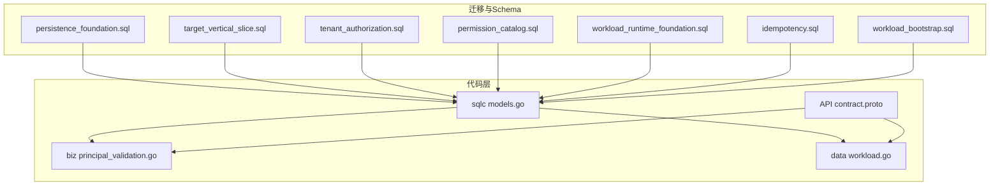

图表来源
- [202609040001_persistence_foundation.sql:1-148](file://migrations/202609040001_persistence_foundation.sql#L1-L148)
- [202609040002_target_vertical_slice.sql:1-175](file://migrations/202609040002_target_vertical_slice.sql#L1-L175)
- [202609080002_permission_catalog.sql:1-159](file://migrations/202609080002_permission_catalog.sql#L1-L159)
- [202609100001_workload_runtime_foundation.sql:1-89](file://migrations/202609100001_workload_runtime_foundation.sql#L1-L89)
- [202609100002_idempotency.sql:1-21](file://migrations/202609100002_idempotency.sql#L1-L21)
- [202609100003_workload_bootstrap.sql:1-91](file://migrations/202609100003_workload_bootstrap.sql#L1-L91)
- [models.go:1-800](file://internal/data/sqlcgen/models.go#L1-L800)
- [contract.proto:1-212](file://api/iam/v1/contract.proto#L1-L212)

章节来源
- [202609040001_persistence_foundation.sql:1-148](file://migrations/202609040001_persistence_foundation.sql#L1-L148)
- [202609040002_target_vertical_slice.sql:1-175](file://migrations/202609040002_target_vertical_slice.sql#L1-L175)
- [202609080002_permission_catalog.sql:1-159](file://migrations/202609080002_permission_catalog.sql#L1-L159)
- [202609100001_workload_runtime_foundation.sql:1-89](file://migrations/202609100001_workload_runtime_foundation.sql#L1-L89)
- [202609100002_idempotency.sql:1-21](file://migrations/202609100002_idempotency.sql#L1-L21)
- [202609100003_workload_bootstrap.sql:1-91](file://migrations/202609100003_workload_bootstrap.sql#L1-L91)
- [models.go:1-800](file://internal/data/sqlcgen/models.go#L1-L800)
- [contract.proto:1-212](file://api/iam/v1/contract.proto#L1-L212)

## 核心实体与关系
本节聚焦 IAM 的核心实体：Principal、Tenant、Membership、Role、Permission、Session、Grant、Audit、Workload Identity/Grant、Bootstrap Receipt 等，并说明其字段、约束与索引。

### 主体与租户
- principals：主体（人类或工作负载），含状态、版本号、时间戳，ID 为 UUIDv7。
- tenant_access：租户边界与生命周期门控，含状态、版本、时间戳。
- tenant_memberships：成员关系，绑定 principal 到租户，支持 active/suspended/removed，唯一活跃成员约束。
- tenant_roles：租户内角色定义，支持系统角色与自定义，code 唯一。
- tenant_role_bindings：成员到角色的绑定，支持延迟外键约束。

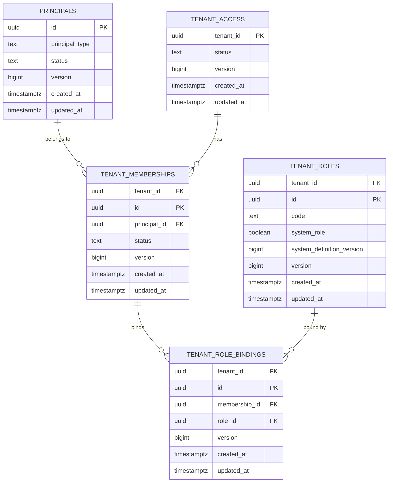

图表来源
- [202609040001_persistence_foundation.sql:17-99](file://migrations/202609040001_persistence_foundation.sql#L17-L99)

章节来源
- [202609040001_persistence_foundation.sql:17-99](file://migrations/202609040001_persistence_foundation.sql#L17-L99)

### 权限目录与角色权限
- permission_catalog：平台级权限目录（scope/resource/action），作为权限白名单。
- tenant_role_permissions：租户角色可拥有的权限项，后扩展 scope 并受 catalog 约束。

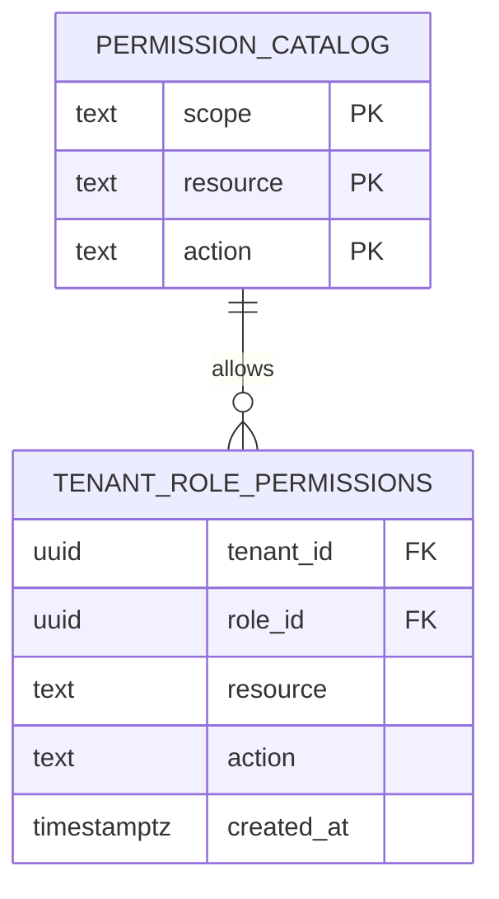

图表来源
- [202609080002_permission_catalog.sql:5-159](file://migrations/202609080002_permission_catalog.sql#L5-L159)

章节来源
- [202609080002_permission_catalog.sql:5-159](file://migrations/202609080002_permission_catalog.sql#L5-L159)

### 会话与令牌
- sessions：人类会话，包含 audience、设备名、过期时间、状态、版本。
- session_grants：会话在特定租户边界的授权，每个会话在每个租户仅一个活跃 grant。
- refresh_token_families / refresh_tokens：刷新令牌族与具体令牌，支持状态机与过期控制。

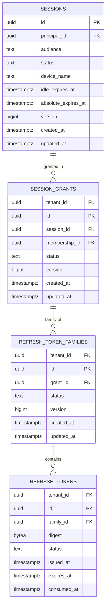

图表来源
- [202609040002_target_vertical_slice.sql:75-159](file://migrations/202609040002_target_vertical_slice.sql#L75-L159)

章节来源
- [202609040002_target_vertical_slice.sql:75-159](file://migrations/202609040002_target_vertical_slice.sql#L75-L159)

### 审计事件
- iam_audit_events：不可变追加式审计日志，记录认证方法、边界、动作、目标、结果、原因、请求/关联/决策ID、来源服务、发生/记录时间，支持调用者上下文（工作负载）。

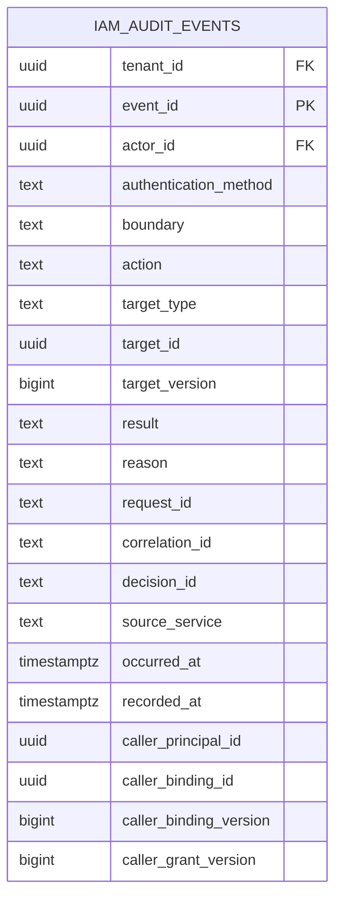

图表来源
- [202609040001_persistence_foundation.sql:100-137](file://migrations/202609040001_persistence_foundation.sql#L100-L137)
- [202609100001_workload_runtime_foundation.sql:63-80](file://migrations/202609100001_workload_runtime_foundation.sql#L63-L80)

章节来源
- [202609040001_persistence_foundation.sql:100-137](file://migrations/202609040001_persistence_foundation.sql#L100-L137)
- [202609100001_workload_runtime_foundation.sql:63-80](file://migrations/202609100001_workload_runtime_foundation.sql#L63-L80)

### 工作负载身份与授权
- workload_principals：工作负载主体（环境+信任域）。
- workload_identity_bindings：工作负载证书/身份绑定，唯一性约束于环境、信任域、身份种类与值。
- workload_grants：工作负载对 IAM 的入站操作授权，限定 audience、operation、scope。
- workload_bootstrap_receipts：工作负载引导回执，关联审计事件。

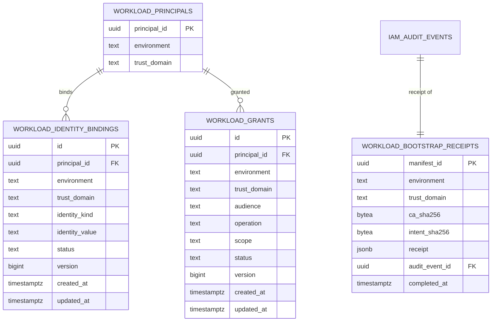

图表来源
- [202609100001_workload_runtime_foundation.sql:1-36](file://migrations/202609100001_workload_runtime_foundation.sql#L1-L36)
- [202609100003_workload_bootstrap.sql:43-56](file://migrations/202609100003_workload_bootstrap.sql#L43-L56)

章节来源
- [202609100001_workload_runtime_foundation.sql:1-36](file://migrations/202609100001_workload_runtime_foundation.sql#L1-L36)
- [202609100003_workload_bootstrap.sql:43-56](file://migrations/202609100003_workload_bootstrap.sql#L43-L56)

### 幂等性与变更结果
- tenant_mutation_results：租户侧幂等结果存储，限制操作集合，结果大小限制，24小时过期。

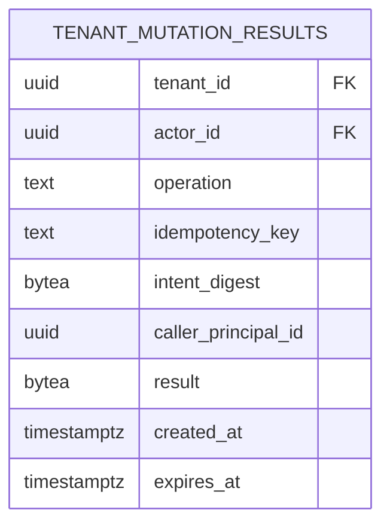

图表来源
- [202609100002_idempotency.sql:1-21](file://migrations/202609100002_idempotency.sql#L1-L21)

章节来源
- [202609100002_idempotency.sql:1-21](file://migrations/202609100002_idempotency.sql#L1-L21)

## 架构总览
IAM 数据层以 PostgreSQL 为核心持久化，采用“最小权限”原则：
- 迁移阶段由隔离 bootstrap superuser 执行，运行时实例不执行迁移。
- 运行时角色 ani_iam_runtime 仅获得必要表的 SELECT/INSERT/UPDATE/DELETE 权限。
- 平台引导角色 ani_iam_provisioner 拥有受限写入能力，用于创建 Workload Principal 与相关引导数据。
- 所有敏感操作均记录至 iam_audit_events，形成不可变审计轨迹。

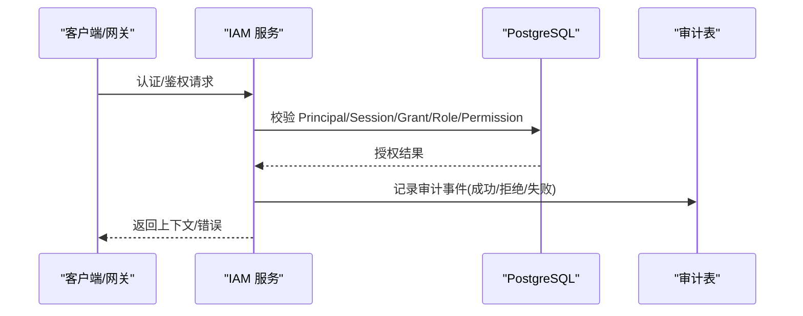

图表来源
- [202609040001_persistence_foundation.sql:139-148](file://migrations/202609040001_persistence_foundation.sql#L139-L148)
- [202609080001_tenant_authorization.sql:1-7](file://migrations/202609080001_tenant_authorization.sql#L1-L7)
- [202609100001_workload_runtime_foundation.sql:63-80](file://migrations/202609100001_workload_runtime_foundation.sql#L63-L80)

## 详细组件分析

### 主体与会话生命周期
- 主体状态：active/disabled；会话状态：active/revoked/expired；成员状态：active/suspended/removed；租户访问状态：bootstrap_pending/active/suspended。
- 验证流程：基于凭证类型（access token 或 API key）分别校验，检查主体、成员、租户访问、生命周期新鲜度与活跃性，最终产出可信上下文并记录审计。

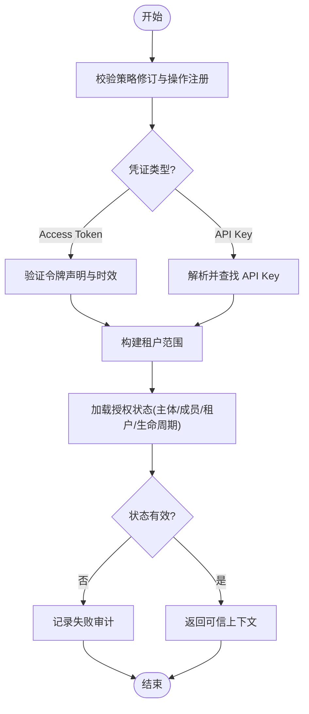

图表来源
- [principal_validation.go:80-118](file://internal/biz/principal_validation.go#L80-L118)
- [principal_validation.go:120-239](file://internal/biz/principal_validation.go#L120-L239)
- [principal_validation.go:241-329](file://internal/biz/principal_validation.go#L241-L329)
- [principal_validation.go:331-405](file://internal/biz/principal_validation.go#L331-L405)

章节来源
- [principal_validation.go:80-405](file://internal/biz/principal_validation.go#L80-L405)

### 权限目录与角色权限绑定
- 权限目录集中管理 scope/resource/action 三元组，确保权限白名单一致性。
- 租户角色权限通过外键引用目录，防止非法权限注入。
- 运行时无需维护目录，仅读取并使用。

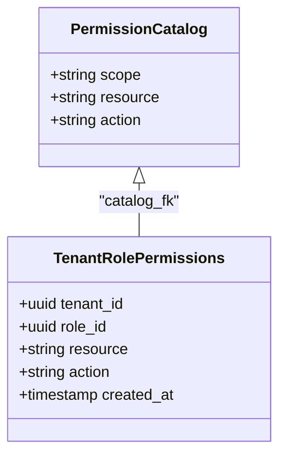

图表来源
- [202609080002_permission_catalog.sql:5-159](file://migrations/202609080002_permission_catalog.sql#L5-L159)

章节来源
- [202609080002_permission_catalog.sql:5-159](file://migrations/202609080002_permission_catalog.sql#L5-L159)

### 工作负载身份与授权校验
- 工作负载身份通过 x509_dns 绑定，唯一约束于环境、信任域、身份种类与值。
- 授权校验时结合注册表（audience/operation）与数据库中的 grants，返回版本用于后续一致性检查。
- 引导过程生成 receipt 并关联审计事件，确保可追溯。

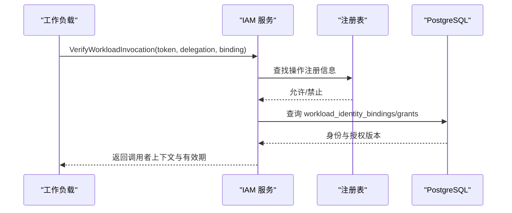

图表来源
- [workload.go:32-65](file://internal/data/workload.go#L32-L65)
- [202609100001_workload_runtime_foundation.sql:1-36](file://migrations/202609100001_workload_runtime_foundation.sql#L1-L36)

章节来源
- [workload.go:32-65](file://internal/data/workload.go#L32-L65)
- [202609100001_workload_runtime_foundation.sql:1-36](file://migrations/202609100001_workload_runtime_foundation.sql#L1-L36)

### 幂等性与变更结果
- 租户侧写操作通过 tenant_mutation_results 实现幂等，限制操作集合与结果大小，24小时过期清理。
- 支持调用者上下文（caller_principal_id）与工作负载调用场景。

章节来源
- [202609100002_idempotency.sql:1-21](file://migrations/202609100002_idempotency.sql#L1-L21)

## 依赖关系分析
- 表间外键约束严格，多数设置为 RESTRICT，避免级联删除导致不一致。
- 部分多对多关系使用延迟外键（DEFERRABLE INITIALLY DEFERRED）以支持事务内循环依赖。
- 运行时角色权限最小化，仅授予必要表的读写权限；审计表仅允许 INSERT。
- 工作负载引导与审计强关联，receipt 必须关联审计事件。

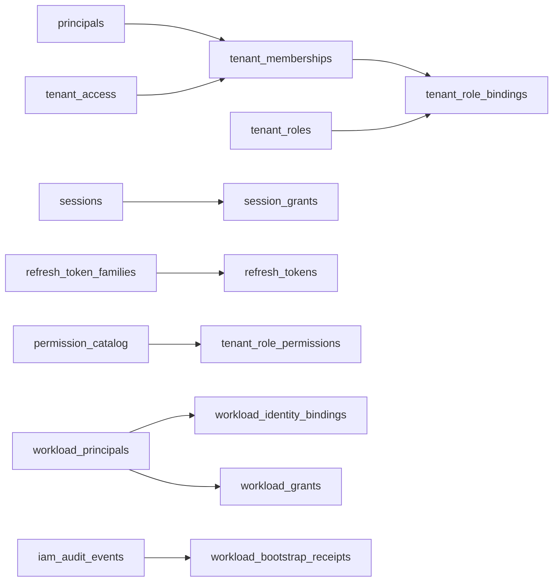

图表来源
- [202609040001_persistence_foundation.sql:17-99](file://migrations/202609040001_persistence_foundation.sql#L17-L99)
- [202609040002_target_vertical_slice.sql:75-159](file://migrations/202609040002_target_vertical_slice.sql#L75-L159)
- [202609080002_permission_catalog.sql:5-159](file://migrations/202609080002_permission_catalog.sql#L5-L159)
- [202609100001_workload_runtime_foundation.sql:1-36](file://migrations/202609100001_workload_runtime_foundation.sql#L1-L36)
- [202609100003_workload_bootstrap.sql:43-56](file://migrations/202609100003_workload_bootstrap.sql#L43-L56)

章节来源
- [202609040001_persistence_foundation.sql:17-99](file://migrations/202609040001_persistence_foundation.sql#L17-L99)
- [202609040002_target_vertical_slice.sql:75-159](file://migrations/202609040002_target_vertical_slice.sql#L75-L159)
- [202609080002_permission_catalog.sql:5-159](file://migrations/202609080002_permission_catalog.sql#L5-L159)
- [202609100001_workload_runtime_foundation.sql:1-36](file://migrations/202609100001_workload_runtime_foundation.sql#L1-L36)
- [202609100003_workload_bootstrap.sql:43-56](file://migrations/202609100003_workload_bootstrap.sql#L43-L56)

## 性能考虑
- 索引策略
  - tenant_memberships 上针对 (tenant_id, principal_id) 的活跃成员唯一索引，加速成员查询与冲突检测。
  - tenant_role_bindings 上 (tenant_id, membership_id, id) 索引，优化角色绑定查找。
  - iam_audit_events 上 (tenant_id, recorded_at DESC, event_id) 索引，支持按租户倒序审计检索。
  - sessions 上 (principal_id, status, id) 索引，优化会话列表与状态过滤。
  - session_grants 上 (tenant_id, session_id, id) 索引，以及活跃 grant 的唯一索引，保证每会话每租户仅一个活跃授权。
  - refresh_tokens 上 (tenant_id, family_id, status, id) 索引，优化刷新令牌族查询。
  - tenant_role_permissions 上 (tenant_id, resource, action, role_id) 索引，加速权限判定。
- 数据访问模式
  - 读多写少：会话、成员、角色、权限多为读路径；审计与幂等结果为追加写。
  - 短事务：认证/鉴权路径尽量保持事务简短，减少锁竞争。
- 缓存策略
  - 业务层未引入应用级缓存；幂等结果表提供短期缓存语义（24小时）。
  - Redis 用于登录限流与 API Key 使用聚合（非本模型核心，但影响整体性能）。
- 优化建议
  - 定期归档历史审计事件，避免单表过大。
  - 监控慢查询，关注 tenant_memberships 与 session_grants 的高并发更新路径。
  - 合理设置连接池与超时，避免长事务阻塞。

章节来源
- [202609040001_persistence_foundation.sql:53-98](file://migrations/202609040001_persistence_foundation.sql#L53-L98)
- [202609040002_target_vertical_slice.sql:92-159](file://migrations/202609040002_target_vertical_slice.sql#L92-L159)
- [202609040002_target_vertical_slice.sql:60-73](file://migrations/202609040002_target_vertical_slice.sql#L60-L73)

## 故障排查指南
- 常见错误与原因
  - 凭证无效：access token 或 API key 校验失败，检查状态、过期时间与主体/成员/租户状态。
  - 权限不足：操作未注册或不在权限目录中，检查 policy 与 permission_catalog。
  - 租户未就绪：租户生命周期非 active 或不新鲜，检查 tenant_lifecycle_projections 与 fresh_until。
  - 会话/授权失效：session/grant 状态非 active 或版本不匹配，检查 session_grants 与版本字段。
- 审计定位
  - 通过 iam_audit_events 的 decision_id、request_id、correlation_id 追踪请求链路。
  - 工作负载调用可通过 caller_principal_id、caller_binding_id、caller_grant_version 定位调用者与授权版本。
- 权限与角色
  - 确认 tenant_role_bindings 是否正确绑定，role 是否存在且有效。
  - 检查 tenant_role_permissions 是否引用了 permission_catalog 中的合法三元组。

章节来源
- [principal_validation.go:80-405](file://internal/biz/principal_validation.go#L80-L405)
- [202609040001_persistence_foundation.sql:100-137](file://migrations/202609040001_persistence_foundation.sql#L100-L137)
- [202609080002_permission_catalog.sql:5-159](file://migrations/202609080002_permission_catalog.sql#L5-L159)

## 结论
ANI IAM 的数据模型以严格的约束与清晰的边界为核心，围绕 Principal、Tenant、Role、Permission、Session、Grant 构建了高内聚、低耦合的领域模型。通过最小权限的运行时角色、不可变审计日志与幂等结果表，实现了安全、可观测与可扩展的认证鉴权体系。迁移脚本按阶段演进，配合版本标记与运行时基础校验，保障了向后兼容与部署稳定性。

## 附录

### 数据库 Schema 图（概念）
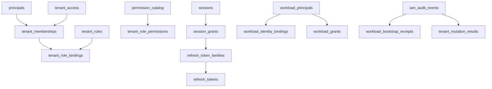

图表来源
- [202609040001_persistence_foundation.sql:17-148](file://migrations/202609040001_persistence_foundation.sql#L17-L148)
- [202609040002_target_vertical_slice.sql:75-159](file://migrations/202609040002_target_vertical_slice.sql#L75-L159)
- [202609080002_permission_catalog.sql:5-159](file://migrations/202609080002_permission_catalog.sql#L5-L159)
- [202609100001_workload_runtime_foundation.sql:1-36](file://migrations/202609100001_workload_runtime_foundation.sql#L1-L36)
- [202609100002_idempotency.sql:1-21](file://migrations/202609100002_idempotency.sql#L1-L21)
- [202609100003_workload_bootstrap.sql:43-56](file://migrations/202609100003_workload_bootstrap.sql#L43-L56)

### ER 关系图（核心）
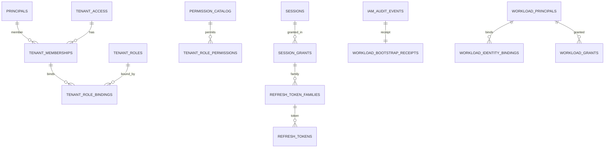

图表来源
- [202609040001_persistence_foundation.sql:17-99](file://migrations/202609040001_persistence_foundation.sql#L17-L99)
- [202609040002_target_vertical_slice.sql:75-159](file://migrations/202609040002_target_vertical_slice.sql#L75-L159)
- [202609080002_permission_catalog.sql:5-159](file://migrations/202609080002_permission_catalog.sql#L5-L159)
- [202609100001_workload_runtime_foundation.sql:1-36](file://migrations/202609100001_workload_runtime_foundation.sql#L1-L36)
- [202609100003_workload_bootstrap.sql:43-56](file://migrations/202609100003_workload_bootstrap.sql#L43-L56)

### 样本数据说明
- principals：示例 human 与 workload 主体，status 为 active，version 从 1 递增。
- tenant_access：示例租户，status 为 active。
- tenant_memberships：将 human 主体加入租户，status 为 active。
- tenant_roles：创建系统角色（如 viewer/admin），system_role=true。
- tenant_role_bindings：将成员绑定到角色。
- sessions：创建人类会话，audience 为 console 或 boss，设置过期时间。
- session_grants：为会话在租户边界创建活跃 grant。
- refresh_token_families/tokens：为 grant 创建刷新令牌族与令牌。
- iam_audit_events：记录认证成功/失败的审计事件。
- workload_principals/bindings/grants：创建工作负载主体、身份绑定与授权。
- tenant_mutation_results：记录幂等操作的结果。

章节来源
- [202609040001_persistence_foundation.sql:17-148](file://migrations/202609040001_persistence_foundation.sql#L17-L148)
- [202609040002_target_vertical_slice.sql:75-159](file://migrations/202609040002_target_vertical_slice.sql#L75-L159)
- [202609080002_permission_catalog.sql:5-159](file://migrations/202609080002_permission_catalog.sql#L5-L159)
- [202609100001_workload_runtime_foundation.sql:1-36](file://migrations/202609100001_workload_runtime_foundation.sql#L1-L36)
- [202609100002_idempotency.sql:1-21](file://migrations/202609100002_idempotency.sql#L1-L21)
- [202609100003_workload_bootstrap.sql:43-56](file://migrations/202609100003_workload_bootstrap.sql#L43-L56)

### 数据访问模式与缓存策略
- 访问模式
  - 认证路径：校验凭证 -> 加载授权状态 -> 返回上下文。
  - 鉴权路径：基于 permission_catalog 与角色权限判断资源操作。
  - 审计路径：所有认证/鉴权结果写入 iam_audit_events。
- 缓存策略
  - 无应用级缓存；幂等结果表提供短期缓存语义。
  - Redis 用于登录限流与 API Key 使用聚合（外部依赖）。

章节来源
- [principal_validation.go:80-405](file://internal/biz/principal_validation.go#L80-L405)
- [202609100002_idempotency.sql:1-21](file://migrations/202609100002_idempotency.sql#L1-L21)

### 迁移路径、版本管理与向后兼容性
- 迁移路径
  - 基础持久化 -> 垂直切片（会话/令牌/密码）-> 租户授权 -> 权限目录 -> 工作负载运行时基础 -> 幂等结果 -> 工作负载引导。
- 版本管理
  - iam_schema_revision 表记录当前 schema 版本，运行时启动时校验版本与角色权限。
  - 迁移脚本通过注释标识 DP/WR 编号，便于追踪变更来源。
- 向后兼容性
  - 新增字段默认值与 CHECK 约束确保旧数据兼容。
  - 延迟外键与 RESTRICT 策略避免破坏性变更。
  - 权限目录集中管理，新增权限需显式添加，避免隐式授权。

章节来源
- [202609040001_persistence_foundation.sql:1-148](file://migrations/202609040001_persistence_foundation.sql#L1-L148)
- [202609040002_target_vertical_slice.sql:1-175](file://migrations/202609040002_target_vertical_slice.sql#L1-L175)
- [202609080002_permission_catalog.sql:1-159](file://migrations/202609080002_permission_catalog.sql#L1-L159)
- [202609100001_workload_runtime_foundation.sql:82-89](file://migrations/202609100001_workload_runtime_foundation.sql#L82-L89)
- [202609100002_idempotency.sql:1-21](file://migrations/202609100002_idempotency.sql#L1-L21)
- [202609100003_workload_bootstrap.sql:1-91](file://migrations/202609100003_workload_bootstrap.sql#L1-L91)